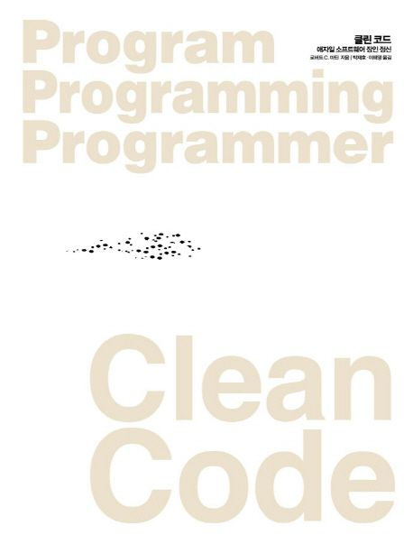

# Clean Code

[Clean Code](https://product.kyobobook.co.kr/detail/S000001032980) 책을 요약한 내용입니다.

<figure><figcaption></figcaption></figure>

[2. 의미 있는 이름(Meaningful name)](https://data-make.tistory.com/632)

[3. 함수(Function)](https://data-make.tistory.com/633)

[4. 주석(comment)](https://data-make.tistory.com/634)

[5. 형식 맞추기(Formatting)](https://data-make.tistory.com/635)

[6. 객체와 자료 구조(Object and data structure)](https://data-make.tistory.com/636)

[7. 오류 처리](https://data-make.tistory.com/637)

[8. 경계(외부 API)](https://data-make.tistory.com/638)

[9. 단위 테스트](https://data-make.tistory.com/640)

[10. 클래스(Class)](https://data-make.tistory.com/641)

[11. 시스템(System)](https://data-make.tistory.com/644)

[12. 창발성(emergent creativity)](https://data-make.tistory.com/645)

[13. 동시성(concurrent)](https://data-make.tistory.com/646)

[14. 점진적인 개선](https://data-make.tistory.com/647)

> Reference
>
> [https://github.com/ludwiggj/CleanCode](https://github.com/ludwiggj/CleanCode)
>
> [https://github.com/Yooii-Studios/Clean-Code](https://github.com/Yooii-Studios/Clean-Code)
