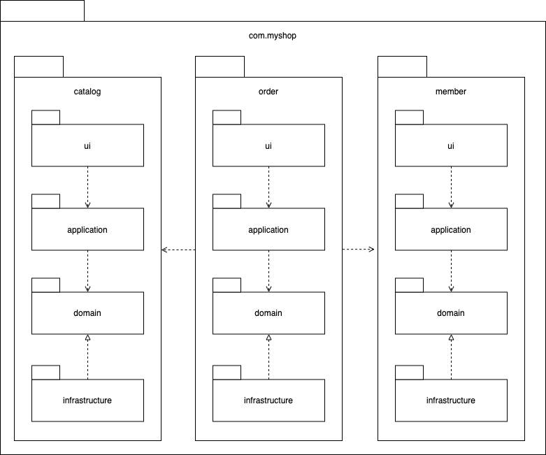

# 네 개의 영역

|영역|설명|
|:---|:---|
|표현(Presentation) / Controller |사용자의 요청을 처리하고 사용자에게 정보를 보여준다. 여기서 사용자는 소프트웨어를 사용하는 사람뿐만 아니라 외부 시스템일 수도 있음|
|응용(Application) / Service|사용자가 요청한 기능을 실행. 업무 로직을 직접 구현하지 않으며 도메인 계층을 조합해서 기능을 실행|
|도메인(Domain) / 엔티티|시스템이 제공할 도메인 규칙을 구현|
|인프라스트럭처(Infrastructure)|데이터베이스나 메시징 시스템과 같은 외부 시스템과의 연동을 처리|

표현, 응용, 도메인, 인프라스트럭처는 아키텍처 설계 시 출현하는 전형적인 네 가지 영역.

<figure><figcaption></figcaption></figure>

# DIP

- DIP를 적용하면 **저수준 모듈(구현체)이 고수준 모듈(인터페이스)에 의존**
- 고수준 모듈이 저수준 모듈을 사용하려면 고수준 모듈이 저수준 모듈에 의존해야 하지만,
  - 반대로 저수준 모듈이 고수준 모듈에 의존한다고 하여 `의존 역전 원칙`(`DIP`, Dependency Inversion Principle)이라고 부른다.
- DIP를 적용하면 다른 영역이 인프라스트럭처 영역에 의존할 때 발생할 수 있는 `구현 교체가 어렵고, 테스트가 어려운 문제를 해결`할 수 있다.
  - 사용할 저수준 모듈을 변경해도 고수준 모듈을 수정할 필요가 없다.
  - 구현 클래스가 없어도 테스트 대역을 이용해 거의 모든 기능 테스트가 가능하다.

> 주의. 추상화한 인터페이슨느 저수준 모듈이 아닌 고수준 모듈에 위치시키자.

- 아키텍처 수준에서 DIP를 적용하면 `인프라스트럭처` 영역이 `응용 영역`과 `도메인 영역`에 의존하는 구조가 된다.
- 사용하는 구현 기술에 따라 완벽한 DIP를 적용하기보다는 구현 기술에 의존적인 코드를 도메인에 일부 포함하는 게 효과적일 때도 있다.

# 도메인 영역의 주요 구성요소

|요소|설명|
|:---|:---|
|엔티티(ENTITY)|고유의 식별자를 갖는 객체로 자신의 라이프 사이클을 갖는다. 주문, 회원, 상품과 같이 도메인의 고유한 개념을 표현한다. 도메인 모델의 데이터를 포함하며 해당 데이터와 관련된 기능을 함께 제공한다.|
|밸류(VALUE)|고유의 식별자를 갖지 않는 객체로 주로 개념적으로 하나인 값을 표현할 때 사용된다. 배송지 주소를 표현하기 위한 주소나 구매 금액을 위한 금액과 같은 타입이 밸류 타입이다. 엔티티의 속성으로 사용할 뿐만 아니라 다른 밸류 타입의 속성으로도 사용할 수 있다.|
|애그리거트 (AGGREGATE)|애그리거트는 연관된 엔티티와 밸류 객체를 개념적으로 하나로 묶은 것이다. 예를 들어 주문과 관련된 Order 엔티티, OrderLine 밸류, Orderer 밸류 객체를 '주문' 애그리거트로 묶을 수 있다.|
|리포지터리 (REPOSITORY)|도메인 모델의 영속성을 처리한다. 예를 들어 DBMS 테이블에서 엔티티 객체를 로딩하거나 저장하는 기능을 제공한다.|
|도메인 서비스(DOMAIN SERVICE)|특정 엔티티에 속하지 않는 도메인 로직을 제공한다. '할인 금액 계산'은 상품, 쿠폰, 회원 등급, 구매 금액 등 다양한 조건을 이용해서 구현하게 되는데, 이렇게 도메인 로직이 여러 엔티티와 밸류를 필요로 하면 도메인 서비스에서 로직을 구현한다.|

**엔티티**

- `DB 테이블의 엔티티`와 `도메인 모델의 엔티티`의 가장 큰 차이점
  - 도메인 모델의 엔티티는 **데이터와 함께 도메인 기능을 제공**
  - 도메인 모델의 엔티티는 **두 개 이상의 데이터가 개념적으로 하나인 경우 밸류 타입을 이용해서 표현** 가능
  - 도메인 모델의 엔티티는 단순히 데이터를 담고 있는 구조라기보다 **데이터와 함께 기능을 제공하는 객체**

**밸류**

- 밸류는 **불변으로 구현**할 것을 권장
- 밸류 타입 데이터를 변경할 때는 **객체 자체를 완전히 교체**한다는 것을 의미

**애그리거트**

- 도메인 모델에서 **전체 구조를 이해하는데 도움이 되는 것**이 바로 애그리거트
- 애그리거트는 관련 객체를 하나로 묶은 **군집**
- 애그리거트는 군집에 속한 객체를 관리하는 **루트 엔티티**를 가짐
  - 루트 엔티티는 애그리거트에 속해 있는 엔티티와 밸류 객체를 이용해서 **애그리거트가 구현해야 할 기능을 제공**
  - ex) 주문 애그리거트는 Order(루트 엔티티)를 통하지 않고 ShippingInfo를 변경할 수 있는 방법을 제공하지 않는다.

**리포지터리**

- 리포지터리 **인터페이스는 도메인 모델 영역**에 속하며, 실제 **구현 클래스는 인프라스트럭처 영역**에 속한다.

# 요청 처리 흐름

<figure><figcaption></figcaption></figure>

# 인프라스트럭처 개요

인프라스트럭처는 `표현 영역`, `응용 영역`, `도메인 영역`을 지원
- 도메인 객체의 영속성 처리, 트랜잭션, SMTP Client, Rest Client 등 다른 영역에서 필요로 하는 프레임워크, 구현 기술, 보조 기능을 지원

DIP에서 도메인 영역과 응용 영역에서 인프라스트럭처의 기능을 직접 사용하는 것보다 두 영역에서 정의한 인터페이스를 **인프라스트럭처 영역에서 구현하는 것**이 시스템을 더 유연하고 테스트하기 쉽게 만들어 준다고 했다.

하지만, 무조건 인프라스트럭처에 대한 의존을 없앨 필요는 없다. 

스프링을 사용할 경우 오히려 
- 트랜잭션 처리를 위해 `@Transactional`
- 영속성 처리를 위해 JPA를 사용할 경우 `@Entity`, `@Table` 같은 JPA 전용 애너테이션을 도메인 모델 클래스에 사용하는 것이 더 편리한다.

DIP 장점을 해치지 않는 범위에서 **응용 영역과 도메인 영역에서 구현 기술에 대한 의존**을 가져가는 것도 나쁘지 않다.

응용 영역과 도메인 영역이 인프라스트럭처에 대한 의존을 완전히 갖지 않도록 시도하는 것은 자칫 **구현을 더 복잡하고 어렵게 만들 수 있다**.

# 모듈 구성

아키텍처의 각 영역은 별도 패키지에 위치한다.

도메인이 크다면 **하위 도메인으로 나누고** 각 **하위 도메인마다 별도 패키지를 구성**할 수 있다.

<figure><figcaption></figcaption></figure>

```bash
├── com.myshop
│   ├── catalog
│   │   ├── ui
│   │   ├── application
│   │   ├── domain
│   │   └── infrastructure
│   ├── order
│   │   ├── ui
│   │   ├── application
│   │   ├── domain
│   │   └── infrastructure
│   └── member
│       ├── ui
│       ├── application
│       ├── domain
│       └── infrastructure
└── 
```

도메인 모듈은 도메인에 속한 애그리거트를 기준으로 다시 패키지를 구성

카탈로그 하위 도메인이 상품 애그리거트와 카테고리 애그리거트로 구성될 경우 도메인을 두 개의 하위 패키지로 구성할 수 있다.

하위 도메인을 하위 패키지로 구성하면 아래와 같다.

<figure><figcaption></figcaption></figure>

```bash
├── com.myshop
│   └── catalog
│       ├── ui
│       └──  application
│            ├── domain
│            │   ├── product
│            │   └── category
│            └── infrastructure
└── 
```

**애그리거트, 모델, 리포지터리는 같은 패키지**에 위치시키자.

예를 들어, 주문과 관련된 Order, OrderLine, Orderer, OrderRepository 등은 `com.myshop.order.domain` 패키지에 위치

도메인이 복잡하다면 도메인 모델과 도메인 서비스를 별도 패키지에 위치시킬 수도 있다.
- `com.myshop.order.domain.order` : 애그리거트 위치
- `com.myshop.order.doamin.service` : 도메인 서비스 위치

응용 서비스도 도메인 별로 패키지를 구분할 수 있다.

- `com.myshop.catalog.application.product`
- `com.myshop.catalog.application.category`

모듈 구조의 세분화에 대해 정해진 규칙은 없지만, 한 패키지에 너무 많은 타입이 몰려서 코드를 찾기 불편할 정도만 아니면 된다.

한 패키지에 가능하면 10~15개 미만으로 타입 개수를 유지하려고 노력해보자.

이 개수가 넘어가면 패키지를 분리해야 하는 신호일 수 있다.