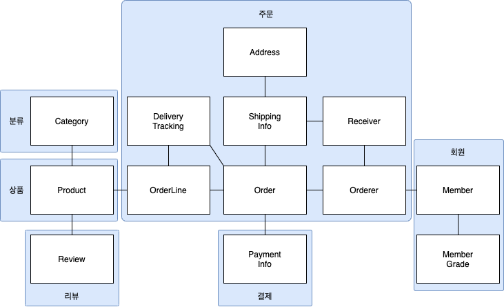
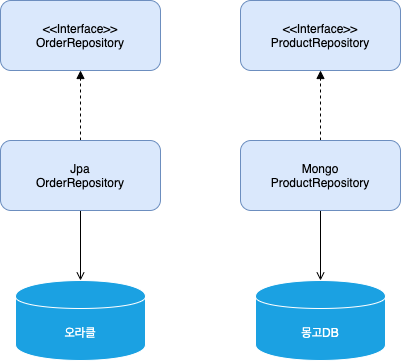

# Chapter 3. 애그리거트

## 애그리거트

개별 객체 수준에서 모델을 바라보면 상위 수준에서 관계를 파악하기 어렵다. 하지만, 상위 수준에서 모델을 정리하면 도메인 모델의 복잡한 관계를 이해하는 데 도움이 된다.

애그리거트는 **관련된 객체를 하나의 군으로** 묶어 준다. 수많은 객체를 애그리거트로 묶어서 바라보면 **상위 수준에서 도메인 모델 간의 관계를 파악**할 수 있다.

애그리거트는 복잡한 모델을 관리하는 기준을 제공.

<figure><figcaption></figcaption></figure>

한 애그리거트에 속한 객체는 **유사**하거나 **동일한 라이프 사이클**을 갖는다.

애그리거트는 **독립된 객체 군**이며 각 애그리거트는 **자기 자신을 관리할 뿐 다른 애그리거트를 관리하지 않는다**.

상품이 리뷰를 갖는 것으로 생각할 수 있지만, 상품과 리뷰는 **함께 생성되거나 변경되지 않고, 변경 주체도 다르기 때문에** 서로 다른 애그리거트에 속한다.

## 애그리거트 루트

애그리거트에 속한 **모든 객체가 일관된 상태를 유지**하려면 애그리거트 전체를 **관리할 주체**가 필요하다.

이 책임을 지는 것이 바로 애그리거트의 **루트 엔티티**이다.

- 주문 애그리거트에서 루트 역할을 하는 엔티티는 `Order`.
- 주문 애그리거트에 속한 모델은 `Order`에 직/간접적으로 속한다.

**도메인 규칙과 일관성**

애그리거트 루트의 핵심 역할은 **애그리거트의 일관성이 깨지지 않도록 하는 것**이다.
- 애그리거트 **외부에서 애그리거트에 속한 객체를 직접 변경하면 안 된다.**

불필요한 중복을 피하고 애그리거트 루트를 통해서만 도메인 로직을 구현하게 만들려면 도메인 모델에 대해 습관적으로 적용해야 할 것이 있다.
- 단순히 필드를 변경하는 **set 메서드를 공개 범위로 만들지 않기**
  - 대신 의미가 드러나는 메서드를 사용해서 구현하자(ex. cancel, changePassword)
- **밸류 타입은 불변으로** 구현하기
  - 밸류 객체의 값을 변경하려면 새로운 밸류 객체를 할당하자
  - 불변으로 구현할 수 없다면, 밸류의 변경 기능을 package/protected 범위로 한정해서 외부 실행 불가하도록 제한하자

**트랜잭션 범위**

트랜잭션 범위는 **작을수록 좋다**.

동일하게 **한 트랜잭션에서는 한 개의 애그리거트만 수정**해야 한다.
- 한 트랜잭션에서 두 개 이상의 애그리거트를 수정하면 트랜잭션 충돌 발생 가능성이 더 높이진다.
- 때문에 한 번에 수정하는 애그리거트 개수가 많아질수록 전체 처리량이 떨어지게 된다.

**애그리거트는 최대한 서로 독립적**이어야 하는데 한 애그리거트가 다른 애그리거트의 기능에 의존하기 시작하면 애그리거트 간 결합도가 높아진다.
- 결합도가 높아질수록 향후 수정 비용이 증가하므로 애그리거트에서 다른 애그리거트 상태를 변경하지 말자

만일 부득이하게 한 트랜잭션으로 두 개 이상의 애그리거트 수정이 필요하다면 애그리거트에서 다른 애그리거트를 직접 수정하지 말고, **응용 서비스에서 두 애그리거트를 수정하도록 구현**하자.

```java
public class ChangeOrderService {

    @Transactional
    public void changeShippingInfo(...) {
        Order order = orderRepository.findById(id);
        order.shipTo(newShippingInfo);

        ..
        Member member = findMember(order.getOrderer());
        member.changeAddress(newShippingInfo.getAddress());
        ...
    }
}
```

다음의 경우 한 트랜잭션에서 두 개 이상의 애그리거트를 변경하는 것을 고려
- **팀 표준**: 팀이나 조직의 표준에 따라 사용자 유스케이스와 관련된 응용 서비스의 기능을 한 트랜잭션으로 실행해야 하는 경우
- **기술 제약**: 기줄적으로 이벤트 방식을 도입할 수 없는 경우 한 트랜잭션에서 다수의 애그리거트를 수정해서 일관성을 처리
- **UI 구현의 편리**: 운영자의 편리함을 위해 주문 목록 화면에서 여러 주문의 상태를 한 번에 변경하고 싶을 경우

## 리포지터리와 애그리거트

리포지터리는 **애그리거트 단위**로 존재

리포지터리에 애그리거트를 저장하면 **애그리거트 전체를 영속화**해야 한다.
- 애그리거트 루트와 매핑되는 테이블뿐만 아니라 애그리거트에 속한 모든 구성요소에 매핑된 테이블에 데이터를 저장해야 한다.
- 동일하게 애그리거트를 구하는 리포지터리 메서드는 완전한 애그리거트를 제공해야 한다.

```java
// 애그리거트 전체를 영속화
orderRepository.save(order);

...

// 리포지터리는 완전한 order 제공
Order order = orderRepository.findById(orderId);
// 그렇지 않다면 기능 실행 도중 NPE와 같은 문제 발생
order.cancel()
```

데이터의 일관성을 깨지 않으려면 애그리거트의 상태가 변경되면 **모든 변경을 원자적으로 저장소에 반영**해야 한다.

## ID를 이용한 애그리거트 참조

```java
public class Order {
    private Orderer ordere;
    ...
}

public class Orderer {
    private Member member;
    ...
}

public class Member {
  ...
}

order.getOrderer().getMember().getId();

orderer.getMember().changeAddress(newShippingInfo.getAddress());
```

필드를 이용한 애그리거트 참조는 다음 문제를 야기할 수 있다.
- 편한 탐색 오용
  - 다른 애그리거트를 수정하고자 하는 유혹
- 성능에 대한 고민
  - JPA를 이용하면 참조한 객체를 지연(lazy) 로딩과 즉시(eager) 로딩 중 고민
  - 연관 객체 데이터를 함께 보여줘야 한다면 즉시 로딩이 유리
  - 애그리거트 상태 변경 기능을 싱핼할 경우 불필요한 객체 로딩을 막기 위한 지연 로딩이 유리
- 확장 어려움
  - 도메인마다 서로 다른 DBMS를 사용할 경우

이 문제들은 **ID를 이용해서 다른 애그리거트를 참조하면 해결**할 수 있다.
- ID 참조를 사용하면 모든 객체가 참조로 연결되는 것이 아닌 **한 애그리거트에 속한 객체들로만 참조로 연결**
- 애그리거트의 경계를 명확히 하고 애그리거트 간 물리적인 연결을 제거하므로 **모델의 복잡도를 낮춰준다.**
- 애그리거트 간의 의존을 제거하므로 **응집도를 높여주는 효과**도 있다.
- **구현 복잡도가 낮아**진다.
- 다른 애그리거트를 직접 참조하지 않으므로 애그리거트 간 참조를 지연/즉시 로딩 중에 고민을 하지 않아도 된다.

```java
public class Order {
    private Orderer ordere;
    ...
}

public class Orderer {
    private MemberId memberId;
    ...
}

public class Member {
  private MemberId id;
  ...
}

Member member = memberRepository.findById(order.getOrderer().getMemberId());
member.changeAddress(newShippingInfo.getAddress());
```

ID로 애리거트를 참조하면 **리포지터리마다 다른 저장소를 사용하도록 구현할 때 확장이 용이**하다.
- 주문 애그리거트와 같은 중요한 데이터는 RDBMS에 저장
- 조회 성능이 중요한 상품 애그리거트는 NoSQL에 저장
- 각 도메인을 별도 프로세스로 서비스하도록 구현 가능

<figure><figcaption></figcaption></figure>

**ID를 이용한 참조와 조회 성능**

다른 애그리거트를 ID로 참조하면 참조하는 여러 애그리거트를 읽을 때 **조회 속도 문제가 발생**할 수 있다.
- 조인을 이용해서 한 번에 모든 데이터를 가져올 수 있음에도 주문마다 상품 정보를 읽어오는 쿼리를 실행하게 된다.

ID를 이용한 애그리거트 참조는 **지연 로딩과 같은 효과**를 만드는 데 지연 로딩과 관련된 대표적인 문제가 `N+1 조회` 문제이다.
- 조회 대상이 N개일 때 **N개를 읽어오는 한 번(1)의 쿼리**와 **연관된 데이터(N)를 읽어오는 쿼리**를 N번 실행

ID 참조 방식을 사용하면서 N+1 조회와 같은 문제가 발생하지 않도록 하려면 **조회 전용 쿼리를 사용**하자.
- 데이터 조회를 위한 `별도 DAO`를 만돌고, DAO의 조회 메서드에서 `조인`을 이용해 `한 번의 쿼리`로 필요한 데이터를 로딩
- 즉시 로딩이나 지연 로딩과 같은 로딩 전략을 고민할 필요없이 한 번의 쿼리로 로딩 가능

한 대의 DB 장비로 대응할 수 없는 수준의 트래픽이 발생하는 경우 **캐시나 조회 전용 저장소는 필수**로 선택해야 하는 기법
- 코드가 복잡해질 수 있지만 시스템의 처리량을 높일 수 있는 장점이 있다.


# Chapter 4. 리포지터리와 모델

# Chapter 5. 스피링 데이터 JPA

# Chapter 6. 응용 서비스와 표현 영역

# Chapter 7. 도메인 서비스

# Chapter 8. 애그러기트 트랜잭션

# Chapter 9. 도메인 모델과 바운디드 컨텍스트

# Chapter 10. 이벤트

# Chapter 11. CQRS