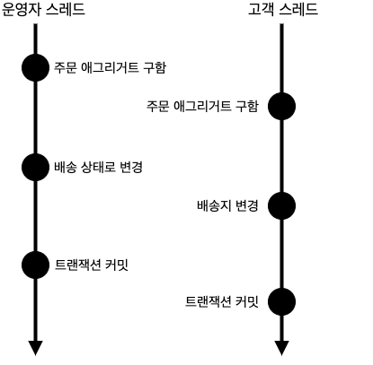
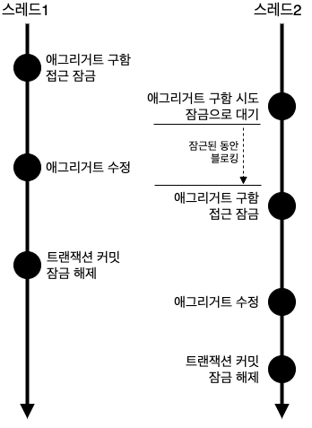
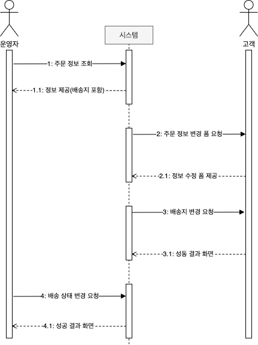
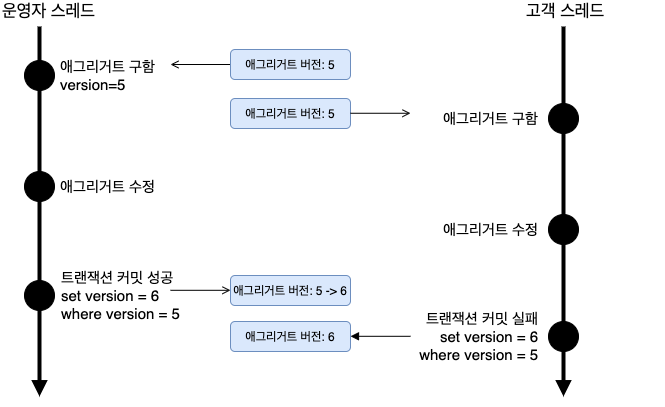
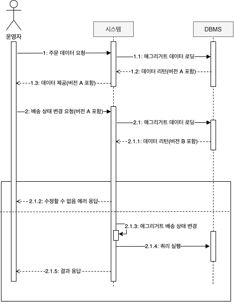
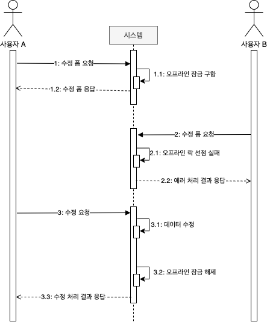

# 애그리거트 트랜잭션 관리

트랜잭션마다 리포지터리는 새로운 애그리거트 객체를 생성하므로 운영자 스레드와 고객 스레드는 같은 주문 애그리거트를 나타내는 다른 객체를 구하게 된다.

운영자 스레드와 고객 스레드는 **개념적으로 동일한 애그리거트지만 물리적으로 서로 다른 애그리거트 객체를 사용**한다.
- 운영자 스레드가 주문 애그리거트 객체를 배송 상태로 변경하더라도 고객 스레드가 사용하는 주문 애그리거트 객체에는 영향을 주지 않는다.
- 두 스레드는 각각 트랜잭션을 커밋할 때 수정한 내용을 DB에 반영한다.
- 운영자는 기존 배송지 정보를 이용해서 배송 상태로 변경했는데, 그 사이 고객은 배송지 정보를 변경했다는 문제가 발생하여 **애그리거트의 일관성이 꺠지게 된다.**

<figure><figcaption></figcaption></figure>

일관성이 깨지는 문제가 발생하지 않도록 하려면 다음 두 가지 중 하나를 해야 한다.
- 운영자가 배송지 정보를 조회하고 상태를 변경하는 동안, 고객이 애그리거트를 수정하지 못 하도록 막기
- 운영자가 배송지 정보를 조회한 이후 고객이 정보를 변경하면, 운영자가 애그리거트를 다시 조회한 뒤 수정하도록 하기

이 두 가지는 애그리거트 자체의 트랜잭션과 관련이 있는데, DBMS가 지원하는 트랜잭션과 함께 애그리거트를 위한 추가적인 트랜잭션 처리 기법이 필요하다. 대표적으로 애그리거트 자체 트랜잭션 처리 방식은 두 가지 방식이 있다.
- 선점 잠금(Pessimistic Lock)
- 비선점 잠금(Optimistic Lock)

# 선점 잠금

선점 잠금(Pessimistic Lock)은 **먼저 애그리거트를 구한 스레드가 애그리거트 사용이 끝날 때까지 다른 스레드가 해당 애그리거트를 수정하지 못하게 막는 방식**이다.

<figure><figcaption></figcaption></figure>

선점 잠금 동작 방식
- 스레드1이 선점 잠금 방식으로 애그리거트를 구한 뒤 이어서 스레드2가 같은 애그리거트를 구함
- 스레드2는 스레드1이 애그리거트에 대한 잠금을 해제할 때까지 블로킹
- 스레드1이 애그리거트를 수정하고 트랜잭션을 커밋하면 잠금 해제
- 대기하고 있던 스레드2가 애그리거트에 접근
- 스레드1이 트랜잭션을 커밋한 뒤에 스레드2가 애그리거트를 구하게 되므로 스레드2는 스레드1이 수정한 애그리거트의 내용을 조회

선점 잠금 방식을 통해 **동시에 애그리거트를 수정할 때 발생하는 데이터 충돌 문제를 해소**할 수 있다.

선점 잠금은 보통 DBMS가 제공하는 **행단위 잠금을 사용해서 구현**
- 오라클을 비롯한 다수의 DBMS가 `for update` 같은 쿼리를 사용해서 특정 레코드에 한 커넥션만 접근할 수 있는 잠금창지를 제공

`JPA EntityManager`는 `LockModeType`을 인자로 받는 `find()` 메서드를 제공
- `LockModeType.PESSIMISTIC_WRITE`를 값으로 전달하면 해당 엔티티와 매핑된 테이블을 이용해서 선점 잠금 방식 적용 가능

```java
Order order = entityManager.find(
    Order.class, orderNo, LockModeType.PESSIMISTIC_WRITE);
```

JPA 프로바이더와 DBMS에 따라 잠금 모드 구현이 다르다.
- 하이버네이트의 경우 `PESSIMISTIC_WRITE`를 잠금 모드로 사용하면 `for update` 쿼리를 이용해서 선점 잠금을 구현
- Spring Data JPA는 `@Lock`을 사용해서 잠금 모드를 지정

```java
public interface MemberRepository extends Repository<Member, MemberId> {
    @Lock(LockModeType.PESSIMISTIC_WRITE)
    @QueryHints({
            @QueryHint(name = "javax.persistence.lock.timeout", value = "3000")
    })
    @Query("select m from Member m where m.id = :id")
    Optional<Member> findByIdForUpdate(@Param("id") MemberId memberId);
    ...
}
```

## 선점 잠금과 교착 상태

선점 잠금 기능을 사용할 경우 **잠금 순서에 따른 교착 상태(deadlock)가 발생하지 않도록 주의**가 필요하다. 다음과 같은 순서로 두 스레드가 잠금 시도를 한다고 가정해 보자.

1. 스레드1: A 애그리거트에 대한 선점 잠금 구함
2. 스레드2: B 애그리거트에 대한 선점 잠금 구함
3. 스레드1: B 애그리거트에 대한 선점 잠금 시도
4. 스레드2: A 애그리거트에 대한 선점 잠금 시도

이 순수에 따르면 스레드1은 영원히 B 애그리거트에 대한 선점 잠금을 구할 수 없다.
- 스레드2가 B 애그리거트에 대한 잠금을 이미 선점하고 있기 때문.
- 동일하게 스레드2도 A 애그리거트에 대한 잠금을 구할 수 없다.
- 두 스레드는 상대방 스레드가 먼저 선점한 잠금을 구할 수 없어 더 이상 다음 단계를 진행할 수 없다.
- 즉, 스레드1, 스레드2는 **교착 생태(deadlock)**에 빠지게 된다.

선점 잠금에 따른 교착 상태는 **상대적으로 사용자 수가 많을 때 발생할 가능성이 높고, 사용자 수가 많아지면 교착 상태에 빠지는 스레드는 더 빠르게 증가**한다.
- 더 많은 스레드가 교착 상태에 빠질수록 시스템은 아무것도 할 수 없는 상태가 된다.

이러한 문제를 해결하려면 **잠금을 구할 때 최대 대기시간을 지정**해야 한다.
- JPA에서 선점 잠금을 시도할 때 최대 대기 시간을 지정하려면 힌트를 사용한다.

```java
Map<String, Object> hints = new HashMap<>();
hints.put("javax.persistence.lock.timeout", 2000);
Order order = entityManager.find(
    Order.class, orderNo, LockModeType.PESSIMISTIC_WRITE);
```

JPA의 `javax.persistence.lock.timeout` 힌트는 잠금을 구하는 대기 시간을 밀리초 단위로 지정한다.
- 지정한 시간 이내 잠금을 구하지 못하면 익셉션 발생
- DBMS에 따라 힌트가 적용되지 않을 수 있으니 주의 필요
- 힌트 이용 시 사용 중인 DBMS가 관련 기능을 지원하는지 확인 필요

Spring Data JPA는 @QueryHints를 사용해서 쿼리 힌트 지정 가능

```java
public interface MemberRepository extends Repository<Member, MemberId> {
    @Lock(LockModeType.PESSIMISTIC_WRITE)
    @QueryHints({
            @QueryHint(name = "javax.persistence.lock.timeout", value = "3000")
    })
    @Query("select m from Member m where m.id = :id")
    Optional<Member> findByIdForUpdate(@Param("id") MemberId memberId);
    ...
}
```

> DBMS에 따라 교착 상태에 빠진 커넥션을 처리하는 방식이 다르다.
>
> 선점 잠금을 사용하려면 사용하는 DBMS에 대해 JPA가 어떤 식으로 대기 시간을 처리하는지 반드시 확인하자.

# 비선점 잠근

선점 잠금이 강력해 보이지만 모든 트랜잭션 충돌 문제가 해결되는 것은 아니다.

<figure><figcaption></figcaption></figure>

비선점 잠금 실행 순서

1. 운영자는 배송을 위해 주문 정보를 조회. 시스템은 정보를 제공
2. 고객이 배송지 변경을 위해 변경 폼을 요청. 시스템은 변경 폼을 제공
3. 고객이 새로운 배송지를 입력하고 폼을 전송하여 배송지를 변경
4. 운영자가 1번에서 조회한 주문 정보를 기준으로 배송지를 정하고 배송 상태 변경을 요청

여기서의 문제는 운영자가 배송지 정보를 조회하고 배송 상태로 변경하는 사이에 고객이 배송지를 변경한다는 것이다.
- 배송 상태 변경 전에 배송지를 한 번 더 확인하지 않으면, 운영자는 다른 배송지로 물건을 발송하게 되고, 고객은 배송지를 변경했음에도 불구하고 엉뚱한 곳으로 주문한 물건을 받는 상황이 발생

비선점 잠금은 선점 잠금 방식과 같이 동시에 접근하는 것을 막는 대신 **변경한 데이터를 실제 DBMS에 반영하는 시점에 변경 가능 여부를 확인하는 방식**이다.
- 애그리거트에 버전으로 사용할 숫자 타입 프로퍼티를 추가해야 한다.
- 애그리거트를 수정할 때마다 버전으로 사용할 프로퍼티 값이 1씩 증가한다.

```sql
UPDATE aggtable SET version = version + 1, colx = ?, coly = ?
WHERE aggid = ? and version = 현재 버젼
```

이 쿼리는 수정할 애그리거트와 매핑되는 테이블의 버전 값이 현재 애그리거트의 버전과 동일한 경우에만 데이터를 수정
- 수정에 성공하면 버전 값을 1 증가
- 다른 트랜잭션이 먼저 데이터를 수정해서 버전 값이 바뀌면 데이터 수정에 실패

<figure><figcaption></figcaption></figure>

스레드1과 스레드2는 같은 버전을 갖는 애그리거트를 읽어와 수정
- 두 스레드 중 스레드1이 먼저 커밋을 시도하는데 이 시점에 애그리거트 버전은 여전히 5이므로 수정에 성공하고 버전은 6으로 변경
- 스레드1이 트랜잭션 커밋 후 스레드2가 커밋을 시도하면 이미 애그리거트 버전이 6이므로 데이터 수정에 실패

JPA는 버전을 이용한 비선점 잠금 기능을 지원
- 버전으로 사용할 필드에 `@Version`을 붙이고 매핑되는 테이블에 버전을 저장할 컬럼을 추가
- 엔티티가 변경되어 `UPDATE` 쿼리 실행 시 `@Version`에 명시한 필드를 이용해서 비선점 잠금 쿼리 실행
- 애그리거트 객체의 버전이 일치하는 경우에만 데이터 수정

```java
@Entity
@Table(name = "purchage_order")
@Access(AccessType.FIELD)
public class Order {
    @EmbeddedId
    private OrderNo number;

    @Version
    private long version;
    ...
}
```

응용 서비스는 버전에 대해 알 필요가 없고, **리포지터리에서 필요한 애그리거트를 구하고 알맞은 기능만 실행**하면 된다.
- 기능 실행 과정에서 애그리거트 데이터가 변경되면 JPA는 트랜잭션 종료 시점에 비선점 잠금을 위한 쿼리 실행

비선점 잠금을 위한 쿼리 실행 시 쿼리 실행 결과로 수정된 행의 개수가 0이면 이미 누군가 앞서 데이터를 수정한 것이다.
- 트랜잭션이 충돌한 것이므로 트랜잭션 종료 시점에 익셉션(`OptimisticLockingFailureException`)이 발생

표현 영역 코드는 이 익셉션이 발생했는지에 따라 트랜잭션 충돌 여부 확인이 가능하다.

```java
@RequestMapping(value = "/admin/orders/{orderNo}/shipping", method = RequestMethod.POST)
public String startShippingOrder(@PathVariable("orderNo") String orderNo,
                                 @RequestParam("version") long version) {
    try {
        startShippingService.startShipping(new StartShippingRequest(orderNo, version));
        return "admin/adminOrderShipped";
    } catch (OptimisticLockingFailureException e) {
        // 누군가 먼저 같은 주문 애그리거트를 수정했으므로 트랜잭션이 충돌했다는 메시지 출력
        return "admin/adminOrderLockFail";
    }
}
```

시스템은 사용자에게 수정 폼을 제공할 때 애그리거트 버전을 함께 제공하고, 폼을 서버에 전송할 때 이 버전을 함께 전송
- 사용자가 전송한 버전과 **애그리거트 버전이 동일한 경우에만 애그리거트 수정 기능을 수행**하도록 함으로써 트랜잭션 충돌 문제 해소

<figure><figcaption></figcaption></figure>

비선점 잠금 방식을 여러 트랜잭션으로 확장하려면 애그리거트 정보를 뷰로 보여줄 때 **버전 정보도 함께 사용자 화면에 전달**해야 한다.
- HTML 폼을 생성하는 경우 버전 값을 갖는 hidden 타입 input 태그를 생성해서 폼 전송 시 버전 값이 서버에 함께 전달되도록 하자.

```html
<form th:action="@{/startShipping}" method="post">
    <input type="hidden" name="version" th:value="${orderDto.version}">
    <input type="hidden" name="orderNumber" th:value="${orderDto.orderNumber}">
    ...
    <input type="submit" value="배송 상태로 변경하기">
</form>
```

응용 서비스에 전달할 요청 데이터에도 사용자가 전송한 버전 값을 포함한다.

```java
public class StartShippingRequest {
    private String orderNumber;
    private long version; // 주문을 조회한 시점의 버전 값
    ...
}
```

응용 서비스는 전달받은 버전 값을 이용해서 애그리거트 버전과 일치하는지 확인하고, 일치하는 경우에만 기능을 수행

```java
public class StartShippingService {
    @PreAuthorize("hasRole('ADMIN')")
    @Transactional
    public void startShipping(StartShippingRequest req) {
        Order order = orderRepository.findById(new OrderNo(req.getOrderNumber()));
        checkOrder(order);
        if (!order.matchVersion(req.getVersion())) {
            throw new VersionConflictException();
        }
        order.startShipping();
    }
    ...
}
```

표현 계층은 버전 충돌 익셉션이 발생하면 버전 충돌을 사용자에게 알려 사용자가 알맞은 후속 처리를 할 수 있도록 해야 한다.
- `OptimisticLockingFailureException`: 누군가 거의 동시에 애그리거트를 수정했을 경우
- `VersionConflictException`: 이미 누군가 애그리거트를 수정했을 경우

```java
@Controller
public class OrderAdminController {
    private StartShippingService startShippingService;

    @PostMapping("/startShipping")
    public String startShipping(StartShippingRequest startReq) {
        try {
            startShippingService.startShipping(startReq);
            return "shippingStarted";
        } catch(OptimisticLockingFailureException | VersionConflictException ex) {
            // 트랜잭션 충돌
            return "startShippingTxConflict";
        }
    }
    ... 
}
```

## 강제 버전 증가

애그리거트에 애그리거트 루트 외에 다른 엔티티가 존재하는데 기능 실행 도중 루트가 아닌 다른 엔티티의 값만 변경되었을 경우를 생각해 보자.
- 이 경우 JPA는 루트 엔티티의 버전 값을 증가시키지 않는다.
- 연관된 엔티티의 값이 변경된다고 해도 루트 엔티티 자체의 값은 바뀌지 않으므로 루트 엔티티 버전 값은 갱신되지 않는다.

하지만, 이러한 JPA 특징은 애그리거트 관점에서 보면 문제가 된다.
- 루트 엔티티 값이 바뀌지 않았더라도 애그리거트의 구성요소 중 일부 값이 바뀌면 논리적으로 그 애그리거트는 바뀐 것이다.
- 따라서, **애그리거트 내에 어떤 구성요소의 상태가 바뀌면 루트 애그리거트의 버전 값이 증가해야 비선점 잠금이 올바르게 동작**하다.
- JPA는 이런 문제를 처리할 수 있도록 EntityManager#find() 메서드로 **엔티티를 구할 때 강제로 버전 값을 증가시키는 잠금 모드**를 지원

비선점 강제 버전 증가 잠금 모드를 사용해서 엔티티를 구하는 방법
- `LockModeType.OPTIMISTIC_FORCE_INCREMENT`를 사용하면 해당 엔티티의 상태가 변경되었는지에 상관없이 트랜잭션 종료 시점에 버전 값 증가 처리 수행
- 이 잠금 모드를 사용하면 **애그리거트 루트 엔티티가 아닌 다른 엔티티나 밸류가 변경되더라도 버전 값을 증가**시킬 수 있으므로 비선점 잠금 기능을 안전하게 적용 가능하다.

```java
@Repository
public class JpaOrderRepository implements OrderRepository {
    @PersistenceContext
    private EntityMangager entityManager;

    @Override
    public Order findbyIdOptimisticLockMode(OrderNo id) {
        return entityManager.find(
            Order.class, id, LockModeType.OPTIMISTIC_FORCE_INCREMENT);
    }
    ...
}
```

Spring Data JPA를 사용하면 `@Lock`을 이용해서 지정할 수 있다.

```java
public interface MemberRepository extends Repository<Member, MemberId> {
    @Lock(LockModeType.OPTIMISTIC_FORCE_INCREMENT)
    @Query("select m from Member m where m.id = :id")
    Optional<Member> findByIdForUpdate(@Param("id") MemberId memberId);
    ...
}
```

# 오프라인 선점 잠금

더 엄격하게 데이터 충돌을 막고 싶다면, **누군가 수정 화면을 보고 있을 때 수정 화면 자체를 실행하지 못하도록** 하고 싶다면 `오프라인 선점 잠금 방식`(Offline Pessimistic Lock)을 사용해 보자.

단일 트랜잭션에서 동시 변경을 막는 선점 잠금 방식과 달리 **여러 트랜잭션에 걸쳐 동시 변경을 막는다**.
- 첫 번째 트랜잭션을 시작할 때 오프라인 잠금을 선점하고, 마지막 트랜잭션에서 잠금을 해제한다.
- 잠금을 해제하기 전까지 다른 사용자는 잠금을 구할 수 없다.
- 보통 수정 기능은 두 개의 트랜잭션으로 구성된다.

<figure><figcaption></figcaption></figure>

사용자 A가 수정 요청을 수행하지 않고 프로그램을 종료한다면,
- 잠금을 해제하지 않았으므로 다른 사용자는 영원히 잠금을 구할 수 없는 상황이 발생한다.
- 오프라인 선점 방식은 `잠금 유효 시간`을 통해 방지할 수 있다.
- **유효 시간이 지나면 자동으로 잠금을 해제해서 다른 사용자가 잠금을 일정 시간 후에 다시 구할 수 있도록** 한다.

사용자 A가 잠금 유효 시간이 지난 후 1초 뒤에 3번 과정을 수행했다면,
- 잠금이 해제되어 사용자 A는 수정에 실패하게 된다.
- `일정 주기로 유효 시간을 증가`시키는 방식으로 이런 상황을 방지할 수 있다.
- 수정 폼에서 **1분 단위로 Ajax 호출을 통해 잠금 유효 시간을 1분씩 증가**시키는 방법이 있다.

## 오프라인 선점 잠금을 위한 LockManager 인터페이스와 관련 클래스

오프라인 선점 잠금은 크게 `잠금 선점 시도`, `잠금 확인`, `잠금 해제`, `잠금 유효시간 연장`의 네 가지 기능이 필요하다.

```java
public interface LockManager {
    /**
     * 잠금 시도. 잠금에 성공하면 LockId 리턴
     * - LockId는 다음에 잠금을 해제할 때 사용
     * 
     * @param type 잠글 대상 타입 (domain.Article)
     * @param id 식별자 (10)
     * @return LockId 잠금을 식별할 때 사용(각 잠금마다 고유 식별자를 보유)
     */
    LockId tryLock(String type, String id) throws LockException;

    void checkLock(LockId lockId) throws LockException;

    void releaseLock(LockId lockId) throws LockException;

    void extendLockExpiration(LockId lockId, long inc) throws LockException;
}

...

public class LockId {
    private String value;

    public LockId(String value) {
        this.value = value;
    }

    public String getValue() {
        return value;
    }
}
```

컨트롤러가 오프라인 선점 잠금 기능을 이용해서 데이터 수정 폼에 동시에 접근하는 것을 제어하기 위해, 수정 폼에서 데이터 전송 시 LockId를 전송할 수 있도록 LockId를 모델에 추가하자.

```java
/**
 * 서비스:  서비스는 잠금 ID를 리턴
 */ 
public DataAndLockId getDataWithLock(Long id) {
    // 1.오프라인 선점 잠금 시도
    LockId lockId = lockManager.tryLock("data", id);
    // 2. 기능 실행
    Data data = someDao.select(id);
    return new DataAndLockId(data, LockId);
}

/**
 * 컨트롤러: 서비스가 리턴한 잠금ID를 모델로 뷰에 전달
 */
@RequestMapping("/some/edit/{id}")
public String editForm(@PAthVariable("id") Long id, ModelMap model) {
    DataAndLockId dl = dataService.getDataWithLock(id);
    model.addAttribute("data", dl.getData());
    // 3. 잠금 해제에 사용할 LockId를 모델에 추가
    model.addAttribute("lockId", dl.getLockId());
    return "editForm";
}
```

잠금 선점에 실패하면 LockException이 발생한다.
- 이때는 다른 사용자가 데이터를 수정 중이니 나중에 다시 시도하라는 안내 화면을 보여주도록 하자.
- 수정 폼은 LockId를 다시 전송해서 잠금을 해제할 수 있도록 하자.

```html
<form th:action="@{/some/edit/{id}(id=${data.id})}" method="post">
    ...
    <input type="hidden" name="lid" th:value"${lockId.value}">
    ...
</form>
```

잠금을 해제하는 코드는 다음과 같이 전달받은 LockId를 이용한다.

```java
/**
 * 서비스: 잠금을 해제
 */
public void edit(EditRequest editReq, LockId lockId) {
    // 1. 잠금 선점 확인
    // - 잠금 유효 시간이 이미 지났으면 다른 사용자가 잠금을 선점한다.
    // - 잠금을 선점하지 않은 사용자가 기능을 실행했다면 기능 실행을 막아야 한다.
    lockManager.checkLock(lockId);
    // 2. 기능 실행
    ..
    // 3. 잠금 해제
    lockManager.releaseLock(lockId);
}

/**
 * 컨트롤러: 서비스를 호출할 때 잠금ID를 함께 전달
 */
@PostMapping("/some/edit/{id}")
public String edit(@PathVariable("id") Long id,
                    @ModelAttribute("editReq") EditRequest editReq,
                    @REquestParam("id") String lockIdValue) {
    editReq.setId(id);
    someEditService.edit(editReq, new LockId(lockIdValue));
    model.addAttribute("data", data);
    return "editSuccess";
}
```

## DB를 이용한 LockManager 구현

DB를 이용한 LockManager를 구현해 보자.
- 잠금 정보를 저장할 테이블과 인덱스를 생성하자.
- `type`, `id` 컬럼은 주요키로 지정해서 동시에 두 사용자가 특정 타입 데이터에 대한 잠금을 구현하는 것을 방지할 수 있다.

```sql
create table shop.locks (
  `type` varchar(255),
  id varchar(255),
  lockid varchar(255),
  expiration_time datetime, -- 잠금 유효시간
  primary key (`type`, id)
) character set utf8mb4;

create unique index locks_idx ON shop.locks (lockid);
```

lock 테이블의 데이터를 담을 `LockData` 클래스

```java
@Getter
@Allargsconstructor
public class LockData {
    private String type;
    private String id;
    private String lockId;
    private long timestamp;

    /**
     * 유효 시간이 지났는지 판달할 때 사용
     */
    public boolean isExpired() {
        return timestamp < System.currentTimeMillis();
    }
}
```

`LockManager` 구현체

```java
@Component
public class SpringLockManager implements LockManager {
    private int lockTimeout = 5 * 60 * 1000;
    private JdbcTemplate jdbcTemplate;

    /**
     * locks 테이블에서 조회한 데이터를 LockData로 매핑하기 위한 RowMapper
     */
    private RowMapper<LockData> lockDataRowMapper = (rs, rowNum) ->
            new LockData(rs.getString(1), rs.getString(2),
                    rs.getString(3), rs.getTimestamp(4).getTime());

    public SpringLockManager(JdbcTemplate jdbcTemplate) {
        this.jdbcTemplate = jdbcTemplate;
    }

    /**
     * type과 id에 대한 잠금을 시도
     */
    @Transactional(propagation = Propagation.REQUIRES_NEW)
    @Override
    public LockId tryLock(String type, String id) throws LockException {
        // 해당 type과 id에 잠금이 존재하는지 검사
        checkAlreadyLocked(type, id);
        // 새로운 LockId 생성. 매번 새로운 LockId를 생성해야 하는데 여기서는 UUID를 이용
        LockId lockId = new LockId(UUID.randomUUID().toString());
        // 잠금 생성
        locking(type, id, lockId);
        // LockId 리턴
        return lockId;
    }

    /**
     * 잠금이 존재하는지 검사
     */
    private void checkAlreadyLocked(String type, String id) {
        // locks 테이블에서 type과 id에 대한 데이터 조회
        List<LockData> locks = jdbcTemplate.query(
                "select * from locks where type = ? and id = ?",
                lockDataRowMapper, type, id);
        // 유효 시간이 지난 데이터 처리
        Optional<LockData> lockData = handleExpiration(locks);
        // 유효 시간이 지나지 않은 LockData가 존재하면 예외 발생
        if (lockData.isPresent()) throw new AlreadyLockedException();
    }

    /**
     * 잠금 유효 시간이 지나면 해당 데이터를 삭제하고 값이 없는 Optional 리턴
     * - 유효 시간이 지나지 않았다면 해당 LockData를 가진 Optional 리턴
     */
    private Optional<LockData> handleExpiration(List<LockData> locks) {
        if (locks.isEmpty()) return Optional.empty();
        LockData lockData = locks.get(0);
        if (lockData.isExpired()) {
            jdbcTemplate.update(
                    "delete from locks where type = ? and id = ?",
                    lockData.getType(), lockData.getId());
            return Optional.empty();
        } else {
            return Optional.of(lockData);
        }
    }

    private void locking(String type, String id, LockId lockId) {
        try {
            // 잠금을 위해 locks 테이블에 데이터를 삽입
            int updatedCount = jdbcTemplate.update(
                    "insert into locks values (?, ?, ?, ?)",
                    type, id, lockId.getValue(), new Timestamp(getExpirationTime()));
            // 데이터 삽입 결과가 없으면 예외 발생
            if (updatedCount == 0) throw new LockingFailException();
        } catch (DuplicateKeyException e) {
            // 동일한 주요 키나 lockId를 가진 데이터가 이미 존재할 경우 예외 발생
            throw new LockingFailException(e);
        }
    }

    /**
     * 현재 시간 기준으로 LockTimeout 이후 시간을 유효 시간으로 생성
     */
    private long getExpirationTime() {
        return System.currentTimeMillis() + lockTimeout;
    }

    /**
     * 잠금이 유효한지 검사. 
     */
    @Transactional(propagation = Propagation.REQUIRES_NEW)
    @Override
    public void checkLock(LockId lockId) throws LockException {
        Optional<LockData> lockData = getLockData(lockId);
        // 잠금이 존재하지 않으면 예외 발생
        if (!lockData.isPresent()) throw new NoLockException();
    }

    /**
     * lockId에 해당하는 LockData 조회
     */
    private Optional<LockData> getLockData(LockId lockId) {
        List<LockData> locks = jdbcTemplate.query(
                "select * from locks where lockid = ?",
                lockDataRowMapper, lockId.getValue());
        // 유효 시간이 지난 LockData 처리
        return handleExpiration(locks);
    }

    /**
     * lockId에 해당하는 잠금 유효 시간을 inc 만큼 늘린다.
     */
    @Transactional(propagation = Propagation.REQUIRES_NEW)
    @Override
    public void extendLockExpiration(LockId lockId, long inc) throws LockException {
        Optional<LockData> lockDataOpt = getLockData(lockId);
        LockData lockData =
                lockDataOpt.orElseThrow(() -> new NoLockException());
        jdbcTemplate.update(
                "update locks set expiration_time = ? where type = ? AND id = ?",
                new Timestamp(lockData.getTimestamp() + inc),
                lockData.getType(), lockData.getId());
    }

    /**
     * lockId에 해당하는 잠금 데이터를 locks 테이블에서 삭제
     */
    @Transactional(propagation = Propagation.REQUIRES_NEW)
    @Override
    public void releaseLock(LockId lockId) throws LockException {
        jdbcTemplate.update("delete from locks where lockid = ?", lockId.getValue());
    }

    public void setLockTimeout(int lockTimeout) {
        this.lockTimeout = lockTimeout;
    }
}
```