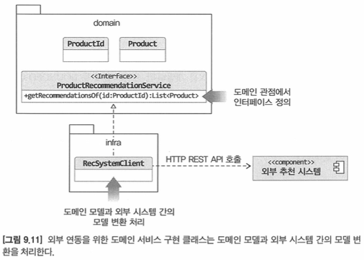
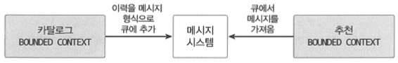
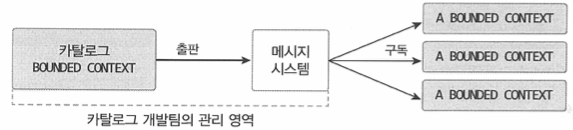
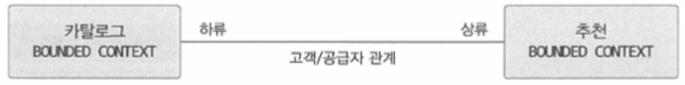
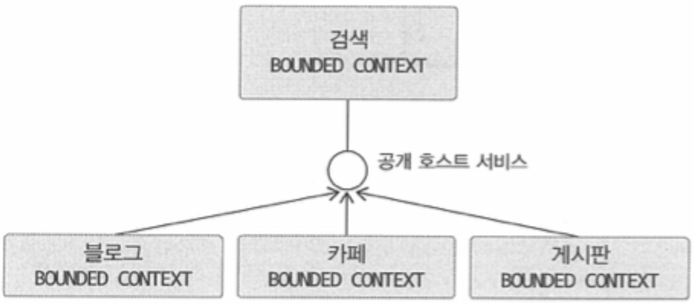
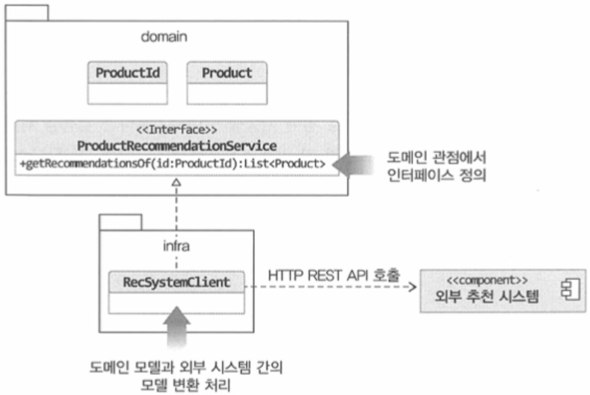
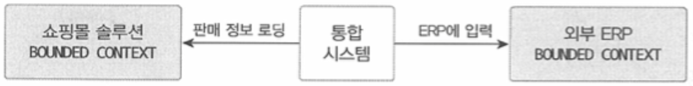

# 도메인 모델과 경계

처음 도메인 모델을 만들 때 빠지기 쉬운 함정이 **도메인을 완벽하게 표현하는 단일 모델을 만드는 시도를 하는 것**이다.
- 한 개의 모델로 여러 하위 도메인을 모두 표현하려고 시도하면 오히려 모든 하위 도메인에 맞지 않는 모델을 만들게 된다.

사용자는 회원 도메인(회원), 주문 도메인(주문자), 배송 도메인(보내는 사람)에서 부르는 표현이 다르다.
- 이렇게 하위 도메인마다 같은 용어라도 의미가 다르고 같은 대상이라도 지칭하는 용어가 다를 수 있다.
- 그러므로 **한 개의 모델로 모든 하위 도메인을 표현하려는 시도는 올바른 방법이 아니며 표현할 수도 없다.**

하위 도메인마다 사용하는 용어가 다르므로 올바른 도메인 모델을 개발하려면 **하위 도메인마다 모델을 만들어야 한다.**
- 각 모델은 **명시적으로 구분되는 경계**를 가져서 섞이지 않도록 해야 한다.
- 여러 하위 도메인의 모델이 섞이기 시작하면 모델의 의미가 약해질 뿐만 아니라 여러 도메인의 모델이 서로 얽히기 때문에 각 하위 도메인별로 다르게 발전하는 요구사항을 모델에 반영하기 어려워진다.

모델은 **특정 컨텍스트(문맥) 하에서 완전한 의미**를 갖는다.
- 같은 제품이라도 카탈로그 컨텍스트와 재고 컨텍스트에서 의미가 서로 다르다.
- 이렇게 구분되는 경계를 갖는 컨텍스트를 DDD에서 `바운디드 컨텍스트(Bounded Context)`라고 부른다.

# 바운디드 컨텍스트

`바운디드 컨택스트`는 **모델의 경계를 결정**하며 **한 개의 바운디드 컨텍스트는 논리적으로 한 개의 모델**을 갖는다.
- 바운디드 컨텍스트는 용어를 기준으로 구분한다.
  - ex. 카탈로그 컨텍스트, 재고 컨텍스트는 서로 다른 용어를 사용하므로 이 용어를 기준으로 컨텍스트를 분리 가능
- 한 바운디드 컨텍스트는 실제로 사용자에게 기능을 제공하는 물리적 시스템으로, **도메인 모델은 이 바운디드 컨텍스트 안에서 도메인을 구현**

바운디드 컨텍스트는 기업의 팀 조직 구조에 따라 결정되기도 한다.
- 용어를 명확하게 구분하지 못해 두 하위 도메인을 하나의 바운디드 컨텍스트에서 구현하기도 한다.

```bash
# 서로 다른 팀에서 개발
├── 주문 하위 도메인
│   ├── 주문 바운디드 컨텍스트 # 각 팀에서
└   └── 결제 금액 계산 바운디드 컨텍스트  # 각 팀에서

# 한 팀에서 개발
├── 카탈로그 하위 도메인
├── 재고 하위 도메인
└   └── 상품 바운디드 컨텍스트 # 한 팀에서
```

여러 하위 도메인을 하나의 바운디드 컨텍스트에서 개발할 때 주의할 점은 **하위 도메인의 모델이 섞이지 않도록** 해야 한다.
- 비록 한 개의 바운디드 컨텍스트가 여러 하위 도메인을 포함하더라도 **하위 도메인마다 구분되는 패키지를 갖도록 구현**해야 한다.
- 이렇게 **하위 도메인을 위한 모델이 서로 뒤섞이지 않고 하위 도메인마다 바운디드 컨텍스트를 갖는 효과**를 낼 수 있다.

```bash
# 물리적인 바운디드 컨텍스트가 한 개이더라도
# 내부적으로 패키지를 활용해서 논리적으로 바운디드 컨텍스트를 생성
├── 온라인 쇼핑 바운디드 컨텍스트
│   └── 주문 바운디드 컨텍스트
│   └── 카탈로그 바운디드 컨텍스트
│   └── 회원 바운디드 컨텍스트
└   └── ...
```

바운디드 컨텍스트는 도메인 모델을 구분하는 경계가 되므로 **바운디드 컨텍스트는 구현하는 하위 도메인에 알맞는 모델을 포함**
- 같은 사용자라 하더라도 주문 바운디드 컨텍스트와 회원 바운디드 컨텍스트가 갖는 모델이 달라진다.
- ex 1. 회원 Member는 애그리거트 루트이지만, 주문의 Orderer는 밸류
- ex 2. 카탈로그의 Product는 상품이 속할 Category와 연관을 갖지만, 재고의 Product는 카탈로그의 Category와 연관을 맺지 않음

```bash
├── 회원 바운디드 컨텍스트
└   └── Member # Agg Root

├── 주문 바운디드 컨텍스트
└   └── Orderer # Value

###

├── 카탈로그 바운디드 컨텍스트
│   ├── Product # Agg Root
└   └── Category # Agg Root

├── 재고 바운디드 컨텍스트
└   └── Product # Agg Root
```

# 바운디드 컨텍스트 구현

바운디드 컨텍스트는 도메인 기능을 사용자에게 제공하는 데 필요한 **표현 영역, 응용 서비스, 인프라스트럭처 영역을 모두 포함**한다. 도메인 모델의 데이터 구조가 바뀌면 DB 테이블 스키마도 함께 변경해야 하므로 **테이블도 바운디드 컨텍스트에 포함**된다.

```bash
├── 바운디드 컨텍스트
│   ├── 표현 영역
│   ├── 응용 서비스
│   ├── 도메인
│   ├── 인프라스트럭처
└   └── DBMS
```

도메인 기능 자체가 단순하면 **서비스-DAO로 구성된 CRUD 방식을 사용해도 코드를 유지 보수하는 데 문제 되지 않는다.**

한 바운디드 컨텍스트에서 **두 방식을 혼합**해서 사용할 수도 있다.
- 대표적인 예가 CQRS(Command Query Responsibility Segregation)패턴이다.
  - 상태를 변경하는 명령 기능과 내용을 조회하는 쿼리 기능을 위한 모델을 구분하는 패턴
- CQRS 패턴을 단일 바운디드 컨텍스트에 적용하면 상태 변경과 관련된 기능은 도메인 모델 기반으로 구현하고 조회 기능은 서비스-DAO를 이용해서 구현할 수 있다.

```bash
├── 바운디드 컨텍스트
│   ├── 표현 영역
│   │   ├── 상태 변경 관련 기능
│   │   │   ├── 응용 서비스
│   │   │   ├── 도메인
│   │   │   └── 인프라스트럭처
│   │   └── 조회 기능
│   │       ├── 서비스
│   │       └── DAO(조회 전용 데이터 모델)
└   └── DBMS
```

각 바운디드 컨텍스트는 서로 다른 구현 기술을 사용할 수도 있다.
- 웹 MVC는 스프링 MVC를 사용하고 리포지터리 구현 기술로 JPA/hibernate를 사용하는 경우
- Netty를 이용해서 REST API를 제공하고 마이바티스를 리포지터리 구현 기술로 사용하는 경우

# 바운디드 컨텍스트 간 통합

두 팀이 관련된 바운디드 컨텍스트를 개발하면 자연스럽게 **두 바운디드 컨텍스트 간 통합**이 발생한다.
- 예를 들어 카탈로그 바운디드 컨텍스트와 추천 바운디드 컨텍스트가 있다면, 이때 두 컨텍스트의 도메인 모델은 서로 다르다.
- 카탈로그는 제품을 중심으로 도메인 모델을 구현하지만, 추천은 추천 연산을 위한 모델을 구현한다.

카탈로그 시스템은 추천 시스템으로부터 추천 데이터를 받아오지만, 카탈로그 시스템에서는 추천의 도메인 모델을 사용하기보다는 **카탈로그 도메인 모델을 사용해서 추천 상품을 표현**해야 한다.

## 직접 통합 방식(REST API)

외부 연동을 위한 도메인 서비스 구현 클래스는 **도메인 모델과 외부 시스템 간의 모델 변환을 처리**
- RecSystemClient는 REST API로부터 데이터를 읽어와 카탈로그 도메인에 맞는 상품 모델로 변환

<figure><figcaption></figcaption></figure>

```java
public class RecSystemClient implements ProductRecommendationService {
    private ProductRepository productRepository;
    
    @Override
    public List<Product> getRecommendationOf(ProductId id) {
        List<RecommendationItem> items = getRecItems(id.getValue());
        return toProducts(items);
    }

    private List<RecommendationItem> getRecItems(String itemId) {
        // externalRecClient는 외부 추천 시스템을 위한 클라이언트라고 가정
        return externalRecClient.getRecs(itemId);
    }

    /**
     * 추천 시스템 관리 모듈에서 제공하는 RecommendationItem은 추천 시스템의 모델을 따른다.
     * - 추천 시스템의 모델을 받아와 toProductId() 메서드를 이용해서 카탈로그 도메인의 Product 모델로 변환하는 작업을 처리
     * - 두 모델 간의 변환 과정이 복잡하다면 변환 처리를 위한 별도의 클래스(Translator)를 만들고 해당 클래스에서 변환을 처리해도 된다.
     */
    private List<Product> toProducts(List<RecommendationItem> items) {
        return items.stream()
                    .map(item -> toProductId(item.getItemId()))
                    .map(prodId -> productRepository.findById(prodId))
                    .collect(toList());
    }

    private ProductId toProductId(String itemId) {
        return new ProductId(itemId);
    }
    //...
}
```

## 간접적 통합 방식(메시지 큐)

REST API를 호출하는 것은 **두 바운디드 컨텍스트를 직접 통합하는 방법**이다.
- 직접 통합대신 간접적으로 통합하는 방법도 있는데, **대표적으로 `메시지 큐`를 사용**하는 것이다.

<figure><figcaption></figcaption></figure>

카탈로그 바운디드 컨텍스트는 **추천 시스템이 필요로 하는 사용자 활동 이력을 메시지 큐에 추가**
- 메시지 큐는 비동기로 메시지를 처리하므로 카탈로그 바운디드 컨텍스트는 메시지를 큐에 추가한 뒤 추천 바운디드 컨텍스트가 메시지를 처리할 때까지 기다리지 않고 바로 이어서 자신의 처리를 진행

추천 바운디드 컨텍스트는 큐에서 이력 메시지를 읽어와 추천을 계산하는 데 사용할 것이다.
- 이는 두 바운디드 컨텍스트가 사용할 메시지의 데이터 구조를 맞춰야 함을 의미한다.
- 각각의 바운디드 컨텍스트를 담당하는 팀은 서로 만나서 주고받을 데이터 형식에 대해 협의가 필요하다.

어떤 도메인 관점에서 모델을 사용하느냐에 따라 두 바운디드 컨텍스트의 구현 코드가 달라지게 된다.

**카탈로그 도메인 기준**

카탈로그 도메인 관점에서 큐를 저장할 메시지를 생성하면 카탈로그 시스템의 연동 코드는 **카탈로그 기준의 데이터를 그대로 메시지 큐에 저장**한다.
- 카탈로그 도메인 모델을 기준으로 메시지를 전송하므로 추천 시스템은 자신의 모델에 맞게 메시지를 변환해서 처리해야 한다.

```java
/**
 * 상품 조회 관련 로그 기록 코드
 */
public class ViewLogService {
    private MessageClient messageClient;

    public void appendViewLog(String memberId, String productId, Data time) {
        messageClient.send(new ViewLog(memberId, productId, time));
    }
    ...
}

// messageClient
public class RabbitMQClient implements MessageClient {
    private RabbitTemplate rabbitTemplate;

    @Override
    public void send(ViewLog viewLog) {
        // 카탈로그 기준으로 작성한 테이터를 큐에 그대로 보관
    }
    ...
}
```

**추천 시스템 기준**

추천 시스템을 기준으로 큐에 데이터를 저장하기로 했다면 카탈로그 코드는 아래와 같이 변경될 것이다.

```java
/**
 * 상품 조회 관련 로그 기록 코드
 */
private class ViewLogService {
  private MessageClient messageClient;

  public void appendViewLog(String memberId, String productId, Data time) {
      messageClient.send(
          new ActivityLog(productId, memberId, ActivityType.VIEW, time));
  }
  ...
}

// messageClient
public class RabbitMQClient implements MessageClient {
    private RabbitTemplate rabbitTemplate;

    @Override
    public void send(ActivityLog activityLog) {
        rabbitTemplate.convertAndSend(logQueueName, activityLog);
    }
    ...
}
```

두 바운디드 컨텍스트를 개발하는 팀은 메시징 큐에 담을 데이터의 구조를 협의하게 되는데 그 큐를 누가 제공하느냐에 따라 데이터 구조가 결정된다.
- 카탈로그 시스템에서 큐를 제공한다면 큐에 담기는 내용은 카탈로그 도메인을 따른다.
- 카탈로그 도메인은 메시징 큐에 카탈로그와 관련된 메시지를 저장하게 되고 다른 바운디드 컨텍스트는 이 큐로부터 필요한 메시지를 수신하는 방식을 사용한다.
- 이 방식은 한 쪽에서 메시지를 출판하고 다른 쪽에서 메시지를 구독하는 출판/구독 모델을 따른다.

<figure><figcaption></figcaption></figure>

큐를 추천 시스템에서 제공할 경우 큐를 통해 메시지를 추천 시스템에 전달하는 방식이 된다.
- 큐로 인해 비동기로 추천 시스템에 데이터를 전달하는 것을 제외하면 추천 시스템이 제공하는 REST API를 사용해서 데이터를 전달하는 것과 차이가 없다.

> 마이크로서비스와 바운디드 컨텍스트
>
> 마이크로서비스의 특징은 바운디드 컨텍스트와 잘 어울린다. 각 바운디드 컨텍스트는 모델이 경계를 형성하는데 바운디드 컨텍스트를 마이크로서비스로 구현하면 자연스럽게 컨텍스트별로 모델이 분리된다. 코드로 생각하면서 마이크로서비스마다 프로젝트를 생성하므로 바운디드 컨텍스트마다 프로젝트를 만들게 된다. 이것은 코드 수준에서 모델을 분리하여 두 바운디드 컨텍스트의 모델이 섞이지 않도록 해준다.

# 바운디드 컨텍스트 간 관계

바운디드 컨텍스트는 어떤 식으로든 연결되므로 두 바운디드 컨텍스트는 다양한 방식으로 관계를 맺는다.

**REST API**

두 바운디드 컨텍스트 간 관계 중 가장 흔한 관계는 **한 쪽에서 API를 제공하고 다른 한 쪽에서는 해당 API를 호출**하는 `REST API`가 대표적이다.
- 이 관계에서 API를 사용하는 바운디드 컨텍스트는 **API를 제공하는 바운디드 컨텍스트에 의존**하게 된다.

<figure><figcaption></figcaption></figure>

하류 컴포넌트인 카탈로그 컨텍스트는 상류 컴포넌트인 추천 컨텍스트가 제공하는 데이터와 기능에 의존한다.
- 추천 시스템이 제공하는 REST API의 인터페이스가 바뀌면 카탈로그 시스템의 코드도 바뀌게 된다.

**OPEN HOST SERVICE**

상류 팀의 고객인 하류 팀이 다수 존재하면 **상류 팀은 여러 하류 팀의 요구사항을 수용할 수 있는 API를 만들고 이를 서비스 형태로 공개해서 서비스의 일관성을 유지**할 수 있다. 이런 서비스를 `공개 호스트 서비스`(OPEN HOST SERVICE)라고 한다.

<figure><figcaption></figcaption></figure>

**Anticorruption Layer**

상류 컴포넌트의 서비스는 상류 바운디드 컨텍스트의 도메인 모델을 따른다.
- 따라서, 하류 컴포넌트는 상류 서비스의 모델이 자신의 도메인 모델에 영향을 주지 않도록 보호해 주는 완충 지대를 만들어야 한다.

<figure><figcaption></figcaption></figure>

RecSystemClient는 외부 시스템과의 연동을 처리하는데 외부 시스템의 도메인 모델이 내 도메인 모델을 침범하지 않도록 막아주는 역할을 한다.
- 내 모델이 깨지는 것을 막아주는 `안티코럽션 계층`(Anticorruption Layer)이 된다.
- 이 계층에서 두 바운디드 컨텍스트 간의 모델 변환을 처리해 주기 때문에 다른 바운디드 컨텍스트의 모델에 영향을 받지 않고 내 도메인 모델을 유지할 수 있다.

**SHARED KERNEL**

두 바운디드 컨텍스트가 같은 모델을 공유함으로써 주문과 관련된 중복 설계를 막을 수 있다.
- 두 팀이 공유하는 모델을 `공유 커널`(SHARED KERNEL)이라고 부른다.

공유 커널의 장점은 **두 팀에서 동일한 모델을 두 번 개발하는 중복을 줄여준다**는 것이다.
- 하지만, 두 팀이 한 모델을 공유하므로 한 팀에서 임의로 모델을 변경하면 안 되며 두 팀이 밀접한 관계를 유지해야 한다.
- 두 팀이 밀접한 관계를 형성할 수 없다면 공유 커널을 사용할 때의 장점보다 공유 커널로 인해 개발이 지연되고 정체되는 문제가 더 커지게 된다.

**SEPARATE WAY**

`독립 방식`(SEPARATE WAY) 관계는 서로 통합하지 않은 방식이다.
- 두 바운디드 컨텍스트 간에 통합하지 않으므로 **서로 독립적으로 모델을 발전**시킨다.
- 독립 방식에서 **두 바운디드 컨텍스트 간의 통합은 수동으로** 이루어진다.
- ex. 온라인 쇼핑몰에서 판매가 발생하면 쇼핑몰 운영자는 쇼핑몰 시스템에서 판매 정보를 보고 ERP 시스템에 입력해야 한다.

수동으로 통합하는 방식이 나쁜 것은 아니지만 **규모가 커질수록 수동 통합에는 한계가 있으므로 규모가 커지기 시작하면 두 바운디드 컨텍스트를 통합**해야 한다.
- 이때 외부 구매 솔루션과 ERP를 완전히 대체할 수 없다면 두 바운디드 컨텍스트를 통합해 주는 별도의 시스템을 만들어야 할 수도 있다.

<figure><figcaption></figcaption></figure>


# 10.이벤트

# 11.CQRS