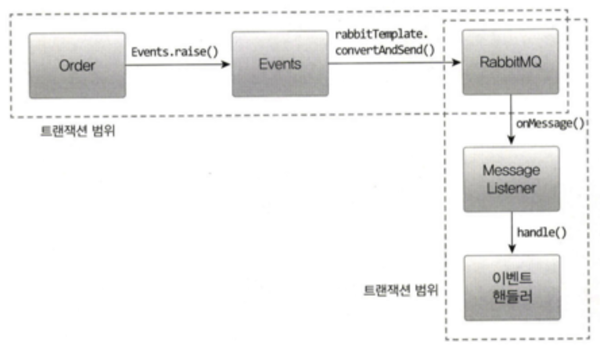
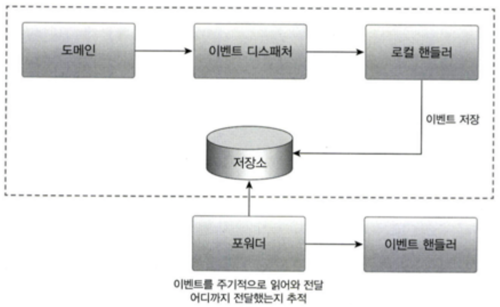
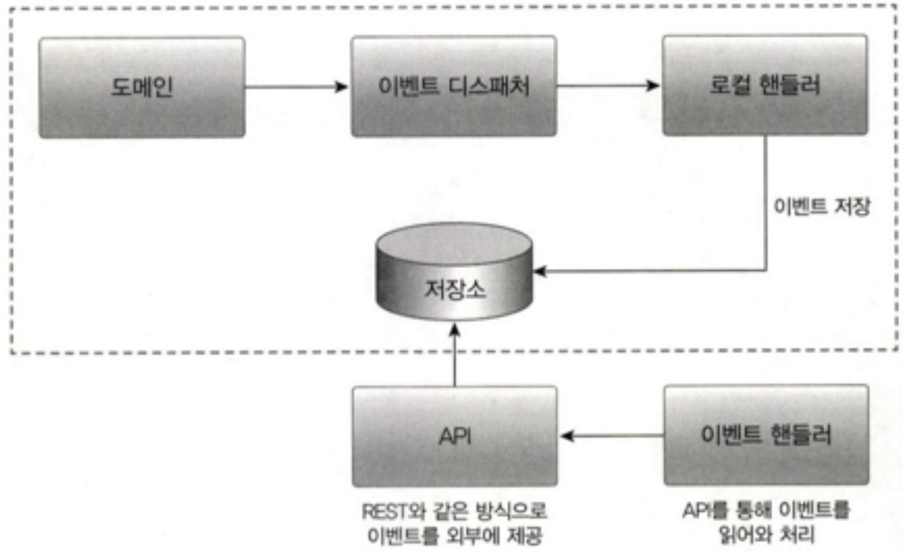
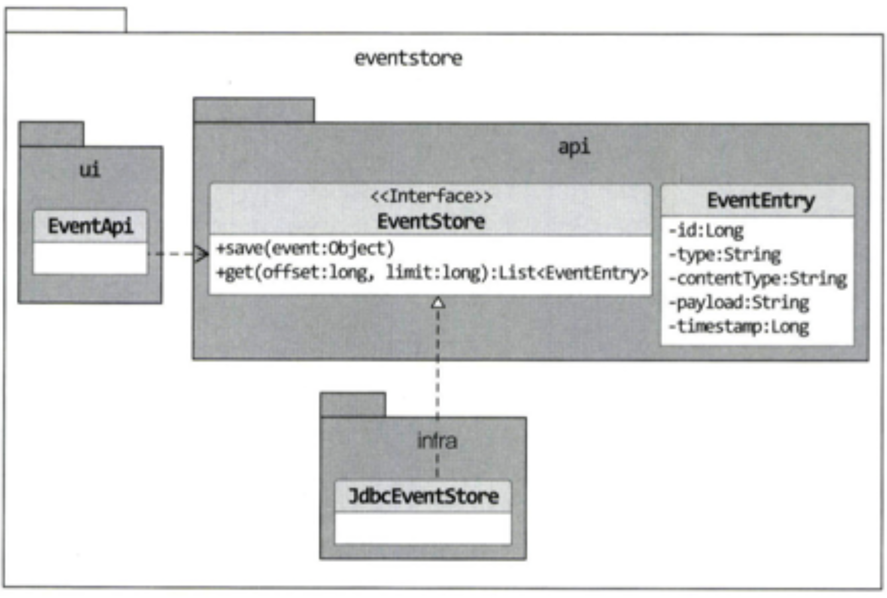

# 시스템 간 강결합 문제

**도메인 객체에서 환불 기능을 실행**

환불 기능을 제공하는 도메인 서비스를 파라미터로 전달받고 취소 도메인 기능에서 도메인 서비스를 실행하게 된다.

```java
public class Order {
    ...
    // 외부 서비스를 실행하기 위해 도메인 서비스르르 파라미터로 전달받음
    public void cancel(RefundService refundService) {
        // 주문 로직
        verifyNotYetShipped();
        this.state = OrderState.CANCELED;
        
        // 결제 로직
        this.refundStatus = State.REFUND_STARTED;
        try {
            // 외부 서비스 성능에 직접 영향을 받는다.
            refundService.refund(getPaymentId());
            this.refundStatus = State.REFUND_COMPLETED;
        } catch(Exception ex) {
            ...
        }
    }
    ...
}
```

도메인 객체에 서비스를 전달할 시 문제점.

주문 로직과 결제 로직이 섞이면서 **설계상 문제**가 나타날 수 있다.
- 환불 기능이 변경되면 Order도 영향을 받게 된다.
- 주문 도메인 객체의 코드를 결제 도메인 때문에 변경할지 모르는 상황은 좋지 않다.

기능을 추가할 때도 문제가 발생한다.
- 기능을 추가할 때마다 서비스 파라미터가 함께 추가되고, 다른 로직이 더 많이 섞이고, 트랜잭션 처리가 복잡해진다.
- 영향을 주는 외부 서비스가 증가하게 된다.

**응용 서비스에서 환불 기능 실행**

```java
public class CancelOrderService {
    private RefundService refindService;

    @Transactional
    public void cancel(OrderNo orderNo) {
        Order order = findOrder(orderNo);
        order.cancel();

        order.refundStart();
        try {
            // 외부 서비스 성능에 직접 영향을 받는다.
            refundService.refund(order.getPaymentId());
            order.refundCompleted();
        } catch(Exception ex) {
            ...
        }
    }
}
```

보통 결제 시스템은 외부에 존재하므로 RefundService는 **외부에 있는 결제 시스템이 제공하는 환불 서비스를 호출**한다.
- 이 때 두 가지 문제가 발생할 수 있다.

**첫 번쨰 문제, 외부 서비스가 정상이 아닐 경우 트랜잭션 처리를 어떻게 할 것인가?**
- 외부의 환불 서비스를 실행하는 과정에서 익센션이 발생하면 환불에 실패했으므로 주문 취소 트랜잭션을 롤백하는 것이 맞아 보이지만, 반드시 트랜잭션을 롤백해야 하는 것은 아니다.
- 주무은 취소 상태로 변경하고 환불만 나중에 다시 시도하는 방식으로 처리할 수도 있다.

**두 번째 문제, 성능**
- 환불을 처리하는 외부 시스템의 응답 시간이 길어지면 그 만큼 대기 시간도 길어진다.
- 환불 처리 기능이 30초가 걸리면 주문 취소 기능은 30초만큼 대기 시간이 증가한다
- 외부 서비스 성능에 직접적인 영향을 받게 된다.

...

이러한 문제가 발생하는 이유는 주문 바운디드 컨텍스트와 결제 바운디드 컨텍스트간의 **강결합(high coupling) 때문**이다.
- 강한 결합을 없애기 위해 `이벤트`를 사용할 수 있다.
- 특히 **비동기 이벤트를 사용하면 두 시스템 간의 결합을 크게 낮출 수 있다.**
- 이벤트가 익숙해지면 모든 연동을 이벤트와 비동기로 처리하고 싶을 정도로 강력하고 매력적이다.

# 이벤트 개요

여기서 `이벤트`라는 용어는 `과거에 벌어진 어떤 것`을 의미한다.
- ex. 암호를 변경했음 이벤트, 주문을 취소했음 이벤트

이벤트가 발생한다는 것은 **상태가 변경되었다는 것을 의미**한다.
- 이벤트가 발생하면 **그 이벤트에 반응하여 원하는 동작을 수행하는 기능을 구현**한다.

도메인 모델에서도 도메인의 상태 변경을 이벤트로 표현할 수 있다.
- 보통 `~할 때`, `~가 발생하면`, `만약 ~하면`과 같은 요구사항은 **도메인의 상태 변경과 관련**된 경우가 많고, 이런 **요구사항을 이벤트를 이용해서 구현**할 수 있다.

## 이벤트 관련 구성요소

도메인 모델에 이벤트를 도입하려면 `이벤트`, `이벤트 생성 주체`, `이벤트 디스패처`, `이벤트 핸들러`를 구현해야 한다.

<figure><figcaption></figcaption></figure>

도메인 모델에서 `이벤트 생성 주체`는 **엔티티, 밸류, 도메인 서비스와 같은 도메인 객체**이다.
- 도메인 객체는 도메인 로직을 실행해서 상태가 변경되면 관련 이벤트를 발생시킨다.

`이벤트 핸들러`는 **이벤트 생성 주체가 발생한 이벤트에 반응**한다.
- 이벤트 핸들러는 **생성 주체가 발생한 이벤트를 전달 받아 이벤트에 담긴 데이터를 이용해서 원하는 기능을 실행**한다.

**이벤트 생성 주체와 이벤트 핸들러를 연결해 주는 것**이 `이벤트 디스패처`이다.
- 이벤트 생성 주체는 **이벤트를 생성해서 디스패처에 이벤트를 전달**한다.
- 이벤트를 전달받은 **디스패처는 해당 이벤트를 처리할 수 있는 핸들러에 이벤트를 전파**한다.
- 이벤트 디스패처의 구현 방식에 따라 **이벤트 생성과 처리를 동기나 비동기로 실행**하게 된다.

## 이벤트의 구성

이벤트는 발생한 이벤트에 대한 정보를 담는다.
- `이벤트 종류`: 클래스 이름으로 이벤트 종류를 표현
- `이벤트 발생 시간`
- `추가 데이터`: 주문번호, 신규 배송지 정보 등 이벤트와 관련된 정보

배송지를 변경할 때 발생하는 이벤트 예
- 클래스 이름은 과거 시제(Changed)를 사용했다.
- 이벤트는 현재 기준으로 과거에 벌어진 것을 표현하므로 이벤트 이름에는 과거 시제를 사용한다.

```java
public class ShippingInfoChangedEvent {
    private String orderNumber;
    private long timestamp;
    private ShippingInfo newShippingInfo;
    ...
}
```

`ShippingInfoChangedEvent` 발생 주체는 Order 애그러거트다.
- Order 애그리거트의 배송지 변경 기능을 구현한 메서드는 배송지 정보를 변경한 뒤에 이 이벤트를 발생시킬 것이다.
- Event.raise()는 디스패처를 통해 이벤트를 전파하는 기능을 제공한다.

```java
public class Order {
    ...
    public void changeShippingInfo(ShippingInfo newShippingInfo) {
        verifyNotYetShipped();
        setShippingInfo(newShippingInfo);
        Events.raise(new ShippingInfoChangedEvent(number, newShippingInfo));
    }
    ...
}
```

`ShippingInfoChangedEvent`를 처리하는 핸들러는 디스패처로부터 이벤트를 전달받아 필요한 작업을 수행한다.
- ex. 변경된 배송지 정보를 물류 서비스에 전송하는 핸들러

```java
public class ShippingInfoChangedHandler {
    @EventListner(ShippingInfoChangedEvent.class)
    public void handle(ShippingInfoChangedEvent evt) {
        shippingInfoSynchronizer.sync(
            evt.getOrderNumber(),
            evt.getNewShippingInfo())
    }
}
```

이벤트는 이벤트 핸들러가 작업을 수행하는 데 필요한 데이터를 담아야 한다.
- 데이터가 부족하면 핸들러는 필요한 데이터를 관련 API를 호출하거나, DB에서 직접 읽어와야 한다.
- 이벤트 자체와 관련 없는 데이터는 포함할 필요는 없다.

## 이벤트 용도

이벤트는 크게 두 가지 용도로 쓰인다.

**첫 번째. 트리거(Trigger)**

도메인의 상태가 바뀔 때 **다른 후처리가 필요하면 후처리를 실행하기 위한 트리거로 이벤트를 사용**할 수 있다.
- 주문에서는 주문 취소 이벤트를 트리거로 사용할 수 있다.
- 주문을 취소하면 환불을 처리해야 하는데 이때 환불 처리를 위한 트리거로 주문 최소 이벤트를 사용할 수 있다.

**두 번째. 서로 다른 시스템 간의 데이터 동기화**
- 주문 도메인은 배송지 변경 이벤트를 발생시키고 이벤트 핸들러는 외부 배송 서비스와 배송지 정보를 동기화할 수 있다.

# 이벤트 장점

이벤트를 사용하면 서로 다른 도메인 로직이 섞이는 것을 방지할 수 있다.

```java
public class Order {
    public void cancel(RefundService refundService) {
        verifyNotYetShipped();
        this.state = OrderState.CANCELED;
        
        this.refundStatus = State.REFUND_STARTED;
        try {
            refundService.refund(getPaymentId());
            this.refundStatus = State.REFUND_COMPLETED;
        } catch(Exception ex) {
            ...
        }
    }
    ...
}

...

// 환불 서비스를 실행하기 위한 파라미터가 사라졌다.
public void cancel() {
    verifyNotYetShipped();
    this.state = OrderState.CANCELED;
    // 구매 취소 로직에 이벤트 적용(환불 로직이 사라졌다.)
    Events.raise(new OrderCanceledEvent(number.getNumber()));
}
```

**이벤트를 사용해서** 주문 도메인에서 결제(환불) 도메인으로의 **의존을 제거**할 수 있다.

**이벤트 핸들러를 사용하면 기능 확장도 용이**하다.
- 새로운 기능을 추가하고 싶다면 **핸들러를 구현**하면 된다.
- 기능을 확장해도 **기존 로직은 수정할 필요가 없다.**

<figure><figcaption></figcaption></figure>

# 이벤트, 핸들러, 디스패처 구현

이벤트와 관련된 코드
- `이벤트 클래스`: 이벤트를 표현한다.
- `디스패처`: 스프링이 제공하는 `ApplicationEventPublisher` 이용.
- `Event`: 이벤트 발생. 이벤트 발행을 위해 `ApplicationEventPublisher` 사용.
- `이벤트 핸들러`: 이벤트를 수신해서 처리. 스프링이 제공하는 기능 사용.

## 이벤트 클래스

이벤트를 위한 상위 타입이 존재하는 것이 아니고, **원하는 클래스를 이벤트로 사용**하면 된다.
- 이벤트는 과거에 벌어진 상태 변화나 사건을 의밈하므로 **이벤트 클래스 이름을 결정할 때는 과거 시제를 사용해야 하는 점만 유의하자**
- `OrderCanceledEvent` 같이 클래스 이름 뒤에 접미사로 Event를 사용해서 이벤트로 사용하는 클래스라는 것을 명시적으로 표현하거나, `OrderCanceled` 처럼 간결하게 과거 시제만 사용할 수 있다.

이벤트 클래스는 이벤트를 처리하는 데 필요한 **최소한의 데이터를 포함**해야 한다.
- ex. 주문 취소됨 이벤트는 적어도 주문번호를 포함해야 관련 핸들러에서 후속 처리가 가능하다.

모든 이벤트가 공통으로 갖는 프로퍼티가 존재한다면 관련 상위 클래스를 만들 수도 있다.
- ex. 모든 이벤트가 발생 시간을 갖도록 할 경우 상위 클래스를 만들고 각 이벤트 클래스가 상속받도록 하자.

```java
@Getter
public abstract class Event {
    private long timestamp;

    public Event() {
        this.timestamp = System.currentTimeMillis();
    }
}

...

@Getter
public class OrderCanceledEvent extends Event {
    // 이벤트는 핸들러에서 이벤트 처리에 필요한 데이터를 포함
    private String orderNumber;

    public OrderCanceledEvent(String number) {
        super();
        this.orderNumber = number;
    }
}
```

## Events 클래스와 ApplicationEventPublisher

이벤트 발생과 출판을 위해 스프링이 제공하는 `ApplicationEventPublisher` 사용
- Events 클래스는 `ApplicationEventPublisher`를 사용해서 이벤트를 발생시키도록 구현

```java
public class Events {
    private static ApplicationEventPublisher publisher;

    static void setPublisher(ApplicationEventPublisher publisher) {
        Events.publisher = publisher;
    }

    public static void rais(Object event) {
        if (publisher != null) {
            publisher.puslishEvent(event);
        }
    }
}
```

Events 클래스의 raise()는 `ApplicationEventPublisher`가 제공하는 publishEvent()를 이용해서 이벤트를 발생
- Events 클래스가 사용할 ApplicationEventPublisher 객체는 setPublisher()를 통해 전달받는다.
- Events#setPublisher()에 이벤트 퍼블리셔를 전달하기 위해 스프링 설정 클래스 작성이 필요하다.

```java
package com.myshop.common.event;

@Configuration
public class EventsConfiguration {
    /**
     * ApplicationContext는 ApplicationEventPublisher를 상속하고 있으므로
     * Events 클래스를 초기화할 때 ApplicationContext 전달
     */
    @Autowired
    private ApplicationContext applicationContext;
    
    /**
     * InitializingBean 타입 객체를 빈으로 설정
     * - 스프링 빈 객체 초기화 시 사용하는 인터페이스로, 
     * - 이 기능을 사용해서 Events 클래스를 초기화
     */
    @Bean
    public InitializingBean eventsInitializer() {
        return () -> Events.setPublisher(applicationContext);
    }
}
```

## 이벤트 발생과 이벤트 핸들러

이벤트를 발생시킬 코드는 `Events.raise()`를 사용하고, 이벤트를 처리할 핸듣ㄹ러는 스프링이 제공하는 `@EventListener`를 사용해서 구현

```java
package com.myshop.order.command.domain;

public class Order {
    public void cancel() {
        verifyNotYetShipped();
        this.state = OrderState.CANCELED;
        Events.raise(new OrderCanceledEvent(number.getNumber()));
    }
    ...
}

...

package com.myshop.order.infra;

@Service
public class OrderCanceledEventHandler {
    private RefundService refundService;

    public OrderCanceledEventHandler(RefundService refundService) {
        this.refundService = refundService;
    }

    @EventListener(OrderCanceledEvent.class)
    public void handle(OrderCanceledEvent event) {
        refundService.refund(event.getOrderNumber());
    }
}
```

ApplicationEventPublisher#publishEvent() 실행 시 OrderCanceledEvent 타입 객체를 전달하면
- OrderCanceledEvent.class 값을 갖는 @EventListener 애너테이션을 붙인 메서드를 찾아 실행
- OrderCanceledEventHandler#handle() 실행

## 흐름 정리

<figure><figcaption></figcaption></figure>

1. 도메인 기능을 실행한다.
2. 도메인 기능은 Events.raise()를 이용해서 이벤트를 발생시킨다.
3. Events.raise()는 스프링이 제공하는 ApplicationEventPublisher를 이용해서 이벤트를 출판한다.
4. ApplicationEventPublisher는 @EventListener(EventType.clas) 애너테이션이 붙은 메서드를 찾아 실행한다.

흐름을 보면 응용 서비스와 동일ㅇ한 트랜잭션 범위에서 이벤트 핸들러를 실행한다.
- 도멩니 상태 변경과 이벤트 핸들러는 같은 트랜잭션 범위에서 실행된다.

# 동기 이벤트 처리 문제

이벤트를 사용해서 강결합 문제는 해소했지만, 외부 서비스에 영향을 받는 문제가 남아 있다.
- 외부 서비스의 성능 저하가 내 시스템의 **성능 저하로 연결**되어 있다.
- **트랜잭션에도 문제**가 된다. 외부 환불 서비스 실행이 실패했을 경우 트랜잭션 롤백을 해야 할까?

```java
/**
 * 응용 서비스 코드
 * - 외부 연동 과정에서 예외가 발생하면 트랜잭션 처리는?
 */
@Transactional
public void cancel(OrderNo orderNo) {
    Order order = findOrder(orderNo);
    order.cancel(); // OrderCanceledEvent 발생
}

...

/**
 * 이벤트 처리 코드
 */
@Service
public class OrderCanceledEventHandler {
    ...
    @EventListener(OrderCanceledEvent.class)
    public void handle(OrderCanceledEvent event) {
        // 외부 환불 서비스로부터 응답이 느려지거나 예와가 발생한다면?
        refundService.refund(event.getOrderNumber());
    }
}
```

외부 시스템과의 연동을 동기로 처리할 때 발생하는 성능과 트랜잭션 범위 문제를 해소하는 방법은 두 가지가 있다.
1. **이벤트를 비동기로 처리하기**
2. **이벤트와 트랜잭션을 연계하기**

# 비동기 이벤트 처리

'A 하면 이어서 B 하라'는 요구사항 중에서 'A 하면 최대 언제까지 B 하라'로 바꿀 수 있는 요구사항은 이벤트를 비동기로 처리하는 방식으로 구현할 수 있다.

이벤트를 비동기로 구현할 수 있는 방법은 다양하다.
- 로컬 핸들러를 비동기로 실행하기
- 메시지 큐 사용하기
- 이벤트 저장소와 이벤트 포워더 사용하기
- 이벤트 저장소와 이벤트 제공 API 사용하기

## 로컬 핸들러 비동기 실행

이벤트 핸들러를 비동기로 실행하는 방법은 **이벤트 핸들러를 별도 스레드로 실행하는 것**이다.
- 스프링이 제공하는 `@Async`를 사용하면 쉽게 비동기로 이벤트 핸들러를 실행할 수 있다.
- `@EnableAsync` 선언으로 스프링의 비동기 실행 기능 활성화
- 비동기 실행 대상 이벤트 핸들러 메서드에 `@Async` 붙이기

```java
@EnableAsync
@SpringBootApplication
public class ShopApplication {
    public static void main(String[] args) {
        SpringApplication.run(ShopApplication.class, args);
    }
}

...

@Service
public class OrderCanceledEventHandler {
    /**
     * OrderCanceledEvent 발생 시 handle() 메서드를 별도 스레드를 이용해서 비동기 실행
     */
    @Async
    @EventListener(OrderCanceledEvent.class)
    public void handle(OrderCanceledEvent event) {
        refundService.refund(event.getOrderNumber());
    }
}
```

## 메시징 시스템을 이용한 비동기 구현

`Kafka`, `RabbitMQ` 같은 메시징 시스템을 사용하여 비동기로 이벤트를 처리할 수 있다.
- 이벤트가 발생하면 이벤트 디스패처는 이벤트를 메시지 큐에 보낸다.
- `메시지 큐`는 **이벤트를 메시지 리스너에 전달**하고, `메시지 리스너`는 **알맞는 이벤트 핸들러를 이용해서 이벤트를 처리**한다.
- **이벤트를 메시지 큐에 저장하는 과정과 메시지 큐에서 이벤트를 읽어와 처리하는 과정은 별도 스레드나 프로세스로 처리**된다.

<figure><figcaption></figcaption></figure>

필요 시 **이벤트를 발생시키는 도메인 기능과 메시지 큐에 이벤트를 저장하는 절차를 하나의 트랜잭션으로 묶어야** 한다.
- 도메인 기능을 실행한 결과를 DB에 반영하고 이 과정에서 발생한 이벤트를 메시지 큐에 저장하는 것을 같은 트랜잭션 범위에서 실행하려면 `글로벌 트랜잭션`이 필요하다.
- `글로벌 트랜잭션`을 사용하면 **안전하게 이벤트를 메시지 큐에 전달할 수 있는 장점**이 있지만, **전체 성능이 떨어지는 단점**도 있다.(지원하지 않는 메시징 시스템도 있다.)

메시지 큐를 사용하면 보통 **이벤트를 발생시키는 주체와 이벤트 핸들러가 별도 프로세스에서 동작**한다.
- 이벤트 발생 JVM과 이벤트 처리 JVM이 다르다는 것을 의미한다.
- 한 JVM에서 이벤트 발생 주체와 이벤트 핸들러가 메시지 큐를 이용해서 이벤트를 주고 받을 수 있지만, 동일 JVM에서 비동기 처리를 위해 메시지 큐를 사용하는 것은 시스템을 복잡하게 만든다.

`RabbitMQ`처럼 많이 사용되는 메시징 시스템은 글로벌 트랜잭션 지원과 함께 클러스터와 고가용성을 지원하므로 안정적으로 메시지를 전달할 수 있는 장점이 있다.
- 다양한 개발 언어와 통신 프로토콜을 지원한다.

`Kafka`도 메시지 전달을 위해 많이 사용된다.
- 클로벌 트랜잭션을 지원하지 않지만 다른 메시징 시스템에 비해 높은 성능을 보여준다.

## 이벤트 저장소를 이용한 비동기 처리

이벤트를 DB에 저장한 뒤 별도 프로그램을 이용해서 핸들러에 전달하는 방법도 있다.

**이벤트 저장소와 이벤트 포워더 사용하기**

<figure><figcaption></figcaption></figure>

**이벤트가 발생하면 핸들러는 스토리지에 이벤트를 저장**한다.
- 포워더는 **주기적으로 이벤트를 저장소에서 가져와 이벤트 핸들러를 실행**한다.
- 포워더는 **별도 스레드를 이용**하기 때문에 이벤트 발행과 처리가 **비동기**로 이루어진다.

이러한 방식은 **도메인의 상태와 이벤트 저장소로 동일한 DB를 사용**한다.
- 도메인의 상태 변화와 이벤트 저장이 로컬 트랜잭션으로 처리
- 이벤트를 물리적 저장소에 보관하므로 핸들러가 이벤트 처리에 실패할 경우 포워더는 다시 이벤트 저장소에서 이벤트를 읽어와 핸들러를 실행하면 된다.

**이벤트 저장소와 이벤트 제공 API 사용하기**

<figure><figcaption></figcaption></figure>

API 방식과 포워더 방식의 차이점은 이벤트를 전달하는 방식에 있다.
- 포워더 방식이 포워더를 이용해서 이벤트를 외부에 전달한다면 API 방식은 외부 핸들러가 API 서버를 통해 이벤트 목록을 가져간다.
- 포워더 방식은 이벤트를 어디까지 처리했는지 추적하는 역할이 포워더이 있다.
- API 방식은 이벤트 목록을 요구하는 외부 핸들러가 자신이 어디까지 이벤트를 처리했는지 기억해야 한다.

**이벤트 저장소 구현**

<figure><figcaption></figcaption></figure>

- `EventEntry`: 이벤트 저장소에 보관할 데이터
  - 이벤트를 식별하기 위한 id, 이벤트 타입(type), 직렬화한 데이터 형식(contentType), 이벤트 데이터(payload), 이벤트 시간(timestamp)를 갖는다.
- `EventStore`: 이벤트를 저장하고 조회하는 인터페이스 제공
- `JdbcEventStore`: JDBC를 이용한 EventStore 구현 클래스
- `EventApi`: REST API를 이용해서 이벤트 목록을 제공하는 컨트롤러

EventEntry Class
- 이벤트 데이터 정의

```java
package com.myshop.eventstore.api;

@Getter
@AllArgsConstructor
public class EventEntry {
    private Long id;
    private String type;
    private String contentType;
    private String payload;
    private long timestamp;

    public EventEntry(String type, String contentType, String payload) {
        this.type = type;
        this.contentType = contentType;
        this.payload = payload;
        this.timestamp = System.currentTimeMillis();
    }
}
```

EventStore Class
- 이벤트 객체를 직렬화해서 payload에 저장
- JOSN 직렬화 시 application/json
- 이벤트는 과거에 벌어진 사건이므로 데이터가 변경되지 않는다.(이벤트 추가, 조회 기능만 제공)

```java
public interface EventStore {
    void save(Object event);
    List<EventEntry> get(long offset, long limit);
}
```

JdbcEventStore Class

```java
package com.myshop.eventstore.infra;

@Component
@RequiredArgsConstructor
public class JdbcEventStore implements EventStore {
    private final ObjectMapper objectMapper;
    private final JdbcTemplate jdbcTemplate;

    @Override
    public void save(Object event) {
        // EventEntry 객체 생성
        // event 객체를 JSON 문자열로 변환
        EventEntry entry = new EventEntry(event.getClass().getName(),
                "application/json", toJson(event));
        jdbcTemplate.update(
                "insert into evententry " +
                        "(type, content_type, payload, timestamp) " +
                        "values (?, ?, ?, ?)",
                ps -> {
                    ps.setString(1, entry.getType());
                    ps.setString(2, entry.getContentType());
                    ps.setString(3, entry.getPayload());
                    ps.setTimestamp(4, new Timestamp(entry.getTimestamp()));
                });
    }

    private String toJson(Object event) {
        try {
            return objectMapper.writeValueAsString(event);
        } catch (JsonProcessingException e) {
            throw new PayloadConvertException(e);
        }
    }

    @Override
    public List<EventEntry> get(long offset, long limit) {
        return jdbcTemplate.query(
                "select * from evententry order by id asc limit ?, ?",
                ps -> {
                    ps.setLong(1, offset);
                    ps.setLong(2, limit);
                },
                (rs, rowNum) -> {
                    return new EventEntry(
                            rs.getLong("id"),
                            rs.getString("type"),
                            rs.getString("content_type"),
                            rs.getString("payload"),
                            rs.getTimestamp("timestamp").getTime());
                });
    }
}
```

```sql
create table shop.evententry (
  id int not null AUTO_INCREMENT PRIMARY KEY,
  `type` varchar(255),
  `content_type` varchar(255),
  payload MEDIUMTEXT,
  `timestamp` datetime
) character set utf8mb4;
```

**이벤트 저장을 위한 이벤트 핸들러 구현**

발생한 이벤트를 이벤트 저장소에 추가하는 이벤트 핸들러를 구현해 보자.

```java
package com.myshop.common.event;

@Component
public class EventStoreHandler {
    private EventStore eventStore;

    public EventStoreHandler(EventStore eventStore) {
        this.eventStore = eventStore;
    }

    /**
     * Event 타입을 상속받은 이벤트 타입만 이벤트 저장소에 보관
     */
    @EventListener(Event.class)
    public void handle(Event event) {
        eventStore.save(event); // 이벤트 객체 저장
    }
}

```

**REST API 구현**

```java
package com.myshop.eventstore.ui;

@RestController
public class EventApi {
    private EventStore eventStore;

    public EventApi(EventStore eventStore) {
        this.eventStore = eventStore;
    }

    @RequestMapping(value = "/api/events", method = RequestMethod.GET)
    public List<EventEntry> list(
            @RequestParam("offset") Long offset,
            @RequestParam("limit") Long limit) {
        return eventStore.get(offset, limit);
    }
}
```

이벤트 수정 기능이 없으므로 REST API도 단순 조회 기능만 존재

API 사용 클라이언트는 일정 간격으로 아래 과정을 실행
1. 가장 마지막에 처리한 데이터의 offset인 lastOffset 구하기. 저장한 lastOffset이 없으면 0 사용
2. 마지막에 처리한 lastOffset을 offset으로 사용해서 API 실행
3. API 결과로 받은 데이터 처리
4. offset + 데이터 개수를 lastOffset으로 저장

클라이언트 API를 이용해서 언제든지 원하는 이벤트를 가져올 수 있으므로 **이벤트 처리에 실패하면 실패한 이벤트부터 다시 읽어와 이벤트를 재처리**할 수 있다.
- API 서버에 장애가 발생한 경우에도 주기적으로 재시도해서 API 서버가 살아나면 이벤트를 처리할 수 있다.

**포워더 구현**

API 방식의 클라이언트 구현과 유사하다
- 포워더는 일정 주기로 EventStore에서 이벤트를 읽어와 이벤트 핸들러에 전달한다.
- API 방식 클라이언트와 마찬가지로 마지막으로 전달한 이벤트의 offset을 기억해 두고 다음 조회 시점에 마지막으로 처리한 offset 부터 이벤트를 가져오면 된다.

```java
package com.myshop.integration;

@Component
public class EventForwarder {
    private static final int DEFAULT_LIMIT_SIZE = 100;

    private EventStore eventStore;
    private OffsetStore offsetStore;
    private EventSender eventSender;
    private int limitSize = DEFAULT_LIMIT_SIZE;

    public EventForwarder(EventStore eventStore,
                          OffsetStore offsetStore,
                          EventSender eventSender) {
        this.eventStore = eventStore;
        this.offsetStore = offsetStore;
        this.eventSender = eventSender;
    }

    /**
     * getAndSend()를 주기적으로 실행하기 위해 스프링의 @Scheduled 사용
     */
    @Scheduled(initialDelay = 1000L, fixedDelay = 1000L)
    public void getAndSend() {
        // 읽어올 이벤트의 다음 offset 구하기(마지막 전송에 성공한 이벤트의 다음 이벤트부터)
        long nextOffset = getNextOffset();
        // 이벤트 저장소에서 offset부터 limitSize 만큼 이벤트 구하기
        List<EventEntry> events = eventStore.get(nextOffset, limitSize);
        // 구한 이벤트가 존재하는지 검사
        if (!events.isEmpty()) {
            // 이벤트가 존재하면 이벤트 전송(처리한 이벤트 개수 리턴)
            int processedCount = sendEvent(events);
            // 처리한 이벤트 개수가 0보다 크면 다음에 읽어올 offset 저장
            if (processedCount > 0) {
                saveNextOffset(nextOffset + processedCount);
            }
        }
    }

    private long getNextOffset() {
        return offsetStore.get();
    }

    private int sendEvent(List<EventEntry> events) {
        int processedCount = 0;
        try {
            for (EventEntry entry : events) {
                eventSender.send(entry);
                processedCount++;
            }
        } catch(Exception ex) {
            // 로깅 처리
            // 이벤트 전송을 멈추고 전송에 성공한 이벤트 개수 리턴
        }
        return processedCount;
    }

    private void saveNextOffset(long nextOffset) {
        offsetStore.update(nextOffset);
    }
}
```

OffsetStore Interface
- 구현 클래스는 offset 값을 DB 테이블에 저장하거나 로컬 파일에 보관해서 마지막 offset 값을 물리적 저장소에 보관

```java
package com.myshop.integration;

public interface OffsetStore {
    long get();
    void update(long nextOffset);
}
```

EventSender Interface
- 구현 클래스는 send()에서 외부 메시징 시스템에 이벤트를 전송하거나 원하는 핸들러에 이벤트를 전달
- 이벤트 처리 중 예외 발생 시 그대로 전파해서 다음 주기에 getAndSend() 실행 시 재처리할 수 있도록 한다.

```java
package com.myshop.integration;

public interface EventSender {
    void send(EventEntry event);
}
```

# 이벤트 적용 시 추가 고려 사항

이벤트 구현 시 고려해야 할 사항들

**첫 번째. 이벤트 소스를 EventEntry에 추가할지 여부**
- 특정 주체가 발생시킨 이벤트만 조회하는 기능을 구현하려면 이벤트에 발생 주체 정보를 추가해야 한다. (ex. Order가 발생시킨 이벤트만 조회하기)

**두 번째. 포워더에서 전송 실패를 얼마나 허용할 것인가**
- 포워더는 이벤트 전송에 실패하면 실패한 이벤트부터 다시 읽어와 전송을 시도
- 특정 이벤트에서 계속 전송 실패하게 되면 나머지 이벤트를 전송할 수 없게 된다.
- 실패한 이벤트의 재전송 횟수 제한을 두어야 한다. (ex. 동일 이벤트 전송을 3회 실패했을 경우 생략하고 다음 이벤트로 넘어가기)
  - 생략하지 않고 별도 실패용 DB나 메시지 큐에 저정하기도 한다. 처리에 실패한 이벤트를 물리적 저장소에 남겨두면 이후 실패 원인 분석이나 후처리에 도움이 된다.

**세 번째. 이벤트 손실**
- 이벤트 저장소를 사용하는 방식은 이벤트 발생과 이벤트 저장을 한 트랜잭션으로 처리하므로 트랜잭션에 성공하면 이벤트가 저장소에 보관된다는 것을 보장
- 반면 로컬 핸들러로 이벤트를 비동기로 처리할 경우 이벤트 처리에 실패하면 이벤트를 유실하게 된다.

**네 번째. 이벤트 순서**
- 이벤트 발생 순서대로 외부 시스템에 전달해야 할 경우, 이벤트 저장소를 사용하는 것이 좋다.
- 이벤트 저장소는 저장소에 이벤트를 발생 순서대로 저장하고, 순서대로 이벤트 목록을 제공한다.
- 반면 메시징 시스템은 사용 기술에 따라 이벤트 발생 순서와 메시지 전달 순서가 다를 수 있다.

**다섯 번째. 이벤트 재처리**
- 동일한 이벤트를 다시 처리해야 할 경우 이벤트를 어떻게 할지 결정해야 한다.
- 가장 쉬운 방법은 마지막으로 처리한 이벤트의 순번을 기억해두고, 이미 처리한 순번의 이벤트가 도착하면 해당 이벤트를 처리하지 않고 무시하는 것
- 이벤트를 여러 번 처리해도 동일한 결과를 주도록 멱등성을 이용하면 이벤트가 중복으로 발생해도 결과적으로 동일 상태가 되므로 이벤트 중복 발생이나 중복 처리에 대한 부담을 줄여준다.

## 이벤트 처리와 DB 트랜잭션 고려

이벤트 처리 시 DB 트랜잭션을 함께 고려해야 한다.

ex. 주문 취소와 환불 기능을 다음과 같이 이벤트를 이용해서 구현할 경우
- 주문 취소 기능은 주문 취소 이벤트를 발생시킨다.
- 주문 취소 이벤트 핸들러는 환불 서비스에 환불 처리를 요청한다.
- 환불 서비스는 외부 API를 호출해서 결제를 취소한다.

이벤트 처리를 동기로 하든 비동기로 하든 이벤트 처리 실패와 트랜잭션 실패를 함께 고려해야 한다.
- 트랜잭션 실패와 이벤트 처리 실패를 모두 고려하면 복잡해지므로 경우의 수를 줄이면 도움이 된다.
- 트랜잭션이 성공할 때만 이벤트 핸들러를 실행하도록 하자.

스프링은 `@TransactionalEventListener`를 지원한다.
- 스프링 트랜잭션 상태에 따라 이벤트 핸들러를 실행할 수 있도록 도와준다.
- `phase = TransactionPhase.AFTER_COMMIT`: 스프링은 트랜잭션 커밋에 성공한 뒤에 핸들러 메서드 실행
- 이 기능을 사용하면 이벤트 핸들러를 실행했는데 트랜잭션이 롤백되는 상황은 발생하지 않는다.

```java
@Async
@TransactionalEventListener(
        classes = OrderCanceledEvent.class,
        phase = TransactionPhase.AFTER_COMMIT
)
public void handle(OrderCanceledEvent event) {
    refundService.refund(event.getOrderNumber());
}
```

이벤트 저장소로 DB를 사용할 경우에도 동일하다.
- 이벤트 발생 코드와 이벤트 저장 처리를 한 트랜잭션으로 처리하면 된다.

> 트랜잭션이 성공할 때만 이벤트 핸들러를 실행하게 되면 트랜잭션 실패에 대한 경우의 수가 줄어 이벤트 처리 실패만 고민하면 된다. 이벤트 특성에 따라 재처리 방식을 결정하면 된다.