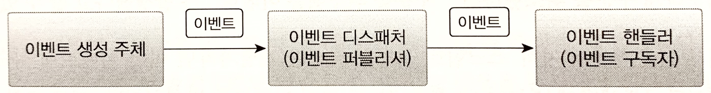
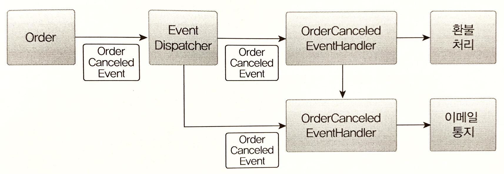
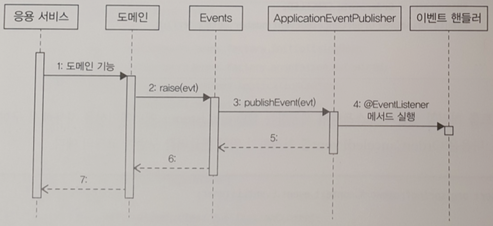

# 시스템 간 강결합 문제

**도메인 객체에서 환불 기능을 실행**

환불 기능을 제공하는 도메인 서비스를 파라미터로 전달받고 취소 도메인 기능에서 도메인 서비스를 실행하게 된다.

```java
public class Order {
    ...
    // 외부 서비스를 실행하기 위해 도메인 서비스르르 파라미터로 전달받음
    public void cancel(RefundService refundService) {
        // 주문 로직
        verifyNotYetShipped();
        this.state = OrderState.CANCELED;
        
        // 결제 로직
        this.refundStatus = State.REFUND_STARTED;
        try {
            // 외부 서비스 성능에 직접 영향을 받는다.
            refundService.refund(getPaymentId());
            this.refundStatus = State.REFUND_COMPLETED;
        } catch(Exception ex) {
            ...
        }
    }
    ...
}
```

도메인 객체에 서비스를 전달할 시 문제점.

주문 로직과 결제 로직이 섞이면서 **설계상 문제**가 나타날 수 있다.
- 환불 기능이 변경되면 Order도 영향을 받게 된다.
- 주문 도메인 객체의 코드를 결제 도메인 때문에 변경할지 모르는 상황은 좋지 않다.

기능을 추가할 때도 문제가 발생한다.
- 기능을 추가할 때마다 서비스 파라미터가 함께 추가되고, 다른 로직이 더 많이 섞이고, 트랜잭션 처리가 복잡해진다.
- 영향을 주는 외부 서비스가 증가하게 된다.

**응용 서비스에서 환불 기능 실행**

```java
public class CancelOrderService {
    private RefundService refindService;

    @Transactional
    public void cancel(OrderNo orderNo) {
        Order order = findOrder(orderNo);
        order.cancel();

        order.refundStart();
        try {
            // 외부 서비스 성능에 직접 영향을 받는다.
            refundService.refund(order.getPaymentId());
            order.refundCompleted();
        } catch(Exception ex) {
            ...
        }
    }
}
```

보통 결제 시스템은 외부에 존재하므로 RefundService는 **외부에 있는 결제 시스템이 제공하는 환불 서비스를 호출**한다.
- 이 때 두 가지 문제가 발생할 수 있다.

**첫 번쨰 문제, 외부 서비스가 정상이 아닐 경우 트랜잭션 처리를 어떻게 할 것인가?**
- 외부의 환불 서비스를 실행하는 과정에서 익센션이 발생하면 환불에 실패했으므로 주문 취소 트랜잭션을 롤백하는 것이 맞아 보이지만, 반드시 트랜잭션을 롤백해야 하는 것은 아니다.
- 주무은 취소 상태로 변경하고 환불만 나중에 다시 시도하는 방식으로 처리할 수도 있다.

**두 번째 문제, 성능**
- 환불을 처리하는 외부 시스템의 응답 시간이 길어지면 그 만큼 대기 시간도 길어진다.
- 환불 처리 기능이 30초가 걸리면 주문 취소 기능은 30초만큼 대기 시간이 증가한다
- 외부 서비스 성능에 직접적인 영향을 받게 된다.

...

이러한 문제가 발생하는 이유는 주문 바운디드 컨텍스트와 결제 바운디드 컨텍스트간의 **강결합(high coupling) 때문**이다.
- 강한 결합을 없애기 위해 `이벤트`를 사용할 수 있다.
- 특히 **비동기 이벤트를 사용하면 두 시스템 간의 결합을 크게 낮출 수 있다.**
- 이벤트가 익숙해지면 모든 연동을 이벤트와 비동기로 처리하고 싶을 정도로 강력하고 매력적이다.

# 이벤트 개요

여기서 `이벤트`라는 용어는 `과거에 벌어진 어떤 것`을 의미한다.
- ex. 암호를 변경했음 이벤트, 주문을 취소했음 이벤트

이벤트가 발생한다는 것은 **상태가 변경되었다는 것을 의미**한다.
- 이벤트가 발생하면 **그 이벤트에 반응하여 원하는 동작을 수행하는 기능을 구현**한다.

도메인 모델에서도 도메인의 상태 변경을 이벤트로 표현할 수 있다.
- 보통 `~할 때`, `~가 발생하면`, `만약 ~하면`과 같은 요구사항은 **도메인의 상태 변경과 관련**된 경우가 많고, 이런 **요구사항을 이벤트를 이용해서 구현**할 수 있다.

## 이벤트 관련 구성요소

도메인 모델에 이벤트를 도입하려면 `이벤트`, `이벤트 생성 주체`, `이벤트 디스패처`, `이벤트 핸들러`를 구현해야 한다.

<figure><figcaption></figcaption></figure>

도메인 모델에서 `이벤트 생성 주체`는 **엔티티, 밸류, 도메인 서비스와 같은 도메인 객체**이다.
- 도메인 객체는 도메인 로직을 실행해서 상태가 변경되면 관련 이벤트를 발생시킨다.

`이벤트 핸들러`는 **이벤트 생성 주체가 발생한 이벤트에 반응**한다.
- 이벤트 핸들러는 **생성 주체가 발생한 이벤트를 전달 받아 이벤트에 담긴 데이터를 이용해서 원하는 기능을 실행**한다.

**이벤트 생성 주체와 이벤트 핸들러를 연결해 주는 것**이 `이벤트 디스패처`이다.
- 이벤트 생성 주체는 **이벤트를 생성해서 디스패처에 이벤트를 전달**한다.
- 이벤트를 전달받은 **디스패처는 해당 이벤트를 처리할 수 있는 핸들러에 이벤트를 전파**한다.
- 이벤트 디스패처의 구현 방식에 따라 **이벤트 생성과 처리를 동기나 비동기로 실행**하게 된다.

## 이벤트의 구성

이벤트는 발생한 이벤트에 대한 정보를 담는다.
- `이벤트 종류`: 클래스 이름으로 이벤트 종류를 표현
- `이벤트 발생 시간`
- `추가 데이터`: 주문번호, 신규 배송지 정보 등 이벤트와 관련된 정보

배송지를 변경할 때 발생하는 이벤트 예
- 클래스 이름은 과거 시제(Changed)를 사용했다.
- 이벤트는 현재 기준으로 과거에 벌어진 것을 표현하므로 이벤트 이름에는 과거 시제를 사용한다.

```java
public class ShippingInfoChangedEvent {
    private String orderNumber;
    private long timestamp;
    private ShippingInfo newShippingInfo;
    ...
}
```

`ShippingInfoChangedEvent` 발생 주체는 Order 애그러거트다.
- Order 애그리거트의 배송지 변경 기능을 구현한 메서드는 배송지 정보를 변경한 뒤에 이 이벤트를 발생시킬 것이다.
- Event.raise()는 디스패처를 통해 이벤트를 전파하는 기능을 제공한다.

```java
public class Order {
    ...
    public void changeShippingInfo(ShippingInfo newShippingInfo) {
        verifyNotYetShipped();
        setShippingInfo(newShippingInfo);
        Events.raise(new ShippingInfoChangedEvent(number, newShippingInfo));
    }
    ...
}
```

`ShippingInfoChangedEvent`를 처리하는 핸들러는 디스패처로부터 이벤트를 전달받아 필요한 작업을 수행한다.
- ex. 변경된 배송지 정보를 물류 서비스에 전송하는 핸들러

```java
public class ShippingInfoChangedHandler {
    @EventListner(ShippingInfoChangedEvent.class)
    public void handle(ShippingInfoChangedEvent evt) {
        shippingInfoSynchronizer.sync(
            evt.getOrderNumber(),
            evt.getNewShippingInfo())
    }
}
```

이벤트는 이벤트 핸들러가 작업을 수행하는 데 필요한 데이터를 담아야 한다.
- 데이터가 부족하면 핸들러는 필요한 데이터를 관련 API를 호출하거나, DB에서 직접 읽어와야 한다.
- 이벤트 자체와 관련 없는 데이터는 포함할 필요는 없다.

## 이벤트 용도

이벤트는 크게 두 가지 용도로 쓰인다.

**첫 번째. 트리거(Trigger)**

도메인의 상태가 바뀔 때 **다른 후처리가 필요하면 후처리를 실행하기 위한 트리거로 이벤트를 사용**할 수 있다.
- 주문에서는 주문 취소 이벤트를 트리거로 사용할 수 있다.
- 주문을 취소하면 환불을 처리해야 하는데 이때 환불 처리를 위한 트리거로 주문 최소 이벤트를 사용할 수 있다.

**두 번째. 서로 다른 시스템 간의 데이터 동기화**
- 주문 도메인은 배송지 변경 이벤트를 발생시키고 이벤트 핸들러는 외부 배송 서비스와 배송지 정보를 동기화할 수 있다.

# 이벤트 장점

이벤트를 사용하면 서로 다른 도메인 로직이 섞이는 것을 방지할 수 있다.

```java
public class Order {
    public void cancel(RefundService refundService) {
        verifyNotYetShipped();
        this.state = OrderState.CANCELED;
        
        this.refundStatus = State.REFUND_STARTED;
        try {
            refundService.refund(getPaymentId());
            this.refundStatus = State.REFUND_COMPLETED;
        } catch(Exception ex) {
            ...
        }
    }
    ...
}

...

// 환불 서비스를 실행하기 위한 파라미터가 사라졌다.
public void cancel() {
    verifyNotYetShipped();
    this.state = OrderState.CANCELED;
    // 구매 취소 로직에 이벤트 적용(환불 로직이 사라졌다.)
    Events.raise(new OrderCanceledEvent(number.getNumber()));
}
```

**이벤트를 사용해서** 주문 도메인에서 결제(환불) 도메인으로의 **의존을 제거**할 수 있다.

**이벤트 핸들러를 사용하면 기능 확장도 용이**하다.
- 새로운 기능을 추가하고 싶다면 **핸들러를 구현**하면 된다.
- 기능을 확장해도 **기존 로직은 수정할 필요가 없다.**

<figure><figcaption></figcaption></figure>

# 이벤트, 핸들러, 디스패처 구현

이벤트와 관련된 코드
- `이벤트 클래스`: 이벤트를 표현한다.
- `디스패처`: 스프링이 제공하는 `ApplicationEventPublisher` 이용.
- `Event`: 이벤트 발생. 이벤트 발행을 위해 `ApplicationEventPublisher` 사용.
- `이벤트 핸들러`: 이벤트를 수신해서 처리. 스프링이 제공하는 기능 사용.

## 이벤트 클래스

이벤트를 위한 상위 타입이 존재하는 것이 아니고, **원하는 클래스를 이벤트로 사용**하면 된다.
- 이벤트는 과거에 벌어진 상태 변화나 사건을 의밈하므로 **이벤트 클래스 이름을 결정할 때는 과거 시제를 사용해야 하는 점만 유의하자**
- `OrderCanceledEvent` 같이 클래스 이름 뒤에 접미사로 Event를 사용해서 이벤트로 사용하는 클래스라는 것을 명시적으로 표현하거나, `OrderCanceled` 처럼 간결하게 과거 시제만 사용할 수 있다.

이벤트 클래스는 이벤트를 처리하는 데 필요한 **최소한의 데이터를 포함**해야 한다.
- ex. 주문 취소됨 이벤트는 적어도 주문번호를 포함해야 관련 핸들러에서 후속 처리가 가능하다.

모든 이벤트가 공통으로 갖는 프로퍼티가 존재한다면 관련 상위 클래스를 만들 수도 있다.
- ex. 모든 이벤트가 발생 시간을 갖도록 할 경우 상위 클래스를 만들고 각 이벤트 클래스가 상속받도록 하자.

```java
@Getter
public abstract class Event {
    private long timestamp;

    public Event() {
        this.timestamp = System.currentTimeMillis();
    }
}

...

@Getter
public class OrderCanceledEvent extends Event {
    // 이벤트는 핸들러에서 이벤트 처리에 필요한 데이터를 포함
    private String orderNumber;

    public OrderCanceledEvent(String number) {
        super();
        this.orderNumber = number;
    }
}
```

## Events 클래스와 ApplicationEventPublisher

이벤트 발생과 출판을 위해 스프링이 제공하는 `ApplicationEventPublisher` 사용
- Events 클래스는 `ApplicationEventPublisher`를 사용해서 이벤트를 발생시키도록 구현

```java
public class Events {
    private static ApplicationEventPublisher publisher;

    static void setPublisher(ApplicationEventPublisher publisher) {
        Events.publisher = publisher;
    }

    public static void rais(Object event) {
        if (publisher != null) {
            publisher.puslishEvent(event);
        }
    }
}
```

Events 클래스의 raise()는 `ApplicationEventPublisher`가 제공하는 publishEvent()를 이용해서 이벤트를 발생
- Events 클래스가 사용할 ApplicationEventPublisher 객체는 setPublisher()를 통해 전달받는다.
- Events#setPublisher()에 이벤트 퍼블리셔를 전달하기 위해 스프링 설정 클래스 작성이 필요하다.

```java
package com.myshop.common.event;

@Configuration
public class EventsConfiguration {
    /**
     * ApplicationContext는 ApplicationEventPublisher를 상속하고 있으므로
     * Events 클래스를 초기화할 때 ApplicationContext 전달
     */
    @Autowired
    private ApplicationContext applicationContext;
    
    /**
     * InitializingBean 타입 객체를 빈으로 설정
     * - 스프링 빈 객체 초기화 시 사용하는 인터페이스로, 
     * - 이 기능을 사용해서 Events 클래스를 초기화
     */
    @Bean
    public InitializingBean eventsInitializer() {
        return () -> Events.setPublisher(applicationContext);
    }
}
```

## 이벤트 발생과 이벤트 핸들러

이벤트를 발생시킬 코드는 `Events.raise()`를 사용하고, 이벤트를 처리할 핸듣ㄹ러는 스프링이 제공하는 `@EventListener`를 사용해서 구현

```java
package com.myshop.order.command.domain;

public class Order {
    public void cancel() {
        verifyNotYetShipped();
        this.state = OrderState.CANCELED;
        Events.raise(new OrderCanceledEvent(number.getNumber()));
    }
    ...
}

...

package com.myshop.order.infra;

@Service
public class OrderCanceledEventHandler {
    private RefundService refundService;

    public OrderCanceledEventHandler(RefundService refundService) {
        this.refundService = refundService;
    }

    @EventListener(OrderCanceledEvent.class)
    public void handle(OrderCanceledEvent event) {
        refundService.refund(event.getOrderNumber());
    }
}
```

ApplicationEventPublisher#publishEvent() 실행 시 OrderCanceledEvent 타입 객체를 전달하면
- OrderCanceledEvent.class 값을 갖는 @EventListener 애너테이션을 붙인 메서드를 찾아 실행
- OrderCanceledEventHandler#handle() 실행

## 흐름 정리

<figure><figcaption></figcaption></figure>

1. 도메인 기능을 실행한다.
2. 도메인 기능은 Events.raise()를 이용해서 이벤트를 발생시킨다.
3. Events.raise()는 스프링이 제공하는 ApplicationEventPublisher를 이용해서 이벤트를 출판한다.
4. ApplicationEventPublisher는 @EventListener(EventType.clas) 애너테이션이 붙은 메서드를 찾아 실행한다.

흐름을 보면 응용 서비스와 동일ㅇ한 트랜잭션 범위에서 이벤트 핸들러를 실행한다.
- 도멩니 상태 변경과 이벤트 핸들러는 같은 트랜잭션 범위에서 실행된다.

# 동기 이벤트 처리 문제

이벤트를 사용해서 강결합 문제는 해소했지만, 외부 서비스에 영향을 받는 문제가 남아 있다.
- 외부 서비스의 성능 저하가 내 시스템의 **성능 저하로 연결**되어 있다.
- **트랜잭션에도 문제**가 된다. 외부 환불 서비스 실행이 실패했을 경우 트랜잭션 롤백을 해야 할까?

```java
/**
 * 응용 서비스 코드
 * - 외부 연동 과정에서 예외가 발생하면 트랜잭션 처리는?
 */
@Transactional
public void cancel(OrderNo orderNo) {
    Order order = findOrder(orderNo);
    order.cancel(); // OrderCanceledEvent 발생
}

...

/**
 * 이벤트 처리 코드
 */
@Service
public class OrderCanceledEventHandler {
    ...
    @EventListener(OrderCanceledEvent.class)
    public void handle(OrderCanceledEvent event) {
        // 외부 환불 서비스로부터 응답이 느려지거나 예와가 발생한다면?
        refundService.refund(event.getOrderNumber());
    }
}
```

외부 시스템과의 연동을 동기로 처리할 때 발생하는 성능과 트랜잭션 범위 문제를 해소하는 방법은 두 가지가 있다.
1. **이벤트를 비동기로 처리하기**
2. **이벤트와 트랜잭션을 연계하기**


# 11.CQRS