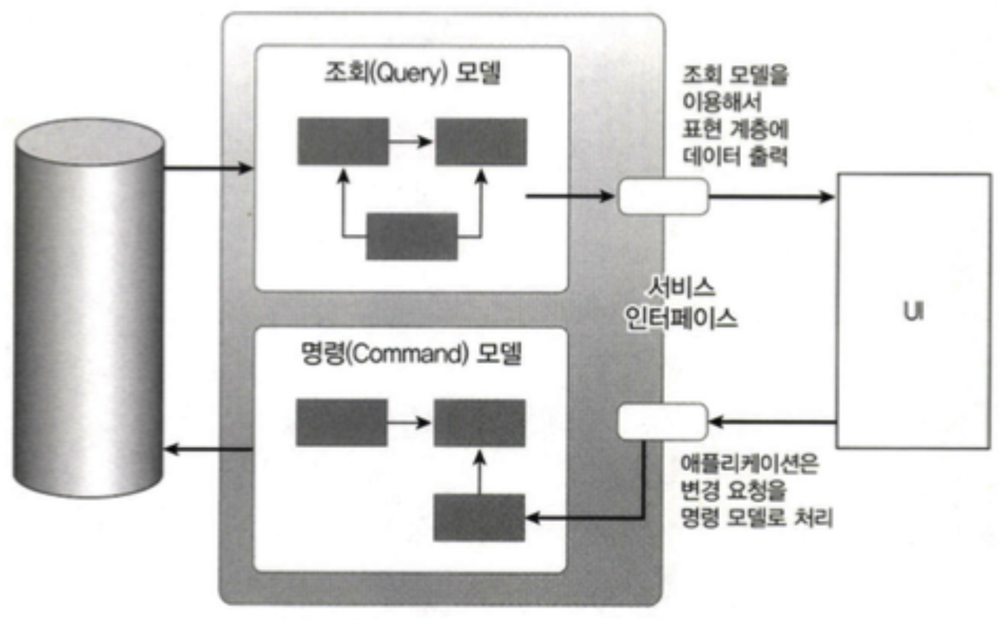
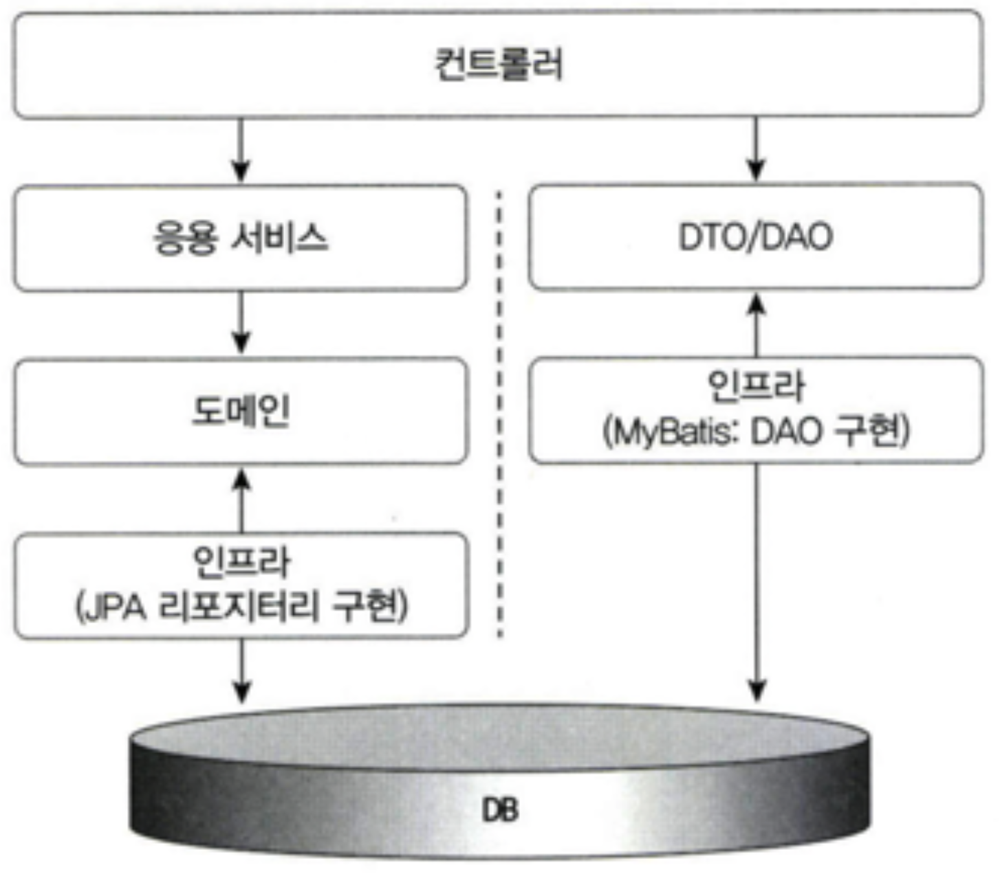
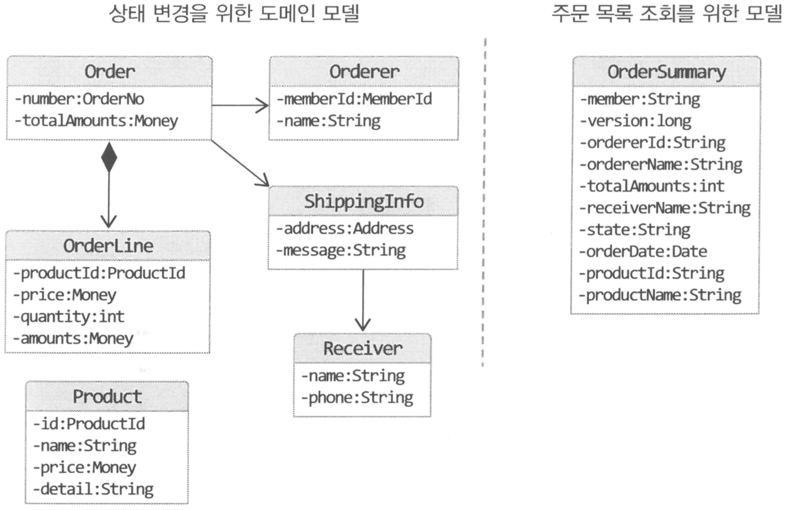
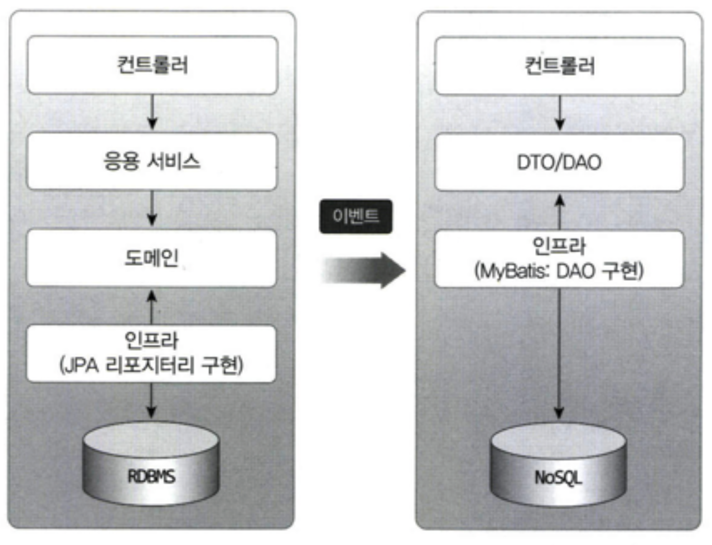

# 단일 모델의 단점

조회 화면 특성상 조회 속도가 빠를수록 좋은데 여러 애그리거트의 데이터가 필요하면 구현 방법을 고민해야 한다.

**식별자를 이용해서 애그리거트를 참조**하는 방식을 사용하면 즉시 로딩(eager loading) 방식과 같은 JPA 쿼리 관련 최적화 기능을 사용할 수 있다.
- 단, 한 번의 SELECT 쿼리로 조회 화면에 필요한 데이터를 읽어올 수 없어 조회 성능에 문제가 생길 수 있다.

애그리거트 간 연관을 **직접 참조하는 방식으로 연결**해도 조회화면 특성에 따라 같은 연관도 즉시 로딩(eager loading)이나 지연 로딩(lazy loading)으로 처리해야 한다.
- 조회 기능을 구현할 때 DBMS가 제공하는 전용 기능이 필요하면 JPA 네이티브 쿼리를 사용해야 할 수도 있다.

이러한 고민이 생기는 이유는 **시스템 상태를 변경할 때와 조회할 때 단일 도메인 모델을 사용하기 때문**이다.
- 객체 지향으로 도메인 모델을 구현할 때 주로 사용하는 **ORM 기법은 도메인 상태 변경 기능을 구현하는 데 적합**하지만
- 주문 상세 조회 화면처럼 여러 **애그리거트에서 데이터를 가져와 출력하는 기능을 구현하기에는 고려할 게 많아서 구현을 복잡하게 만드는 원인**이다.

이러한 구현 복잡도를 낮추는 간단한 방법으로는 상태 변경을 위한 모델과 조회를 위한 모델을 분리하는 것이다.

# CQRS

시스템이 제공하는 기능은 크게 두 가지로 나눌 수 있다.
  
(1) **상태를 변경하는 기능**
- 현재 저장하고 있는 데이터를 변경하는 방식으로 기능을 구현

(2) 사용자 입장에서 **상태 정보를 조회하는 기능**
- 조회 기능은 필요한 데이터를 읽어와 UI를 통해 보여주는 방식으로 구현

.

도메인 모델 관점에서 **상태 변경 기능은 주로 한 애그리거트의 상태를 변경**한다.
- 반면 조회 기능에 필요한 데이터를 표시하려면 두 개 이상의 대그리거트가 필요할 때가 많다.

상태를 변경하는 범위와 상태를 조회하는 범위가 정확하게 일치하지 않기 때문에 **단일 모델로 두 종류의 기능을 구현하면 모델이 불필요하게 복잡**해진다.
- 단일 모델을 사용할 때 발생하는 복잡도를 해결하기 위해 `CQRS 패턴`을 사용할 수 있다.

.

**CQRS 패턴**

`CQRS`(Command Query Responsibility Segregation)
- 상태를 변경하는 명령(Command)을 위한 모델과 상태를 제공하는 조회(Query)를 위한 모델을 분리하는 패턴

<figure><figcaption></figcaption></figure>

CQRS는 복잡한 도메인이 적합하다.
- 도메인이 복잡할수록 명령 기능과 조회 기능이 다루는 데이터 범위에 차이가 난다.
- 두 기능을 단일 모델로 처리하면 조회 기능의 로딩 속도를 위해 모델 구현이 필요 이상으로 복잡해진다.

.

**명령 모델과 조회 모델은 서로 다른 기술을 이용해서 구현할 수 있다.**

CQRS를 사용하면 각 모델에 맞는 구현 기술을 선택할 수 있다.
- 명령 모델은 객체 지향에 기반해서 도메인 모델을 구현하기에 적당한 **JPA를 사용해서 구현**
- 조회 모델은 DB 테이블에서 SQL로 데이터를 조회할 때 좋은 **Mybatis를 사용해서 구현**

<figure><figcaption></figcaption></figure>

조회 모델에는 응용 서비스가 존재하지 않는다.
- 데이터를 표현 영역에 전달하는 과정에서 몇 가지 로직이 필요하다면 응용 서비스를 두고 로직을 구현하면 된다.

.

**명령 모델과 조회 모델 예시**

명령 모델은 상태를 변경하는 도메인 로직을 수행하는 데 초점을 맞춰 설계하고, 조회 모델은 화면에 보여줄 데이터를 조회하는 데 초점을 맞춰 설계할 수 있다.

<figure><figcaption></figcaption></figure>

.

**명령 모델과 조회 모델이 서로 다른 DB를 사용할 수 있다.**

명령 모델과 조회 모델이 **서로 다른 데이터 저장소**를 사용할 수도 있다. 
- 명령 모델은 트랜잭션을 지원하는 `RDBMS`
- 조회 모델은 조회 성능이 좋은 메모리 기반 `NoSQL`

<figure><figcaption></figcaption></figure>

두 데이터 저장소 간 **데이터 동기화는 이벤트를 활용해서 처리**할 수 있다.
- 명령 모델에서 상태를 변경하면 이에 해당하는 이벤트가 발생하고, 그 이벤트를 조회 모델에 전달해서 변경 내역을 반영

명령 모델과 조회 모델이 서로 다른 데이터 저장소를 사용할 경우 **데이터 동기화 시점에 따라 구현 방식이 달라질 수 있다.**
- 명령 모델에서 데이터가 바뀌자마자 **변경 내역을 바로 조회 모델에 반영해야 한다면 동기 이벤트와 글로벌 트랜잭션을 사용**해서 실시간으로 동기화
  - 하지만, 동기 이벤트와 글로벌 트랜잭션을 사용하면 전반적인 성능(응답 속도와 처리량)이 떨어지는 단점이 존재
- 서로 다른 저장소의 데이터를 **특정 시간 안에만 동기화해도 된다면 비동기로 데이터를 전송**