# 요즘 당근 AI 개발

[요즘 당근 AI 개발](https://ebook-product.kyobobook.co.kr/dig/epd/ebook/E000012152702) 책을 요약한 내용입니다.

<figure><figcaption></figcaption></figure>

# PART 1. AI 활용 첫걸음

## 당신과 함께 해서 행복했던 일형 올림

> #LLM #거래후기 #중고거래 #프롬프트엔지니어링

||내용|
|---|---|
|서비스 소개|시용자가 물건을 중고로 판매했을 때, **판매한 물건이 사용자(판매자)에게 마지막 인사가 담긴 편지를 보내기 시작하는 경험**을 제공|
|목표|- 거래 경험 개선 및 활성화 - 후기 작성 동기 부여 - AI 기술 활용 검증|
|적용 기술|L**LLM(Large Language Model)** 물품의 특징과 거래 전후의 맥락을 이해하고, 이를 바탕으로 사용자가 마치 물품과 정서적으로 연결되어 있다는 느낌을 받을 수 있도록 프롬프트를 작성하여 편지를 생성|
|효과|거래 후기 작성률이 크게 증가|

<figure>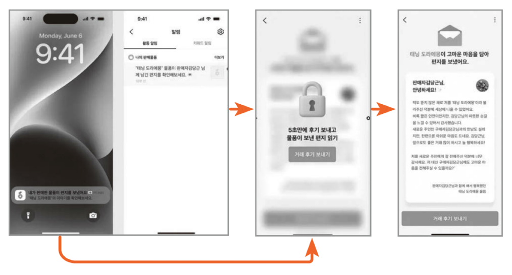<figcaption></figcaption></figure>

## AI 글쓰기 서비스

||내용|
|---|---|
|서비스 소개|**사용자가 글쓰기에서 느끼는 어려움과 번거로움을 해소**하기 위해 시작된 **AI 글쓰기 서비스**|
|목표|중고거래 시 물품을 빠르고 편리하게 판매할 수 있도록 돕는 것|
|적용 기술|**LLM(Large Language Model)** - **1단계 (사전 분석):** 사진에서 핵심 정보(물품명, 브랜드, 크기, 사용감 등)를 추출하여 추론 - **2단계 (본문 작성):** 추출된 정보를 바탕으로 중고거래 규칙에 맞게 본문을 생성 - **3단계 (오류 처리 및 상세 정보):** 오류 처리 및 사용자에게 필요한 상세 설명을 포함하여 마무리|
|효과|- **글쓰기 완료율 향상:** 사용자가 글 작성 단계에서 이탈하는 비율이 줄어들었음을 시사  - **사용자 만족도 증대:** **"조금 수정만 했을 뿐인데도 도움이 되네요,"** 또는 **"나보다 잘 쓴다"** 등 긍정적인 반응. 특히 상품에 대한 디테일을 스스로 작성할 수 있어서 편리하다는 평가  - **번거로움 및 노력 감소:** 사용자들의 **번거로움을 줄여** 더 쉽게 판매할 수 있도록 돕고, **사진만 있으면** 곧바로 판매를 시작할 수 있는 효과  - **판매 성과 개선:** 사용자들이 더 편하게 중고거래 글을 올리고, **판매도 더 잘 이루어지는 성과**|

# PART 2. AI 기반 운영 자동화 및 시스템 연동기

## 리뷰 자동화 시스템 구축기

||내용|
|---|---|
|서비스 소개|매일 쏟아지는 리뷰를 사람이 일일이 확인하고 분류하는 과정에서 발생하는 비효율성과 한계를 극복하고자 진행된 서비스|
|목표|- **사용자 의견 누락 방지 및 신속한 반영:** 매일 쏟아지는 리뷰 속에서 더 빠르고 깊이 있게 서비스에 반영 - **업무 효율성 극대화:** 운영팀 구성원들이 반복적이고 수작업에 많은 시간을 소모하는 리뷰 확인 및 분류 작업에서 벗어나, **더 창의적이고 본질적인 문제 해결**에 집중할 수 있도록 하는 것 - **서비스 강점 강화:** 긍정적인 피드백을 분석하여 서비스의 강점을 강화하는 방안을 모색하고, 특정 유형의 리뷰가 급증할 때 이를 이상 징후로 감지하여 미리 알려주는 **고도화된 시스템**을 구상|
|적용 기술|GPT, [Zapier](https://zapier.com/) - **GPT 기반 리뷰 요약 및 분류 (라벨링):** **Zapier + GPT의 조합**을 통해 리뷰 요약 기능을 구현. 이후, GPT에게 정확한 라벨링 기준을 프롬프트로 정의하여 리뷰를 **'서비스', '유형', '요약'** 등으로 자동 분류하는 시스템을 생성 &nbsp;&nbsp;&nbsp;&nbsp;- **리뷰 라벨링**: GPT가 리뷰 내용을 기반으로 **서비스(예: 중고거래, 동네생활, 페이), 유형(예: 오류, 개선 제안, 고객센터)** 등을 식별하여 명시적인 방식으로 이루어짐 &nbsp;&nbsp;&nbsp;&nbsp;- **GPT 임베딩(Embedding) 및 벡터 데이터베이스:** 정확도를 높이기 위해, 수집된 리뷰 데이터와 수동으로 라벨링한 샘플 데이터를 **GPT 임베딩**을 사용하여 벡터 데이터베이스에 저장. 신규 리뷰가 들어오면 이 데이터베이스에서 유사한 샘플을 추출하여 GPT에게 전달함으로써, 별도의 모델 학습 없이도 일관된 결과를 얻을 수 있도록 - **인사이트 도출 및 보고서 자동 생성:** 라벨링된 데이터를 기반으로, **GPT**를 사용하여 정형화된 **VoC(Voice of Customer) 분석 리포트**를 생성. 이 리포트는 '서비스', '이슈', '개선 사항' 등을 요약하여 실무에 바로 적용할 수 있는 형태 - **워크플로우 자동화 (Zapier & Slack):** 리뷰가 수신되면 Zapier가 메시지를 감지하고, GPT를 통해 분류 및 요약된 결과를 Slack 채널로 자동 전달하는 워크플로우를 구축|
|효과|- **획기적인 시간 절약(업무 효율성 증대):** **수작업 대비 최대 70~80%의 시간을 절약** - **정확도 및 일관성 향상:** GPT 기반의 자동화 라벨링을 통해 수동 작업 시 발생할 수 있는 오차를 줄이고, **정확도와 일관성**이 향상된 라벨링 결과를 확보 - **본질적인 업무 집중 및 인사이트 도출:** 단순 반복 작업이 줄어들면서, 반복적 업무에서 벗어나 **더 정교한 인사이트를 도출하고 개선 방향을 기획**하는 데 집중 - **활용 범위 확장 가능성:** 구축된 자동화 시스템은 리뷰뿐만 아니라 고객센터 문의, 신고 등 **다양한 피드백 소스**에도 적용 가능하여 높은 확장성|

    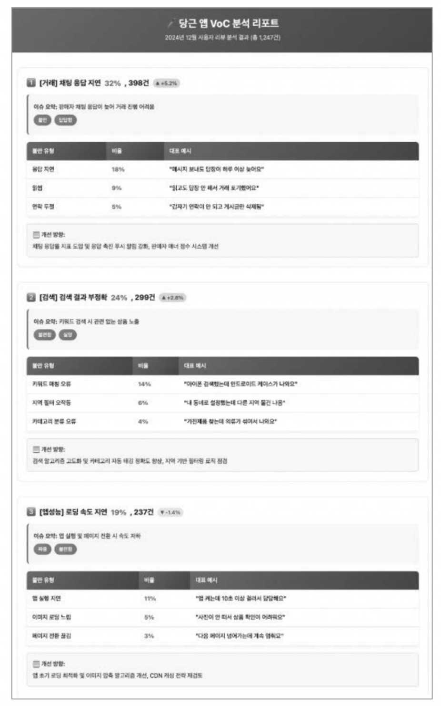
    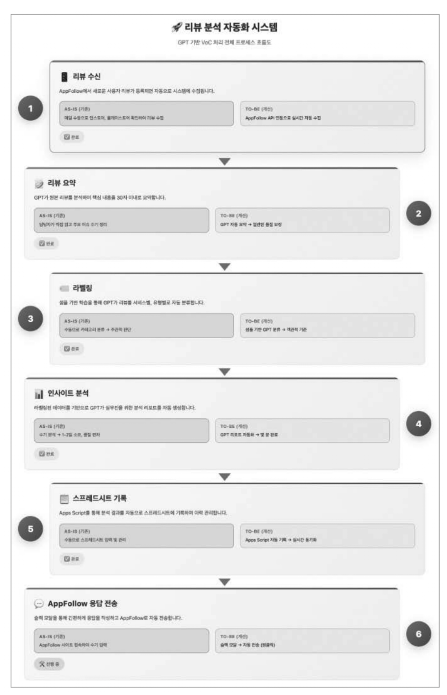

## LLM을 활용한 당근 중고거래 운영 자동화 전환기

||내용|
|---|---|
|서비스 소개| - **운영 업무의 특성:** 운영팀은 매일 사기 신고, 이상 게시글 처리, 반복되는 고객 응대 등의 문제를 해결하며, 이로 인해 중요한 전략 기획이나 사용자 경험 개선에 할애할 시간이 부족 - **플랫폼 환경:** 실시간으로 수천 개의 게시글이 올라오고, 개인 및 단체 간의 이해관계가 복잡하며, 사기 유형이 빠르게 진화하기 때문에 운영자는 이 모든 것을 실시간으로 감지하고 대응하며 정책을 개선해야 함 - **운영의 지속적 순환 사이클:** 중고거래 플랫폼의 운영 업무는 신고 접수, 검토, 판단, 필요시 정책 반영, 사유 작성, 제재로 이어지는 '지속적 순환 사이클'을 반복|
|목표|- **반복 업무 해소:** 업무 중 상당 부분이 반복되면서 지치고, 운영의 단순한 판단을 넘어 문제 해결 및 대응을 위한 에너지를 쏟아야 하는 상황을 개선 - **핵심 업무 자동화:** 매일 반복적으로 수행하는 중고거래 플랫폼의 핵심 업무를 자동화하는 방법을 모색 - **운영자의 도구 제작:** 비개발자도 현장의 문제를 해결하기 위한 AI 도구를 직접 만들 수 있음을 증명하고, 운영자가 복잡한 반복 업무를 해결할 수 있도록 지원|
|적용 기술|**LLM(Large Language Model)**, **FastAPI**, **Cursor AI**, **Claude**, **GPT-4** - **Regex Maker 도구**: 사용자가 입력한 내용을 바탕으로 백엔드에서 **GPT API**를 호출하여 정규식을 생성해 주는 도구 개발 - **프롬프트 엔지니어링:** 운영팀의 요구사항을 명확히 반영하여, GPT가 구체적이고 누락 없는 정규식을 출력하도록 프롬프트를 조정|
|효과|운영팀은 반복 업무 부담을 크게 줄이고 효율을 높이는 데 성공 - **정규식 작성 시간 감소:** 기존 평균 90~120분에서 **10~20분**으로 약 **80% 감소** - **동일 신고 유형 응대 시간 감소**|

<figure>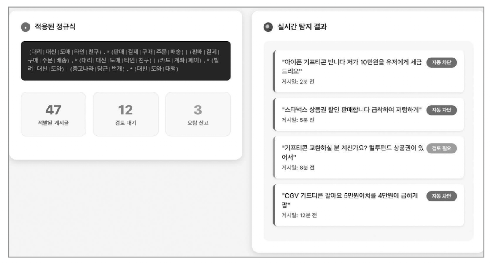<figcaption></figcaption></figure>

## 작은 팀, LLM으로 큰 업무효율 내기

||내용|
|---|---|
|서비스 소개|- 신규 가입자 지표봇 슬랙 메시지 - 에러 박사 슬랙 댓글|
|목표|- **생산성 향상 및 개발 집중:** 팀 리소스의 20%를 잡아먹던 반복적인 온콜 업무를 해결하고, 팀원 모두가 **개발에만 집중할 수 있는 환경**을 만드는 것 - **문제 대응 시간 단축:** 문제 대응 시간을 기존 **1시간에서 10분으로 단축**하는 것 - **운영 정책 자동화 및 개선:** 운영 정책이 고여 있지 않고 **자동으로 업데이트되는 구조**를 만들고, **실제 대응 기록을 LLM 학습에 활용하여 정책 문장 개선 제안까지 자동화**|
|적용 기술|`LLM`, `MCP`, `n8n`|
|효과|- **업무 시간 및 개발 집중도 확보:** 팀 업무 시간의 20%를 차지했던 온콜 업무가 해결되었으며, 이제 팀은 **대부분의 시간을 기능 개발에 투자** - **커뮤니케이션 비용 감소:** 과거 PM이나 개발자를 통해서만 알 수 있었던 정보가 MCP를 통해 직접 파악 가능해지면서 **커뮤니케이션 비용이 크게 감소** - **에러 분석 및 대응 시간 단축 (에러박사 사례):** 에러 분석 시작 이후 시간이 **1시간에서 10분 이내로 단축**. 에러가 긴급 대응이 필요한지 **새벽에도 즉시 확인**할 수 있게 되어 불필요한 대응 감소 - **정확한 정보 제공:** 에러박사가 분석한 결과는 센트리 메시지에 대한 댓글로 제공되어, 담당자가 별도의 로그북을 열지 않고도 **에러의 심도와 대응 방안**을 확인 - **반복 작업 자동화 및 인사이트 도출 (국가별 가입자 분석 리포트 사례):** 매일 아침 수동으로 SQL을 조회하고 지표를 계산하던 **30분 분량의 반복 작업**이 자동화 및 LLM이 데이터를 해석하여 의미 있는 인사이트 제공|

**구축된 MCP 서버 및 기능**
LLM이 실제 업무를 처리할 수 있도록, 5가지 기능을 수행하는 MCP 서버들을 구축
1.  **gRPC (실시간 정보 조회):** 사용자의 계정 상태 같은 **실시간 정보를 안전하게 조회**하며, 계정 권한 제어와 같은 **데이터 변경 작업**도 안전하게 구현 가능
2.  **BigQuery (데이터 기반 분석 쿼리):** 데이터베이스의 맥락을 이해하고 **스스로 적절한 쿼리를 작성 및 실행**하여 결과를 요약
3.  **Sentry (에러 상황 신속 파악):** 예기치 못한 에러 발생 시, 해당 에러의 상세 정보를 MCP로 가져와 LLM이 원인 분석 및 해결 방법을 제시
4.  **GitHub (코드 레벨 분석):** 에러가 발생한 위치(스택 트레이스)를 기반으로 해당 파일 및 라인 번호의 **실제 코드를 가져와** LLM의 원인 분석을 지원
5.  **Datadog (서비스 간 연관 파악):** 마이크로 서비스 환경에서 에러 요청의 전체 흐름을 추적하여, 에러와 연관된 다른 서비스와의 관계를 파악하도록 지원

    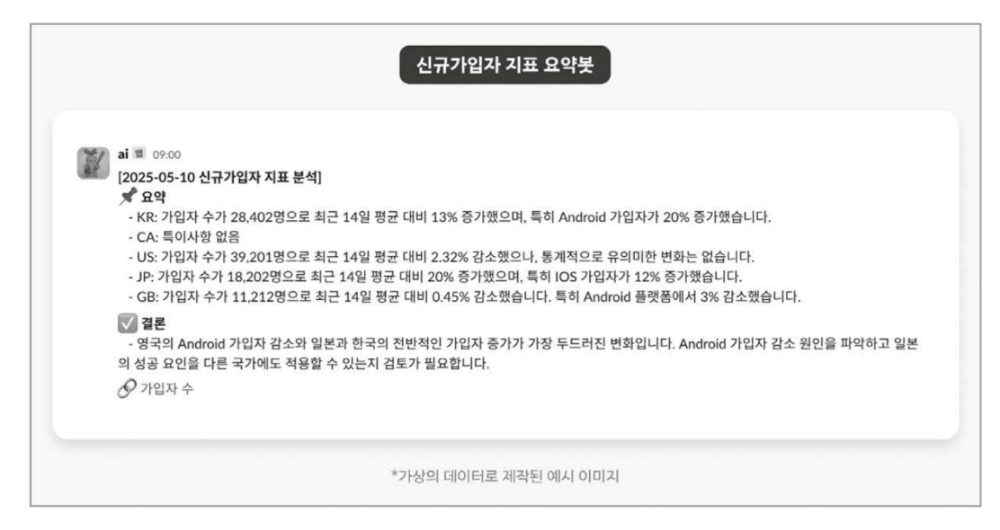
    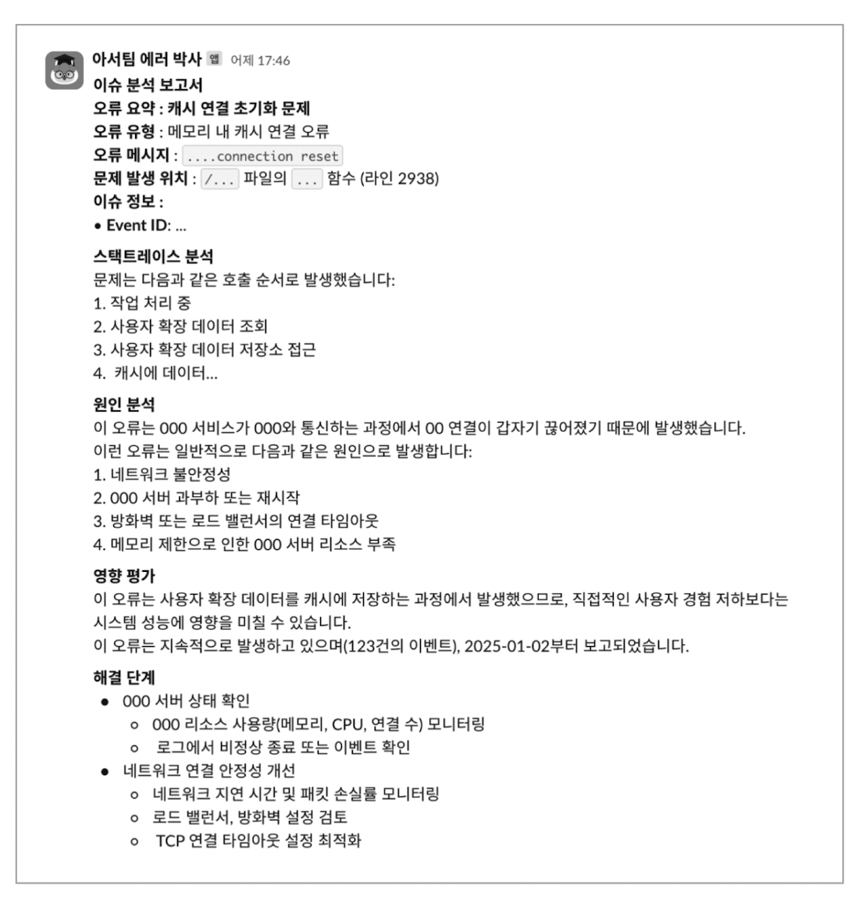

# PART 3. LLM을 이용한 개발기

## LLM으로 복잡한 게시글을 구조화하기까지

||내용|
|---|---|
|서비스 소개|LLM을 통해 복잡한 비정형 게시물(기프티콘, 교환건 등) 속에서 필요한 정보를 정확히 추출하고 구조화함으로써 서비스의 효율성과 사용자 경험을 크게 개선|
|목표|**비정형화된 게시물(비정형 텍스트 및 이미지)에서 핵심 정보(브랜드, 유효기간, 수량, 거래 방식 등)가를 추출하여 구조화**하는 것 - 모바일 영수증의 할인율 자동 계산, 남은 유효기간 검색, 브랜드별 트렌드 분석, 상품의 코드 유형 자동 분류 등|
|적용 기술|LLM - **속성(Property) 정의:** 추출해야 할 10가지 핵심 속성(상품명, 브랜드명, 유효기간, 판매 수량, 거래 방식, 코드 유형 등)을 명확히 정의 - **프롬프트 엔지니어링 (Prompt Engineering):** LLM이 원하는 기준을 안정적으로 재현할 수 있도록 수십만 개의 게시물을 샘플링하고 오류를 검토하며 프롬프트를 다듬는 반복적인 과정 - **JSON 형식 출력 요청:** 모델이 추출한 정보를 **정확한 JSON 형식**의 구조화된 데이터로 출력하도록 명시 - **Few-Shot 기법:** 모델이 명확히 정의된 기준에도 불구하고 엉뚱한 결과를 낼 때, 입출력 예시를 직접 보여주는 **few-shot prompting 기법**을 적용하여 모델의 안정성과 정확도를 향상. 또한, 유효기간이 여러 개인 경우 추축 규칙, 브랜드 인식 규칙, 이미지 정보 우선 반영 규칙 등을 세밀하게 정의|
|효과|LLM 적용과 반복적인 프롬프트 개선 작업을 통해 - **정확도 향상:** **정답률**이 꾸준히 증가하여 **90% 수준**까지 도달 - **데이터 자산화:** LLM이 기준을 안정적으로 재현하게 되면서, 구조화된 데이터를 기반으로 다양한 분석 환경을 구축|

## LLM을 활용한 스마트폰 시세 조회 서비스 구축하기

||내용|
|---|---|
|서비스 소개|**LLM을 활용하여 중고 거래 게시글에서 스마트폰 정보를 추출하고, 이를 통해 시세를 산출하여 사용자에게 시세 조회 기능을 제공**|
|목표|- **업무 효율성 개선 및 사용자 경험 향상:** 기존에 수많은 중고 매물 게시글을 일일이 확인하며 가격을 결정해야 했던 번거롭고 어려운 작업을 해결 - **정확한 시세 제공:** 중고 물품의 가격을 적절하게 결정하기 위해서는 색상, 용량, 사용 기간, 배터리 상태, 스크래치 여부 등 **다양한 상세 조건**을 파악 필요. 이 복잡하고 다양한 정보를 정확히 파악하여 신뢰할 수 있는 시세 정보를 제공|
|적용 기술|**LLM** -**정보 추출 및 정규화:** 중고 거래 게시글에서 스마트폰의 **모델, 용량, 새 상품 여부, 스크래치 및 파손 여부, 배터리 효율** 등 구체적인 판매 정보를 추출 - **게시글 분류/정제:** 추출된 데이터의 후처리 과정에서 **프롬프트 엔지니어링**을 통해 모델명이 잘못 추출되거나 일관성이 없는 경우(예: 'Galaxy Fold'와 'Galaxy Z Fold'를 동일하게 처리)를 정제하는 작업  **Embedding** - **유사 게시글 추천:** 시세 조회 시 통계 데이터 외에도 **유사한 매물 게시글을 제공** -**검색 최적화:** 팀 내에서 저장 및 검색에 최적화된 **임베딩 모델 DB**를 구축하고, 쿼리(질의)와 게시글 임베딩 간의 유사도를 비교하여 **정확도 높은 검색 결과**를 제공|
|효과|- **작업 효율성 및 결과의 일관성 확보:** - **고품질의 시세 및 추천 게시글 제공:** 시세 조회 후 **사용자가 원하는 조건에 맞는 구체적인 가격 범위**를 제공 - **검색 경험 개선:** 임베딩 모델을 통해 **단순한 문자열 일치**를 넘어 사용자 질의의 문맥적 의도를 파악하여, 쿼리에 포함된 제품의 버전, 모델명 등의 핵심 단어를 추출하고 점수를 매겨 **사용자가 원하는 모델을 포함한 게시글**을 오차 없이 제공|

<figure>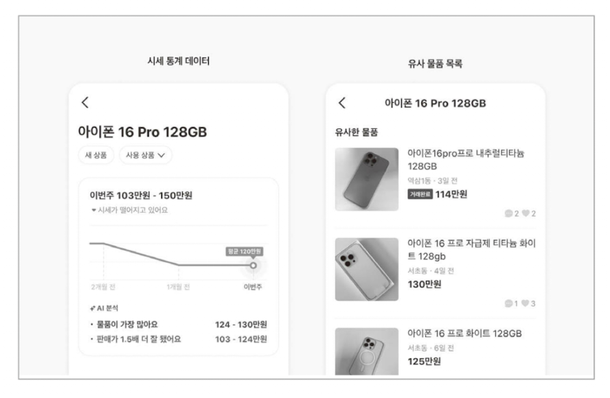<figcaption></figcaption></figure>

## 3살 아가가 좋아할 만한 장난감 LLM으로 추천하기

||내용|
|---|---|
|서비스 소개|사용자가 AI에게 원하는 물품을 물어보고 그에 맞는 상품을 추천|
|목표|- **기존 추천 시스템의 한계 극복:** 기존의 머신러닝 기반 추천 시스템은 사용자의 과거 활동 기록(조회, 구매, 관심 목록)을 바탕으로 하여, 사용자를 **'필터 버블(Filter Bubble)'** 에 가두고 유사한 물품만 반복적으로 노출시키는 경향 - **맞춤형 탐색 경험 제공:** 단순한 키워드 검색을 넘어, 사용자의 **관심사와 관련된 높은 품질의 물건을 발견**할 기회를 제공 - **대화 및 맥락 이해:** 사용자들이 단순한 키워드 검색 방식을 벗어나, **자신의 생각과 의도를 문맥적인 질문으로 표현**하여 대화 검색 결과에 직접 닿을 수 있도록 하는 것|
|적용 기술|**LLM** - 사용자의 질문을 이해하고, 사용자가 좋아할 만한 주제 및 추측 주제를 생성하는 데 사용  **텍스트 임베딩 모델:** - 사용자의 질문, 도큐먼트, LLM이 생성한 추측 주제를 기반으로 **텍스트 임베딩 모델**을 사용하여 벡터 데이터베이스에 저장된 게시물과의 의미론적 유사성을 계산하고, 추천 결과를 도출  **프롬프트 엔지니어링:** - LLM의 역할을 정의하고, 출력 형태 및 규칙(예: 최대 3가지 품목 카테고리만 추천, 제목에 이모지 포함하지 말 것 등)을 명확히 지정|
|효과|- **사용자 호기심 유발 및 실질적인 관심 증가:** AI의 추천을 받은 사용자들이 추천된 게시물을 **흥미롭게 탐색** - **예상치 못한 물품 발견의 즐거움 선사:** 이 기능은 사용자가 **예상치 못했던 물품을 발견**하는 **'득템의 즐거움'** 을 선사할 수 있는 가능성을 보임 - **복잡한 질문 처리 능력 입증:** LLM이 모호하거나 복잡한 질문("언제 주식 투자를 시작해야 할까?", "스트레스 해소용 물품을 추천해 달라")에도 믿을 만한 답변을 제공함으로써, 예상치 못한 질문까지도 완벽히 처리|

<figure>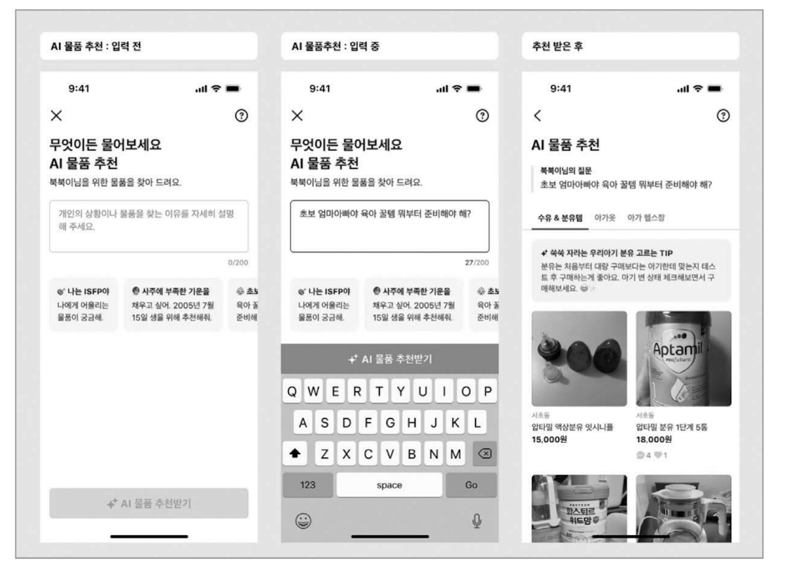<figcaption></figcaption></figure>

<figure><figcaption></figcaption></figure>

## 연간 LLM 호출 비용 25% 절감. 시맨틱 캐싱 도입

||내용|
|---|---|
|서비스 소개|채팅창에서 대화 흐름에 맞춰 문장을 자동으로 추천해 주는 AI 메시지 추천 기능에 시맨틱 캐싱 도입|
|목표|AI 기능을 유지하면서 프롬프트 호출 비용만 **연간 8~9억 원**에 달하는 **과도한 LLM 비용을 효율적으로 절감**|
|적용 기술|**시맨틱 캐싱(Semantic Caching)** - 단순한 문자열 일치가 아니라 **의미 기반의 유사도**를 활용 - 코사인 유사도와 같은 거리 유사도 측정 방법을 사용하여 문장의 의미가 가까울 경우, 문장의 형태가 다르더라도 캐시 히트로 처리하여 LLM 호출 없이 저장된 데이터를 반환  **구현 기술** - **임베딩 및 벡터화:** 비정형 텍스트 데이터를 임베딩 과정을 통해 기계가 이해할 수 있는 벡터 공간으로 변환(이를 위해 텍스트 임베딩 모델을 사용하며, 문장 하나당 수백~수천 차원의 벡터로 표현) - **차원 축소:** 계산 효율성을 높이기 위해 PCA(주성분 분석, Principal Component Analysis) 등의 머신러닝 기법을 적용하여 벡터의 차원을 축소 - **벡터 데이터베이스:** 캐시 데이터를 저장하기 위해 벡터 데이터베이스를 선택(외부 솔루션 대신 기존 시스템 환경 내부에 통합된 임베딩 방식인 [chromem-go](https://github.com/philippgille/chromem-go) 선택) - **시스템 아키텍처:** 시맨틱 캐싱을 처리하는 로직은 기존 서비스 로직에 영향을 주지 않도록 **독립적인 서버** 로 분리되어 gRPC 프로토콜을 통해 통신하도록 설계 및 구현 - **검색 최적화:** 빠른 검색 속도를 위해 **Approximate Nearest Neighbor Search**와 같은 근사 최근접 이웃 검색 기법을 적용|
|효과|**획기적인 비용 절감:** - **연간 LLM 호출 비용 약 24% 절감** - **연간 2.16억 원**에 해당하는 비용 절감  **성능 및 속도 개선:** - 1,000개의 벡터 검색이 **2ms 이내**로 빠르게 처리 - replica 당 초당 **100~120건의 요청**을 안정적으로 처리할 수 있는 성능을 확보|

<figure>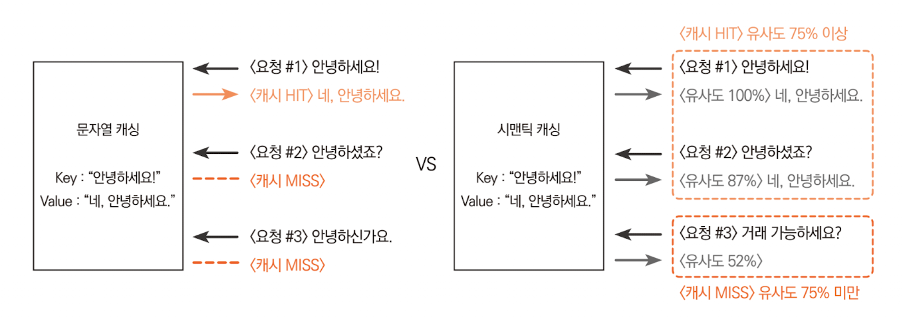<figcaption></figcaption></figure>

<figure>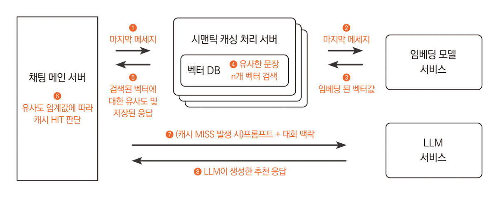<figcaption></figcaption></figure>

# PART 4. AI 플랫폼과 AI 에이전트 개발기

## VoC 플레이그라운드로 고객 목소리에 반응하는 당근 만들기

||내용|
|---|---|
|서비스 소개|방대한 사용자 의견을 효과적으로 관리하고 분석하는 어려움을 해결|
|목표|- **데이터 처리 자동화 및 효율화:** 매일 대량으로 들어오는 사용자 의견(예: 문의, 리뷰, 의견 남기기 등)을 수동으로 분석하고 분류하는 데 필요한 많은 리소스를 줄이는 것 - **실질적인 인사이트 도출:** 단순히 데이터를 요약하는 것을 넘어, 팀이 실제로 행동할 수 있는 **'실질적인 인사이트'**를 도출하고 공유할 수 있도록 지원|
|적용 기술|**LLM** - **VoC 데이터 정리 및 분류(클러스터링):** VoC LLM 파이프라인을 구축하여 방대한 양의 VoC 데이터를 수많은 대분류와 중분류로 나누어 조회 - **데이터 필터링 및 분석 엔진:** LLM을 기반으로 **프롬프트를 작성하여 데이터를 분석**. 사용자는 원하는 필터와 기간을 선택하고, LLM에 질문하여 원하는 정보를 요청 - **보고서 자동 생성:** LLM을 활용하여 분석 결과를 기반으로 자동화된 보고서를 생성. 이 보고서는 통계/지표와 레이블링을 기반으로 작성되어, 객관적인 데이터 기반의 인사이트 추출 환경을 제공|
|효과|- **서비스 문제점 신속한 파악 및 해결:** LLM 분석을 통해 택배 예약 취소가 예상보다 많았고, 특히 **'무게 초과' 문제**가 주원인임을 빠르게 파악. 이 정보를 바탕으로 판매자가 현장에서 직접 무게 정보를 수정할 수 있는 기능을 개발하여, 서비스 이용률을 높이고 부당한 취소 의견을 줄이는 효과 - **업무 효율성 증대(정기 보고서 자동화):** 보고서 작성 시간이 줄어들어 담당자들이 실질적인 인사이트 도출 및 서비스 개선에 더 많은 시간을 할애 - **데이터 기반의 의사 결정 지원:** 담당자의 경험이나 직관에 의존하지 않고, 데이터 기반으로 구체적인 정책을 수립하고 서비스를 명확히 개선하는 데 도움|

**보고서**

<figure>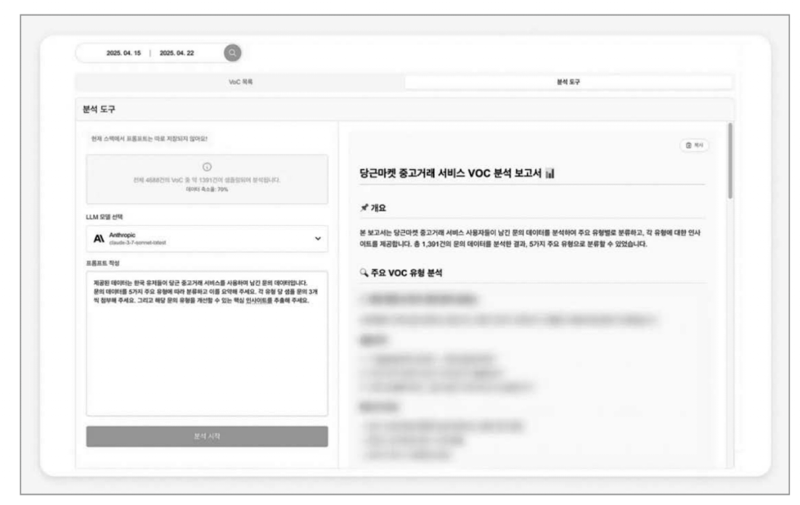<figcaption></figcaption></figure>

**정기 보고서**

<figure>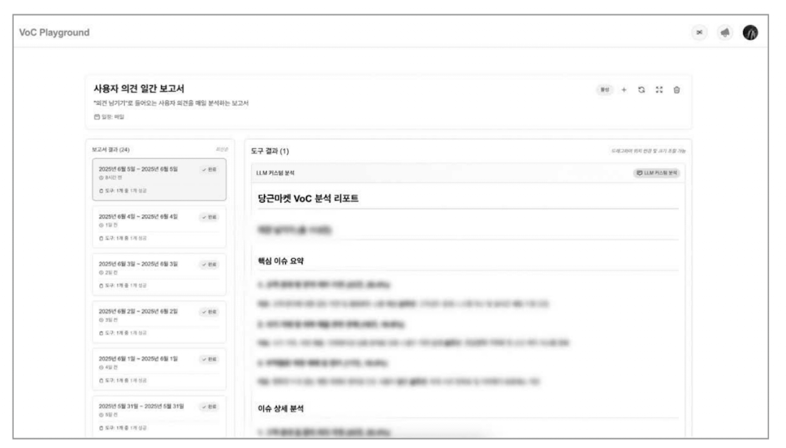<figcaption></figcaption></figure>

