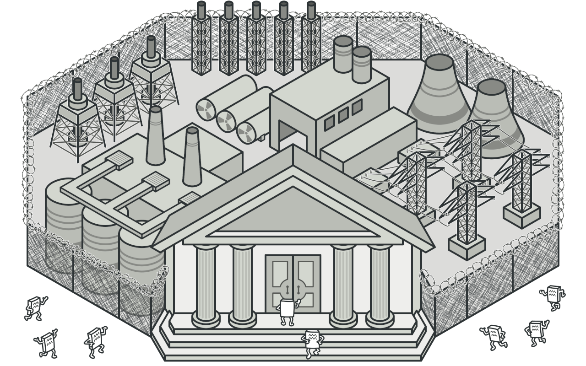
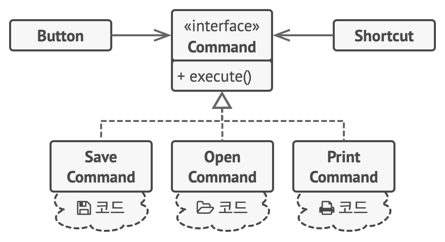
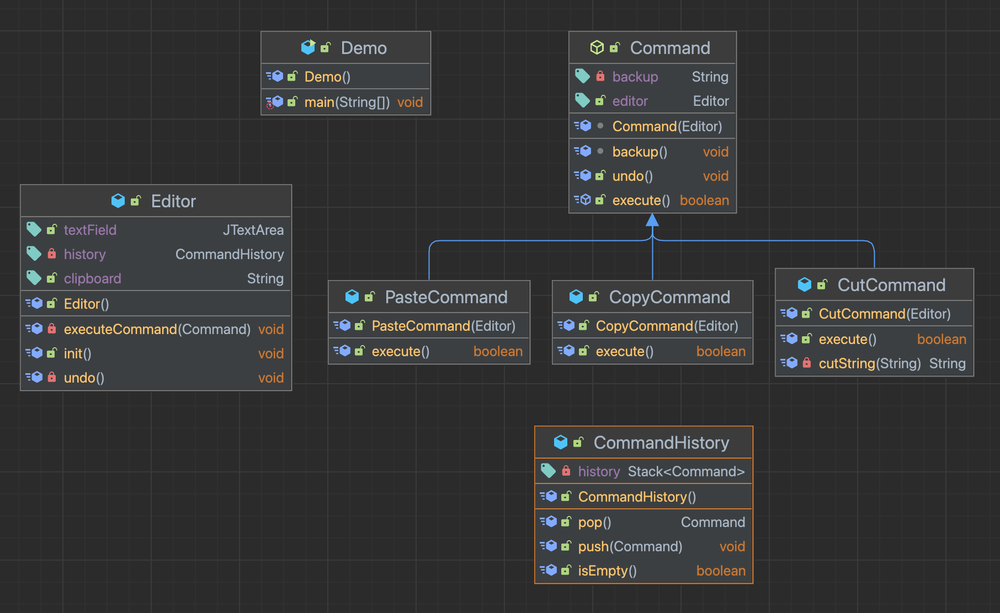
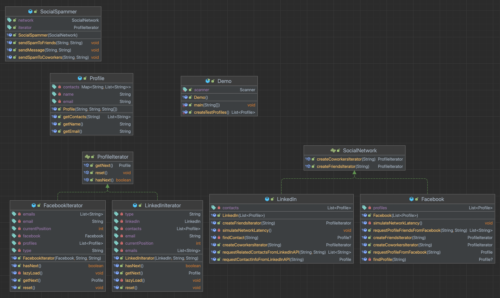
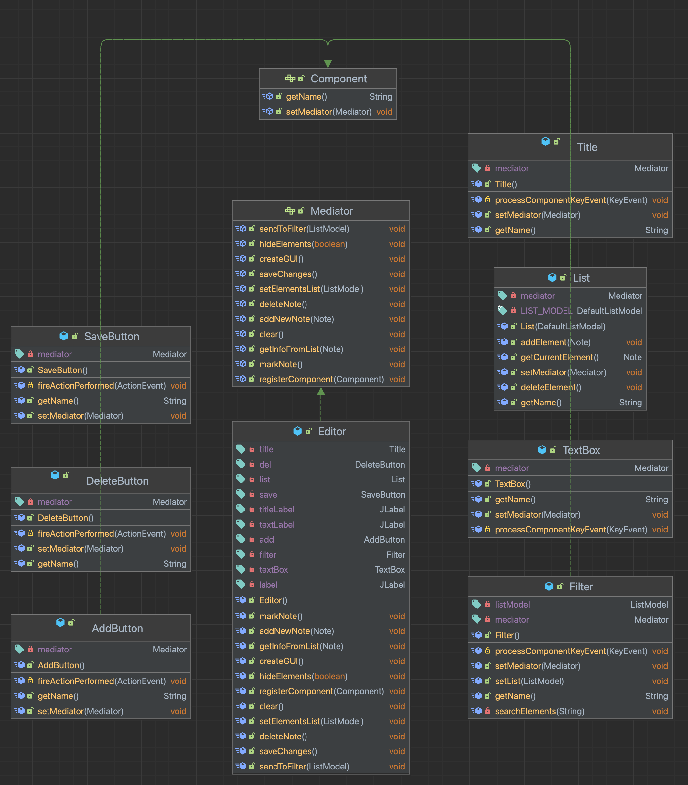
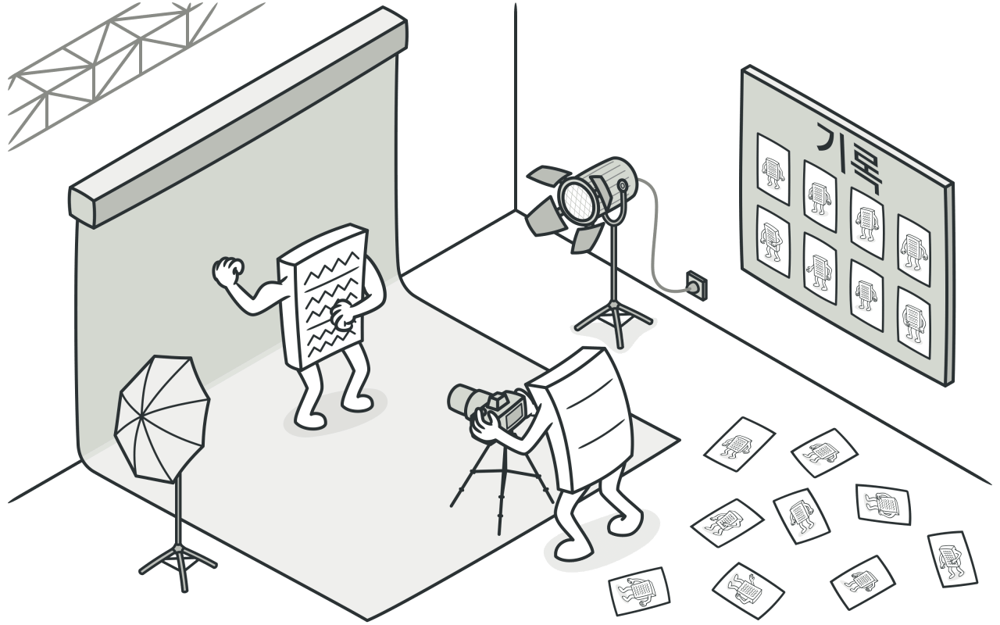
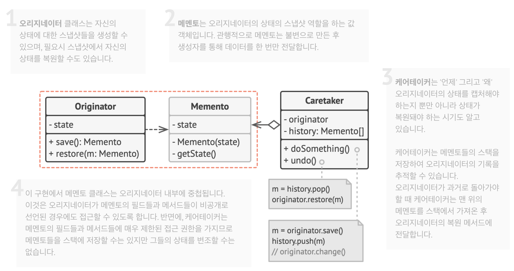
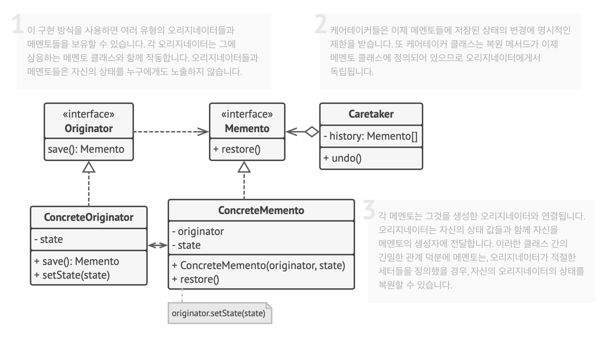
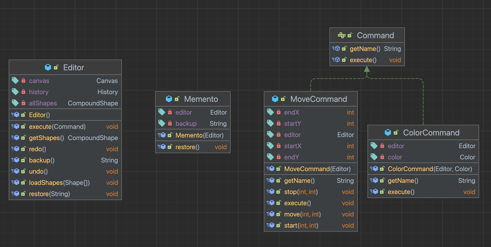

# GoF Design Patterns

[Refactoring.Guru](https://refactoring.guru/) 의 [Design Patterns](https://refactoring.guru/design-patterns) 주제를 정리하며 실습한 내용들을 다루는 글입니다.

.

# Creational Design Patterns

생성 디자인 패턴은 기존 코드의 유연성과 재사용을 증가시키는 `객체를 생성하는 다양한 방법`을 제공

.

## Factory Method

[factory-method](https://refactoring.guru/design-patterns/factory-method)

부모 클래스에서 객체들을 생성할 수 있는 인터페이스를 제공하지만, `자식 클래스들이 생성될 객체들의 유형을 변경`할 수 있도록 하는 생성 패턴


> 구상 클래스들로부터 객체들을 생성하는 생성 메서드들로 인식될 수 있다. 구상 클래스들은 객체 생성 중에 사용되지만 팩토리 메서드들의 반환 유형은 일반적으로 추상 클래스 또는 인터페이스로 선언

- [java.util.Calendar#getInstance()](https://docs.oracle.com/javase/8/docs/api/java/util/Calendar.html#getInstance--)
- [java.util.ResourceBundle#getBundle()](https://docs.oracle.com/javase/8/docs/api/java/util/ResourceBundle.html#getBundle-java.lang.String-)
- [java.text.NumberFormat#getInstance()](https://docs.oracle.com/javase/8/docs/api/java/text/NumberFormat.html#getInstance--)
- [java.nio.charset.Charset#forName()](https://docs.oracle.com/javase/8/docs/api/java/nio/charset/Charset.html#forName-java.lang.String-)
- [java.net.URLStreamHandlerFactory#createURLStreamHandler(String)](https://docs.oracle.com/javase/8/docs/api/java/net/URLStreamHandlerFactory.html)
  - 프로토콜에 따라 다른 싱글턴 객체 반환
- [java.util.EnumSet#of()](https://docs.oracle.com/javase/8/docs/api/java/util/EnumSet.html#of-E-)
- [javax.xml.bind.JAXBContext#createMarshaller()](https://docs.oracle.com/javase/8/docs/api/javax/xml/bind/JAXBContext.html#createMarshaller--)

.

**`Problem`**

트럭 물류 관리 어플을 개발했다.

요즘들어 어플이 유명해지면서 해상 물류 회사들로부터 해상 물류 기능을 추가해 달라는 요청이 들어오고 있다.

하지만.. 지금 대부분 코드는 트럭 클래스에 의존되어 있고, 선박 클래스를 추가하기 위해 전체 코드 베이스 변경이 필요한 상황이다. 이후 다른 유형의 물류 교통수단도 추가된다면 다시 전체 코드 베이스 수정이 필요할 것이다.

이대로라면 운송 수단 객체들이 추가될 때마다 많은 조건문들이 생겨나는 매우 복잡한 코드가 작성될텐데..

어떻게 하는 게 좋을까? 😭

.

**`Solution`**


Factory Method Pattern은 `객체 생성 호출을 특별한 팩토리 메소드에 대한 호출로 대체`
- 자식 클래스들은 팩토리 메서드가 반환하는 객체들의 클래스를 변경 가능
  - 생성자 호출을 팩토리 메소드에게 위임하면서 자식 클래스에서 팩토리 메소드를 오버라이딩하고 생성되는 제품들의 클래스를 변경 가능
- 약간의 제한이 있지만, 자식 클래스들은 다른 유형의 제품들을 해당 제품들이 공통 기초 클래스 또는 공통 인터페이스가 있는 경우에만 반환 가능
  - ConcreteCreatorA 클래스에 포함된 팩토리 메소드는 ConcreteProductA 객체들을 반환
  - ConcreteCreatorB 클래스에 포함된 팩토리 메소드는 ConcreteProductB 객체들을 반환

.

모든 제품 클래스들이 공통 인터페이스를 구현하는 한, 제품 클래스들의 객체들을 손상시키지 않고 클라이언트 코드 작성 가능
- 클라이언트는 다양한 자식 클래스들에서 실제로 반환되는 클래스를 알지 못함
- 클라이언트는 모든 제품을 추상 클래스로 간주하고 메소드가 어떻게 동작하는지 중요하지 않음

```java
public class App {

    private static Logistics creator;

    public void initialize(String type) {
        if ("truck".equals(type)) {
            creator = new RoadLogistics();
            return;
        }

        if ("ship".equals(type)) {
            creator = new SeaLogistics();
            return;
        }

        throw new IllegalArgumentException("Unknown operating system.");
    }

    public static void main(String[] args) {
        App app = new App();

        app.initialize("truck");
        creator.planDelivery(); //=> Truck deliver

        app.initialize("ship");
        creator.planDelivery(); //=> Ship deliver
    }
}
```

.

**`Practice`**


[Factory Method Pattern Practice](https://github.com/jihunparkme/GoF-Design-Pattern/tree/main/src/main/java/com/pattern/design/creationalDesignPatterns/factoryMethod)

.

**`Apply`**

- 함께 작동해야 하는 객체들의 정확한 유형들과 의존관계들을 미리 모르는 경우 사용
- 라이브러리 또는 프레임워크의 사용자들에게 내부 컴포넌트들을 확장하는 방법을 제공하고 싶을 때 사용
- 기존 객체들을 매번 재구축하는 대신 이들을 재사용하여 시스템 리소스를 절약하고 싶을 때 사용

.

**`pros and cons`**

장점.
- Creator, Product 가 강하게 결합되지 않도록 할 수 있으
- 단일 책임 원칙(SRP). 제품 생성 코드를 한 곳으로 이동
- 개방/폐쇄 원칙(OCP). 기존 클라이언트 코드를 훼손하지 않고 새로운 유형의 제품을 추가

단점.
- 패턴을 구현하기 위해 많은 (자식)클래스 생성이 필요하여 코드가 복잡해질 수 있음

.

## Abstract Factory

[abstract-factory](https://refactoring.guru/design-patterns/abstract-factory)

관련 객체들의 구상 클래스들을 지정하지 않고도 `관련 객체들의 모음을 생성`할 수 있도록 하는 생성패턴


> 팩토리 객체를 반환하는 메서드들의 존재 여부로 쉽게 인식. 그 후 팩토리는 특정 하위 컴포넌트들을 만드는 데 사용

- [javax.xml.parsers.DocumentBuilderFactory#newInstance()](https://docs.oracle.com/javase/8/docs/api/javax/xml/parsers/DocumentBuilderFactory.html#newInstance--)
- [javax.xml.transform.TransformerFactory#newInstance()](https://docs.oracle.com/javase/8/docs/api/javax/xml/transform/TransformerFactory.html#newInstance--)
- [javax.xml.xpath.XPathFactory#newInstance()](https://docs.oracle.com/javase/8/docs/api/javax/xml/xpath/XPathFactory.html#newInstance--)

**`Problem`**

의자, 소파, 테이블을 판매하는 프로그램을 만들고 있다.

취향별로 디자인을 묶어 제품을 세트로 판매하고 싶다.

A 디자인 세트, B 디자인 세트, C 디자인 세트..

새로운 디자인 세트가 나오게 되면 추가할 때마다 기존 코드를 변경해야 하는 번거로움을 피하고 싶은데..

어떻게 하는 게 좋을까? 😭

.

**`Solution`**


\1. 각 제품 디자인 세트​에 해당하는 개별적인 인터페이스를 명시적으로 선언하기
- 제품의 모든 변형이 위 인터페이스를 따르도록 하기
  - ex. 모든 의자의 변형들은 Chair 인터페이스를 구현
  - ex. 모든 테이블 변형들은 ­Table 인터페이스를 구현.. 등의 규칙을 명시

\2. 추상 팩토리 패턴을 선언하기
- 추상 팩토리 패턴은 제품 디자인 새트 내의 모든 개별 제품들의 생성 메서드들이 목록화되어있는 인터페이스
  - ex. create­Chair, create­Sofa, create­­Table

\3. 제품 변형 다루기
- 패밀리의 각 변형에 대해 Abstract­Factory 추상 팩토리 인터페이스를 기반으로 별도의 팩토리 클래스를 생성
- 팩토리는 특정 종류의 제품을 반환하는 클래스
  - ex. Modern­Furniture­Factory​에서는 다음 객체들만 생성(Modern­Chair, Modern­Sofa​, Modern­Coffee­Table​)

\4. 클라이언트
- 클라이언트는 자신에 해당하는 추상 인터페이스를 통해 팩토리들과 제품들 모두와 함께 작동해야 한다.
- 그래야 클라이언트 코드에 넘기는 팩토리의 종류와 제품 변형들을 클라이언트 코드를 손상하지 않으며 자유자재로 변경 가능
- 클라이언트는 함께 작업하는 팩토리의 구상 클래스에 대해 신경을 쓰지 않아야 한다.

.

**`Practice`**


[Abstract Factory Pattern Practice](https://github.com/jihunparkme/GoF-Design-Pattern/tree/main/src/main/java/com/pattern/design/creationalDesignPatterns/abstractFactory)

.

**`Apply`**

- 관련된 제품군의 다양한 세트들과 작동해야 하지만 해당 제품들의 구상 클래스들에 의존하고 싶지 않을 경우 사용
  - 새로 추가될 클래스를 미리 알 수 없고, 확장성을 고려할 경우
  - 추상 팩토리가 각 세트에 포함되는 제품들을 다른 제품으로 잘못 생성할 일이 없음
- 클래스가 있고, 이 클래스의 팩토리 메소드들의 집합의 기본 책임이 뚜렷하지 않을 경우 고려
  - 잘 설계된 프로그램에서 각 클래스는 하나의 책임만 가짐(SRP. 단일 책임 원칙)

.

**`pros and cons`**

장점.
- 팩토리에서 생성되는 제품들의 `상호 호환 보장`.
- 구상 제품들과 클라이언트 코드 사이의 단단한 결합을 피할 수 있음.
- 단일 책임 원칙(`SRP`). 제품 생성 코드를 한 곳으로 추출하여 쉬운 유지보수 가능.
- 개방/폐쇄 원칙(`OCP`). 기존 클라이언트 코드를 훼손하지 않고 제품의 새로운 변형들을 생성 가능.

단점.
- 새로운 패턴이 추가되면 인터페이스, 클래스가 많이 도입되므로 코드가 필요 이상으로 복잡해질 수 있음.

.

## Builder

[builder](https://refactoring.guru/design-patterns/builder)

빌더는 `복잡한 객체들을 단계별로 생성`할 수 있도록 하는 생성 디자인 패턴
- 같은 제작 코드를 사용하여 객체의 다양한 유형들과 표현 제작 가능


> 하나의 생성 메서드와 결과 객체를 설정하기 위한 여러 메서드가 있는 클래스. 빌더 메서드들은 사슬식 연결을 지월
> 
> ex. someBuilder.​setValueA(1).​setValueB(2).​create()

- [java.lang.StringBuilder#append()](https://docs.oracle.com/javase/8/docs/api/java/lang/StringBuilder.html#append-boolean-) (unsynchronized)
- [java.lang.StringBuffer#append()](https://docs.oracle.com/javase/8/docs/api/java/lang/StringBuffer.html#append-boolean-) (synchronized)
- [java.nio.ByteBuffer#put()](https://docs.oracle.com/javase/8/docs/api/java/nio/ByteBuffer.html#put-byte-) ([Char­Buffer](https://docs.oracle.com/javase/8/docs/api/java/nio/CharBuffer.html#put-char-), [Short­Buffer](https://docs.oracle.com/javase/8/docs/api/java/nio/ShortBuffer.html#put-short-), [Int­Buffer](https://docs.oracle.com/javase/8/docs/api/java/nio/IntBuffer.html#put-int-), [Long­Buffer](https://docs.oracle.com/javase/8/docs/api/java/nio/LongBuffer.html#put-long-), [Float­Buffer](https://docs.oracle.com/javase/8/docs/api/java/nio/FloatBuffer.html#put-float-) and [Double­Buffer](https://docs.oracle.com/javase/8/docs/api/java/nio/DoubleBuffer.html#put-double-))
- [javax.swing.GroupLayout.Group#addComponent()](https://docs.oracle.com/javase/8/docs/api/javax/swing/GroupLayout.Group.html#addComponent-java.awt.Component-)
- [java.lang.Appendable](https://docs.oracle.com/javase/8/docs/api/java/lang/Appendable.html) 의 모든 구현

.

**`Problem`**

많은 필드와 중첩된 객체들을 단계별로 힘들게 초기화해야 하는 복잡한 객체들을 만나보았을 것이다.

이러한 초기화 코드는 일반적으로 많은 매개변수가 있는 거대한 생성자 내부에 묻혀 있다.

더 최악의 상황에는.. 클라이언트 코드 전체에 흩어져 있을 수도 있다.

여기에 특정 케이스에만 사용되는 매개변수들이 조금씩 추가되다 보면 생성자 호출 코드는 알아볼 수 없을 지경이 되어 버릴 것이다..

어떻게 하는 게 좋을까? 😭

.

**`Solution`**


빌더 패턴은 자신의 클래스에서 객체 생성 코드를 추출하여 builders(건축업자들)​라는 별도의 객체들로 이동하도록 제안
- 객체 생성을 일련의 단계들로 정리
- 객체를 생성하고 싶다면 단계들을 builder 객체에 실행
- 객체의 특정 설정을 제작하는 데 필요한 단계들만 호출

디렉터
- 제품을 생성하는 데 사용하는 빌더 단계들에 대한 일련의 호출을 디렉터(관리자)라는 별도의 클래스로 추출
- `Director` 클래스는 제작 단계들을 실행하는 **순서를 정의**하는 반면 `Builder`는 이러한 단계들에 대한 **구현을 제공**
- 디렉터 클래스는 필수가 아니지만, 다양한 생성 루틴들을 배치하여 재사용할 수 있는 좋은 장소가 될 수 있다.
- 또한, 디렉터 클래스는 클라이언트 코드에서 제품 생성의 세부 정보를 완전히 숨길 수 있다.
  - 클라이언트는 빌더를 디렉터와 연관시키고 디렉터와 생성을 시행한 후 빌더로부터 결과를 얻기만 하면 됩니다.

.

**`Practice`**


[Builder Pattern Practice](https://github.com/jihunparkme/GoF-Design-Pattern/tree/main/src/main/java/com/pattern/design/creationalDesignPatterns/builder)

.

**`Apply`**

- '점층적 생성자'를 제거하기 위해 빌더 패턴 사용
  - 필요한 단계들만 사용하여 단계별로 객체들을 생성 가능
  - 패턴 구현 후에는 수십 개의 매개변수를 생성자에 집어넣는 일은 불필요
- 코드가 일부 제품의 다른 표현(ex. SUV)들​을 생성할 수 있도록 하고 싶을 때 사용
- 복합체 트리, 기타 복잡한 객체들을 생성


.

**`pros and cons`**

장점.
- 객체들을 단계별로 생성하거나, 생성 단계들을 연기하거나, 재귀적으로 단계들을 실행 가능
- 제품들의 다양한 표현을 만들 때 같은 생성 코드를 재사용 가능
- 단일 책임 원칙(SRP). 제품의 비즈니스 로직에서 복잡한 생성 코드 고립 가능

단점.
- 패턴이 여러 개의 새 클래스들을 생성해야 하므로 코드의 전반적인 복잡성이 증가

.

## Prototype

[prototype](https://refactoring.guru/design-patterns/prototype)

코드를 각 클래스들에 의존시키지 않고 `기존 객체들을 복사`할 수 있도록 하는 생성 디자인 패턴


> 프로토타입은 clone 또는 copy 등의 메서드 유무로 식별 가능

- [java.lang.Object#clone()](https://docs.oracle.com/javase/8/docs/api/java/lang/Object.html#clone--)
  - 클래스는 [java.lang.Cloneable](https://docs.oracle.com/javase/8/docs/api/java/lang/Cloneable.html) 인터페이스 구현 필요

.

**`Problem`**

특정한 객체의 복사본을 만들고 싶다.

그렇다면.. 먼저 같은 클래스의 새 객체를 생성하고.. 원본 객체의 모든 필드를 살피고.. 해당 값들을 새 객체에 복사해야 한다.

하지만.. 객체 필드들 중 일부가 비공개라면 모든 객체에 이 방법을 적용할 수 없을 것이다.

그리고.. 객체의 복제본을 생성하려면 객체의 클래스를 알아야 하므로, 코드는 해당 클래스에 의존하게 될 것이다.

또, 인터페이스의 구현 클래스라면 인터페이스만 알고, 그 객체의 구상 클래스는 알지 못할 수 있다.

그렇다면.. 어떻게 하는 게 좋을까? 😭

.

**`Solution`**


프로토타입 패턴은 실제로 복제되는 객체들에 `복제 프로세스를 위임`
- 복제를 지원하는 모든 객체에 대한 공통 인터페이스를 선언
- 이 인터페이스를 사용하면 코드를 객체의 클래스에 결합하지 않고도 해당 객체를 복제 가능
- 일반적으로 이러한 인터페이스에는 단일 clone 메서드만 포함

`clone 메서드 구현`은 모든 클래스에서 매우 유사
- 이 메서드는 현재 클래스의 객체를 만든 후 이전 객체의 모든 필드 값을 새 객체로 전달
- 객체들이 같은 클래스에 속한 다른 객체의 비공개 필드들에 접근​ 가능

프로토타입: `복제를 지원하는 객체`
- 객체들에 수십 개의 필드와 수백 개의 가능한 설정들이 있는 경우 이를 복제하는 것이 서브클래싱의 대안이 될 수 있음
- 프로그래밍의 프로토타입의 경우 생산과정에 참여하지 않고 자신을 복제하므로 세포의 유사분열 과정과 유사

.

**`Practice`**


[Prototype Pattern Practice](https://github.com/jihunparkme/GoF-Design-Pattern/tree/main/src/main/java/com/pattern/design/creationalDesignPatterns/prototype)

.

**`Apply`**

- 복사해야 하는 객체들의 **구상 클래스들에 코드가 의존하면 안 될 경우** 사용
  - 클라이언트 코드가 복제하는 객체들의 구상 클래스들에서 클라이언트 코드를 독립
- 각자의 객체를 초기화하는 방식만 다른, 자식 클래스들의 수를 줄이고 싶을 경우 사용
  - 다양한 방식으로 설정된 미리 만들어진 객체들의 집합을 프로토타입들로 사용할 수 있도록 제공
  - 일부 설정과 일치하는 자식 클래스를 **인스턴스화하는 대신** 클라이언트는 간단하게 **적절한 프로토타입을 찾아 복제**

.

**`pros and cons`**

장점.
- 객체들을 그 구상 클래스들에 **결합하지 않고 복제** 가능
- 반복되는 초기화 코드를 제거한 후, 그 대신 **미리 만들어진 프로토타입들을 복제**하는 방법을 사용
- 복잡한 객체들을 더 쉽게 생성
- 복잡한 객체들에 대한 사전 설정들을 처리할 때 **상속 대신 사용할 수 있는 방법**

단점.
- 순환 참조가 있는 복잡한 객체들을 복제하는 것은 매우 까다로울 수 있음

.

## Singleton

[singleton](https://refactoring.guru/design-patterns/singleton)

`클래스에 인스턴스가 하나만` 있도록 하면서 이 인스턴스에 대한 전역 접근 지점을 제공하는 생성 디자인 패턴


> 싱글턴은 캐싱 된 같은 객체를 반환하는 정적 생성 메서드로 식별 가능

- [java.lang.Runtime#getRuntime()](https://docs.oracle.com/javase/8/docs/api/java/lang/Runtime.html#getRuntime--)
- [java.awt.Desktop#getDesktop()](https://docs.oracle.com/javase/8/docs/api/java/awt/Desktop.html#getDesktop--)
- [java.lang.System#getSecurityManager()](https://docs.oracle.com/javase/8/docs/api/java/lang/System.html#getSecurityManager--)

.

**`Problem`**

싱글턴 패턴은 한 번에 두 가지의 문제를 동시에 해결함으로써 단일 책임 원칙(SRP)을 위반

클래스에 인스턴스가 하나만 존재
- 생성자 호출은 특성상 반드시 새 객체를 반환해야 하므로 위 행동은 일반 생성자로 구현 불가.

해당 인스턴스에 대한 전역 접근 지점을 제공
- 프로그램의 모든 곳에서부터 일부 객체에 접근 가능
- 그러나, 다른 코드가 해당 인스턴스를 덮어쓰지 못하도록 보호

최근에는 싱글턴 패턴이 워낙 대중화되어 패턴이 나열된 문제 중 한 가지만 해결하더라도 그것을 싱글턴이라고 부를 수 있음.

.

**`Solution`**


싱글턴의 모든 구현에는 공통적으로 두 단계가 존재

- 다른 객체들이 싱글턴 클래스와 함께 new 연산자를 사용하지 못하도록 `디폴트 생성자를 비공개`로 설정
- `생성자 역할을 하는 정적 생성 메서드` 생성
  - 내부적으로 이 메서드는 객체를 만들기 위하여 비공개 생성자를 호출한 후 객체를 정적 필드에 저장
  - 이 메서드에 대한 그다음 호출들은 모두 캐시된 객체 반환
 
싱글턴 클래스에 접근할 수 있는 경우, 이 코드는 싱글턴의 정적 메서드 호출 가능
- 따라서 해당 메서드가 호출될 때마다 항상 같은 객체가 반환

.

**`Practice`**


[Singleton Pattern Practice](https://github.com/jihunparkme/GoF-Design-Pattern/tree/main/src/main/java/com/pattern/design/creationalDesignPatterns/singleton)

단일 스레드에서 기본 싱글턴
- 기본 싱글턴은 생성자를 숨기고 정적 생성 메서드를 구현

멀티 스레드에서 기본 싱글턴
- 여러 스레드가 생성 메서드를 동시에 호출할 수 있고, 싱글턴 클래스의 여러 인스턴스를 가져올 수 있음

지연 로딩이 있는 스레드 안전한 싱글턴
- 싱글턴 객체를 처음 생성하는 동안 스레드들을 동기화

.

**`Apply`**

- 클래스에 모든 클라이언트가 사용할 수 있는 `단일 인스턴스`만 있어야 할 경우
  - ex. 프로그램에서 공유되는 단일 데이터베이스 객체
  - 클래스의 객체를 생성할 수 있는 모든 수단을 비활성화
  - 새 객체를 생성하거나 객체가 이미 생성되었으면 기존 객체를 반환
- 전역 변수들을 더 엄격하게 제어해야 할 경우
  - 클래스의 인스턴스가 하나만 있도록 보장

.

**`pros and cons`**

장점.
- 클래스가 하나의 인스턴스만 갖는 것을 보장
- 인스턴스에 전역 접근 가능
- 처음 요청될 때만 초기화

단점.
- 단일 책임 원칙(SRP) 위반 (한 번에 두 가지의 문제를 동시에 해결)
- 다중 스레드 환경에서 여러 스레드가 싱글턴 객체를 여러번 생성하지 않도록 처리 필요
- 클라이언트 코드 유닛 테스트의 어려움
  - 많은 테스트 프레임워크들이 모의 객체들을 생성할 때 상속에 의존
  - 싱글턴 클래스의 생성자는 비공개이고 대부분 언어에서 정적 메서드를 오버라이딩하는 것이 불가능
- 컴포넌트들이 서로에 대해 너무 많이 알고 있을 수 있음

.

# Structural Design Patterns

구조 패턴은 `구조를 유연하고 효율적으로 유지`하면서 객체와 클래스들을 `더 큰 구조로 조립`하는 방법 제공

.

## Adapter

[Adapter, Wrapper](https://refactoring.guru/design-patterns/adapter)

`호환되지 않는 인터페이스`를 가진 객체들이 `협업`할 수 있도록 하는 구조적 디자인 패턴


> 어댑터는 다른 추상/인터페이스 유형의 인스턴스를 받는 생성자의 존재여부로 인식 가능. 
> 
> 어댑터가 메서드 호출을 수신하면, 어댑터는 매개변수들을 적절한 형식으로 변환한 다음 해당 호출을 래핑 된 객체의 하나 또는 여러 메서드에 전달.

- [java.util.Arrays#asList()](https://docs.oracle.com/javase/8/docs/api/java/util/Arrays.html#asList-T...-)
- [java.util.Collections#list()](https://docs.oracle.com/javase/8/docs/api/java/util/Collections.html#enumeration-java.util.Collection-)
- [java.util.Collections#enumeration()](https://docs.oracle.com/javase/8/docs/api/java/util/Collections.html#enumeration-java.util.Collection-)
- [java.io.InputStreamReader(InputStream)](https://docs.oracle.com/javase/8/docs/api/java/io/InputStreamReader.html#InputStreamReader-java.io.InputStream-)
  - Reader 객체 반환
- [java.io.OutputStreamWriter(OutputStream)](https://docs.oracle.com/javase/8/docs/api/java/io/OutputStreamWriter.html#OutputStreamWriter-java.io.OutputStream-)
  - Writer 객체 반환
- [javax.xml.bind.annotation.adapters.XmlAdapter#marshal()](https://docs.oracle.com/javase/8/docs/api/javax/xml/bind/annotation/adapters/XmlAdapter.html#marshal-BoundType-), [#unmarshal()](https://docs.oracle.com/javase/8/docs/api/javax/xml/bind/annotation/adapters/XmlAdapter.html#unmarshal-ValueType-)

.

**`Problem`**

XML 형식으로 데이터를 내려주는 API 가 있다.

하지만 우리가 사용하는 라이브러리는 JSON 형식의 데이터로만 동작한다.

XML 형식의 데이터를 주는 API와 JSON 형식의 데이터로 동작하는 라이브러리를 호환시키고 싶은데..

어떻게 하는 게 좋을까? 😭

.

**`Solution`**


`어댑터`는 한 객체의 인터페이스를 다른 객체가 이해할 수 있도록 변환하는 특별한 객체
- 변환의 복잡성을 숨기기 위해 객체 중 하나를 래핑​(포장)
- ​래핑된 객체는 어댑터 인식 불가
- ex. km, m 단위로 동작하는 객체를 ft, mile 같은 영국식 단위로 변환하는 어댑터

데이터를 다양한 형식으로 변환 가능하고 다른 인터페이스를 가진 객체들이 협업하는 데 도움
- 양방향으로 호출을 변환할 수 있는 양방향 어댑터를 만드는 것도 가능

.

**`Practice`**


[Adapter Pattern Practice](https://github.com/jihunparkme/GoF-Design-Pattern/tree/main/src/main/java/com/pattern/design/structuralDesignPatterns/adapter)

객체 어댑터
- 객체 합성 원칙을 사용
- 어댑터는 한 객체의 인터페이스를 구현하고 다른 객체는 래핑

클래스 어댑터
- 상속을 사용
- 어댑터는 동시에 두 객체의 인터페이스를 상속

.

**`Apply`**

- 기존 클래스를 사용하고 싶지만 그 인터페이스가 나머지 코드와 호환되지 않을 경우
- 어떤 공통 기능들이 없는 여러 기존 자식 클래스들을 재사용하려는 경우
  - 누락된 기능을 어댑터 클래스에 넣고 자식 클래스를 래핑하여 필요한 기능들을 동적으로 획득

.

**`pros and cons`**

장점.
- 단일 책임 원칙(SRP). 
  - 기본 비즈니스 로직에서 인터페이스 또는 데이터 변환 코드 분리 가능
- 개방/폐쇄 원칙(OCP)
  - 클라이언트 코드가 클라이언트 인터페이스를 통해 어댑터와 작동하는 한, 기존의 클라이언트 코드를 손상시키지 않고 새로운 유형의 어댑터들을 프로그램에 도입 가능

단점.
- 다수의 새로운 인터페이스와 클래스들을 도입해야 하므로 코드의 전반적인 복잡성이 증가
  - 때로는 코드의 나머지 부분과 작동하도록 서비스 클래스를 변경하는 것이 더 간단

.

## Bridge

[Bridge](https://refactoring.guru/design-patterns/bridge)

브리지는 큰 클래스 또는 밀접하게 관련된 `클래스들의 집합을 두 개의 개별 계층구조​(추상화 및 구현)​로 나눈` 후 각각 독립적으로 개발할 수 있도록 하는 구조 디자인 패턴


> 일부 제어 개체는 의존하는 여러 다른 플랫폼들과 명확하게 구분

.

**`Problem`**

모양(원, 직사각형)과 색상(빨간색, 파란색)으로 조합을 만들려고 한다.

빨간색 원, 빨간색 직사각형, 파란색 원, 파란색 직사각형의 조합이 생기게 될텐데 새로운 모양과 색상이 추가될 떄마다 계층 구조는 기하급수적으로 많아지고 코드도 복잡해질 것이다.

복잡성을 줄이려면 어떻게 하는 게 좋을까? 😭

.

**`Solution`**


브리지 패턴은 상속에서 객체 합성으로 전환하여 이 문제를 해결
- 차원 중 하나를 별도의 클래스 계층구조로 추출하여 원래 클래스들이 한 클래스 내에서 모든 상태와 행동들을 갖는 대신 새 계층구조의 객체를 참조

```text
[ AS-IS ]
모양
 ㄴ 빨간색 원
 ㄴ 빨간색 직사각형
 ㄴ 파랑색 원
 ㄴ 파란색 직사각형

[ TO-BE ]
모양
 ㄴ 원
 ㄴ 직사각형

색
 ㄴ 빨간색
 ㄴ 파란색
```

추상화와 구현
- 추상화: 앱의 GUI 레이어(IOS, Window, Linux)
- 구현: 운영 체제의 API

.

**`Practice`**


[Bridge Pattern Practice](https://github.com/jihunparkme/GoF-Design-Pattern/tree/main/src/main/java/com/pattern/design/structuralDesignPatterns/bridge)

.

**`Apply`**

- 특정 기능의 여러 변형을 가진 모놀리식 클래스를 여러 클래스 계층구조로 나눌 경우
  - ex. 클래스가 다양한 데이터베이스 서버들과 작동하는 경우
- 여러 독립 차원에서 클래스를 확장해야 할 경우
  - 모든 작업을 자체적으로 수행하는 대신 추출된 계층구조들에 속한 객체들에게 관련 작업들을 위임
- 런타임​에 구현을 전환할 수 있어야 할 경우
  - 필드에 새 값을 할당하면 추상화 내부 구현 객체 변경 가능

.

**`pros and cons`**

장점.
- 플랫폼 독립적인 클래스와 앱을 만들 수 있음
- 클라이언트 코드는 상위 수준의 추상화를 통해 작동하며, 플랫폼 세부 정보에 노출되지 않음
- 개방/폐쇄 원칙(OCP). 새로운 추상화들과 구현들을 상호 독립적으로 도입 가능
- 단일 책임 원칙(SRP). 추상화의 상위 수준 논리와 구현의 플랫폼 세부 정보에 집중 가능

단점.
- 결합도가 높은 클래스에 패턴을 적용하여 코드를 더 복잡하게 만들 수 있음

.

## Composite

[Composite](https://refactoring.guru/design-patterns/composite)

복합체 패턴은 객체들을 `트리 구조들로 구성`한 후, 이러한 구조들과 `개별 객체들처럼 작업`할 수 있도록 하는 구조 패턴


> 코드에 객체 트리가 있고 트리의 각 객체가 같은 클래스 계층구조의 일부일 경우
> 
> 이러한 클래스의 메서드가 작업을 트리의 자식 객체에 위임하고, 이러한 위임을 계층구조의 기초 클래스/인터페이스를 통해 수행

- [java.awt.Container#add(Component)](https://docs.oracle.com/javase/8/docs/api/java/awt/Container.html#add-java.awt.Component-)
  - 스윙 컴포넌트에서 자주 사용
- [javax.faces.component.UIComponent#getChildren()](https://docs.oracle.com/javaee/7/api/javax/faces/component/UIComponent.html#getChildren--)
  - JSF UI 컴포넌트에서 자주 사용

.

**`Problem`**

복합체 패턴은 앱의 핵심 모델이 트리로 표현될 수 있을 때만 사용.

.

아래와 같이 복잡한 주문이 들어왔다.


주문의 총 가격을 구해야 할 때, 현실 세계라면 모든 상자를 푼 후 내부의 모든 제품을 확인할 수 있을 것이다.

하지만, 프로그램이서는 상자의 중첩 수준과 세부 사항들을 미리 알고 있어야 하기 때문에 현실 세계와 같은 직접적인 접근 방식으로 총 가격을 구하기 어렵다.

어떻게 하는 게 좋을까? 😭

.

**`Solution`**


- 복합체 패턴를 적용하면, 총 가격을 계산하는 메서드가 선언된 공통 인터페이스를 통해 제품 및 상자 클래스들과 작업해볼 수 있다.
  - 제품: 단순히 제품 가격 반환
  - 상자: 상자에 포함된 각 항목과 가격을 확인 후 상자의 총 가격 반환
- 상자 안에 상자가 있는 객체 트리의 모든 컴포넌트들에 대해 재귀적으로 행동을 실행
  - 메서드를 호출하면 객체들은 트리 아래로 요청을 전달

.

**`Practice`**


[Composite Pattern Practice](https://github.com/jihunparkme/GoF-Design-Pattern/tree/main/src/main/java/com/pattern/design/structuralDesignPatterns/composite)

.

**`Apply`**

- 트리와 같은 객체 구조를 구현해야 할 경우
- 클라이언트 코드가 단순 요소, 복합 요소들을 모두 균일하게 처리하도록 하고 싶을 경우
  - 모든 요소들은 공통 인터페이스를 공유

.

**`pros and cons`**

장점.
- 다형성과 재귀를 통해 복잡한 트리 구조를 편리하게 작업
- 개방/폐쇄 원칙(OCP). 객체 트리와 작동하는 기존 코드를 훼손하지 않고 앱에 새로운 요소 유형들을 도입 가능

단점.
- 기능이 너무 다른 클래스들에는 공통 인터페이스를 제공하기 어려울 수 있음
- 어떤 경우에는 컴포넌트 인터페이스를 과도하게 일반화해야 하여 이해하기 어렵게 만들어질 수 있음

.

## Decorator

[Decorator](https://refactoring.guru/design-patterns/decorator)

데코레이터는 **객체들을 새로운 행동들을 포함한 특수 래퍼 객체들 내에 넣어**서 위 행동들을 해당 객체들에 연결시키는 구조적 디자인 패턴

<figure><figcaption></figcaption></figure>

> 현재 클래스와 동일한 클래스 또는 인터페이스의 객체를 받아들이는 생성 메서드 또는 생성자에 의해 인식 가능

- [java.io.InputStream](https://docs.oracle.com/javase/8/docs/api/java/io/InputStream.html), [Output­Stream](https://docs.oracle.com/javase/8/docs/api/java/io/OutputStream.html), [Reader](https://docs.oracle.com/javase/8/docs/api/java/io/Reader.html) 와 [Writer](https://docs.oracle.com/javase/8/docs/api/java/io/Writer.html)의 모든 자식 클래스들은 같은 유형의 객체들을 받아들이는 생성자 존재
- [java.util.Collections](https://docs.oracle.com/javase/8/docs/api/java/util/Collections.html) 메서드
  - [checked­XXX()](https://docs.oracle.com/javase/8/docs/api/java/util/Collections.html#checkedCollection-java.util.Collection-java.lang.Class-)
  - [synchronized­XXX()](https://docs.oracle.com/javase/8/docs/api/java/util/Collections.html#synchronizedCollection-java.util.Collection-)
  - [unmodifiable­XXX()](https://docs.oracle.com/javase/8/docs/api/java/util/Collections.html#unmodifiableCollection-java.util.Collection-)
- [javax.servlet.http.HttpServletRequestWrapper](https://docs.oracle.com/javaee/7/api/javax/servlet/http/HttpServletRequestWrapper.html)와 [Http­Servlet­Response­Wrapper](https://docs.oracle.com/javaee/7/api/javax/servlet/http/HttpServletResponseWrapper.html)

.

**`Problem`**

이메일로 알림을 보내는 기능을 가진 라이브러리를 만들었다. 해당 라이브러리를 사용하는 사용자들은 이메일뿐만 아니라 SMS 문자, 페이스북, 슬랙 등으로도 알림을 보내는 기능이 생기길 원한다. 그렇게 알림 클래스를 확장하게 되었는데 여러 유형의 알림을 동시에 보낼 수 있는 기능도 찾기 시작했다.

<figure><figcaption></figcaption></figure>

여러 알림 메서드를 합성한 자식 클래스들도 생성하게 되었으나 이 접근 방식은 라이브러리뿐만 아니라 사용자 코드도 엄청나게 불어날 것만 같다. 알림 클래스들의 수가 많아지지 않도록 알림 클래스를 구성하는 다른 방법이 필요한데..

어떻게 하는 게 좋을까? 😭

.

**`Solution`**

객체 동작 변경 시 가장 먼저 고려되는 방법은 클래스의 확장이다. 그러나 상속은 주의해야 할 사항들이 존재한다.
- 상속은 정적이다
  - 런타임 때 기존 객체의 행동을 변경할 수 없고, 다른 객체로만 바꿀 수 있다.
- 자식 클래스는 하나의 부모 클래스만 가질 수 있다.

상속 대신 `집합 관계` 또는 `합성`으로 이 문제를 해결할 수 있다.

`집합 관계`에서는 한 객체가 다른 객체에 대한 참조를 가지고 일부 작업을 위임하는 반면, `상속`을 사용하면 객체 자체가 부모 클래스에서 행동을 상속한 후 해당 작업을 수행할 수 있다.

연결된 데코레이터 객체를 다른 객체로 대체하여 런타임 때 컨테이너의 행동을 변경할 수 있다. 이렇게 객체는 여러 클래스의 행동들을 사용할 수 있고, 여러 객체에 대한 참조들이 있으며 이 객체들에 모든 종류의 작업을 위임하게 된다. 집합 관계/합성은 데코레이터를 포함한 많은 디자인 패턴의 핵심 원칙이다.

`래퍼`는 데코레이터 패턴의 주요 아이디어를 표현하는 단어이다. 
- 일부 대상 객체와 연결할 수 있는 객체
- 대상 객체와 같은 메서드들의 집합이 포함
- 자신이 받는 모든 요청을 대상 객체에 위임
- 요청을 대상에 전달하기 전/후에 무언가를 수행하여 결과를 변경 가능

<figure><figcaption></figcaption></figure>

Decorator Pattern Structure

<figure><figcaption></figcaption></figure>

.

**`Practice`**

<figure><figcaption></figcaption></figure>

[Decorator Pattern Practice](https://github.com/jihunparkme/GoF-Design-Pattern/tree/main/src/main/java/com/pattern/design/structuralDesignPatterns/decorator)

.

**`Apply`**

- 데코레이터 패턴은 객체를 사용하는 코드를 훼손하지 않으면서 런타임에 추가 행동들을 객체들에 할당할 수 있어야 할 경우 사용
  - 비즈니스 로직을 계층으로 구성하고, 각 계층에 데코레이터를 생성하고 런타임에 이 로직의 다양한 조합들로 객체들을 구성

- 상속을 사용하여 객체의 행동을 확장하는 것이 어색하거나 불가능할 경우 사용
  - final 클래스의 기존 행동들을 재사용할 수 있는 유일한 방법은 데코레이터 패턴을 사용하여 클래스를 자체 래퍼로 래핑하는 방법

.

**`pros and cons`**

장점.
- 새로운 자식 클래스를 만들지 않고도 객체의 행동을 확장 가능
- 런타임에 객체로부터 책임을 추가하거나 제거 가능
- 객체를 여러 데코레이터로 래핑하여 여러 행동들을 합성 가능
- 단일 책임 원칙(SRP). 다양한 행동들의 여러 변형들을 구현하는 모놀리식 클래스를 여러 개의 작은 클래스들로 분리

단점.
- 래퍼 스택에서 특정 래퍼를 제거하기 어려움
- 데코레이터의 행동이 데코레이터 스택 내의 순서에 의존
- 계층들의 초기 설정 코드가 이해하기 어려움

.

## Facade

[Facade](https://refactoring.guru/design-patterns/facade)

퍼사드 패턴은 라이브러리, 프레임워크 또는 다른 클래스의 **복잡한 집합에 대한 단순화된 인터페이스를 제공**하는 구조적 디자인 패턴

<figure><figcaption></figcaption></figure>

> 단순한 인터페이스를 가진 클래스에서 인식될 수 있지만 대부분의 작업을 다른 클래스에 위임하고 일반적으로 사용하는 객체들의 전체 수명 주기를 관리

- [javax.faces.context.FacesContext](https://docs.oracle.com/javaee/7/api/javax/faces/context/FacesContext.html)는 내부적으로 [Life­Cycle](https://docs.oracle.com/javaee/7/api/javax/faces/lifecycle/Lifecycle.html), [View­Handler](https://docs.oracle.com/javaee/7/api/javax/faces/application/ViewHandler.html), [Navigation­Handler](https://docs.oracle.com/javaee/7/api/javax/faces/application/NavigationHandler.html) 클래스들을 사용하나, 대부분 클라이언트는 이러한 사실을 모른다.
- [javax.faces.context.ExternalContext](https://docs.oracle.com/javaee/7/api/javax/faces/context/ExternalContext.html)는 [Servlet­Context](https://docs.oracle.com/javaee/7/api/javax/servlet/ServletContext.html), [Http­Session](https://docs.oracle.com/javaee/7/api/javax/servlet/http/HttpSession.html), [Http­Servlet­Request](https://docs.oracle.com/javaee/7/api/javax/servlet/http/HttpServletRequest.html), [Http­Servlet­Response](https://docs.oracle.com/javaee/7/api/javax/servlet/http/HttpServletResponse.html) 등을 내부에서 사용

.

**`Problem`**

정교한 라이브러리나 프레임워크에 속한 많은 객체들의 집합으로 코드를 작동하게 만들어야 한다. 일반적으로, 이러한 객체들을 모두 초기화하고, 종속성 관계들을 추적하고, 올바른 순서로 메서드들을 실행하는 등의 작업을 수행해야 한다.

이렇게 되면 클래스의 비즈니스 로직이 외부 클래스의 구현 세부 사항들과 밀접하게 결합하여 코드를 이해하고 유지 관리하기가 어려워지는데..

어떻게 하는 게 좋을까? 😭

.

**`Solution`**

퍼사드는 클라이언트가 **필요로 하는 기능들로 구성된 간단한 인터페이스를 제공하는 클래스**다. 

보통 다양한 기능이 있는 라이브러리와 통합해야 하지만 그 기능의 극히 일부만을 필요로 할 때 편리하다.

<figure><figcaption></figcaption></figure>

.

**`Practice`**

퍼사드 패턴은 복잡한 비디오 변환 프레임워크와의 상호작용을 단순화

<figure><figcaption></figcaption></figure>

[Facade Pattern Practice](https://github.com/jihunparkme/GoF-Design-Pattern/tree/main/src/main/java/com/pattern/design/structuralDesignPatterns/facade)

.

**`Apply`**

- 퍼사드 패턴은 복잡한 하위 시스템에 대한 제한적이지만 간단한 인터페이스가 필요할 경우 사용
- 퍼사드 패턴은 하위 시스템을 계층들로 구성하려는 경우 사용

.

**`pros and cons`**

장점.
- 복잡한 하위 시스템에서 코드를 별도로 분리

단점.
- 앱의 모든 클래스에 결합된 전지전능한 객체가 될 수 있음

.

## Flyweight

[Flyweight](https://refactoring.guru/design-patterns/flyweight)

플라이웨이트는 각 객체에 모든 데이터를 유지하는 대신 **여러 객체들 간에 상태의 공통 부분들을 공유하여 사용**할 수 있는 RAM에 더 많은 객체들을 포함할 수 있도록 하는 구조 디자인 패턴

<figure><figcaption></figcaption></figure>

> 새로운 객체들 대신 캐싱 된 객체들을 반환하는 생성 메서드의 유무로 식별

- [java.lang.Integer#valueOf(int)](https://docs.oracle.com/javase/8/docs/api/java/lang/Integer.html#valueOf-int-)
  - [Boolean](https://docs.oracle.com/javase/8/docs/api/java/lang/Boolean.html#valueOf-boolean-)
  - [Byte](https://docs.oracle.com/javase/8/docs/api/java/lang/Byte.html#valueOf-byte-)
  - [Character](https://docs.oracle.com/javase/8/docs/api/java/lang/Character.html#valueOf-char-)
  - [Short](https://docs.oracle.com/javase/8/docs/api/java/lang/Short.html#valueOf-short-)
  - [Long](https://docs.oracle.com/javase/8/docs/api/java/lang/Long.html#valueOf-long-)
  - [Big­Decimal](https://docs.oracle.com/javase/8/docs/api/java/math/BigDecimal.html#valueOf-long-int-)

.

**`Problem`**

많은 메모리를 차지하는 객체들이 대량으로 생성되어 충분하지 않은 RAM을 보유한 서버에서 부하를 불러오고 있다.

해당 서버에서도 코드가 돌아갈 수 있도록 하려면..

어떻게 하는 게 좋을까? 😭

.

**`Solution`**

고유한 상태의 상수 데이터를 객체로 분리하여 재사용한다면 중복되는 상태로 인한 메모리 차지는 줄어들 것이다.

이렇게 고유한 상태만 저장하는 객체를 플라이웨이트라고 한다.

**공유한 상태 스토리지**
- 공유한 상태는 패턴을 적용하기 전에 객체들을 집합시키는 컨테이너 객체로 이동

**플라이웨이트와 불변성**
- 플라이웨이트는 생성자 매개변수들을 통해 상태를 한 번만 초기화
- setter, public 필드는 노출하지 않음

**플라이웨이트 팩토리**
- 다양한 플라이웨이트에 편리하게 접근하기 위해 기존 플라이웨이트 객체들의 풀을 관리하는 팩토리 메서드를 생성
- 클라이언트에서 원하는 상태를 조회하고 일치하는 플라이웨이트 객체를 찾으면 반환, 존재하지 않다면 새 플라이웨이트를 생성하여 풀에 추가

<figure><figcaption></figcaption></figure>

.

**`Practice`**

여러 객체 사이의 객체 상태를 공유
- 다른 객체들이 공통으로 사용하는 데이터를 캐싱하여 RAM을 절약

<figure><figcaption></figcaption></figure>

[Flyweight Pattern Practice](https://github.com/jihunparkme/GoF-Design-Pattern/tree/main/src/main/java/com/pattern/design/structuralDesignPatterns/flyweight)

.

**`Apply`**

프로그램이 많은 수의 객체들을 필요로 해서 가용한 RAM이 부족할 경우 사용
- 패턴의 효과는 사용 방법과 위치에 따라 크게 달라지며, 아래의 경우 가장 유용
  - 앱이 수많은 유사 객체들을 생성해야 할 경우
  - 객체들이 클라이언트가 사용할 수 있는 모든 RAM을 소모할 경우
  - 객체들에 여러 중복 상태들이 포함되어 있으며, 이 상태들이 추출된 후 객체 간에 공유 가능할 경우

.

**`pros and cons`**

장점.
- 프로그램에 유사한 객체들이 많을 경우 많은 RAM 절약 가능

단점.
- 플라이웨이트 메서드를 호출할 때마다 콘텍스트 데이터의 일부를 다시 계산해야 한다면 CPU 주기 대신 RAM을 절약하고 있을 가능성이 있음
- 엔티티 상태 분리로 인핸 코드의 복잡성 증가

.

## Proxy

[Proxy](https://refactoring.guru/design-patterns/proxy)

프록시는 **객체에 대한 대체를 제공**할 수 있는 구조 디자인 패턴
- 프록시는 원래 객체에 대한 접근을 제어하므로, 당신의 요청이 원래 객체에 전달되기 전/후에 무언가를 수행할 수 있도록 지원

<figure><figcaption></figcaption></figure>

> 프록시는 모든 실제 작업을 다른 객체에 위임. 
> 
> 각 프록시 메서드는 프록시가 서비스 객체의 자식 클래스가 아닌 이상 최종적으로 서비스 객체를 참조

- [java.lang.reflect.Proxy](https://docs.oracle.com/javase/8/docs/api/java/lang/reflect/Proxy.html)
- [java.rmi.*](https://docs.oracle.com/javase/8/docs/api/java/rmi/package-summary.html)
- [javax.ejb.EJB](https://docs.oracle.com/javaee/7/api/javax/ejb/EJB.html)
- [javax.inject.Inject](https://docs.oracle.com/javaee/7/api/javax/inject/Inject.html)
- [javax.persistence.PersistenceContext](https://docs.oracle.com/javaee/7/api/javax/persistence/PersistenceContext.html)

.

**`Problem`**

실제로 필요할 때만 객체를 만들어서 객체의 지연된 초기화를 구현하고 싶다.

그러면 모든 클라이언트는 지연된 초기화 코드를 실행해야 하는데, 이것은 많은 코드 중복을 불러올 것이다.

이 코드를 객체 클래스에 직접 넣고 싶지만 그게 항상 가능한 것은 아니다.(폐쇄된 타사 라이브러리 일부일 경우)

객체를 지연 초기화할 수 있는 방법이 없을까? 😭

.

**`Solution`**

프록시 패턴은 실제 객체와 동일한 인터페이스로 새 프록시 클래스를 생성
- 클라이언트로부터 요청을 받으면 이 프록시는 실제 객체를 생성하고 모든 작업을 이 객체에 위임

<figure><figcaption></figcaption></figure>

.

**`Practice`**

프록시는 클라이언트가 사용하는 실제 서비스 객체를 대신하는 객체를 제공하는 구조 디자인 패턴
- 프록시는 클라이언트 요청을 수신하고, 일부 작업​(접근 제어, 캐싱 등)​을 수행한 다음 요청을 실제 서비스 객체에 전달
- 프록시 패턴은 비효율적인 타사 라이브러리에 대한 게으른 초기화 및 캐싱 구현을 지원
- 프록시는 코드를 변경할 수 없는 클래스에 몇 가지 추가 행동들을 추가해야 할 경우 유용

<figure><figcaption></figcaption></figure>

[Proxy Pattern Practice](https://github.com/jihunparkme/GoF-Design-Pattern/tree/main/src/main/java/com/pattern/design/structuralDesignPatterns/proxy)

.

**`Apply`**

- 지연된 초기화​(가상 프록시)가 필요할 경우
  - 가끔 필요한 무거운 서비스 객체가 항상 가동되어 있어 시스템 자원들을 낭비하는 경우
  - 앱이 시작될 때 객체를 생성하는 대신, 객체 초기화를 실제로 초기화가 필요한 시점까지 지연

- 접근 제어(보호 프록시)가 필요한 경우
  - 특정 클라이언트만 서비스 객체를 사용할 수 있도록 제한 하고 싶을 경우
  - 클라이언트의 자격 증명이 정해진 특정 기준과 일치하는 경우에만 서비스 객체에 요청을 전달

- 원격 서비스의 로컬 실행(원격 프록시)이 필요할 경우
  - 서비스 객체가 원격 서버에 있는 경우
  - 프록시는 네트워크를 통해 클라이언트 요청을 전달하여 네트워크와의 작업의 모든 복잡한 세부 사항을 처리

- 요청들의 로깅​(로깅 프록시)이 필요할 경우
  - 서비스 객체에 대한 요청들의 기록을 유지하려는 경우
  - 프록시는 각 요청을 서비스에 전달하기 전에 로깅​(기록) 가능

- 요청 결과들의 캐싱​(캐싱 프록시)이 필요할 경우
  - 클라이언트 요청들의 결과들을 캐시하고 이 캐시들의 수명 주기를 관리해야 할 경우(특히 결과들이 상당히 큰 경우)
  - 프록시는 항상 같은 결과를 생성하는 반복 요청들에 대해 캐싱 구현 가능
  - 프록시는 요청들의 매개변수들을 캐시 키들로 사용 가능

- 스마트 참조가 필요한 경우
  - 사용하는 클라이언트 없어 거대한 객체를 해제할 수 있어야 할 경우
  - 프록시는 서비스 객체 또는 그 결과에 대한 참조를 얻은 클라이언트 추적 가능
  - 때로 프록시는 클라이언트를 점검하여 클라이언트가 여전히 활성 상태인지를 확인 가능
  - 클라이언트 리스트가 비어 있으면 프록시는 해당 서비스 객체를 닫고 그에 해당하는 시스템 자원 확보
  - 클라이언트가 서비스 객체를 수정했는지도 추적도 가능(변경되지 않은 객체는 다른 클라이언트들이 재사용)

.

**`pros and cons`**

장점.
- 클라이언트가 알지 못하는 상태에서 서비스 객체 제어
- 클라이언트가 신경 쓰지 않을 때 서비스 객체의 수명 주기 관리
- 프록시는 서비스 객체가 준비되지 않았거나 사용할 수 없는 경우에도 작동
- 개방/폐쇄 원칙(OCP). 서비스나 클라이언트를 변경하지 않고도 새 프록시 도입 가능

단점.
- 새로운 클래스를 많이 도입해야 하므로 코드 복잡도 증가
- 서비스 응답이 늦어질 수 있음

.

# Behavioral Design Patterns

행동 디자인 패턴은 알고리즘 및 객체 간의 책임 할당과 관련

## Cain of Responsibility

[Cain of Responsibility](https://refactoring.guru/design-patterns/chain-of-responsibility)

책임 연쇄 패턴은 핸들러의 체인​​을 따라 요청을 전달할 수 있게 해주는 행동 디자인 패턴
- 각 핸들러는 요청을 받으면 요청을 처리할지 아니면 체인의 다음 핸들러로 전달할지 결정

<figure><figcaption></figcaption></figure>

> 패턴의 모든 객체는 공통 인터페이스를 따르며, 다른 객체들의 같은 메서드들을 간접적으로 호출하는 한 객체 그룹의 행동 메서드들이 있다.

- [javax.servlet.Filter#doFilter()](https://docs.oracle.com/javaee/7/api/javax/servlet/Filter.html#doFilter-javax.servlet.ServletRequest-javax.servlet.ServletResponse-javax.servlet.FilterChain-)
- [java.util.logging.Logger#log()](https://docs.oracle.com/javase/8/docs/api/java/util/logging/Logger.html#log-java.util.logging.Level-java.lang.String-)

.

**`Problem`**

인증된 사용자들만 주문을 생성할 수 있도록 시스템에 대한 접근을 제한하고 싶다. 또 관리 권한이 있는 사용자들에게는 모든 주문에 대한 전체 접근 권한을 부여하려고 한다.

하지만, 이러한 검사들은 차례대로 수행해야 한다. 사용자들의 자격 증명이 포함된 요청을 받을 때마다 시스템에 대해 사용자 인증을 시도할 수 있으나, 이러한 자격 증명이 올바르지 않아서 인증에 실패하면 다른 검사들을 진행할 필요가 없다.

검사 항목에 새로운 기능이 추가될 때마다 코드는 부풀고 복잡해지기 시작했다.

각 검사들을 독립적이면서 연쇄적으로 동작하도록 할 수 있는 방법이 없을까? 😭

.

**`Solution`**

Cain of Responsibility(책임 연쇄) 패턴은 **특정 행동들을 핸들러라는 독립 실행형 객체들로 변환**한다. 
- 각 검사는 검사를 수행하는 단일 메서드가 있는 자체 클래스로 추출되고, 요청은 데이터와 함께 이 메서드에 인수로 전달된다.

이 패턴은 이러한 핸들러**를 체인으로 연결하도록 제안**한다. 
- 연결된 각 **핸들러에는 체인의 다음 핸들러에 대한 참조를 저장하기 위한 필드**가 있다. 
- 요청을 처리하는 것 외에도 핸들러들은 체인을 따라 요청을 전달하며, 이 요청은 모든 핸들러가 요청을 처리할 기회를 가질 때까지 체인을 따라 이동한다. 
- 또한 핸들러가 요청을 전달하지 않고 중지할 수도 있다. 

<figure><figcaption></figcaption></figure>

.

**`Practice`**

사용자 데이터가 포함된 요청이 인증, 권한 부여와 같은 다양한 작업을 수행하는 핸들러의 순차적 체인을 통과하는 과정

<figure><figcaption></figcaption></figure>

[Cain of Responsibility Pattern Practice](https://github.com/jihunparkme/GoF-Design-Pattern/tree/main/src/main/java/com/pattern/design/behavioralDesignPatterns/cain_of_responsibility)

.

**`Apply`**

- 프로그램이 다양한 방식으로 다양한 종류의 요청들을 처리할 것으로 예상되지만 정확한 요청 유형들과 순서들을 미리 알 수 없는 경우
- 특정 순서로 여러 핸들러를 실행해야 할 경우
- 핸들러들의 집합과 그들의 순서가 런타임에 변경되어야 할 경우

.

**`pros and cons`**

장점.
- 요청의 처리 순서를 제어 가능
- 단일 책임 원칙(SRP). 작업을 호출하는 클래스와 작업을 수행하는 클래스 분리
- 개방/폐쇄 원칙(OCP). 기존 클라이언트 코드를 손상시키지 않고 새 핸들러 도입 가능

단점.
- 일부 요청들은 처리되지 않을 수 있음

.

## Command

[Command](https://refactoring.guru/design-patterns/command)

요청에 대한 모든 정보를 포함하는 독립형 개체로 변환하는 동작 설계 패턴
- 이 변환을 통해 요청을 메서드 인수로 전달하고, 요청의 실행을 지연하거나 대기열에 놓이며, 실행 취소 가능한 작업을 지원

<figure><figcaption></figcaption></figure>

> 특정 작업(복사, 잘라내기, 보내기, 인쇄 등)을 나타내는 관련 클래스 집합이 표시되는 경우 이는 Command 패턴일 수 있다.
> 
> - 이러한 클래스는 동일한 인터페이스/추상 클래스를 구현 필요.
> - 명령어는 관련 작업을 자체적으로 구현하거나 작업을 개별 개체(수신기)에 위임 가능.
> - 마지막 퍼즐 조각은 호출자를 식별하는 것으로, 메서드 또는 생성자의 매개 변수에서 명령 개체를 받아들이는 클래스를 검색

- [java.lang.Runnable](https://docs.oracle.com/javase/8/docs/api/java/lang/Runnable.html)
- [javax.swing.Action](https://docs.oracle.com/javase/8/docs/api/javax/swing/Action.html)

.

**`Problem`**

텍스트 편집기 앱에서 작업하고 있다. 편집기의 다양한 작업을 위한 수많은 버튼이 있는 도구 모음을 만드는 작업이다. 도구 모음의 버튼뿐만 아니라 다양한 대화상자의 일반 버튼에도 사용할 수 있는 매우 깔끔한 버튼 클래스를 만들었다.

모두 다른 기능을 수행하는 비슷한 버튼들이 생겨나는데, 점점 많은 수의 자식 클래스들이 생겨나고 부모 클래스를 수정할 때마다 자식 클래스의 코드를 깨뜨릴 위험이 생겨나고 있다. 같은 기능을 구현하는 코드들도 생겨나고 구현하지 않아도 되는 기능까지 구현하게 되고 말았다. 

이 문제를 효율적으로 해결할 수 있는 방법이 없을까? 😭

.

**`Solution`**

커맨드 패턴은 GUI 객체들이 요청을 직접 보내서는 안되고, 모든 요청 세부 정보들​(호출되는 객체, 메서드 이름 및 인수 리스트)​을 단일 메서드를 가진 별도의 커맨드 클래스로 추출하라고 제안
- 커맨드 객체는 **다양한 GUI 객체들과 비즈니스 논리 객체들 간의 링크 역할**
- GUI 객체는 어떤 비즈니스 논리 객체가 요청을 받을지와 이 요청이 어떻게 처리할지에 대하여 알 필요가 없음
- GUI 객체는 커맨드를 작동시킬 뿐이며, 그렇게 작동된 커맨드는 모든 세부 사항을 처리

Solution

<figure><figcaption></figcaption></figure>

Structure

<figure><figcaption></figcaption></figure>

.

**`Practice`**

요청 또는 간단한 작업을 객체로 변환하는 행동 디자인 패턴

<figure><figcaption></figcaption></figure>

[Command Pattern Practice](https://github.com/jihunparkme/GoF-Design-Pattern/tree/main/src/main/java/com/pattern/design/behavioralDesignPatterns/command)

.

**`Apply`**

- 작업들로 객체를 매개 변수화할 경우
- 작업들의 실행을 예약하거나, 대기열에 넣거나, 원격으로 실행하려는 경우
- 되돌릴 수 있는 작업을 구현하고 싶을 경우

.

**`pros and cons`**

장점.
- 단일 책임 원칙(SRP). 작업을 호출하는 클래스를 작업을 수행하는 클래스들로부터 분리
- 개방/폐쇄 원칙(OCP). 기존 클라이언트 코드를 손상시키지 않고 새로운 커맨드 도입 가능
- 실행 취소, 다시 실행 구현 가능
- 작업 지연 실행 구현 가능
- 간단한 커맨드 집합을 복잡한 커맨드로 조합 가능

단점.
- 발송자와 수신자 사이에 완전히 새로운 레이어를 도입하므로 코드 복잡도 증가

.

## Iterator

[Iterator](https://refactoring.guru/design-patterns/iterator)

반복자는 컬렉션 요소들의 기본 표현​(리스트, 스택, 트리 등)​을 노출하지 않고 순회할 수 있도록 하는 행동 디자인 패턴

<figure><figcaption></figcaption></figure>

> 탐색 메서드(next, previous..)​로 쉽게 인식 가능
> 
> 반복자를 사용하는 클라이언트 코드는 반복자가 순회하는 컬렉션에 직접 접근할 수 없음

- All implementations of [java.util.Iterator](https://docs.oracle.com/javase/8/docs/api/java/util/Iterator.html) (also [java.util.Scanner](https://docs.oracle.com/javase/8/docs/api/java/util/Scanner.html)).
- All implementations of [java.util.Enumeration](https://docs.oracle.com/javase/8/docs/api/java/util/Enumeration.html).

.

**`Problem`**

컬렉션은 요소에 접근할 수 있는 방법을 클라이언트에 제공해야 한다.

컬렉션마다 요소에 접근할 수 있는 방법이 다른데..

단순하게 접근할 수 있도록 하는 방법이 없을까? 😭

.

**`Solution`**

Iterator 패턴을 통해 컬렉션의 순회 동작을 Iterator라는 별도의 객체로 추출할 수 있다.
- 반복자는 다양한 순회 알고리즘을 구현
- 여러 반복자 객체들이 동시에 같은 컬렉션 순회 가능

<figure><figcaption></figcaption></figure>

.

**`Practice`**

<figure><figcaption></figcaption></figure>

[Practice Pattern Practice](https://github.com/jihunparkme/GoF-Design-Pattern/tree/main/src/main/java/com/pattern/design/behavioralDesignPatterns/iterator)

.

**`Apply`**

- 컬렉션 내부에 복잡한 데이터 구조가 있지만 이 구조의 복잡성을 보안이나 편의상의 이유로 클라이언트로부터 숨기고 싶을 경우
- 순회 코드의 중복을 줄이고 싶을 경우
- 다른 데이터 구조를 순회하고 싶거나, 데이터 구조 유형을 미리 알 수 없을 경우

.

**`pros and cons`**

장점.
- 단일 책임 원칙(`SRP`). 부피가 큰 순회 알고리즘을 별도의 클래스들로 추출하여 클라이언트 코드와 컬렉션을 분리
- 개방/폐쇄 원칙(`OCP`). 새로운 유형의 컬렉션과 반복자를 구현할 수 있고, 기존의 코드 수정 없이 전달 가능
- 같은 컬렉션을 병렬로 순회 가능. (각 반복자 객체에는 자신의 고유한 순회 상태가 포함)
  - 순회를 지연하고 필요할 때 계속할 수 있음

단점.
- 단순한 컬렉션하고만 작동하는 경우 반복자 패턴을 적용하는 것은 과도할 수 있음
- 반복자를 사용하는 것은 일부 특수 컬렉션들의 요소들을 직접 탐색하는 것보다 효율적이지 않을 수 있음

.

## Mediator

[Mediator](https://refactoring.guru/ko/design-patterns/mediator)

중재자는 **객체 간의 혼란스러운 의존 관계들을 줄일 수 있는 행동 디자인 패턴**
- 객체 간의 직접 통신을 제한하고 중재자 객체를 통해서만 협력

<figure><figcaption></figcaption></figure>

> 중재자 패턴의 가장 인기 있는 사용 용도는 GUI 컴포넌트 간의 통신을 쉽게 하는 것
> 
> - MVC 패턴의 컨트롤러 동의어는 중재자

- [java.util.Timer](https://docs.oracle.com/javase/8/docs/api/java/util/Timer.html) (all scheduleXXX() methods)
- [java.util.concurrent.Executor#execute()](https://docs.oracle.com/javase/8/docs/api/java/util/concurrent/Executor.html#execute-java.lang.Runnable-)
- [java.util.concurrent.ExecutorService](https://docs.oracle.com/javase/8/docs/api/java/util/concurrent/ExecutorService.html) (invokeXXX() and submit() methods)
- [java.util.concurrent.ScheduledExecutorService](https://docs.oracle.com/javase/8/docs/api/java/util/concurrent/ScheduledExecutorService.html) (all scheduleXXX() methods)
- [java.lang.reflect.Method#invoke()](https://docs.oracle.com/javase/8/docs/api/java/lang/reflect/Method.html#invoke-java.lang.Object-java.lang.Object...-)

.

**`Solution`**

중재자 패턴은 서로 독립적으로 작동해야 하는 컴포넌트 간의 모든 직접 통신을 중단한 후, 컴포넌트의 호출을 적절한 컴포넌트로 리다이렉션하는 중재자 객체로 호출하여 간접적으로 협력하도록 제안
- 컴포넌트들은 수십 개의 동료 컴포넌트와 결합되는 대신 단일 중재자 클래스에만 의존
- 클래스의 의존관계가 적을수록 해당 클래스의 수정, 확장, 재사용이 쉬워짐

<figure><figcaption></figcaption></figure>

.

**`Practice`**

많은 GUI 요소들이 중재자의 도움으로 협력하지만, 서로에 의존하지 않도록 해당 요소들을 정리하는 방법을 표현

<figure><figcaption></figcaption></figure>

[Mediator Pattern Practice](https://github.com/jihunparkme/GoF-Design-Pattern/tree/main/src/main/java/com/pattern/design/behavioralDesignPatterns/mediator)

.

**`Apply`**

- 일부 클래스가 다른 클래스와 강하게 결합되어 변경하기 어려울 경우
- 다른 컴포넌트에 의존하여 다른 서비스에서 컴포넌트를 재사용할 수 없는 경우
- 몇가지 기능들을 여러 컨텍스트에서 재사용하기 위해 자식 클래스를 많이 만들고 있을 경우

.

**`pros and cons`**

장점.
- 단일 책임 원칙(SRP). 다양한 컴포넌트 간의 통신을 한곳으로 추출하여 코드를 이해하고 유지 관리하기 쉽움
- 개방/폐쇄 원칙(OCP). 실제 컴포넌트들을 변경하지 않고도 새로운 중재자 도입 가능
- 프로그램의 다양한 컴포넌트 간의 결합도를 줄일 수 있음
- 개별 컴포넌트들을 쉽게 재사용 가능

단점.
- 전지전능한 객체로 발전할지도 모름

.

## Memento

[Memento](https://refactoring.guru/ko/design-patterns/memento)

`메멘토`는 객체의 세부 구현을 공개하지 않으면서 **해당 객체의 이전 상태를 저장하고 복원할 수 있게 해주는 행동 디자인 패턴**

<figure><figcaption></figcaption></figure>

> 직렬화를 사용하여 달성 가능. 
> 
> 직렬화는 객체 상태의 스냅숏을 만드는 유일한 또는 가장 효율적인 방법은 아니나, 다른 객체로부터 구조를 보호하면서 상태 백업을 저장

- All [java.io.Serializable](https://docs.oracle.com/javase/8/docs/api/java/io/Serializable.html) implementations can simulate the Memento.
- All [javax.faces.component.StateHolder](https://docs.oracle.com/javaee/7/api/javax/faces/component/StateHolder.html) implementations.

.

**`Problem`**

클래스의 세부 정보를 모두 공개하면 클래스가 너무 취약해 진다.

하지만 클래스의 상태에 접근하지 못하게 하면 스냅샷을 생성할 수 없게 된다.

그러면.. 실행 취소 기능은 어떻게 구현해야 할까? 😭

.

**`Solution`**

메멘토는 상태 스냅샷들의 생성을 해당 상태의 실제 소유자인 `originator` 객체에 위임한다. 
- 그러면 다른 객체들이 `외부`에서 편집기의 상태를 복사하려 시도하는 대신, 
- 자신의 상태에 대해 완전한 접근 권한을 갖는 클래스가 자체적으로 스냅샷을 생성할 수 있다.

`메멘토 패턴`은 `메멘토`라는 특수 객체에 객체 상태의 복사본을 저장하라고 제안한다. 
- 메멘토의 내용에는 메멘토를 생성한 객체를 제외한 다른 어떤 객체도 접근할 수 없다.
- 다른 객체들은 메멘토와 제한된 인터페이스를 사용해 통신
- 이러한 인터페이스는 스냅샷의 메타데이터​(생성 시간, 수행한 작업의 이름 등)​를 가져올 수 있도록 할 수 있지만, 스냅샷에 포함된 원래 객체의 상태는 가져오지 못한다.

중첩된 클래스에 기반한 구현
- 중첩 클래스에 대한 지원에 의존

<figure><figcaption></figcaption></figure>

엄격한 캡슐화를 사용한 구현
- 다른 클래스들이 오리지네이터의 상태를 메멘토를 통해 접근할 가능성을 완전히 제거하고자 할 때 유용

<figure><figcaption></figcaption></figure>

.

**`Practice`**

<figure><figcaption></figcaption></figure>

[Memento Pattern Practice](https://github.com/jihunparkme/GoF-Design-Pattern/tree/main/src/main/java/com/pattern/design/behavioralDesignPatterns/memento)

.

**`Apply`**

- 객체의 이전 상태를 복원할 수 있도록 객체의 상태의 스냅샷을 생성하려는 경우
  - 트랜잭션을 처리할 때​(오류 발생 시 작업 롤백)​도 사용 가능한 패턴
- 객체의 필드/게터/세터를 직접 접근하는 것이 해당 객체의 캡슐화를 위반할 경우
  - 메멘토는 객체 자신이 자신의 상태를 스냅샷으로 만드는 역할
  - 다른 객체는 스냅샷을 읽을 수 없으므로 원래 객체의 상태 데이터는 안전

.

**`pros and cons`**

장점.
- 캡슐화를 위반하지 않고, 객체 상태의 스냅샷을 생성
- Caretacker가 Originator의 상태 기록을 유지하도록 하여 Originator의 코드 단순화

단점.
- 클라이언트가 메멘토를 너무 자주 생성하면 많은 RAM 소모
- Caretacker들은 더 이상 쓸모없는 메멘토들을 파괴할 수 있도록 Originator의 수명주기 추적 필요
- PHP, Python, JavaScript 같은 대부분의 동적 프로그래밍 언어에서는 메멘토 상태가 그대로 유지된다고 보장 불가

.

## Observer

[Observer](https://refactoring.guru/ko/design-patterns/observer)

옵서버 패턴은 관찰 중인 개체에 발생하는 이벤트에 대해 여러 개체에 통지하는 **구독 메커니즘을 정의할 수 있는 행동 디자인 패턴**

<figure><figcaption></figcaption></figure>

> 수신 개체를 목록에 저장하는 구독 방법이 나타나면 패턴을 인식 가능
> 
> 해당 목록의 개체에 대해 반복되는 일종의 알림 방법을 보고 "업데이트" 방법을 호출하면 식별 확인 가능

- [java.util.Observer](https://docs.oracle.com/javase/8/docs/api/java/util/Observer.html)/[java.util.Observable](https://docs.oracle.com/javase/8/docs/api/java/util/Observable.html) (rarely used in real world)
- All implementations of [java.util.EventListener](https://docs.oracle.com/javase/8/docs/api/java/util/EventListener.html) (practically all over Swing components)
- [javax.servlet.http.HttpSessionBindingListener](https://docs.oracle.com/javaee/7/api/javax/servlet/http/HttpSessionBindingListener.html)
- [javax.servlet.http.HttpSessionAttributeListener](https://docs.oracle.com/javaee/7/api/javax/servlet/http/HttpSessionAttributeListener.html)
- [javax.faces.event.PhaseListener](https://docs.oracle.com/javaee/7/api/javax/faces/event/PhaseListener.html)

.

**`Problem`**

.

**`Solution`**

<figure><figcaption></figcaption></figure>

.

**`Practice`**

<figure><figcaption></figcaption></figure>

[XXX Pattern Practice]()

.

**`Apply`**

.

**`pros and cons`**

.


## State

<figure><figcaption></figcaption></figure>

>

-

.

**`Problem`**

.

**`Solution`**

<figure><figcaption></figcaption></figure>

.

**`Practice`**

<figure><figcaption></figcaption></figure>

[XXX Pattern Practice]()

.

**`Apply`**

.

**`pros and cons`**

.

## Strategy

<figure><figcaption></figcaption></figure>

>

-

.

**`Problem`**

.

**`Solution`**

<figure><figcaption></figcaption></figure>

.

**`Practice`**

<figure><figcaption></figcaption></figure>

[XXX Pattern Practice]()

.

**`Apply`**

.

**`pros and cons`**

.

## Template Method

<figure><figcaption></figcaption></figure>

>

-

.

**`Problem`**

.

**`Solution`**

<figure><figcaption></figcaption></figure>

.

**`Practice`**

<figure><figcaption></figcaption></figure>

[XXX Pattern Practice]()

.

**`Apply`**

.

**`pros and cons`**

.

## Visitor

<figure><figcaption></figcaption></figure>

>

-

.

**`Problem`**

.

**`Solution`**

<figure><figcaption></figcaption></figure>

.

**`Practice`**

<figure><figcaption></figcaption></figure>

[XXX Pattern Practice]()

.

**`Apply`**

.

**`pros and cons`**

.

