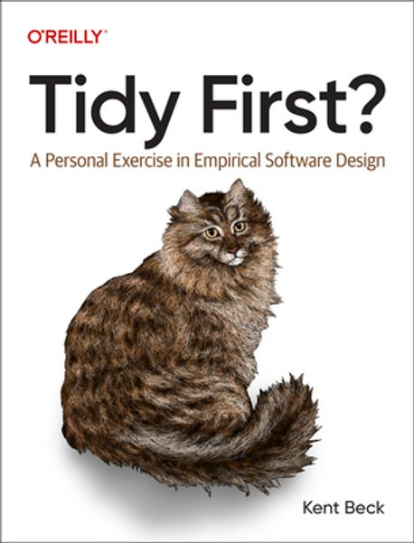

# Kent Beck Tidy First?

[켄트 백의 Tidy First?](https://product.kyobobook.co.kr/detail/S000212999739) 책을 요약한 내용입니다.

<figure><figcaption></figcaption></figure>

[Software Design: Tidy First?](https://tidyfirst.substack.com/)

# PART 01. 코드 정리법

카탈로그는 코드 변경을 위해 지저분한 코드를 마주칠 때마다 적용할 수 있는 작은 설계 움직임을 다룬다.

---

## CH01. 보호 구문

```java
if (조건)
    코드

...

if (조건)
    if (조건)
        코드
```

중첩된 조건은 헷갈리다. 이러한 코드는 정리할 수 있다.

```java
if (조건) return
if (조건) return
코드
```

코드의 세부 사항을 살펴보기 전 염두에 두어야 할 몇 가지 전체 조건이 있다는 것을 말하는 것처럼 보인다.

항상 그리고 반드시 작은 단계를 거쳐 코드를 정리하자.

---

## CH02. 안 쓰는 코드

> 안 쓰는 코드는 지워 버리자.

실행되지 않는 코드라면 그냥 지우세요.

많은 코드가 있고, 당장 사용하진 않지만, 미래에 사용하길 원하고, 원래 작성된 방식과 정확히 동일한 방식으로, 여전히 작동하는 경우라면 다시 가져옹ㄹ 수 있습니다.

복구를 비교적 쉽게 하기 위해 각 정리 과정에서 코드를 `조금만` 삭제하세요.

---

## CH03. 대칭으로 맞추기

> 코드에 일관성이 없다면 **한 가지 방식을 선택**해서 정하자.
- 다른 방식으로 작성한 코드를 선택한 방식으로 고친다.
- 때로는 공통성이 있는데도 세부 사항에 묻혀 드러나지 않다.
- 그러고 같은 부분들 속에 다른 부분이 끼어 있다면 분리하자.

---

## CH04. 새로운 인터페이스로 기존 루틴 부르기

> 새로 만든 인터페이스는 그저 기존 인터페이스를 호출하는 것으로 구현할 수 있다.
- 새롭게 구현한 통로 인터페이스(pass through interface)는 소프트웨어 설계에서 작은 단위로 중추적 역할을 한다.

통로 인터페이스 적용 때와 비슷한 느낌의 케이스
- 거꾸로 코딩하기: 루틴의 마지막 줄부터 시작해 보기
- 테스트 우선 코딩: 테스트부터 작성하여 통과 요건을 정하기
- 도우미 설계: 특정 업무를 해 주는 루틴, 객체, 서비스가 있다면 나머지 작업은 쉬워진다.

---

## CH05. 읽는 순서

> 코드를 읽을 때는 독자의 입장이 되어 보자.
- 어떤 순서의 코드가 제일 좋은가?
- 코드를 읽은 다음 사람에게 그렇게 정렬된 코드를 선물해 보자.

---

## CH06. 응집도를 높이는 배치

> 여러 곳에 흩어져 있는 코드를 함께 바꿔야 할 경우 **코드의 순서를 바꿔서 변경할 요소들을 가까이** 둬보자.
- 결합도가 있는 코드를 같은 코드 저장소(파일, 디렉토리)에 넣은 후 변경하자.

아래의 상황이라면 결합도를 제거해 보자.
- `결합도 제거 비용 + 변경 비용 < 결합도에 따를 비용 + 변경 비용`

아래의 경우 결합도 제거가 어려울 수 있다.
- 당장 어떻게 해야 할지 모를 경우
- 지금 당장 시간적 여유가 없을 경우
- 팀이 이미 충분한 변경을 수행하고 있을 경우

응집도를 높이는 순서로 정리하면 코드를 더 쉽게 변경할 수 있다.
- 때로 응집도를 개선해서 코드가 명확해지면, 결합도 제거를 막고 있던 장막이 걷힐 수 있다.
- 응집도가 좋아지면 결합도 역시 덩달아 좋아진다.

---

## CH07. 선언과 초기화를 함께 옮기기

> 타입이 포함된 선언과 초기화 코드가 떨어져 있으면 읽기 어렵다.

**before**

```java
fn()
   int a
   ...변수 a를 사용하지 않는 코드
   a = ...
   int b
   ...변수 a를 사용할 수 있으나 변수 b를 사용하지 않는 코드
   b = ...a...
   ...변수 b를 사용하는 코드
```

**after**

```java
fn()
   int a = ...
   ...변수 a를 사용하지 않는 코드
   ...변수 a는 사용하고 변수 b는 사용하지 않는 코드
   int b = ...a...
   ...변수 b를 사용하는 코드
```

변수 사이에는 데이터 종속이 있음을 존중해야 한다.
- 변수 a를 사용하여 변수 b를 초기화하려면, 변수 a를 먼저 초기화해야 한다.
- 코드 정리를 실행할 때, **데이터 종속 순서도 함께 유지**하자.

---

## CH08. 설명하는 변수

> 힘들게 파악한 내용을 다시 코드에 넣는 정리법

어렵게 크고 복잡한 코드의 표현식을 이해했다면 **전체에서 일부 표현식을 추출**한 후, **표현식의 의도가 드러나도록 변수 이름을 만들어 할당**해 보자.

**before**

```java
return new Point(
    ...긴 표현식...,
    ...다른 긴 표현식...
)
```

**after**

```java
x := ...긴 표현식...
y := ...다른 긴 표현식...
return new Point(x, y)
```

설명하는 변수를 적용하면 이제 표현식과 분리되었기 때문에 다은 번 코드를 변경할 때, 둘 중 하나만 읽으면 되므로 재빠르게 변경할 수 있다.

---

## CH09. 설명하는 상수

> 리터럴 상수(텍스트 표현)로 사용된 곳은 상징적인 상수로 바꾸자.

**before**

```java
if response.code = 404
    ...code...
```

**after**

```java
PAGE_NOT_FOUND := 404
if response.code = PAGE_NOT_FOUND
    ...code...
```

⚠️ 주의. 같은 리터럴 상수가 두 곳에서 나타날 때는 다른 의미로 쓰이는지 확인하자.

```java
ONE = 1
...ONE... // 하나가 필요할 때 어디든 등장
```

설명하는 상수 정리법에 뒤따르는 몇 가지 일들..
- 한번에 바뀌어야 하거나 함께 이해해야 하는 상수들을 한 곳에 모아두고
- 다른 이유로 묶인 변수들을 분리하는 후속 작업을 진행

---

## CH10. 명시적인 매개변수

> 다루고 있는 일부 데이터가 명시적으로 전달되지 않는 것을 발견한다면 
> 
> 앞부분에서 매개변수 값을 채운 후, 뒷부분에서 명시적으로 전달하는 루틴을 나누자.

**before**

```java
params = { a: 1, b: 2 }
foo(params)

function foo(params)
    ...params.a...   ...params.b...
```

**after**
- foo를 메서드를 나누어 명시적 매개변수 정리를 적용

```java
function foo(params)
    foo_body(params.a, params.b)

function foo_body(a, b)
    ...a... ...b...
```

---

## CH11. 비슷한 코드끼리

> 모든 코드 정리 중 가장 단순한 정리법
>
> 긴 코드 덩어리를 읽다가 구분이 될 때는 두 부분 사이에 빈 줄을 넣어 분리하자.

작은 소프트웨어 설계로 변화를 좀 더 쉽게 만들 수 있다.

소프트웨어 설계는 양날의 검과 같다
- 제대로 된 소프트웨어 설계는 유연성을 확보하지만,
- 그렇지 못한 경우 자칫 변화 자체를 망각하고 소프트웨어 설계의 소용돌이에 빠질 수 있다.

관련 있는 코드를 뭉쳐두면 다양한 길로 나아갈 수 있다.

---

## CH12. 도우미 추출

> 메서드 추출

코드를 보다가 목적이 분명하고 나머지 코드와는 상호작용이 적은 코드 블록을 만난다면
- 그 코드 블록을 추려내고, 도우미로 추출한 후 이름을 붙여주자.
- 도우미 이름은 작동 방식이 아니라 목적에 따라 지어주자.

**before**

```java
routine()
    ...그대로 두는 코드...
    ...바꾸려는 코드...
    ...그대로 두는 코드...
```

**after**

```java
helper()
    ...바꾸려는 코드...

routine()
    ...그대로 두는 코드...
    helper()
    ...그대로 두는 코드...
```

메서드를 추출하는 과정에서 인터페이스는 문제를 생각하도록 이끄는 도구가 된다.
- 우리가 만든 설계 요소에 새로운 이름을 붙일 수 있을 때, 새로운 인터페이스가 떠오른다.

---

## CH13. 하나의 더미

> 코드가 여러 개의 작은 조각으로 흩어져 있으면 코드를 전체적으로 이해하기 어렵다.
>
> 필요한 만큼의 코드를 하나의 더미로 느껴질 때까지 **흩어진 코드를 모으고 깔끔하게 정리**하자

코드를 만드는 데 가장 큰 비용이 들어가는 일은 코드 작성이 아니라 읽고 이해하는 데 드는 비용이다.
- **코드 정리를 선행하면 더 작은 조각 단위로 결합을 제거하는 길을 제시하여 응집도를 높일** 수 있다.

작은 코드 조각은 코드를 한 번에 이해할 수 있도록 해주지만, 때로 작은 코드 조각들이 서로 교류하는 방식은 코드를 더 알기 어렵게 한다.
- 명확성을 되찾기 위해 먼저 **코드를 한 곳에 모아서 이해하기 어려운 부분은 추출하고 새롭게 정리**해야 한다.

아래 증상들을 찾아보자
- 길고 반복되는 인자 목록
- 반복되는 코드, 그 중에서도 반복되는 조건문
- 도우미에 대한 부적절한 이름
- 공유되어 변경에 노출된 데이터 구조

---

## CH14. 하나의 더미

> 코드를 읽다가 '아, 이건 이렇게 돌아가는 거구나!' 라는 생각이 드는 순간 기록하자.

자신이 이 코드를 처음 읽는 사람이라고 가정하고 코드에서 명확하지 않은 내용만 골라서 적어보자.

코드의 결함을 발견했다면, 즉시 해당 위치에 주석을 달자.
- 결합도 문제를 미리 지적해 두는 것이, 모래 속에 묻듯 그냥 두는 것보다 훨씬 낫다.

```java
// 새로운 경우를 한 개 더 추가하려면 .../foo를 반드시 변경해야 합니다.
```

---

## CH15. 불필요한 주석 지우기

> 코드만으로 내용을 모두 이해할 수 있다면 주석은 삭제하자.

코드를 작성하는 목적은 다른 프로그래머에게 컴퓨터가 해야 할 일을 설명하는 데 있다.
- 주석은 시간이 흐르면 서로 맞지 않는 경우가 있다.

# PART02. 관리

코드 정리를 개인 개발 흐름에 맞추는 방법
- 코드 정리는 언제 시작하나요?
- 코드 정리는 언제 멈추나요?
- 코드의 구조를 변경하는 코드 정리와 시스템의 동작 변경을 어떻게 결합할 수 있을까요?

## CH16. 코드 정리 구분

코드 정리는 어디서 해야 할까?

한 가지 사례를 보자.
- (1) 동작 변경 코드와 함께 제가 만든 코드 정리 내용을 넣는다.
- (2) 검토하던 사람들이 제가 만든 PR이 너무 길다고 불평을 한다.
- (3) 제가 만든 코드 정리 내용을 분리해서, 동작 변경 PR 앞이나 뒤에 둔다.
- (4) 검토하는 사람들이 코드 정리만 담긴 PR에 대해 무슨 의미로 만들었는지 모르겠다고 불평을 한다.
- (5) 다시 (1)로 돌아간다.

> 코드 정리는 별도의 PR로 만들고, 가급적 PR당 몇 개의 코드 정리만 넣자.

우리는 변경 사항을 나누어 별도의 PR로 만들어야 한다.
- 순서가 있는 일련의 **코드 정리**는 PR 한 개로 만들기
- **동작 변경** 역시 별도의 PR로 만들기
- **코드 정리**와 **동작 변경** 사이를 번갈아 가면서 전환할 때마다 새 PR을 열어야 한다.

```bash
# 별도의 PR에 포함된 동작 변경과 구조 변경
# B = 동작, S = 구조
| B | SS | B | SSS | BB | S |
```

PR을 나눌지, 한 개의 PR로 처리할지는 장단점이 있는 선택
- 크고 포괄적인 PR로 만들 경우
  - 전체 그림을 보여주지만, 검토하는 입장에서는 유용한 피드백을 제공하기에는 너무 큰 덩어리일 수 있음
  - 대체로 코드를 느리게 검토하면 더 큰 PR을 만드는 결과를 초래
- 아주 작은 PR로 만들 경우
  - 보통 검토 시간 단축으로 코드를 신속히 검토할 수 있고, 더 작은 PR을 만들도록 동기부여
  - 초점이 분명할수록 PR은 더 빠른 검토를 장려
  - 소소한 피드백을 유도할 수 있지만, 잡초처림 무시될 우려가 있음