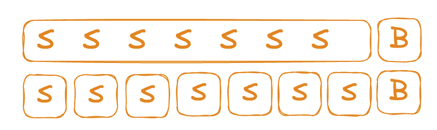

# Kent Beck Tidy First?

[켄트 백의 Tidy First?](https://product.kyobobook.co.kr/detail/S000212999739) 책을 요약한 내용입니다.

<figure><figcaption></figcaption></figure>

[Software Design: Tidy First?](https://tidyfirst.substack.com/)

# PART 01. 코드 정리법

카탈로그는 코드 변경을 위해 지저분한 코드를 마주칠 때마다 적용할 수 있는 작은 설계 움직임을 다룬다.

---

## CH01. 보호 구문

```java
if (조건)
    코드

...

if (조건)
    if (조건)
        코드
```

중첩된 조건은 헷갈리다. 이러한 코드는 정리할 수 있다.

```java
if (조건) return
if (조건) return
코드
```

코드의 세부 사항을 살펴보기 전 염두에 두어야 할 몇 가지 전체 조건이 있다는 것을 말하는 것처럼 보인다.

항상 그리고 반드시 작은 단계를 거쳐 코드를 정리하자.

---

## CH02. 안 쓰는 코드

> 안 쓰는 코드는 지워 버리자.

실행되지 않는 코드라면 그냥 지우세요.

많은 코드가 있고, 당장 사용하진 않지만, 미래에 사용하길 원하고, 원래 작성된 방식과 정확히 동일한 방식으로, 여전히 작동하는 경우라면 다시 가져옹ㄹ 수 있습니다.

복구를 비교적 쉽게 하기 위해 각 정리 과정에서 코드를 `조금만` 삭제하세요.

---

## CH03. 대칭으로 맞추기

> 코드에 일관성이 없다면 **한 가지 방식을 선택**해서 정하자.
- 다른 방식으로 작성한 코드를 선택한 방식으로 고친다.
- 때로는 공통성이 있는데도 세부 사항에 묻혀 드러나지 않다.
- 그러고 같은 부분들 속에 다른 부분이 끼어 있다면 분리하자.

---

## CH04. 새로운 인터페이스로 기존 루틴 부르기

> 새로 만든 인터페이스는 그저 기존 인터페이스를 호출하는 것으로 구현할 수 있다.
- 새롭게 구현한 통로 인터페이스(pass through interface)는 소프트웨어 설계에서 작은 단위로 중추적 역할을 한다.

통로 인터페이스 적용 때와 비슷한 느낌의 케이스
- 거꾸로 코딩하기: 루틴의 마지막 줄부터 시작해 보기
- 테스트 우선 코딩: 테스트부터 작성하여 통과 요건을 정하기
- 도우미 설계: 특정 업무를 해 주는 루틴, 객체, 서비스가 있다면 나머지 작업은 쉬워진다.

---

## CH05. 읽는 순서

> 코드를 읽을 때는 독자의 입장이 되어 보자.
- 어떤 순서의 코드가 제일 좋은가?
- 코드를 읽은 다음 사람에게 그렇게 정렬된 코드를 선물해 보자.

---

## CH06. 응집도를 높이는 배치

> 여러 곳에 흩어져 있는 코드를 함께 바꿔야 할 경우 **코드의 순서를 바꿔서 변경할 요소들을 가까이** 둬보자.
- 결합도가 있는 코드를 같은 코드 저장소(파일, 디렉토리)에 넣은 후 변경하자.

아래의 상황이라면 결합도를 제거해 보자.
- `결합도 제거 비용 + 변경 비용 < 결합도에 따를 비용 + 변경 비용`

아래의 경우 결합도 제거가 어려울 수 있다.
- 당장 어떻게 해야 할지 모를 경우
- 지금 당장 시간적 여유가 없을 경우
- 팀이 이미 충분한 변경을 수행하고 있을 경우

응집도를 높이는 순서로 정리하면 코드를 더 쉽게 변경할 수 있다.
- 때로 응집도를 개선해서 코드가 명확해지면, 결합도 제거를 막고 있던 장막이 걷힐 수 있다.
- 응집도가 좋아지면 결합도 역시 덩달아 좋아진다.

---

## CH07. 선언과 초기화를 함께 옮기기

> 타입이 포함된 선언과 초기화 코드가 떨어져 있으면 읽기 어렵다.

**before**

```java
fn()
   int a
   ...변수 a를 사용하지 않는 코드
   a = ...
   int b
   ...변수 a를 사용할 수 있으나 변수 b를 사용하지 않는 코드
   b = ...a...
   ...변수 b를 사용하는 코드
```

**after**

```java
fn()
   int a = ...
   ...변수 a를 사용하지 않는 코드
   ...변수 a는 사용하고 변수 b는 사용하지 않는 코드
   int b = ...a...
   ...변수 b를 사용하는 코드
```

변수 사이에는 데이터 종속이 있음을 존중해야 한다.
- 변수 a를 사용하여 변수 b를 초기화하려면, 변수 a를 먼저 초기화해야 한다.
- 코드 정리를 실행할 때, **데이터 종속 순서도 함께 유지**하자.

---

## CH08. 설명하는 변수

> 힘들게 파악한 내용을 다시 코드에 넣는 정리법

어렵게 크고 복잡한 코드의 표현식을 이해했다면 **전체에서 일부 표현식을 추출**한 후, **표현식의 의도가 드러나도록 변수 이름을 만들어 할당**해 보자.

**before**

```java
return new Point(
    ...긴 표현식...,
    ...다른 긴 표현식...
)
```

**after**

```java
x := ...긴 표현식...
y := ...다른 긴 표현식...
return new Point(x, y)
```

설명하는 변수를 적용하면 이제 표현식과 분리되었기 때문에 다은 번 코드를 변경할 때, 둘 중 하나만 읽으면 되므로 재빠르게 변경할 수 있다.

---

## CH09. 설명하는 상수

> 리터럴 상수(텍스트 표현)로 사용된 곳은 상징적인 상수로 바꾸자.

**before**

```java
if response.code = 404
    ...code...
```

**after**

```java
PAGE_NOT_FOUND := 404
if response.code = PAGE_NOT_FOUND
    ...code...
```

⚠️ 주의. 같은 리터럴 상수가 두 곳에서 나타날 때는 다른 의미로 쓰이는지 확인하자.

```java
ONE = 1
...ONE... // 하나가 필요할 때 어디든 등장
```

설명하는 상수 정리법에 뒤따르는 몇 가지 일들..
- 한번에 바뀌어야 하거나 함께 이해해야 하는 상수들을 한 곳에 모아두고
- 다른 이유로 묶인 변수들을 분리하는 후속 작업을 진행

---

## CH10. 명시적인 매개변수

> 다루고 있는 일부 데이터가 명시적으로 전달되지 않는 것을 발견한다면 
> 
> 앞부분에서 매개변수 값을 채운 후, 뒷부분에서 명시적으로 전달하는 루틴을 나누자.

**before**

```java
params = { a: 1, b: 2 }
foo(params)

function foo(params)
    ...params.a...   ...params.b...
```

**after**
- foo를 메서드를 나누어 명시적 매개변수 정리를 적용

```java
function foo(params)
    foo_body(params.a, params.b)

function foo_body(a, b)
    ...a... ...b...
```

---

## CH11. 비슷한 코드끼리

> 모든 코드 정리 중 가장 단순한 정리법
>
> 긴 코드 덩어리를 읽다가 구분이 될 때는 두 부분 사이에 빈 줄을 넣어 분리하자.

작은 소프트웨어 설계로 변화를 좀 더 쉽게 만들 수 있다.

소프트웨어 설계는 양날의 검과 같다
- 제대로 된 소프트웨어 설계는 유연성을 확보하지만,
- 그렇지 못한 경우 자칫 변화 자체를 망각하고 소프트웨어 설계의 소용돌이에 빠질 수 있다.

관련 있는 코드를 뭉쳐두면 다양한 길로 나아갈 수 있다.

---

## CH12. 도우미 추출

> 메서드 추출

코드를 보다가 목적이 분명하고 나머지 코드와는 상호작용이 적은 코드 블록을 만난다면
- 그 코드 블록을 추려내고, 도우미로 추출한 후 이름을 붙여주자.
- 도우미 이름은 작동 방식이 아니라 목적에 따라 지어주자.

**before**

```java
routine()
    ...그대로 두는 코드...
    ...바꾸려는 코드...
    ...그대로 두는 코드...
```

**after**

```java
helper()
    ...바꾸려는 코드...

routine()
    ...그대로 두는 코드...
    helper()
    ...그대로 두는 코드...
```

메서드를 추출하는 과정에서 인터페이스는 문제를 생각하도록 이끄는 도구가 된다.
- 우리가 만든 설계 요소에 새로운 이름을 붙일 수 있을 때, 새로운 인터페이스가 떠오른다.

---

## CH13. 하나의 더미

> 코드가 여러 개의 작은 조각으로 흩어져 있으면 코드를 전체적으로 이해하기 어렵다.
>
> 필요한 만큼의 코드를 하나의 더미로 느껴질 때까지 **흩어진 코드를 모으고 깔끔하게 정리**하자

코드를 만드는 데 가장 큰 비용이 들어가는 일은 코드 작성이 아니라 읽고 이해하는 데 드는 비용이다.
- **코드 정리를 선행하면 더 작은 조각 단위로 결합을 제거하는 길을 제시하여 응집도를 높일** 수 있다.

작은 코드 조각은 코드를 한 번에 이해할 수 있도록 해주지만, 때로 작은 코드 조각들이 서로 교류하는 방식은 코드를 더 알기 어렵게 한다.
- 명확성을 되찾기 위해 먼저 **코드를 한 곳에 모아서 이해하기 어려운 부분은 추출하고 새롭게 정리**해야 한다.

아래 증상들을 찾아보자
- 길고 반복되는 인자 목록
- 반복되는 코드, 그 중에서도 반복되는 조건문
- 도우미에 대한 부적절한 이름
- 공유되어 변경에 노출된 데이터 구조

---

## CH14. 하나의 더미

> 코드를 읽다가 '아, 이건 이렇게 돌아가는 거구나!' 라는 생각이 드는 순간 기록하자.

자신이 이 코드를 처음 읽는 사람이라고 가정하고 코드에서 명확하지 않은 내용만 골라서 적어보자.

코드의 결함을 발견했다면, 즉시 해당 위치에 주석을 달자.
- 결합도 문제를 미리 지적해 두는 것이, 모래 속에 묻듯 그냥 두는 것보다 훨씬 낫다.

```java
// 새로운 경우를 한 개 더 추가하려면 .../foo를 반드시 변경해야 합니다.
```

---

## CH15. 불필요한 주석 지우기

> 코드만으로 내용을 모두 이해할 수 있다면 주석은 삭제하자.

코드를 작성하는 목적은 다른 프로그래머에게 컴퓨터가 해야 할 일을 설명하는 데 있다.
- 주석은 시간이 흐르면 서로 맞지 않는 경우가 있다.

# PART02. 관리

코드 정리를 개인 개발 흐름에 맞추는 방법
- 코드 정리는 언제 시작하나요?
- 코드 정리는 언제 멈추나요?
- 코드의 구조를 변경하는 코드 정리와 시스템의 동작 변경을 어떻게 결합할 수 있을까요?

## CH16. 코드 정리 구분

코드 정리는 어디서 해야 할까?

한 가지 사례를 보자.
- (1) 동작 변경 코드와 함께 제가 만든 코드 정리 내용을 넣는다.
- (2) 검토하던 사람들이 제가 만든 PR이 너무 길다고 불평을 한다.
- (3) 제가 만든 코드 정리 내용을 분리해서, 동작 변경 PR 앞이나 뒤에 둔다.
- (4) 검토하는 사람들이 코드 정리만 담긴 PR에 대해 무슨 의미로 만들었는지 모르겠다고 불평을 한다.
- (5) 다시 (1)로 돌아간다.

> 코드 정리는 별도의 PR로 만들고, 가급적 PR당 몇 개의 코드 정리만 넣자.

우리는 변경 사항을 나누어 별도의 PR로 만들어야 한다.
- 순서가 있는 일련의 **코드 정리**는 PR 한 개로 만들기
- **동작 변경** 역시 별도의 PR로 만들기
- **코드 정리**와 **동작 변경** 사이를 번갈아 가면서 전환할 때마다 새 PR을 열어야 한다.

```bash
# 별도의 PR에 포함된 동작 변경과 구조 변경
# B = 동작, S = 구조
| B | SS | B | SSS | BB | S |
```

PR을 나눌지, 한 개의 PR로 처리할지는 장단점이 있는 선택
- 크고 포괄적인 PR로 만들 경우
  - 전체 그림을 보여주지만, 검토하는 입장에서는 유용한 피드백을 제공하기에는 너무 큰 덩어리일 수 있음
  - 대체로 코드를 느리게 검토하면 더 큰 PR을 만드는 결과를 초래
- 아주 작은 PR로 만들 경우
  - 보통 검토 시간 단축으로 코드를 신속히 검토할 수 있고, 더 작은 PR을 만들도록 동기부여
  - 초점이 분명할수록 PR은 더 빠른 검토를 장려
  - 소소한 피드백을 유도할 수 있지만, 잡초처림 무시될 우려가 있음

## CH17. 연쇄적인 정리

> 코드를 계속 정리하고 싶은 충동을 관리하는 것도 코드 정리의 핵심 기술

아주 작은 단계로 나누어 코드를 정리하는 방식을 고수하면서 실험해 보고, 각 단계를 최적화하자.

코드 정리를 하고 난 후에는 다음 수를 두는 것처럼 다음에 어떤 정리를 할지 살펴보자.

### 다음 정리 목록

**보호 구문**

- 보호 구문을 넣어 코드를 정리하고 나면, **조건이 설명하는 도우미**로 드러나거나 **설명하는 변수 추출**을 돕는 혜택을 얻는다.

**안 쓰는 코드**

- 사용하지 않는 코드 더미를 제거하고 나면, 코드를 읽는 순서에 맞춰 정렬하는 방법과 응집도를 높이는 배치가 보일 것이다.

**대칭으로 맞추기**

- 같은 코드와 다른 코드를 일치시켜 대칭으로 맞추다 보면, 매우 유사한 코드들이 묶여진 순서대로 읽을 수 있다.

**새로운 인터페이스로 기존 루틴 부르기**

- 새로운 인터페이스를 바로 사용하기 위해 자동으로 호출 코드를 바꿔주는 개발 도구가 없다면 한 개씩 일일이 변환해야 한다.

**읽는 순서**

- 읽는 순서를 정리하고 나면, 대칭으로 맞출 기회가 생긴다.

**응집도를 높이는 배치**

- 응집도를 높이는 배치로 함께 묶인 요소는 하위 요소로 추출할 후보가 된다.
- 정리에 익숙해지면 더 큰 규모로 설계 변경을 할 수 있고, 뒤따르는 동작 변경들은 더 쉬워진다.

**설명하는 변수**

- 좌변이 설명하는 변수라면 그에 대응하는 우변은 설명하는 도우미 후보일 수 있다.
- 변수 이름으로 불필요한 주석을 삭제할 수 있다.

**설명하는 상수**

- 응집도를 높이는 배치를 이끈다.
- 한 번에 바뀌는 상수를 모아서 묶어 놓으면 나중에 바꾸기 좋다.

**명시적인 매개변수**

- 매개변수를 명확하게 드러나게 만들면, 매개변수 집합을 묶어 객체로 만들고 코드를 옮길 수 있다.
- 코드를 정리하면서 새로운 추상화가 도출될 수 있는지 계속 주목하는 것이 좋다.

**비슷한 코드끼리**

- 코드 덩어리 앞에 설명하는 주석을 붙일 수 있다.
- 코드 딩어리를 설명하는 도우미로 바꿀 수도 있다.

**도우미 추출**

- 메서드 추출 후에는 보호 구문을 도입하거나 설명하는 상수/변수를 추출할 수도 있고, 불필요한 주석을 지울 수 있다.

**하나의 더미**

- 코드가 모여 크고 명백하게 엉망인 모습이 보이면, 비슷한 코드끼리 정리, 설명하는 주석 정리, 도우미 추출 등의 방법을 기대할 수 있다.

**설명하는 주석**

- 설명하는 변수/상수/도우미 등의 도입으로 주석에 있는 정보를 코드로 옮기자.

**불필요한 주석 지우기**

- 불필요한 주석에서 오는 잡음만 없애도 읽는 순서를 개선하는 데 도움을 주고, 명시적인 매개변수를 쓰는 기회가 찾아온다.

> 소프트웨어 개발에서 변경은 가장 많은 비용이 들어간다.
>
> 변경 중에서도 코드를 이해하는 일에 가장 비용이 많이 들어간다.

## CH18. 코드 정리의 일괄 처리량

통합과 배포를 하기 전에 코드 정리는 어느 정도 크기가 적절할까?<br/>
기본적으로 코드 정리는 먼 미래를 바라보는 것이 아니므로 **즉각적인 필요를 다뤄야 한다.**

<figure><figcaption></figcaption></figure>

**일괄 처리 규모 증가에 따라 비용이 증가하게 된다.**<br/>
일괄 처리하는 코드 정리 작업이 많을수록..

- `충돌`
  - 통합 과정에 지연 시간이 길어지고
  - 코드 정리 작업이 다른 사람의 진행 중인 작업과 **충돌**할 가능성도 커진다.
- `상호작용`
  - 다수의 코드 정리를 한번에 처리하다가 우연히 동작 변경을 할 수도 있다.
  - 코드 정리 사이에 **상호작용**이 있으면 병합 비용은 급격히 증가한다.
- `추측`
  - 다음 동작 변경에 도움이 될 만큼 코드 정리를 하는 과정에서
  - 한 번에 처리하는 코드 정리가 많을수록 자연스럽게 더 많은 코드를 정리하게 된다.

<figure><figcaption></figcaption></figure>

**일괄 처리 규모 축소에 따른 검토 비용 증가**

많은 조직에서 하나의 변경 사항을 검토하고 배포하는 데 드는 고정 비용은 상당히 많다.

> 코드 정리 비용을 줄이고자 한다면, 코드 정리 개수를 늘려서 동작 변경에 소용되는 비용을 줄이자.
>
> 그러면, 검토 비용을 줄일 수 있다.

<figure><figcaption></figcaption></figure>

팀에 신뢰와 강력한 문화가 있다면 코드 정리 후에는 굳이 검토할 필요가 없다.
- 검토하지 않더라도 코드 정리가 소프트웨어 안정을 해치지 않으면 상호작용의 위험이 줄어든다.

## CH19. 리듬

코드 정리를 관리하는 기술 중에 정리의 리듬을 관리하는 일도 있다.
- 이전에 우리는 코드 정리 시 하번에 처리하는 규모를 작게 할 것을 권했었다.

<figure><figcaption></figcaption></figure>

특정 동작 변경 이전에 수행한 **일련의 구조 변경에는 `분 단위`를 유지하되, `한 시간`이 넘지 않도록** 하자.
- 한 번의 코드 정리에 한 시간 이상이 걸린다면,
- 이는 원하는 동작 변경을 위해 필요한 최소한의 구조 변경 시기를 놓쳤다는 의미일 수 있다.

코드가 너무 엉망이라서 동작 변경에 앞서 몇 시간을 들여서라도 코드 정리를 선행하는 것이 더 유리하다고 생각할 수 있다.
- 그렇다 하더라도 **오래 지속될 수는 없는 노릇**이다.
- 소프트웨어 설계는 `길을 닦는` 일의 성격이 매우 강하다.

동작 변경은 코드 안에 뭉쳐서 나타나는 경향이 있다.
- 파레토 법칙에 따르면 80%의 변경사항이 20%의 파일에서 발생한다.
- 코드 정리를 선행할 때, 코드 정리 내용도 뭉쳐진다.
- 그리고 코드 정리가 코드를 뭉친 결과는 정확하게 **동작 변경하기에 가장 좋은 위치에서 뭉쳐져 있다**.

> 코드 정리는 몇 분에서 한 시간 정도면 충분하다
>
> 때로는 더 긴 경우고 있겠지만, 그리 길지는 않을 것이다.

## CH20. 얽힘 풀기

어떤 코드의 동작 변경을 할 때 변경을 쉽게 하기 위해 코드 정리를 하다보면 아래와 같은 상황을 마주하게 된다.
- 변경 대상인 동작을 모두 알게 되었고
- 그 동작들을 쉽게 변경하려면 어떤 코드를 정리해야 하는지 모두 알게 되었으나
- 문제는 정리한 코드와 변경할 동작이 함께 얽혀 버렸다.

이 상황에서 세 가지 선택지가 있다.
- 그대로 배포할 수 있지만, 검토하는 사람들이 무례하다고 느낀다
  - 오류가 발생하기도 쉽지만 당장 처리할 수 있다.
- 코드 정리와 변경 사항을 별도의 하나 이상의 PR로 나누거나 하나의 PR을 여러 번의 커밋으로 나눌 수 있다.
  - 이 방법으로 무례함을 줄일 수 있지만 작업 횟수는 늘어난다.
- 진행 중인 작업을 버리고, 코드 정리를 선행하는 순서로 다시 시작할 수 있다.
  - 이렇게 하면 작업은 더 많아지지만, 이어지는 커밋과의 일관성은 분명해진다.
  - 다시 구현하면서 새로운 것을 발견할 가능성이 높아진다.
  - 동일한 동작 변경을 하면서도 더 많은 가치를 끌어낼 수도 있다.

> 우리가 작성하는 코드는 컴퓨터에 지시할 뿐 아니라, 컴퓨터에 지시하려는 여러분의 의도를 사람들에게도 설명해야 한다.
>
> 컴퓨터에 지시만 하는 빠른 수행이 흥미로운 최종 목표가 되는 것은 아니다.

실타래를 풀려면 실이 엉켜 있다는 사실을 알아차려야 시작할 수 있다.
- 실타래를 풀어야 할 필요성을 **더 일찍 깨달을수록 작업량은 적어질 것**이다.
- 먼저 정리할 것인지 나중에 정리할 것인지 고민하다가 코드 정리와 동작 변경 사이에서 전환 시점을 놀치기 일쑤일 것이다.

## CH21. 코드 정리 시점

### 아예 안 한다면

코드의 동작을 변경할 필요가 전혀 없는 경우는 극히 드물지만, 실제로 일어나는 경우가 있다.
- **진짜 변경이 필요 없는 시스템이라면 "고장 나지 않으면 고치치 말자"는 말이 합리적으로 통할 수 있다.**

### 나중에 정리하기

> 지금 정리할 코드가 너무 많으니 언제 해도 상관은 없다.
> 
> 일시적으로, 잠정적으로 업무 치리 시간이 충분히 주어진다면 나중에 정리할 목적으로 엉망인 코드 목록(`재미 목록`)을 만들어 보자.

**먼저 코드 정리를 해 놓으면 나중에 시스템 동작 변경을 더 쉽게 한다.**
- 시스템에서 반드시 변경할 거라고 보장할 정도면, 그 보편적 영역을 정리하는 것만으로 향후 변경을 단순화하는 가치가 창출된다.

정리(지금 변경한 동작과 연결되지 않는 코드 정리)를 나중에 하면 몇 가지 다른 방식으로 가치를 창출한다.

(1) 지저분함 보유세를 줄일 수 있다.
- API가 변경되는 과정에서 모두 변경이 완료될 때까지 새 API 변경 사항이 발생하면, 거울처럼 이전 API에도 똑같이 반영해야 한다.
- 코드를 정리해야 할 필요성은 크지 않지만, 당장 신발 안에 든 작은 조약돌을 빼내면 걸을을 더 잘 걸을 수 있게 되는 것과 같은 이치다.

(2) 코드 정리는 학습 도구로 활용할 수도 있다.
- 코드에 귀 기울이면서 현재 구조에서 원하는 구조로 옮기다 보면 무언가를 반드시 배우게 된다.
- 코드 정리는 설계한 세부 결과를 깨달을 수 있는 좋은 방법이다.
- 코드 정리는 생각할 수 있는 설계를 비춰준다.

(3) 코드 정리를 나중에 자신이 원할 때 하면 더 의욕적이고 기분도 좋다.
- 여러분이 행복을 느낄 때, 얼마든지 더 나은 프로그래머가 될 수 있다.

### 동작 변경 후에 코드 정리

같은 영역을 다시 변경하게 된다면, 동작 변경 후 코드 정리하는 일은 상당한 의미가 있다.
- 나중에 가면 정리하는 일이 더 힘들 수도 있다.
- 지금은 맥락을 알아서 쉽게 정리할 수 있지만, 나중에는 맥락을 잊어버릴 수 있다.
- 다른 변경 건이 생겨 코드 정리를 하는 데 훼방을 놓을 수도 있다.

만일, 나중에 코드를 정리할 때까지 기다리느라 비용이 너무 많이 증가할 가능성이 있다면, 지금 정리하는 것이 좋다.

**정리에 들이는 시간?**
- 동작 변경에 한 시간이 걸렸다면, 한 시간 정도 코드 정리에 투자하는 것은 합리적이다.
- 만일 일주일이라면? 그냥 재미 목록에 추가하자.

아래의 상황이라면 **동작 변경 후 코드를 정리**하자.
- 방금 고친 코드를 다시 변경할 예정일 때
- 지금 정리하는 것이 더 저렴할 때
- 코드 정리하는 데 드는 시간이 동작 변경에 드는 시간과 거의 비슷할 때

### 코드 정리 후에 동작 변경

코드 정리 시점은 상황에 따라 다르다.

- 지저분한 상태 그대로 코드를 변경한다면 일이 얼마나 더 어려운가?
  - 코드를 정리한다고 해서 더 쉬워지지 않는다면, 먼저 정리하지 말자.
- 코드 정리의 이점을 바로 얻을 수 있는가?
  - 코드 정리로 코드를 더 빨리 이해할 수 있겠다고 판단이 서면, 먼저 코드를 정리하자.
- 코드 정리에 드는 비용을 어떻게 보상받을 수 있을까?
  - 이 코드를 딱 한 번만 변경할 예정이라면 코드 정리를 제한하는 것이 좋다.
  - 코드 정리로몇 년 동안 매주 보상받는다면 먼저 하는 것이 좋다.
- 코드 정리에 대해 얼마나 확신하고 있는가?
  - 추측할 때는 편견에서 벗어나야 한다.
    - "이것만 없어도 변경하기 쉬울 텐데.."
  - "여기를 정리하면 이해하기 쉬워질거야. 내가 지금 혼란스러운 걸 보면 알 수 있지"

> 일반적으로 코드를 먼저 정리하는 것을 선호하지만,
>
> 정리 그 자체를 목적으로 삼지 않도록 경계해야 한다.

### 요약

코드 정리를 하지 말아야 할 상황
- 앞으로 다시는 코드를 변경하지 않을 때
- 설계를 개선하더라도 배울 것이 없을 때

나중으로 정리를 미뤄야 할 상황
- 정리할 코드 분량이 많은데, 보상이 따로 보이지 않을 때
- 코드 정리에 대한 보상이 잠재적일 때
- 작은 묶음으로 여러 번에 나눠서 코드 정리를 할 수 있을 때

동작 변경 후에 정리해야 할 상황
- 다음 코드 정리까지 기다릴수록 비용이 더 불어날 때
- 코드 정리를 하지 않으면 일을 끝냈다는 느낌이 들지 않을 때

코드 정리 후에 동작 변경을 해야 할 상황
- 코드 정리를 했을 때, 코드 이해가 쉬워지거나 동작 변경이 쉬워지는 즉각적인 효과를 얻을 수 있을 때
- 어떤 코드를 어떻게 정리해야 하는지 알고 있을 때