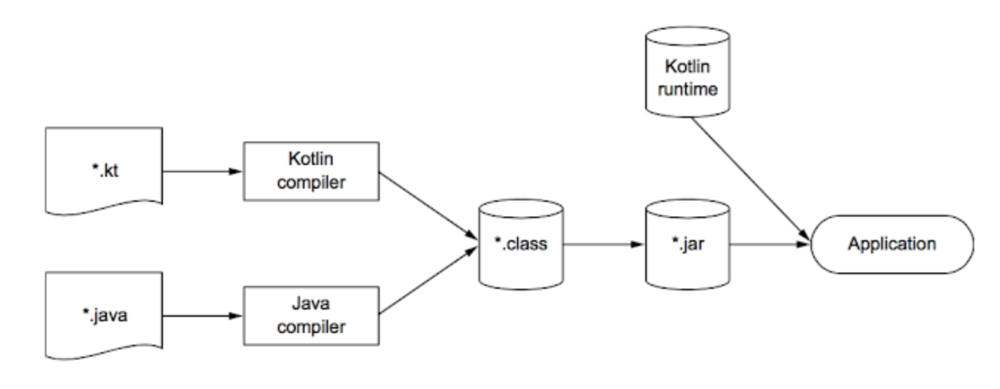
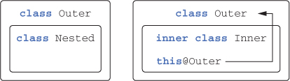
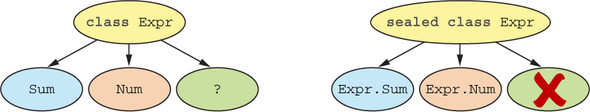

# Begin Kotlin

# 코틀린?

- 타입 추론을 지원하는 `정적 타입 지정 언어`
    - 소스 코드의 정확성과 성능을 보장
    - 소스코드를 간결하게 유지
- `객체지향`과 `함수형 프로그래밍` 스타일을 모두 지원
    - 일급 시민 함수를 사용해 수준 높은 추상화가 가능
    - 불변 값 지원을 통해 다중 스레드 애플리케이션 개발과 테스트를더 쉽게 가능
- 서버 애플리케이션 개발에 활용 가능
    - 기존 자바 프레임워크를 완벽하게 지원
    - HTML 생성기나 영속화등의 일반적인 작업을 위한 새로운 도구를 제공
- 실용적이며 안전하고, 간결하며 좋은 상호 운용성
    - NPE 같이 흔히 발생하는 오류를 방지
    - 읽기 쉽고 간결한 코드를 지원
    - 자바와 아무런 제약 없이 통합

## **코틀린의 컴파일러(Kotlin Compiler)**

> 코틀린 컴파일러는 JVM에서 실행될 수 있는 **바이트코드가 포함된 클래스 파일을 생성**

<figure><figcaption></figcaption></figure>

- 코틀린은 자바 컴파일러가 아닌 코틀린 컴파일러에 의해 컴파일되므로 자바를 사용할 때와 다른 부분이 존재
    - ex. 코틀린에서는 모든 예외를 언체크 예외로 인식

---

# 기초

```kotlin
fun main(args: Array<String>) {
		println("Hello, world!")
}
```

- 함수 선언 → `fun`
- 파라미터 이름 뒤에 타입 → `args: Array<String>`
- `함수를 최상위수준에` 정의 가능
    - 클래스 안에 함수를 넣어야 할 필요가 없음
- 배열도 일반적인 클래스
- System.out.println → `println`
- 줄 끝에 세미콜론(;) 없이 작성

## 함수

```kotlin
// 본문인 함수
fun max(a: Int, b: Int): Int {
		return if (a > b) a else b
}

// 식이 본문인 함수
fun max(a: Int, b: Int): Int = if (a > b) a else b

// 반환 타입 생략
fun max(a: Int, b: Int) = if (a > b) a else b
```

## 변수

> 코틀린에서는 보통 타입 지정을 생략
> 
> 기본적으로는 모든 변수를 val 키워드를 사용해 불변 변수로 선언하고, 나중에 꼭 필요할 때에만 var로 변경

```kotlin
val answer = 42 // 타입 생략
val answer: Int = 42 // 타입 지정

// 초기화 식을 사용하지 않고 변수 선언 시 변수 타입 명시 필요
val answer: Int
answer = 42
```

**변경 가능한 변수와 변경 불가능한 변수**

- val(=value): 변경 불가능한(immutable) 참조를 저장하는 변수 (like. java final)
- var(=variable): 변경 가능한(mutable) 참조 (like. java 일반 변수)

**문자열 템플릿**

- 문자열 리터럴의 필요한 곳에 변수를 넣되 변수 앞에 $를 추가
- $ 문자를 문자열에 넣고 싶으면 println("\$x")와 같이 \를 사용해 $를 이스케이프

```kotlin
fun main(args: Array<String>) {
		val name = if (args.size > 0) args[0] else "Kotlin"
		println("Hello, $name")
}
```

## 클래스와 프로퍼티

> 코틀린의 기본 가시성은 public

```kotlin
// Java
public class Person {
		private final String name;

		public Person(String name) {
				this.name = name;
		}

		public String getName() {
				return name;
		}
}

...

// Kotlin
class Person(val name: String)
```

**코틀린 프로퍼티는 자바의 필드와 접근자 메소드를 완전히 대신**

```kotlin
class Person(
		// 읽기 전용 프로퍼티: (비공개)필드와 필드를 읽는 단순한 (공개)Getter를 생성
		val name: String, 
		// 쓸 수 있는 프로퍼티: (비공개)필드, (공개)Getter/Setter를 생성
		var isMarried: Boolean 
)
```

- **코틀린에서는 클래스 임포트와 함수 임포트에 차이가 없으며, 모든 선언을 import 키워드로 가져올 수 있음**

## enum & when

> when은 자바의 switch를 대치하되 훨씬 더 강력

**enum**

- enum 클래스 안에도 프러퍼티나 메소드 정의 가능

```kotlin
enum class Color(
        val r: Int, val g: Int, val b: Int
) {
    RED(255, 0, 0), ORANGE(255, 165, 0),
    YELLOW(255, 255, 0), GREEN(0, 255, 0), BLUE(0, 0, 255),
    INDIGO(75, 0, 130), VIOLET(238, 130, 238);
		
		// 메소드를 정의하는 경우 enum 상수 목록과 메소드 정의 사이에 세미콜론 필요
    fun rgb() = (r * 256 + g) * 256 + b
}
```

**when 으로 enum 다루기**

```kotlin
// 자바와 달리 각 분기 끝에 break 불필요
fun getMnemonic(color: Color) =
  when (color) {
      Color.RED -> "Richard"
      Color.ORANGE -> "Of"
      Color.YELLOW -> "York"
      Color.GREEN -> "Gave"
      Color.BLUE -> "Battle"
      Color.INDIGO -> "In"
      Color.VIOLET -> "Vain"
}

// 갹체를 함께 사용 가능
fun mix(c1: Color, c2: Color) =
		when (setOf(c1, c2)) {
		    setOf(RED, YELLOW) -> ORANGE
		    setOf(YELLOW, BLUE) -> GREEN
		    setOf(BLUE, VIOLET) -> INDIGO
		    else -> throw Exception("Dirty color")
		}
```

**스마트 캐스트: 타입 검사와 타입 캐스트를 조합**

> 코틀린에서는 is를 사용해 변수 타입을 검사 (like. java instanceof)

```kotlin
fun eval(e: Expr): Int {
    if (e is Num) { // **타입 검사와 타입 캐스트**
        val n = e as Num
        return n.value
    }
    if (e is Sum) { // **타입 검사와 타입 캐스트**
        return eval(e.right) + eval(e.left)
    }
    throw IllegalArgumentException("Unknown expression")
}
```

**다중 if → when**

```kotlin
fun eval(e: Expr): Int =
    if (e is Num) {
        e.value
    } else if (e is Sum) {
        eval(e.right) + eval(e.left)
    } else {
        throw IllegalArgumentException("Unknown expression")
    }
    
...

fun eval(e: Expr): Int =
    when (e) {
        is Num ->
            e.value
        is Sum ->
            eval(e.right) + eval(e.left)
        else ->
            throw IllegalArgumentException("Unknown expression")
    }
```

## Iteration (while & loop)

**수에 대한 이터레이션**

```kotlin
// 100부터 거꾸로 세되 짝수만으로 게임을 진행
fun main(args: Array<String>) {
    for (i in 100 downTo 1 step 2) {
        print(fizzBuzz(i))
    }
}
```

**in으로 컬렉션이나 범위의 원소 검사**

> `in`으로 어떤 값이 범위에 속하는지 검사
> 
> `!in`을 사용하면 어떤 값이 범위에 속하지 않는지 검사

```kotlin
fun recognize(c: Char) = when (c) {
    in '0'..'9' -> "It's a digit!"
    in 'a'..'z', in 'A'..'Z' -> "It's a letter!"
    else -> "I don't know…"
}
```

## 예외처리

> 함수는 정상적으로 종료할 수 있지만 오류가 발생하면 예외를 던질 수 있음
> 
> 단, 함수가 던질 수 있는 예외를 선언하지 않아도 된다

```kotlin
// 조건이 참이면 number 값이 초기화되고, 거짓이면 초기화되지 않고 throw 호출
val number = try {
    Integer.parseInt(reader.readLine())
} catch (e: NumberFormatException) {
    return // 예외가 발생한 경우 catch 블록 다음의 코드는 실행되지 않음 
}

println("number") // 실행 X
```

**try 식으로 사용**

- try 키워드는 if, when 과 마찬가지로 식이다.
- 따라서 try의 값을 변수에 대입 가능

---

# **함수 정의와 호출**

## 컬렉션 만들기

```kotlin
val set = hashSetOf(1, 7, 53)
val list = arrayListOf(1, 7, 53)
val map = hashMapOf(1 to "one", 7 to "seven", 53 to "fifty-three")

...

fun main(args: Array<String>) {
    val strings = listOf("first", "second", "fourteenth")
    println(strings.last()) // 리스트의 마지막 원소
    val numbers = setOf(1, 14, 2)
    println(numbers.max()) // 컬렉션에서 최댓값
}
```

## **확장 함수와 확장 프로퍼티**

> **메소드를 다른 클래스에 추가**

**`확장 함수`**

- 어떤 클래스의 멤버 메소드인 것처럼 호출할 수 있지만 그 클래스의 밖에 선언된 함수
- 확장 함수를 만들려면 추가하려는 함수 이름 앞에 그 함수가 확장할 클래스의 이름을 덧붙이자
- **확장 함수는 오버라이드할 수 없음**

```kotlin
package strings
// 문자열의 마지막 문자를 돌려주는 확장 메소드
fun String.lastChar(): Char = this.get(this.length - 1)

...

// String = 클래스 이름 : 수신 객체 타입(receiver type)
// "Kotlin" = 확장 함수가 호출되는 대상 : 수신 객체(receiver object)
println("Kotlin".lastChar())
```

**임포트와 확장함수**

- 확장 함수를 사용하기 위해서는 그 함수를 다른 클래스나 함수와 마찬가지로 임포트 필요

```kotlin
import strings.lastChar // 명시적으로 사용
import strings.* // * 사용 가능
import strings.lastChar as last // as 키워드를 사용 가능
```

**함수를 호출하기 쉽게 만들기**

```kotlin
// AS-IS
fun <T> joinToString(
        collection: Collection<T>,
        separator: String = ";", // 디폴트 파라미터
        prefix: String = "(",
        postfix: String = ")"
): String {

    val result = StringBuilder(prefix)

    for ((index, element) in collection.withIndex()) {
        if (index > 0) result.append(separator)
        result.append(element)
    }

    result.append(postfix)
    return result.toString()
}

val list = listOf(1, 2, 3)
println(joinToString(list, "; ", "(", ")"))
println(joinToString(collection = list, separator = ";", prefix = "(", postfix = ")"))
println(joinToString(list))
println(joinToString(list, "; "))

...

// TO-BE : 확장 함수로 유틸리티 함수 정의
fun <T> Collection<T>.joinToString(
        separator: String = ", ",
        prefix: String = "",
        postfix: String = ""
): String {
    val result = StringBuilder(prefix)

    for ((index, element) in this.withIndex()) {
        if (index > 0) result.append(separator)
        result.append(element)
    }

    result.append(postfix)
    return result.toString()
}

fun main(args: Array<String>) {
    val list = arrayListOf(1, 2, 3)
    println(list.joinToString(" "))
}

val list = listOf(1, 2, 3)
println(list.joinToString2("; ", "(", ")"))
println(list.joinToString2(separator = ";", prefix = "(", postfix = ")"))
println(list.joinToString2())
println(list.joinToString2("; "))

```

**`확장 프로퍼티`**

- 기존 클래스 객체에 대한 프로퍼티 형식의 구문으로 사용할 수 있는 API를 추가
- 상태를 저장할 적절한 방법이 없으므로 아무 상태도 가질 수 없음
- 계산한 값을 담을 장소가 전혀 없으므로 초기화 코드도 사용 불가

```kotlin
val String.lastChar: Char
		get() = get(length -1)

var StringBuilder.lastChar: Char
    get() = get(length - 1) // 뒷받침하는 필드가 없어서 최소한 게터는 꼭 정의
    set(value: Char) {
        this.setCharAt(length - 1, value)
    }

@Test
fun `확장 프로퍼티`() {
    println("Kotlin".lastChar) // n
    
    val sb = StringBuilder("Kotlin?")
    sb.lastChar = '!'
    println(sb) // Kotlin!
}
```

## **가변 인자 함수**

> 메소드를 호출할 때 원하는 개수만큼 값을 인자로 넘기면 자바 컴파일러가 배열에 그 값들을 넣어주는 기능
- 자바는 타입 뒤에 ...를 붙이지만, 코틀린은 파라미터 앞에 `varag` 변경자를 붙인다.

```kotlin
public fun <T> listOf(vararg elements: T): List<T> = 
		if (elements.size > 0) elements.asList() else emptyList()

fun main(args: Array<String>) {
    val list = listOf("one", "two", "eight")
}
```

**이미 배열에 들어있는 원소를 가변 길이 인자로 넘길 때**

- 자바에서는 배열을 그냥 넘기면 되지만,
- 코틀린에서는 배열을 명시적으로 풀어서 `배열의 각 원소가 인자로 전달`되게 해야 한다.
- 기술적으로는 `스프레드(spread) 연산자`가 이러한 작업을 수행

```kotlin
fun main(args: Array<String>) {
    val list = listOf("args: ", *args)
}
```

## **값의 쌍 다루기 (중위호출, 구조 분해 선언)**

> 맵을 만들려면 `mapOf` 함수를 사용

```kotlin
val map = mapOf(1 to "one", 7 to "seven", 53 to "fifty-three")
```

- `중위 호출`이라는 특별한 방식으로 `to`라는 일반 메소드를 호출
- 중위 호출 시에는 수신 객체와 유일한 메소드 인자 사이에 메소드 이름을 넣는다

```kotlin
1.to("one") // "to" 메소드를 일반적인 방식으로 호출함
1 to "one" // "to" 메소드를 중위 호출 방식으로 호출함
```

**메소드를 중위 호출에 사용하도록 허용하고 싶을 경우 `infix` 변경자를 메소드 선언 앞에 추가**

```kotlin
/**
 * Creates a tuple of type [Pair] from this and [that].
 *
 * This can be useful for creating [Map] literals with less noise, for example:
 * @sample samples.collections.Maps.Instantiation.mapFromPairs
 */
public infix fun <A, B> A.to(that: B): Pair<A, B> = Pair(this, that)
```

이러한 기능을 `구조 분해 선언`이라고 부른다. 

- Pair 인스턴스 외 다른 객체에도 구조 분해 적용 가능
    - ex) key, value 두 변수를 맵의 원소를 사용해 초기화

```kotlin
for ((index, element) in collection.withIndex()) {
		println("$index: $element")
}
```

## 문자열과 정규식

**문자열 나누기**

> split 함수에 전달하는 값의 타입에 따라 정규식이나 일반 텍스트 중 어느 것으로 문자열을 분리하는지 쉽게 알 수 있다.

```kotlin
println("12.345-6.A".split("\\\\.|-".toRegex())) // 정규식을 명시적으로 만든다. 
```

간단한 경우에는 꼭 정규식을 쓸 필요가 없다.

- split 확장 함수를 오버로딩한 버전 중에는 구분 문자열을 하나 이상 인자로 받는 함수가 있다.

```kotlin
println("12.345-6.A".split(".","-")) // 여러 구분 문자열을 지정한다. 
[12, 345, 6, A]
```

**3중 따옴표 문자열**

> 역슬래시(\)를 포함한 어떤 문자도 이스케이프 불필요

```kotlin
// AS-IS
fun parsePath(path: String) {
    val directory = path.substringBeforeLast("/")
    val fullName = path.substringAfterLast("/")

    val fileName = fullName.substringBeforeLast(".")
    val extension = fullName.substringAfterLast(".")

    println("Dir: $directory, name: $fileName, ext: $extension")
    // Dir: /Users/yole/kotlin-book, name: chapter, ext: adoc
}

fun main(args: Array<String>) {
    parsePath("/Users/yole/kotlin-book/chapter.adoc")
}

...

// TO-BE
// 정규식을 사용하지 않고도 문자열을 쉽게 파싱
// 정규식이 필요할 때는 코틀린 라이브러리를 사용하면 더 편리
fun parsePath(path: String) {
    val regex = """(.+)/(.+)\\.(.+)""".toRegex()
    val matchResult = regex.matchEntire(path) // 정규식을 인자로 받은 path에 매치
    if (matchResult != null) {
		    // 그룹별로 분해한 매치 결과를 의미하는 destructured 프로퍼티를 각 변수에 대입
        val (directory, filename, extension) = matchResult.destructured
        // 구조 분해 선언은 Pair로 두 변수를 초기화할 때 썼던 구문과 동일
        println("Dir: $directory, name: $filename, ext: $extension")
    }
}
```

## 로컬 함수와 확장

> 함수에서 추출한 함수를 원 함수 내부에 중첩시킬 수 있다.
> 
> 문법적인 부가 비용을 들이지 않고도 깔끔하게 코드를 조직 가능

로컬 함수와 확장으로 코드를 다듬는 과정

```kotlin
// AS-IS
fun saveUser(user: User) {
    if (user.name.isEmpty()) {
        throw IllegalArgumentException(
            "Can't save user ${user.id}: empty Name")
    }

    if (user.address.isEmpty()) {
        throw IllegalArgumentException(
            "Can't save user ${user.id}: empty Address")
    }

    // Save user to the database
}

...

// 첫 번째 개선
fun saveUser(user: User) {
    fun validate(user: User,
                    value: String,
                    fieldName: String) {
        if (value.isEmpty()) {
            throw IllegalArgumentException(
                "Can't save user ${user.id}: empty $fieldName")
        }
    }

    validate(user, user.name, "Name")
    validate(user, user.address, "Address")
    // Save user to the database
}

...

// 두 번째 개선
fun saveUser(user: User) {
        // user 파라미터를 중복 사용하지 않는다. 
    fun validate(value: String, fieldName: String) { 
        if (value.isEmpty()) {
            throw IllegalArgumentException(
                    // 바깥 함수의 파라미터에 직접 접근할 수 있다. 
                "Can't save user ${user.id}: " +
                    "empty $fieldName")
        }
    }

    validate(user.name, "Name")
    validate(user.address, "Address")
    // Save user to the database
}

...

// TO-BE (User 클래스를 확장한 함수)
fun User.validateBeforeSave() {
    fun validate(value: String, fieldName: String) {
        if (value.isEmpty()) {
            throw IllegalArgumentException(
                "Can't save user $id: empty $fieldName")
        }
    }

    validate(name, "Name")
    validate(address, "Address")
}

fun saveUser(user: User) {
    user.validateBeforeSave()
    // Save user to the database
}
```

---

# 클래스, 객체, 인터페이스

> 코틀린과 자바의 클래스, 인터페이스 개념은 약간 다르다.

- 인터페이스에 프로퍼티 선언이 들어갈 수 있음
- 기본적으로 final, public
- 중첩 클래스는 기본적으로는 내부 클래스가 아니므로 외부 클래스에 대한 참조가 없음
- 클래스를 data로 선언하면 컴파일러가 일부 표준 메소드를 생성
- 위임(delegation)을 사용하면 위임을 처리하기 위한 준비 메소드를 직접 작성할 필요가 없음

## **코틀린 인터페이스**

> 추상 메소드뿐 아니라 구현이 있는 메소드도 정의 가능

```kotlin
interface Clickable {
		fun click()
}

class Button : Clickable {
		override fun click() = println("I was clicked") // I was clicked
}
```

- 클래스 이름 뒤에 콜론(:)을 붙이고 인터페이스와 클래스 이름을 적는 것으로 클래스 확장과 인터페이스 구현을 모두 처리

인터페이스 메소드도 디폴트 구현을 제공

- 자바에서 메소드 앞에 default를 붙이는 것과 달리, 그냥 메소드 본문을 메소드 시그니처 뒤에 추가

```kotlin
interface Clickable {
    fun click() // 일반 메소드 선언
    fun showOff() = println("I'm clickable!") // 디폴트 구현이 있는 메소드
}
```

다중 인터페이스 상속 관계에서 동일한 메소드가 구현되어 있을 경우

- 중복된 상위 메소드는 하위 클래스에서 반드시 구현되어야 한다는 컴파일 오류 발생

```kotlin
interface Focusable {
    fun setFocus(b: Boolean) =
        println("I ${if (b) "got" else "lost"} focus.")

    fun showOff() = println("I'm focusable!")
}

---

class Button : Clickable, Focusable {
    override fun click() = println("I was clicked")
}
```

## **open, final, abstract 변경자**

> **코틀린의 클래스와 메소드는 기본적으로 `final`**
- 특정 클래스의 상속을 허용하려면 클래스 앞에 open 변경자를 붙여야 한다.
- 오버라이드를 허용하고 싶은 메소드나 프러퍼티의 앞에도 open 변경자를 붙여야 한다.

```kotlin
open class RichButton : Clickable { // open class, 다른 클래스가 이 클래스를 상속 가능
    fun disable() {} // final method, 하위 클래스가 오버라이드 불가
    open fun animate() {} // open method, 하위 클래스에서 오버라이드 가능
    override fun click() {} // (상위 클래스에서 선언된) open method override.
}
```

**오버라이드하는 메소드의 구현을 하위 클래스에서 오버라이드하지 못하게 금지하려면 `final` 명시**

- `final`이 없는 `override` 메소드나 프로퍼티는 기본적으로 open

```kotlin
open class RichButton : Clickable {
    final override fun click() {}
}
```

**자바처럼 코틀린에서도 클래스를 `abstract` 선언 가능**

- abstract 선언 추상 클래스는 인스턴스화 불가
- 따라서 추상 멤버 앞에 open 변경자를 명시할 필요가 없음

```kotlin
// 추상 클래스 (인스턴스 생성 불가)
abstract class Animated { 
		// 추상 함수 (구현이 없고, 하위 클래스에서는 이 함수를 반드시 오버라이드 필요) 
		abstract fun animate() 
		// 추상 클래스에 속했더라도 비추상 함수는 기본적으로 파이널이지만 원한다면 open으로 오버라이드를 허용 가능
		open fun stopAnimating() { ... }
		fun animateTwice() { ... } 
}
```

**인터페이스 멤버의 경우 final, open, abstract를 사용하지 않는다.** 

- 인터페이스 멤버는 항상 열려 있으며 final로 변경 불가
- 인터페이스 멤버에게 본문이 없으면 자동으로 추상 멤버가 되지만,
- 멤버 선언 앞에 abstract 키워드를 덧붙일 필요가 없음

**클래스 내에서 상속 제어 변경자의 의미**

| Modifier                                 | Corresponding member             | Comments                        |
| ---------------------------------------- | -------------------------------- | ------------------------------- |
| final                                    | 오버라이드 `불가`                | 클래스 멤버에 `기본적`으로 적용 |
| open                                     | 오버라이드 `가능`                | `명시적`으로 선언 필요          |
| abstract                                 | 오버라이드 `필수`                | 추상 클래스에서만 사용 가능, 추상 멤버는 구현 불가     |
| override                                 | 슈퍼클래스나 인터페이스의 멤버를 오버라이드 | 오버라이드된 멤버는 final 표시가 없다면 기본적으로 open 상태             |

## 가시성 변경자: 기본적으로 공개 (internal)

> 패키지를 네임스페이스 관리 용도로만 사용하고 가시성 제어에 사용하지 않는다.
- 패키지 전용 가시성에 대한 대안으로 `internal`이라는 새로운 가시성 변경자를 도입
- “모듈 내부에서만 볼 수 있음"이라는 뜻
    - 모듈은 한 번에 컴파일되는 코틀린 파일들을 의미

**코틀린에서는 최상위 선언에 대해 private 가시성을 허용**

- 그런 최상위 선언에는 클래스, 함수, 프로퍼티 등이 포함
- 비공개 가시성인 최상위 선언은 그 선언이 들어있는 파일 내부에서만 사용 가능
- 이 또한 하위 시스템의 자세한 구현 사항을 외부에 감추고 싶을 때 유용한 방법

public 함수인 giveSpeech 안에서 그보다 가시성이 더 낮은 타입인 internal TalkativeButton을 참조 불가

- 자바와 다르게 코틀린은 같은 패키지 안에서 protected 멤버에 접근할 수 없음

```kotlin
internal open class TalkativeButton : Focusable {
		private fun yell() = println("Hey!")
		protected fun whisper() = println("Let's talk!")
}

---

fun TalkativeButton.giveSpeesh() {
		yell() // Cannot access 'yell': it is private in 'TalkativeButton'
		whisper() // Cannot access 'whisper': it is protected in 'TalkativeButton'
}
```



**코틀린과 자바의 가시성**

코틀린의 변경자는 컴파일된 자바 바이트코드 안에서도 그대로 유지
- 단,  private 클래스와 internal 변경자는 제외
- 코틀린 private 클래스 → 자바 패키지 전용 클래스로 컴파일
- 코틀린 internal 변경자 → 자바 public



## **내부 클래스와 중첩된 클래스: 기본적으로 중첩 클래스** (inner)

> 자바와의 차이는 코틀린의 중첩 클래스는 명시적으로 요청하지 않는 한 바깥쪽 클래스 인스턴스에 대한 접근 권한이 없다

코틀린 중첩 클래스에 아무런 변경자가 붙지 않으면 자바 static 중첩 클래스와 동일

- 내부 클래스로 변경해서 바깥쪽 클래스에 대한 참조를 포함하게 만들고 싶다면 `inner` 변경자 선언

```kotlin
interface State: Serializable

interface View {
		fun getCurrentState(): State
		fun restoreState(state: State) { }
}

---

class Button : View {
		override fun getCurrentState(): State = ButtonState();
		override fun resoreState(State state) { /*...*/ }
		class ButtonState : State { /*...*/ }
}
```

코틀린에서 바깥쪽 클래스의 인스턴스를 가르키려면 내부 클래스 `Inner` 안에서 `this@Outer`라고 써야 한다.

<figure><figcaption></figcaption></figure>

https://livebook.manning.com/book/kotlin-in-action/chapter-4/83

```kotlin
class Outer {
    private val key: String = "hello"

    fun getKey(): String = key

    inner class Inner {
        fun getOuterKey() = this@Outer.getKey()
    }
}

---

@Test
fun `중첩 클래스`() {
    val outer = Outer()
    assertEquals("hello", outer.getKey())

    val inner = Outer().Inner()
    assertEquals("hello", inner.getOuterKey())
}
```

## 봉인된 클래스: 클래스 계층 정의 시 계층 확장 제한 (sealed)

> when 식에서 하위 클래스를 처리하면 편리하지만 else 분기를 반드시 넣어주어야 한다.
이 문제는 `sealed` 클래스 변경자를 통해 상위 클래스를 상속한 하위 클래스 정의를 제한할 수 있다.
> 

`sealed` 클래스의 하위 클래스를 정의할 때는 반드시 상위 클래스 안에 중첩시켜야 한다.

- 하위 클래스를 when 절에서 정의하지 않았을 경우 아래 컴파일 에러 발생
    - `'when' expression must be exhaustive, add necessary 'is Other' branch or 'else' branch instead`

```kotlin
// AS-IS
interface Expr
class Num(val value: Int) : Expr
class Sum(val left: Expr, val right: Expr) : Expr
class Other(val value: Int) : Expr

@Test
fun `봉인된 클래스`() {
    fun eval(e: Expr): Int =
        when (e) {
            is Num -> e.value
            is Sum -> eval(e.right) + eval(e.left)
            else -> // "else" 분기는 꼭 필요
                throw IllegalArgumentException("Unknown expression")
        }

    println(eval(Num(1))) // 1
    println(eval(Sum(Num(1), Num(2)))) // 3
    assertThrows(IllegalArgumentException::class.java) {
        println(eval(Other(3))) // 3
    }
}

---

// TO-BE
sealed interface Expr
class Num(val value: Int) : Expr
class Sum(val left: Expr, val right: Expr) : Expr

@Test
fun `봉인된 클래스`() {
    fun eval(e: Expr): Int =
        when (e) {
            is Num -> e.value
            is Sum -> eval(e.right) + eval(e.left)
        }

    println(eval(Num(1))) // 1
    println(eval(Sum(Num(1), Num(2)))) // 3
}
```

<figure><figcaption></figcaption></figure>

https://livebook.manning.com/book/kotlin-in-action/chapter-4/95

## 클래스 초기화: 주 생성자와 초기화 블록

> 코틀린은 주(primary) 생성자와 부(secondary) 생성자를 구분
> 
> 또한 초기화 블록(initializer block)을 통해 초기화 로직 추가 가능

주 생성자의 목적

- 생성자 파라미터를 지정
- 생성자 파라미터에 의해 초기화되는 프로퍼티를 정의

```kotlin
// 파라미터가 하나만 있는 주 생성자
class User constructor(_nickname: String) { 
		val nickName: String

		init { // 초기화 블록(주 생성자와 함께 사용)
				nickName = _nickName
		}
}
```

## **부 생성자: 상위 클래스를 다른 방식으로 초기화**

- 일반적으로 코틀린에서는 생성자가 여럿 있는 경우가 자바보다 훨씬 적다.
- 생성자가 여럿 필요한 경우는
    - 자바 상호운용성
    - 인스턴스를 생성할 때 파라미터 목록이 다른 생성 방법이 여럿 존재하는 경우

## **인터페이스에 선언된 프로퍼티 구현**

> 인터페이스는 아무 상태도 포함할 수 없으므로 상태를 저장할 필요가 있다면 인터페이스를 구현한 
> 
> 하위 클래스에서 상태 저장을 위한 프로퍼티 등을 만들어야 한다.

```kotlin
interface User {
		val nickName: String
}

// 주 생성자에 있는 프로퍼티
class PrivateUser(override val nickname: String) : User 

class SubscribingUser(val email: String) : User {
    override val nickname: String // 커스텀 게터
        get() = email.substringBefore('@')
}

class FacebookUser(val accountId: Int) : User {
    override val nickname = getFacebookName(accountId) // 프로퍼티 초기화 식
}
```

인터페이스에는 추상 프로퍼티뿐 아니라 게터와 세터가 있는 프로퍼티를 선언할 수도 있다. 

- 이런 게터와 세터는 뒷받침하는 필드를 참조할 수 없다.
    - 뒷받침하는 필드가 있다면 인터페이스에 상태를 추가하는 의미지만 인터페이스는 상태를 저장할 수 없다
- 하위 클래스는 추상 프로퍼티인 email을 반드시 오버라이드해야 한다.
    - 반면 nickname은 오버라이드하지 않고 상속할 수 있다.

```kotlin
interface User {
		val email: String
		val nickName: String
				// 프로퍼티에 뒷받침하는 필드가 없는 대신 매번 결과를 계산해 돌려준다.
				get() = email.substringBefore('@')
}
```

## **게터와 세터에서 뒷받침하는 필드에 접근**

> 값을 저장하는 동시에 로직을 실행할 수 있게 하기 위해서는 
> 
> 접근자 안에서 프로퍼티를 뒷받침하는 필드에 접근할 수 있어야 한다.

프로퍼티에 저장된 값의 변경 이력을 로그에 남기려는 경우를 생각해 보면

- 변경 가능한 프로퍼티를 정의하되
- 세터에서 프로퍼티 값을 바꿀 때마다 약간의 코드를 추가로 실행해야 한다.

`field` 식별자를 통해 프로퍼티 접근자(게터와 세터) 안에서 프로퍼티의 데이터를 저장하는 데 쓰이는 뒷받침하는 필드를 참조할 수 있다.

```kotlin
@Test
fun `게터와 세터에서 뒷받침하는 필드에 접근`() {
    class User(val name: String) {
        var address: String = "unspecified" // 변경 가능한 프로퍼티
            set(value) {
                println("""
                    Address was changed for $name: "$field" -> "$value".""".trimIndent())
                field = value
            }
    }

    val user = User("Alice")
    user.address = "Elsenheimerstrasse 47, 80687 Muenchen" // Address was changed for Alice: "unspecified" -> "Elsenheimerstrasse 47, 80687 Muenchen".
    assertEquals("Elsenheimerstrasse 47, 80687 Muenchen", user.address)
}
```

## **접근자의 가시성 변경**

> 접근자의 가시성은 기본적으로 프로퍼티의 가시성과 같다. 
> 
> 하지만 원할 경우 get이나 set 앞에 가시성 변경자를 추가해서 접근자의 가시성을 변경할 수 있다.

```kotlin
@Test
fun `접근자의 가시성 변경`() {
    class LengthCounter {
        var counter: Int = 0
            private set // 이 클래스 밖에서 값을 바꿀 수 없다.

        fun addWord(word: String) {
            counter += word.length
        }
    }

    val counter = LengthCounter()
    counter.addWord("add")
    counter.addWord("word")
    assertEquals("7", counter.counter.toString())
}
```

## **데이터 클래스: 모든 클래스가 정의해야 하는 메소드 자동 생성**

> data라는 변경자를 클래스 앞에 붙이면 필요한 메소드를 컴파일러가 자동으로 만들어준다.

```kotlin
data class Client(val name: String, val postalCode: Int)
```

- 자바에서 요구하는 모든 메소드(euqals, hashCode, toString)를 포함

**데이터 클래스와 불변성: `copy()` 메소드**

- 데이터 클래스 인스턴스를 불변 객체로 더 쉽게 활용할 수 있게 객체를 복사하면서 일부 프로퍼티를 바꿀 수 있게 해주는 copy 메소드를 제공
- 복사본은 원본과 다른 생명주기를 가지며, 복사를 하면서 일부 프로퍼티 값을 바꾸거나 복사본을 제거해도 프로그램에서 원본을 참조하는 다른 부분에 전혀 영향을 끼치지 않는다.

## **클래스 위임: by 키워드 사용**

> 인터페이스를 구현할 때 by 키워드를 통해 그 인터페이스에 대한 구현을 다른 객체에 위임 중이라는 사실을 명시할 수있다.

```kotlin
@Test
fun `클래스 위임 by 키워드 사용`() {
    class CountingSet<T>(
        val innerSet: MutableCollection<T> = HashSet()
    ) : MutableCollection<T> by innerSet { // 나머지 메소드는 내부 컨테이너(innerSet)에게 위임

        var objectsAdded = 0

				// add와 addAll을 오버라이드해서 카운터를 증가
        override fun add(element: T): Boolean {
            objectsAdded++
            return innerSet.add(element)
        }

        override fun addAll(c: Collection<T>): Boolean {
            objectsAdded += c.size
            return innerSet.addAll(c)
        }
    }

    val countingSet = CountingSet<Int>()
    countingSet.add(1)
    countingSet.add(2)
    countingSet.add(3)
    assertEquals(3, countingSet.objectsAdded)

    countingSet.addAll(listOf(4, 5, 6))
    assertEquals(6, countingSet.objectsAdded)

    countingSet.remove(5)
    assertTrue(countingSet.containsAll(listOf(1, 2, 3, 4, 6)))

    countingSet.removeAll(listOf(1, 2, 3))
    assertTrue(countingSet.containsAll(listOf(4, 6)))
}
```

## **object 키워드: 클래스 선언과 인스턴스 생성**

**`객체 선언`: 싱글턴을 쉽게 만들기**

> 코틀린은 객체 선언 기능을 통해 싱글턴을 언어에서 기본 지원

 

**Utils 클래스에 적용할 수 있을 것 같다.**



객체 선언: 클래스 선언과 그 클래스에 속한 단일 인스턴스의 선언을 합친 선언

- 객체 선언도 클래스나 인터페이스를 상속할 수 있다.
- 프레임워크를 사용하기 위해 특정 인터페이스를 구현해야 하는데, 그 구현 내부에 다른 상태가 필요하지 않은 경우에 이런 기능이 유용

```kotlin
object CaseInsensitiveFileComparator : Comparator<File> {
    override fun compare(file1: File, file2: File): Int {
        return file1.path.compareTo(file2.path, ignoreCase = true)
    }
}

@Test
fun `객체 선언 싱글턴을 쉽게 만들기`() {
    assertEquals(0, CaseInsensitiveFileComparator.compare(File("/User"), File("/user")))

    val files = listOf(File("/Z"), File("/a"))
    assertEquals(listOf(File("/a"), File("/Z")),
        files.sortedWith(CaseInsensitiveFileComparator))
}
```

**클래스 안에서 객체를 선언할 수도 있다. 이런 객체도 인스턴스는 단 하나뿐!**

```kotlin
data class Person(val name: String) {
		// 클래스 안에서 객체 선언
    object NameComparator : Comparator<Person> {
        override fun compare(p1: Person, p2: Person): Int =
            p1.name.compareTo(p2.name)
    }
}

@Test
fun `클래스 안에서 객체를 선언`() {
    val persons = listOf(Person("Bob"), Person("Alice"))
    assertEquals(listOf(Person("Alice"), Person("Bob")),
        persons.sortedWith(Person.NameComparator))
}
```

`동반 객체`: 팩토리 메소드와 정적 멤버가 들어갈 장소

> 코틀린 언어는 자바 static 키워드를 지원하지 않는다. 
> 
> 그 대신 패키지 수준의 최상위 함수와 객체 선언을 활용할 수 있다.

클래스 안에 정의된 객체 중 하나에 `companion` 라는 특별한 표시를 붙이면 그 클래스의 동반 객체로 만들 수 있다. 

- 동반 객체의 프로퍼티나 메소드에 접근하려면 그 동반 객체가 정의된 클래스 이름을 사용

```kotlin
 class A {
    companion object { // 동반 객체
        fun bar(): String {
            return "Companion object called"
        }
    }
}

@Test
fun `동반 객체`() {
    assertEquals("Companion object called", A.bar())
}
```

`동반 객체`가 private 생성자를 호출하기 좋은 위치

- 동반 객체는 자신을 둘러싼 클래스의 모든 private 멤버에 접근할 수 있다.

```kotlin
class User private constructor(val nickname: String) {
    companion object { // 동반 객체
        fun newSubscribingUser(email: String) =
            User(email.substringBefore('@'))

        fun newFacebookUser(accountId: Int) =
            User(getFacebookName(accountId))

        private fun getFacebookName(accountId: Int): String = "facebook " + accountId
    }
}

@Test
fun `동반 객체 2`() {
    val subscribingUser = User.newSubscribingUser("bob@gmail.com")
    val facebookUser = User.newFacebookUser(4)
    assertEquals("bob", subscribingUser.nickname)
    assertEquals("facebook 4", facebookUser.nickname)
}
```

**`동반 객체`를 일반 객체처럼 사용**

> 동반 객체는 클래스 안에 정의된 일반 객체
> 
> 따라서 동반 객체에 이름을 붙이거나, 동반 객체가 인터페이스를 상속하거나, 동반 객체 안에 확장 함수와 프로퍼티를 정의할 수 있다.

```kotlin
class Person(val name: String) {
    companion object Loader {
        val gson = Gson()
        fun fromJSON(jsonText: String) : Person {
            val mapType = object : TypeToken<Map<String, String>>() {}.type
            val map: Map<String, String> = gson.fromJson(jsonText, mapType)
            return Person(map.get("name") as String)
        }
    }
}

@Test
fun `동반 객체를 일반 객체처럼 사용`() {
    val person = Person.Loader.fromJSON("{name: 'Dmitry'}")
    assertEquals("Dmitry", person.name)

    val person2 = Person.fromJSON("{name: 'Brent'}")
    assertEquals("Brent", person2.name)
}
```

**`동반 객체`에서 인터페이스 구현**

> 다른 객체 선언과 마찬가지로 동반 객체도 인터페이스를 구현할 수 있다.

```kotlin
class Person(val name: String) {
    companion object : JSONFactory<Person> { // 이름이 없는 동반 객체
        val gson = Gson()
        override fun fromJSON(jsonText: String): Person {
            val mapType = object : TypeToken<Map<String, String>>() {}.type
            val map: Map<String, String> = gson.fromJson(jsonText, mapType)
            return Person(map.get("name") as String)
        }
    }
}

@Test
fun `동반 객체에서 인터페이스 구현`() {
    // 동반 객체에 이름을 붙이지 않았다면 자바 쪽에서 Companion 라는 이름으로 그 참조에 접근
    val person = Person.Companion.fromJSON("{name: 'Dmitry'}")
    assertEquals("Dmitry", person.name)

    val person2 = Person.fromJSON("{name: 'Brent'}")
    assertEquals("Brent", person2.name)
}
```

**`객체 식`: 무명 내부 클래스를 다른 방식으로 작성**

> 무명 객체(anonymous object)를 정의할 때도 object 키워드를 사용
> 
> 무명 객체는 자바의 무명 내부 클래스를 대신

한 인터페이스만 구현하거나 한 클래스만 확장할 수 있는 자바의 무명 내부 클래스와 달리 

- 코틀린 무명 클래스는 여러 인터페이스를 구현하거나 클래스를 확장하면서 인터페이스를 구현할 수 있다.

자바의 무명 클래스와 같이 객체 식 안의 코드는 그 식이 포함된 함수의 변수에 접근할 수 있다. 

- 하지만 자바와 달리 final이 아닌 변수도 객체 식 안에서 사용할 수 있다.

```kotlin
window.addMouseListener(
		object : MouseAdapter() { // 무명 객체
				override fun mouseClicked(e: MouseEvent) { ... }
				override fun mouseEntered(e: MouseEvent) { ... }
		}
)

val listener = object : MouseAdapter() { // 무명 객체
		override fun mouseClicked(e: MouseEvent) { ... }
		override fun mouseEntered(e: MouseEvent) { ... }
}
```