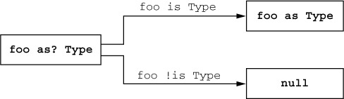
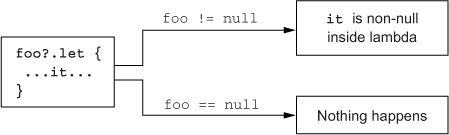
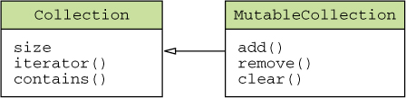

# Kotlin step 01

# 람다 프로그래밍

<details>
<summary>📒 람다 프로그래밍 요약</summary>

- 람다를 사용하여 코드 조각을 다른 함수에게 인자로 넘기기
    
```kotlin
/**
    * Performing operation on: 5
    * Result: 10
    */
fun performOperation(num: Int, operation: (Int) -> Unit) {
    println("Performing operation on: $num")
    operation(num)
}

// 코드 조각을 performOperation 함수의 인자로 넘기기
// 람다가 함수 인자인 경우 괄호 밖으로 람다를 빼내기
performOperation(5) { 
    // // 람다 인자가 하나뿐인 경우 인자 이름을 지정하지 않고 디폴트 이름(it)으로 사용 가능
    println("Result: ${it * 2}") 
}
```

- 람다 안에서 바깥 함수의 변수 읽기/쓰기

```kotlin
var result = 0
val add: (Int) -> Unit = { result += it }
add(5)
assertEquals(5, result)
```

- 메소드, 생성자, 프로퍼티 이름 앞에 `::`을 붙이면 각각에 대한 참조 생성 가능
    - 참조를 람다 대신 다른 함수에게 넘길 수 있음

```kotlin
fun printMessage(message: String): String {
    return message
}

// 메소드, 생성자, 프로퍼티 참조
val ref = ::printMessage
assertEquals("Hello", ref("Hello"))
```

- 컬렉션 함수 활용으로 컬렉션에 대한 연산을 직접 원소를 이터레이션 하지 않고 수행

```kotlin
val numbers = listOf(1, 2, 3, 4, 5)
val evenNumbers = numbers.filter { it % 2 == 0 }
val doubledNumbers = numbers.map { it * 2 }
val allEven = numbers.all { it % 2 == 0 }
val anyEven = numbers.any { it % 2 == 0 }

assertEquals(listOf(2, 4), evenNumbers)
assertEquals(listOf(2, 4, 6, 8, 10), doubledNumbers)
assertFalse(allEven)
assertTrue(anyEven)
```

- 시퀀스를 사용하면 중간 결과를 담는 컬렉션을 생성하지 않고도 컬렉션에 대한 여러 연산을 조합 가능

```kotlin
val numbers = listOf(1, 2, 3, 4, 5)
val result = numbers.asSequence()
    .filter { it % 2 == 0 }
    .map { it * 2 }
    .toList()

assertEquals(listOf(4, 8), result)
```

- 함수형 인터페이스(추상 메소드가 단 하나뿐인 SAM 인터페이스)를 인자로 받는 자바 함수를 호출할 경우 람다를 함수형 인터페이스 인자 대신 넘길 수 있다.

```kotlin
// Runnable 인터페이스를 인자로 받는 자바 메소드 호출
val thread = Thread { println("Running in a thread") }
thread.start()
```

- 수신 객체 지정 람다를 사용하면 람다 안에서 미리 정해둔 수신 객체의 메소드를 직접 호출 가능

```kotlin
fun buildString(): String {
    return StringBuilder().apply {
        append("Hello, ")
        append("World!")
    }.toString()
}

assertEquals("Hello, World!", buildString())
```

- 표준 라이브러리의 `with` 함수를 사용하면 어떤 객체에 대한 참조를 반복해서 언급하지 않으면서 그 객체의 메소드를 호출 가능
    - `apply`를 사용하면 어떤 객체라도 빌더 스타일의 API를 사용해 생성하고 초기화 가능

```kotlin
val result = with(StringBuilder()) {
        append("Hello, ")
        append("World!")
        toString()
    }
    assertEquals("Hello, World!", result)

    val result2 = StringBuilder().apply {
        append("Hello, ")
        append("World!")
    }.toString()
    assertEquals("Hello, World!", result2)
```
</details>

## **람다 식과 멤버 참조**

**코드 블록을 함수 인자로 넘기기**

- 함수를 직접 다른 함수에 전달할 수 있다.
- 람다 식을 사용하면 코드가 더욱 더 간결해진다.

## **람다와 컬렉션**

> 함수나 프로퍼티를 반환하는 역할을 수행하는 람다는 멤버 참조로 대치할 수 있다.

```kotlin
data class Person(val name: String, val age: Int)

/* Java */
fun findTheOldest(people: List<Person>): Person? {
    var maxAge = 0
    var theOldest: Person? = null
    for (person in people) {
        if (person.age > maxAge) {
            maxAge = person.age
            theOldest = person
        }
    }
    return theOldest
}

@Test
fun `람다와 컬렉션`() {
    val javaPeople = listOf(Person("Alice", 29), Person("Bob", 31))
    assertEquals(Person("Bob", 31), findTheOldest(javaPeople))

    val kotlinPeople = listOf(Person("Alice", 29), Person("Bob", 31))
    assertEquals(Person("Bob", 31), kotlinPeople.maxByOrNull { it.age })
}
```

## **람다 현재 영역에 있는 변수에 접근**

```kotlin
// 메시지의 목록을 받아 모든 메시지에 똑같은 접두사를 붙여서 출력
fun printMessagesWithPrefix(messages: Collection<String>, prefix: String) {
    messages.forEach {
        println("$prefix $it")
    }
}
```

코틀린은 자바와 달리 람다 밖 함수에 있는 final이 아닌 변수에 접근할 수 있고, 그 변수를 변경할 수도 있다.

```kotlin
fun printProblemCounts(responses: Collection<String>) {
    var clientErrors = 0
    var serverErrors = 0
    responses.forEach {
        if (it.startsWith("4")) {
            clientErrors++ // 람다 밖에 있는 변수를 변경
        } else if (it.startsWith("5")) {
            serverErrors++
        }
    }
    println("$clientErrors client errors, $serverErrors server errors")
}
```

단, 람다를 이벤트 핸들러나 다른 비동기적으로 실행되는 코드로 활용하는 경우 

- 함수 호출이 끝난 다음에 로컬 변수가 변경될 수도 있다.

```kotlin
// 핸들러는 tryToCountButtonClicks가 clicks를 반환한 다음에 호출
fun tryToCountButtonClicks(button: Button) : Int {
		var clicks = 0
		button.onClick { clicks++ }
		return clicks
}
```

---

# **컬렉션 함수형 API**

## **filter & map**

> `filter` 함수는 컬렉션에서 원치 않는 원소를 제거
- 하지만 filter는 원소를 변환은 불가
- 원소를 변환하려면 map 함수를 사용해야 한다.
 
> `map` 함수는 주어진 람다를 컬렉션의 각 원소에 적용한 결과를 모아서 새 컬렉션을 생성

```kotlin
@Test
fun `filter and map`() {
    val people1 = listOf(Person("Alice", 29), Person("Bob", 31))
    assertEquals(listOf(Person("Bob", 31)), people1.filter { it.age > 30 })

    val people2 = listOf(Person("Alice", 29), Person("Bob", 31))
    assertEquals(listOf("Alice", "Bob"), people2.map { it.name })

    val numbers = mapOf(0 to "zero", 1 to "one")
    assertEquals(mapOf(0 to "ZERO", 1 to "ONE"), numbers.mapValues { it.value.uppercase() })
}
```

## **all, any, count, find**

> 컬렉션의 모든 원소가 어떤 조건을 만족하는지 판단하는 연산(ex. all, any ..)

```kotlin
@Test
fun `all any count find`() {
    val canBeInClub27 = { p: Person -> p.age <= 27 }
    val people1 = listOf(Person("Alice", 27), Person("Bob", 31))
    // Returns true if all elements match the given predicate.
    assertFalse(people1.all(canBeInClub27))

    val people2 = listOf(Person("Alice", 27), Person("Bob", 31))
    // Returns true if at least one element matches the given predicate.
    assertTrue(people2.any(canBeInClub27))

    val people3 = listOf(Person("Alice", 27), Person("Bob", 31))
    // Returns the number of elements matching the given predicate.
    assertEquals(1, people3.count(canBeInClub27))

    val people4 = listOf(Person("Alice", 27), Person("Bob", 31))
    // Returns the first element matching the given predicate, or null if no such element was found.
    assertEquals(Person("Alice", 27), people4.find(canBeInClub27))
}
```

## **flatMap & flatten**

> `flatMap` 함수는 먼저 인자로 주어진 람다를 컬렉션의 모든 객체에 적용하고
> 
> 람다를 적용한 결과 얻어지는 여러 리스트를 한 리스트로 모은다.

```kotlin
@Test
// Returns a single list of all elements yielded from results of transform function being invoked on each element of original collection.
fun `flatMap`() {
    val strings = listOf("abc", "def")
    assertEquals(listOf('a', 'b', 'c', 'd', 'e', 'f'), strings.flatMap { it.toList() })

    val books = listOf(
        Book("Thursday Next", listOf("Jasper Fforde")),
        Book("Mort", listOf("Terry Pratchett")),
        Book("Good Omens", listOf("Terry Pratchett", "Neil Gaiman"))
    )
    assertEquals(setOf("Jasper Fforde", "Terry Pratchett", "Neil Gaiman"), books.flatMap { it.authors }.toSet())
}

@Test
// Returns a single list of all elements from all collections in the given collection.
fun `flatten`() {
    val lists = listOf(
        listOf(1, 2, 3),
        listOf(4, 5, 6),
        listOf(7, 8, 9)
    )

    assertEquals(listOf(1, 2, 3, 4, 5, 6, 7, 8, 9), lists.flatten())
}
```

# sequence

## **지연 계산(lazy) 컬렉션 연산**

map, filter 같은 컬렉션 함수는 결과 컬렉션을 즉시 생성하는데

- 이는 컬렉션 함수를 연쇄하면 매 단계마다 계산 중간 결과를 새로운 컬렉션에 임시로 담는다는 뜻
- 시퀀스(`sequence`)를 사용하면 중간 임시 컬렉션을 사용하지 않고도 컬렉션 연산을 연쇄할 수 있다.

```kotlin
@Test
fun `lazy`() {
    /**
     * map(1) filter(1)
     * map(2) filter(4)
     * map(3) filter(9)
     * map(4) filter(16)
     */
    listOf(1, 2, 3, 4).asSequence() // 원본 컬렉션을 시퀀스로 변환
        .map { print("map($it) "); it * it } // 시퀀스도 컬렉션과 똑같은 API 제공
        .filter { println("filter($it) "); it % 2 == 0 }
        .toList() // 결과 시퀀스를 다시 리스트로 변환
}
```

## **시퀀스 연산 실행: 중간 연산과 최종 연산**

> 시퀀스에 대한 연산은 중간 연산과 최종 연산으로 나뉜다.

`중간 연산`은 다른 시퀀스를 반환
- 그 시퀀스는 최초 시퀀스의 원소를 변환하는 방법을 안다.

`최종 연산`은 결과를 반환

```kotlin
@Test
fun `sequence`() {
		// 시퀀스의 모든 연산은 각 원소에 대해 순차적으로 적용
		// 첫 번째 원소가 처리되고, 다시 두 번째 원소가 처리되며, 이런 처리가 모든 원소에 대해 적용
    listOf(1, 2, 3, 4).asSequence()
        .map { print("map($it) "); it * it }
        .filter { print("filter($it) "); it % 2 == 0 }
        .toList()
    // map(1) filter(1) map(2) filter(4) map(3) filter(9) map(4) filter(16) 
}
```

# **자바 함수형 인터페이스 활용**

## 자바  메소드에 람다를 인자로 전달

> 함수형 인터페이스를 인자로 원하는 자바 메소드에 코틀린 람다를 전달할 수 있다.

```kotlin
 @Test
fun `자바 메소드에 람다를 인자로 전달`() {
    fun postponComputation(num: Int, runnable: Runnable) {
        println("num is : " + num)
        runnable.run()
    }

		// 객체 식을 함수형 인터페이스 구현으로
    postponComputation(1000, object : Runnable {
        override fun run() {
            println(42)
        }
    })

		// 프로그램 전체에서 Runnable의 인스턴스는 단 하나만 생성
    postponComputation(1000) { println(42) }
}
```

- 무명 객체는 메소드 호출 때마다 새로운 객체가 생성되지만,
- 람다는 메소드를 호출할 때마다 반복 사용
- 단, 람다가 주변 영역의 변수를 참조할 경우 매 호출마다 같은 인스턴스를 사용할 수 없음
    - 이 경우 컴파일러는 매번 주변 영역의 변수를 참조한 새로운 인스턴스를 생성

```kotlin
fun handlerComputation(id: String) {
		// handlerComputation 호출 때마다 새로 Runnable 인스턴스 생성
		postponeComputation(1000) { println(id) }
}
```

## **람다를 함수형 인터페이스로 명시적으로 변경**

> SAM 생성자는 람다를 함수형 인터페이스의 인스턴스로 변환할 수 있게 컴파일러가 자동으로 생성한 함수
- 컴파일러가 자동으로 람다를 함수형 인터페이스 무명 클래스로 바꾸지 못하는 경우 SAM 생성자 사용 가능

```kotlin
@Test
fun `람다를 함수형 인터페이스로 명시적으로 변경`() {
    fun createAllDoneRunnable(): Runnable {
        return Runnable { println("All done!") }
    }

    createAllDoneRunnable().run()
}
```

# **수신 객체 지정 람다**

> 자바의 람다에는 없는 코틀린 람다의 독특한 기능
- 수신 객체를 명시하지 않고 **람다의 본문 안에서 다른 객체의 메소드를 호출 가능**

## with 함수

> 특정 객체의 이름을 반복하지 않고도 그 객체에 대해 다양한 연산을 수행
- 어떤 객체에 대한 참조를 반복해서 언급하지 않으면서 그 객체의 메소드를 호출 가능

```kotlin
@Test
fun `with function`() {
    fun alphabet(): String {
        val result = StringBuilder()
        for (letter in 'A'..'Z') {
            result.append(letter)
        }
        result.append("Now I know the alphabet!")
        return result.toString()
    }

    fun alphabetUsingWith(): String {
        val stringBuilder = StringBuilder()
        // 첫 번째 인자로 받은 객체를 두 번째 인자로 받은 람다의 수신 객체 생성
        return with(stringBuilder) {
            for (letter in 'A'..'Z') {
                // 본문에서는 this를 사용해 인자로 받은 수신 객체에 접근 가능
                this.append(letter)
            }
            append("Now I know the alphabet!")
            // with가 반환하는 값은 람다 코드를 실행한 결과(람다 코드의 마지막 식의 값)
            // 람다의 결과 대신 수신 객체가 필요한 경우 apply 라이브러리 함수를 사용
            this.toString()
        }
    }

    assertEquals("ABCDEFGHIJKLMNOPQRSTUVWXYZNow I know the alphabet!", alphabet())
    assertEquals("ABCDEFGHIJKLMNOPQRSTUVWXYZNow I know the alphabet!", alphabetUsingWith())
}
```

## apply 함수

> 거의 with와 동일하고, 항상 자신에게 전달된 객체(즉 수신 객체)를 반환
- 어떤 객체라도 빌더 스타일의 API를 사용해 생성하고 초기화

```kotlin
@Test
fun `apply function`() {
    fun alphabet() = StringBuilder().apply {
        for (letter in 'A'..'Z') {
            append(letter)
        }
        append("Now I know the alphabet!")
    }.toString()

    assertEquals("ABCDEFGHIJKLMNOPQRSTUVWXYZNow I know the alphabet!", alphabet())
}
```

`with`와 `apply`는 수신 객체 지정 람다를 사용하는 일반적인 예제 중 하나

- 더 구체적인 함수를 비슷한 패턴으로 활용 가능
- ex. 표준 라이브러리의 buildString 함수를 사용하여 단순화

```kotlin
@Test
fun `buildString`() {
    // buildString 함수는 StringBuilder를 활용해 String을 만드는 경우 사용할 수 있는 우아한 해법
    fun alphabet() = buildString {
        for (letter in 'A'..'Z') {
            append(letter)
        }
        append("Now I know the alphabet!")
    }

    assertEquals("ABCDEFGHIJKLMNOPQRSTUVWXYZNow I know the alphabet!", alphabet())
}
```

---

# 타입 시스템

## 널 가능성

> 널이 될 수 있는지 여부를 타입 시스템에 추가함으로써 컴파일러가 여러 가지 오류를 컴파일 시 
> 
> 미리 감지해서 실행 시점에 발생할 수 있는 예외의 가능성을 줄일 수 있다.

## **안전한 호출 연산자: ?.**

> `?.`은 null 검사와 메소드 호출을 한 번의 연산으로 수행

`s?.toUpperCase()` == `if(s ≠ null) s.toUpperCase() else null`

```kotlin
@Test
fun `안전한 호출 연산자`() {
    class Address(val streetAddress: String, val zipCode: Int,
                  val city: String, val country: String)

    class Company(val name: String, val address: Address?)

    class Person(val name: String, val company: Company?)

    fun Person.countryName(): String {
        val country = this.company?.address?.country
        return if (country != null) country else "Unknown"
    }

    val person = Person("Dmitry", null)
    assertEquals("Unknown", person.countryName())

    val person2 = Person("Dmitry", Company("JetBrains", null))
    assertEquals("Unknown", person2.countryName())

    val person3 = Person("Dmitry", Company("JetBrains", Address("ABC Street", 42, "Seoul", "KOREA")))
    assertEquals("KOREA", person3.countryName())
}
```

## **엘비스 연산자: ?:**

> 코틀린은 null 대신 사용할 디폴트 값을 지정할 때 편리하게 사용할 수 있는 연산자를 제공

코틀린에서는 return 이나 throw 등의 연산도 식이다. 

- 따라서 엘비스 연산자의 유항에 return, throw 등의 연산을 넣을 수 있고,
- 엘비스 연산자를 더욱 편하게 사용할 수 있다.

```kotlin
@Test
fun `엘비스 연산자`() {
    class Address(val streetAddress: String, val zipCode: Int,
                  val city: String, val country: String)

    class Company(val name: String, val address: Address?)

    class Person(val name: String, val company: Company?)

    fun printShippingLabel(person: Person) {
        val address = person.company?.address
            ?: throw IllegalArgumentException("No address")
        with (address) {
            print(streetAddress + ". ")
            println("$zipCode $city, $country")
        }
    }

    val address = Address("ABC Street", 42, "Seoul", "KOREA")
    val jetbrains = Company("JetBrains", address)
    val person = Person("Dmitry", jetbrains)

    // ABC Street. 42 Seoul, KOREA
    printShippingLabel(person)
    assertThrows<IllegalArgumentException> {
        printShippingLabel(Person("Alexey", null))
    }
}
```

## **안전한 캐스트: as?**

> `as?`는 값을 대상 타입으로 변환할 수 없으면 null 반환

<figure><figcaption></figcaption></figure>

https://livebook.manning.com/book/kotlin-in-action/chapter-6

```kotlin
@Test
fun `안전한 캐스트`() {
    class Person(val firstName: String, val lastName: String) {
        override fun equals(o: Any?): Boolean {
            // 파라미터로 받은 값이 원하는 타입인지 쉽게 검사하고 캐스트하고,
            // 타입이 맞지 않으면 쉽게 false 반환
            val otherPerson = o as? Person ?: return false

            return otherPerson.firstName == firstName &&
                    otherPerson.lastName == lastName
        }

        override fun hashCode(): Int =
            firstName.hashCode() * 37 + lastName.hashCode()
    }

    val p1 = Person("Dmitry", "Jemerov")
    val p2 = Person("Dmitry", "Jemerov")
    assertTrue(p1 == p2)
    assertFalse(p1.equals(42))
}
```

## **널 아님 단언: !!**

> `!!`으로 어떤 값이든 널이 될 수 없는 타입으로 (강제로) 바꿀 수 있다. 
> 
> 실제 널에 대해 `!!`를 적용하면 NPE가 발생

```kotlin
@Test
fun `널 아님 단언`() {
    fun ignoreNulls(s: String?): Int {
        val sNotNull: String = s!!
        return sNotNull.length
    }

    assertEquals(3, ignoreNulls("abc"))
    assertThrows<NullPointerException> {
        ignoreNulls(null)
    }
}
```

⚠️ `!! 단언문` 사용 시 주의사항이 있다. 

- `!!`를 사용해서 발생하는 NPE 예외의 스택 트레이스(stack trace)에는 어떤 파일의 몇 번째 줄인지에 대한 정보는 들어있지만, 어떤 식에서 예외가 발생했는지에 대한 정보는 들어있지 않다.
- 어떤 값이 널이었는지 확실히 하기 위해 여러 `!! 단언문`을 한 줄에 함께 쓰는 일을 피하자.

```kotlin
// 아래와 같은 식으로 코드를 작성하지 말자
person.company!!.address!!.country 
```

## **let 함수**

> `let 함수`를 사용하면 널이 될 수 있는 식을 더 쉽게 다룰 수 있다.

`let 함수`를 안전한 호출 연산자와 함께 사용하면 원하는 식을 평가해서 결과가 널인지 검사한 다음에 
- **그 결과를 변수에 넣는 작업**을 간단한 식을 사용해 한꺼번에 처리

`let 함수`는 자신의 수신 객체를 인자로 전달받은 람다에게 넘긴다. 

- 널이 될 수 있는 값에 대해 안전한 호출 구문을 사용해 `let`을 호출하되
- 널이 될 수 없는 타입을 인자로 받는 람다를 `let`에 전달

<figure><figcaption></figcaption></figure>

```kotlin
@Test
fun `let 함수`() {
    fun sendEmailTo(email: String): String {
        return "Sending email to $email"
    }

    var email: String? = "aaron@example.com"
    assertEquals("Sending email to aaron@example.com", 
						    email?.let { sendEmailTo(it) })

    email = null
    assertEquals(null, 
						    email?.let { sendEmailTo(it) })
}
```

`let`을 쓰면 긴 식의 결과를 저장하는 변수를 따로 만들 필요가 없다.

- 여러 값이 널인지 검사해야 한다면 `let` 호출을 중첩시켜서 처리할 수 있다.
- 그렇게 `let`을 중첩시켜 처리하면 코드가 복잡해져서 알아보기 어려워진다.
    - 그런 경우 일반적인 `if`를 사용해 모든 값을 한꺼번에 검사하는 편이 낫다.

## 나중에 초기화할 프로퍼티 (lateinit)

> 코틀린에서 클래스 안의 널이 될 수 없는 프로퍼티를 생성자 안에서 초기화하지 않고,
> 
> 특별한 메소드 안에서 초기화할 수는 없다.

코틀린에서는 일반적으로 생성자에서 모든 프로퍼티를 초기화해야 한다. 

- 프로퍼티 타입이 널이 될 수 없는 타입이라면 반드시 널이 아닌 값으로 그 프로퍼티를 초기화해야 한다.
- 그런 초기화 값을 제공할 수 없으면 널이 될 수 있는 타입을 사용할 수밖에 없다.
- 하지만 널이 될 수 있는 타입을 사용하면 모든 프로퍼티 접근에 널 검사를 넣거나 `!!` 연산자를 써야 한다.

프로퍼티를 여러 번 사용해야 할 경우 코드가 지저분해지는데
 * 이를 해결하기 위해 `lateinit` 변경자를 사용해서 프로퍼티를 나중에 초기화(late-initialized)할 수 있다.

```kotlin
// AS-IS
class MyService {
    fun performAction(): String = "foo"
}

class MyTest {
    // null로 초기화하기 위해 널이 될 수 있는 타입인 프로퍼티를 선언
    private var myService: MyService? = null

    @Before fun setUp() {
        // setUp 메소드 안에서 실제 초깃값을 지정
        myService = MyService()
    }

    @Test fun testAction() {
        // 널 가능성에 신경 써야 하므로, !!나 ? 사용 필수
        assertEquals("foo",
            myService!!.performAction())
    }
}

---

// TO-BE
class MyService {
    fun performAction(): String = "foo"
}

class MyTest {
    // 초기화하지 않고 널이 될 수 없는 프로퍼티를 선언
    private lateinit var myService: MyService

    @Before fun setUp() {
        myService = MyService()
    }

    @Test fun testAction() {
        // 널 검사를 수행하지 않고 프로퍼티를 사용
        Assert.assertEquals("foo",
            myService.performAction())
    }
}
```

# 코틀린의 원시 타입

## 원시 타입: Int, Boolean …

> 코틀린은 원시 타입과 래퍼 타입을 구분하지 않으므로 항상 같은 타입을 사용

```kotlin
@Test
fun `원시 타입`() {
    fun showProgress(progress: Int): String {
        // 원시 타입의 값에 대해 메소드 호출 가능
        val percent = progress.coerceIn(0, 100)
        return "We're ${percent}% done!"
    }

    assertEquals("We're 90% done!", showProgress(90))
    assertEquals("We're 100% done!", showProgress(130))
}
```

코틀린은 실행 시점에 숫자 타입이 가능한 한 가장 효율적인 방식으로 표현

- 대부분의 경우 코틀린의 Int 타입은 자바 `int` 타입으로 컴파일
- 자바 원시 타입에 해당하는 타입들
    - `정수 타입` : Byte, Short, Int, Long
    - `부동소수점 수 타입` : Float, Double
    - `문자 타입` : Char
    - `불리언 타입` : Boolean

## 널이 될 수 있는 원시 타입: Int?, Boolean? …

> 코틀린에서 널이 될 수 있는 원시 타입을 사용하면 그 타입은 자바의 래퍼 타입으로 컴파일

코틀린에서 적절한 타입을 찾으려면 그 변수나 프로퍼티에 널이 들어갈 수 있는지만 고민하면 된다.

```kotlin
@Test
fun `널이 될 수 있는 원시 타입`() {
    data class Person(val name: String,
                      val age: Int? = null) {

        fun isOlderThan(other: Person): Boolean? {
            if (age == null || other.age == null)
                return null
            return age > other.age
        }
    }

    assertEquals(false, Person("Sam", 35).isOlderThan(Person("Amy", 42)))
    assertEquals(null, Person("Sam", 35).isOlderThan(Person("Jane")))
}
```

## **숫자 변환**

> 코틀린과 자바의 가장 큰 차이점 중 하나는 숫자를 변환하는 방식

코틀린은 한 타입의 숫자를 ***다른 타입의 숫자로 자동 변환하지 않는다.*** 

- 결과 타입이 허용하는 숫자의 범위가 원래 타입의 범위보다 넓은 경우 조차도 자동 변환은 불가능

```kotlin
@Test
fun `숫자 변환`() {
    val i = 1
    val l: Long = i // 컴파일 오류: Type mismatch. Required: Long, Found: Int
    val l2: Long = i.toLong()
}
```

코틀린은 모든 원시 타입에 대한 변환 함수를 제공

- ex) toByte(), toShort(), toChar() …
- 표현 범위가 더 넓은 타입으로 변환하는 함수도 있고,
- 표현 범위가 더 좁은 타입으로 변환하면서, 값을 벗어나는 경우 일부를 잘라내는 함수(Long.toInt())도 존재

**문자열을 숫자로 변환**

코틀린 표준 라이브러리는 ***문자열을 원시 타입으로 변환하는 여러 함수를 제공***

- ex. toInt, toByte, toBoolean …
- 이런 함수는 문자열의 내용을 각 원시 타입을 표기하는 문자열로 파싱
- 파싱 실패 시 `NumberFormatException` 발생

```kotlin
@Test
fun `문자열을 숫자로 변환`() {
    assertEquals(123, "123".toInt())
    assertEquals(123.45, "123.45".toDouble())

    assertThrows<NumberFormatException> {
        "abc".toInt()
    }
    assertThrows<NumberFormatException> {
        "abc".toDouble()
    }
}
```

## **Any, Any?: 최상위 타입**

> 자바에서는 `Object`가 클래스 계층의 최상위 타입이라면
코틀린에서는 `Any` 타입이 원시 타입(Int 등)을 포함한 모든 타입 조상 타입
> 

```kotlin
@Test
fun `Any 타입 테스트`() {
    val anyInt: Any = 42
    val anyString: Any = "Hello, World!"
    val anyList: Any = listOf(1, 2, 3)

    assertTrue(anyInt is Int)
    assertTrue(anyString is String)
    assertTrue(anyList is List<*>)
}
```

## **Unit 타입: 코틀린의 void**

> 코틀린의 `Unit` 타입은 자바 `void`와 같은 기능

반환이 없는 함수의 반환 타입으로 사용 가능
- 이는 반환 타입 선언 없이 정의한 블록이 본문인 함수와 동일

### **코틀린의 Unit이 자바 void와 다른 점?**

> `Unit`은 모든 기능을 갖는 일반적인 타입이며, void와 달리 Unit을 타입 인자로 사용 가능

- Unit 타입에 속한 값은 단 하나뿐이며, 그 이름도 Unit
- Unit 타입의 함수는 Unit 값을 묵시적으로 반환
- 이 두 특성은 제네릭 파라미터를 반환하는 함수를 오버라이드하면서 반환 타입으로 Unit을 쓸 때 유용

```kotlin
interface Processor<T> {
    fun process() : T
}

@Test
fun `unit type`() {
    class NoResultProcessor : Processor<Unit> {
        override fun process() {
            // process
        }
    }
}
```

자바의 `Void`

- 의미: ***반환값이 없음***을 표현
- 특징: 실제로 반환되는 값이 없음

코틀린의 `Unit`

- 의미: ***반환값이 없음***을 나타내지만, 실제로는 단 하나의 인스턴스인 ***Unit 객체 반환***
- 특징: 함수형 프로그래밍에서 '단 하나의 인스턴스만 갖는 타입'을 의미

코틀린의 `Nothing`

- 의미: ***함수가 정상적으로 종료되지 않음***을 표현
- 특징: 예외를 던지거나 무한 루프에 빠지는 함수에서 사용. 모든 타입의 하위 타입

## **Nothing 타입**

> 코틀린에는 성공적으로 값을 돌려주는 일이 없는 '반환 값'이라는 개념 자체가 의미 없는 함수가 일부 존재한다

- 주로 예외를 던지거나 무한 루프에 빠지는 함수들은 정상적으로 종료되지 않기 때문에 반환값이 없음
- 이러한 함수들은 `Nothing` 타입을 반환

```kotlin
@Test
fun `nothing`() {
    class Address(val streetAddress: String, val zipCode: Int,
                  val city: String, val country: String)
    class Company(val name: String, val address: Address?)

    fun fail(message: String) : Nothing {
        throw IllegalStateException(message)
    }

    val company = Company("JetBrains", Address("ABC Street", 42, "Seoul", "KOREA"))
    val address = company.address ?: fail("No address")
    assertEquals("Seoul", address.city)

    val company2 = Company("JetBrains", null)
    assertThrows<IllegalStateException> {
        company2.address ?: fail("No address")
    }
}
```

`Nothing` 타입은 아무 값도 포함하지 않는다. 

- 따라서, 함수의 반환 타입이나 반환 타입으로 쓰일 타입 파라미터만 사용 가능
- 컴파일러는 Nothing이 반환 타입인 함수가 정상 종료되지 않음을 알고 그 함수를 호출하는 코드 분석 시 사용

# **컬렉션과 배열**

## **널 가능성과 컬렉션**

> 컬렉션 안에 널 값을 넣을 수 있는지 여부는 어떤 변수의 값이 널이 될 수 있는지 여부와 마찬가지로 중요

```kotlin
fun addValidNumbers(numbers: List<Int?>) {
    var sumOfValidNumbers = 0
    var invalidNumbers = 0
    // 리스트의 원소에 접근하면 Int? 타입의 값 획득
    for (number in numbers) {
        // 따라서 널 검사 필요
        if (number != null) {
            sumOfValidNumbers += number
        } else {
            invalidNumbers++
        }
    }
    println("Sum of valid numbers: $sumOfValidNumbers")
    println("Invalid numbers: $invalidNumbers")
}
```

널이 될 수 있는 값으로 이루어진 컬렉션으로 널 값을 걸러내는 경우가 자주 있다보니 

- 코틀린 표준 라이브러리는 `filterNotNull` 함수를 제공

```kotlin
fun addValidNumbers(numbers: List<Int?>) {
    val validNumbers = numbers.filterNotNull()
    println("Sum of valid numbers: ${validNumbers.sum()}")
    println("Invalid numbers: ${numbers.size - validNumbers.size}")
}
```

## **읽기 전용과 변경 가능한 컬렉션**

> 코틀린 컬렉션과 자바 컬렉션을 나누는 가장 중요한 특성 하나는 
> 
> 코틀린에서는 컬렉션안의 ***데이터에 접근하는 인터페이스***와
> 
> 컬렉션 안의 ***데이터를 변경하는 인터페이스***를 분리했다는 점

- 일반적인 읽기 전용 라이브러리를 사용하려면 `kotlin.collections.Collection` 라이브러리를 사용
- 컬렉션의 데이터를 수정하려면 `kotlin.collections.MutableCollection` 인터페이스를 사용
    - 원소를 추가/삭제하거나, 컬렉션 안의 원소를 모두 지우는 등의 메소드를 제공

<center></center>