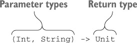

# 코틀린 Step02 - 오버로딩과 고차 함수

<details>
<summary>📒 연산자 오버로딩과 기타 관례 요약</summary>

- 표준 수학 연산자 오버로딩

```kotlin
data class Point(val x: Int, val y: Int) {
    operator fun plus(other: Point): Point {
        return Point(x + other.x, y + other.y)
    }
}

@Test
fun `test operator overloading`() {
    val p1 = Point(10, 20)
    val p2 = Point(30, 40)
    val result = p1 + p2
    assertEquals(Point(40, 60), result)
}
```

- 비교 연산자는 `equals`와 `compareTo` 메소드로 변환

```kotlin
    class Person(val name: String, val age: Int) : Comparable<Person> {
    override fun compareTo(other: Person): Int {
        return age - other.age
    }

    override fun equals(other: Any?): Boolean {
        if (this === other) return true
        if (other !is Person) return false
        return name == other.name && age == other.age
    }

    override fun hashCode(): Int {
        return name.hashCode() * 31 + age
    }
}

@Test
fun `test comparison operators`() {
    val p1 = Person("Alice", 30)
    val p2 = Person("Bob", 25)
    val p3 = Person("Alice", 30)

    assertTrue(p1 > p2)
    assertFalse(p1 == p2)
    assertTrue(p1 == p3)
}
```

- `get`, `set`, `contains` 함수를 정의하면 그 클래스의 인스턴스에 대해 `[]`와 `in` 연산 사용 가능
    - 해당 객체는 코틀린 컬렉션 객체와 유사

```kotlin
class CustomCollection {
    private val items = mutableListOf<String>()

    operator fun get(index: Int): String {
        return items[index]
    }

    operator fun set(index: Int, value: String) {
        items[index] = value
    }

    operator fun contains(value: String): Boolean {
        return items.contains(value)
    }

    fun add(value: String) {
        items.add(value)
    }
}

@Test
fun `test get, set, contains`() {
    val collection = CustomCollection()
    collection.add("Hello")
    collection.add("World")
    assertEquals("Hello", collection[0]) // get()

    collection[1] = "Kotlin" // set()
    assertEquals("Kotlin", collection[1]) // get()
    assertTrue("Kotlin" in collection) // contains()
}
```

- `rangeTo`, `iterator` 함수를 정의하면 범위를 만들거나 컬렉션과 배열의 원소를 이터레이션 가능

```kotlin
class CustomRange(val start: Int, val end: Int) {
    operator fun rangeTo(other: CustomRange): IntRange {
        return start..other.end
    }

    operator fun iterator(): Iterator<Int> {
        return (start..end).iterator()
    }
}

@Test
fun `test rangeTo and iterator`() {
    val range = CustomRange(1, 5)
    val result = mutableListOf<Int>()
    for (i in range) { // iterator()
        result.add(i)
    }
    assertEquals(listOf(1, 2, 3, 4, 5), result)

    val range2 = CustomRange(6, 10)
    val combinedRange = range..range2 // rangeTo()
    assertEquals((1..10), combinedRange)
}
```

- `구조 분해 선언`을 통해 한 객체의 상태를 분해해서 여러 변수에 대입 가능
    - 함수가 여러 값을 한꺼번에 반환해야 하는 경우 유용

```kotlin
data class Person(val name: String, val age: Int)

@Test
fun `test destructuring declaration`() {
    val person = Person("Alice", 30)
    val (name, age) = person
    assertEquals("Alice", name)
    assertEquals(30, age)
}
```

- `위임 프로퍼티`를 통해 프로퍼티 값을 저장, 초기화, 읽거나 변경할 때 사용하는 로직을 재활용 가능
    - 위임 프로퍼티는 프레임워크를 만들 때 아주 유용
    - `Delegates.observable` 함수를 사용하면 프로퍼티 변경 관찰자를 쉽게 추가 가능

```kotlin
class User {
    var name: String by Delegates.observable("<no name>") { _, old, new ->
        println("Name changed from $old to $new")
    }
}

@Test
fun `test delegated property`() {
    val user = User()
    assertEquals("<no name>", user.name)

    user.name = "Alice"
    assertEquals("Alice", user.name)

    user.name = "Bob"
    assertEquals("Bob", user.name)
}
```

- 표준 라이브러리 함수인 `lazy`를 통해 지연 초기화 프로퍼티를 쉽게 구현

```kotlin
class LazyInitialization {
    val lazyValue: String by lazy {
        println("Computed!")
        "Hello"
    }
}

@Test
fun `test lazy property`() {
    val instance = LazyInitialization()
    assertEquals("Hello", instance.lazyValue) // 최초로 접근 시 초기화
}
```
</details>

---

# **산술 연산자 오버로딩**

> 코틀린에서 관례를 사용하는 가장 단순한 예는 `산술 연산자`
> 
> 자바에서는 원시 타입에 대해서만 산술 연산자 사용 가능하고, String에 대해 + 연산자를 사용 가능

## **이항 산술 연산 오버로딩**

> `operator` 변경자를 추가해 plus 함수를 선언하고 나면 + 기호로 두 Point 객체를 더할 수 있음

```kotlin
// case 1. 연산자를 자체 함수로 정의하기
data class Point(val x: Int, val y: Int) {
    operator fun plus(other: Point): Point {
        return Point(x + other.x, y + other.y)
    }
}

// case 2. 연산자를 확장 함수로 정의하기
data class Point2(val x: Int, val y: Int)

operator fun Point2.plus(other: Point2): Point2 {
    return Point2(x + other.x, y + other.y)
}

@Test
fun `이항 산술 연산 오버로딩`() {
    val p1 = Point(10, 20)
    val p2 = Point(30, 40)
    assertEquals(Point(40, 60), p1 + p2)

    val p3 = Point2(10, 20)
    val p4 = Point2(30, 40)
    assertEquals(Point2(40, 60), p3 + p4)
}
```

ℹ️ 오버로딩 가능한 이항 산술 연산자

| Expression | Function name |
| ---------- | ------------- |
| a * b      | times         |
| a / b      | div           |
| a % b      | mod           |
| a + b      | plus          |
| a - b      | minus         |

> 연산자를 정의할 때 두 피연산자가(연산자 함수의 두 파라미터)가 같은 타입일 필요는 없다. 
> 
> 또는 연산자 함수의 반환 타입이 꼭 두 피연산자 중 하나와 일치해야만 하는 것도 아니다.

```kotlin
data class Point(val x: Int, val y: Int)

// case 1. 두 피연산자가 다른 연산자 정의
// Point, Double 타입의 피연산자를 받아 Point 반환
operator fun Point.times(scale: Double): Point {
    return Point((x * scale).toInt(), (y * scale).toInt())
}

// case 2. 반환 타입이 피연산자와 다른 연산자 정의
// Char, Int 타입의 피연산자를 받아 String 반환
operator fun Char.times(count: Int): String {
    return toString().repeat(count)
}

@Test
fun `연산자 정의`() {
    val point = Point(2, 3)
    val scaledPoint = point * 2.5
    assertEquals(Point(5, 7), scaledPoint)

    val result = 'a' * 3
    assertEquals("aaa", result)
}
```

## **복합 대입 연산자 오버로딩**

> `+=`, `-=` 등의 연산자는 복합 대입(compound assignment) 연산자라 불림

```kotlin
operator fun Point.plus(other: Point): Point {
    return Point(x + other.x, y + other.y)
}

@Test
fun `복합 대입 연산자`() {
    var point = Point(1, 2)
    point += Point(3, 4)
    assertEquals(Point(4, 6), point)
}
```

코틀린 표준 라이브러리는 변경 가능한 컬렉션에 대해 `plusAssign`을 정의

```kotlin
@Test
fun `test plusAssign operator`() {
    val mutableList = mutableListOf(1, 2, 3)
    mutableList += 4
    assertEquals(listOf(1, 2, 3, 4), mutableList)
}
```

## **단항 연산자 오버로딩**

> 단항 연산자 오버로딩하는 절차도 이항 연산자와 동일

```kotlin
data class Point(val x: Int, val y: Int)

operator fun Point.unaryMinus(): Point {
    return Point(-x, -y)
}

@Test
fun `단항 연산자`() {
    val p = Point(10, 20)
    assertEquals(Point(-10, -20), -p)
}
```

**ℹ️ 오버로딩할 수 있는 단항 산술 연산자**

| Expression | Function name |
| ---------- | ------------- |
| +a         | unaryPlus     |
| -a         | unaryMinus    |
| !a         | not           |
| ++a, a++   | inc           |
| --a, a--   | dec           |

---

# **비교 연산자 오버로딩**

## **동등성 연산자: equals**

> 코틀린이 `==` 연산자 호출을 `equals` 메소드 호출로 컴파일
> 
> `≠` 연산자를 사용하는 식도 `equals` 호출로 컴파일

```kotlin
class Point(val x: Int, val y: Int) {
    override fun equals(obj: Any?): Boolean {
        if (obj === this) return true
        if (obj !is Point) return false
        return obj.x == x && obj.y == y
    }
}

@Test
fun `동등성 연산자`() {
    assertTrue(Point(10, 20) == Point(10, 20))
    assertTrue(Point(10, 20) != Point(5, 5))
    assertFalse(null == Point(1, 2))
}
```

## **순서 연산자: compareTo**

> 자바에서 정렬, 최댓값, 최솟값 등 값을 비교해야 하는 알고리즘에 사용할 클래스는 `Comparable`
> 
> 인터페이스 구현이 필요하듯, 코틀린도 같은 Comparable 인터페이스를 지원

```kotlin
 @Test
fun `순서 연산자`() {
    class Person(
        val firstName: String, val lastName: String
    ) : Comparable<Person> {
        override fun compareTo(other: Person): Int {
            return compareValuesBy(
                this, other,
                Person::lastName, Person::firstName
            )
        }

        override fun equals(other: Any?): Boolean {
            if (this === other) return true
            if (other !is Person) return false
            return firstName == other.firstName && lastName == other.lastName
        }

        override fun hashCode(): Int {
            return firstName.hashCode() * 31 + lastName.hashCode()
        }
    }

    val person1 = Person("John", "Doe")
    val person2 = Person("Jane", "Doe")
    val person3 = Person("John", "Smith")

    // 같은 성, 다른 이름
    assertTrue(person1 > person2)
    assertFalse(person1 < person2)

    // 다른 성
    assertTrue(person1 < person3)
    assertFalse(person1 > person3)

    // 같은 성, 같은 이름 (equals, hashCode 오버라이드 필요)
    val person4 = Person("John", "Doe")
    assertTrue(person1 == person4)
}
```

코틀린 표준 라이브러리의 `compareValuesBy` 함수를 사용해 `compareTo`를 쉽고 간결하게 정의할 수 있다.

```kotlin
@Test
fun `compareValuesBy compareTo`() {
    assertTrue("abc" < "bac")
}
```

---

# **컬렉션과 범위에 대해 쓸 수 있는 관례**

## **in 관례**

> `In`은 객체가 컬렉션에 들어있는지 검사.
> 
> `in` 연산자와 대응하는 함수는 `contains`

```kotlin
data class Point(val x: Int, val y: Int)

data class Rectangle(val upperLeft: Point, val lowerRight: Point)

operator fun Rectangle.contains(p: Point): Boolean {
    // 20 in (10 <= true < 50) && 30 in (20 <= true < 50)
    return p.x in upperLeft.x until lowerRight.x &&
            p.y in upperLeft.y until lowerRight.y
}

@Test
fun `in 관례`() {
    val rect = Rectangle(Point(10, 20), Point(50, 50))
    assertTrue(Point(20, 30) in rect)
    assertFalse(Point(5, 5) in rect)
}
```

## **rangeTo 관례**

> 범위를 만들려면 `..` 구문을 사용

예를 들어 1..10은 1부터 10까지 모든 수가 들어있는 범위를 가리킨다.

<center></center>

https://livebook.manning.com/book/kotlin-in-action/chapter-7/65

```kotlin
@Test
fun `rangeTo 관례`() {
    val n = 9
    assertEquals(IntRange(0, 10), 0..(n + 1))
    (0..n).forEach { print(it) } // 0123456789
}
```

## **for 루프를 위한 iterator 관례**

> 코틀린에서는 `iterator` 메소드를 확장 함수로 정의 가능
> 
> 이런 성질로 인해 일반 자바 문자열에 대한 for 루프가 가능

```kotlin
operator fun ClosedRange<LocalDate>.iterator(): Iterator<LocalDate> =
    object : Iterator<LocalDate> {
        var current = start

        override fun hasNext() =
            current <= endInclusive

        override fun next() = current.apply {
            current = plusDays(1)
        }
    }

@Test
fun `for 루프를 위한 iterator 관례`() {
    val newYear = LocalDate.ofYearDay(2024, 1)
    val daysOff = newYear.minusDays(1)..newYear
    /**
     * 2023-12-31
     * 2024-01-01
     */
    for (dayOff in daysOff) { println(dayOff) }
}
```

---

# **구조 분해 선언과 component 함수**

> 구조 분해를 사용하면 복합적인 값을 분해해서 여러 다른 변수를 한꺼번에 초기화 가능

```kotlin
data class Point(val x: Int, val y: Int)

@Test
fun `구조 분해 선언`() {
    val p = Point(10, 20)
    val (x, y) = p
    assertEquals(10, x)
    assertEquals(20, y)
}
```

**구조 분해 선언은 함수에서 여러 값을 반환할 때 유용**

- 👎🏻 여러 값을 한꺼번에 반환해야 하는 함수가 있다면 반환해야 하는 모든 값이 들어갈 데이터 클래스를 정의하고 함수의 반환 타입을 그 데이터 클래스로 바꿔주어야 한다.
- 👍🏼 구조 분해 선언 구문을 사용하면 이런 ***함수가 반환하는 값을 쉽게 풀어서 여러 변수에 넣을 수 있다.***

```kotlin
data class NameComponents(val name: String,
                          val extension: String)

fun splitFilename(fullName: String): NameComponents {
    val result = fullName.split('.', limit = 2)
    return NameComponents(result[0], result[1]) // 함수에서 데이터 클래스의 인스턴스를 반환
}

@Test
fun `component 함수`() {
    val (name, ext) = splitFilename("example.kt") // 구조 분해 선언 구문을 사용해 데이터 클래스를 해체
    assertEquals("example", name)
    assertEquals("kt", ext)
}
```

## **구조 분해 선언과 루프**

> 함수 본문 내의 선언문 뿐 아니라, 
> 
> 변수 선언이 들어갈 수 있는 장소라면 어디든 구조 분해 선언을 사용 가능

```kotlin
 fun printEntries(map: Map<String, String>) {
    // 구조 분해 선언
    for ((key, value) in map) {
        println("$key -> $value")
    }
}

@Test
fun `구조 분해 선언과 루프`() {
    /**
     * Oracle -> Java
     * JetBrains -> Kotlin
     */
    val map = mapOf("Oracle" to "Java", "JetBrains" to "Kotlin")
    printEntries(map)
}
```

**두 가지 코틀린 관례를 활용한 예시**

- ***객체를 이터페이션***하는 관례
- ***구조 분해 선언***

```kotlin
@Test
fun `코틀린 관례`() {
    val map = mapOf(1 to "one", 2 to "two", 3 to "three")
    val keys = mutableListOf<Int>()
    val values = mutableListOf<String>()

    for (entry in map.entries) {
        // 코틀린 라이브러리는 Map.Entry에 대한 확장 함수로 component1, component2 제공
        val key = entry.component1()
        val value = entry.component2()
        keys.add(key)
        values.add(value)
    }

    assertEquals(listOf(1, 2, 3), keys)
    assertEquals(listOf("one", "two", "three"), values)
}
```

---

# **프로퍼티 접근자 로직 재활용: 위임 프로퍼티**

> 위임 프로퍼티(`delegated property`)를 사용하면 값을 뒷받침하는 필드에 단순히 저장하는 것보다 
> 
> 더 복잡한 방식으로 작동하는 프로퍼티를 쉽게 구현 가능하다.
> 
> 또한, 그 과정에서 접근자 로직을 매번 재구현할 필요도 없다.

위임은 객체가 직접 작업을 수행하지 않고, 다른 도우미 객체가 그 작업을 처리하게 맡기는 디자인 패턴을 말한다.

- 이때 작업을 처리하는 도우미 객체를 `위임 객체`라고 부른다.

## **위임 프로퍼티 사용: by lazy()를 사용한 프로퍼티 초기화 지연**

```kotlin
// AS-IS
@Test
fun `**AS-IS by lazy**`() {
    data class Email(val address: String)

    class Person(val name: String) {
        // 데이터를 저장하고 emails의 위임 객체 역활을 하는 _emails 프로퍼티
        private var _emails: List<Email>? = null

        val emails: List<Email>
            get() {
                if (_emails == null) {
                    _emails = loadEmails(this) // 최초 접근 시 이메일 가져오기
                }
                return _emails!! // 저장해 둔 데이터가 있으면 그 데이터를 반환
            }

        private fun loadEmails(person: Person): List<Email> {
            println("Loading emails for ${person.name}")
            return listOf(
                Email("alice@example.com"),
                Email("alice.work@example.com")
            )
        }
    }

    val p = Person("Alice")
    assertEquals(listOf(
        Email("alice@example.com"),
        Email("alice.work@example.com")
    ), p.emails)  // 최초로 emails를 읽을 때 단 한번만 이메일을 가져온다.
    assertEquals(listOf(
        Email("alice@example.com"),
        Email("alice.work@example.com")
    ), p.emails)
}

// TO-BE
/* 
 * 지연 초기화해야 하는 프로퍼티가 많아지면 코드가 복잡해지고, 
 * 스레드 안전하지 않아서 언제나 제대로 작동한다고 말할 수 없다.
 * 이 경우 위임 프로퍼티를 사용하면 훨씬 더 간편해진다.
 */
@Test
fun `by lazy`() {
    data class Email(val address: String)

    class Person(val name: String) {
		    // lazy 함수는 코틀린 관례에 맞는 시그니처의 getValue 메소드가 들어있는 객체를 반환
		    // 따라서 lazy를 by 키워드와 함께 사용해 위임 프로퍼티를 만들 수 있다.
        val emails by lazy { loadEmails(this) }

        private fun loadEmails(person: Person): List<Email> {
            println("Loading emails for ${person.name}")
            return listOf(
                Email("alice@example.com"),
                Email("alice.work@example.com")
            )
        }
    }

    val p = Person("Alice")
    val emails1 = p.emails // 최초로 emails를 읽을 때 단 한번만 이메일을 가져온다.
    val emails2 = p.emails

    assertEquals(emails1, emails2)
    assertEquals(listOf(
        Email("alice@example.com"),
        Email("alice.work@example.com")
    ), emails1)
}

```

---

# 고차 함수 정의

> `고차 함수`는 다른 함수를 인자로 받거나 함수를 반환하는 함수
> 
> 코틀린에서는 람다나 함수 참조를 사용해 ***함수를 값으로 표현 가능***
> 
> 따라서 고차 함수는 람다나 함수 참조를 인자로 넘길 수 있거나, 람다나 함수 참조를 반환하는 함수

## 함수 타입

> 함수 타입을 정의하려면 함수 파라미터의 타입을 괄호 안에 넣고, 
> 
> 그 뒤에 화살표(→)를 추가한 다음, 함수의 반환 타입을 지정

<center></center>

https://livebook.manning.com/book/kotlin-in-action/chapter-8

Unit 타입은 의미 있는 값을 반환하지 않는 함수 반환 타입에 쓰는 특별한 타입

- 그냥 함수를 정의한다면 함수의 파라미터 목록 뒤에 오는 Unit 반환 타입 지정을 생략해도 되지만,
- ⚠️ 함수 타입을 선언할 때는 반환 타입을 반드시 명시해야 하므로 Unit을 필수로 명시

## **인자로 받은 함수 호출**

> 인자로 받은 함수를 호출하는 구문은 일반 함수를 호출하는 구문과 동일

```kotlin
fun twoAndThree(operation: (Int, Int) -> Int): Int { // 함수 타입의 인자를 받는 함수
    val result = operation(2, 3)
    return result
}

@Test
fun `인자로 받은 함수 호출`() {
    assertEquals(5, twoAndThree { a, b -> a + b })
    assertEquals(6, twoAndThree { a, b -> a * b })
}
```

## **디폴트 값을 지정한 함수 타입 파라미터나 널이 될 수 있는 함수 타입 파라미터**

> 파라미터를 함수 타입으로 선언할 때도 디폴트 값을 정할 수 있다.

```kotlin
fun <T> Collection<T>.joinToString(
    separator: String = ", ",
    prefix: String = "",
    postfix: String = "",
    transform: (T) -> String = { it.toString() } // 함수 타입 파라미터를 선언하면서 람다를 디폴트 값으로 지정
): String {
    val result = StringBuilder(prefix)

    for ((index, element) in this.withIndex()) {
        if (index > 0) result.append(separator)
        result.append(transform(element)) // transform 파라미터로 받은 함수를 호출
    }

    result.append(postfix)
    return result.toString()
}

@Test
fun `파라미터를 함수 타입으로 선언할 때도 디폴트 값 설정 가능`() {
    val letters = listOf("Alpha", "Beta")

    assertEquals("Alpha, Beta", letters.joinToString()) // 디폴트 변환 함수 사용
    assertEquals("alpha, beta", letters.joinToString { it.lowercase() }) // 람다를 인자로 전달
    assertEquals("alpha! beta! ",
        letters.joinToString(separator = "! ", postfix = "! ", transform = { it.lowercase() })
    ) // 이름 붙은 인자 구문을 사용해 람다를 포함하는 여러 인자를 전달
}
```

## **함수를 함수에서 반환**

> 다른 함수를 반환하는 함수를 정의하려면 함수의 반환 타입으로 함수 타입을 지정
> 
> 함수를 반환하려면 return 식에 람다나 멤버 참조나 함수 타입의 값을 계산하는 식 등을 넣으면 된다.

```kotlin
data class Person(
    val firstName: String,
    val lastName: String,
    val phoneNumber: String?
)

class ContactListFilters {
    var prefix: String = ""
    var onlyWithPhoneNumber: Boolean = false

    fun getPredicate(): (Person) -> Boolean { // 함수를 반환하는 함수를 정의한다.
        val startsWithPrefix = { p: Person ->
            p.firstName.startsWith(prefix) || p.lastName.startsWith(prefix)
        }
        if (!onlyWithPhoneNumber) {
            return startsWithPrefix // 함수 타입의 변수 반환
        }
        return {  // 람다 반환
            startsWithPrefix(it)
                    && it.phoneNumber != null
        }
    }
}

@Test
fun `함수를 함수에서 반환`() {
    val contacts = listOf(
        Person("Dmitry", "Jemerov", "123-4567"),
        Person("Svetlana", "Isakova", null)
    )
    val contactListFilters = ContactListFilters()
    with(contactListFilters) {
        prefix = "Dm"
        onlyWithPhoneNumber = true
    }
    assertEquals(
        listOf(Person("Dmitry", "Jemerov", "123-4567")),
        contacts.filter(contactListFilters.getPredicate()) // 반환된 람다 적용
    )

    with(contactListFilters) {
        prefix = "Sv"
        onlyWithPhoneNumber = false
    }
    assertEquals(
        listOf(Person("Svetlana", "Isakova", null)),
        contacts.filter(contactListFilters.getPredicate()) // 반환된 함수 타입 변수 적용
    )
}
```

## **람다를 활용한 중복 제거**

> 함수 타입과 람다 식은 재활용하기 좋은 코드를 만들 때 쓸 수 있는 훌륭한 도구

웹 사이트 방문 기록을 분석하는 예시

```kotlin
@Test
    fun `람다를 활용한 중복 제거`() {
    /**
     * Case 01. 중복이 발생하는 코드
     */
    val averageWindowsDuration = log
        .filter { it.os == OS.WINDOWS }.map(SiteVisit::duration).average()

    val averageMacDuration = log
        .filter { it.os == OS.MAC }.map(SiteVisit::duration).average()

    assertEquals(23.0, averageWindowsDuration)
    assertEquals(22.0, averageMacDuration)

    /**
     * Case 02. 함수를 사용하여 일반 함수를 통해 중복을 줄이기
     */
    fun List<SiteVisit>.averageDurationFor(os: OS) =
        filter { it.os == os }.map(SiteVisit::duration).average()

    assertEquals(23.0, log.averageDurationFor(OS.WINDOWS))
    assertEquals(22.0, log.averageDurationFor(OS.MAC))

    /**
     * Case 02. 고차 함수를 이용하여 함수를 확장
     * > 특정 OS의 평균 방문 시간을 구하고 싶다거나, 특정 페이지 평균 방문 시간을 구하고 싶을 경우
     */
    fun List<SiteVisit>.averageDurationFor(predicate: (SiteVisit) -> Boolean) =
        filter(predicate).map(SiteVisit::duration).average()

    // 모바일 디바이스(IOS, 안드로이드)의 평균 방문 시간
    assertEquals(12.15, log.averageDurationFor { it.os in setOf(OS.ANDROID, OS.IOS) })
    // IOS 사용자의 /signup 페이지 평균 방문 시간
    assertEquals(8.0, log.averageDurationFor { it.os == OS.IOS && it.path == "/signup" })
}
```
