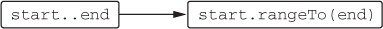

# 코틀린 Step02 - 오버로딩과 고차 함수

---

# **산술 연산자 오버로딩**

> 코틀린에서 관례를 사용하는 가장 단순한 예는 `산술 연산자`
> 
> 자바에서는 원시 타입에 대해서만 산술 연산자 사용 가능하고, String에 대해 + 연산자를 사용 가능

## **이항 산술 연산 오버로딩**

> `operator` 변경자를 추가해 plus 함수를 선언하고 나면 + 기호로 두 Point 객체를 더할 수 있음

```kotlin
// case 1. 연산자를 자체 함수로 정의하기
data class Point(val x: Int, val y: Int) {
    operator fun plus(other: Point): Point {
        return Point(x + other.x, y + other.y)
    }
}

// case 2. 연산자를 확장 함수로 정의하기
data class Point2(val x: Int, val y: Int)

operator fun Point2.plus(other: Point2): Point2 {
    return Point2(x + other.x, y + other.y)
}

@Test
fun `이항 산술 연산 오버로딩`() {
    val p1 = Point(10, 20)
    val p2 = Point(30, 40)
    assertEquals(Point(40, 60), p1 + p2)

    val p3 = Point2(10, 20)
    val p4 = Point2(30, 40)
    assertEquals(Point2(40, 60), p3 + p4)
}
```

ℹ️ 오버로딩 가능한 이항 산술 연산자

| Expression | Function name |
| ---------- | ------------- |
| a * b      | times         |
| a / b      | div           |
| a % b      | mod           |
| a + b      | plus          |
| a - b      | minus         |

> 연산자를 정의할 때 두 피연산자가(연산자 함수의 두 파라미터)가 같은 타입일 필요는 없다. 
> 
> 또는 연산자 함수의 반환 타입이 꼭 두 피연산자 중 하나와 일치해야만 하는 것도 아니다.

```kotlin
data class Point(val x: Int, val y: Int)

// case 1. 두 피연산자가 다른 연산자 정의
// Point, Double 타입의 피연산자를 받아 Point 반환
operator fun Point.times(scale: Double): Point {
    return Point((x * scale).toInt(), (y * scale).toInt())
}

// case 2. 반환 타입이 피연산자와 다른 연산자 정의
// Char, Int 타입의 피연산자를 받아 String 반환
operator fun Char.times(count: Int): String {
    return toString().repeat(count)
}

@Test
fun `연산자 정의`() {
    val point = Point(2, 3)
    val scaledPoint = point * 2.5
    assertEquals(Point(5, 7), scaledPoint)

    val result = 'a' * 3
    assertEquals("aaa", result)
}
```

## **복합 대입 연산자 오버로딩**

> `+=`, `-=` 등의 연산자는 복합 대입(compound assignment) 연산자라 불림

```kotlin
operator fun Point.plus(other: Point): Point {
    return Point(x + other.x, y + other.y)
}

@Test
fun `복합 대입 연산자`() {
    var point = Point(1, 2)
    point += Point(3, 4)
    assertEquals(Point(4, 6), point)
}
```

코틀린 표준 라이브러리는 변경 가능한 컬렉션에 대해 `plusAssign`을 정의

```kotlin
@Test
fun `test plusAssign operator`() {
    val mutableList = mutableListOf(1, 2, 3)
    mutableList += 4
    assertEquals(listOf(1, 2, 3, 4), mutableList)
}
```

## **단항 연산자 오버로딩**

> 단항 연산자 오버로딩하는 절차도 이항 연산자와 동일

```kotlin
data class Point(val x: Int, val y: Int)

operator fun Point.unaryMinus(): Point {
    return Point(-x, -y)
}

@Test
fun `단항 연산자`() {
    val p = Point(10, 20)
    assertEquals(Point(-10, -20), -p)
}
```

**ℹ️ 오버로딩할 수 있는 단항 산술 연산자**

| Expression | Function name |
| ---------- | ------------- |
| +a         | unaryPlus     |
| -a         | unaryMinus    |
| !a         | not           |
| ++a, a++   | inc           |
| --a, a--   | dec           |

---

# **비교 연산자 오버로딩**

## **동등성 연산자: equals**

> 코틀린이 `==` 연산자 호출을 `equals` 메소드 호출로 컴파일
> 
> `≠` 연산자를 사용하는 식도 `equals` 호출로 컴파일

```kotlin
class Point(val x: Int, val y: Int) {
    override fun equals(obj: Any?): Boolean {
        if (obj === this) return true
        if (obj !is Point) return false
        return obj.x == x && obj.y == y
    }
}

@Test
fun `동등성 연산자`() {
    assertTrue(Point(10, 20) == Point(10, 20))
    assertTrue(Point(10, 20) != Point(5, 5))
    assertFalse(null == Point(1, 2))
}
```

## **순서 연산자: compareTo**

> 자바에서 정렬, 최댓값, 최솟값 등 값을 비교해야 하는 알고리즘에 사용할 클래스는 `Comparable`
> 
> 인터페이스 구현이 필요하듯, 코틀린도 같은 Comparable 인터페이스를 지원

```kotlin
 @Test
fun `순서 연산자`() {
    class Person(
        val firstName: String, val lastName: String
    ) : Comparable<Person> {
        override fun compareTo(other: Person): Int {
            return compareValuesBy(
                this, other,
                Person::lastName, Person::firstName
            )
        }

        override fun equals(other: Any?): Boolean {
            if (this === other) return true
            if (other !is Person) return false
            return firstName == other.firstName && lastName == other.lastName
        }

        override fun hashCode(): Int {
            return firstName.hashCode() * 31 + lastName.hashCode()
        }
    }

    val person1 = Person("John", "Doe")
    val person2 = Person("Jane", "Doe")
    val person3 = Person("John", "Smith")

    // 같은 성, 다른 이름
    assertTrue(person1 > person2)
    assertFalse(person1 < person2)

    // 다른 성
    assertTrue(person1 < person3)
    assertFalse(person1 > person3)

    // 같은 성, 같은 이름 (equals, hashCode 오버라이드 필요)
    val person4 = Person("John", "Doe")
    assertTrue(person1 == person4)
}
```

코틀린 표준 라이브러리의 `compareValuesBy` 함수를 사용해 `compareTo`를 쉽고 간결하게 정의할 수 있다.

```kotlin
@Test
fun `compareValuesBy compareTo`() {
    assertTrue("abc" < "bac")
}
```

---

# **컬렉션과 범위에 대해 쓸 수 있는 관례**

## **in 관례**

> `In`은 객체가 컬렉션에 들어있는지 검사.
> 
> `in` 연산자와 대응하는 함수는 `contains`

```kotlin
data class Point(val x: Int, val y: Int)

data class Rectangle(val upperLeft: Point, val lowerRight: Point)

operator fun Rectangle.contains(p: Point): Boolean {
    // 20 in (10 <= true < 50) && 30 in (20 <= true < 50)
    return p.x in upperLeft.x until lowerRight.x &&
            p.y in upperLeft.y until lowerRight.y
}

@Test
fun `in 관례`() {
    val rect = Rectangle(Point(10, 20), Point(50, 50))
    assertTrue(Point(20, 30) in rect)
    assertFalse(Point(5, 5) in rect)
}
```

## **rangeTo 관례**

> 범위를 만들려면 `..` 구문을 사용

예를 들어 1..10은 1부터 10까지 모든 수가 들어있는 범위를 가리킨다.

<center></center>

https://livebook.manning.com/book/kotlin-in-action/chapter-7/65

```kotlin
@Test
fun `rangeTo 관례`() {
    val n = 9
    assertEquals(IntRange(0, 10), 0..(n + 1))
    (0..n).forEach { print(it) } // 0123456789
}
```

## **for 루프를 위한 iterator 관례**

> 코틀린에서는 `iterator` 메소드를 확장 함수로 정의 가능
> 
> 이런 성질로 인해 일반 자바 문자열에 대한 for 루프가 가능

```kotlin
operator fun ClosedRange<LocalDate>.iterator(): Iterator<LocalDate> =
    object : Iterator<LocalDate> {
        var current = start

        override fun hasNext() =
            current <= endInclusive

        override fun next() = current.apply {
            current = plusDays(1)
        }
    }

@Test
fun `for 루프를 위한 iterator 관례`() {
    val newYear = LocalDate.ofYearDay(2024, 1)
    val daysOff = newYear.minusDays(1)..newYear
    /**
     * 2023-12-31
     * 2024-01-01
     */
    for (dayOff in daysOff) { println(dayOff) }
}
```