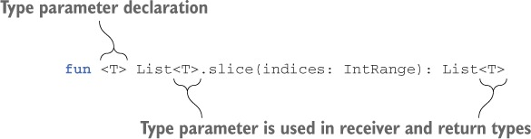
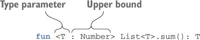
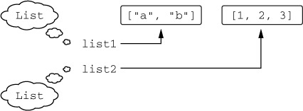
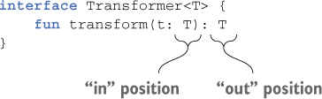

# 코틀린 Step03 - 제네릭스, 애노테이션, 리플렉션

<details>
<summary>📒 제네릭스 요약</summary>

- 제네릭 함수와 클래스를 자바와 비슷하게 선언

```kotlin
fun <T> identity(value: T): T {
    return value
}

class Box<T>(val value: T)

@Test
fun `제네릭 함수`() {
    assertEquals(42, identity(42))
    assertEquals("Hello", identity("Hello"))
}

@Test
fun `제네릭 클래스`() {
    val intBox = Box(42)
    val stringBox = Box("Hello")

    assertEquals(42, intBox.value)
    assertEquals("Hello", stringBox.value)
}
```

- 자바와 마찬가지로 제네릭 타입의 타입 인자는 컴파일 시점에만 존재
- 타입 인자가 실행 시점에 지워지므로 타입 인자가 있는 타입(제네릭 타입)을 is 연산자를 사용해 검사 불가
- 인라인 함수의 타입 매개변수를 `refied`로 표시해서 실체화하면 실행 시점에 그 타입을 is로 검사하거나 java.lang.Class 인스턴스를 얻을 수 있다.
- 변성은 기저 클래스가 같고 타입 파라미터가 다른 두 제네릭 타입 사이의 상위/하위 타입 관계가 타입 인자 사이의 상위/하위 타입 관계에 의해 어떤 영향을 받는지를 명시하는 방법

```kotlin
open class Animal
class Dog : Animal()
class Box<out T>(val value: T)

@Test
fun `변성 테스트`() {
    val dogBox: Box<Dog> = Box(Dog())
    val animalBox: Box<Animal> = dogBox // out 키워드로 캐스팅 가능

    assertTrue(animalBox is Box<Animal>)
}
```

- 제네릭 클래스의 타입 파라미터가 `out` 위치에서만 사용되는 경우(생산자) 그 타입 파라미터를 `out`으로 표시해서 공변적으로 만들 수 있다.
    - 코틀린의 읽기 전용 List 인터페이스는 공변적이다.
    - 따라서 List<String>은 List<Any)의 하위 타입이다.
- 공변적인 경우와 반대로 제네릭 클래스의 타입 파라미터가 `in` 위치에서만 사용되는 경우(소비자) 그 타입 파라미터를 `in`으로 표시해서 반공변적으로 만들 수 있다.
- 함수 인터페이스는 첫 번째 타입 파라미터에 대해서는 반공변적이고, 두 번째 타입 파라미터에 대해서는 공변적이다.
    - 그래서 (Animal) → Int는 (Cat) → Number의 하위 타입이다.
- 코틀린에서는 제네릭 클래스의 공변성을 전체적으로 지정하거나(선언 지점 변성) 구체적인 사용 위치에서 지정할 수 있다. (사용 지점 변성)
- 제네릭 클래스의 타입 인자가 어떤 타입인지 정보가 없거나 타입 인자가 어떤 타입인지가 중요하지 않을 때 스타 프로젝션(`*`) 구문을 사용할 수 있다.
</details>

<details>
<summary>📕 애노테이션과 리플렉션 요약</summary>

- 코틀린에서 애노테이션을 적용할 때 사용하는 문법은 자바와 거의 동일
- 코틀린에서는 자바보다 더 넓은 대상에 애노테이션을 적용 가능 (ex. 파일과 식(expression))
- 애노테이션 인자로 원시 타입 값, 문자열, 이넘, 클래스 참조, 다른 애노테이션 클래스의 인스턴스, 그리고 지금까지 말한 여러 유형의 값으로 이뤄진 배열을 사용 가능
- `@get:Rule`을 사용해 애노테이션의 사용 대상을 명시하면 한 코틀린 선언이 여러 가지 바이트 코드 요소를 만들어내는 경우 정확히 어떤 부분에 애노테이션을 적용할지 지정 가능
- 애노테이션 클래스를 정의할 때는 본문이 없고 주 생성자의 모든 파라미터를 val 프로퍼티로 표시한 코틀린 클래스를 사용

```kotlin
@Target(AnnotationTarget.CLASS, AnnotationTarget.FUNCTION)
@Retention(AnnotationRetention.RUNTIME)
annotation class MyAnnotation(val name: String, val value: Int)
```

- 메타애노테이션을 사용해 대상, 애노테이션 유지 방식 등 여러 애노테이션 특성을 지정 가능

```kotlin
@Target(AnnotationTarget.CLASS, AnnotationTarget.FUNCTION) // 애노테이션 적용 대상
@Retention(AnnotationRetention.RUNTIME) // 애노테이션 유지 방식
@MustBeDocumented // 문서화 여부
annotation class MyAnnotation(val name: String, val value: Int)
```

- 리플렉션 API를 통해 실행 시점에 객체의 메소드와 프로퍼티를 열거하고 접근 가능
    - 리플렉션 API에는 클래스(KClass), 함수(KFunction) 등 여러 종류의 선언을 표현하는 인터페이스 제공
- 클래스를 컴파일 시점에 알고 있다면 `KClass` 인스턴스를 얻기 위해 ClassName::class를 사용
    - 하지만 실행 시점에 obj 변수에 담긴 객체로부터 KClass 인스턴스를 얻기 위해서는 obj.javaClass.kotlin을 사용
- `KFunction`과 `KProperty` 인터페이스는 모두 KCallable을 확장
    - KClassable은 제네릭 call 메소드를 제공
- `KCallable.callBy` 메소드를 사용하면 메소드를 호출하면서 디폴트 파라미터값을 사용 가능
- `KFunction0`, `KFunctiuon1` 등의 인터페이스는 모두 파라미터 수가 다른 함수를 표현하며, invoke 메소드를 사용해 함수 호출 가능
- `KProperty0`는 최상위 프로퍼티나 변수, `KProperty1`은 수신 객체가 있는 프로퍼티에 접근할 때 쓰는 인터페이스
    - 두 인퍼테이스 모두 GET 메소드를 사용해 프로퍼티 값을 가져올 수 있음
    - `KMutableProperty0`과 `KMutableProperty1`은 각각 KProperty0과 KProperty1을 확장하며, set 메소드를 통해 프로퍼티값을 변경할 수 있게 지원
</details>

---

# **제네릭 타입 파라미터**

## **제네릭 함수와 프로퍼티**

> 어떤 특정 타입을 저장하는 리스트 뿐 아니라, 모든 리스트를 다룰 수 있는 함수를 원할 때 제네릭 함수를 작성

<center></center>

https://livebook.manning.com/book/kotlin-in-action/chapter-9/17

이런 함수를 구체적인 리스트에 대해 호출할 때 타입 인자를 명시적으로 지정할 수 있지만 실제로는 대부분 컴파일러가 타입 인자를 추론할 수 있으므로 그럴 필요가 없다.

```kotlin
@Test
fun `제네릭 함수`() {
    val letters = ('a'..'z').toList()
    assertEquals(listOf('a', 'b', 'c'),  letters.slice<Char>(0..2)) // 타입 인자를 명시적으로 지정
    assertEquals(listOf('k', 'l', 'm', 'n'),  letters.slice(10..13)) // 컴파일러는 T가 Char라는 사실을 추론
}
```

---

## **타입 파라미터 제약**

> 어떤 타입을 제네릭 타입의 타입 파라미터에 대한 상한(upper bound)으로 지정하면 
> 
> 그 제네릭 타입을 인스턴스화할 때 사용하는 타입 인자는 반드시 그 상한 타입이거나,
> 
> 그 상한 타입의 하위 타입이어야 한다.

<center></center>

https://livebook.manning.com/book/kotlin-in-action/chapter-9/17

타입 파라미터 `T`에 대한 상한을 정하고 나면 `T 타입`의 값을 그 상한 타입의 값으로 취급 가능

```kotlin
@Test
fun `타입 파라미터 제약`() {
    fun <T : Number> oneHalf(value: T): Double { // Number를 타입 파라미터 상한으로 지정
        return value.toDouble() / 2.0 // Number 클래스에 정의된 메소드를 호출
    }

    assertEquals(1.5, oneHalf(3))
}
```

---

## **타입 파라미터를 널이 될 수 없는 타입으로 한정**

아무런 상한을 정하지 않은 타입 파라미터는 결과적으로 `Any?`를 상한으로 정한 파라미터와 동일

```kotlin
class Processor<T> {
		fun process(value: T) {
				value?.hashCode() // 안전한 호출 필요
		}
}
```

`<T : Any>`라는 제약은 `T 타입`이 항상 널이 될 수 없는 타입이 되도록 보장

```kotlin
class Processor<T : Any> {
		fun process(value: T) {
				value.hashCode()
		}
}
```

# **실행 시 제네릭스의 동작**

## **실행 시점의 제네릭: 타입 검사와 캐스트**

> 자바와 마찬가지로 코틀린 제네릭 타입 인자 정보는 런타임에 지워진다. 
> 
> 이는 제네릭 클래스 인스턴스가 그 인스턴스를 생성할 때 쓰인 타입 인자에 대한 정보를 유지하지 않는다는 의미

```kotlin
val list1: List<String> = listOf("a", "b")
val list2: List<Int> = listOf(1, 2, 3)
```

<center></center>

https://livebook.manning.com/book/kotlin-in-action/chapter-9/17

컴파일러는 두 리스트를 서로 다른 타입으로 인식하지만 실행 시점에 그 둘은 완전히 같은 타입의 객체

- 타입 파라미터가 2개 이상이라면 모든 타입 파라미터에 `*`를 포함

```kotlin
@Test
fun `실행 시점의 제네릭`() {
    fun printSum(c: Collection<*>): Int {
        val intList = c as? List<Int>
            ?: throw IllegalArgumentException("List is expected")
        return intList.sum()
    }

    val actual = listOf(1, 2, 3)
    assertEquals(6, printSum(actual))
    
    // 실행 시점에는 제네릭 타입의 타입 인자를 알 수 없으므로 캐스팅은 항상 성공
    assertThrows<IllegalArgumentException> {
        printSum(setOf(1, 2, 3))
    }
    // 잘못된 타입의 원소가 들어있는 리스트를 전달하면 실행 시점에 ClassCaseException 발생
    assertThrows<ClassCastException> {
        printSum(listOf('a', 'b', 'c'))
    }
}
```

코틀린 컴파일러는 컴파일 시점에 타입 정보가 주어진 경우에는 is 검사를 수행하게 허용

```kotlin
fun printSum(c: Collection<Int>): Int {
    if (c is List<Int>) {
        return c.sum()
    }
    throw IllegalArgumentException("is not list")
}

assertEquals(6, printSum(listOf(1, 2, 3)))
assertThrows<IllegalArgumentException> {
    printSum(setOf(1, 2, 3))
}
```

## **실체화한 타입 파라미터의 제약**

아래의 경우 실체화한 타입 파라미터 사용 가능

- 타입 검사와 캐스팅(is, !is, as, as?)
- 코틀린 리플렉션 API(::class) → 10장에서 설명
- 코틀린 타입에 대응하는 java.lang.Class를 얻기(::class.java)
- 다른 함수를 호출할 때 타입 인자로 사용

하지만 아래와 같은 일은 할 수 없음

- 타입 파라미터 클래스의 인스턴스 생성하기
- 타입 파라미터 클래스의 동반 객체 메소드 호출하기
- 실체화한 타입 파라미터를 요구하는 함수를 호출하면서 실체화하지 않은 타입 파라미터로 받은 타입을 타입 인자로 넘기기
- 클래스, 프로퍼티, 인라인 함수가 아닌 함수의 타입 파라미터를 refied로 지정하기

# **변성: 제네릭과 하위 타입**

> `List<String>`와 `List<Any>`와 같이 기저 타입이 같고 타입 인자가 다른 여러 타입이 
> 
> 서로 어떤 관계가 있는지 설명하는 개념

✅ 변성을 잘 활용하면 사용에 불편하지 않으면서 타입 안전성을 보장하는 API를 만들 수 있다.

## **변성이 있는 이유: 인자를 함수에 넘기기**

`List<Any>` 타입의 파라미터를 받는 함수에 `List<String>`을 넘기면 안전할까❓

- String 클래스는 Any를 확장하므로, Any 타입 값을 파라미터로 받는 함수에 String 값을 넘겨도 안전
- 하지만 Any와 String이 List 인터페이스의 타입 인자로 들어가는 경우 자신 있게 안전성을 말할 수 없음

```kotlin
val strings = mutableListOf(1, 2.0, "abc", "bac")
strings.add("asbc")
println(strings.maxBy { it.length }) // Type mismatch 에러
```

---

## **공변성: 하위 타입 관계를 유지**

A가 B의 하위 타입일 때 Producer<A>가 Producer<B>의 하위 타입이면 Peoducer는 공변적

- 이를 하위 타입 관계가 유지된다고 설명
- 예를 들어 Cat가 Animal의 하위 타입이기 때문에 Producer<Cat>은 Producer<Animal>의 하위 타입

코틀린에서 제네릭 클래스가 타입 파라미터에 대해 공변적임을 표시하려면 타입 파라미터 이름 앞에 `out`을 명시

```kotlin
interface Producer<out T> {  // 클래스가 T에 대해 공변적이라고 선언
    fun produce(): T
}
```

클래스의 타입 파라미터를 공변적으로 만들면 함수 정의에 사용한 파라미터 타입과 타입 인자의 타입이 정확히 일치하지 않더라도 그 클래스의 인스턴스를 함수 인자나 반환값으로 사용할 수 있다.

```kotlin
open class Animal {
    fun feed() { ... }
}
// T 타입 파라미터에 대해 아무 변성도 지정하지 않았기 때문에(무공변성)
// 고양이 무리는 동물 무리의 하위 클래스가 아니다.
class Herd<T : Animal> {
    val size: Int get() = ...
    operator fun get(i: Int): T { ... }
}
// 고양이 무리를 넘기면 타입 불일치(type mismatch) 오류 발생
fun feedAll(animals: Herd<Animal>) {
    for (i in 0 until animals.size) {
        animals[i].feed()
    }
}

class Cat : Animal() {   
    fun cleanLitter() { ... }
}
fun takeCareOfCats(cats: Herd<Cat>) {
    for (i in 0 until cats.size) {
        cats[i].cleanLitter()
        // feedAll(cats) // type mismatch        
    }
}

---

// TOBE
// Herd를 공변적인 클래스로 만들고
class Herd<out T : Animal> {  
   ...
}
// 호출 코드를 적절히 변경
fun takeCareOfCats(cats: Herd<Cat>) {
    for (i in 0 until cats.size) {
        cats[i].cleanLitter()
    }
    feedAll(cats)  
}
```

클래스 멤버를 선언할 때 타입 파라미터를 사용할 수 있는 지점은 모두 인(`in`)과 아웃(`out`)위치로 나뉜다. 

- T라는 타입 파라미터를 선언하고 T를 사용하는 함수가 멤버로 있는 클래스를 생각해보자.
- T가 함수의 `반환 타입`에 쓰인다면 T는 `아웃` 위치 → T 타입의 값을 생산
- T가 함수의 `파라미터 타입`에 쓰인다면 T는 `인` 위치 → T 타입의 값을 소비

<center></center>


https://livebook.manning.com/book/kotlin-in-action/chapter-9/17