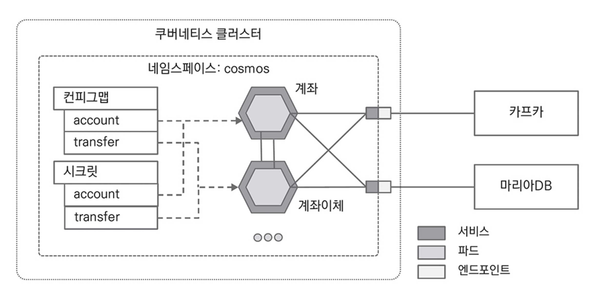

# CHAPTER 9. 클라우드 환경

가상화 그리고 컨테이너를 기반으로 애플리케이션을 관리하는 방식으로 진화
- 컨테이너를 직접 관리하고 확장해야 하는 한계를 보완하기 위해 컨테이너 오케스트레이션 도구가 등장
- 오케스트레이션 도구는 컨테이너의 배포, 관리, 확장뿐만 아니라 네트워킹까지 자동화

## 도커

> 도커는 리눅스 기반의 컨테이너 런타임 오픈소스

- `도커`는 버추얼 머신과 달리 하이퍼바이저 없이 호스트 운영 체제에서 직접 실행되므로 훨씬 가볍고 빠름

<figure><figcaption></figcaption></figure>

도커의 가장 큰 특징이자 장점은 컨테이너 `레지스트리`
- 컨테이너 이미지를 중앙 저장소에 저장한 후 다른 환경에서 다운로드해 사용 가능
- 컨테이너 이미지는 애플리케이션, 환경 정보 등 실행에 필요한 모든 설정을 포함

<figure><figcaption></figcaption></figure>

도커는 컨테이너 이미지를 생성 시 `Base Image`와 `Dockerfile`을 사용
- 실무에서는 이미 공개되어 있는 베이스 이미지에 사용할 프로그램을 설치하는 방식으로 사용

<figure><figcaption></figcaption></figure>

.

👉🏻 **도커 리소스 설정**
- 도커가 사용하는 프로세서와 메모리를 제한 가능

👉🏻 **Dockerfile**
- 운영 체제만 있는 베이스 이미지를 기반으로 JRE(Java Runtime Environment)와 서비스를 포함한 새로운 이미지를 만들 수 있음
- `Dockerfile`과 transfermoney 서비스

```bash
FROM adoptopenjdk/openjdk15:x86_64-tumbleweed-jre-15.0.2_7 # openjdk를 포함한 베이스 이미지
VOLUME / tmp
COPY target/transfermoney-1.0.0-SNAPSHOT.jar app.jar # jar 파일을 복사
# docker run 커맨드로 컨테이너 실행 시 java -jar 명령어로 서비스를 시작
ENTRYPOINT ["java", "-Duser.timezone='Asia/Seoul'",
                "-Djava.security.egd=file:/dev/./urandom", "-Xmx256m",
                "-jar", "/app.jar"] 
```

👉🏻 **이미지 생성**
- `docker build` 명령어로 컨테이너 이미지를 생성
- `-t` 옵션은 이미지에 이름을 부여
- `-f` 옵션은 이미지 생성에 사용할 Dockerfile 파일명

```bash
$ docker build -t cosmos/transfermoney:1.0.0 -f Dockerfile .
```

👉🏻 **도커 허브에 이미지 푸시**

```bash
$ docker login -u [ID] # 도커 허브 로그인
$ docker push cosmos/transfermoney:1.0.0 # 컨테이너 레지스트리인 도커 허브에 업로드
```

## 쿠버네티스

컨테이너 수가 증가할수록 관리가 힘들어지고, 설치 계획 수립과 배포할 서버가 필요
- 모니터링하면서 문제 발생 시 재시작하거나 Fail-over 같은 장애 상황에도 대응이 필요

### 쿠버네티스 구성 요소

<figure><figcaption></figcaption></figure>

👉🏻 **`Namespace`**

> 쿠버네티스 클러스터에서 `Pod`, `ConfigMap`, `Secret`, `Service` 같은 객체들을 논리적으로 분리하는 가상의 단위

👉🏻 **`Pod`**

> 쿠버네티스에서 생성해 관리하는 배포 단위로 컨테이너를 하나 이상 포함하는 그룹

- 파드를 직접 관리하는 경우는 드물도 `Deployment`를 주로 사용

👉🏻 **`ConfigMap`**

> key-value 쌍으로 데이터베이스 드라이버나 사용자와 비밀번호를 포함하지 않는 연결 정보와 같이 보호가 필요없는 데이터를 저장하는 데 사용

- 반대로 보호가 필요한 데이터는 `Secret`을 사용
- 아이디 비밀번호를 제외한 데이터베이스 연결 정보와 카프카 호스트 정보를 선언한 ConfigMap

```bash
apiVersion: v1 
kind: ConfigMap 
metadata:
    name: account
data:
    spring.profile: kubernetes
    datasource.url: jdbc:h2:mem: account
    datasource.driver.class.name: org.h2.Driver
    broker: broker:9092
```

👉🏻 **`Secret`**

> 일반적인 환경 설정 정보가 아닌 데이터베이스의 사용자와 비밀번호, API키 처럼 보안이 중요한 정보는 `Secret`을 사용

- `ConfigMap` 처럼 key-value 쌍으로 선언하지만 값을 BASE64로 인코딩하고 ConfigMap과 동일하게 디플로이먼트에서 파드의 환경 변수로 참조
- `kubectl create secret` 명령어로 시크릿 생성

```bash
### 커맨드로 시크릿 생성
$ echo -n 'usrnm' > datasource.username
$ echo -n 'usrpw' > datasource.password
$ kubectl create secret generic account --from-file=datasource.username --from-file=datasource.password -n cosmos

secret/account created

$ kubectl get secret account -n cosmos

NAME    TYPE    DATA    AGE
account Opaque  2       25s

### 시크릿 확인
$ kubectl get secret account -n cosmos -o yaml
```

- yml 파일로 시크릿 생성
  - 명령어로 생성할 때와 달리 BASE64로 인코딩한 값으로 파일을 생성해야 함

```yml
apiVersion: v1
kind: Secret
metadata:
    name: account
data:
    datasource.username: dXNybm0=
    datasource.password: dXNycHc=
```

- 시크릿 확인

```bash
$ kubectl apply -f secret.yml -n cosmos

secret/account created

$ kubectl get secret account -o yaml
```

## 이스티오

## 프로메테우스와 그라파나

## 키알리

## 요약
