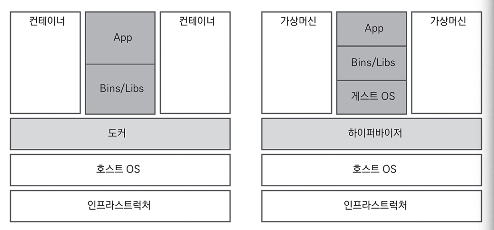
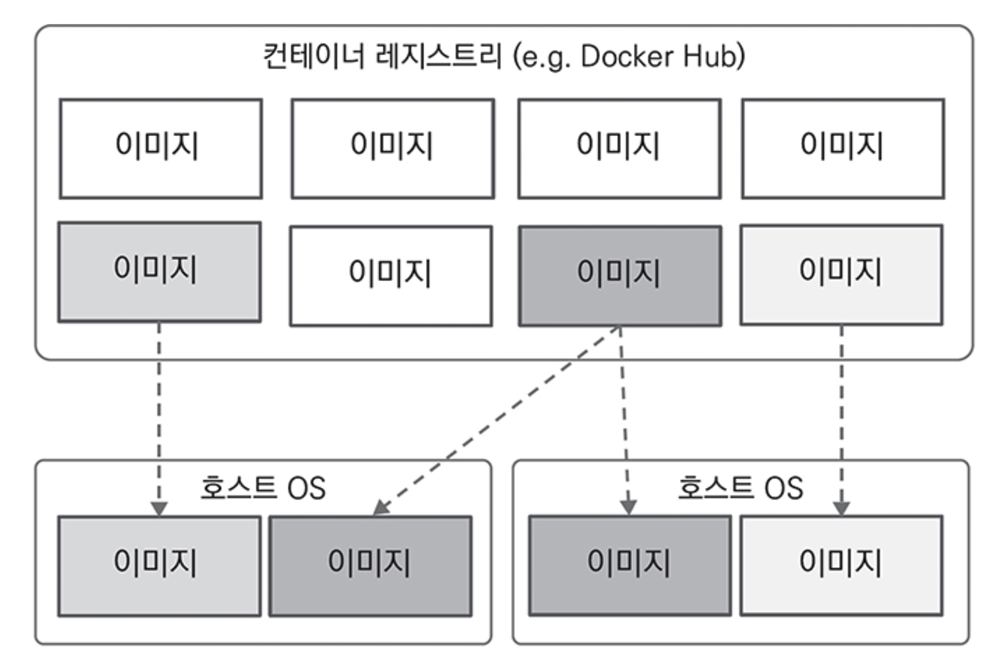
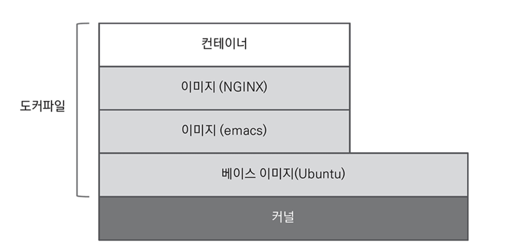

# CHAPTER 9. 클라우드 환경

가상화 그리고 컨테이너를 기반으로 애플리케이션을 관리하는 방식으로 진화
- 컨테이너를 직접 관리하고 확장해야 하는 한계를 보완하기 위해 컨테이너 오케스트레이션 도구가 등장
- 오케스트레이션 도구는 컨테이너의 배포, 관리, 확장뿐만 아니라 네트워킹까지 자동화

## 도커

> 도커는 리눅스 기반의 컨테이너 런타임 오픈소스

- `도커`는 버추얼 머신과 달리 하이퍼바이저 없이 호스트 운영 체제에서 직접 실행되므로 훨씬 가볍고 빠름

<figure><figcaption></figcaption></figure>

도커의 가장 큰 특징이자 장점은 컨테이너 `레지스트리`
- 컨테이너 이미지를 중앙 저장소에 저장한 후 다른 환경에서 다운로드해 사용 가능
- 컨테이너 이미지는 애플리케이션, 환경 정보 등 실행에 필요한 모든 설정을 포함

<figure><figcaption></figcaption></figure>

도커는 컨테이너 이미지를 생성 시 `Base Image`와 `Dockerfile`을 사용
- 실무에서는 이미 공개되어 있는 베이스 이미지에 사용할 프로그램을 설치하는 방식으로 사용

<figure><figcaption></figcaption></figure>

.

👉🏻 **도커 리소스 설정**
- 도커가 사용하는 프로세서와 메모리를 제한 가능

👉🏻 **Dockerfile**
- 운영 체제만 있는 베이스 이미지를 기반으로 JRE(Java Runtime Environment)와 서비스를 포함한 새로운 이미지를 만들 수 있음
- Dockerfile과 transfermoney 서비스

```bash
FROM adoptopenjdk/openjdk15:x86_64-tumbleweed-jre-15.0.2_7 # openjdk를 포함한 베이스 이미지
VOLUME / tmp
COPY target/transfermoney-1.0.0-SNAPSHOT.jar app.jar # jar 파일을 복사
# docker run 커맨드로 컨테이너 실행 시 java -jar 명령어로 서비스를 시작
ENTRYPOINT ["java", "-Duser.timezone='Asia/Seoul'",
                "-Djava.security.egd=file:/dev/./urandom", "-Xmx256m",
                "-jar", "/app.jar"] 
```

## 쿠버네티스

## 쿠버네티스 구성 요소

## 이스티오

## 프로메테우스와 그라파나

## 키알리

## 요약
