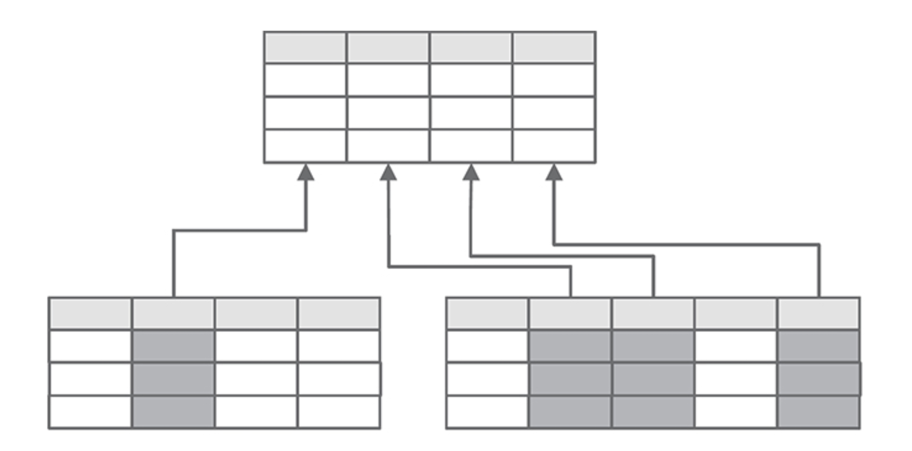
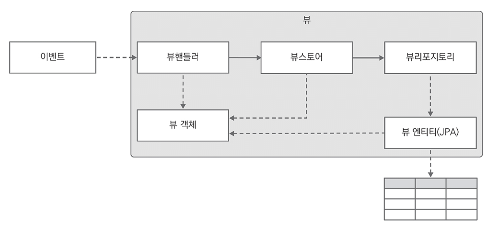
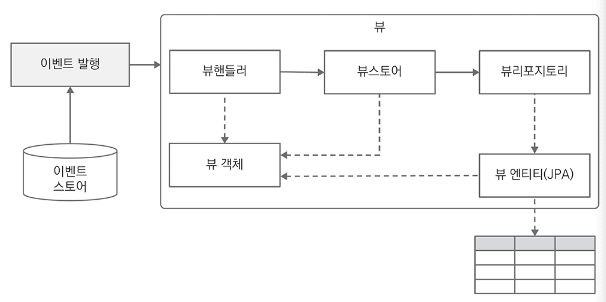
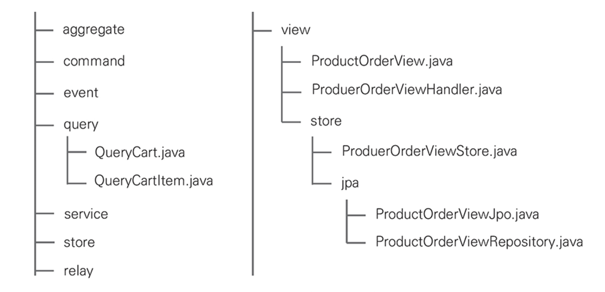
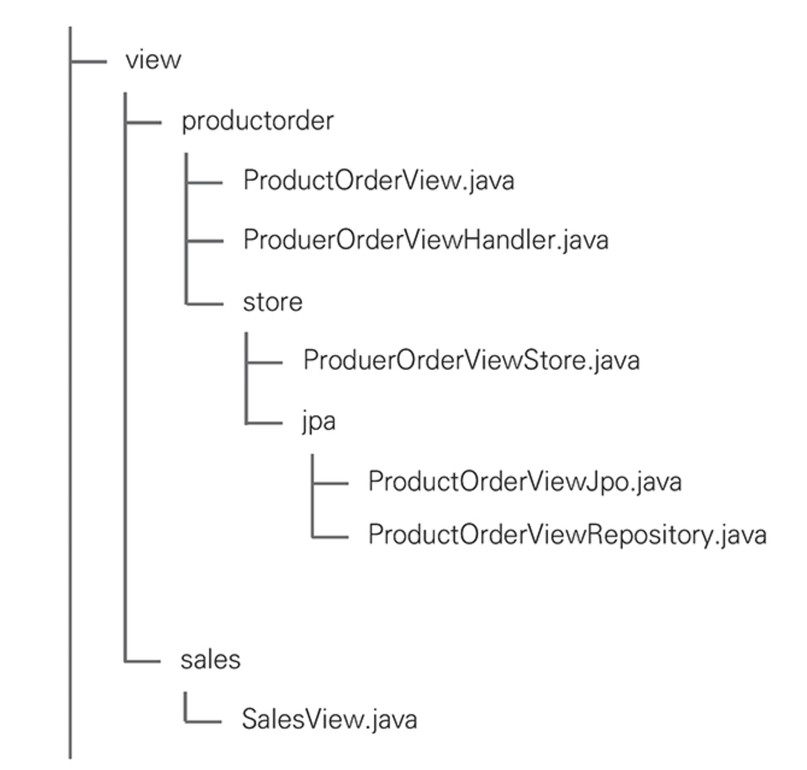
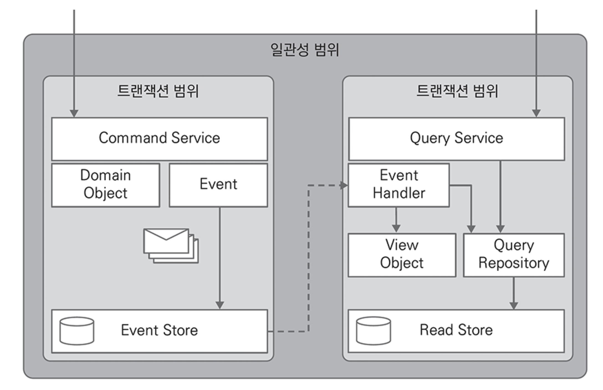

# CHAPTER 7. 명령과 조회 책임 분리(CQRS)

복잡한 조건으로 `필터링`하거나 다양한 `집계` 요구사항을 충족시키는 방법으로 명령과 조회 책임 분리(CQRS)를 사용할 수 있다.
- 이벤트 소싱을 사용한 시스템에서 CQRS는 선택이 아닌 필수
- CQRS는 현재 상태만 기록하는 시스템에서도 유용하게 활용 가능

## 명령과 조회 책임 분리

`CQS`는 객체가 제공하는 메소들르 객체의 상태를 변경하는 `커맨드`와 상태를 반환하는 `쿼리`로 구분

**CQS and CQRS**

<figure><figcaption></figcaption></figure>

- `CQRS`는 많은 테이블 조인을 피하기 위해 조회에 최적화시킨 테이블을 분리해서 설계하고 커맨드 처리를 완료한 후 발행한 도메인 이벤트에서 필요한 속성을 복사해 조회 전용 테이블에 한번 더 CUD를 실행

## 구체화된 뷰와 이벤트 핸들러

뷰가 논리적인 테이블인 반면 구체화된 뷰(Materialized View)는 물리적으로 존재하는 테이블
- 구체화된 뷰는 주로 복잡한 조인과 같이 많은 비용이 디는 데이터를 조회할 때 사용
- 구체화된 뷰를 생성할 때 AVG, SUM, COUNT 같은 집계 함수를 사용해 다양한 조건을 사용 가능

<figure><figcaption></figcaption></figure>

.

**뷰와 구체화된 뷰의 특징과 차이점**

`뷰`
- **뷰**는 미리 네이밍한 쿼리로 어떤 것도 추가 저장 불가
- **뷰**에 질의하면 뷰 정의에 기반해 실제 테이블의 데이터 조회
- **뷰**는 테이블 쿼리보다 느림
- 원래의 복잡한 쿼리문은 **뷰** 정의로 이동할 뿐 유지보수 비용은 감소하지 않음

`구체화된 뷰`
- **구체화된 뷰**는 물리적으로 데이터를 저장하고 주기적으로 갱신
- **구체화된 뷰**에 질의하면 구체화된 뷰의 데이터를 반환
- JSON을 포함해 다양한 조건의 SELECT 쿼리를 위한 빠른 성능을 제공
- 쿼리 옵티마이저가 실행 계획을 수립할 때 더 빠른 방법을 선택

.

**CQRS 핵심 객체와 의존성**
- 구체화된 뷰를 생성하기 위해 필요한 구성 요소간 관계

<figure><figcaption></figcaption></figure>

- 애그리게이트가 도메인 이벤트를 발행하면 이벤트 핸들러가 이벤트에 반응해 뷰 객체로 변환
- ViewStore는 뷰 객체를 구체화된 뷰 테이블과 매핑한 JPA 엔티티 객체로 변환해 데이터베이스에 저장
- 조회 목적에 따라 개별 테이블로 분리해 설계하거나 동일 조회 조건을 가진 여러 뷰 클래스를 하나의 테이블로 통합 가능

.

**상품 판매량 뷰**

주문 애그리게이트가 요청을 처리하고 메시지 릴레이가 OrderCompleted 도메인 이벤트를 발행
- OrderCompleted 이벤트에 반응하는 ProductOrderViewHandler는 상품별 판매 수량 속성을 포함하는 ProductORderView를 생성하고 데이터베이스에 저장

반대로 주문을 취소하면 해당 상품 판매량 뷰를 삭제
- ProductOrderViewHandler는 OrderCanceled 이벤트에 반응해 OrderNo로 뷰 테이블의 레코드를 찾아 삭제

.

**상담사 일일 총 통화시간 뷰**
- 통화를 시작하면 BeginCall 커맨드를 파라미터로 받는 생성자를 호출
- 생성자는 Talktime 값 객체를 생성하면서 현재 시각을 start 값으로 할당
- 통화를 종료하면 end 메소드를 호출하고 Talktime의 end에 현재 시각을 할당하면서 통화시간을 계산해 CallEnded 이벤트에 포함
- 조회 요청에 단순 SELECT만 사용하므로 백엔드나 데이터베이스에 큰 부하가 없음
- 반대로 전화 상담사가 통화 종료 시 조회 전용 테이블을 업데이트하는 데 사용하는 비용을 개선해야 할 대상
  - 이는 메시지 브로커에 도메인 이벤트를 발행해서 비동기로 처리하면 두 기능의 실행 시간을 분리 가능

## 뷰 조회

> 조회를 위한 클래스는 접두어로 Query를 사용

```kotlin
@RestController
@RequestMapping("/cart")
class CartEndpoint(
    private val httpSession: HttpSession,
    private val cartService: CartService,
    private val cartViewStore: CartViewStore
) {

    @GetMapping(headers = ["query=QueryCart"])
    fun queryCart(): Cart {
        return cartService.queryCart()
    }

    @GetMapping(headers = ["query=QueryCartItem"])
    fun queryItem(@RequestParam itemId: String): ItemView {
        val userId = httpSession.getAttribute("userId")?.toString() ?: throw IllegalStateException("User not logged in")
        val query = QueryCartItem(userId, itemId)
        return cartViewStore.queryItem(query)
    }
}
```

## 뷰 복원

조회 전용 데이터를 삭제해도 이벤트 스토어에 모든 도메인 이벤트가 저장되어 있으므로 필요 시 다시 조회 전용 데이터를 생성 가능
- ViewRecover가 이벤트 저장소에서 도메인 이벤트 조회 후 이벤트 핸들러에 전달해 실수로 삭제한 쿠체화된 뷰를 다시 생성

<figure><figcaption></figcaption></figure>

## 마이크로서비스 모듈

CQRS를 적용한 마이크로서비스의 모듈은 view
- `view` 패키지는 조회 전용 데이터를 생성하거나 변경하는 데 필요한 모든 클래스를 포함
- 조회를 위한 클래스는 `query` 패키지에 위치

<figure><figcaption></figcaption></figure>

마이크로서비스에서 여러 개의 뷰를 만들어야 한다면 view 하위 패키지에 추가하여 구분

<figure><figcaption></figcaption></figure>

## CQRS 활용 사례

이벤트 주도 아키텍처는 이벤트를 활용해 **서비스 간의 의존성을 최소화**해 **느슨하게 결합한 시스템**을 구축할 수 있게 한다.
- 마이크로서비스 아키텍처에서 이벤트를 적극적으로 도입하면 다양한 조회 기능의 추가/변경이 자유로워 확장성을 높이면서 독립적인 개선이 가능

## 이벤트 소싱과 뷰 일관성

**CQRS 이벤트 핸들러와 트랜잭션 분리**
- 이벤트 소싱에서 비즈니스 로직은 애그리게이트가 처리하고 테이블들을 조인해 조회하는 책임을 CQRS로 분리
- CQRS에서 조회 전용 데이터를 조작하는 이벤트 핸들러는 원칙적으로 비동기로 반응해야 함

<figure><figcaption></figcaption></figure>

**CQRS 이벤트 핸들러와 트랜잭션 통합**
- 한 트랜잭션으로 일관성을 보장하기 위해 이벤트 핸들러를 사용하는 방법
- 이벤트 핸들러가 하나의 트랜잭션에서 처리됨을 보장
- 단, 한 트랜잭션 처리를 보장하기 위해 단일 마이크로서비스에서만 사용할 수 있는 단점

## 요약



이벤트 소싱을 적용한 시스템에서 CQRS를 이용해 복잡한 조회를 지원하는 방법

- 관계형 데이터베이스에서 사용할 수 있는 뷰와 **구체화된 뷰**
- 도메인 이벤트에 반응해 **구체화된 뷰에서 조회 전용 데이터를 비동기로** 생성 가능
- 단순 조회용에서 시작해 복잡한 계산 결과까지 CQRS를 활용
- 구체화된 뷰에서 데이터를 생성하거나 변경하는 것은 **비동기 방식**을 사용하지만, 필요에 따라 단일 트랜잭션으로 **구체화된 뷰**를 생성
- **CQRS**를 활용하면 기존 서비스 수정 없이 새로운 서비스를 추가하면서 다양한 데이터 생성 가능

