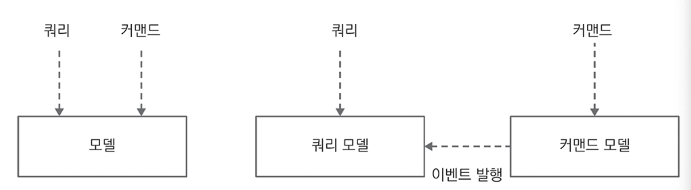

# CHAPTER 7. 명령과 조회 책임 분리(CQRS)

복잡한 조건으로 `필터링`하거나 다양한 `집계` 요구사항을 충족시키는 방법으로 명령과 조회 책임 분리(CQRS)를 사용할 수 있다.
- 이벤트 소싱을 사용한 시스템에서 CQRS는 선택이 아닌 필수
- CQRS는 현재 상태만 기록하는 시스템에서도 유용하게 활용 가능

## 명령과 조회 책임 분리

`CQS`는 객체가 제공하는 메소들르 객체의 상태를 변경하는 `커맨드`와 상태를 반환하는 `쿼리`로 구분

**CQS and CQRS**

<figure><figcaption></figcaption></figure>

- `CQRS`는 많은 테이블 조인을 피하기 위해 조회에 최적화시킨 테이블을 분리해서 설계하고 커맨드 처리를 완료한 후 발행한 도메인 이벤트에서 필요한 속성을 복사해 조회 전용 테이블에 한번 더 CUD를 실행

## 구체화된 뷰와 이벤트 핸들러

## 뷰 조회

## CQRS와 RESTful API

## 뷰 복원

## 마이크로서비스 모듈

## CQRS 활용 사례

## 이벤트 소싱과 뷰 일관성

## 요약
