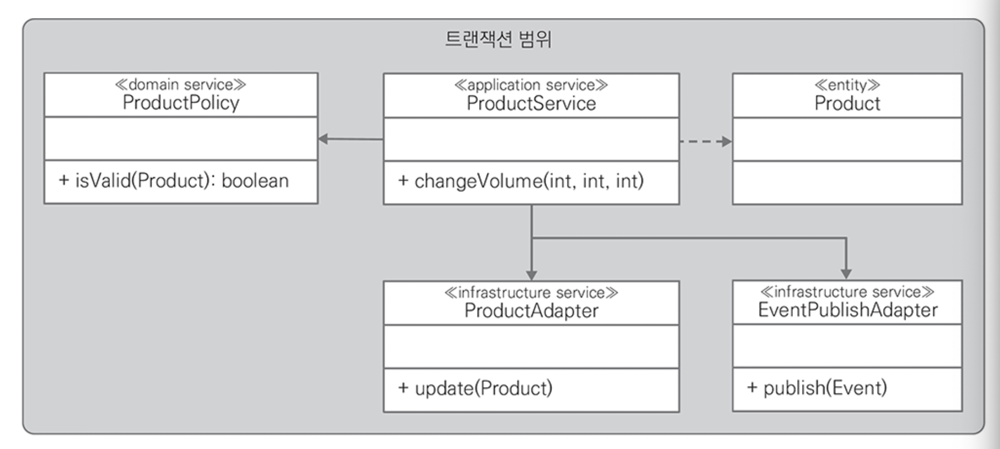
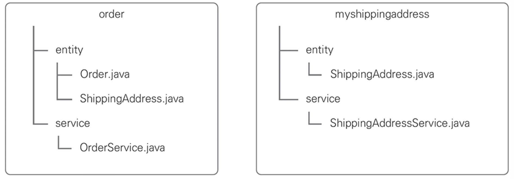
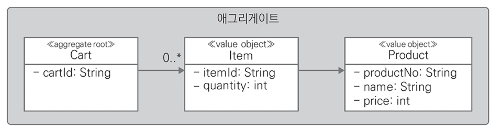
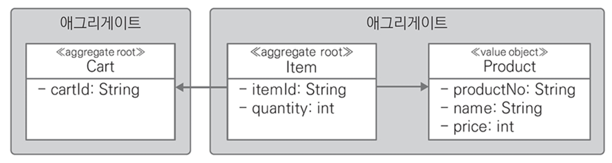
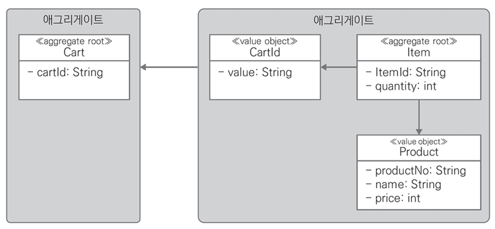
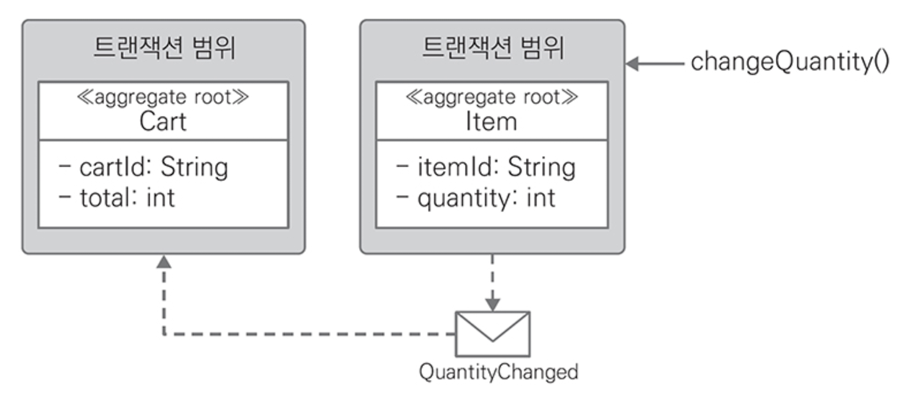

# CHAPTER 1. 도메인 주도 설계

> 소프트웨어에서 모델은 해결해야 하는 문제를 바라보는 다양한 관심사 중 하나를 선택해서 문제를 설명하는데 꼭 필요한 것만 표현해야 한다.

## **도메인 로직 패턴**
- 소프트웨어에서 도메인 로직을 어디에 두는게 좋은가?



**도메인 로직을 구현하는 패턴에 대한 자세한 설명**

[Catalog of Patterns of Enterprise Application Architecture](https://martinfowler.com/eaaCatalog/)
- 메인 주도 설계에서 하위 도메인 분류(핵심/지원/일반 하위 도메인)를 마이크로서비스로 구현할 때 어떤 패턴을 사용할지 결정하는데 도움



1️⃣ **트랜잭션 스크립트 패턴**

- 클라이언트가 요청한 비즈니스 로직을 하나의 프로시저가 모두 처리
- 비즈니스 애플리케이션이 제공하는 기능 대부분을 반복적인 CRUD로 처리할 수 있는 경우 적합
- 서블릿과 JSP가 대표적인 사례

2️⃣ **테이블 모듈 패턴**

- 테이블 모듈은 **데이터베이스 테이블 단위로 비즈니스 로직을 처리**하는 클래스를 분리

3️⃣ **서비스 레이어 패턴**

- 서비스 레이어로 부르는 독립된 클래스에 **시스템 통합**과 **전체 흐름을 조정**하는 책임을 부여
- 현대 소프트웨어에서 가장 많이 사용하는 패턴
- 서비스 레이어는 **비즈니스 로직**뿐 아니라 **로깅, 권한 체크** 등과 같은 **공통 기능**을 구현
- 서비스 레이어의 책임은 **여러 리소스간 통합**과 **통합 결과에 따른 흐름 조정**처럼 여러 책임을 가져 복잡도가 증가

4️⃣ **도메인 모델 패턴**

- 데이터와 행위를 하나의 객체로 설계
- 다양한 규칙과 논리의 복잡한 관계를 **여러 객체에 분산**시키고 객체간 협력으로 구현
- 서비스 레이어는 도메인 객체에 명령을 전달하기 위한 준비 흐름만 있고, 도메인 객체가 제한을 하는 규칙을 검사

```kotlin
class CartService {
    fun addItem(cartId: String, 
                productNo: String, 
                productName: String, 
                quantity: Int) {
        val foundCart = cartDao.select(cartId)
        foundCart.addItem(productNo, productName, quantity)
        cartDao.update(foundCart)
    }
}

...

class Cart {
    private val items: MutableList<Item> = mutableListOf()

    fun addItem(productNo: String, productName: String, quantity: Int) {
        if (items.size >= 10) {
            throw ItemLimitExceedException()
        }
        items.add(Item(cartId, productNo, productName, quantity))
    }
}
```

.

## 핵사고날 아키텍처

- 기술과 관계없는 비즈니스 로직과 기술에 의존하는 구성 요소인 어댑터 간 분리를 강조
  - 기술에 의존하는 어댑터는 **외부 요청을 수신해 비즈니스 로직을 시작**시키는 `인바운드 어댑터`
  - 비즈니스 로직을 실행하면서 **영구 저장소에 데이터를 저장하거나 다른 시스템과 협력**하는 `아웃바운드 어댑터`

.

## 도메인 주도 설계

도메인 주도 설계는 관심사를 바운디드 컨텍스트(BC)로 한정하고 BC 간 관계와 BC 내에서 효과적인 모델링을 위한 실용적인 접근법

1️⃣ **유비쿼터스 언어**

- 개발 프로세스나 방법론에서 말하는 용어집과 유사
- 비즈니스 전문가와의 대화에서 이 언어를 적극 사용 강조

2️⃣ **빌딩 블록**

- 빌딩 블록간 전형적인 호출 흐름
  1. 어댑터는 애플리케이션 서비스로 요청을 전달
  2. 애플리케이션 서비스는 리포지토리에 데이터 조회 요청
  3. 리포지토리는 데이터베이스에서 조회한 결과를 도메인 객체로 변환해 반환
  4. 애플리케이션은 다시 도메인 객체에 요청을 전달해 비즈니스 로직을 수행
  5. 도메인 객체가 비즈니스 로직을 처리하면 애플리케이션 서비스는 리포지토리를 사용해 결과를 다시 데이터베이스에 저장
  6. 애플리케이션 서비스는 비즈니스 로직 흐름 전반에 걸쳐 아웃바운드 어댑터를 이용해 부가적인 정보를 획득하거나 비즈니스 로직의 수행 완료를 외부에 전달

3️⃣ **엔티티**

- 엔티티에서는 식별성이 중요
- 어떤 클래스의 인스턴스를 시스템의 `다른 인스턴스와 구분`해야 하면 이 클래스를 엔티티로 설계

4️⃣ **값 객체**

- 일반적으로 식별자가 없는 다른 객체를 수식하기 위해 존재
- 엔티티 뿐 아니라 다른 값 객체를 수식하기도 함
- 가장 중요한 특징은 `불변`
  - 값 객체는 원칙적으로 불변이지만 특별한 상황에서는 setter를 이용한 변경을 허용
    - 값이 자주 변경돼 메모리를 효율적으로 사용하지 못하는 경우
    - 객체 생성이나 삭제에 많은 비용이 드는 경우
    - 교체로 인해 클러스트링이 제한되는 경우
    - 값을 공유할 일이 많지 않거나 클러스터링을 향상시키기 위해 또는 다른 기술적인 이유로 공유가 보류된 경우
- 값 객체에 직접 접근해서 속성을 변경하지 않고, 엔티티를 통해서만 변경 가능
  - 엔티티 객체가 제공하는 메소드를 사용해 값 객체를 변경
- 도메인 객체에 비즈니스 규칙을 구현하는 것은 중요
  - 코드 중복, 응집도, 유지보수에 도움을 주고 다른 클래스에 의존하지 않고 테스트가 가능

5️⃣ **서비스**

> 에릭 에반스는 도메인 주도 설계에서 서비스를 세 가지로 분류

**인프라스트럭처 서비스**

- 핵사고날 아키텍처에서 정의한 어댑터
- 어댑터는 데이터베이스, 네트워크를 통해 다른 시스템이 제공하는 API 호출, 메일 보내기, 이벤트 발행처럼 기술적인 문제를 다룸

**애플리케이션 서비스**

- 트랜잭션 관리, 인프라스트럭처와 상호 작용을 포함한 비즈니스 유스케이스의 흐름을 조정하는 두 개의 책임을 가짐
  - 첫 번째, 클라이언트 요청부터 응답까지를 하나의 트랜잭션으로 처리하는 것
  - 두 번째, 비즈니스 유스케이스를 수행하는 일련의 흐름 조정

  <center></center>

  애플리케이션 서비스가 비즈니스 유스케이스 흐름을 조정핳기 위해 엔티티, 도메인 서비스, 인프라스트럭처 서비스간 의존성

**도메인 서비스**

- 에릭 에반스 '엔티티에 부여하기 적합하지 않은 책임을 도메인 서비스에 부여하라'
- 도메인을 위해 존재하는 객체
- 도메인 서비스를 사용할 때 고려할 세 가지 휴리스틱
  - (1) 중요한 비즈니스 프로세스를 수행할 때

    ```kotlin
    class ProductService {
        private val productAdaptor: ProductAdaptor? = null
        private val eventPublishAdapter: EventPublishAdapter? = null

        @Transactional
        fun createProduct(name: String?) {
            val product: Product = Product(name)
            // 도메인 서비스에서 사전 조건을 검사
            val policy: ProductCreationPolicy = ProductCreationPolicy()
            if (!policy.isValid(product)) {
                throw InvalidPRoductPolicyException()
            }

            productAdaptor.insert(product)
            eventPublishAdapter.publish(PRoductCreated(product))
        }
    }

    ...

    class ProductCreationPolicy {
        fun isValid(product: Product?): Boolean {
            // 비즈니스 규칙
            return true;
        }
    }
    ```

  - (2) 어떤 컴포지션에서 다른 컴포지션으로 도메인 객체를 변환할 때
    - 특정 도메인 객체를 사용하기 위해 다른 도메인 객체나 데이터 전송 객체로 변환하거나 반대로 데이터 전송 객체를 도메인 객체로 변환하는 데 사용
    - 도메인 객체에 전달할 목적으로 무엇인가를 계산
  
  - (3) 하나 이상의 도메인 객체에서 요구하는 입력 값을 계산할 때
    - 도메인 객체에 전달할 목적으로 무엇인가를 계산하는 것

6️⃣ **모듈**

> 인지적 과부화(cognitive overload): 정보를 나누고 분류해 빠르게 찾을 수 있도록 조직화하는것

<center></center>

.

## 라이프사이클

1️⃣ **애그리게이트**

> 도메인 객체들의 연관 관계에서 불변식을 보장해야 하는 단위

- 엔티티와 값 객체로 구성하는데 여러 개의 엔티티와 값 객체를 포함할 수 있으며, 애그리게이트를 대표하는 엔티티를 `애그리게이트 루트`라고 함
- 애그리게이트 루트를 통해서만 애그리게이트의 상태를 변경

```kotlin
class CartService {
    private val productDao: ProductDao? = null
    private val cartDao: CartDao? = null

    fun addItem(cartId: String?, productNo: String?, quantity: Int) {
        val foundCart: Cart = cartDao.retrieve(cartId)
        val product: Product = productDao.retrieve(productNo)

        foundCart.addItem(product, quantity)
        cartDao.update(foundCart)
    }

    fun removeltem(cartId: String?, productNo: String?) {
        val foundCart: Cart = cartDao.retrieve(cartId)

        foundCart.removeItem(productNo)
        cartDao.update(foundCart)
    }

    fun changeQuantity(cartId: String?, productNo: String?, quantity: Int) {
        val foundCart: Cart = cartDao.retrieve(cartId)
        
        foundCart.changeQuantity(productNo, quantity)
        cartDao.update(foundCart)
    }
}
```

- 각 메소드는 인프라스트럭처 서비스를 이용해 요청을 전달할 대상인 애그리게이트(Cart)를 데이터베이스에서 조회
- 조회 후 애그리게이트(Cart)에 요청을 전달하고, 명령을 처리하면 다시 인프라스트럭처 서비스를 호출해 최종 상태를 저장

3️⃣ **애그리게이트 설계 원칙**

> 반 버논의 도메인 주도 설계 구현에서 애그리게이트 설계에 적용할 수 있는 4가지 휴리스틱
>
> <https://www.dddcommunity.org/library/vernon_2011/>

- 규칙 #1. 비즈니스 불변식을 애그리게이트로 한정
  - 불변식은 다른 식별자를 가진 애그리게이트와 독립적으로 유지되고 데이터베이스에 저장되어야 하므로 트랙잭션 범위나 일관성 범위라 부름
  
  <center></center>

- 규칙 #2. 작은 애그리게이트로 설계
  
  <center></center>

- 규칙 #3. 다른 애그리게이트는 식별자로 참조
  
  <center></center>

- 규칙 #4. 애그리게이트간 변화는 결과적 일관성을 이용
  - 이벤트를 활용한 결과적 일관성은 비즈니스 프로세스를 시스템 전체가 아닌 애그리게이트로 한정하는 효과가 있어 애플리케이션 서비스를 훨씬 단순하게 구현 가능

  <center></center>



4️⃣ 팩토리

> 애그리게이트를 생성하는 방법이 복잡하거나 내부를 너무 많이 드러내는 경우 팩토리를 이용해 캡슐화

**복잡한 객체와 애그리게이트의 인스턴스를 생성하는 책임을 별도의 객체로 옮겨라.**
- 이 객체 자체는 도메인 모델에서 아무런 책임도 맡지 않을 수도 있지만 여전히 도메인 설계의 일부를 구성한다.

모든 복잡한 객체 조립 과정을 캡슐화하는 동시에 클라이언트가 인스턴스화되는 개체**의 구체 클래스를 참조할 필요가 없는 인터페이스를 제공하라.**
- 전체 애그리게이트를 하나의 단위로 생성해서 그것의 불변식이 유지되게 하라.

[에릭 에반스]



팩토리와 전용 클래스

```kotlin
class CartFactory {
    private val userDao: UserDao? = null
    private val limitDao: LimitDao? = null

    fun createCart(userId: String?): Cart {
        val foundUser: User = userDao.select(userId)
        val foundLimit: Limit = limitDao.select(foundUser.getGrade())
        return Cart(userId, foundLimit)
    }
}
```

5️⃣ 리포지토리

> 리포지토리는 마이바티스나 JPA 같은 라이브러리 또는 프레임워크를 이용할 때 애그리게이트 단위로 기능을 제공

리포지토리가 제공하는 메소드는 애그리게이트 단위로 제공하면서 하나의 트랜잭션으로 처리해야 한다.

```kotlin
class CartRepository {
    fun create(cart: Cart) {
        // Cart - Item - Product 연관관계를 한번에 저장
    }
    
    fun retrieve(cartID: String) {
        // Cart - Items - Product 연관관계를 한번에 조회
    }
    
    fun update(cart: Cart) {
        // Cart - Items - Product 연관관계를 한번에 변경
    }
    
    fun delete(cartId: String) {
        // Cart에 포함된 Items, Product도 함께 삭제
    }
}
```

## 요약



- 비즈니스 로직은 트랜잭션 스크립트, 테이블 모듈, 서비스 레이어, 도메인 모델 패턴으로 구현 가능
- 비즈니스 로직이 복잡하고 객체지향 언어를 사용하면 도메인 모델 패턴을 우선적으로 고려
- 도메인 주도 설계에서 기본 설계 요소인 빌딩 블록
- 엔티티가 식별자를 가지는 반면 값 객체는 식별자를 가지지 않고 엔티티를 수식하는 속성의 그룹
- 서비스는 외부 시스템과 협력하는 인프라스트럭처 서비스, 트랜잭션 범위를 한정하는 애플리케이션 서비스 그리고 순수 비즈니스 로직을 담으면서 무상태 클래스인 도메인 서비스로 분류
- 애그리게이트는 도메인의 불변식을 유지하는 단위로 여러 개의 엔티티와 값 객체로 구성
- 애그리게이트의 대표 엔티티를 애그리게이트 루트
- 애그리게이트의 모든 요청은 애그리게이트 루트가 제공하는 메소드 호출로 시작
- 반 버논이 제시한 애그리게이트 설계 경험 법칙 4가지
- 팩토리는 도메인 객체나 전용 팩토리 클래스 사용 가능
- 리포지토리는 애그리게이트 단위로 일관성을 보장하는 CRUD 오퍼레이션을 제공
- 도메인을 더 깊게 이해할수록 추상 클래스와 인터페이스를 활용해 도메인의 핵심을 표현 가능

