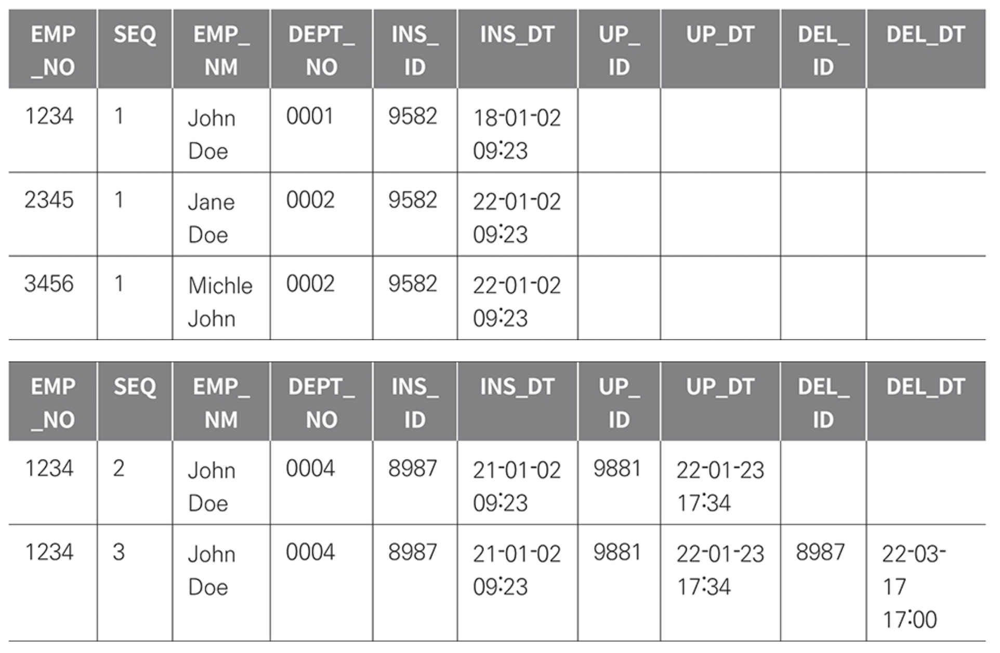
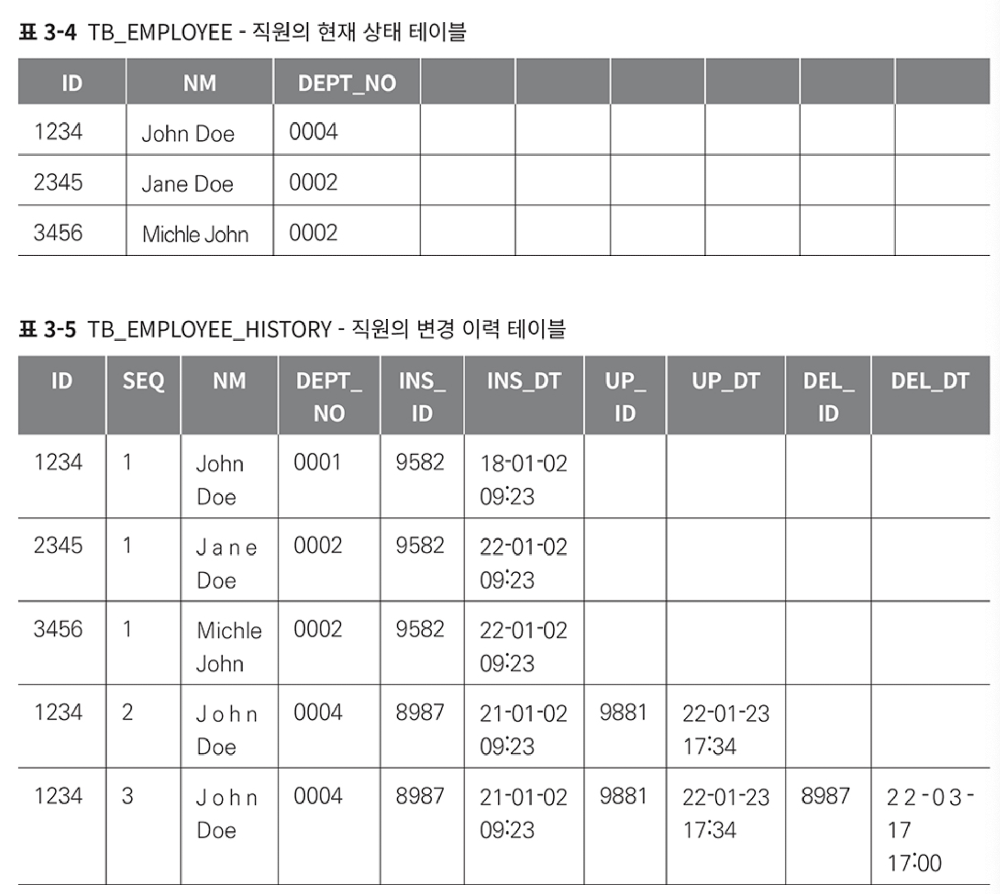
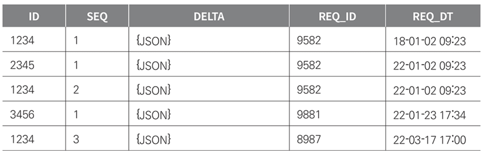
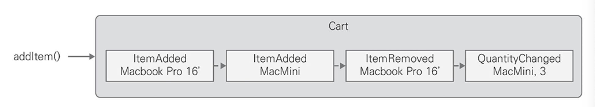

# CHAPTER 3. 이벤트 소싱 I

> 데이터의 상태 변화 과정을 기록해야 하는 요구사항에서 이벤트 소싱을 적용할 수 있다.

## 감사와 이력

> 변경 사항을 기록하기 위해 이전 상태를 분리해서 기록해 둔 후 필요할 때 현제 상태와 비교하기 위한 방법

### 단일 테이블과 시퀀스

첫 번째 방법으로 TB_EMPLOYEE 테이블 식별자인 EMP_NO 외에 일련변호를 추가하고, 변경해야 할 때 기존 레코드를 유지하고 일련번호를 증가시켜 새로운 레코드를 추가하기.
- 일련번호 대신 시간으로 사용 가능

<figure><figcaption></figcaption></figure>

1. 현재 상태의 마지막 일련번호 조회
2. 일련번호 값 증가
3. 파라미터 employee에 새로운 일련번호 할당
4. employeeDao를 사용해 최종 상태를 새로운 레코드로 추가

### 상태 테이블과 이력 테이블

두 번째 방법으로 현재 상태를 가진 TB_EMPLOYEE 테이블과 이력을 기록하는 TB_EMPLOYEE_HISTORY 테이블로 분리
- 기록 테이블은 현재 상태를 가진 테이블과 동일한 컬럼을 구성하고
- 단일 테이블-시퀀스 방법과 동일하게 상태 변화 순서를 구별하기 위해 일련번호를 추가

<figure><figcaption></figcaption></figure>

1. 직원 정보와 직원 정보 이력에서 일련번호 조회
2. 이력 일련번호 증가
3. 저장 단계에서 변경 이전 직원 상태를 이력 테이블에 추가
4. 직원의 새로운 상태를 테이블에 저장

### 변경 값

세 번째 방법은 변경한 속성 이름과 값의 목록만 기록하기
- 전체 복사본이 아닌 변경한 속성만 선택해 기록하면 변경 속성을 찾기 위해 모든 속성의 값을 비교할 필요도 없고 데이터베이스도 효과적으로 사용 가능

<figure><figcaption></figcaption></figure>

1. 서비스는 애그리게이트가 제공하는 메소드를 호출
2. 영향을 받은 속성 목록을 반환
3. 리포지토리가 제공하는 삽입 메소드에 전달

## 도메인 이벤트

> 도메인 주도 설계는 '도메인 이벤트'를 강조

변경 값을 기록하는 것은 같지만 변경의 단위를 비즈니스 처리 과정에서 발생한 결과로 정의
- 이벤트는 사용자가 무엇인가 처리하도록 시스템에 요청한 것임을 알 수 있는 힌트이면서 변경이 발생한 이유
- 시스템이 관리하는 정보의 변화를 도메인 이벤트로 기록하면 도메인 모델을 더욱 명확하게 표현 가능
- `Map<String, String>`과 같은 일반적인 객체 대신 `PasswordChanged`라는 이벤트 클래스로 정의

이벤트 클래스를 사용하면 클래스 이름만으로 도메인에서 어떤 일이 일어났는지 즉시 이해할 수 있다.

## 이벤트 소싱

> 이벤트 소싱은 도메인에서 발생하는 이벤트를 시스템의 상태 변화로 간주
>
> 불변식 유지 단위인 애그리게이트에서 발생한 모든 이벤트를 데이터베이스에 기록

<figure><figcaption></figcaption></figure>

애그리게이트를 저장하는 리포지토리와 애그리게이트에서 발생한 이벤트를 데이터베이스에 저장하는 것 또한 원자적이어야 하고, 일련의 흐름을 하나의 트랜잭션으로 처리해야 한다.

## 이벤트 소싱 구현

## 마이크로서비스 모듈

## 이벤트 소싱과 단위 테스트

## 요약