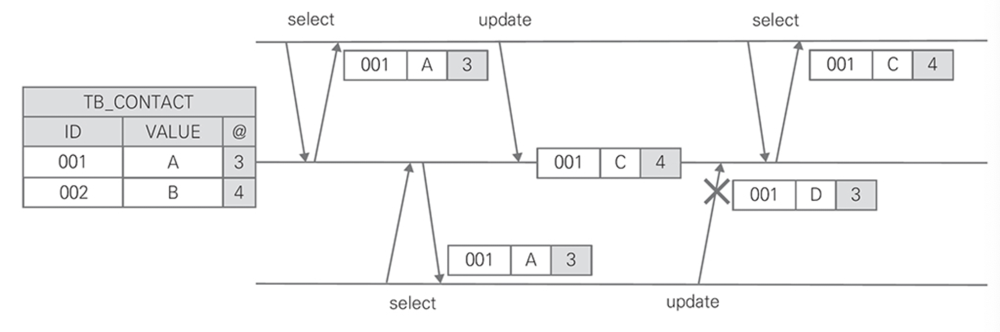

# CHAPTER 3. 이벤트 소싱 I

> 데이터의 상태 변화 과정을 기록해야 하는 요구사항에서 이벤트 소싱을 적용할 수 있다.

## 감사와 이력

> 변경 사항을 기록하기 위해 이전 상태를 분리해서 기록해 둔 후 필요할 때 현제 상태와 비교하기 위한 방법

### 단일 테이블과 시퀀스

첫 번째 방법으로 TB_EMPLOYEE 테이블 식별자인 EMP_NO 외에 일련변호를 추가하고, 변경해야 할 때 기존 레코드를 유지하고 일련번호를 증가시켜 새로운 레코드를 추가하기.
- 일련번호 대신 시간으로 사용 가능

<figure><figcaption></figcaption></figure>

1. 현재 상태의 마지막 일련번호 조회
2. 일련번호 값 증가
3. 파라미터 employee에 새로운 일련번호 할당
4. employeeDao를 사용해 최종 상태를 새로운 레코드로 추가

### 상태 테이블과 이력 테이블

두 번째 방법으로 현재 상태를 가진 TB_EMPLOYEE 테이블과 이력을 기록하는 TB_EMPLOYEE_HISTORY 테이블로 분리
- 기록 테이블은 현재 상태를 가진 테이블과 동일한 컬럼을 구성하고
- 단일 테이블-시퀀스 방법과 동일하게 상태 변화 순서를 구별하기 위해 일련번호를 추가

<figure><figcaption></figcaption></figure>

1. 직원 정보와 직원 정보 이력에서 일련번호 조회
2. 이력 일련번호 증가
3. 저장 단계에서 변경 이전 직원 상태를 이력 테이블에 추가
4. 직원의 새로운 상태를 테이블에 저장

### 변경 값

세 번째 방법은 변경한 속성 이름과 값의 목록만 기록하기
- 전체 복사본이 아닌 변경한 속성만 선택해 기록하면 변경 속성을 찾기 위해 모든 속성의 값을 비교할 필요도 없고 데이터베이스도 효과적으로 사용 가능

<figure><figcaption></figcaption></figure>

1. 서비스는 애그리게이트가 제공하는 메소드를 호출
2. 영향을 받은 속성 목록을 반환
3. 리포지토리가 제공하는 삽입 메소드에 전달

## 도메인 이벤트

> 도메인 주도 설계는 '도메인 이벤트'를 강조

변경 값을 기록하는 것은 같지만 변경의 단위를 비즈니스 처리 과정에서 발생한 결과로 정의
- 이벤트는 사용자가 무엇인가 처리하도록 시스템에 요청한 것임을 알 수 있는 힌트이면서 변경이 발생한 이유
- 시스템이 관리하는 정보의 변화를 도메인 이벤트로 기록하면 도메인 모델을 더욱 명확하게 표현 가능
- `Map<String, String>`과 같은 일반적인 객체 대신 `PasswordChanged`라는 이벤트 클래스로 정의

이벤트 클래스를 사용하면 클래스 이름만으로 도메인에서 어떤 일이 일어났는지 즉시 이해할 수 있다.

## 이벤트 소싱

> 이벤트 소싱은 도메인에서 발생하는 이벤트를 시스템의 상태 변화로 간주
>
> 불변식 유지 단위인 애그리게이트에서 발생한 모든 이벤트를 데이터베이스에 기록

<figure><figcaption></figcaption></figure>

애그리게이트를 저장하는 리포지토리와 애그리게이트에서 발생한 이벤트를 데이터베이스에 저장하는 것 또한 원자적이어야 하고, 일련의 흐름을 하나의 트랜잭션으로 처리해야 한다.

## 이벤트 소싱 구현

### 데이터 모델

> 이벤트 소싱은 애그리게이트의 속성을 컬럼으로 관리하지 않고, 애그리게이트에서 발생한 도메인 이벤트만 기록

데이터 모델
- 애그리게이트 식별: TB_CART
- 애그리게이트에서 발생한 도메인 이벤트를 저장: TB_CART_EVENT

이벤트는 JSON으로 직렬화해 PAYLOAD 컬럼에 저장
- 현 상태를 복원하는 이벤트 리플레이는 순서가 중요하므로 도메인 이벤트가 발생한 시간을 사용

### 애그리게이트와 이벤트 저장

도메인 이벤트는 과거에 발생한 사건으로 변경할 수 없는 객체여야 하므로 setter는 미제공
- 따라서, 도메인 이벤트 인스턴스를 생성하려면 **생성자의 파라미터로 모든 속성을 전달해야 하고 식별자도 생성자에서 할당해야 한다.**

Cart 애그리게이트가 제공하는 메소드를 호출하면 실행 결과인 도메인 이벤트 인스턴스를 생성하고, 이벤트 저장소인 TB_CART_EVENT 테이블에 저장하기 전까지 Cart 애그리게이트가 임시로 보관
- 메소드 실행에 오류가 없으면 요청에 대응하는 도메인 이벤트를 생성해 event 변수에 추가

**도메인 이벤트를 일반화시킨 Event 클래스**

```kotlin
abstract class Event {
    private val eventId: String = UUID.randomUUID().toString()
    private val time: Long = System.currentTimeMillis()
    private var cartId: String? = null

    fun getPayload(): String {
        return JsonUtil.toJson(this)
    }
}
```

**이벤트 추상 클래스와 상속**

```kotlin
class ItemAdded : Event()
class QuantityChanged : Event()
class ItemRemoved : Event()
```

Cart 애그리게이트가 네 번의 사용자 요청을 처리했을 때 TB_CART_EVENT 테이블에 기록한 도메인 이벤트 예시

<figure><figcaption></figcaption></figure>

### 커맨드와 이벤트

> 커맨드: 소프트웨어가 어떤 일을 수행하게 하는 의도
>
> 이벤트: 수행한 결과

커맨드와 이벤트 모두 기술적으로 정보를 전달하는 목적을 가진 메시지이지만, 커맨드는 일반적으로 동기로 처리하고 이벤트는 비동기로 처리하는 차이

|커맨드|이벤트|
|---|---|
|행위를 실행하는 방법|이미 발생한 사실에 관한 설명|
|사이드 이펙트가 있는 작업|발생한 것이므로 과거형으로 네이밍|
|시스템 상태를 변경하는 의도를 가진 메시지|이벤트는 시스템 내에서 발생한 것|
|사용자 또는 시스템의 다른 부분에서 생성|메소드가 반환한 것이 아닌 명령을 실행한 결과|

커맨드는 도메인에서 식별한 동사를 주로 사용
- 카트와 관련된 동사로 카트 생성, 상품 추가, 상품 삭제, 수량 변경 등
- createCart, addItem, removeItem, changeQuantity..

이벤트는 단순히 커맨드에 의해 발생한 사건이므로 커맨드를 과거형으로 사용
- cartCreated, ItemAdded, ItemRemoved, QuantityCahrged

반대로 이벤트에서 시작하는 접근법으로 이벤트 스토밍이 있다.

.

비즈니스 프로세스는 식별한 이벤트와 연관된 커맨드 그리고 파생되는 이벤트까지 고려해야 한다.
- ex. 사용자 등록 UserRegistered or UserCreated 이벤트를 식별
- 위 이벤트에 반응해 가입 환영 이메일을 발송하는 sendWelcomMail 커맨드와 WelcomeMailSend 이벤트를 추가로 식별



이벤트 소싱은 생각보다 많은 커맨드와 이벤트를 선언해야 하고

커맨드와 이벤트에 속성을 중복으로 선언해야 하는 단점이 존재



변경에 따른 영향도를 낮추는 것뿐만 아니라 설계 의도를 명확하게 표현하기 위해 `커맨드 객체`를 사용하는 것이 좋다.
- 커맨드 클래스를 사용하면 응집도, 결합도, 유지보수에 도움이 되므로 파라미터 목록을 대신할 커맨드 클래스를 사용하자

<figure><figcaption></figcaption></figure>

**command class**

```kotlin
abstract class Command {
    private var version: Long = 0
}

...

data class AddItem(
    @Transient var cartId: String? = null,
    var productNo: String,
    var productName: String,
    var price: Int,
    var quantity: Int = 1
) : Command()

...

data class ChangeQuantity(
    @Transient var cartId: String? = null,
    var productNo: String? = null,
    var quantity: Int = 0
) : Command()

...

data class RemoveItem(
    @Transient var cartId: String? = null,
    var productNo: String? = null
) : Command()
```

### 커맨드와 유효성 검사

유효성 검사를 기술이 아닌 도메인 영역으로 정의하면 커맨드에서 유효성을 검사해 응집도를 높일 수 있다.

### 재수화(이벤트 리플레이)

애그리게이트 상태의 변화 기록인 도메인 이벤트를 데이터베이스에 빠짐없이 기록했으면, 이벤트를 리플레이해 애그리게이트의 현재 상태로 복원 가능
- 도메인 이벤트로 상태를 복원하는 것을 `재수화`(Rehydration)

시스템은 쓰기보다 읽기 빈도가 훨씬 높은데 이벤트 소싱을 적용하면 다양한 조건으로 데이터를 조회할 때 한계가 있다.
- 조회 성능과 개발 편의성을 해소하기 위해 도메인 이벤트에서 조회 전용 데이터를 미리 만드는 것을 `프로젝션`

`load` 메소드는 애그리게이트인 Cart 식별자를 사용하고 다섯 스텝으로 현재 상태로 복원
1. 애그리게이트와 매핑한 **CartJpo를 조회**
2. 도메인 이벤트와 매핑한 **CartEventJpo 목록을 발생한 시간순으로 조회**
3. CartJpo를 Cart **애그리게이트로 변환**
4. 조회한 CartEventJpo를 **도메인 이벤트로 변환**
5. Cart 애그리게이트가 제공하는 **재수화 메소드를 호출해 이벤트를 리플레이**

CartEventJpo를 도메인 이벤트로 변환하기 위해
- 도메인 이벤트를 저장할 때 역직렬화할 타입명을 가지는 TYPE 컬럼이 필요

```kotlin
@Entity
@Table(name = "TB_CART_EVENT")
data class CartEventJpo(
    @Id
    var eventId: String? = null,
    var cartId: String? = null,
    @Lob
    var payload: String? = null,
    var eventType: String? = null,
    var correlationId: String? = null,
    var sequence: Long = 0,
    var relayed: Boolean = false,
    var propagate: Boolean = false,
    var deleted: Boolean = false
) {
    constructor(cart: Cart, event: Event) : this() {
        this.eventId = event.eventId()
        this.cartId = cart.getCartId()
        this.payload = event.payload()
        this.eventType = event.typeName()
        this.correlationId = event.correlationId()
        this.sequence = event.sequence()
        this.relayed = event.relayed()
        this.propagate = event.propagate()
        this.deleted = false
    }

    fun toEvent(): Event {
        try {
            // 도메인 이벤트를 CartEventJpo로 변환하는 생성자에서 이벤트의 타입명을 복사해 이벤트 저장소에 함께 저장
            val event = JsonUtil.fromJson(this.payload, Class.forName(this.eventType)) as Event
            event.eventId(this.eventId)
            event.sequence(this.sequence)
            event.relayed(this.relayed)
            event.propagate(this.propagate)
            event.correlationId(this.correlationId)
            return event
        } catch (e: ClassNotFoundException) {
            e.printStackTrace()
        }
        throw IllegalStateException()
    }
}
```

애그리게이트가 네 번의 커맨드를 처리하고 TB_CART_EVENT 테이블에 기록한 도메인 이벤트

<figure><figcaption></figcaption></figure>

애그리게이트에 커맨드 처리와 도메인 이벤트 리플레이 메소드를 분리하면 리플레이에 사용하는 도메인 이벤트는 상태 복원에만 적용하고 event 속성에 저장하지 않게 할 수 있다.

## 마이크로서비스 모듈

> 이벤트 소싱을 적용한 마이크로서비스의 핵심 모듈은 `aggregate`, `command`, `event`, `store` 패키지로 구분

<figure><figcaption></figcaption></figure>

package
- `aggregate`: 식별한 애그리게이트 클래스
- `command`: 애그리게이트를 생성하고 폐기할 때까지 영향을 주는 커맨드
- `event`: 커맨드에 영향을 받은 결과
- `store`: 이벤트 저장소, 애그리게이트, 이벤트 테이블과 매핑한 JPA 엔티티 클래스
- `service`: 전체 흐름을 조정하는 책임을 가지는 애플리케이션 서비스

## 이벤트 소싱과 단위 테스트

> 주요 비즈니스 로직은 여전히 도메인 객체에 있으므로 도메인 객체만 사용하는 단위 테스트를 구현 가능

- 하나의 커맨드가 여러 개의 도메인 이벤트를 발생시키는 경우 단위 테스트의 통과 조건으로 이벤트 개수를 검사
- 시스템 전체 구조가 아닌 도메인 모델만 이해하면 테스트 코드를 작성할 수 있으므로 독립적이면서 실용적

## 요약



- 전통적인 방법으로 단일 테이블에 시퀀스를 추가해 이전 상태와 현재 상태를 기록 가능
- 데이터 관점에서 현재와 이력을 구분하는 **두 개의 테이블로 이전 상태와 현재 상태를 기록**
- 테이블 레코드 단위가 아닌 **변경된 값만 직렬화**해 변경을 기록
- 시스템에 변경을 요청하는 커맨드와 요청의 처리 결과인 이벤트
- 이벤트 소싱에서 커맨드와 이벤트를 처리하는 메소드를 각각 커맨드 핸들러, 이벤트 핸들러라고 한다.
- 변경된 값에 의미를 부여해 설계 의도를 명확하게 드러내는 도메인 이벤트를 소개
  - 도메인 이벤트로 변경 이력을 기록
- 이벤트 소싱에서 재수화와 프로젝션을 구분
- 도메인 이벤트로 변경을 기록하고 리플레이해 현재의 상태를 복원하는 원리를 알아보고 구현
- 이벤트 소싱은 자연스럽게 애그리게이트에 비즈니스 로직을 구현하는 효과가 있어 좀 더 독립적이면서 실용적인 단위 테스트가 가능



---

# CHAPTER 4. 이벤트 소싱 II

## 도메인 객체 라이프사이클

**애그리게이트 생성**

애그리게이트를 구성하는 엔티티와 값 객체는 모두 파라미터를 가지는 메소드를 제공하고 상태가 변할 때 이벤트를 발생
- 애그리게이트 생성도 커맨드를 이용하고 도메인 이벤트를 발생시켜야 한다.

**애그리게이트 삭제**

데이터 관점에서 이벤트 소싱은 TB_CART, TB_CART_EVENT 테이블의 레코드를 DELETE 구문으로 직접 삭제하지 않고 삭제되었다고 표기하는 `소프트 삭제`로 이력(deleted)을 유지

## 동시성과 이벤트 충돌

동시에 수정해 같은 속성을 변경할 때 나중에 처리된 요청이 이전 요청을 덮어쓰는 현상
- 데이터베이스에서는 이 현상을 갱신 분실(Lost Update)이라고 한다.
- 이벤트 소싱에서 이와 같은 현상을 이벤트 충돌(Event Conflicts)라고 한다.

이벤트간 충돌을 해결하려면 먼저 동시성 메커니즘을 이해해야 한다.
- 동시성 메커니즘은 비관적 잠금(Pessimistic Lock)과 낙관적 잠금(Optimistic Lock)으로 구분

**비관적 잠금(Pessimistic Lock)**

<figure><figcaption></figcaption></figure>

비관적 잠금에서 트랜잭션은 많은 충돌이 발생한다고 가정하고 데이터베이스가 제공하는 잠금 기능을 사용
- 어떤 프로세스가 데이터 변경을 목적으로 조회를 요청하고 변경을 완료할 때까지 다른 프로세스가 해당 데이터에 접근하지 못함
- 안정적이지만 낙관적 잠금에 비해 비즈니스 동시성 환경에 비적합

**낙관적 잠금(Optimistic Lock)**

<figure><figcaption></figcaption></figure>

낙관적 잠금에서 트랜잭션은 충돌이 발생하지 않는다고 가정하고 데이터를 변경하는 시점에만 잠금을 사용
- 버전 컬럼을 비교해 데이터 조회 후 업데이트를 요청하는 사이에 변경이 있었는지 확인
- 버전 컬럼의 값이 같으면 변경하고 그렇지 않으면 예외를 던져 데이터의 일관성을 유지
- 비관적 잠금에 비해 높은 성능을 제공해 대부분의 비즈니스 서비스는 낙관적 잠금을 사용
- 충돌 시 HTTP 응답 코드는 409 Conflict를 반환해 오류의 원인을 명확하게 표현



**@Version**

`@Version`을 사용해 버전 비교 로직을 JPA에 위임

- @Version에 long 타입을 사용하면 version 값을 순환해 사용
- 1부터 시작해 long의 MAX 값을 초과하면 부호비트를 바꿔 long의 MIN 값으로 변경
- 이후 다시 데이터에 변경이 발생하면 값을 MAX 까지 증가



JPA가 제공하는 동시성 매커니즘을 사용하면 version 비교를 위해 try-catch 구문으로 이벤트 충돌 확인 가능

```kotlin
class CartService(private val cartStore: CartStore) {

    fun addItem(command: AddItem) {
        val foundCart = cartStore.load(command.cartId)
        foundCart.version = command.version
        foundCart.addItem(command)

        try {
            cartStore.save(foundCart)
        } catch (e: OptimisticLockException) {
            throw AlreadyChangedException()
        }
    }
}
```

## 재수화 성능과 스냅샷

도메인 이벤트를 현재 상태로 복원하는 것은 `재수화 메커니즘`
- 재수화는 애그리게이트에서 발생한 도메인 이벤트가 많을수록 시간이 증가하므로 성능(시간적 제약)에 직접적인 영향
- 재수화 동안 일시적으로 도메인 이벤트 인스턴스를 메모리에 올려야 하지만 메모리 한계로 OOM 발생 가능성 존재

> 재수화 성능을 향상시키면서 메모리를 효율적으로 사용하기 위한 방법이 `스냅샷`(snapshot)

- 발생한 이벤트들 중 특정 이벤트까지 리플레이한 결과를 별도로 저장해 놓은 **일종의 메모이제이션**
- 재수화는 스냅샷이 있으면 스냅샷에서 애그리게이트로 직접 재구성하고 **스냅샷을 생성한 시점 이후에 발생한 도메인 이벤트만 리플레이**

<figure><figcaption></figcaption></figure>

.

👉🏻 **스냅샷 생성**

이벤트 소싱도 하나의 도메인
- Cart와 연관 관계를 갖는 값 객체로 **Snapshot 클래스**를 모델에 추가
- Snapshot 클래스는 특정 시점의 Cart 객체를 **JSON으로 직렬화한 문자열**과 **스냅샷 생성 시간**을 포함
  - 생성 시간: 스냅샷 생성 이후에 발생한 도메인 이벤트를 조회하는데 사용
  - 스냅샷 생성 시스템 시간이 아닌 스냅샷 생성에 사용한 마지막 도메인 이벤트가 발생한 시간

<figure><figcaption></figcaption></figure>



이벤트 소싱에서 발생한 이벤트의 순서로 시간을 사용했지만, 일반적으로 순번을 사용하고 시간은 보조적인 값으로 사용



객체를 직렬화한 JSON 문자열을 담기 위해 SNAPSHOT_PAYLOADd 컬럼의 데이터 타입은 `CLOB`

```kotlin
@Entity
@Table(name = "TB_CART")
class CartJpo(
    @Id
    var cartId: String? = null,

    @Lob
    @Column(name = "SNAPSHOT_PAYLOAD")
    var snapshotPayload: String? = null,

    @Column(name = "SNAPSHOT_TIME")
    var snapshotTime: Long = 0,
)
```

.

👉🏻 **재수화 제외 이벤트**

> 리플레이할 이벤트와 그렇지 않은 이벤트를 구분하면 
> 
> 리플레이 대상이 아닌 이벤트가 많이 발생하는 애그리게이트에서 성능 향상을 기대

- 리플레이 대상 이벤트를 구별하는 용도로 Event 추상 클래스에 rehydration 속성을 추가
- 애그리게이트에서 발생하는 이벤트 중 리플레이에서 제외할 이벤트가 적으면
  - 생성자에게 기본값을 true로 할당해 재수화 대상으로 설정하고 구체적인 도메인 이벤트 생성자에서 선택적으로 false 할당

## 스냅샷 생성 전략

> 스냅샷을 언제 어떻게 생성해야 한다는 원칙은 없지만 주기적인 시간을 초과해 이벤트가 발생했을 때 스냅샷을 생성하는 것을 기본 전략으로 사용

유스케이스를 고려한 3가지 스냅샷 생성 전략
- 주기적인 시간: 스냅샷을 생성하고 정해진 시간을 초과해 이벤트가 발생했을 경우
- 매 N번째 이벤트: 매 N번째 도메인 이벤트가 발생했을 경우
- 도메인 이벤트: 특정 도메인 이벤트가 발생했을 경우

### 주기적인 시간

> 스냅샷 생성 후 지정된 시간을 초과했을 때 새로운 스냅샷을 생성

<figure><figcaption></figcaption></figure>

- snapshot 클래스의 time과 저장해야 하는 마지막 도메인 이벤트의 시간 비교
- 지정 시간 초과 시 snapshot 객체 생성

### 매 N번째 이벤트

> 매 N번째 이벤트가 발생할 때 스냅샷을 생성

<figure><figcaption></figcaption></figure>

- 모듈로 연산자(나머지)를 사용하기 위해 애그릐게이트에서 발생한 이벤트의 횟수를 기록
  - 일련번호를 사용하도록 설정하고
- 애그리게이트가 제공하는 메소드를 호출하기 전 시퀀스의 몫까지 비교

```kotlin
data class Snapshot(
    var payload: String? = null,
    var sequence: Long = 0,
    var time: Long = 0,
    var quotient: Long = 0,
    var remainder: Long = 0
) {
    constructor(payload: String, time: Long, sequence: Long) : this() {
        this.payload = payload
        this.time = time
        this.sequence = sequence
        this.quotient = sequence / 3
        this.remainder = sequence % 3
    }

    fun isExpired(sequence: Long): Boolean {
        return sequence % 3 == 0 && this.quotient != sequence / 3
    }
}
```

### 도메인 이벤트

> 설계 시 스냅샷을 생성할 이벤트를 결정

<figure><figcaption></figcaption></figure>

- 비즈니스 케이스를 가장 잘 반영
  - ex. Order는 주문부터 배송 중까지 스냅샷을 생성하지 않고 **배송완료 이벤트가 발생했을 때 스냅샷을 생성**

```kotlin
fun takeSnapshot() {
    val currentTime = System.currentTimeMillis()

    if (hasSnapshotEvent()) {
        println("create snapshot")
        snapshot = Snapshot(JsonUtil.toJson(this), currentTime)
    }
}

private fun hasSnapshotEvent(): Boolean {
    return events.any { it is OrderCompleted }
}
```

## 이벤트 소싱과 상수

시스템은 시간이 지나면서 변경이 필요한데, 상수값이 변하기도 한다.
- 특히 이벤트 소싱을 적용한 애그리게이트에서 상수 값을 사용하면 각별한 주의가 필요

시간에 따라 변할 수 있는 상수가 있는 경우 코드의 복잡성을 줄이기 위해 도메인 이벤트에 해당 상수를 포함시키는 것을 고려
- 상수를 도메인 이벤트에 추가하면 이벤트 핸들러에서 이벤트가 발생했을 당시 적립을 상수로 해당 주문의 적립금을 계산

## 도메인 이벤트와 버전

> 이벤트에 속성 추가와 삭제처럼 이벤트의 타입이 변하는 사례에 대응하는 방법

@Deprecated 어노테이션을 추가해서 이벤트와 메소드를 사용하지 않도록 할 수도 있지만
- 더 이상 사용하지 않는 이벤트 핸들러를 제거할 수 있는 방법이 필요

### 업캐스팅과 업캐스터

`Upcasting`: 이벤트 스토어에 기록한 변경 불가능한 과거 버전의 도메인 이벤트를 **현재 버전으로 변환하는 것**

`Upcaster`: 과거 버전의 이벤트를 현재 버전의 이벤트로 변환하는 **책임을 가진 클래스**
- 과거 이벤트를 변경하지 않고, 현재 이벤트로 변환하는 단 한 가지 책임

<figure><figcaption></figcaption></figure>

업캐스터는 이전 버전의 도메인 이벤트를 최신 버전의 도메인 이벤트로 변환하는 일종의 mapper이고 오버로드한 upcast 메소드만 제공

<figure><figcaption></figcaption></figure>

더 이상 사용하지 않는 속성을 삭제하는 경우에도 같은 방식으로 업캐스팅 코드를 변경 가능
- 업캐스터는 이벤트 객체에서 속성 이름을 변경하는 경우에도 사용 가능성
- 업캐스팅은 이전 또는 오래된 버전의 도메인 이벤트에서 새 버전의 도메인 이벤트로 변환하는 규칙이 존재할 때만 적용 가능

```kotlin
object OrderEventUpcaster {

    fun upcast(event: OrderCanceled): OrderCanceledV3 {
        return OrderCanceledV3(event.orderNo, event.time, "upcasted.")
    }

    fun upcast(event: OrderCanceledV2): OrderCanceledV3 {
        return OrderCanceledV3(event.orderNo, event.time, true)
    }

    fun upcast(event: OrderCanceledV3): OrderCanceledV3 {
        return event
    }
}
```

### 중간 이벤트

위에서 만든 업캐스터는 오래된 버전 이벤트 클래스를 직접 사용할 수 있는 장점이 있는 반면
- 코드베이스에서 완전히 제거할 수 없는 단점이 존재

하지만, 업캐스팅은 수행하는 작업의 개수와 타입 그리고 복잡도에 따라 성능에 부정적인 영향이 있으므로 주의가 필요

### 이벤트 마이그레이션

업캐스팅 로직이 너무 복잡해서 성능에 큰 영향을 준다면 전체 이벤트를 현재 버전으로 마이그레이션하는 전통적인 접근법
- 마이그레이션은 데이터베이스에 직접 접근해 프로그래밍 방식으로 수행하거나 ETL 전용 도구를 사용 가능
- 이 전략은 구 버전 이벤트를 유지하면서 새로운 버전의 이벤트를 추가하는 방식으로 마이그레이션하거나
  - 구 버전을 유지하지 않고 덮어쓰는 방법 중에 선택

<figure><figcaption></figcaption></figure>

### 이벤트 버전과 스냅샷

- 스냅샷 자체를 업캐스팅하는 것은 불가능에 가까움
- 따라서 과거 발생한 전체 도메인 이벤트를 다시 레플레이해 새로운 스냅샷을 만드는 것이 현실적인 방법

## 마이크로서비스 모듈

오래된 이벤트를 현재 버전으로 변환하는 Upcaster 객체는 store.upcast 패키지에 위치
- 특정 이벤트의 버전이 너무 많아지면 특정 이벤트의 버전만 변환하는 전용 Upcaster로 분리 가능

<figure><figcaption></figcaption></figure>

## 다건 처리와 성능

> 반복문을 사용해 다수의 애그리게이트를 처리하는 로직은 애그리게이트 조회와 처리 시 성능 이슈가 발생

최소한의 노력으로 효과를 볼 수 있는 방법으로 `병렬 처리`와 `캐싱`이 존재

### 병렬 처리

설계 시 애그리게이트와 도메인 서비스의 특성을 잘 반영하면 병렬 처리를 사용해 성능을 개선할 수 있다.
- 성능 개선은 애그리게이트 생성, 변경, 삭제를 위한 유효성 검사와 같은 비즈니스 로직으로 한정
- 이러한 제약은 대부분의 시스템에서 저장소와 관련된 행위를 단일 트랜잭션으로 처리하기 때문

ex. Java `CompletableFuture`, kotlin `coroutines`를 이용한 병렬 처리

### 캐싱

호출 결과가 전혀 변경되지 않거나 주기적으로 정해진 시간에 변경된다면 매번 데이터베이스에 질의하거나 원격 서비스를 호출하는 것은 낭비이면서 애플리케이션 성능에 부정적인 영향을 주게 된다.
- 이 경우 동일 요청을 반복하는 대신 결과를 더 빨리 사용할 수 있게 메모리에 유지할 수 있다.

캐싱은 자주 필요한 정보를 저장해 필요할 때 즉시 사용하는 방법
- 이벤트 소싱에서 캐싱은 리플레이 횟수를 감소
- 하지만, 리소스 한계로 모든 애그리게이트를 메모리로 관리할 수 없으므로 효율적인 사용이 필요
- 다양한 캐싱 알고리즘 중 LRU(Least Recently Used)를 주로 사용

ex. Spring `@Cacheable`, `@CachePut`

```kotlin
@Repository
class CartStore {

    @Cacheable(value = ["carts"])
    fun load(identifier: String): Cart {
        // 
    }

    @CachePut(value = ["carts"])
    fun save(cart: Cart) {
        // 
    }
}
```

그밖에도, `Redis`는 캐싱의 유효시간을 지정할 수 있어 활용도가 높다.

## 데이터 마이그레이션

> 이벤트 소싱으로 재 구축하는 경우 데이터 마이그레이션을 고려해야 한다.

마지막 상태만 기록하고 있는 기존 시스템의 데이터를 마이그레이션할 때 LegacyMigrated 같은 1회성 이벤트를 사용

<figure><figcaption></figcaption></figure>

하나의 테이블을 다수의 마이그레이션 이벤트로 분리하기도 한다.

<figure><figcaption></figcaption></figure>

반대로 여러 테이블에 있는 값들을 조합해 하나의 마이그레이션 이벤트로 통합하기도 한다.
- 하나의 이벤트로 통합하는 경우 기존 시스템이 성능 개선을 위해 데이터 중복을 허용하면서 
- 테이블을 분리한 사례에서 자주 볼 수 있음으로 세심한 주의가 필요

<figure><figcaption></figcaption></figure>

## 백업과 아카이빙

> 이벤트 소싱을 적용하면 짧은 시간 시스템을 운영해도 많은 이벤트를 데이터베이스에 기록

주기적인 아카이빙을 이용해 스토리지를 효율적으로 활용 가능
- 백업과 아카이빙은 보관이라는 의미로 사용하지만 필요할 때 바로 사용할 수 있어야 하면 아카이빙을 선택
- 이베트 스토어를 아카이빙하기 위해 실시간 복제를 지원하는 데이터베이스 사용을 고려

## 이벤트 소싱과 추상화된 핵심

재사용 가능한 이벤트 소싱 라이브러리 설계 시 고려사항
- 이벤트 소싱을 적용하는 애그리게이트, 커맨드, 이벤트를 추상화하고 이벤트를 저장하는 이벤트 스토어를 데이터베이스 유형에 따라 확장 가능해야 함
- 이벤트 발행과 수신, 수신한 이벤트에 반응하는 메커니즘 또한 추상화 대상

<figure><figcaption></figcaption></figure>

👉🏻 **EventSourcedAggregate**

- 이벤트 소싱을 적용하는 애그리게이트가 상속하는 추상 클래스
- 이벤트의 임시 저장, 리플레이, 스냅샷 생성 등 이벤트 소싱의 공통 기능을 제공

```kotlin
abstract class EventSourcedAggregate {
    private var snapshot: Snapshot? = null

    var deleted: Boolean

    abstract fun identifier(): String

    open fun apply(event: Event) {}

    open fun apply(event: Event, isNew: Boolean) {}

    open fun takeSnapshot() {}

    fun markDelete() {}
}
```

.

👉🏻 **Command**

- 갱신 분실을 방지하기 위해 낙관적 잠금을 사용
- AddItem, ChangeQuantity, ChangeOption 등이 상속

```kotlin
abstract class Command {
    var version: Long = 0
}
```

.

👉🏻 **AggregateStore**

- 리포지토리는 불변식을 유지하는 애그리게이트 단위의 읽기/쓰기를 제공하는 AggregateStore를 추가
- 리포지토리는 사용하는 데이터베이스의 특성에 최적화할 수 있게 인터페이스로 선언하고 데이터베이스 유형에 따라 구현을 분리

<figure><figcaption></figcaption></figure>

`TB_CART, TB_EVENT`는 `TB_AGGREGATE, TB_AGGREGATE_EVENT` 테이블로 일반화
- `TB_AGGREGATE`, `TB_AGGREGATE_EVENT` 테이블에 여러 타입의 애그리게이트를 저장할 수 있도록 `TYPE`, `AGGREGATE_TYPE` 컬럼을 추가 

<figure><figcaption></figcaption></figure>

## 요약