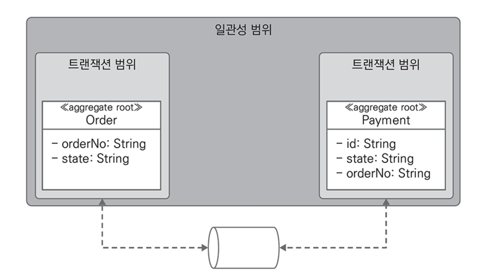
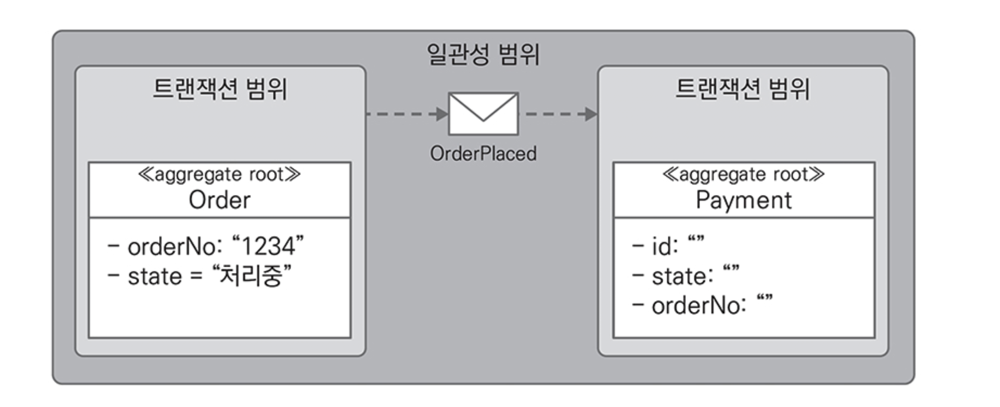
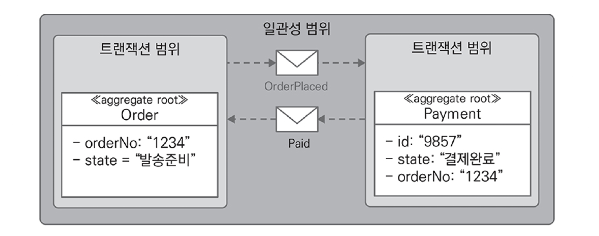
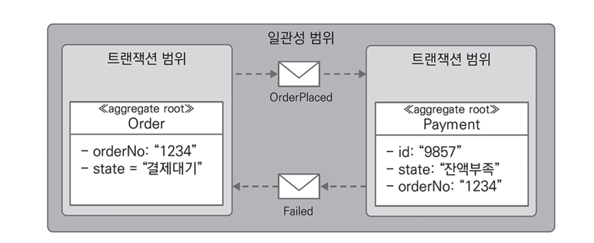

# CHAPTER 6. 결과적 일관성

전통적인 트랜잭션은 `ACID`(Atomicity/Consistency/Isolation/Durability) 특징을 유지하기 위해 잠금을 제어하는 `commit`, `rollback` 기능을 제공

MSA는 ACID와는 다르게 가용성을 더 중요하게 여기는 분산 시스템에 적합한 `BASE`(Basically/Available/Soft State/Eventually Consistency)를 사용
- `BASE`는 `CAP` 이론에 기반한 접근으로 애그리게이트 상태 변경에만 ACID를 사용하고 애그리게이트간에는 결과적 일관성(`Eventually Consistency`)을 사용

**BASE and Eventually Consistency**

<figure><figcaption></figcaption></figure>

마이크로 서비스는 주문의 상태를 대기/처리중/완료와 같이 `soft state`로 프로세스의 진행과 완료를 관리
- 브로커를 활용해 메시지를 주고 받으면서 결과적 일관성을 달성
- 이벤트를 사용하면 요청-응답간 대기 시간을 감소시키고 데이터베이스 잠금을 더 짧게 사용하므로 더 많은 요청을 처리 가능

**Event and Eventually Consistency**
- 주문 요성 시 주문 프로세스에서 주문과 결제 애그리게이트의 상태 변화
- 잔액이 부족해 결제 서비스에서 실패 발생 시 주문 애그리게이트의 상태 변화

    
    
    

외부 결제 대행 서비스가 일시적 장애로 오류가 발생하더라도 결제 서비스는 기능의 완전성을 제공해야 한다.
- 오류가 발생하면 내부적으로 재시도 패턴을 사용
- ex. 1초 대기 후 최대 3회까지 다시 결제를 시도해 보고 계속 오류 발생 시 실패 이벤트 발행

## 기업 통합 패턴

결과적 일관성은 비즈니스 프로세스에 참여하는 시스템간 협력의 결과
- Gregor Hohpe, Bobby Woolf 가 소개한 기업 통합 패턴(Enterprise Integration Patterns) 중 결과적 일관성에 활용할 수 있는 `Routing Slip`, `Process Manager` Pattern 존재

## 분산 트랜잭션

## 사가

## 계좌 이체

## 이벤트 소싱과 결과적 일관성

## 사례 연구

## 전통적인 이력관리와 결과적 일관성

## 도메인 이벤트와 라이브러리

## 일관성과 마이크로서비스 분리 및 통합

## 요약
