# CHAPTER 6. 결과적 일관성

전통적인 트랜잭션은 `ACID`(Atomicity/Consistency/Isolation/Durability) 특징을 유지하기 위해 잠금을 제어하는 `commit`, `rollback` 기능을 제공

MSA는 ACID와는 다르게 가용성을 더 중요하게 여기는 분산 시스템에 적합한 `BASE`(Basically/Available/Soft State/Eventually Consistency)를 사용
- `BASE`는 `CAP` 이론에 기반한 접근으로 애그리게이트 상태 변경에만 ACID를 사용하고 애그리게이트간에는 결과적 일관성(`Eventually Consistency`)을 사용

**BASE and Eventually Consistency**

<figure><figcaption></figcaption></figure>

마이크로 서비스는 주문의 상태를 대기/처리중/완료와 같이 `soft state`로 프로세스의 진행과 완료를 관리
- 브로커를 활용해 메시지를 주고 받으면서 결과적 일관성을 달성
- 이벤트를 사용하면 요청-응답간 대기 시간을 감소시키고 데이터베이스 잠금을 더 짧게 사용하므로 더 많은 요청을 처리 가능

**Event and Eventually Consistency**
- 주문 요성 시 주문 프로세스에서 주문과 결제 애그리게이트의 상태 변화
- 잔액이 부족해 결제 서비스에서 실패 발생 시 주문 애그리게이트의 상태 변화

<p align="center" width="100%">
    
    
    
</p>

외부 결제 대행 서비스가 일시적 장애로 오류가 발생하더라도 결제 서비스는 기능의 완전성을 제공해야 한다.
- 오류가 발생하면 내부적으로 재시도 패턴을 사용
- ex. 1초 대기 후 최대 3회까지 다시 결제를 시도해 보고 계속 오류 발생 시 실패 이벤트 발행

## 기업 통합 패턴

결과적 일관성은 비즈니스 프로세스에 참여하는 시스템간 협력의 결과
- Gregor Hohpe, Bobby Woolf 가 소개한 기업 통합 패턴(Enterprise Integration Patterns) 중 결과적 일관성에 활용할 수 있는 `Routing Slip`, `Process Manager` Pattern 존재

### Routing Slip Pattern

> 사전에 정의한 규칙에 따라 수신한 메시지를 하나 이상의 대상으로 라우팅

각 필터는 수신 메시지를 검사하고 다양한 비즈니스 규칙을 적용한 후 그 결과를 다음 필터로 전달

<figure>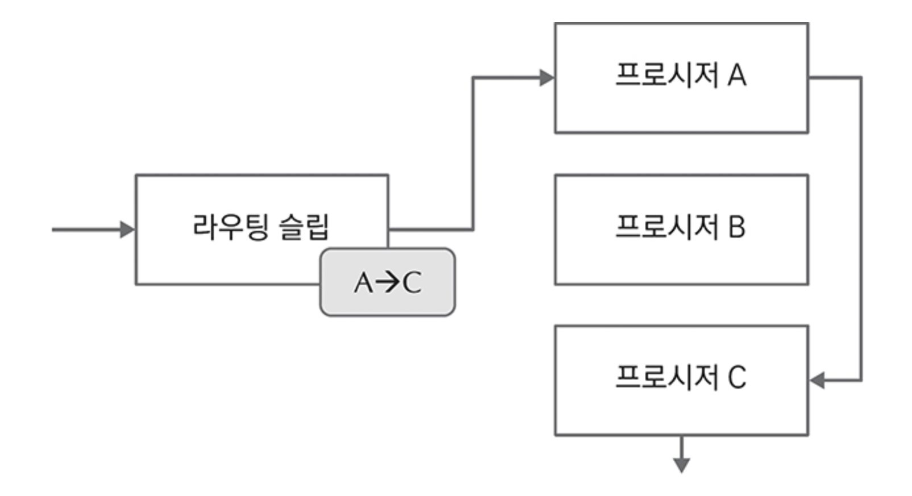<figcaption></figcaption></figure>

메시지가 도착하면 시작 프로시저 A는 메시지를 검사해 자신이 처리할지 다음 프로시저로 전달할지 결정
- 자신이 처리해야 하면 처리 후 결과를 다음 프로시저에 전달
- 단순 비즈니스 프로세스는 이 패턴을 활용해 마이크로서비스간 협업 순서를 정의

단, 두 가지 제약 사항이 존재
- (1) 처리 단계의 순서는 미리 결정되어 있어야 한다.
- (2) 처리 순서는 선형이어야 한다.
  - 다음에 어떤 프로세스가 실행되어야 하는지 동적으로 선택하거나 처리 단계가 순차적이지 않은 상황에 사용 불가

### Process Manager Pattern

> 프로세스 매니저는 라우팅 슬립과 다르게 프로시저의 실행 결과를 이용해 다음에 실행할 프로시저를 결정

<figure>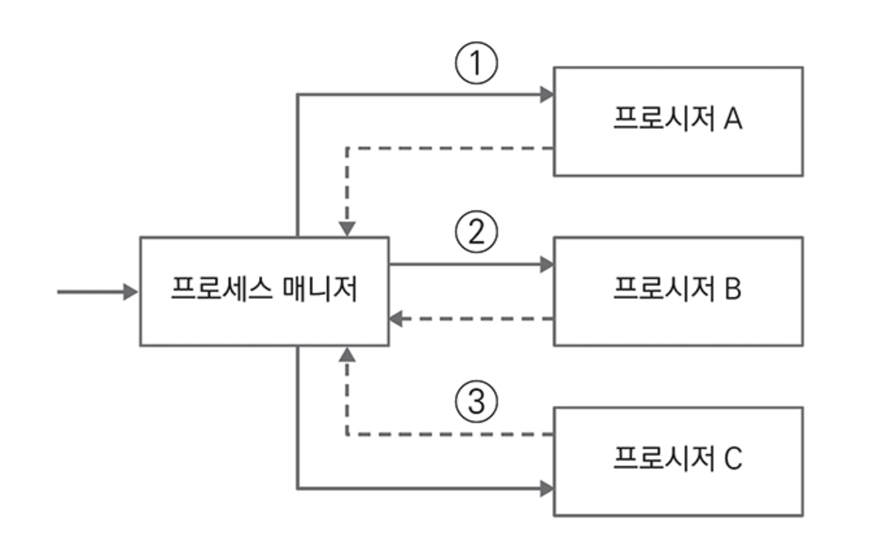<figcaption></figcaption></figure>

대부분의 워크플로우 엔진이 이 패턴을 사용

## SAGA

> 사가는 장기 실행 트랜잭션(Long-running transaction)에서 데이터베이스 잠금을 오랫동안 유지해야 하는 문제를 해결하기 위해 짧은 트랜잭션 집합으로 분해해서 관리하는 접근법
> 
> MSA에서 데이터의 일관성을 유지하는데 사용

MSA에서 일련의 사건은 비즈니스 프로세스를 완성하는 여러 서비스간의 협력에서 발생하는 개별 트랜잭션의 순서
- 사가는 비즈니스 트랜잭션을 구성하는 여러 트랜잭션들 중 하나에서 오류가 발행하면 이전에 완료된 트랜잭션을 이전 상태로 되돌리는 보상 트랜잭션을 실행

<figure><figcaption></figcaption></figure>

서비스 장애로 오류(PaymentFailed)가 발생하면 주문 서비스는 Order 객체를 삭제하고 재고 서비스는 Product 재고 수량을 다시 증가



**보상 트랜잭션**

추상적으로 마이크로서비스간 일관성을 보장하기 위한 방법으로 많이 알려짐
- 서비스가 아닌 애그리게이트간 일관성을 보장하는 방법으로 사용
- 단일 마이크로서비스가 여러 애그리게이트를 갖고 있어도 보상 트랜잭션을 사용해 애그리게이트간 일관성을 유지해야 서비스의 독립성을 높일 수 있음



사가는 `Orchestration`, `Choreography` 두 가지 방법으로 구현 가능
- `Orchestration`: 하나의 서비스가 트랜잭션에 필요한 이벤트에 반응해 일관성을 조정하는 책음을 갖는 중앙 집중형
- `Choreography`: 참여하는 모든 서비스가 자율적으로 도메인 이벤트에 반응해 일관성을 달성하는 분산형

🔗 [microservices.io](https://microservices.io/)

일반적으로 비즈니스 트랜잭션의 각 스텝에서 상태를 중앙에서 관리하는 프로세스 매니저를 함께 사용해 보상 프로세스를 진행
- 일관성을 유지하기 위해 비즈니스 트랜잭션에 참여하는 애그리게이트간에 트랜잭션을 구분하는 값을 주고 받음

### 상관 관계 아이디

> 결과적 일관성은 애그리게이트 식별자를 상관 관계 아이디로 사용

ex. 주문 프로세스에서는 결제, 배송 마이크로서비스와 주문번호를 상관관계 아이디로 사용

**주문과 상관 관계 아이디**

<figure>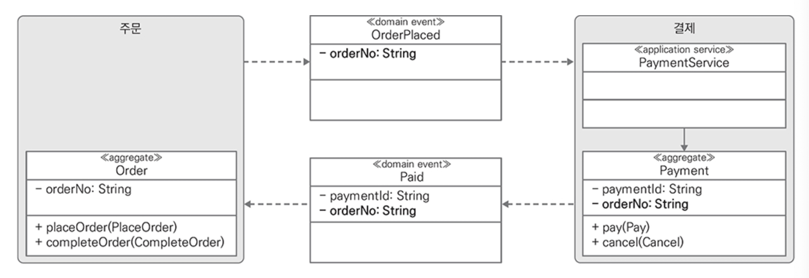<figcaption></figcaption></figure>

**결제 실패와 상관 관계 아이디**

<figure>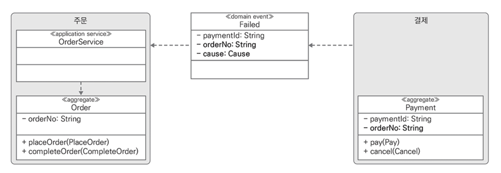<figcaption></figcaption></figure>

### Orchestration

> 주문 마이크로서비스가 비즈니스 프로세스에 필요한 모든 작업을 알고 있으며 이벤트가 발생할 때마다 프로세스의 다음 스탭을 결정

**오케스트레이션 - 주문 성공 시나리오**

<figure>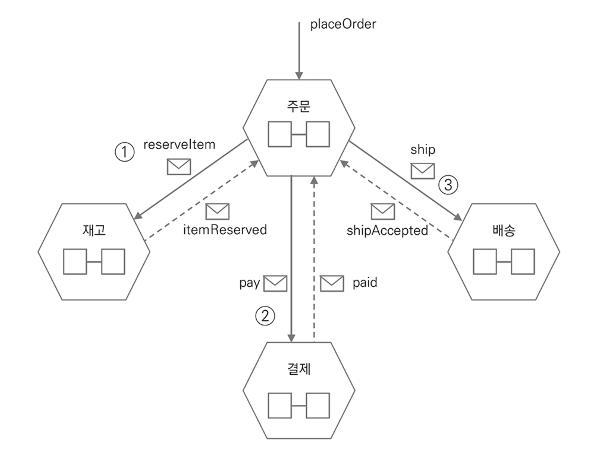<figcaption></figcaption></figure>

- 응답 토픽에 주문 프로세스의 마지막 스텝 결과로 성공이 도착하면 비즈니스 프로세스를 완료

오케스트레이션 주문 실패(배송예약) 시나리오

<figure>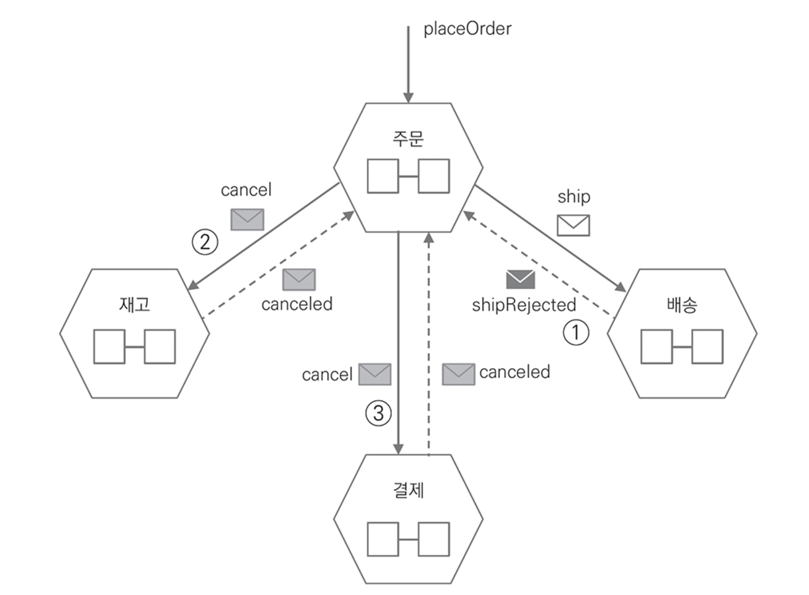<figcaption></figcaption></figure>

- 배송 마이크로서비스는 배송 처리 중 오류가 발생하면 shipRejected 이벤트를 발행
- 오케스트레이션 방식에서 주문 서비스는 비즈니스 프로세스의 진행 상태를 관리하는 객체가 필요
  - 상태 관리 객체는 직접 구현하거나 스프링 스테이트 머신과 같은 라이브러리를 사용 가능
  - 주문 서비스도 일시적으로 장애가 발생할 수 있으므로 프로세스의 진행 상태를 데이터베이스에 저장하고 서비스가 다시 시작했을 때 저장한 진행 상태를 조회하고 다음 스텝을 계속 진행

### Choreography

> `Orchestration` 방식은 주문 마이크로서비스가 전체 흐름을 제어하지만 `Choreography` 방식은 개별 마이크로서비스가 설계 시 부여한 책임을 가지고 자율적으로 비즈니스 트랜잭션에 참여

- 비즈니스 프로세스를 완료하기 위해 서로 어떤 메시지를 발행하고 반응해 무엇을 처리할지 상세하게 정의
- 마이크로서비스는 자신이 반응하기로 한 메시지를 수신하면 설계 시 부여한 기능을 실행
- 중간 스텝에서 실패가 발생하면 각 서비스는 실패 이벤트에 반응해 개별적으로 보상 로직을 실행

`Choreography` 방식 사용 시 비즈니스 프로세스의 흐름

<figure>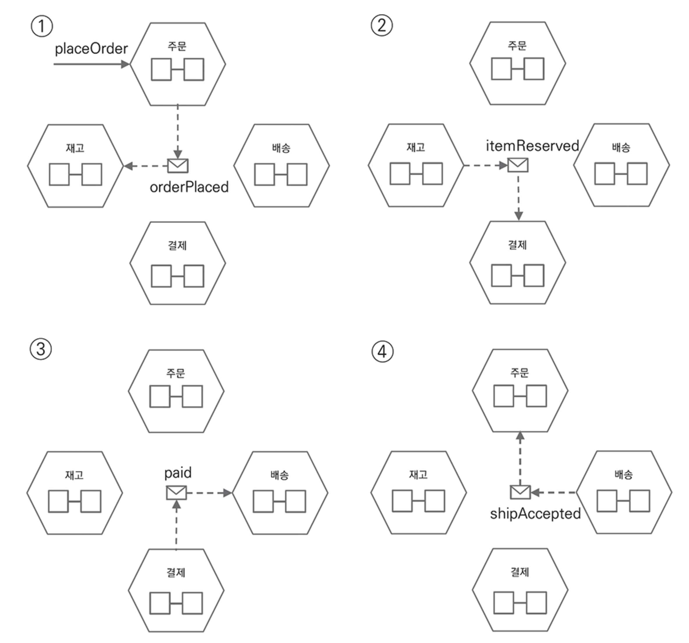<figcaption></figcaption></figure>

- `Choreography`는 일련의 흐름을 병렬로 처리할 수 있는 유연함 존재
- 주문 서비스가 OrderPlaced 이벤트를 발행하면 재고, 결제, 배송 서비스는 설계 시 부여한 기능을 동시에 수행하고 결과를 이벤트로 발행
- 비즈니스 프로세스 전체를 파악하기 어려운 단점이 있어 명확한 문서화 및 현행화가 필요하고 단순하거나 자주 변하지 않는 프로세스에 적용하는 것이 좋음

### Timeout

> 일시적인 장애 또는 응답 지연을 고려해 비즈니스 트랜잭션의 타임아웃도 고려

- 데이터가 일관성을 유지하지 못한 채 비즈니스 트랜잭션이 장시간 방치되는 것을 방지
- 참고. SAGA PAttern을 지원하는 일부 라이브러리나 프레임워크는 timeout 대신 `Deadline`으로 부르기도 함.

**SAGA and Timeout**

<p align="center" width="100%">
    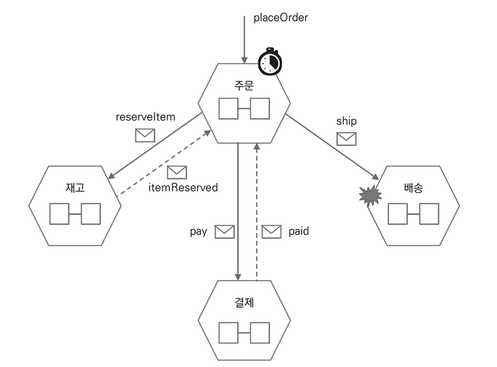
    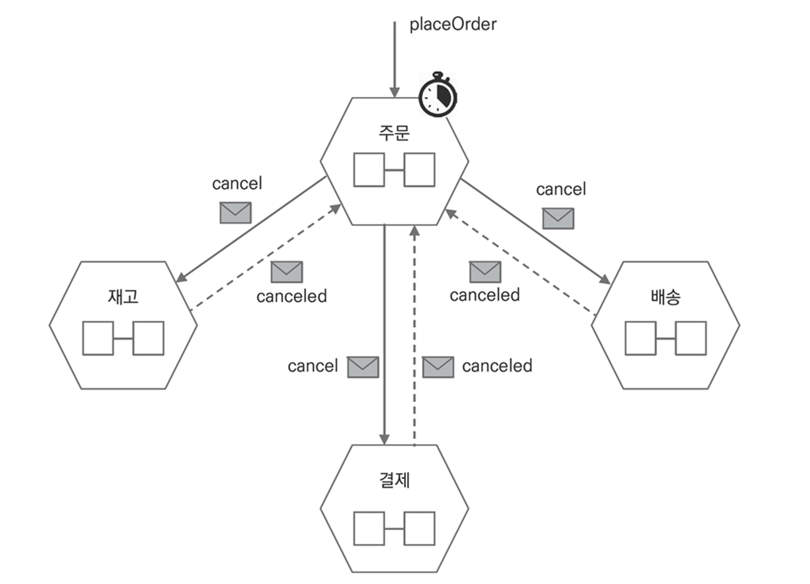
</p>

- 배송 마이크로서비스에 장애가 발생해 타임아웃이 발생하기 전에 기대하는 성공/실패 이벤트를 받지 못하면 취소 메시지를 발행하고 취소 메시지를 받은 서비스는 보상 로직을 실행
- 적재 적소에 보상 트랜잭션을 적용하면 복잡한 케이스에서 코드를 단순하게 유지하면서 확장 가능한 서비스 구현이 가능

### 의미적 잠금

MSA에는 비즈니스 프로세스에 참여하는 서비스에서 데이터베이스의 잠금 기능을 사용하지 않고 소프트 스테이트를 사용
- 데이터베이스 잠금과 달리 논리적임을 강조하기 위해 이를 의미적 잠금(`Semantic Lock`)으로도 부름
- 일반적으로 트랜잭션이 완료되지 않은 데이터는 사용자에게 보여주지 않지만 의미적 잠금은 데이터를 조회했을 때 화면에 보이는 것이 더 자연스럽기도 함
  - ex. 결제 대기 -> 트랜잭션 완료 후 결제 완료 및 버튼 활성화

## 계좌 이체

### Orchestration

> 루트 마이크로서비스가 비즈니스 프로세스에 필요한 모든 작업을 알고 있으며 이벤트가 발생할 때마다 프로세스의 다음 스탭을 결정

Orchestration 방식에서 계좌 이체 성공 시나리오

1. 사용자가 transfer 서비스에 `TransferMoney` 커맨드로 이체 요청
2. transfer 서비스는 Transfer 애그리게이트를 생성하고 `TransferCreated` 이벤트 발행
3. TransferOrchestrator가 `TransferCreated` 도메인 이벤트에 반응해 to 계좌에 `Deposit` 커맨드 발행
4. `Deposit` 커맨드를 수신한 account 서비스는 to 계좌에 입금 처리하고 `Deposited` 이벤트 발행
5. TransferOrchestrator는 `Deposited` 이벤트를 수신하고 transfer 서비스에 입금 완료로 처리하는 `CompleteDeposit` 커맨드를 발행
6. TransferOrchestrator는 transfer 서비스가 입금 완료를 처리하면 from 계좌에 `Withdraw` 커맨드 발행
7. `Withdraw` 커맨드를 수신한 account 서비스는 from 계좌에서 출금을 처리하고 `Withdrawed` 이벤트 발행
8. TransferOrchestrator는 `Withdrawed` 이벤트에 반응해 transfer 출금 완료로 처리하는 `CompleteWithdraw` 커맨드 발행

transfer 서비스는 `CompleteDeposit`, `CompleteWithdraw` 커맨드를 처리하고 계좌 이체 완료를 검사해 입금/출금을 모두 완료했으면 계좌 이체 상태를 완료로 변경

<figure>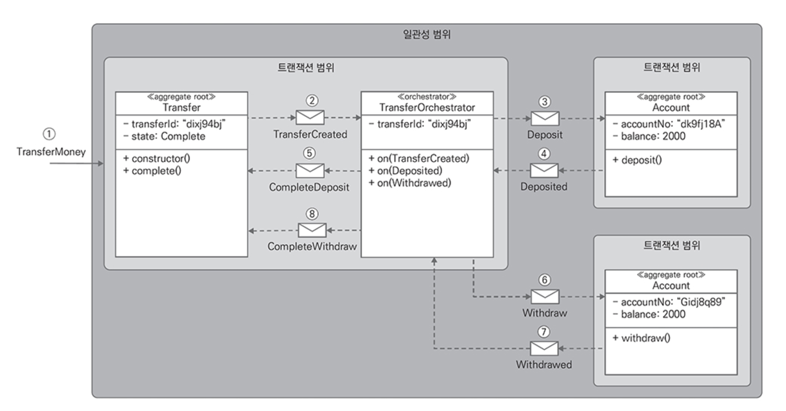<figcaption></figcaption></figure>

입금은 성공했지만 잔액 부족으로 출금에 실패한 시나리오의 보상 흐름

9. AccountService는 출금 계좌에 잔액이 부족하면 `WithdrawFailed` 이벤트를 발행
10. `WithdrawFailed` 이벤트를 수신한 TransferOrchestrator는 TransferService에 계좌 이체 취소를 요청
11. TransferService는 Transfer 애그리게이트를 실패로 처리하고 `TransferCanceled` 이벤트를 발행
12. `TransferCanceled` 이벤트를 수신한 TransferOrchestrator는 `CancelDeposit` 커맨드를 발행
13. `CancelDeposit` 커맨드를 수신한 DepositHandler는 입금을 취소

<figure>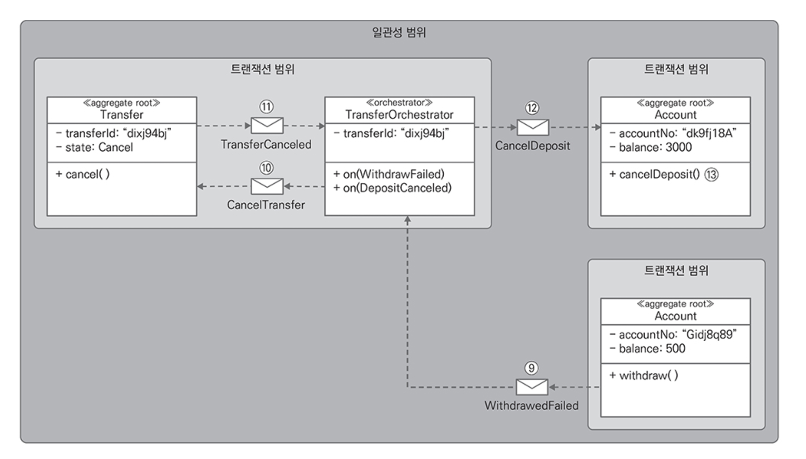<figcaption></figcaption></figure>

### Choreography

전체 흐름을 제어하는 `Orchestrator` 없이 **애그리게이트에서 발행한 이벤트에 핸들러가 직접 반응**해 비즈니스 트랜잭션을 처리
- 애그리게이트 단위로 발행하는 이벤트에 반응해 처리를 위임하는 클래스를 추가
- 사전에 설계된 프로세스로만 진행하므로 라우팅 슬립 패턴과 유사

<figure>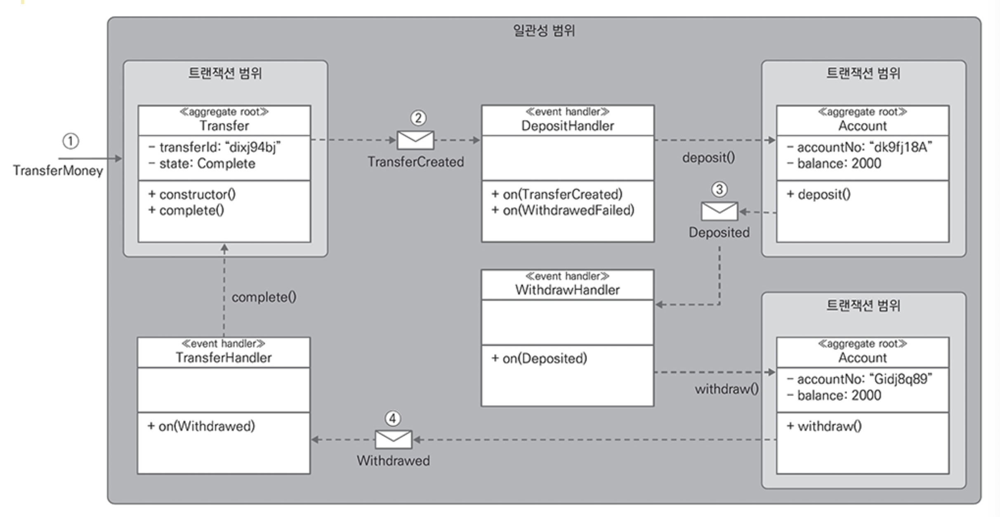<figcaption></figcaption></figure>

- `DepositHandler`는 TransferCreated 이벤트에 직접 반응해 AccountService에 입금 처리를 위임
- `WithdrawHandler`는 Deposited 이벤트에 반응해 AccountService에 출금 처리를 위임
- `TransferHandler`는 Withdrawed 이벤트에 반응해 AccountService에 계좌 이체 완료를 위임

잔액 부족으로 출금에 실패할 경우 보상 흐름을 실행

<figure>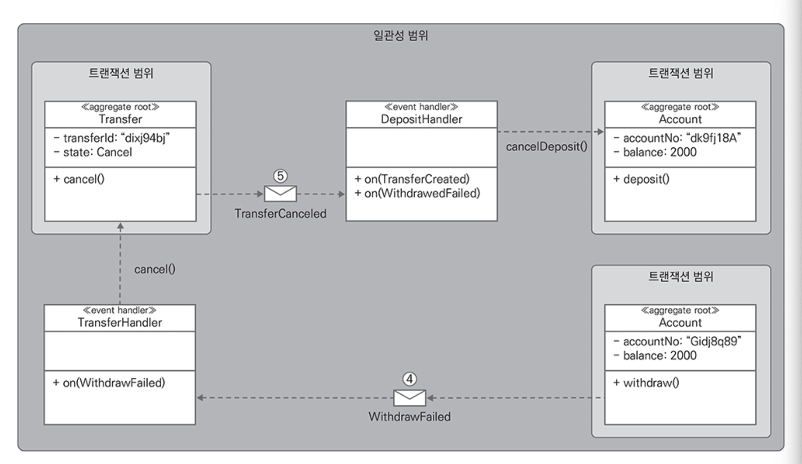<figcaption></figcaption></figure>



`Orchestration`, `Choreography` 방식 모두 보상 로직을 가진 메소드를 제공해야 하는 번거로움이 있지만 이벤트를 사용해 서비스의 독립성을 높일 수 있다.



## 이벤트 소싱과 결과적 일관성

회계 장부를 기입하는 방법에서 이벤트 소싱을 사용할 때 보상 트랜잭션을 처리하는 아이디어를 얻을 수 있다.
- 회계는 원장 중간에 수기로 작성한 것에 취소선을 사용할 뿐 절대 지우거나 변경하지 않는다.
- 삭제 대한 정정(correcting) 과정을 거쳐 잔액을 맞춘다
- 오류가 있는 차액만 정정하는 것을 `부분 반전`(Partial Reversal)
- 전체를 취소하고 올바른 금액으로 다시 기록하는 방법을 `전체 반전`(Full Reversal)

### 이벤트 소싱과 사가

> 이벤트 소싱으로 SAGA를 구현하면 이벤트 소싱의 장점을 모두 얻을 수 있다.

트리거 역할의 사가
- 클라이언트 요청으로 발생하는 커맨드와 이벤트의 전달 흐름에서 Saga 객체의 역할

<figure>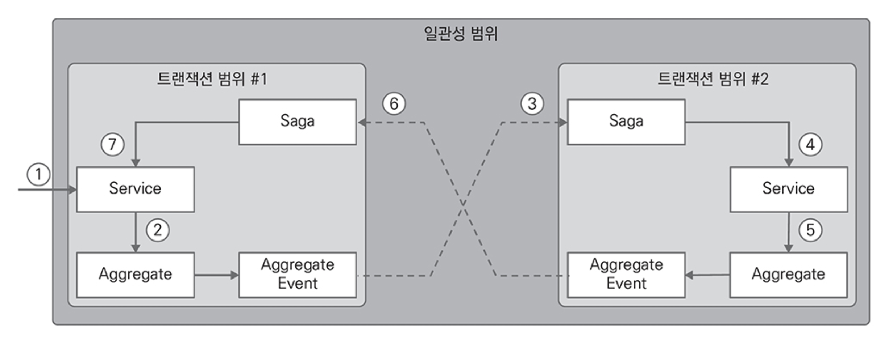<figcaption></figcaption></figure>

비즈니스 프로세스 흐름과 Saga 객체
- Saga 객체가 애그리게이트에서 발행한 도메인 이벤트에 직접 반응하는 방식
- 협력에 참여하지 않고 Saga 객체가 발행한 이벤트에만 반응해 비즈니스 트랜잭션에 참여하는 방식으로 직접적인 의존성을 제거
- 장점: 도메인이 처리해야 하는 고유 기능과 비즈니스 트랜잭션을 조정하는 기능을 분리하고, 애플리케이션 서비스를 포함한 하위 레이어의 변경을 최소화
- 단점: Saga 이벤트를 추가로 정의해야 함

<figure>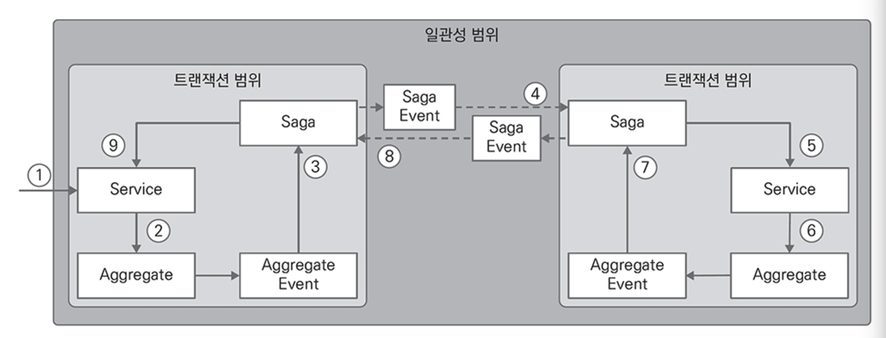<figcaption></figcaption></figure>

### 결과적 일관성

Saga 이벤트에 반응하고 TransferSaga 객체로 상태를 관리하면서 입금과 출금을 처리하는 흐름

**TransferSaga와 입금 흐름**

<figure><figcaption></figcaption></figure>

**TransferSaga와 출금 흐름**

<figure>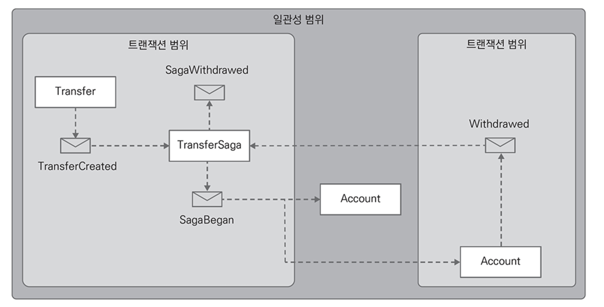<figcaption></figcaption></figure>
<details>
<summary>TransferSaga.kt</summary>

```kotlin
class TransferSaga() : EventSourcedSaga() {

    companion object {
        private val logger: Logger = LoggerFactory.getLogger(TransferSaga::class.java)
    }

    var transferId: String? = null
    var toAccountNo: String? = null
    var deposited: Boolean = false
    var withdrawed: Boolean = false

    constructor(command: BeginTransferSaga) : this() {
        apply(
            TransferSagaBegan(
                transferId = command.transferId,
                fromAccountNo = command.fromAccountNo,
                toAccountNo = command.toAccountNo,
                amount = command.amount
            )
        )
    }

    override fun identifier(): String = transferId ?: ""

    private fun on(event: TransferSagaBegan) {
        transferId = event.transferId
        toAccountNo = event.toAccountNo
    }

    fun deposit(command: DepositTransferSaga) {
        apply(TransferSagaDeposited())
    }

    private fun on(event: TransferSagaDeposited) {
        deposited = true
    }

    fun withdraw(command: WithdrawTransferSaga) {
        apply(TransferSagaWithdrawed())
    }

    private fun on(event: TransferSagaWithdrawed) {
        withdrawed = true
    }

    fun complete(command: CompleteTransferSaga) {
        apply(TransferSagaCompleted())
    }

    private fun on(event: TransferSagaCompleted) {
        isCompleteSaga = true
    }

    fun cancel(command: CancelTransferSaga) {
        apply(TransferSagaCanceled(toAccountNo ?: "", transferId ?: ""))
    }

    private fun on(event: TransferSagaCanceled) {
        isCompleteSaga = true
    }

    override fun completed(): Boolean {
        return deposited && withdrawed
    }
}

...

abstract class EventSourcedSaga {
    private val events: MutableList<Event> = mutableListOf()
    private var sequence: Long = 0
    var version: Long = 0
    var isCompleteSaga: Boolean = false

    abstract fun identifier(): String
    abstract fun completed(): Boolean

    fun apply(event: Event) {
        apply(event, isNew = true)
    }

    fun apply(event: Event, isNew: Boolean) {
        try {
            val eventHandler: Method = this::class.java.getDeclaredMethod("on", event::class.java)
            eventHandler.isAccessible = true
            eventHandler.invoke(this, event)
            if (isNew) {
                event.sequence(++sequence)
                events.add(event)
            } else {
                this.sequence = event.sequence()
            }
        } catch (e: NoSuchMethodException) {
            throw EventHandlerNotFoundException(this::class.java, event::class.java)
        } catch (e: IllegalAccessException) {
            throw EventHandlerInvokeException(this::class.java, event::class.java, e)
        } catch (e: InvocationTargetException) {
            throw EventHandlerInvokeException(this::class.java, event::class.java, e)
        }
    }

    fun events(): List<Event> = events

    fun sequence(): Long = sequence

    fun sequence(sequence: Long) {
        this.sequence = sequence
    }
}
```
</details>


<details>
<summary>aaa.kt</summary>


</details>


## 사례 연구

## 전통적인 이력관리와 결과적 일관성

## 도메인 이벤트와 라이브러리

## 일관성과 마이크로서비스 분리 및 통합

## 요약
