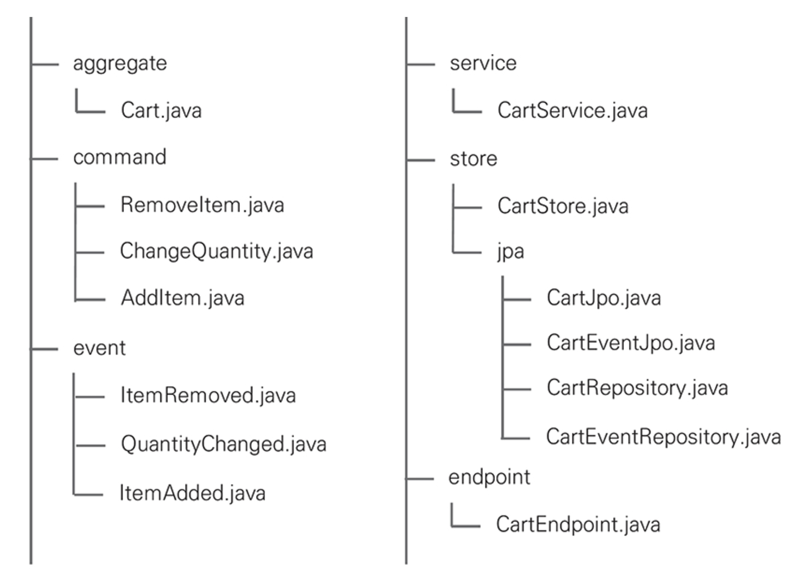

# CHAPTER 5. 마이크로서비스 협업

모노리스 아키텍처 시스템은 통합되어 있는 모듈이 비즈니스 프로세스를 처리

반면, MSA 시스템은 서비스간 협력으로 처리하는데, 대표적인 방법으로 `RESTful API`와 `Event`
- 협력에 참여하는 마이크로서비스가 제공하는 `RESTful API`를 호출하고나 메시지 브로커에 `Event`를 발생해서 통신
- `인바운드 어댑터`는 요청을 서비스에 위임해 비즈니스 로직을 처리
- `아웃바운드 어댑터`는 비즈니스 로직 처리 중간 또는 완료 후 다른 마이크로서비스와 협력을 위해 사용

## 인바운드 어댑터와 RESTful API

👉🏻 **HTTP 메소드**

- RESTful API URL은 자원을 기준으로 `목록`과 `단일 엔티티`를 다루고 `명사`를 사용
- HTTP 메소드와 활용 범위

|URL|POST|GET|PUT|DELETE|
|---|---|---|---|---|
|/cart|새로운 Cart 생성|Cart 목록|Cart 대량 업데이트|모든 Cart 삭제|
|/cart/1234|오류|Cart 상세 조회|있으면 업데이트, 없으면 에러|Cart 삭제|

.

👉🏻 **애그리게이트와 URL**

HTTP는 같은 URL을 HTTP 헤더로 구별하는 명세를 제공
- HTTP 헤더로 애그리게이트가 제공하는 기능을 구별하는 용도로 사용 가능
- ex) /cart/{itemId}와 PUT 메소드를 사용해 두 가지 요청을 구분
  - 옵션 변경, 수량 변경

### 커맨드와 RESTful API

- 스프링은 동일한 URL과 메소드로 설계한 RESTful API를 헤더로 구별하는데 사용할 수 있는 `@xMapping` 어노테이션 세트를 제공
  - 상세한 요청을 구별하기 위해 `key=value` 형식을 가진 headers 필드를 사용
- `/cart/{itemId}` 경로에 item 수량과 옵션을 변경하는 기능을 구별하는 용도로 HTTP 헤더를 설정
  - key는 `command`, value는 `command class` 이름을 선언하면 스프링은 HTTP 헤더에서 value를 확인해 일치하는 메소드를 실행

```kotlin
@RestController
class CartEndpoint(
    private val httpSession: HttpSession,
    private val cartService: CartService
) {

    @PutMapping(
        value = ["/cart/{itemId}"],
        headers = ["command=ChangeQuantity"]
    )
    fun changeQuantity(
        @PathVariable itemId: String,
        @RequestBody command: ChangeQuantity
    ) {
        cartService.changeQuantity(command)
    }

    @PutMapping(
        value = ["/cart/{itemId}"],
        headers = ["command=ChangeOption"]
    )
    fun changeOption(
        @PathVariable itemId: String,
        @RequestBody command: ChangeOption
    ) {
        cartService.changeOption(command)
    }
}
```

POST, DELETE 메소드도 같은 방식으로 headers를 사용하면 URL와 HTTP 메소드의 중복 제약없이 자유롭게 사용 가능
- PUT headers={"command=AddItem"}
- PUT headers={"command=DeleteItem"}

**transient**

커맨드 객체의 속성 중 백엔드에서 할당하는 속성임을 표현하기 위한 용도로 transient 키워드를 사용
- 백엔드와 프론트 개발자간 약속으로 값을 전달하지 않아도 된다는 의도

```kotlin
data class AddItem(
    @Transient var cartId: String? = null,
    var productNo: String? = null,
    var productName: String? = null,
    var quantity: Int = 0
)

...

@RestController
class CartEndpoint(
    private val httpSession: HttpSession,
    private val cartService: CartService
) {

    @PostMapping(
        value = ["/cart"],
        headers = ["command=AddItem"]
    )
    fun addItem(@RequestBody command: AddItem) {
        val userId = httpSession.getAttribute("userId")?.toString()
        command.cartId = userId
        cartService.addItem(command)
    }
}
```

### 조회와 RESTful API

```kotlin
@RestController
class CartEndpoint(
    private val httpSession: HttpSession,
    private val cartService: CartService
) {

    @GetMapping("/cart")
    fun queryCart(): Cart {
        val userId = httpSession.getAttribute("userId")?.toString()
        return cartService.queryCart(userId)
    }

    @GetMapping("/cart/{itemId}")
    fun queryItem(@PathVariable itemId: String): Item {
        val userId = httpSession.getAttribute("userId")?.toString()
        val cart = cartService.queryCart(userId)
        return cart.findItem(itemId)
    }
}
```



단일 애그리게이트를 조회

- ❌ : null 반환
- ⭕️ : HTTP 표준인 '404 Not Found'를 반환
  - 요청한 데이터가 없음을 클라이언트에 명확하게 알리는 것이 좋다.

목록을 조회
- ❌ : null이나 HTTP 표준인 404코드를 반환
- ⭕️ : 빈 배열을 반환하는 것이 실용적



### 전역 예외 처리

스프링은 예외에 따라 HTTP 응답코드를 반환하는 @RestControllerAdvice 어노테이션을 제공
- 전역 예외처리를 위해 @RestControllerAdvice를 이용한 ExceptionAdvisor 구현

```kotlin
@RestControllerAdvice
class ExceptionAdvisor : ResponseEntityExceptionHandler() {

    @ExceptionHandler(NoSuchElementException::class)
    fun handleNoSuchElementException(exception: NoSuchElementException, webRequest: WebRequest): ResponseEntity<Any> {
        val body = mapOf(
            "timestamp" to LocalDateTime.now(),
            "status" to HttpStatus.NOT_FOUND.value(),
            "error" to exception::class.simpleName,
            "message" to exception.message,
            "path" to webRequest.getDescription(false)
        )

        return ResponseEntity(body, HttpStatus.NOT_FOUND)
    }

    @ExceptionHandler(IllegalArgumentException::class)
    fun handleIllegalArgumentException(exception: IllegalArgumentException, webRequest: WebRequest): ResponseEntity<Any> {
        val body = mapOf(
            "timestamp" to LocalDateTime.now(),
            "status" to HttpStatus.BAD_REQUEST.value(),
            "error" to exception::class.simpleName,
            "message" to exception.message,
            "path" to webRequest.getDescription(false)
        )
        
        return ResponseEntity(body, HttpStatus.BAD_REQUEST)
    }

    @ExceptionHandler(RuntimeException::class)
    fun handleRuntimeException(exception: RuntimeException, webRequest: WebRequest): ResponseEntity<Any> {
        val body = mapOf(
            "timestamp" to LocalDateTime.now(),
            "status" to HttpStatus.INTERNAL_SERVER_ERROR.value(),
            "error" to exception::class.simpleName,
            "message" to exception.message,
            "path" to webRequest.getDescription(false)
        )

        return ResponseEntity(body, HttpStatus.INTERNAL_SERVER_ERROR)
    }
}
```

### 마이크로서비스 모듈

RESTful API는 핵사고날 아키텍처에서 `인바운드 어댑터`
- 어댑터는 비즈니스 로직을 포함하면 안되고
- 외부 요청을 받아 애플리케이션 서비스에 요청을 위임
- 비즈니스와 관련있는 모듈인 service 패키지와 분리

RESTful API를 적용한 마이크로서비스의 모듈은 `endpoint`
- 핵사고날 아키텍처에서 외부 요청을 받는 인바운드 어댑터인 RESTful API를 endpoint 패키지에 두면서 애그리게이트 단위로 분리

<figure><figcaption></figcaption></figure>

## 아웃바운드 어댑터와 RESTful API

아웃바운드 어댑터는 아파치 HttpClient나 스프링 WebClient와 같이 HTTP를 지원하는 다양한 라이브러리를 사용할 수 있지만 중복 코드를 작성해야 하는 단점이 존재
- 대안으로 스프링이 제공하는 `FeignClient` 사용
- `FeignClient`는 인터페이스 선언만으로 다른 마이크로서비스를 사용할 수 있는 개발 편의성을 제공
- `spring-cloud-starter-openfeign` 의존성

`@FeignClient`는 오퍼레이션에 선언한 `@xMapping`에 따라 RESTful API를 호출하고 결과를 반환
  
```kolint
@FeignClient(value = "cart")
interface CartClient {

    @GetMapping("/cart/{itemId}")
    fun queryItem(@PathVariable itemId: String): Item
}

data class Item(
    var cartId: String? = null,
    var productNo: String? = null,
    var productName: String? = null,
    var price: Int = 0,
    var quantity: Int = 0
)
```

사용하지 않는 속성을 알고 있는 것보다는 코드 중복이 있더라도 개발자가 유지하는 소스 코드 단위로 필요한 속성만 선언하면 독립성을 높일 수 있다.

## 이벤트 브로커

## 아웃바운드 어댑터와 이벤트 발행

## 인바운드 어댑터와 이벤트 소비

## 이벤트 어댑터와 마이크로서비스 모듈

## 이벤트 어댑터와 추상화된 핵심

## 레거시 통합

## 요약
