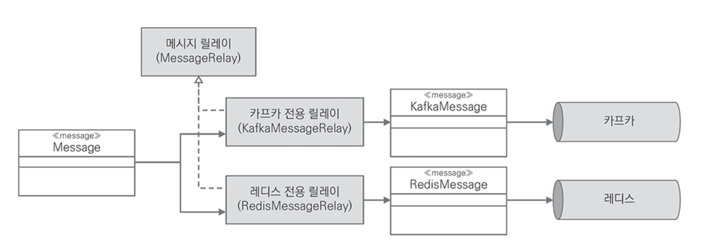
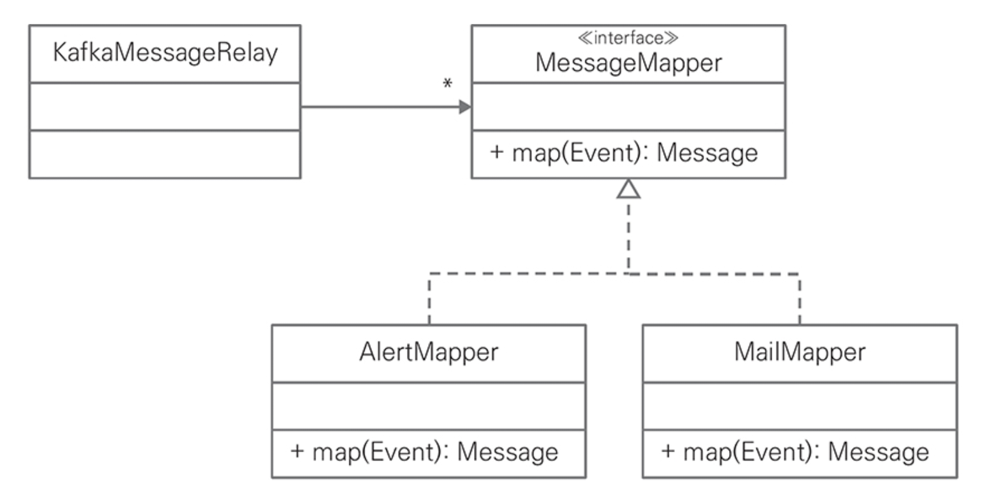

# CHAPTER 5. 마이크로서비스 협업

모노리스 아키텍처 시스템은 통합되어 있는 모듈이 비즈니스 프로세스를 처리

반면, MSA 시스템은 서비스간 협력으로 처리하는데, 대표적인 방법으로 `RESTful API`와 `Event`
- 협력에 참여하는 마이크로서비스가 제공하는 `RESTful API`를 호출하고나 메시지 브로커에 `Event`를 발생해서 통신
- `인바운드 어댑터`는 요청을 서비스에 위임해 비즈니스 로직을 처리
- `아웃바운드 어댑터`는 비즈니스 로직 처리 중간 또는 완료 후 다른 마이크로서비스와 협력을 위해 사용

## 인바운드 어댑터와 RESTful API

👉🏻 **HTTP 메소드**

- RESTful API URL은 자원을 기준으로 `목록`과 `단일 엔티티`를 다루고 `명사`를 사용
- HTTP 메소드와 활용 범위

|URL|POST|GET|PUT|DELETE|
|---|---|---|---|---|
|/cart|새로운 Cart 생성|Cart 목록|Cart 대량 업데이트|모든 Cart 삭제|
|/cart/1234|오류|Cart 상세 조회|있으면 업데이트, 없으면 에러|Cart 삭제|

.

👉🏻 **애그리게이트와 URL**

HTTP는 같은 URL을 HTTP 헤더로 구별하는 명세를 제공
- HTTP 헤더로 애그리게이트가 제공하는 기능을 구별하는 용도로 사용 가능
- ex) /cart/{itemId}와 PUT 메소드를 사용해 두 가지 요청을 구분
  - 옵션 변경, 수량 변경

### 커맨드와 RESTful API

- 스프링은 동일한 URL과 메소드로 설계한 RESTful API를 헤더로 구별하는데 사용할 수 있는 `@xMapping` 어노테이션 세트를 제공
  - 상세한 요청을 구별하기 위해 `key=value` 형식을 가진 headers 필드를 사용
- `/cart/{itemId}` 경로에 item 수량과 옵션을 변경하는 기능을 구별하는 용도로 HTTP 헤더를 설정
  - key는 `command`, value는 `command class` 이름을 선언하면 스프링은 HTTP 헤더에서 value를 확인해 일치하는 메소드를 실행

```kotlin
@RestController
class CartEndpoint(
    private val httpSession: HttpSession,
    private val cartService: CartService
) {

    @PutMapping(
        value = ["/cart/{itemId}"],
        headers = ["command=ChangeQuantity"]
    )
    fun changeQuantity(
        @PathVariable itemId: String,
        @RequestBody command: ChangeQuantity
    ) {
        cartService.changeQuantity(command)
    }

    @PutMapping(
        value = ["/cart/{itemId}"],
        headers = ["command=ChangeOption"]
    )
    fun changeOption(
        @PathVariable itemId: String,
        @RequestBody command: ChangeOption
    ) {
        cartService.changeOption(command)
    }
}
```

POST, DELETE 메소드도 같은 방식으로 headers를 사용하면 URL와 HTTP 메소드의 중복 제약없이 자유롭게 사용 가능
- PUT headers={"command=AddItem"}
- PUT headers={"command=DeleteItem"}

**transient**

커맨드 객체의 속성 중 백엔드에서 할당하는 속성임을 표현하기 위한 용도로 transient 키워드를 사용
- 백엔드와 프론트 개발자간 약속으로 값을 전달하지 않아도 된다는 의도

```kotlin
data class AddItem(
    @Transient var cartId: String? = null,
    var productNo: String? = null,
    var productName: String? = null,
    var quantity: Int = 0
)

...

@RestController
class CartEndpoint(
    private val httpSession: HttpSession,
    private val cartService: CartService
) {

    @PostMapping(
        value = ["/cart"],
        headers = ["command=AddItem"]
    )
    fun addItem(@RequestBody command: AddItem) {
        val userId = httpSession.getAttribute("userId")?.toString()
        command.cartId = userId
        cartService.addItem(command)
    }
}
```

### 조회와 RESTful API

```kotlin
@RestController
class CartEndpoint(
    private val httpSession: HttpSession,
    private val cartService: CartService
) {

    @GetMapping("/cart")
    fun queryCart(): Cart {
        val userId = httpSession.getAttribute("userId")?.toString()
        return cartService.queryCart(userId)
    }

    @GetMapping("/cart/{itemId}")
    fun queryItem(@PathVariable itemId: String): Item {
        val userId = httpSession.getAttribute("userId")?.toString()
        val cart = cartService.queryCart(userId)
        return cart.findItem(itemId)
    }
}
```



단일 애그리게이트를 조회

- ❌ : null 반환
- ⭕️ : HTTP 표준인 '404 Not Found'를 반환
  - 요청한 데이터가 없음을 클라이언트에 명확하게 알리는 것이 좋다.

목록을 조회
- ❌ : null이나 HTTP 표준인 404코드를 반환
- ⭕️ : 빈 배열을 반환하는 것이 실용적



### 전역 예외 처리

스프링은 예외에 따라 HTTP 응답코드를 반환하는 @RestControllerAdvice 어노테이션을 제공
- 전역 예외처리를 위해 @RestControllerAdvice를 이용한 ExceptionAdvisor 구현

```kotlin
@RestControllerAdvice
class ExceptionAdvisor : ResponseEntityExceptionHandler() {

    @ExceptionHandler(NoSuchElementException::class)
    fun handleNoSuchElementException(exception: NoSuchElementException, webRequest: WebRequest): ResponseEntity<Any> {
        val body = mapOf(
            "timestamp" to LocalDateTime.now(),
            "status" to HttpStatus.NOT_FOUND.value(),
            "error" to exception::class.simpleName,
            "message" to exception.message,
            "path" to webRequest.getDescription(false)
        )

        return ResponseEntity(body, HttpStatus.NOT_FOUND)
    }

    @ExceptionHandler(IllegalArgumentException::class)
    fun handleIllegalArgumentException(exception: IllegalArgumentException, webRequest: WebRequest): ResponseEntity<Any> {
        val body = mapOf(
            "timestamp" to LocalDateTime.now(),
            "status" to HttpStatus.BAD_REQUEST.value(),
            "error" to exception::class.simpleName,
            "message" to exception.message,
            "path" to webRequest.getDescription(false)
        )
        
        return ResponseEntity(body, HttpStatus.BAD_REQUEST)
    }

    @ExceptionHandler(RuntimeException::class)
    fun handleRuntimeException(exception: RuntimeException, webRequest: WebRequest): ResponseEntity<Any> {
        val body = mapOf(
            "timestamp" to LocalDateTime.now(),
            "status" to HttpStatus.INTERNAL_SERVER_ERROR.value(),
            "error" to exception::class.simpleName,
            "message" to exception.message,
            "path" to webRequest.getDescription(false)
        )

        return ResponseEntity(body, HttpStatus.INTERNAL_SERVER_ERROR)
    }
}
```

### 마이크로서비스 모듈

RESTful API는 핵사고날 아키텍처에서 `인바운드 어댑터`
- 어댑터는 비즈니스 로직을 포함하면 안되고
- 외부 요청을 받아 애플리케이션 서비스에 요청을 위임
- 비즈니스와 관련있는 모듈인 service 패키지와 분리

RESTful API를 적용한 마이크로서비스의 모듈은 `endpoint`
- 핵사고날 아키텍처에서 외부 요청을 받는 인바운드 어댑터인 RESTful API를 endpoint 패키지에 두면서 애그리게이트 단위로 분리

<figure><figcaption></figcaption></figure>

## 아웃바운드 어댑터와 RESTful API

아웃바운드 어댑터는 아파치 HttpClient나 스프링 WebClient와 같이 HTTP를 지원하는 다양한 라이브러리를 사용할 수 있지만 중복 코드를 작성해야 하는 단점이 존재
- 대안으로 스프링이 제공하는 `FeignClient` 사용
- `FeignClient`는 인터페이스 선언만으로 다른 마이크로서비스를 사용할 수 있는 개발 편의성을 제공
- `spring-cloud-starter-openfeign` 의존성

`@FeignClient`는 오퍼레이션에 선언한 `@xMapping`에 따라 RESTful API를 호출하고 결과를 반환
  
```kolint
@FeignClient(value = "cart")
interface CartClient {

    @GetMapping("/cart/{itemId}")
    fun queryItem(@PathVariable itemId: String): Item
}

data class Item(
    var cartId: String? = null,
    var productNo: String? = null,
    var productName: String? = null,
    var price: Int = 0,
    var quantity: Int = 0
)
```

사용하지 않는 속성을 알고 있는 것보다는 코드 중복이 있더라도 개발자가 유지하는 소스 코드 단위로 필요한 속성만 선언하면 독립성을 높일 수 있다.

## 이벤트 브로커

`브로커`는 생산자와 소비자간 메시지를 주고 받는 가교 역학을 하는데, 일반적으로 서로 다른 시스템 간 데이터를 교환하면서 비동기 방식으로 처리하기 위한 목적으로 사용
- 메시지와 이벤트는 서로 다른 생명주기를 갖음
  - `메시지`는 등록되어 있는 소비자가 읽어가면서 삭제
  - `이벤트`는 소비자가 다시 읽을 수 있도록 저장소에 보관

이벤트 브로커는 생산자와 소비자간 메시지를 주고 받는 세 가지 패턴 존재
- 단일 생산자 : 단일 소비자
- 단일 생산자 : 다중 소비자
- 다중 생산자 : 다중 소비자

### 도커와 카프카

카프카는 주키퍼 기반으로 동작하므로 두 개의 컨테이너를 한 번에 선언해 실행하는 docker compose를 사용

```yml
version: '2'

services:
  zookeeper: # (1) 컨테이너 정의
    container_name: zookeeper
    image: wurstmeister/zookeeper:3.4.6
    expose:
      - "2181"
    ports:
      - "2181:2181"

  kafka: # (2) 컨테이너 정의
    container_name: kafka
    image: wurstmeister/kafka:2.12-2.4.1
    depends_on: # (3) zookeeper 컨테이너를 먼저 실행 후 kafka 컨테이너를 실행
      - zookeeper
    expose:
      - "9092"
    ports:
      - "9092:9092"
    environment:
      KAFKA_ADVERTISED_HOST_NAME: 172.30.1.90 # (4) docker를 실행하고 있는 서버 또는 개발자 PC
      KAFKA_ADVERTISED_PORT: 9092
      KAFKA_ZOOKEEPER_CONNECT: zookeeper:2181
    volumes:
      - /var/run/docker.sock:/var/run/docker.sock
```

docker-compose 명령어로 주키퍼와 카프카를 실행

```bash
$ docker-compose up -d
```

웹 UI를 제공하는 `kafdrop`, `Offset Explorer`, `kafka-ui` 등 다양한 도구 사용
- [kafdrop](https://github.com/obsidiandynamics/kafdrop)
- [Offset Explorer](https://www.kafkatool.com/download.html)
- [kafka-ui](https://github.com/provectus/kafka-ui)

카프카의 기본 정보
- `Brokers`: 카프카 클러스터를 구성하는 서버 목록
- `Topics`: 카프카에 등록되어 있는 토픽 목록
- `Consumers`: 토픽에 발행한 메시지를 사용하는 소비자 목록

## 아웃바운드 어댑터와 이벤트 발행

애플리케이션 서비스가 도메인 이벤트를 이벤트 저장소에 저장하면서 이벤트를 함께 발행 가능
- `spring-kafka`는 스프링 트랜잭션과 완벽한 통합을 지원

이벤트 저장소에 이벤트 저장과 이벤트 브로커로 이벤트 발행을 단일 트랜잭션으로 처리할 수 없는 브로커의 경우
- Transactional Outbox 패턴 사용
- 단일 트랜잭션으로 도메인 객체 외에 이벤트를 데이터베이스에 함께 저장하고 메시지 릴레이가 데이터베이스에 저장되어 있는 도메인 이벤트를 주기적으로 조회해 브로커에 전달
- 메시지 릴레이 사용 시 애플리케이션 서비스가 직접 이벤트를 발행하는 방법에 비해 약간의 지연이 발생하지만, `트랜잭션`과 `이벤트 전달`을 보장 -> 개발자가 이벤트를 발행하지 않는 실수를 방지

### 이벤트 발생

메시지 릴레이는 TB_CART_EVENT 테이블에 저장되어 있는 도메인 이벤트를 폴링해 카프카에 이벤트를 발행
- 이벤트를 발행하면 이벤트 테이블에 카프카에 이벤트를 발행했음을 의미하는 플래그 값을 변경

```kotlin
@Entity
@Table(name = "TB_CART_EVENT")
public class CartEventJpo {
    // ...
    private boolean relayed;
    // ...
}
```

메시지 릴레이는 스프링이 제공하는 `@Scheduled`을 사용해 이벤트 테이블에서 발행해야 하는 이벤트를 주기적으로 조회
- `@Scheduled`는 `fixedDelay`, `fixedRate` 값으로 폴링 주기와 방식을 설정 가능
- `fixedDelay`: 이전 작업이 끝난 후 다음 작업을 시작하기까지 지정한 시간을 대기
- `fixedRate`: 이전 작업을 시작한 시간 기준으로 다음 작업을 시작

```kotlin
@Component
class MessageRelay(
    private val eventStore: EventStore,
    private val kafkaTemplate: KafkaTemplate<String, String>
) {

    @Scheduled(fixedDelay = 500)
    fun publish() {
        val events = eventStore.retrieve() // (1): 이벤트 저장소에서 대상 목록(relayed=false)을 시간순 조회
        // ...
        events.forEach { event ->
            // ...
            kafkaTemplate.send(message) // (2) 이벤트 발행
            
            event.relayed = true // (3) relayed true로 변경
            eventStore.update(event) // (4) 상태 저장
        }
    }
}
```

### 이벤트 브로커와 메시지

많은 브로커가 제공하는 기능은 유사하지만 설계 의도에 따라 서로 다른 데이터 포맷을 요구
- 메시지 릴레이가 다양한 포맷을 알아야 하면 브로커를 교체할 때마다 데이터 포맷을 변환하는 코드도 변경 필요
- 브로커에 중립적인 이벤트를 정의하고 리스코프 치환 원칙을 적용해 다양한 메시지 브로커의 특성을 반영한 포맷으로 변환해 이벤트를 발행하는 로직을 분리해야 함

도메인 이벤트와 브로커가 제공하는 데이터 포맷을 분리한 설계
- 사용하는 브로커에 최적화시킨 구체적인 메시지 릴레이는 도메인 이벤트를 브로커가 요구하는 데이터 포맷으로 변환해 발행

<figure><figcaption></figcaption></figure>

```kotlin
@Component
class KafkaMessageRelay(
    private val eventStore: EventStore,
    private val kafkaTemplate: KafkaTemplate<String, Message<*>>
) {

    @Scheduled(fixedDelay = 500)
    fun publish() {
        val events = eventStore.retrieve()
        events.forEach { event ->
            val message = KafkaMessage(
                eventId = event.eventId(),
                type = event::class.java.typeName,
                payload = JsonUtil.toJson(event)
            )

            val domainMessage: Message<String> = MessageBuilder
                .withPayload(message.toJson())
                .setHeader(KafkaHeader.TOPIC, serviceName)
                .build()

            kafkaTemplate.send(domainMessage)
            event.relayed = true
            eventStore.update(event)
        }
    }
}
```

### 변환(2차) 메시지(command/event)

- 한 서비스가 이벤트를 발행하고 다른 마이크로서비스가 이벤트를 소비하려면 메시지를 구독하는 서비스가 역직렬화하기 위해 이벤트 타입을 알아야 한다.
- 이벤트를 발행하는 서비스와 구독한 서비스간 타입 의존성이 존재
- 메시지 변환 책임을 부여할 수 있는 후보로 이벤트 핸들러, 애플리케이션 서비스, 메시지 릴레이를 고려할 수 있음
  - (1) 이벤트 핸들러
    - 변환한 도메인 이벤트를 이벤트 저장소에 추가로 저장
    - 변환한 이벤트는 애그리게이트와 관련 없는 이벤트로 응집도가 낮아지므로 비적합
  - (2) 애플리케이션 서비스
    - 데이터베이스 저장과 이벤트 발행을 트랜잭션으로 묶을 수 없으므로 비적합
  - (3) 메시지 릴레이
    - 이벤트 스토어에서 이벤트를 읽어 브로커에 발행할 때 필요한 만큼 여러 번 메시지를 변환해 발행 가능
    - 메시지 변환은 발행이 주 목적으므로 책임 관점에서도 메시지 릴레이에 부여하는 것이 적합

```kotlin
@Component
class KafkaMessageRelay(
    private val eventStore: EventStore,
    private val kafkaTemplate: KafkaTemplate<String, Message<*>>
) {

    @Scheduled(fixedDelay = 500)
    fun publish() {
        val events = eventStore.retrieve()
        events.forEach { event ->
            // KafkaMessage 생성
            val transformedEvent = TransformedEvent(event)
            val mappedMessage = KafkaMessage(
                eventId = transformedEvent.eventId(),
                type = transformedEvent::class.java.typeName,
                payload = JsonUtil.toJson(transformedEvent)
            )

            // Message 생성
            val transformedMessage: Message<String> = MessageBuilder
                .withPayload(mappedMessage.toJson())
                .setHeader(KafkaHeader.TOPIC, "notification")
                .build()

            // Kafka 메시지 전송
            kafkaTemplate.send(transformedMessage)

            // Event 업데이트
            event.relayed = true
            eventStore.update(event)
        }
    }
}
```

메시지 릴레이의 책임은 메시지 변환이 아니라 브로커에 메시지를 발행하는 것
- 변환의 책임을 독립된 클래스로 분리하고 메시지 릴레이는 분리한 클래스에 변환을 위임하고 변환 결과를 발행

이벤트를 다른 커맨드나 이벤트로 변환하는 책임을 가진 인터페이스와 구현 클래스의 관계
- 메시지 릴레이가 동일한 메커니즘으로 브로커에 이벤트를 발행할 수 있게 Message 인터페이스를 선언하고 커맨드와 이벤트가 인터페이스를 구현

<figure><figcaption></figcaption></figure>

KafkaMessageRelay는 데이터베이스에 저장되어 있는 이벤트를 폴링해 1차로 발행하고, MessageMapper에게 변환을 위임
- MessageMapper는 1차로 발행한 이벤트가 변환 대상이면 2차 메시지를 생성해 반환

**MessageMapper**

```kotlin
/* MessageMapper.kt */
interface MessageMapper {
    fun map(event: Event): Message?
}

...

/* NotificationMessageMapper.kt */
@Component
class NotificationMessageMapper(
    private val kafkaTemplate: KafkaTemplate<String, Message<*>>
) : MessageMapper(kafkaTemplate) {

    companion object {
        private const val defaultOutput = "notification"
    }

    fun map(event: OrderCompleted) {
        val id = UUID.randomUUID().toString().split("-")[0]
        val transformedEvent = PutAlert(
            id,
            "A new order has been placed.",
            "/order/${event.orderNo}"
        )

        val kafkaMessage = KafkaMessage(
            eventId = transformedEvent.identifier,
            type = transformedEvent::class.java.typeName,
            payload = JsonUtil.toJson(transformedEvent),
            time = transformedEvent.time()
        )

        val message: Message<String> = MessageBuilder
            .withPayload(JsonUtil.toJson(kafkaMessage))
            .setHeader(KafkaHeaders.TOPIC, defaultOutput)
            .build()

        kafkaTemplate.send(message)
    }
}

...

/* KafkaMessageRelay.kt */
@Component
class KafkaMessageRelay(
    private val context: ApplicationContext,
    private val eventStore: EventStore,
    private val kafkaTemplate: KafkaTemplate<String, Message<*>>
) {

    private val messageMappers: List<MessageMapper>

    init {
        messageMappers = context.getBeanNamesForType(MessageMapper::class.java)
            .map { context.getBean(it, MessageMapper::class.java) }
    }

    @Scheduled(fixedDelay = 500)
    fun publish() {
        val events = eventStore.retrieve()
        events.forEach { event ->
            // Kafka 기본 메시지 전송
            kafkaTemplate.send(domainMessage)

            // MessageMapper를 사용해 변환된 메시지 처리
            messageMappers.forEach { mapper ->
                val transformedEvent = mapper.map(event)
                transformedEvent?.let {
                    val message = KafkaMessage(
                        eventId = event.eventId(),
                        type = it::class.java.typeName,
                        payload = JsonUtil.toJson(it)
                    )

                    val transformedMessage: Message<String> = MessageBuilder
                        .withPayload(message.toJson())
                        .setHeader(KafkaHeader.TOPIC, message.topicName)
                        .build()

                    kafkaTemplate.send(transformedMessage)
                }
            }

            event.relayed = true
            eventStore.update(event)
        }
    }
}
```

### 서비스 내부 이벤트와 외부 이벤트

Event 클래스에 outbox 속성을 추가해 내부 이벤트와 외부 발행 이벤트를 구분
- 메시지 릴레이는 outbox=true 인 경우에만 카프카와 같은 이벤트 브로커로 이벤트를 발행하도록 변경

```kotlin
@Scheduled(fixedDelay = 500)
fun publish() {
    val events = eventStore.retrieve()
    events.forEach { event ->
        // 스프링 컨텍스트에 이벤트 발행
        if (event.isOutbox()) {
            // 브로커로 이벤트 발행
        }
    }
}
```

## 인바운드 어댑터와 이벤트 소비

## 이벤트 어댑터와 마이크로서비스 모듈

## 이벤트 어댑터와 추상화된 핵심

## 레거시 통합

## 요약
