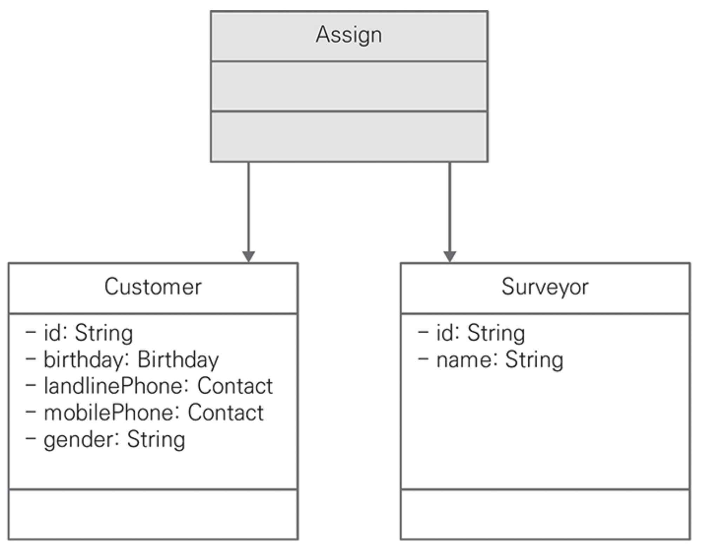
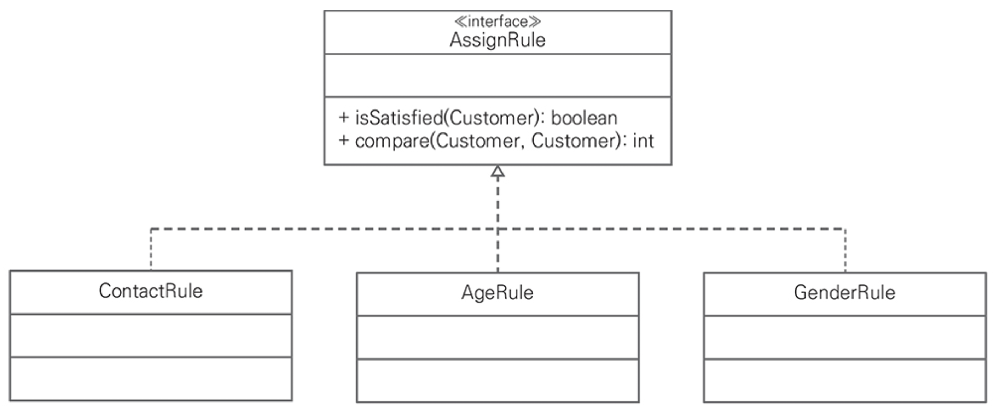

# CHAPTER 2. 객체지향 설계 원칙

## 책임 주도 설계

1️⃣ 책임 주도 설계

> 소프트웨어 설계는 일반적으로 `책임`, `역할`, `협력`으로 표현하는 책임 주도 설계라 부르는 접근 방법의 한 분야로
>
> 객체에 책임을 부여하는 것을 중요하게 여긴다.

아는 것(클래스의 속성)
- 캡슐화한 데이터를 아는 것
- 관련 객체에 대해 아는 것
- 자신이 유도하거나 계산할 수 있는 것에 대해 아는 것

하는 것(메소드)
- 객체 생성이나 계산과 같이 스스로 하는 것
- 다른 객체의 행동을 시작하게 하는 것
- 다른 객체의 행동을 제어/조정하는 것

## 단일 책임 원칙

> 클래스가 한 가지 일만 수행해야 하고 한 가지 이유에 의해서만 변경되도록 클래스를 설계하는 것

단일 책임 원칙을 준수하기 위해 여러 책임을 가진 클래스를 더 작은 클래스로 분할해 새로운 클래스를 추가하거나 연관돼 있는 속성을 하나의 클래스로 통합해야 한다.
- 아는 것을 여러 객체에 잘 분리하면 하는 것도 자연스럽게 분리돼 단일 책임 원칙을 준수할 수 있다.

<figure><figcaption></figcaption></figure>

```kotlin
class Assign {
    private lateinit var customer: Customer
    private lateinit var surveyor: Surveyor
}
```

## 개방/폐쇄 원칙

> 코드가 자유로우면서도 제한적이어야 한다

소프트웨어 엔티티는 확장에 대해서는 개방적이어야 하지만, 수정에 대해서는 폐쇄적이어야 한다.
- 확장에 대한 개방은 구현 클래스나 상속 클래스에 기능을 추가할 수 있어야 하고
- 수정에 대해 폐쇄는 인터페이스나 상위 클래스의 변화가 구현 클래스나 상속 클래스에 영향을 주지 않아야 함

<figure><figcaption></figcaption></figure>

```kotlin
interface AssignRule {
    fun isSatisfied(customer: Customer): Boolean
    fun compare(before: Customer, after: Customer): Int
}
```


## 리스코프 치환 원칙

## 인터페이스 분리 원칙

## 의존성 역전 원칙

## 모듈

## 요약