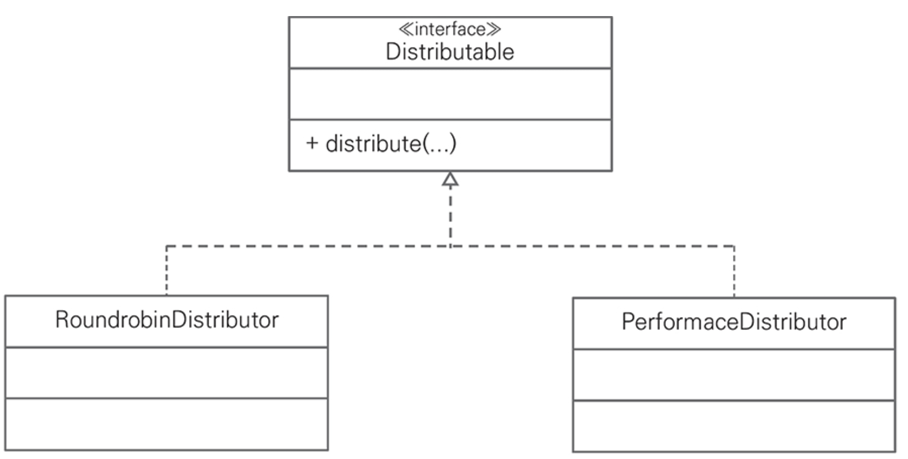
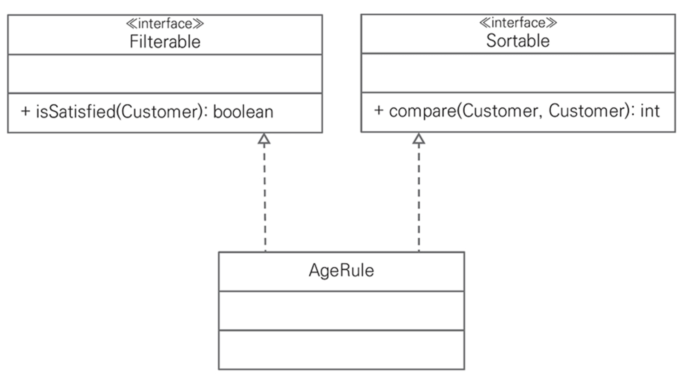
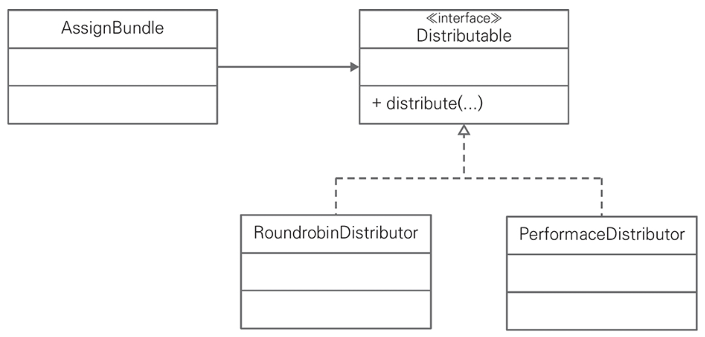
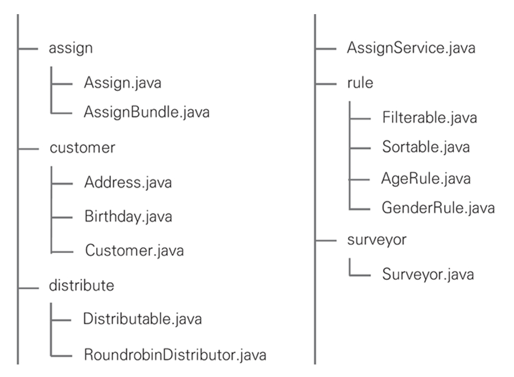

# CHAPTER 2. 객체지향 설계 원칙

## 책임 주도 설계

1️⃣ 책임 주도 설계

> 소프트웨어 설계는 일반적으로 `책임`, `역할`, `협력`으로 표현하는 책임 주도 설계라 부르는 접근 방법의 한 분야로
>
> 객체에 책임을 부여하는 것을 중요하게 여긴다.

아는 것(클래스의 속성)
- 캡슐화한 데이터를 아는 것
- 관련 객체에 대해 아는 것
- 자신이 유도하거나 계산할 수 있는 것에 대해 아는 것

하는 것(메소드)
- 객체 생성이나 계산과 같이 스스로 하는 것
- 다른 객체의 행동을 시작하게 하는 것
- 다른 객체의 행동을 제어/조정하는 것

## 단일 책임 원칙

> 클래스가 한 가지 일만 수행해야 하고 한 가지 이유에 의해서만 변경되도록 클래스를 설계하는 것

단일 책임 원칙을 준수하기 위해 여러 책임을 가진 클래스를 더 작은 클래스로 분할해 새로운 클래스를 추가하거나 연관돼 있는 속성을 하나의 클래스로 통합해야 한다.
- 아는 것을 여러 객체에 잘 분리하면 하는 것도 자연스럽게 분리돼 단일 책임 원칙을 준수할 수 있다.

<figure><figcaption></figcaption></figure>

```kotlin
class Assign {
    private lateinit var customer: Customer
    private lateinit var surveyor: Surveyor
}
```

## 개방/폐쇄 원칙

> 코드가 자유로우면서도 제한적이어야 한다

소프트웨어 엔티티는 확장에 대해서는 개방적이어야 하지만, 수정에 대해서는 폐쇄적이어야 한다.
- 확장에 대한 개방은 구현 클래스나 상속 클래스에 기능을 추가할 수 있어야 하고
- 수정에 대해 폐쇄는 인터페이스나 상위 클래스의 변화가 구현 클래스나 상속 클래스에 영향을 주지 않아야 함

<figure><figcaption></figcaption></figure>

```kotlin
interface AssignRule {
    fun isSatisfied(customer: Customer): Boolean
    fun compare(before: Customer, after: Customer): Int
}
```

## 리스코프 치환 원칙

> 클라이언트가 상속 클래스를 안정적으로 사용할 수 있는 구조를 설계하는데 도움

S가 기반타입 T의 서브타입이면 T 타입의 객체는 프로그램 실행에 문제를 일으키지 않고 S 타입의 객체로 치환이 가능해야 한다.

<figure><figcaption></figcaption></figure>

```kotlin
interface Distributable {
    fun distribute(
        customers: List<Customer>, 
        surveyors: List<Surveyor>
    ): List<Assign>
}
```

## 인터페이스 분리 원칙

> 너무 많거나 관계없는 오퍼레이션을 제공하는 인터페이스를 만들지 않게 제약

<figure><figcaption></figcaption></figure>

```kotlin
interface Filterable {
    fun isSatisfied(customer: Customer): Boolean
}

//

interface Sortable : Comparator<Customer>
```

## 의존성 역전 원칙

> 객체 설계에서 의존성 역전 원칙은 구체적인 클래스를 사용하는 방법을 클라이언트가 직접 알 필요가 없게 분리

<figure><figcaption></figcaption></figure>

```kotlin
class AssignBundle(
    private val filterables: Filterables,
    private val sortables: Sortables,
    private val distributable: Distributable
) {
    fun assign(customers: List<Customer>, surveyors: List<Surveyor>): List<Assign> {
        var filteredCustomers = filterables.filter(customers)
        filteredCustomers = sortables.sort(filteredCustomers)
        return distributable.distribute(filteredCustomers, surveyors)
    }
}

//

class AssignService(
    private val customerDao: CustomerDao,
    private val surveyorDao: SurveyorDao,
    private val assignDao: AssignDao,
    private val filterables: Filterables,
    private val sortables: Sortables,
    private val distributable: Distributable
) {
    fun assign() {
        val customers: List<Customer> = customerDao.selectAll()
        val surveyors: List<Surveyor> = surveyorDao.selectAll()

        val assignBundle = AssignBundle(filterables, sortables, distributable)
        val assigns: List<Assign> = assignBundle.assign(customers, surveyors)

        assignDao.insertAll(assigns)
    }
}

```

## 모듈

> 도메인 주도 설계에서 설명한 모듈을 활용하면 개별 클래스의 단순한 나열이 아닌 패키지 수준이서 개략적인 배정 비즈니스를 설명할 수 있습니다.

<figure><figcaption></figcaption></figure>

분배 알고리즘의 성능 개선이나 알고리즘을 다양하게 적용하기 위해 배포 단위로 분리하는 것도 고려할 수 있다.

## 요약



- **객체지향 설계**는 객체의 책임을 중요하게 생각한다.
- **객체의 기본 책임**은 아는 것(속성)과 하는 것(메소드)
- **단일 책임 원칙**은 한 객체가 아는 것과 하는 것을 제한해 응집도를 높인다.
- **개방 폐쇄 원칙**은 변하지 않는 부분과 변하는 부분을 분리해 기능을 확장할 때 도움을 준다.
- **리스코프 치환 원칙**은 필요할 때 구현 클래스나 상속 클래스를 교체해서 사용할 수 있게 한다.
  - 이 원칙은 계약 규칙과 가변성 규칙을 만족해야 한다.
- **인터페이스 분리 법칙**은 클라이언트에게 필요한 오퍼레이션만 제공하게 한정한다.
- **의존성 역전 원칙**은 클라이언트가 사용하는 객체에 직접 의존하지 않게 해 결합도는 낮춘다.

