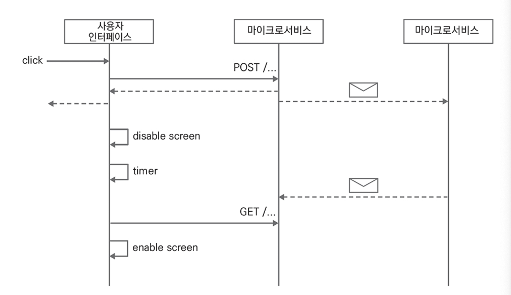

# CHAPTER 8. 사용자 인터페이스

> [Microsoft Inductive User Interface Guidelines](https://learn.microsoft.com/en-us/previous-versions/ms997506(v=msdn.10)?redirectedfrom=MSDN)

소프트웨어를 잘 사용하기 위해 사용자는 각 기능이나 화면이 제공하는 일반적인 절차에 익숙해 지는 시간이 필요하고, 사용자 인터페이스는 이 시간을 단축하기 위해 사용자가 원하는 것을 자연스럽게 안내하는 방향으로 설계해야 한다.
- 이벤트 소싱에서 이런 접근법을 `Task Based User Interface` 라고 한다.

이벤트 소싱을 적용하는 소프트웨어에서 고려해야 하는 사용자 인터페이스

.

👉🏻 **CRUD UI**

사용자 인터페이스는 사용자가 무엇을 할 수 있는지 명확하게 해 소프트웨어를 좀 더 쉽게 사용할 수 있게 유도해야 한다
- 기본적으로 목록과 상세를 제공하는 `CRUD UI`는 **모든 항목을 나열한 상세 화면을 제공**

.

👉🏻 **Task Based UI**

태스크 기반 UI는 CRUD UI와 비슷하지만 조금 다르게 접근
- 태스크 기반 UI는 모바일 환경에서 더 나은 사용자 경험을 제공
- 커맨드와 이벤트라는 시각에서 이벤트 소싱과 가장 잘 어울리는 접근법

.

👉🏻 **사용자 인터페이스와 커맨드**

태스크 기반 UI는 카트에 담긴 상품의 수량과 옵션 변경을 개별적인 커맨드로 분리하고 백엔드에 요청을 전달하고 Cart 애그리게이트에서 처리

## 사용자 인터페이스와 비동기 서비스

> 시스템은 사용자에게 요청한 비즈니스 트랜잭션이 완료되었음을 반드시 제공해야 하고, 다섯 가지 방법을 소개

### 화면 비활성화 후 새로고침

사용자가 버튼을 클릭하면 화면을 비활성화하고 명령의 완료 여부를 표시
- 이후 지정된 시간 동안 대기한 후 화면을 다시 로드해서 결과를 업데이트

<figure><figcaption></figcaption></figure>

## 스벨트와 비트

## 계좌 이체와 계좌 페이지

## 비동기 구현

## 마이크로 프론트엔드

## 요약
