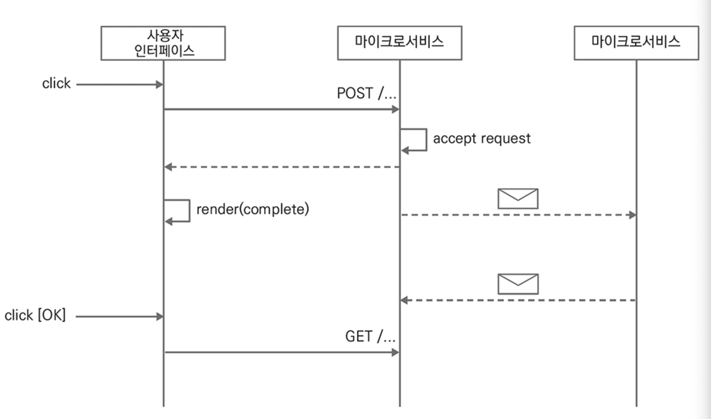
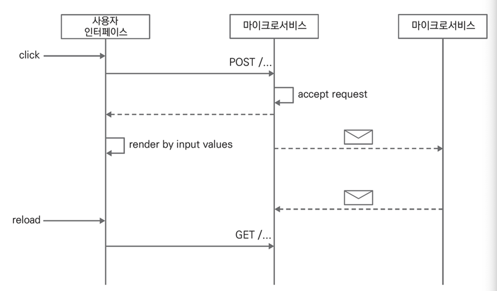
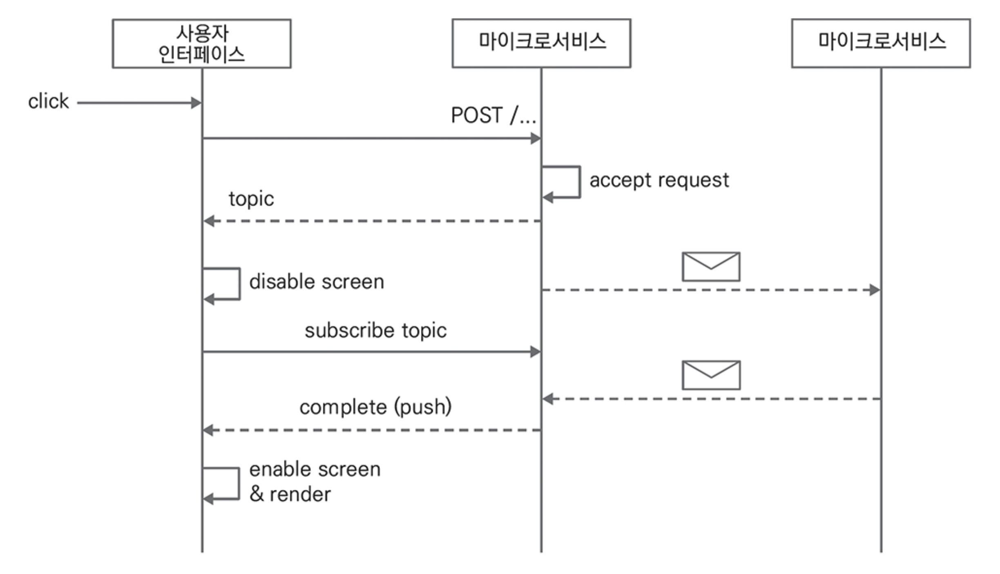
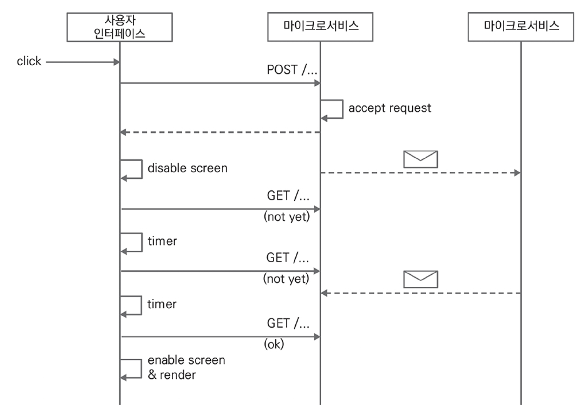
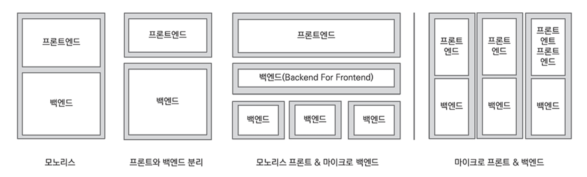
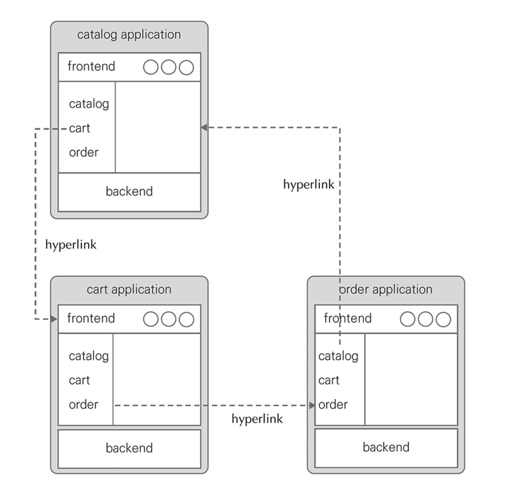
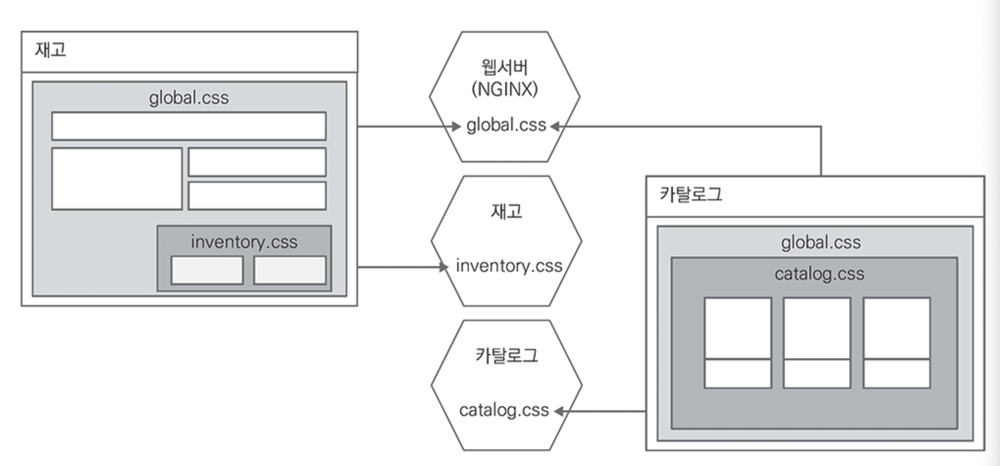
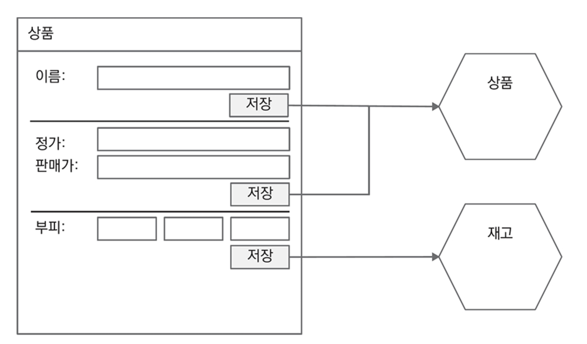
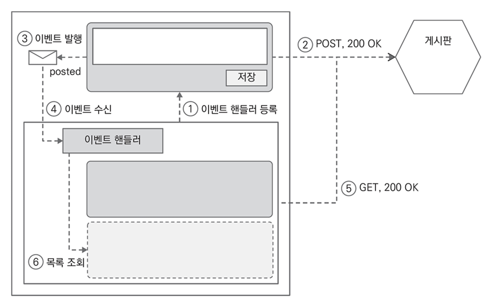
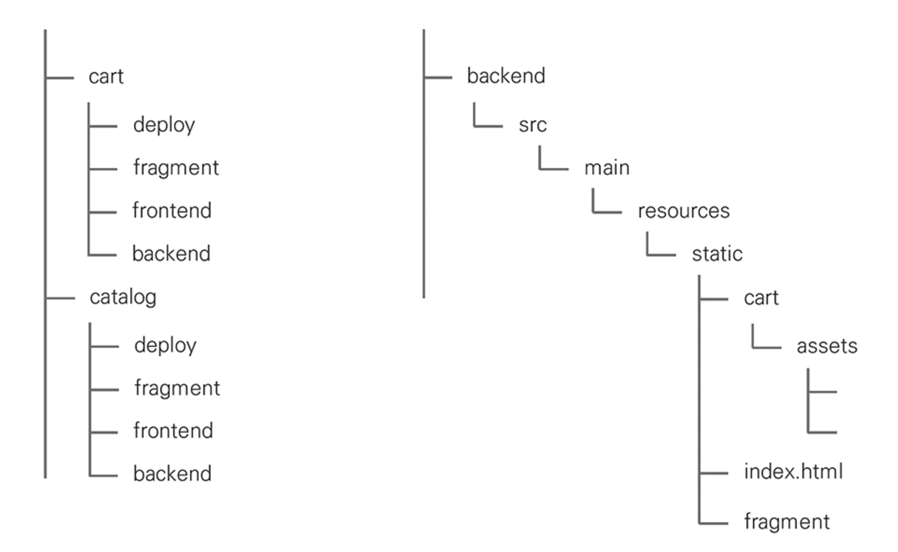

# CHAPTER 8. 사용자 인터페이스

> [Microsoft Inductive User Interface Guidelines](https://learn.microsoft.com/en-us/previous-versions/ms997506(v=msdn.10)?redirectedfrom=MSDN)

소프트웨어를 잘 사용하기 위해 사용자는 각 기능이나 화면이 제공하는 일반적인 절차에 익숙해 지는 시간이 필요하고, 사용자 인터페이스는 이 시간을 단축하기 위해 사용자가 원하는 것을 자연스럽게 안내하는 방향으로 설계해야 한다.
- 이벤트 소싱에서 이런 접근법을 `Task Based User Interface` 라고 한다.

이벤트 소싱을 적용하는 소프트웨어에서 고려해야 하는 사용자 인터페이스

.

👉🏻 **CRUD UI**

사용자 인터페이스는 사용자가 무엇을 할 수 있는지 명확하게 해 소프트웨어를 좀 더 쉽게 사용할 수 있게 유도해야 한다
- 기본적으로 목록과 상세를 제공하는 `CRUD UI`는 **모든 항목을 나열한 상세 화면을 제공**

.

👉🏻 **Task Based UI**

태스크 기반 UI는 CRUD UI와 비슷하지만 조금 다르게 접근
- 태스크 기반 UI는 모바일 환경에서 더 나은 사용자 경험을 제공
- 커맨드와 이벤트라는 시각에서 이벤트 소싱과 가장 잘 어울리는 접근법

.

👉🏻 **사용자 인터페이스와 커맨드**

태스크 기반 UI는 카트에 담긴 상품의 수량과 옵션 변경을 개별적인 커맨드로 분리하고 백엔드에 요청을 전달하고 Cart 애그리게이트에서 처리

## 사용자 인터페이스와 비동기 서비스

> 시스템은 사용자에게 요청한 비즈니스 트랜잭션이 완료되었음을 반드시 제공해야 하고, 다섯 가지 방법을 소개

### 화면 비활성화 후 새로고침

> 사용자가 버튼을 클릭하면 화면을 비활성화하고 명령의 완료 여부를 표시

- 이후 지정된 시간 동안 대기한 후 화면을 다시 로드해서 결과를 업데이트

<figure><figcaption></figcaption></figure>

### 확인(완료) 화면

> 사용자에게 '확인'또는 '감사합니다' 화면을 먼저 표시

- 비즈니스 트랜잭션을 완료하는 일반적인 지연 시간을 할당하고 사용자가 다른 화면으로 이동했을 때 최신 상태를 표시
- ex. 완료 -> 내역 보기 버튼 클릭 -> 내역

<figure><figcaption></figcaption></figure>

### 예상 결과 표시

> 사용자 인터페이스는 요청이 접수되었다는 응답을 받으면 새로운 읽기 모델의 상태 예상 가능

- 응답을 받았을 때 화면 변경을 예측할 수 있으므로 서버가 제공하는 조회 API를 호출하지 않고 프론트에서 화면을 직접 렌더링
- 구현에 시간이 조금 더 걸리지만 훨씬 더 자연스러운 사용자 경험을 제공
- ex. 새로운 메시지 트윗

<figure><figcaption></figcaption></figure>

### 이벤트 무시

>사용자 인터페이스는 요청을 보낸 후 화면을 비활성화시키고 기대하는 이벤트를 받을 때까지 유지

- 비즈니스 트랜잭션을 완료하ㅏ면 백엔드는 프론트에 완료 메시지를 보내고 프론트는 화면을 다시 활성화시키거나 지정 페이지로 이동
- 이벤트는 다른 개발 방법과 비교했을 때 오버 헤드가 있으므로 실시한 업데이트가 꼭 필요한 요구사항인지 확인이 필요
- 대표적인 구현 기술이 WebSocket, SSE(Server0Side Events)

<figure><figcaption></figcaption></figure>

### 타이머와 폴링

> 화면을 비활성화시키는 방법은 동일하지만 서버에서 완료 이벤트를 수신할 때까지 대기하지 않고 사용자 인터페이스에서 타이머를 이용해 쥑적으로 처리 상태를 확인

- 처리를 완료했으면 화면을 다시 활성화시키거나 다른 페이지로 이동
- 푸시와 비교 시 구현 난의도가 낮아 많이 사용하는 방법이지만 서버로 요청이 많은 단점이 존재

<figure><figcaption></figcaption></figure>

## 마이크로 프론트엔드

마이클 기어스의 프론트엔드 진화 과정과 함께 이상적인 배포 단위

**프론트엔드 구성과 배포 단위의 변화 과정**

<figure><figcaption></figcaption></figure>

- `마이크로 프론트엔드`는 단순히 컴포넌트 조합에 머물면서 거대한 모노리식 프론트를 만들지 않고 **하이퍼링크를 사용해 서로 연결**
- 하이퍼링크로 작은 마이크로 프론트엔드를 연결하면 백엔드와 마찬가지로 프론트엔드도 더 작은 단위를 독립적으로 배포 가능
- 프론트엔드도 독립적으로 배포할 수 있다면 백엔드와 프론트엔드를 하나의 배포 단위로 구성해 더 높은 응집도와 낮은 결합도를 가진 시스템을 구축

**마이크로 프론트엔드와 하이퍼링크**

<figure><figcaption></figcaption></figure>

- 프론트엔드 프로젝트를 빌드하면 dist 디렉토리에 번들 파일인 css, js, html, svg를 생성
- 이 번들 파일을 /resources/public에 복사해 백엔드와 프론트엔드를 하나의 배포 단위로 만들 수 있음

**글로벌 CSS와 덮어쓰기**

<figure><figcaption></figcaption></figure>

.

1️⃣ **단일 페이지 애플리케이션과 컴포넌트**

- 마이크로 프론트엔드는 페이지에서 상품 정보를 한번에 변경하지 않고 단일 속성이나 관련 속성을 그룹 단위로 변경
  - 변경 요청은 애그리게이트를 소유한 마이크로서비스가 직접 처리
  - 마이크로프론트엔드는 변경 요청뿐 아니라 페이지를 구성하는 상세 컴포넌트도 애그리게이트를 소유한 마이크로서비스가 제공하고 복합 화면은 컴포넌트를 임포트해서 구성

**페이지와 컴토넌트 조합**

<figure><figcaption></figcaption></figure>

.

2️⃣ **컴포넌트와 이벤트 프로그래밍**

**이벤트로 결합도 제거**

<figure><figcaption></figcaption></figure>

- 함수 의존성을 이벤트로 변경했을 때 컴포넌트간 협력
- 상단 컴포넌트에서 상품을 등록하면 웹 브라우저에 이벤트를 발행하고 이벤트를 수신한 이벤트 핸들러가 목록을 갱신

## 마이크로서비스와 형상 관리

백엔드와 프론트엔드를 단일 배포 단위로 통합하기 위해 형상 관리 도구에서 프론트와 백엔드를 하나의 프로젝트로 구성
- 웹 컴포넌트는 fragment 디렉토리로 구성

<figure><figcaption></figcaption></figure>

- 지속적인 통합과 배포 스크립트에서 `fragment`와 `frontend`를 순서대로 빌드하고, 번들 파일을 backend 프로젝트의 `/resources/public`으로 복사한 후 백엔드를 빌드
- 웹 컴포넌트는 `/resources/public/fragment`에 둬 다른 서비스가 실행 시간에 참조할 수 있게 함
- `deploy` 디렉토리는 도커 이미지 생성 및 푸시, 쿠버네티스 배포 등 CI/CD에 필요한 파일을 포함

## 요약



