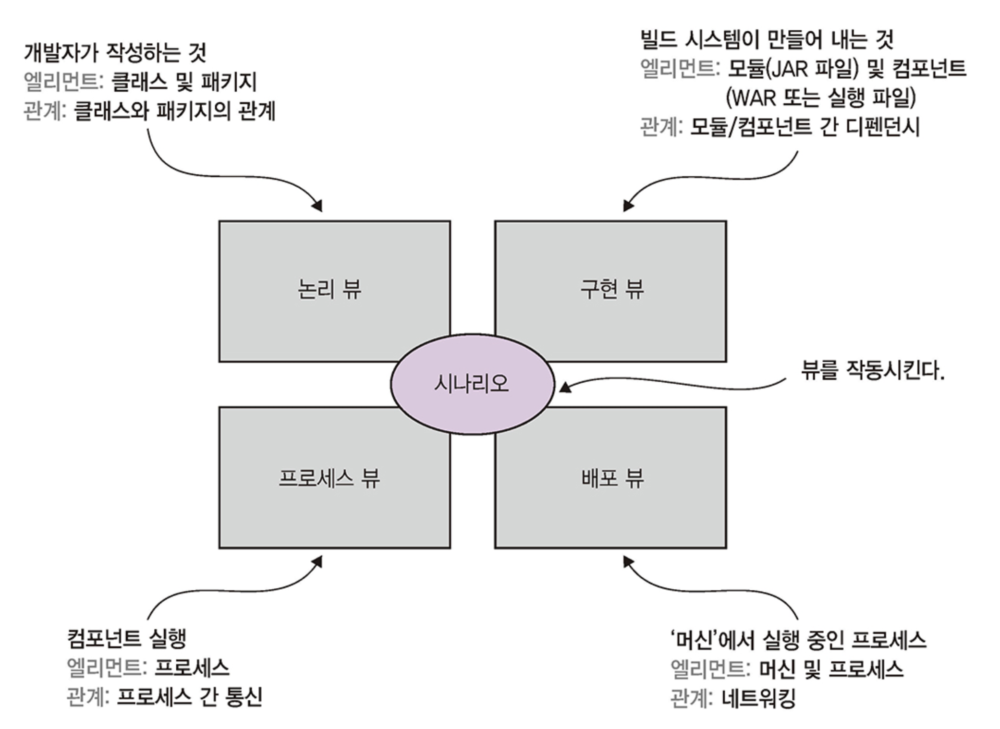
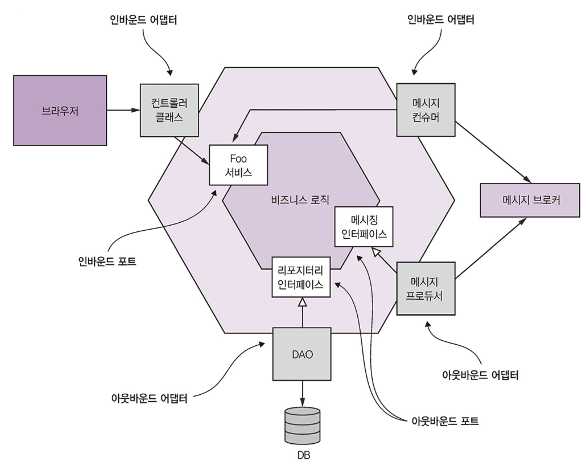
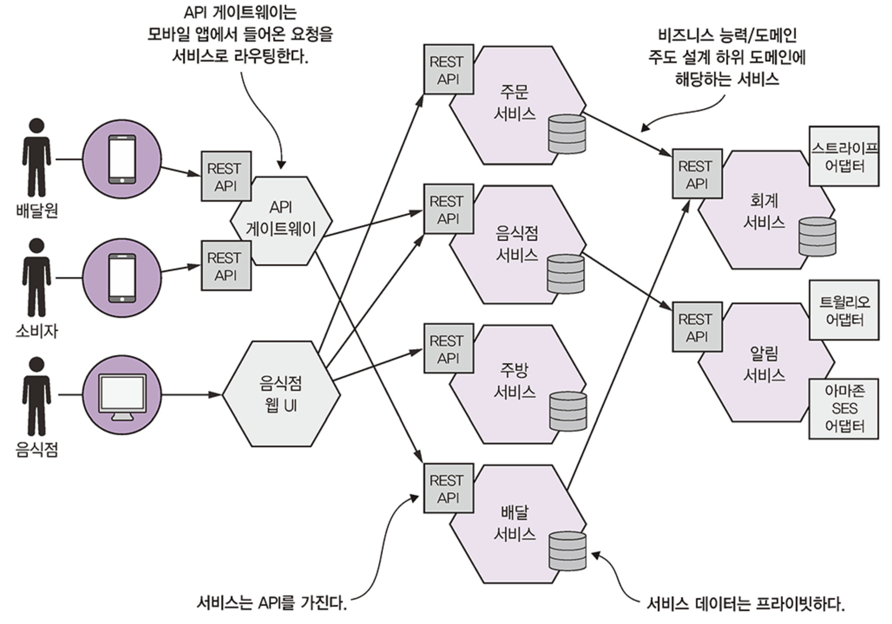
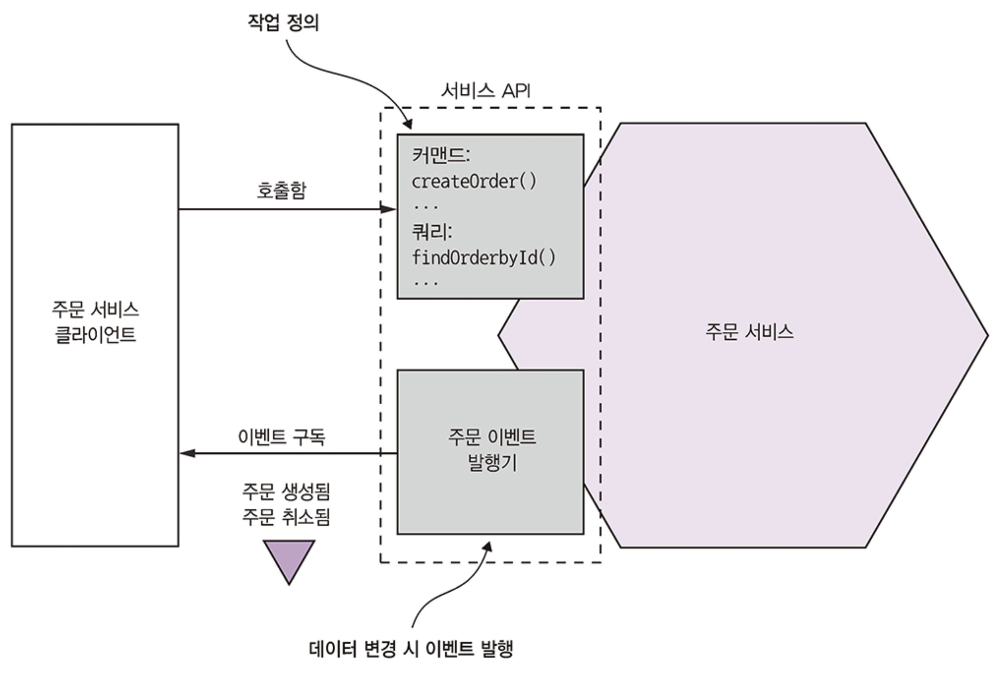

# Part 1. 모놀리식 지옥에서 벗어나라

**모놀리식 아키텍처의 장점**
- 개발이 간단하다: IDE 등 개발 툴은 단일 애플리케이션 구축에 초점이 맞추어져 있다.
- 애플리케이션을 쉽게 변경할 수 있다: 코드, DB 스키마를 변경해서 빌드/배포하기 용이하다.
- 테스트하기 쉽다: 개발자가 애플리케이션을 띄우고, REST API를 호출하고, 셀레늄으로 UI를 시험하는 종단 간 테스트를 작성합니다.
- 배포하기 쉽다: 개발자는 서버에 접속하여 톰캣 설치 경로에 WAR 파일을 복사하면 그만입니다.
- 확장하기 쉽다: 부하 분산기 뒷면에 애플리케이션 인스턴스를 여러 개 실행합니다.

**모놀리식 아키텍처의 단점**
- 너무 복잡해서 개발자가 주눅 들다.
- 개발이 더디다.
- 커밋부터 배포에 이르는 길고 험난한 여정.
- 확장하기 어렵다.
- 확실하게 전달하기 어렵다.
- 갈수록 한물간 기술 스택에 발목이 붙잡히다.

**마이크로서비스 아키텍처의 장점**
- 크고 복잡한 애플리케이션을 지속적으로 전달/배포할 수 있다.
  - 자동하 테스트
  - 독립적인 배포
  - 여러 기술 조직의 꾸림
- 서비스 규모가 작아 관리하기 쉽다.
- 서비스를 독립적으로 배포/확장할 수 있다.
- 마이크로서비스 아키텍처 덕분에 팀이 자율적으로 움직인다.
- 결함 격리가 잘 된다.
- 새로운 기술을 실험하고 도입하기 쉽다.

**마이크로서비스 아키텍처의 단점**
- 딱 맞는 서비스를 찾기 쉽지 않다.
- 분산 시스템은 너무 복잡해서 개발, 테스트, 배포가 어렵다.
- 여러 서비스에 걸친 기능을 배포할 때에는 잘 조정해야 한다.
- 마이크로서비스 아키텍처 도입 시점을 결정하기 어렵다.

## 마치며

- 모놀리식 아텍처 패턴은 애플리케이션을 하나의 배포 단위로 구성합니다.
- 마이크로서비스 아키텍처 패턴은 독립적으로 배포 가능하면서 자체 DB를 보유한 서비스들로 시스템을 분해합니다.
- 단순한 애플리케이션은 모놀리식 아키텍처가, 크고 복잡한 애플리케이션은 마이크로서비스 아키텍처가 더 적합한 선택입니다.
- 마이크로서비스 아키텍처를 채택하면 자율적인 소규모 팀들이 작업을 병행할 수 있어서 소프트웨어 개발 속도가 빠릅니다.
- 마이크로서비스 아키텍처는 만병통치약이 아닙니다. 복잡성을 비록하여 중요한 단점도 있습니다.
- 마이크로서비스 아키텍처 패턴 언어는 마이크로서비스 아키텍처로 애플리케이션을 설계할 때 유용한 패턴들의 모음집입니다. 패턴 언어는 마이크로서비스 아키텍처 도입 여부 결정 시 유용하며, 마이크로서비스 아키텍처를 효과적으로 적용하는 충실한 안내자입니다.
- 소프트웨어 전달 속도를 높이려면 마이크로서비스 아키텍처만으로는 부족합니다. 소프트웨어를 성공적으로 개발하려면 데브옵스 및 자율적인 소규모 팀들이 있어야 합니다.
- 마이크로서비스를 검토할 때 인간적인 측면도 고려해야 합니다. 직원들이 느끼는 감정도 충분히 반영되어야 성공적인 전환이 가능합니다.

# Part 2. 분해 전략

## 마이크로서비스 아키텍처란 무엇인가?

마이크로서비스 아키텍처의 핵심 사상은 `기능 분해`
- 대규모 단일 애플리케이션을 개발하는 대신 애플리케이션을 여러 서비스로 구정하자는 의미

### 소프트웨어 아키텍처의 정의와 중요성

**소프트웨어 아키텍처의 정의**

> 컴퓨팅 시스템의 소프트웨어 아키텍처는 소프트웨어 엘리먼트와 그들 간의 관계, 그리고 이 둘의 속성으로 구성된 시스템을 추론하는 데 필요한 구조의 집합이다.

- 핵심은 애플리케이션 아키텍처가 여러 파트(엘리먼트)로의 분해와 이런 파트 간의 관계(연관성)이라는 것

분해가 중요한 이유
- 업무와 지식의 분리로 전문 지식을 보유한 사람들이 함께 생산적으로 애플리케이션 작업을 할 수 있다.
- 소프트웨어 엘리먼트가 어떻게 상호 작용하는지 밝힌다.

.

**소프트웨어 아키텍처의 4+1 뷰 모델**
- 논리 뷰: 개발자가 작성한 소프트웨어 엘리먼트. 객체지향 언어라면 클래스, 패키지가 해당되며 결국 상속, 연관, 의존 등 클래스와 패키지의 관계를 말합니다.
- 구현 뷰: 빌드 시스템의 결과물, 모듈과 컴포넌트로 구성됩니다. 자바에서 모듈은 보통 JAR 파일, 컴포넌트는 WAR 파일이나 실행 가능한 JAR 파일입니다. 모듈 간 디펜던시와 컴포넌트/모듈 간 조합 관계도 이 뷰에 포함됩니다.
- 프로세스 뷰: 런타임 컴포넌트. 각 엘리먼트는 개별 프로세스고, IPC는 프로세스 간 관계를 나타냅니다.
- 배포 뷰: 프로세스가 머신에 매핑되는 방법. 이 뷰의 엘립먼트는 머신 및 프로세스고, 머신 간의 관계가 바로 네트워킹입니다. 프로세스와 머신 사이의 관계도 이 뷰에서 기술됩니다

<figure><figcaption></figcaption></figure>

### 아키텍처 스타일 개요

> 아키텍처 스타일은 체계적인 조직 관점에서 시스템 군을 정의한다. 
> 
> 아키텍처 스타일은 그 스타일로 만든 인스턴스에서 사용 가능한 컴포넌트와 커넥터의 용어집, 그리고 이들을 조합할 수 있는 제약 조건을 결정한다.

**계층화 아키텍처 스타일**
- 계층마다 명확히 정의된 역할을 분담하며, 계층 간 디펜던시는 아키텍처로 제한
- 어떤 계층은 바로 하위에 있는 계층에만 의존하거나, 하위에 위치한 어느 한 계층에 의존
- 3계층 아키텍처
  - 표현 계층: 사용자 인터페이스 또는 외부 API가 구현된 계층
  - 바즈니스 로직 계층: 비즈니스 로직이 구현된 계층
  - 영속화 계층: DB 상호 작용 로직이 구현된 계층
- 계층화 아키텍처의 문제점
  - 표현 계층이 하나뿐이다.
  - 영속화 계층이 하나뿐이다.
  - 비즈니스 로직 계층을 영속화 계층에 의존하는 형태로 정의한다.

**육각형 아키텍처 스타일**
- 논리 뷰를 비즈니스 로직 중심으로 구성하는 계층화 아키텍처 스타일의 대안
- 비즈니스 로직에는 하나 이상의 포트(자바라면 인터페이스)가 존재하고 포트 종류는 인바운드/아웃바운드 두 가지
  - 인바운드 포트: 비즈니스 로직이 표출된 API로 외부 애플리케이션은 이 API를 통해 비즈니스 로직을 호출(ex. 서비스 인터페이스)
  - 아웃바운드 포트: 비즈니스 로직이 외부 시스템을 호출하는 방법에 관한 것(ex. 리포지토리 인터페이스)
- 어댑터도 포트처럼 인바운드/아웃바운드 두 종류가 존재
  - 인바운드 어댑터: 외부에서 들어온 요청을 인바운드 포트를 호출해서 처리(ex. MVC Controller, Message Broker Client)
  - 아웃바운드 어댑터: 비즈니스 로직에서 들어온 요청을 외부 애플리케이션/서비스를 호출해서 처리(ex. DAO Class, Proxy Class, 이벤트 발행)

<figure><figcaption></figcaption></figure>

- 육각형 아키텍처 스타일의 가장 큰 장점은 비즈니스 로직에 있던 표현/데이터 접근 로직이 어댑터와 분리되었기 때문에 비즈니스 로직이 표현/데이터 접근 로직 어디에도 의존하지 않는다는 점
  - 비즈니스 로직만 따로 테스트하기 쉽고, 현대 애플리케이션 아키텍처(마이크로서비스)를 좀 더 정확하게 반영 가능

### 마이크로서비스 아키텍처는 일종의 아키텍처 스타일이다

모놀리식 아키텍처: 애플리케이션을 실행/배포 가능한 단일 컴포넌트로 구성한 아키텍처 스타일

마이크로서비스 아키텍처: 애플리케이션을 **느슨하게 결합된**, 독립적으로 배포 가능한 **여러 서비스로 구성한** 아키텍처 스타일

<figure><figcaption></figcaption></figure>

.

**서비스?**
- 어떤 기능이 구현되어 단독 배포가 가능한 소프트웨어 컴포넌트
- 클라이언트가 자신이 서비스하는 기능에 접근할 수 있도록 커맨드, 쿼리, 이벤트로 구성된 API를 제공
- 서비스 API는 내부 구현 상세를 캡슐화
- 대부분 육각형 아키텍처 형태

<figure><figcaption></figcaption></figure>

.

**느슨한 결합**
- 서비스 구현 코드를 감싼 API를 통해서만 상호작용하므로 클라이언트에 영향을 끼치지 않고 서비스 내부 구현 코드를 바꿀 수 있다.
- 유지보수성, 테스트성을 높이고 애플리케이션 개발 시간을 단축하는 효과가 있다.
- 개발자가 서비스를 이해하고, 변경하고, 테스트하기 더 쉽다.