# Part 3. 프로세스 간 통신

## 마이크로서비스 아키텍처 IPC 개요

서비스에 적용 가능한 IPC 기술은 선택의 폭이 넓다.
- HTTP 기반 REST나 gRPC 등 동기 요청/응답 기반의 통신 메커니즘도 있고, AMQP, STOMP 등 비동기 메시지 기반의 통신 메커니즘도 있다.
- 메시지 포맷 역시 JSON, XML 처럼 인간이 읽을 수 있는 텍스트 포맷부터 Avro, Protocol Buffer처럼 효율이 웃우한 이진 포맷까지 다양하다.

### 상호작용 스타일

서비스와 클라이언트 간의 상호작용은 일대일(One-to-one) 또는 일대다(One-to-many) 방식으로 구분  
또한, 상호작용은 동기(Synchronous) 또는 비동기(Asynchronous) 방식으로 나뉩니다.

<figure>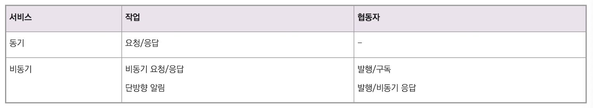<figcaption></figcaption></figure>

일대일 상호 작용의 종류
- 요청/응답: 클라이언트는 서비스에 요청을 하고 응답을 대기
  - 클라이언트는 응답이 제때 도착하리라 기대하고 대기 도중 블로킹
  - 결과적으로 서비스가 서로 강하게 결합되는 상호 작용 스타일
- 비동기 요청/응답: 클라이언트는 서비스에 요청을 하고 서비스는 비동기적으로 응답
  - 클라이언트는 대기 중 블로킹하지 않고, 서비스는 오랫동안 응답하지 않을 수 있음
- 단방향 알림: 클라이언트는 서비스에 일방적으로 요청만 하고 서비스는 응답을 보내지 않음

일대다 상호 작용의 종류
- 발행/구독: 클라이언트는 알림 메시지를 발행하고, 여기서 관심 있는 0개 이상의 서비스가 메시지를 소비
- 발행/비동기 응답: 클라이언트는 요청 메시지를 발행하고 주어진 시간 동안 관련 서비스가 응답하길 대기

### 마이크로서비스 API 정의

어떤 IPC를 선택하든, 서비스 API를 IDL(Interface Definition Language)로 정확하게 정의해야 합니다.
- 인터페이스 명세를 작성한 후 클라이언트 개발자와 함께 의논하는 과정의 되풀이

### API 발전시키기

API는 새 기능을 추가하거나 기존 기능을 변경/삭제하는 과정을 거치며 계속 변함
- 마이크로서비스 애플리케이션은 클라이언트를 다른 서비스 팀이 개발한 경우가 대부분이기 떄문에 서비스 API를 변경하기가 어려움
- 때문에 규칙적인 단계로 서비스를 업그레이드하여 신구 버전을 동시에 실행

마이크로서비스 기반 애플리케이션에서 서비스의 API를 변경하는 것은 훨씬 더 어렵습니다. 
- 서비스의 클라이언트는 종종 다른 팀에 의해 개발되거나 심지어 조직 외부의 다른 애플리케이션일 수 있습니다. 
- 일반적으로 모든 클라이언트를 서비스와 동시에 업그레이드하도록 강제할 수 없습니다. 
- 따라서 서비스의 이전 버전과 새 버전이 동시에 실행합니다.

API를 적절하게 버전 관리하고 통제된 방식으로 발전시키기 위한 목표

**시맨틱 버저닝(Semantic Versioning)**
- [시맨틱 버저닝 명세(Semantic Versioning specification)](http://semver.org)는 API 버저닝에 유용한 가이드
- 버전 번호는 `MAJOR`, `MINOR`, `PATCH` 세 부분으로 구성
- 각 부분은 다음과 같이 증가
  - MAJOR: API에 **호환되지 않는 변경(incompatible change)**을 가할 때
  - MINOR: **하위 호환성을 유지하는 개선 사항(backward-compatible enhancements)**을 가할 때
  - PATCH: **하위 호환성을 유지하는 버그 수정(backward-compatible bug fix)**을 가할 때
- REST API를 구현하는 경우, URL 경로의 첫 번째 요소로 주 버전을 사용할 수 있음 (ex. '/v1/…', '/v2/…')
- 메시징을 사용하는 서비스를 구현하는 경우, 게시하는 메시지에 버전 번호를 포함할 수 있음

**하위 호환성을 유지하는 사소한 변경(Minor, Backward-Compatible Changes)**
- 이상적으로는 **하위 호환성을 유지하는 변경(backward-compatible changes)**만 하도록 노력
- 하위 호환성을 유지하는 변경은 API에 대한 추가적인 변경 (ex. 요청에 선택적 속성 추가, 응답에 속성 추가, 새로운 작업 추가)
- 이러한 종류의 변경만 하는 경우, 오래된 클라이언트는 강건성의 원칙("당신이 하는 일에는 보수적이고, 다른 사람들이 하는 일에는 관대하라")을 준수하는 한 새로운 서비스와 함께 작동
- 서비스는 누락된 요청 속성에 대해 기본값을 제공해야 합니다. 마찬가지로, 클라이언트는 추가적인 응답 속성을 무시해야 합니다.
- JSON 및 XML과 같은 텍스트 기반 메시지 형식은 일반적으로 이러한 유형의 API 진화를 더 쉽게 만듭니다.

**호환되지 않는 주요 변경(Major, Breaking Changes)**
- 때로는 **중대한 대규모 변경**이 불가피할 수 있습니다.
- 클라이언트에게 즉시 업그레이드를 강제할 수 없으므로, 서비스는 일정 기간 동안 이전 버전과 새 버전을 동시에 지원해야 합니다.
- HTTP 기반 IPC 메커니즘(ex. REST)을 사용하는 경우, URL에 주 버전 번호를 포함하는 한 가지 접근 방식이 있습니다. 
  - 예를 들어, 버전 1 경로는 `/v1/…`으로 접두사가 붙고, 버전 2 경로는 `/v2/…`로 접두사가 붙습니다.
- 다른 옵션은 HTTP의 콘텐츠 협상 메커니즘을 사용하고 MIME 타입에 버전 번호를 포함하는 것입니다.
- API의 여러 버전을 지원하기 위해, 서비스의 어댑터는 이전 버전과 새 버전 간의 번역 로직을 포함하게 됩니다
- 또한, API 게이트웨이는 거의 확실히 버전 관리된 API를 사용할 것입니다. 심지어 여러 이전 버전의 API를 지원해야 할 수도 있습니다.

## 동기 RPI 패턴 응용 통신

원격 프로시저 호출(RPI) 기반 IPC 메커니즘을 사용할 때, 클라이언트는 서비스에 요청을 보내고 서비스는 요청을 처리한 후 응답을 다시 보냅니다. 
- 일부 클라이언트는 응답을 기다리는 동안 블로킹될 수 있고, 다른 클라이언트는 반응형 비블로킹 아키텍처를 가질 수 있습니다. 
- 그러나 메시징 사용 시와 달리, 클라이언트는 응답이 적시에 도착할 것이라고 가정합니다.

RPI의 동작 방식
- 클라이언트의 비즈니스 로직은 RPI 프록시 어댑터 클래스에 의해 구현된 프록시 인터페이스를 호출합니다. 
- RPI 프록시는 서비스에 요청을 보냅니다. 
- 요청은 서비스의 비즈니스 로직을 인터페이스를 통해 호출하는 RPI 서버 어댑터 클래스에 의해 처리됩니다. 
- 그런 다음 RPI 프록시로 회신을 보내고, RPI 프록시는 그 결과를 클라이언트의 비즈니스 로직으로 반환합니다.

선택할 수 있는 수많은 프로토콜이 있는데, 여기서는 `REST`와 `gRPC`를 설명합니다.
- 서비스의 가용성을 적절히 부분 실패를 처리하여 개선하는 방법과 RPI를 사용하는 마이크로서비스 기반 애플리케이션이 서비스 디스커버리 메커니즘을 사용해야 하는 이유를 다룹니다.

<figure>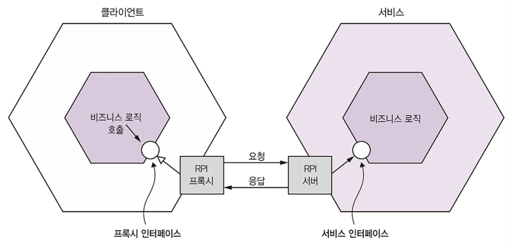<figcaption></figcaption></figure>

### 동기 RPI 패턴: REST

**Rest 성숙도 모델**

현재, RESTful 스타일로 API를 개발하는 것이 유행입니다. REST는 **HTTP를 사용하는 IPC 메커니즘**입니다.
- REST의 핵심 개념은 일반적으로 고객이나 제품과 같은 단일 비즈니스 객체 또는 비즈니스 객체의 컬렉션을 나타내는 리소스입니다. 
  - REST는 URL을 사용하여 참조되는 리소스를 조작하기 위해 HTTP 동사를 사용합니다.
- Leonard Richardson은 REST에 대한 매우 유용한 [성숙도 모델](http://martinfowler.com/articles/richardsonMaturityModel.html)을 정의했는데, 이는 다음과 같은 수준으로 구성됩니다.
  - **레벨 0**: 레벨 0 서비스의 클라이언트는 유일한 URL 엔드포인트에 HTTP POST 요청을 함으로써 서비스를 호출
    - 각 요청은 수행할 작업, 작업의 대상(ex. 비즈니스 객체), 그리고 모든 매개변수를 지정
  - **레벨 1**: 레벨 1 서비스는 리소스 개념을 지원합니다. 
    - 리소스에 대한 작업을 수행하기 위해 클라이언트는 수행할 작업과 모든 매개변수를 지정하는 POST 요청을 합니다.
  - **레벨 2**: 레벨 2 서비스는 HTTP 동사를 사용하여 작업을 수행합니다
    - 검색에는 GET, 생성에는 POST, 업데이트에는 PUT을 사용합니다. 
    - 요청 쿼리 매개변수와 본문은 작업의 매개변수를 지정합니다. 
    - 이를 통해 서비스는 GET 요청에 대해 캐싱과 같은 웹 인프라를 사용할 수 있습니다.
  - **레벨 3**: 레벨 3 서비스의 설계는 이름이 좋지 못한 HATEOAS(Hypertext As The Engine Of Application State) 원칙을 기반으로 합니다. 
    - 기본 아이디어는 GET 요청이 반환하는 리소스의 표현이 해당 리소스에 대한 작업을 수행하기 위한 링크를 포함한다는 것입니다. 
    - 예를 들어, 클라이언트는 주문을 검색한 GET 요청이 반환한 표현의 링크를 사용하여 주문을 취소할 수 있습니다. 
    - HATEOAS의 이점은 클라이언트 코드에 URL을 하드와이어링할 필요가 없다는 것입니다 .
    - <www.infoq.com/news/2009/04/hateoas-restful-api-advantages>

.

**REST API**

- REST API의 가장 인기 있는 IDL은 Swagger 오픈 소스 프로젝트에서 발전한 [Open API Specification](www.openapis.org)입니다.

.

**요청 한 번으로 많은 리소스를 가져오기 어렵다**

- API가 클라이언트가 리소스를 가져올 때 관련 리소스를 검색할 수 있도록 허용하는 해결책이 있습니다. 
- 예를 들어, 클라이언트는 `GET /orders/order-id-1345?expand=consumer`를 사용하여 주문과 그 소비자를 검색할 수 있습니다. 
- 이는 [GraphQL](http://graphql.org) 및 [Netflix Falcor](http://netflix.github.io/falcor/)와 같은 대체 API 기술의 인기를 증가시켰으며, 이들은 효율적인 데이터 페치를 지원하도록 설계되었습니다.

.

**REST의 장단점**

- REST 사용의 이점
  - 간단하고 친숙
  - Postman 플러그인과 같은 브라우저 내에서 또는 curl을 사용하여 명령줄에서 HTTP API를 테스트 가능
  - 요청/응답 스타일 통신을 직접 지원
  - HTTP는 물론 방화벽 친화적
  - 중간 브로커가 필요 없으므로 시스템 아키텍처가 단순
- REST 사용의 단점
  - 요청/응답 스타일 통신만 지원
  - 가용성이 감소. 클라이언트와 서비스는 메시지를 버퍼링하는 중개자 없이 직접 통신하므로, 교환이 이루어지는 동안 둘 다 실행 중이어야 함
  - 클라이언트는 서비스 인스턴스(들)의 위치(URL)를 알아야 함. 
    - 이는 현대 애플리케이션에서는 간단하지 않은 문제이므로 클라이언트는 서비스 인스턴스를 찾기 위해 서비스 디스커버리 메커니즘 사용 필요
    - 단일 요청으로 여러 리소스를 가져오는 것이 어려움
    - 여러 업데이트 작업을 HTTP 동사에 매핑하는 것이 어려움

### 동기 RPI 패턴: gRPC

이러한 문제를 피하는 IPC 기술은 [gRPC](www.grpc.io). 이는 크로스-언어 클라이언트 및 서버 작성을 위한 프레임워크
- `gRPC`는 바이너리 메시지 기반 프로토콜이며, 서비스 설계에 API-first 접근 방식을 취하도록 강요
  - **Protocol Buffers** 기반 IDL(Interface Definition Language)을 사용하여 `gRPC API`를 정의
  - **Protocol Buffer** 컴파일러를 사용하여 클라이언트 측 스텁과 서버 측 스켈레톤을 생성
  - 컴파일러는 Java, C#, NodeJS, GoLang을 포함한 다양한 언어용 코드를 생성 가능
  - 클라이언트와 서버는 HTTP/2를 사용하여 Protocol Buffers 형식의 바이너리 메시지를 교환
- gRPC API는 하나 이상의 서비스와 요청/응답 메시지 정의로 구성
  - 서비스 정의는 Java 인터페이스와 유사하며 강하게 타입이 지정된 메서드들의 컬렉션
  - 단순한 요청/응답 RPC 외에도 gRPC는 스트리밍 RPC를 지원
  - 서버는 클라이언트에 메시지 스트림으로 응답하거나, 메시지 스트림을 보낼 수 있음
- gRPC는 메시지 형식으로 **Protocol Buffers**를 사용
  - Protocol Buffers는 효율적이고 컴팩트한 바이너리 형식(태그된 형식)
  - Protocol Buffers 메시지의 각 필드는 번호가 매겨지고 타입 코드를 가짐
  - 메시지 수신자는 필요한 필드를 추출하고 인식하지 못하는 필드를 건너뛸 수 있음
  - 결과적으로 gRPC는 API가 하위 호환성을 유지하면서 진화할 수 있도록 지원

**gRPC의 장단점**
- gRPC 사용의 이점
  - 풍부한 업데이트 작업을 가진 API를 설계하는 것이 간단
  - 특히 큰 메시지를 교환할 때 효율적이고 컴팩트한 IPC 메커니즘
  - 양방향 스트리밍은 RPI 및 메시징 스타일 통신을 모두 가능
  - 다양한 언어로 작성된 클라이언트와 서비스 간의 상호 운용성을 가능하게 함
- gRPC 사용의 단점
  - JavaScript 클라이언트가 REST/JSON 기반 API보다 gRPC 기반 API를 소비하는 데 더 많은 작업이 필요
  - 오래된 방화벽은 HTTP/2를 지원하지 않을 수 있음

### 부분 실패 처리: 회로 차단기 패턴

* 분산 시스템에서는 서비스가 다른 서비스에 **동기식 요청**을 할 때마다 **부분 실패의 위험**이 항상 존재
  * 클라이언트와 서비스가 별도의 프로세스이기 때문에 서비스가 클라이언트의 요청에 적시에 응답하지 못할 수 있음
  * 서비스가 실패했거나 유지 보수 중이거나, 과부하로 인해 요청에 매우 느리게 응답할 수 있음
* 클라이언트가 응답을 기다리는 동안 **블로킹**되기 때문에, 실패가 클라이언트의 클라이언트로 연쇄적으로 확산되어 서비스 중단을 야기할 위험이 있음
* 부분 실패가 애플리케이션 전체로 확산되는 것을 방지하도록 서비스를 설계하는 것이 필수적. 해결책은 두 가지로 구성
  * 응답하지 않는 원격 서비스를 처리하기 위해 `RPI 프록시` 설계 필요
  * 실패한 원격 서비스에서 복구하는 방법을 결정

**견고한 RPI 프록시 설계**

* 패턴: [서킷 브레이커(Circuit breaker)](http://microservices.io/patterns/reliability/circuit-breaker.html) 연속 실패 횟수가 지정된 임계값을 초과한 후 타임아웃 기간 동안 호출을 즉시 거부하는 RPI 프록시
* 서비스가 다른 서비스를 동기적으로 호출할 때마다, Netflix가 설명한 접근 방식을 사용하여 자체를 보호
* `Hystrix`와 같은 라이브러리를 사용하는 것은 해결책의 일부일 뿐. 응답하지 않는 원격 서비스에서 서비스를 복구하는 방법을 사례별로 결정 필요
* 한 가지 옵션은 서비스가 단순히 클라이언트에게 오류를 반환하는 것
  * 다른 시나리오에서는 기본값이나 캐시된 응답과 같은 폴백 값을 반환하는 것이 합리적일 수 있음

### 서비스 디스커버리

하나의 서비스가 RPI를 사용하여 다른 서비스를 호출하려면 서비스 인스턴스의 네트워크 위치를 알아야 함.
- 표면적으로는 간단해 보이지만, 실제로는 어려운 문제
- 서비스 디스커버리 메커니즘의 사용이 필요

`서비스 디스커버리`는 개념적으로 매우 간단
- 핵심 구성 요소는 서비스 레지스트리이며, 이는 애플리케이션 서비스 인스턴스의 네트워크 위치 데이터베이스
- 서비스 디스커버리를 구현하는 한 가지 방법은 애플리케이션의 서비스와 클라이언트가 서비스 레지스트리와 상호 작용하는 것
- 이러한 서비스 디스커버리 접근 방식은 두 가지 패턴의 조합

서비스 레지스트리는 서비스 인스턴스를 추적 (클라이언트는 서비스 레지스트리를 쿼리해서 가용한 서비스 인스턴스의 네트워크 위치를 탐색)

<figure>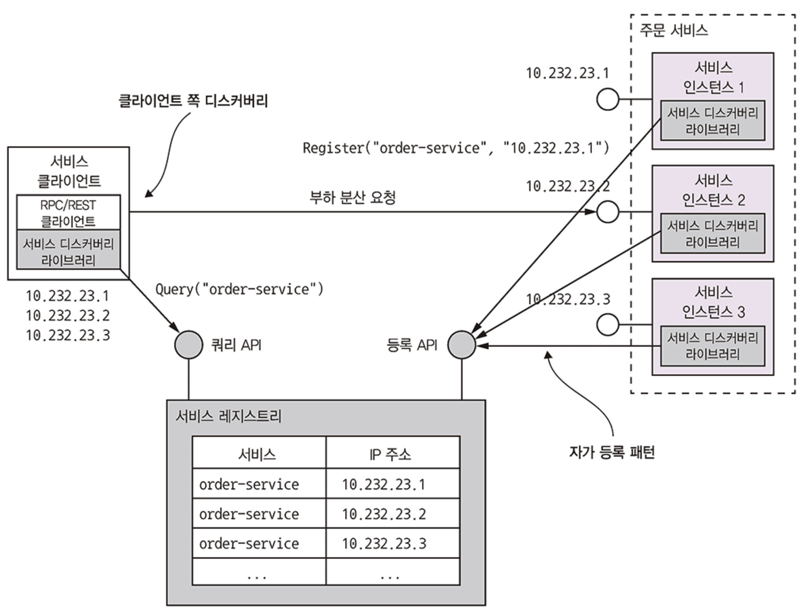<figcaption></figcaption></figure>

**첫 번째 패턴은 `자가 등록(Self registration) 패턴`**

- 서비스 인스턴스는 서비스 레지스트리의 등록 API를 호출하여 자신의 네트워크 위치를 등록
- 또한, 서비스 인스턴스가 정상 상태이며 요청을 처리할 수 있는지 주기적으로 확인하기 위해 서비스 레지스트리가 호출하는 API 엔드포인트인 상태 확인(Health check) URL을 제공 가능
- 서비스 레지스트리는 등록이 만료되는 것을 방지하기 위해 서비스 인스턴스가 주기적으로 "하트비트" API를 호출하도록 요구

**두 번째 패턴은 `클라이언트 쪽 디스커버리(Client-side discovery) 패턴`**

- 클라이언트는 서비스 레지스트리에서 사용 가능한 서비스 인스턴스 목록을 검색하고 그들 사이에서 로드 밸런싱을 수행
- http://microservices.io/patterns/client-side-discovery.html

.

**플랫폼에 내장된 서비스 디스커버리 패턴 적용**

<figure>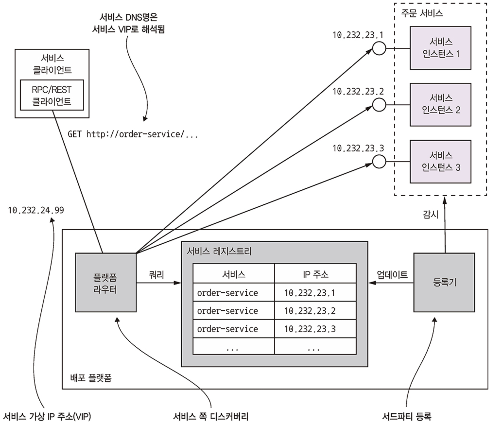<figcaption></figcaption></figure>

- Docker 및 Kubernetes와 같은 많은 최신 배포 플랫폼에는 서비스 레지스트리 및 서비스 디스커버리 메커니즘이 내장
  - 배포 플랫폼은 각 서비스에 DNS 이름, 가상 IP(VIP) 주소 및 VIP 주소로 확인되는 DNS 이름을 제공
  - 서비스 클라이언트는 DNS 이름/VIP에 요청을 하고, 배포 플랫폼은 사용 가능한 서비스 인스턴스 중 하나로 요청을 자동으로 라우팅
  - 결과적으로 서비스 등록, 서비스 디스커버리 및 요청 라우팅은 배포 플랫폼에서 전적으로 처리
  - 이러한 접근 방식은 두 가지 패턴의 조합
    - **제3자 등록(3rd party registration) 패턴**: 서비스가 서비스 레지스트리에 스스로 등록하는 대신, 일반적으로 배포 플랫폼의 일부인 레지스트라(registrar)라는 제3자가 등록을 처리
    - **서버 측 디스커버리(Server-side discovery) 패턴**: 클라이언트가 서비스 레지스트리에 쿼리하는 대신, 요청 라우터가 서비스 레지스트리에 쿼리하고 요청을 로드 밸런싱하는 DNS 이름으로 요청

## 비동기 메시징 패턴 응용 통신

### 메시징 개요

메시징 모델은 메시지 채널을 통해 메시지를 교환하는 것으로, 발신자는 메시지를 채널에 쓰고 수신자는 채널에서 메시지를 읽습니다.

**메시지**

- **메시지**는 메타데이터인 **헤더**와 전송되는 데이터인 **메시지 본문**으로 구성됩니다. 
- 헤더에는 고유 메시지 ID와 선택적 회신 주소가 포함될 수 있습니다.

**메시지 채널**

- **메시지 채널**은 두 가지 종류가 있습니다
  - **점대점 (point-to-point) 채널**: 메시지를 채널에서 읽는 **하나의 소비자**에게만 전달합니다. 서비스는 일대일 상호 작용 스타일에 점대점 채널을 사용합니다.
  - **발행-구독 (publish-subscribe) 채널**: 메시지를 채널에서 읽는 **모든 소비자**에게 전달합니다. 서비스는 일대다 상호 작용 스타일에 발행-구독 채널을 사용합니다.

<figure>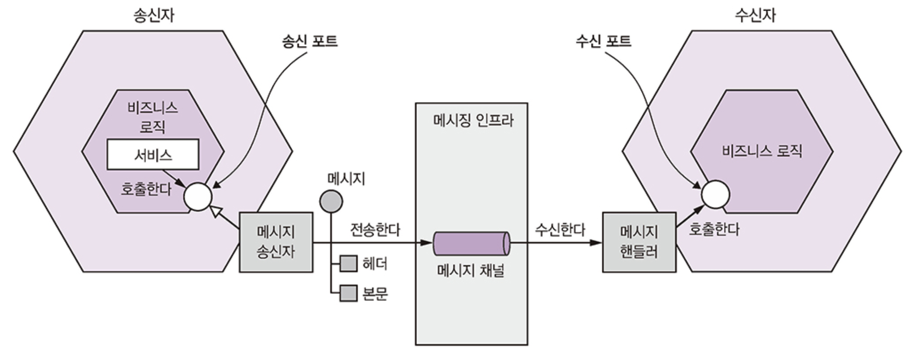<figcaption></figcaption></figure>

### 메시징 상호 작용 스타일 구현

**비동기 요청/응답 (Asynchronous request/response)**
- 클라이언트가 메시지를 보내고, 수신자가 메시지를 처리한 다음 지정된 회신 채널로 응답을 보냄으로써 구현됩니다. 
- 이 때 요청 메시지에 메시지 식별자와 회신 채널을 포함합니다.

<figure><figcaption></figcaption></figure>

**단방향 알림 (One-way notifications)**
- 서비스 클라이언트가 서비스로 요청을 보내지만 응답은 반환하지 않습니다.

**발행/구독 (Publish/subscribe)**
- 발신자가 이벤트를 발행하면 관심 있는 수신자가 해당 이벤트를 구독하여 처리합니다.

### 메시징 기반 서비스의 API 명세 작성

서비스의 비동기 API 사양은 메시지 채널의 이름, 각 채널을 통해 교환되는 메시지 유형 및 해당 형식을 지정해야 합니다.
- 서비스의 비동기 API는 메시지 채널, 커맨드, 응답, 이벤트 메시지 타입으로 구성

<figure>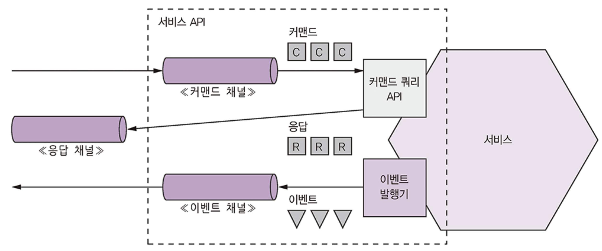<figcaption></figcaption></figure>

**비동기 작업 문서화**
- 서비스 작업은 두 가지 상호 작용 스타일 중 하나로 호출 가능
  - **요청/비동기 응답 스타일 API**: 널서비스의 커맨드 메시지 채, 서비스가 받는 커맨드 메시지의 타입과 포맷, 서비스가 반환하는 응답 메시지의 타입과 포멧
  - **단방향 알림 스타일 API**: 서비스의 커맨드 메시지 채널, 서비스가 받는 커맨드 메시지의 타입과 포맷

### 메시지 브로커 사용

**메시지 브로커**는 모든 메시지가 흐르는 중개자입니다. 
* 메시지 브로커를 사용하면 발신자가 소비자의 네트워크 위치를 알 필요가 없고, 브로커가 소비자가 메시지를 처리할 수 있을 때까지 메시지를 버퍼링한다는 장점이 있습니다.

<figure>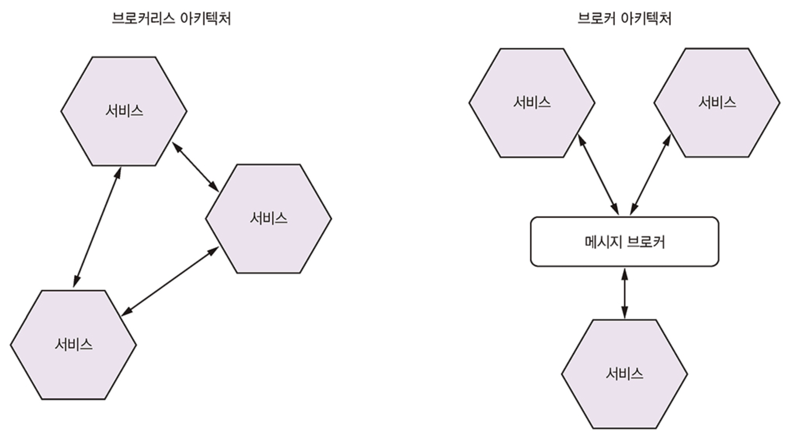<figcaption></figcaption></figure>

* 각 메시지 브로커는 메시지 채널 개념을 다르게 구현합니다 (ex. JMS 큐/토픽, Apache Kafka 토픽, AMQP 익스체인지/큐).
* **메시징의 장점**: 유연한 통신을 지원하고, RPC 기반 메커니즘과 달리 **프로세스 간 통신**을 명시적으로 만듭니다.
* **메시징의 단점**: 메시지 브로커가 **성능 병목**이 될 수 있고, **단일 실패 지점**이 될 수 있으며, **추가적인 운영 복잡성**이 발생합니다.

### 수신자 경합과 메시지 순서 유지

메시지 수신자의 스케일 아웃과 메시지 순서 유지를 동시에 달성하기 위한 해결책은 **샤드(파티션된) 채널**을 사용하는 것입니다.  
발신자는 메시지 헤더에 샤드 키를 지정하고, 메시지 브로커는 이를 사용하여 메시지를 특정 샤드/파티션에 할당합니다.

<figure>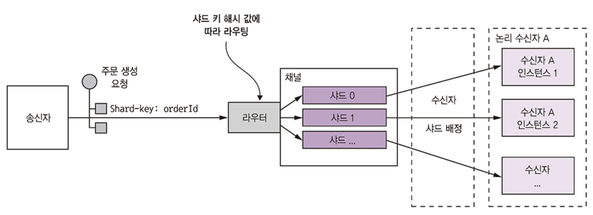<figcaption></figcaption></figure>

1. 샤딩된 채널은 복수의 샤드로 구성되며, 각 샤드는 채널처럼 작동
2. 송신자는 메시지 헤터에 샤드 키(보통 무작위 문자열 또는 바이트)를 지정
   * 메시지 브러커는 메시지를 샤드 키별로 샤드/파티션에 배정
   * ex. 샤드 키 해시 값을 샤트 개수로 나눈 나머지를 계산해서 샤드를 선택
3. 메시징 브러커는 여러 수신자 인스턴스를 묶어 마치 동일한 논리 수신자처럼 취급(컨슈머 그룹)
   * 메시지 브로커는 각 샤드를 하나의 수신자에 배정하고, 수신자가 시동/종료하면 샤드를 재배정

### 중복 메시지 처리

대부분의 메시지 브로커는 **최소 한 번 (at least once)** 메시지 전달을 보장합니다.  

해결책으로는 **멱등성 (idempotent) 메시지 핸들러**를 작성하는 것이 있습니다. 
- 멱등성 애플리케이션 로직은 동일한 입력 값으로 여러 번 호출되어도 추가적인 효과가 없습니다.

다른 해결책은 **메시지 소비자가 처리된 메시지의 ID를 추적하고 중복을 폐기**하는 것입니다.

<figure>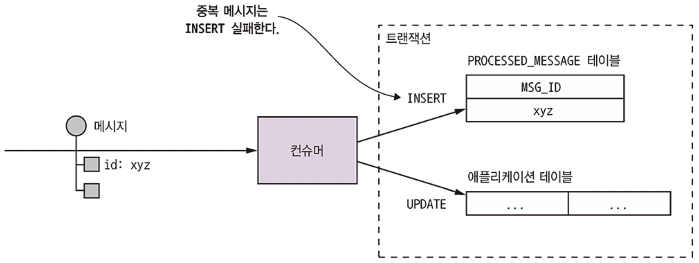<figcaption></figcaption></figure>

### 트랜잭셔널 메시징

서비스가 데이터베이스 업데이트와 메시지 전송을 **하나의 트랜잭션**으로 처리해야 합니다.
* 분산 트랜잭션은 현대 애플리케이션에 적합하지 않으므로, 애플리케이션은 다른 메커니즘을 사용해야 합니다.

**트랜잭션 아웃박스 (Transactional Outbox) 패턴**: 

* 데이터베이스 테이블을 임시 메시지 큐로 사용하여, 데이터베이스 트랜잭션의 일부로 메시지를 OUTBOX 테이블에 삽입합니다. 
* 이는 로컬 ACID 트랜잭션으로 원자성을 보장합니다.

<figure>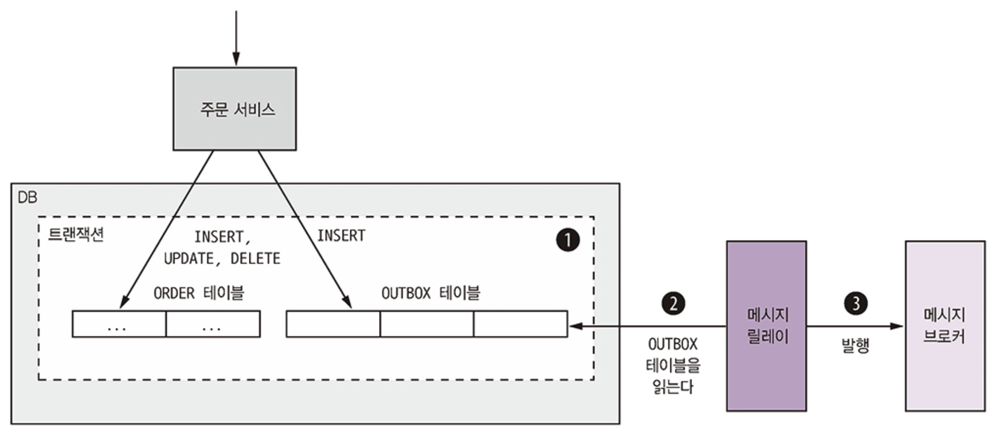<figcaption></figcaption></figure>

**트랜잭션 로그 테일링 (Transaction Log Tailing)**: 

* 데이터베이스 트랜잭션 로그를 읽고 각 관련 로그 항목을 메시지로 변환하여 메시지 브로커에 발행하는 방법입니다.

<figure>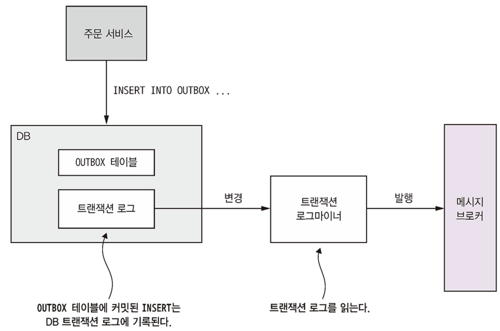<figcaption></figcaption></figure>

*   **메시징 라이브러리 및 프레임워크 (3.3.8)**:
    *   메시지 브로커의 클라이언트 라이브러리를 직접 사용하는 것은 비즈니스 로직과 메시지 브로커 API를 결합하고 저수준 상용구 코드를 반복적으로 작성해야 하는 문제가 있습니다.
    *   **Eventuate Tram 프레임워크**는 트랜잭션 메시징 기능을 제공하며, 메시지를 트랜잭션 방식으로 보내고 받는 저수준 API와 도메인 이벤트 발행 및 명령 전송/처리를 위한 고수준 API를 제공합니다. 이 프레임워크는 또한 중복 메시지 감지 및 폐기를 지원합니다.