# Part 4. 트랜잭션 관리: 사가

마이크로서비스 아키텍처에서 트랜잭션 관리가 어려운 이유와 기존 분산 트랜잭션 관리 방식을 사용할 수 없는 이유에 대한 설명  
그리고 사가로 데이터 일관성을 유지하는 방법을 살펴본 후, 사가를 편성하는 두 가지 기법을 소개
- 중앙 제어 장치 없이 참여자가 각자 서로 이벤트를 교환하는 `코레오그래피`
- 중앙 제어 장치가 참여자가 해야 할 일을 지시하는 방식인 `오케스트레이션`

## 마이크로서비스 아키텍처에서의 트랜잭션 관리

### 분산 트랜잭션의 필요성

단일 데이터베이스를 사용하는 모놀리식 애플리케이션에서는 트랜잭션 관리가 비교적 간단합니다.
- 하지만 마이크로서비스 아키텍처에서는 각 서비스가 자체 데이터베이스를 소유하기 때문에, 하나의 시스템 작업이 여러 서비스에 걸쳐 데이터를 업데이트해야 할 때 데이터 일관성을 유지하는 메커니즘이 필요합니다.
- 예를 들어, createOrder() 작업은 소비자 서비스, 주문 서비스, 주방 서비스, 회계 서비스 등 여러 서비스의 데이터를 읽고 업데이트해야 합니다.

### 분산 트랜잭션의 문제점

전통적인 해결책인 2단계 커밋(Two-Phase Commit, 2PC) 기반의 분산 트랜잭션 메커니즘은 현대 애플리케이션에 적합하지 않습니다.
- 분산 시스템에서 일관성(Consistency), 가용성(Availability), 분할 허용(Partition tolerance) 중 오직 두 가지만 선택할 수 있다는 **CAP 정리(CAP theorem)**에 따르면, 
- 현대 아키텍트들은 **일관성보다 가용성을 선호하는 경향**이 있습니다. 이는 2PC와 같은 강력한 일관성 모델이 가용성을 저해할 수 있기 때문입니다.

### 사가(Saga) 패턴을 통한 데이터 일관성 유지

사가는 분산 트랜잭션을 사용하지 않고 마이크로서비스 아키텍처에서 데이터 일관성을 유지하는 메커니즘입니다.
- 각 사가는 여러 서비스에 걸쳐 데이터를 업데이트해야 하는 시스템 명령에 대해 정의됩니다.
- 사가는 일련의 로컬 트랜잭션으로 구성되며, 각 로컬 트랜잭션은 **단일 서비스 내에서 ACID 트랜잭션 프레임워크를 사용하여 데이터를 업데이트**합니다.
- 하나의 로컬 트랜잭션이 완료되면 다음 로컬 트랜잭션의 실행을 **비동기 메시징을 통해 트리거**합니다. 
  - 이는 참여 서비스 중 **하나가 일시적으로 사용 불가능하더라도 사가 전체가 완료되도록 보장**합니다.

<figure>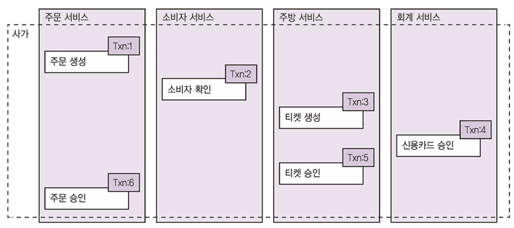<figcaption></figcaption></figure>

주문 생성 사가는 6개의 로컬 트랜잭션으로 구성
- (1) 주문 서비스: 주문을 APPROVAL_PENDING 상태로 생성
- (2) 소비자 서비스: 주문 가능한 소비자인지 확인
- (3) 주방 서비스: 주문 내역을 확인하고 티켓을 CREATE_PENDING 상태로 생성
- (4) 회계 서비스: 소비자 신용카드를 승인
- (5) 주방 서비스: 티켓 상태를 AWAITING_ACCEPTANCE로 변경
- (6) 주문 서비스: 주문 상태를 APPROVED로 변경

**사가는 보상 트랜잭션으로 변경분을 롤백**

- 사가는 ACID 트랜잭션과 달리 **격리성(Isolation) 속성이 부족**합니다.
- 각 로컬 트랜잭션이 변경 사항을 즉시 커밋하기 때문에, 오류 발생 시 **사가의 변경 사항을 되돌리기 위해 보상 트랜잭션**(Compensating Transactions)을 명시적으로 실행해야 합니다.
  - 예를 들어, "주문 생성 사가(Create Order Saga)"는 여러 서비스의 로컬 트랜잭션으로 구성되며, 신용 카드 승인이 실패하면 이전 단계에서 수행된 변경을 되돌리는 보상 트랜잭션을 실행합니다. 
  - 보상 트랜잭션은 순방향 트랜잭션과 역순으로 실행됩니다.
- 사가의 트랜잭션은 세 가지 유형으로 분류될 수 있습니다.
  - **보상 가능한 트랜잭션(Compensatable Transactions)**: 실패할 가능성이 있는 단계 다음에 있는 1~3번째 단계
  - **피봇 트랜잭션(Pivot Transaction)**: 절대로 실패하지 않는 단계 다음에 있는 4단계
  - **재시도 가능한 트랜잭션(Retriable Transactions)**: 항상 성공하는 5~6단계

<figure>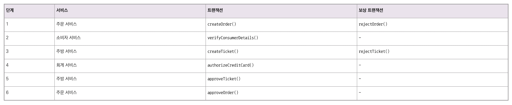<figcaption></figcaption></figure>

**소비자의 신용카드 승인이 실패하면 실행되는 보상 트랜잭션 순서**
- (1) 주문 서비스: 주문을 APPROVAL_PENDING 상태로 생성
- (2) 소비자 서비스: 주문 가능한 소비자인지 확인
- (3) 주방 서비스: 주문 내역을 확인하고 티켓을 CREATE_PENDING 상태로 생성
- (4) 회계 서비스: 소비자의 신용카드 승인 요청이 거부
- (5) 주방 서비스: 티켓 상태를 CREATE_REJECTED로 변경
- (6) 주문 서비스: 주문 상태를 REJECTED로 변경

## 사가 편성

사가는 분산 트랜잭션 대신 여러 서비스에 걸쳐 데이터를 업데이트하는 일련의 로컬 트랜잭션으로 구성됩니다.  
사가 조정에는 크게 두 가지 방식이 있습니다
- **코레오그래피(Choreography)**: 의사 결정과 순서화를 사가 참여자에게 맡긴다. 사가 참여자는 주로 이벤트 교환방식으로 통신
- **오케스트레이션(Orchestration)**: 사가 편성 로직을 사가 오케스트레이터에 중앙화. 사가 오케스트레이터는 사가 참여자에게 커맨드 메시지를 보내 수행할 작업을 지시

### 코레오그래피 기반 사가 (Choreography-based Sagas)

<figure>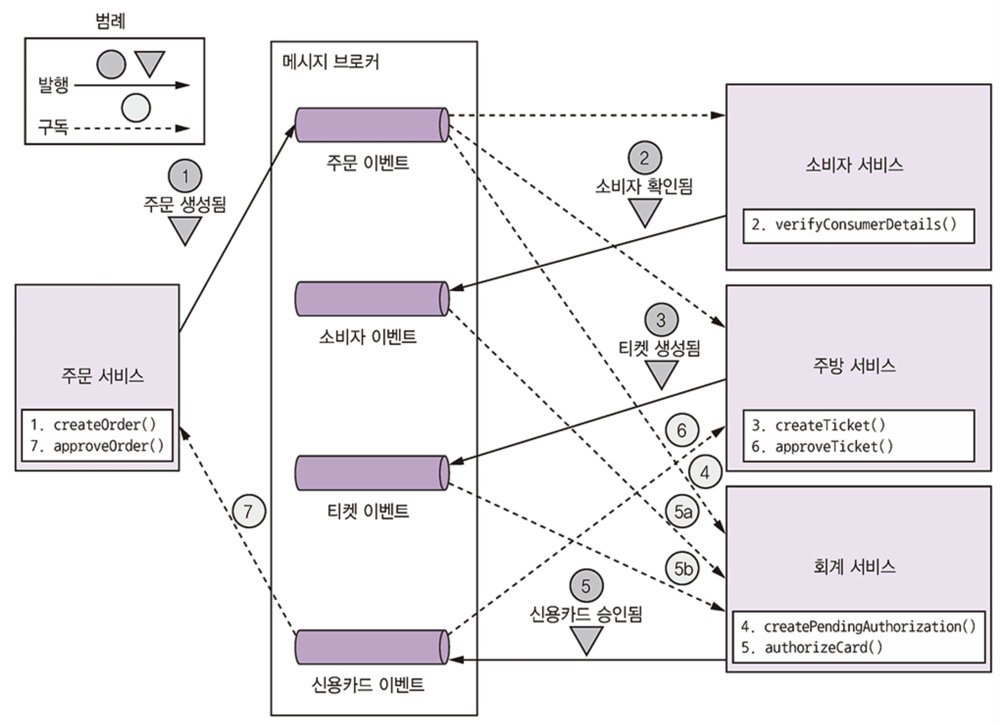<figcaption></figcaption></figure>

**코레오그래피 스타일의 주문 생성 사가 이벤트 순서**
- (1) 주문 서비스: 주문을 APPROVAL_PENDING 상태로 생성 -> 주문 생성 이벤트를 발행
- (2) 소비자 서비스: 주문 생성 이벤트 수신 -> 주문 가능한 소비자인지 확인 -> 소비자 확인 이벤트 발행
- (3) 주방 서비스: 주문 생성 이벤트 수신 -> 주문 내역을 확인 -> 티켓을 CREATE_PENDING 상태로 생성 -> 티켓 생성 이벤트 발행
- (4) 회계 서비스: 주문 생성 이벤트 수신 -> 신용카드 승인을 PENDING 상태로 생성
- (5) 주방 서비스: 신용카드 승인 이벤트 수신 -> 티켓 상태를 AWAITING_ACCEPTANCE로 변경
- (6) 주문 서비스: 신용카드 승인됨 이벤트 수신 -> 주문 상태를 APPROVED로 변경 -> 주문 승인됨 이벤트 발행

<figure>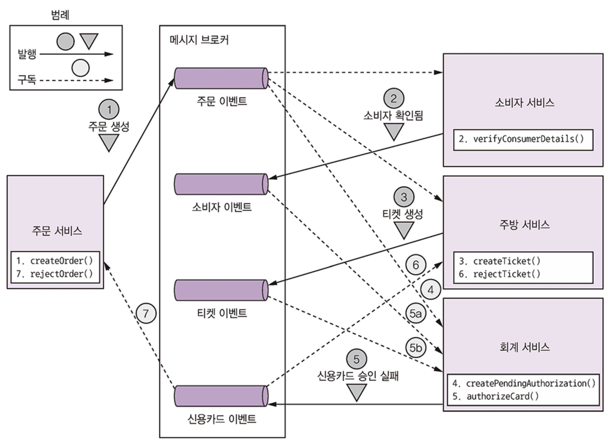<figcaption></figcaption></figure>

**회계 서비스에서 소비자 신용카드가 승인 거부된 경우 이벤트 순서**
- (1) 주문 서비스: 주문을 APPROVAL_PENDING 상태로 생성 -> 주문 생성 이벤트를 발행
- (2) 소비자 서비스: 주문 생성 이벤트 수신 -> 주문 가능한 소비자인지 확인 -> 소비자 확인 이벤트 발행
- (3) 주방 서비스: 주문 생성 이벤트 수신 -> 주문 내역을 확인 -> 티켓을 CREATE_PENDING 상태로 생성 -> 티켓 생성 이벤트 발행
- (4) 회계 서비스: 주문 생성 이벤트 수신 -> 신용카드 승인을 PENDING 상태로 생성
- (5) 회계 서비스: 티켓 생성 및 소비자 확인 이벤트 수신 -> 소비자 신용카드 과금 -> 신용카드 승인 실패 이벤트 발행
- (6) 주방 서비스: 신용카드 승인 실패 이벤트 수신 -> 티켓 상태를 REJECTED로 변경
- (7) 주문 서비스: 신용카드 승인 실패 이벤트 수신 -> 주문 상태를 REJECTED로 변경

**중앙 집중식 조정자 없음**:
- 코레오그래피는 사가 참가자들이 서로의 이벤트를 구독하고 그에 따라 반응함으로써 사가를 구현하는 방식입니다. 별도의 중앙 조정자(coordinator)가 존재하지 않습니다.

**이벤트 기반 통신**: 
- 각 참가 서비스는 로컬 트랜잭션을 완료한 후 다음 로컬 트랜잭션의 실행을 **비동기 메시징**을 통해 트리거하는 이벤트를 발행합니다.
- 예를 들어, 주문 생성 사가(Create Order Saga)에서 주문 서비스가 `OrderCreated` 이벤트를 발행하면, 고객 서비스와 주방 서비스가 이를 소비하고 각자의 로컬 트랜잭션을 수행한 뒤 새로운 이벤트를 발행하여 다음 단계를 트리거합니다.

**신뢰할 수 있는 통신**: 
- 참가 서비스가 데이터베이스를 업데이트하고 이벤트를 발행하는 과정은 **트랜잭션 메시징**을 사용하여 원자적으로 이루어져야 합니다. 
- 메시지 브로커는 수신 서비스가 일시적으로 사용 불가능하더라도 메시지를 버퍼링하여 사가가 완료되도록 보장합니다.

**상관 관계 ID(Correlation ID)**: 
- 사가 참가자는 수신한 이벤트를 자신의 데이터와 매핑하기 위해 상관 관계 ID를 사용해야 합니다. 
- 예를 들어, `orderId`는 사가 참가자 간에 전달되어 관련 주문을 식별하는 데 사용될 수 있습니다.

.

**코레오그래피 사가의 장단점**
- **장점**: 
  - 구현이 비교적 간단하고 서비스 간의 **느슨한 결합(loose coupling)**을 유지하는 데 도움됩니다.
- **단점**:
  - **순환 종속성(Cyclic dependencies)**: 서비스들이 서로의 이벤트를 구독하면서 종종 순환 종속성을 생성할 수 있습니다
  -**강한 결합 위험**: 각 사가 참가자가 자신에게 영향을 미치는 모든 이벤트를 구독해야 하므로, 주문 서비스가 구현하는 주문 생명주기에 따라 회계 서비스 등이 밀접하게 업데이트되어야 하는 결합 위험이 있습니다. 복잡한 사가에는 적합하지 않을 수 있습니다.

### 오케스트레이션 기반 사가 (Orchestration-based Sagas)

<figure>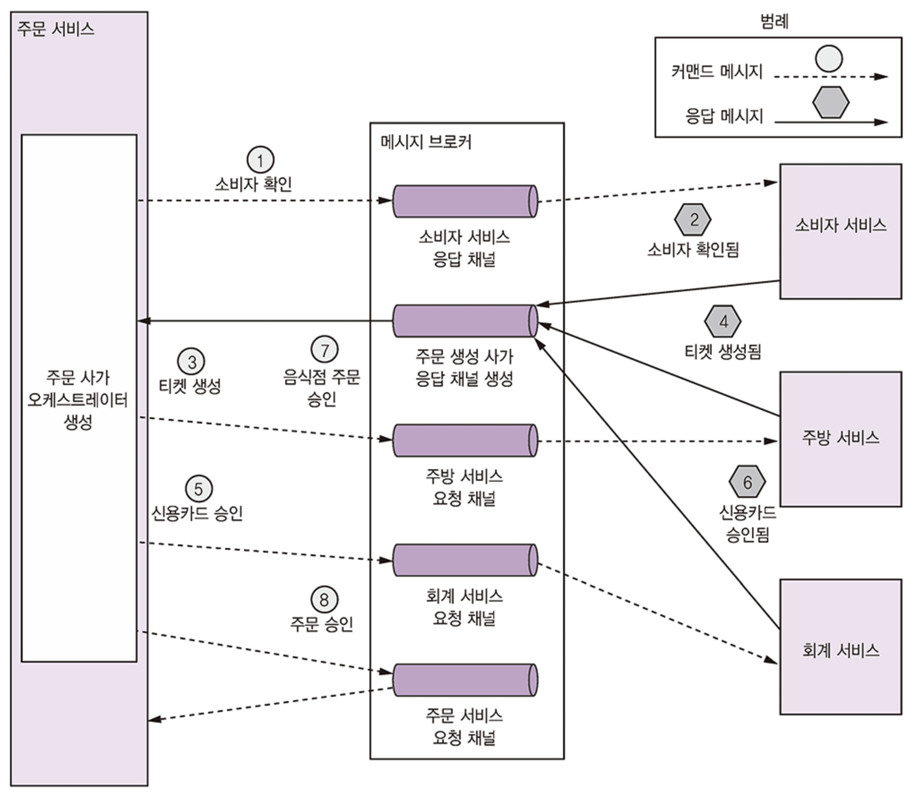<figcaption></figcaption></figure>

**오케스트레이션 스타일의 주문 생성 사가 이벤트 순서**
- (1) 사가 오케스트레이터가 소비자 확인 커멘트를 소비자 서비스에 전송 
- (2) 소비자 서비스는 소비자 확인 메시지를 응답
- (3) 사가 오케스트레이터는 티켓 생성 커맨드를 주방 서비스에 전송
- (4) 주방 서비스는 티켓 생성 메시지를 응답
- (5) 사가 오케스트레이터는 신용카드 승인 메시지를 회계 서비스에 전송
- (6) 회계 서비스는 신용카드 승인됨 메시지를 응답
- (7) 사가 오케스트레이터는 티켓 승인 커맨드를 주방 서비스에 전송
- (8) 사가 오케스트레이터는 주문 승인 커맨드를 주문 서비스에 전송

**중앙 집중식 조정자 (사가 오케스트레이터)**: 
- 오케스트레이션은 사가 참가자들에게 무엇을 할지 지시하는 **오케스트레이터 클래스**를 정의하여 사가의 조정 로직을 중앙 집중화합니다.

**명령/비동기 응답 스타일 통신**: 
- 사가 오케스트레이터는 참가 서비스에게 특정 작업을 수행하도록 **명령 메시지**를 보냅니다. 
- 참가 서비스는 작업을 수행한 후 오케스트레이터에게 **응답 메시지**를 보냅니다. 
- 오케스트레이터는 이 응답을 처리하여 다음 사가 단계를 결정합니다.
- 예를 들어, 주문 서비스 내의 사가 오케스트레이터는 고객 서비스에 "소비자 검증" 명령을 보내고, 주방 서비스에 "티켓 생성" 명령을 보내는 식으로 작동합니다.

**상태 기계(State Machine) 모델링**: 
- 사가 오케스트레이터는 상태 기계로 모델링하는 것이 좋습니다. 
- 이는 사가의 모든 가능한 시나리오(성공 경로 및 오류 경로)를 명확히 정의하고, 사가 설계, 구현 및 테스트를 용이하게 합니다.

<figure>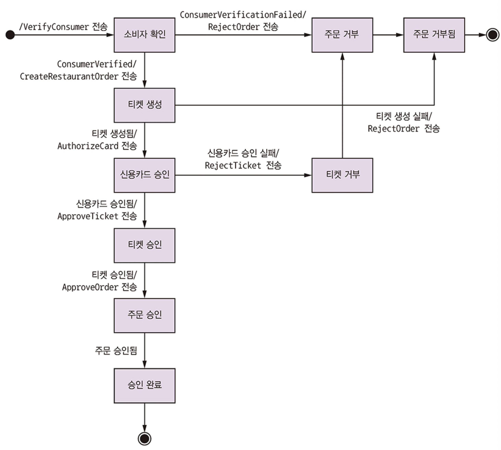<figcaption></figcaption></figure>

**신뢰할 수 있는 통신**: 
- 오케스트레이터와 참가 서비스 간의 메시지 교환 역시 **트랜잭션 메시징**을 사용하여 신뢰성을 보장해야 합니다.

.

오케스트레이션 사가의 장단점
- **장점**:
  - **낮은 결합(Less coupling)**: 각 참가 서비스는 오케스트레이터가 호출하는 API만 구현하면 되므로, 다른 참가 서비스가 발행하는 이벤트를 알 필요가 없어 서비스 간 결합이 줄어듭니다.
  - **관심사 분리 및 비즈니스 로직 단순화**: 사가 조정 로직이 오케스트레이터에 집중되어 있어, 도메인 객체(ex: Order class)는 사가 참여에 대한 지식이 없어 비즈니스 로직이 더 단순해집니다.
-  **단점**:
   - **과도한 중앙 집중화 위험**: 오케스트레이터에 너무 많은 비즈니스 로직이 집중되어 "똑똑한 오케스트레이터가 멍청한 서비스에게 지시하는" 형태로 변질될 위험이 있습니다. 오케스트레이터는 순서 조정에만 집중하고 다른 비즈니스 로직은 피하는 것이 좋습니다.

> 복잡한 사가에는 오케스트레이션 방식이 권장됩니다. 사가 조정 로직을 구현하는 것은 마이크로서비스 아키텍처에서 해결해야 할 중요한 설계 과제 중 하나입니다.

## 비격리 문제 처리

마이크로서비스 아키텍처에서 **사가(Saga) 패턴**을 사용하여 트랜잭션을 관리할 때 발생하는 **비격리성(lack of isolation)** 문제와 그 해결책에 초점을 맞춥니다.

### 이상 현상 개요

**ACID 트랜잭션과의 차이점 및 문제점**:
- 전통적인 **ACID(Atomicity, Consistency, Isolation, Durability)** 트랜잭션의 **격리성(Isolation)** 속성은 동시 실행되는 여러 트랜잭션의 결과가 순차적으로 실행될 때와 동일하도록 보장합니다. 이는 개발자가 비즈니스 로직을 쉽게 작성할 수 있게 합니다.
- 그러나 사가는 각 로컬 트랜잭션이 변경 사항을 즉시 커밋하기 때문에, 해당 변경 사항이 다른 사가에 **즉시 가시적**이게 됩니다.
- 따라서 사가는 **ACD(Atomicity, Consistency, Durability)** 속성을 가지지만 **격리성(Isolation)이 부족**합니다.
- 이러한 격리성 부족은 애플리케이션이 **예기치 않게 동작하는** **이상 현상(anomalies)**을 유발할 수 있습니다.

**비격리로 인한 이상 현상**:
- **손실된 업데이트(Lost updates)**: 한 사가가 다른 사가에서 읽지 않은 변경 사항을 덮어쓸 때 발생합니다. 예를 들어, 주문 생성 사가가 주문을 생성하는 동안 다른 주문 취소 사가가 해당 주문을 취소하고, 최종적으로 주문 생성 사가가 취소된 주문을 승인하여 모순된 상태가 되는 경우입니다.
- **더티 읽기(Dirty reads)**: 한 트랜잭션 또는 사가가 아직 완료되지 않은 다른 사가의 업데이트 중인 데이터를 읽을 때 발생합니다. 예를 들어, 주문 생성 사가가 신용 한도를 확인하는 동안 다른 주문 취소 사가가 한도를 일시적으로 증가시키고 롤백하여 실제보다 더 많은 한도가 있는 것으로 판단하고 주문이 허용되는 경우입니다.
- **퍼지/반복 불가능한 읽기(Fuzzy/nonrepeatable reads)**: 사가의 두 단계가 동일한 데이터를 읽지만 다른 사가가 중간에 업데이트를 수행하여 다른 결과를 얻을 때 발생합니다.

### 이상 현상 처리를 위한 대응책

개발자는 사가의 이상 현상을 방지하거나 비즈니스에 미치는 영향을 최소화하도록 사가를 작성해야 합니다.
   
**사가 구조의 세 가지 유형**:

**보상 가능한 트랜잭션(Compensatable transactions)**: 
- 보상 트랜잭션을 통해 잠재적으로 롤백될 수 있는 트랜잭션입니다.

**피벗 트랜잭션(Pivot transaction)**: 사가의 **성공/실패 결정 지점**입니다. 
- 피벗 트랜잭션이 커밋되면 사가는 완료될 것이 보장됩니다. 이는 보상 불가능하거나 재시도 불가능한 트랜잭션이 될 수 있습니다.

**재시도 가능한 트랜잭션(Retriable transactions)**: 
- 피벗 트랜잭션 이후에 이어지는 트랜잭션으로, **항상 성공이 보장**됩니다.

.

**주요 대응책**:

**시맨틱 락(Semantic lock)**: 
- 애플리케이션 수준의 락으로, 사가가 레코드를 업데이트 중임을 나타내는 플래그를 설정합니다. 
- 다른 트랜잭션이 해당 레코드를 접근하는 것을 막거나 신중하게 처리하도록 경고합니다. 
- `Order.state` 필드의 `APPROVAL_PENDING`과 같은 상태가 대표적인 예시입니다.

**교환 가능한 업데이트(Commutative updates)**: 
- 업데이트 작업을 어떤 순서로든 실행 가능하도록 설계합니다.

**비관적 관점(Pessimistic view)**: 
- 더티 읽기로 인한 비즈니스 위험을 최소화하기 위해 사가 단계를 재정렬합니다. 
- 예를 들어, 신용 한도 증가와 같은 민감한 작업을 재시도 가능한 트랜잭션 단계로 옮길 수 있습니다.

**값 다시 읽기(Reread value)**: 
- 데이터를 업데이트하기 전에 다시 읽어서 변경되지 않았는지 확인하여 손실된 업데이트를 방지합니다. 
- 변경된 경우 사가를 중단하고 재시작할 수 있습니다.

**버전 파일(Version file)**: 
- 레코드에 대한 작업을 기록하여 재정렬할 수 있도록 합니다. 
- 이는 비교환적(noncommutative) 작업을 교환적(commutative) 작업으로 바꾸는 방법입니다.

**값으로(By value)**: 
- 비즈니스 위험에 따라 동시성 메커니즘을 동적으로 선택하는 전략입니다. 
- 예를 들어, 낮은 위험 요청은 사가를 사용하고, 큰 금액과 관련된 높은 위험 요청은 분산 트랜잭션을 사용할 수 있습니다.

> 이러한 대응책을 통해 사가 모델의 격리성 부족 문제를 완화하고 애플리케이션의 데이터 일관성을 효과적으로 유지할 수 있습니다.

## 주문 서비스 및 주문 생성 사가 설계

**주문 서비스와 사가 설계**

<figure>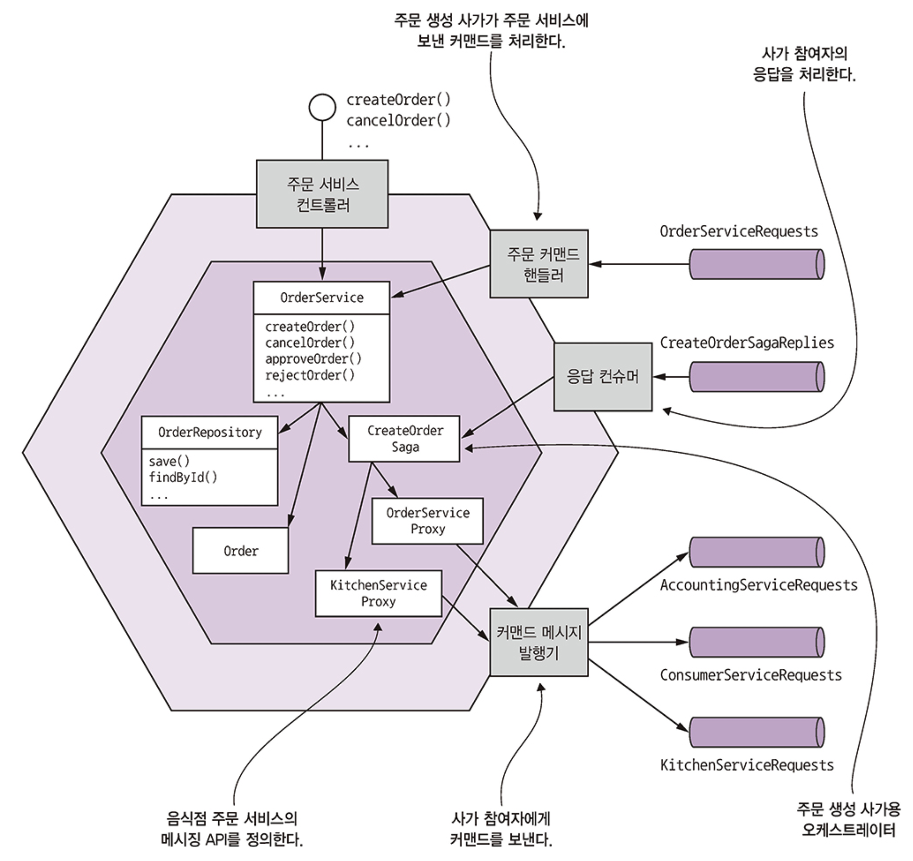<figcaption></figcaption></figure>

**주문 서비스의 전반적인 설계**:
* 주문 서비스는 `OrderService`, `Order`, `OrderRepository`와 같은 **전통적인 비즈니스 로직 클래스**로 구성됩니다.
* 동시에, 이 서비스는 **사가 관련 클래스**들도 포함하여 **사가 오케스트레이터(saga orchestrator)**이자 **사가 참여자(saga participant)**의 역할을 모두 수행합니다.

### OrderService 클래스

<figure>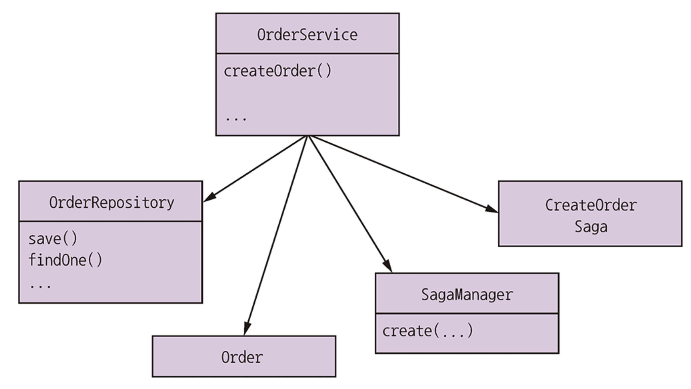<figcaption></figcaption></figure>

* 이 클래스는 서비스의 API 계층에서 호출되는 **도메인 서비스**입니다.
* 주문을 생성하고 관리하는 주요 역할을 하며, `OrderRepository`를 통해 주문을 영속화하고, `SagaManager`를 사용하여 **사가를 시작**합니다.
* 또한, 주문 상태 변경 시 관련 **도메인 이벤트를 발행**합니다.

[OrderService.java](https://github.com/gilbutITbook/007035/blob/master/ftgo-order-service/src/main/java/net/chrisrichardson/ftgo/orderservice/domain/OrderService.java)

```java
@Transactional //
public class OrderService {

  private SagaManager<CreateOrderSagaState> createOrderSagaManager;

  private OrderRepository orderRepository;

  private OrderDomainEventPublisher orderAggregateEventPublisher;

  // ...


  public Order createOrder(long consumerId, long restaurantId, List<MenuItemIdAndQuantity> lineItems) {
    
    // ...
    ResultWithDomainEvents<Order, OrderDomainEvent> orderAndEvents = // Order 생성
            Order.createOrder(consumerId, restaurant, orderLineItems);

    Order order = orderAndEvents.result;
    orderRepository.save(order); // DB에 Order 저장

    orderAggregateEventPublisher.publish(order, orderAndEvents.events); // 도메인 이벤트 발행

    OrderDetails orderDetails = new OrderDetails(consumerId, restaurantId, orderLineItems, order.getOrderTotal());

    CreateOrderSagaState data = new CreateOrderSagaState(order.getId(), orderDetails); // CreateOrdersaga 생성
    createOrderSagaManager.create(data, Order.class, order.getId());

    meterRegistry.ifPresent(mr -> mr.counter("placed_orders").increment());

    return order;
  }

  // ...
}
```

**CreateOrderSaga 및 관련 클래스**

<figure>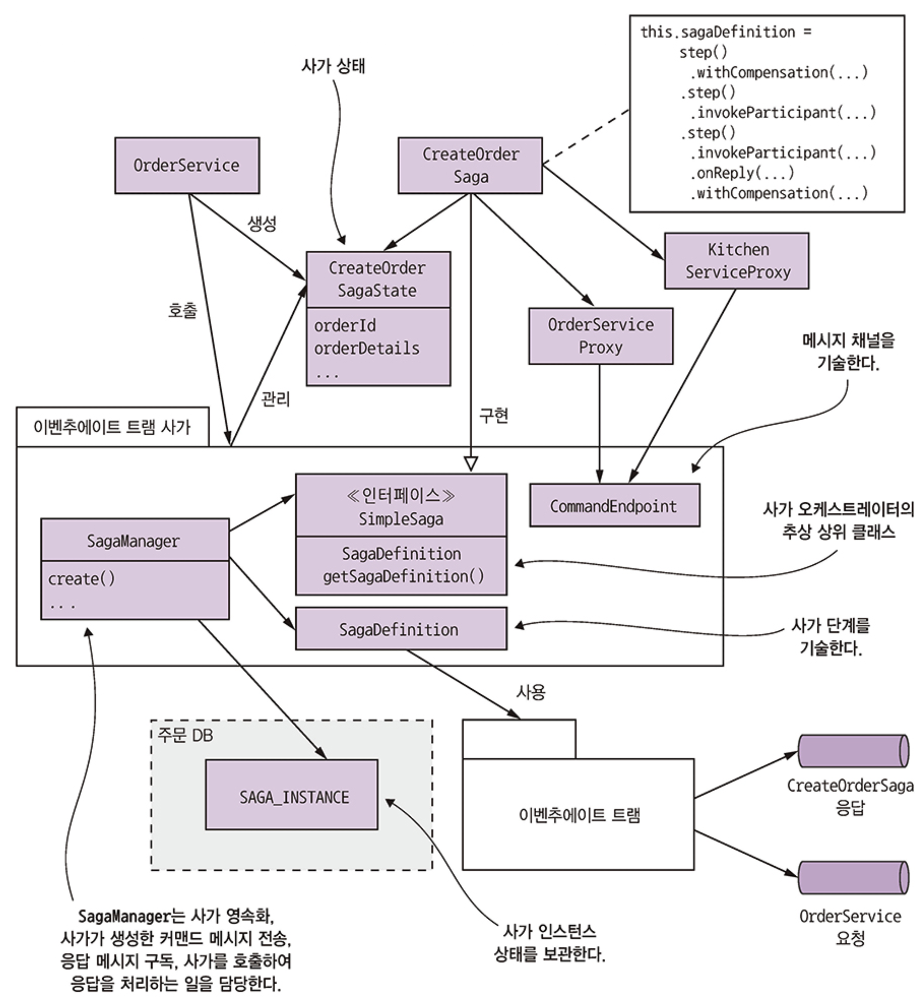<figcaption></figcaption></figure>

### 주문 생성 사가 구현

**`CreateOrderSaga` 오케스트레이터**:
* `CreateOrderSaga` 클래스는 **주문 생성 사가를 오케스트레이션**하는 역할을 합니다.
* 이는 `SimpleSaga` 인터페이스를 구현하며, `eventuate.tram.sagas` 프레임워크가 제공하는 **DSL(Domain-Specific Language)**을 사용하여 사가의 상태 머신을 정의합니다.
* `step()`, `invokeParticipant()`, `onReply()`, `withCompensation()`과 같은 메서드를 통해 **정방향 트랜잭션, 응답 처리, 보상 트랜잭션** 등을 정의하여 사가의 각 단계를 조율합니다.

> [CreateOrderSaga.java](https://github.com/gilbutITbook/007035/blob/master/ftgo-order-service/src/main/java/net/chrisrichardson/ftgo/orderservice/sagas/createorder/CreateOrderSaga.java)

**`CreateOrderSagaState` 클래스**:
* 이 클래스는 **사가 인스턴스의 지속적인 상태**를 나타냅니다.
* 주요 책임은 사가 참여자에게 전송될 **명령 메시지(command messages)를 생성**하는 것입니다.
* `eventuate.tram.sagas` 프레임워크에 의해 데이터베이스에 영속화됩니다.

> [CreateOrderSagaState.java](https://github.com/gilbutITbook/007035/blob/master/ftgo-order-service/src/main/java/net/chrisrichardson/ftgo/orderservice/sagas/createorder/CreateOrderSagaState.java)

**사가 참여자 프록시 클래스 (예: `KitchenServiceProxy`)**:
* `KitchenServiceProxy`와 같은 프록시 클래스는 사가 참여자(예: Kitchen Service)의 **메시징 API를 정의**합니다.
* 여기에는 명령 채널, 명령 메시지 유형, 응답 유형 등이 포함됩니다.

> [KitchenServiceProxy.java](https://github.com/gilbutITbook/007035/blob/master/ftgo-order-service/src/main/java/net/chrisrichardson/ftgo/orderservice/sagaparticipants/KitchenServiceProxy.java)

**`eventuate.tram.sagas` 프레임워크**:
* 이 프레임워크는 사가 오케스트레이터 및 참여자를 작성하기 위한 주요 도구입니다.
* DSL을 제공하고, 사가의 상태 머신을 실행하며, **사가 참여자들과 메시지를 교환**합니다.
* 특히 `SagaManager`는 사가 인스턴스 영속화, 명령 메시지 전송, 응답 메시지 구독, 응답 처리를 위한 사가 호출 등을 담당합니다.

<figure>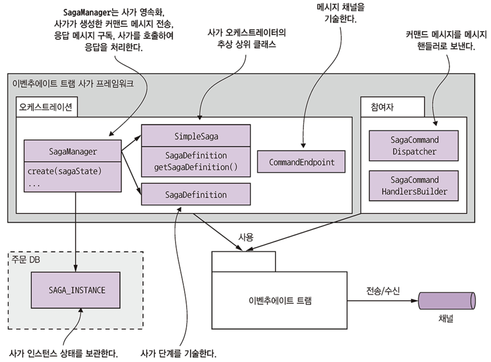<figcaption></figcaption></figure>

.

**`OrderService`가 주문 생성 사가 인스턴스를 생성할 때 발생하는 이벤트**

<figure>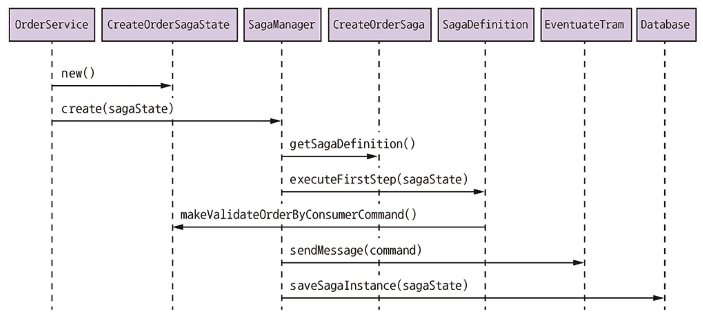<figcaption></figcaption></figure>

- (1) OrderService는 CreateOrderSagaState를 생성
- (2) OrserService는 SagaManager를 호출하여 사가 인스턴스를 생성
- (3) SagaManager는 사가 테피니션의 첫 번째 단계를 실행
- (4) CreateOrderSagaState를 호출하여 커맨드 메시지를 생성
- (5) SagaManager는 커맨드 메시지를 사가 참여자(소비자 서비스)에게 보냄
- (6) SagaManager는 사가 인스턴스를 DB에 저장

.

**`sagaManager`가 사가 참여자의 응답 메시지를 수신할 때 발생하는 이벤트**

<figure>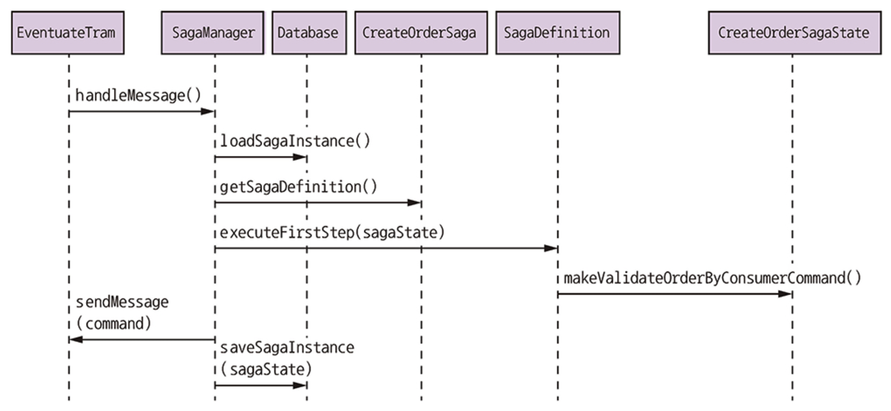<figcaption></figcaption></figure>

- (1) 이벤추에이트 트램은 소비자 서비스의 응답을 SagaManager에 전달
- (2) SagaManager는 DB에서 사가 인스턴스를 조회
- (3) SagaManager는 그다음 사가 데피니션 단계를 실행
- (4) CreateOrderSagaState를 호출하여 커맨드 메시지를 생성
- (5) SagaManager는 커맨드 메시지를 사가 참여자(주방 서비스)에게 보냄
- (6) SagaManager는 업데이트 사가 인스턴스를 DB에 저장

사가 참여자가 실패하면 SagaManager는 보상 트랜잭션을 역순으로 실행


