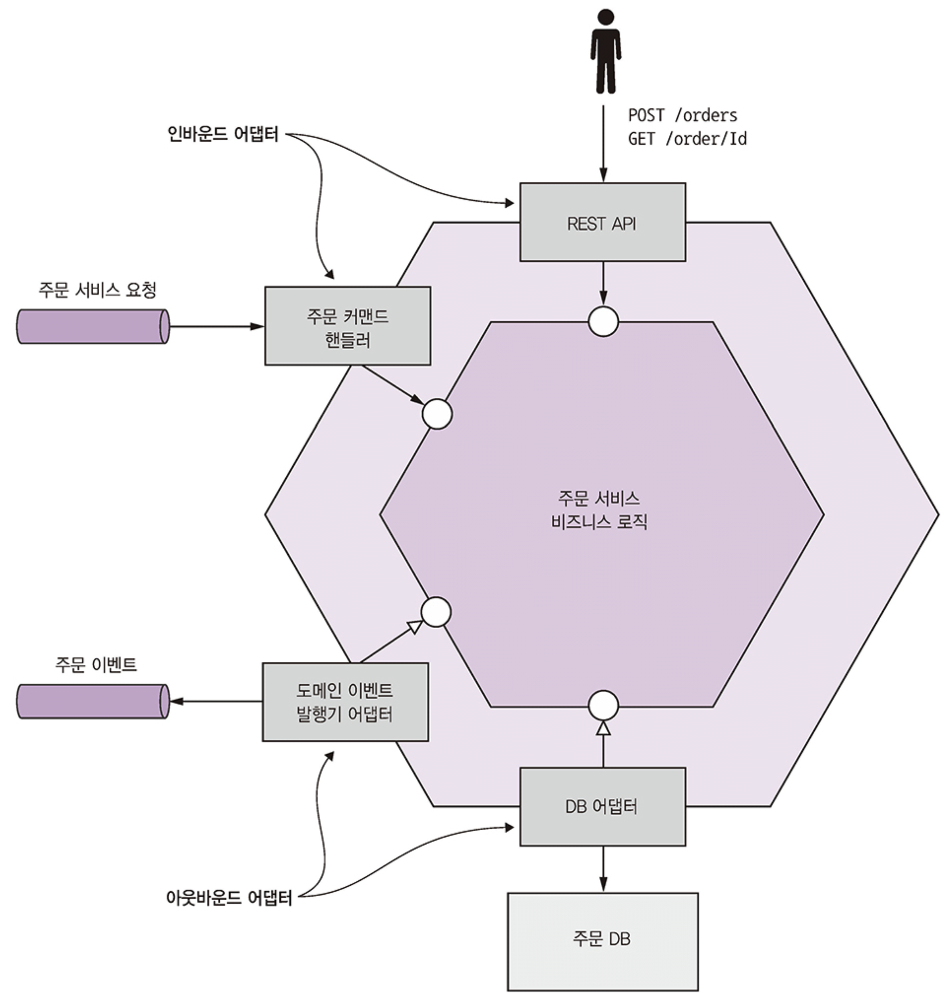
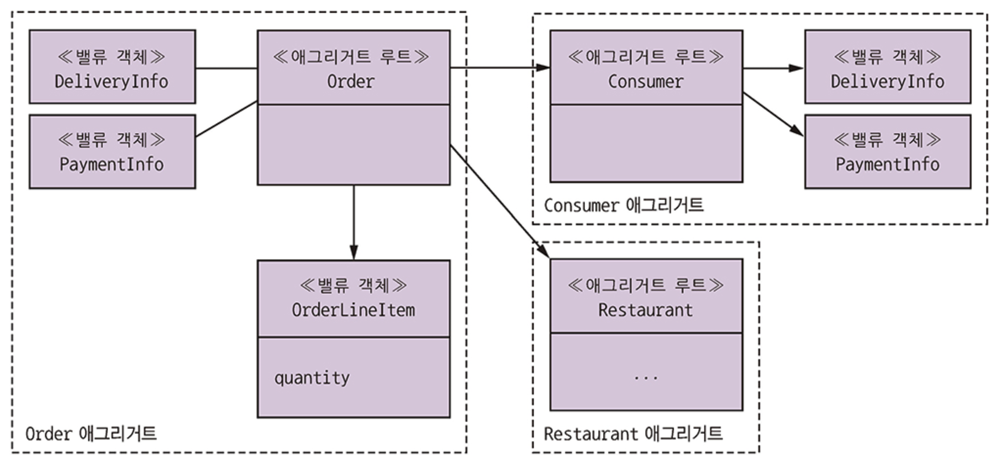
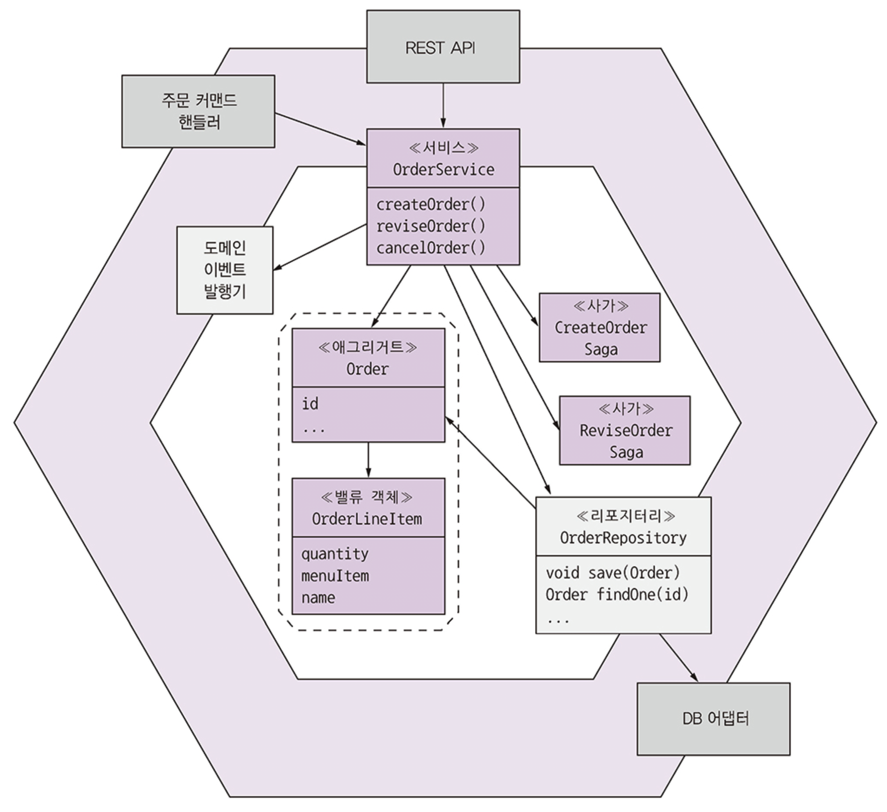
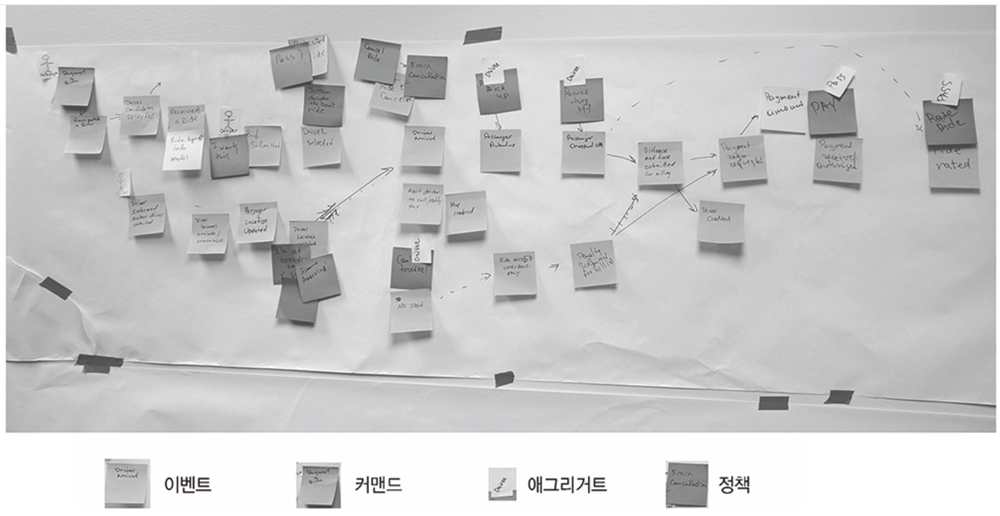
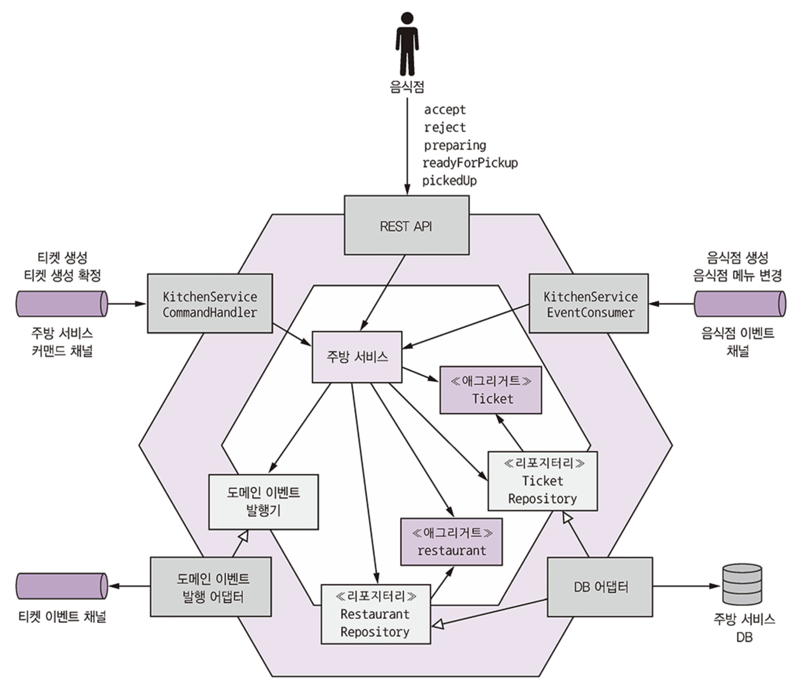
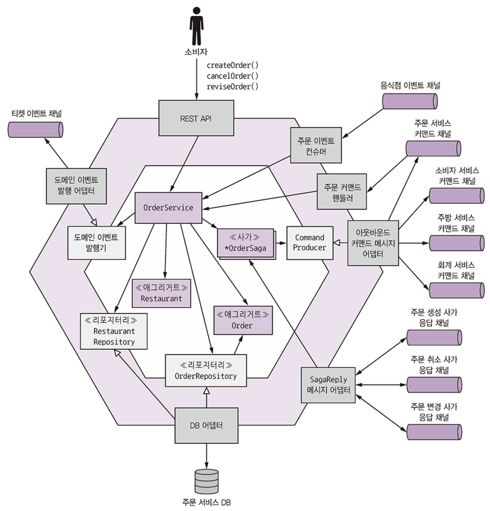

# Part 5. 비즈니스 로직 설계

마이크로서비스 아키텍처에서 비즈니스 로직을 개발하는 것은 다음과 같은 두 가지 주요 과제 때문에 더욱 어렵습니다:
* **서비스 경계를 넘나드는 객체 참조 제거**: 
  * 일반적인 도메인 모델은 상호 연결된 클래스들의 복잡한 웹이지만, 마이크로서비스 아키텍처에서는 클래스들이 여러 서비스에 분산되어 있어 서비스 경계를 넘어선 객체 참조를 없애야 합니다.
* **분산 트랜잭션 관리**: 
  * 마이크로서비스 아키텍처의 트랜잭션 관리 제약 조건 내에서 작동하는 비즈니스 로직을 설계해야 합니다. 
  * 서비스 내에서는 ACID 트랜잭션을 사용할 수 있지만, **서비스 간 데이터 일관성을 유지하기 위해서는 사가(Saga) 패턴을 사용**해야 합니다.

이 장에서는 이러한 문제들을 해결하기 위해 다음과 같은 비즈니스 로직 조직화 패턴들을 다룹니다:
* **트랜잭션 스크립트(Transaction Script) 패턴**
* **도메인 모델(Domain Model) 패턴**
* **DDD 애그리거트(Aggregate) 패턴**: 
  * 서비스의 비즈니스 로직을 집합(aggregate)으로 구조화하여 서비스 간 객체 참조 문제를 피하고, 
  * 단일 트랜잭션 내에서 단일 집합만 생성 또는 업데이트하도록 하여 마이크로서비스 트랜잭션 모델의 제약 조건에 부합하게 합니다.
* **도메인 이벤트(Domain Event) 패턴**: 서비스가 이벤트를 발행하는 것이 왜 유용한지 설명합니다.

## 비즈니스 로직 구성 패턴

이 섹션에서는 **서비스의 일반적인 아키텍처와 비즈니스 로직을 조직하는 두 가지 주요 패턴**인 `트랜잭션 스크립트 패턴`과 `도메인 모델 패턴`에 대해 설명합니다.

### 서비스 아키텍처와 어댑터

전형적인 서비스의 아키텍처는 **헥사고날 아키텍처(Hexagonal architecture)**를 따르며, **비즈니스 로직이 핵심(core)**을 이룹니다.  
비즈니스 로직 주변에는 인바운드(inbound) 어댑터와 아웃바운드(outbound) 어댑터가 있습니다.

<figure><figcaption></figcaption></figure>

* **인바운드 어댑터**: 클라이언트의 요청을 처리하고 `비즈니스 로직을 호출`합니다.
  *   **REST API 어댑터**: REST API를 구현하여 비즈니스 로직을 호출하는 인바운드 어댑터입니다.
  *   **OrderCommandHandlers**: 메시지 채널에서 명령 메시지(command messages)를 소비하고 비즈니스 로직을 호출하는 인바운드 어댑터입니다.
* **아웃바운드 어댑터**: 비즈니스 로직에 의해 호출되며 `다른 서비스나 애플리케이션을 호출`합니다.
  *   **데이터베이스 어댑터(Database Adapter)**: 비즈니스 로직에 의해 호출되어 데이터베이스에 접근합니다.
  *   **도메인 이벤트 발행 어댑터(Domain Event Publishing Adapter)**: 메시지 브로커에 이벤트를 발행합니다.

### 비즈니스 로직 조직화 패턴

비즈니스 로직을 개발할 때 중요한 결정은 객체 지향 접근 방식 또는 절차적(procedural) 접근 방식을 사용할지 여부입니다. 여기에는 두 가지 주요 패턴이 있습니다:

**트랜잭션 스크립트(Transaction Script) 패턴**

* **개념**: **각 요청/시스템 작업을 처리하기 위한 절차적 코드로 비즈니스 로직을 구성**합니다. 
  * 객체 지향 설계 없이, 프레젠테이션 계층의 각 요청에 대해 트랜잭션 스크립트라는 메서드를 작성합니다.
* **특징**: 행동을 구현하는 클래스(예: `OrderService`)와 상태를 저장하는 클래스(예: `Order` 데이터 객체)가 분리됩니다. 
  * `OrderService`와 같은 서비스 클래스는 각 요청에 대한 하나의 메서드를 가지며, 이 메서드가 비즈니스 로직을 구현하고 데이터 접근 객체(DAO)를 통해 데이터베이스에 접근합니다.
  * 데이터 객체(예: `Order` 클래스)는 동작이 거의 없는 순수한 데이터입니다.
* **장점**: 간단한 비즈니스 로직에 적합하며 구현이 간단합니다.
* **단점**: 비즈니스 로직이 복잡해지면 유지보수가 어려워질 수 있으며, 코드가 "악몽"이 될 수 있습니다.

**도메인 모델(Domain Model) 패턴**

* **개념**: **상태와 행동을 모두 가지는 클래스들로 구성된 객체 모델(object model)로 비즈니스 로직을 구성**합니다. 
  * 이 클래스들은 문제 도메인의 개념에 직접적으로 매핑됩니다.
* **특징**: `OrderService`와 같은 서비스 클래스는 여전히 각 요청에 대한 메서드를 가지지만, 이 메서드들은 **영속적인 도메인 객체(persistent domain objects)에게 대부분의 비즈니스 로직을 위임**합니다. 
  * 예를 들어, `Order` 클래스는 상태와 행동을 모두 가지며, 상태는 비공개(private)이며 메서드를 통해서만 접근 가능합니다.
* **장점**:
  * **이해 및 유지보수 용이**: 모든 것을 수행하는 하나의 큰 클래스 대신, 각각 작은 책임을 가진 여러 작은 클래스로 구성되어 이해하고 유지보수하기 쉽습니다.
  * **테스트 용이**: 각 클래스를 독립적으로 테스트할 수 있습니다.
  * **확장 용이**: 전략 패턴, 템플릿 메서드 패턴과 같은 잘 알려진 디자인 패턴을 사용하여 코드 수정 없이 확장이 용이합니다.
* **한계**: 이 패턴은 잘 작동하지만, 특히 마이크로서비스 아키텍처에서는 몇 가지 문제가 있어 **DDD(도메인 주도 설계)의 정교화된 접근 방식**이 필요합니다.

이러한 패턴들을 이해하는 것은 마이크로서비스 환경에서 효과적인 비즈니스 로직을 설계하는 데 필수적입니다.

## 도메인 모델 설계: DDD 애그리거트 패턴

마이크로서비스 아키텍처에서 복잡한 비즈니스 로직을 효과적으로 설계하고 관리하기 위한 핵심 패턴인 DDD 애그리거트(Aggregate) 패턴의 개념, 중요성 및 규칙

### 불분명한 경계 문제

* 전통적인 객체 지향 도메인 모델은 종종 비즈니스 객체(예: `Order`)의 명시적인 경계가 부족하여 **개념적 모호성**을 야기하고, 특히 객체 업데이트 시 문제를 발생시킵니다.
* 비즈니스 객체는 항상 지켜져야 하는 **불변식(invariants)**, 즉 비즈니스 규칙을 가집니다 (예: 주문의 최소 금액).
* 명시적인 경계가 없는 경우, 동시에 여러 사용자가 부분적으로 비즈니스 객체를 업데이트할 때 (예: 두 소비자가 동시에 주문의 다른 항목을 수정하여 총 주문 금액이 의도치 않게 최소 금액 아래로 떨어지는 경우) **불변식이 위반될 수 있습니다**. 
  * 이는 애플리케이션이 각 개별 업데이트 시에는 불변식을 확인했더라도 전체적으로는 유효하지 않은 상태가 될 수 있음을 보여줍니다.

### 애그리거트는 경계가 분명하다

* **애그리거트**는 **단위로 취급될 수 있는 도메인 객체들의 클러스터**입니다. 
  * 이는 **루트 엔티티**와 하나 이상의 다른 엔티티 및 값 객체(value objects)로 구성됩니다.
* 예를 들어, `Order` 애그리거트는 `Order` 엔티티와 `OrderLineItem`, `DeliveryAddress`, `PaymentInformation`과 같은 값 객체들로 구성됩니다.
* 애그리거트는 도메인 모델을 더 작은 조각으로 분해하여 개별적으로 이해하기 쉽게 만들고, 로드(load), 업데이트(update), 삭제(delete)와 같은 **작업의 범위를 명확하게 합니다**.
* 애그리거트는 전체적으로 업데이트되며, 불변식을 강제하는 **애그리거트 루트**를 통해 동시성(concurrency)을 처리합니다 (예: 버전 번호 사용).

경계가 분명한 애그리거트로 구성된 도메인 모델

<figure><figcaption></figcaption></figure>

### 애그리거트 규칙

* DDD는 애그리거트가 지켜야 할 일련의 규칙을 정의하여 자가 포함적인 단위로서 불변식을 강제할 수 있도록 합니다.
* **규칙 #1: 오직 애그리거트 루트만 참조**: 
  * 애그리거트 외부의 클래스는 오직 애그리거트 루트 엔티티만 참조할 수 있습니다. 
  * 클라이언트는 애그리거트 루트에 메서드를 호출하여 애그리거트를 업데이트해야 합니다. 
  * 이는 애그리거트가 불변식을 강제하도록 보장합니다.
* **규칙 #2: 애그리거트 간 참조는 기본 키를 사용해야 함**: 
  * 애그리거트들은 객체 참조 대신 **식별자(기본 키)**를 통해 서로를 참조해야 합니다. 
  * 예를 들어, `Order`는 `Consumer` 객체에 대한 참조 대신 `consumerId`를 사용합니다.
  * 이 접근 방식은 **애그리거트 간의 느슨한 결합**을 보장하고, 서비스 경계를 넘는 객체 참조 문제를 방지하여 마이크로서비스 아키텍처에 매우 중요합니다. 
  * 또한, 영속화를 단순화하고 NoSQL 데이터베이스에 더 적합하며 지연 로딩(lazy loading) 문제를 제거합니다.
* **규칙 #3: 하나의 트랜잭션은 하나의 애그리거트만 생성 또는 업데이트**: 
  * 단일 ACID 트랜잭션은 오직 하나의 애그리거트만 생성하거나 업데이트할 수 있습니다.
  * 이는 마이크로서비스 아키텍처의 트랜잭션 모델 제약 조건과 완벽하게 일치하며, **트랜잭션이 서비스 내에 국한되도록 보장합니다**.
  * 여러 애그리거트를 생성하거나 업데이트해야 하는 작업의 경우, **사가(Saga) 패턴**을 사용해야 합니다. 
  * 사가의 각 단계는 정확히 하나의 애그리거트를 생성하거나 업데이트합니다.

### 애그리거트 입도

* 각 애그리거트의 크기를 결정하는 것은 중요한 설계 결정입니다.
* **작은(세분화된) 애그리거트**는 
  * 동시성 및 확장성을 향상시키고, 두 사용자가 동일한 애그리거트에 대한 충돌하는 업데이트를 시도할 가능성을 줄여 사용자 경험을 개선합니다.
* **큰(세분화되지 않은) 애그리거트**는 
  * 특정 업데이트를 원자적으로 만들 수 있지만, 확장성을 감소시키고 (동일한 고객의 다른 주문 업데이트가 직렬화됨), 서비스 분해에 장애물이 될 수 있습니다 (관련 비즈니스 로직이 동일 서비스에 함께 배치되어 서비스가 커짐).
* 따라서 **애그리거트를 가능한 한 세분화하는 것이 가장 좋습니다**.

### 비즈니스 로직 설계: 애그리거트

<figure><figcaption></figcaption></figure>

* 일반적인 마이크로서비스에서 **비즈니스 로직의 대부분은 애그리거트로 구성됩니다**.
  * 나머지 비즈니스 로직은 **도메인 서비스**와 **사가**에 있습니다.
* **도메인 서비스** (예: `OrderService`)는 인바운드 어댑터에 의해 호출되는 비즈니스 로직의 진입점 역할을 하며, 리포지토리를 사용하여 애그리거트를 저장하거나 로드합니다.
* **사가**는 데이터 일관성을 위해 여러 로컬 트랜잭션 시퀀스를 조정합니다.
* `OrderService`의 경우, 서비스 내에서 로컬 업데이트를 처리할 때는 `Order` 애그리거트를 직접 업데이트하고, 여러 서비스에 걸쳐 있는 업데이트 요청의 경우 **사가를 생성하여 조정합니다**.

## 도메인 이벤트 발행

### 도메인 이벤트란?

* 도메인 이벤트는 **애그리거트에서 발생한 중요한 사건**을 의미합니다.
* 보통 애그리거트의 **상태 변화**를 나타내며, 도메인 모델 내에서 클래스로 표현됩니다. 
  * 예를 들어, `Order` 애그리거트의 상태 변화 이벤트로는 `Order Created`, `Order Cancelled`, `Order Shipped` 등이 있습니다.
* 애그리거트는 관련 있는 소비자가 있다면, 상태가 변경될 때마다 이벤트를 발행할 수 있습니다.
* 패턴 정의: **애그리거트는 생성되거나 중요한 변경이 있을 때 도메인 이벤트를 발행한다**.

### 도메인 이벤트를 발행하는 이유

* 다른 시스템이나 구성 요소(사용자, 다른 애플리케이션, 동일 애플리케이션 내 다른 컴포넌트)들이 애그리거트의 상태 변화에 관심을 가질 때 유용합니다.
* 주요 활용 시나리오:
  * **코레오그래피 기반 사가를 사용하여 서비스 간 데이터 일관성을 유지**하는 데 활용됩니다.
  * 원본 데이터가 변경되었음을 복제본을 유지하는 서비스에 알리는 데 사용됩니다 (CQRS 패턴).
  * 등록된 웹훅(webhook)이나 메시지 브로커를 통해 다른 애플리케이션에 알림을 보내 비즈니스 프로세스의 다음 단계를 트리거합니다.
  * 동일 애플리케이션의 다른 구성 요소에 알림을 보내 사용자 브라우저에 웹소켓 메시지를 보내거나 텍스트 데이터베이스를 업데이트하는 데 사용됩니다.
  * 사용자에게 주문 배송, 처방전 준비 완료 등과 같은 알림(문자 메시지, 이메일)을 보냅니다.
  * 애플리케이션이 올바르게 작동하는지 확인하기 위해 도메인 이벤트를 모니터링합니다.
  * 사용자 행동을 모델링하기 위해 이벤트를 분석합니다.
* 모든 시나리오에서 알림의 트리거는 애플리케이션 데이터베이스 내 애그리거트의 상태 변화입니다.

### 도메인 이벤트란 무엇인가?

* 과거 분사, 동사 형태로 이름을 짓습니다 (예: `OrderCreated`).
* 이벤트의 의미를 효과적으로 전달하는 속성(기본 값 또는 값 객체)을 가집니다.
* 일반적으로 이벤트 ID, 타임스탬프, 변경을 수행한 사용자 ID와 같은 **메타데이터**를 포함합니다.
* 메타데이터는 이벤트 객체의 일부이거나, 이벤트 객체를 감싸는 **envelope object**에 포함될 수 있습니다. 
  * 이벤트를 발행한 애그리거트의 ID도 **envelope object**에 포함될 수 있습니다.

```java
interface DomainEvent

public interface OrderDomainEvent extends DomainEvent {}

public interface OrderCreatedEvent extends OrderDomainEvent {}

interface DomainEventEnvelop<T extends DomainEvent> {
    String getAggregateId();
    Message getMessage();
    String getAggregateType();
}
```

### 이벤트 강화

* 이벤트 소비자가 이벤트 처리 시 추가 정보(예: `OrderCreated` 이벤트 처리 시 주문 상세 정보)가 필요할 때, 해당 정보를 발행 서비스에 다시 질의하는 것은 오버헤드를 발생시킵니다.
* **이벤트 강화**는 소비자가 필요로 하는 정보를 이벤트 자체에 포함시키는 접근 방식입니다.
* **장점**: 이벤트 소비자가 데이터를 발행 서비스로부터 직접 가져올 필요가 없어 소비자가 단순해집니다.
* **단점**: 이벤트 클래스가 소비자 요구사항 변경 시 함께 변경될 위험이 있어 안정성이 떨어지고 유지보수성이 저하될 수 있습니다.

### 도메인 이벤트 식별
 
* **요구사항 분석**: "X가 발생하면 Y를 수행하라"와 같은 알림 관련 요구사항에서 이벤트를 식별할 수 있습니다.
* **이벤트 스토밍(Event Storming)**: 복잡한 도메인을 이해하기 위한 이벤트 중심의 워크숍 형식으로 인기가 많습니다.
  * 도메인 전문가들이 모여 오렌지색 스티커 메모로 이벤트를 브레인스토밍하고 시간 순서대로 배열합니다.
  * 파란색 스티커로 사용자 액션인 명령(command), 보라색으로 외부 시스템, 다른 도메인 이벤트, 시간 경과 등 이벤트의 트리거를 식별합니다.
  * 노란색 스티커로 각 명령을 소비하고 해당 이벤트를 발행하는 **애그리거트**를 식별합니다.
  * 이벤트 스토밍은 도메인 모델을 빠르게 만드는 데 유용한 기법입니다.

<figure><figcaption></figcaption></figure>

### 도메인 이벤트 생성 및 발행

도메인 이벤트 통신은 비동기 메시징의 한 형태입니다.

**이벤트 생성**
* 개념적으로 애그리거트가 이벤트를 발행하지만, 애그리거트 내에서 직접 메시징 API를 호출하는 것은 인프라와 비즈니스 로직을 얽히게 하므로 바람직하지 않습니다.
* 더 나은 방법은 **책임을 애그리거트와 서비스로 분리**하는 것입니다.
    * **애그리거트**: 상태 변경 시 이벤트를 생성하여 서비스로 반환합니다.
    * **서비스**: 애그리거트로부터 이벤트를 받아 종속성 주입을 통해 메시징 API를 사용하여 이벤트를 발행합니다.
* 애그리거트가 이벤트를 서비스로 반환하는 두 가지 주요 방법:
    1.**메서드 반환 값에 이벤트 목록 포함**: 예를 들어 `Ticket` 애그리거트의 `accept()` 메서드가 `List<DomainEvent>`를 반환하면, 서비스가 이를 받아 발행합니다.
    2.**애그리거트 루트 필드에 이벤트 누적**: `AbstractAggregateRoot`와 같은 상위 클래스를 확장하여 `registerDomainEvent()`를 통해 이벤트를 기록하고, 서비스가 `getDomainEvents()`로 이벤트를 검색하여 발행합니다.

```java
// Ticket 애그리거트의 accept() 메서드
public class Ticket {
    public List<TicketDomainEvent> accept(LocalDateTime readyBy) {
        ...
        this.acceptTime = LocalDateTime.now(); // update Ticket
        this.readyBy = readyBy;
        return singletonList(new TicketAcceptedEvent(readyBy)); // return event
    }
}

...

public class KitchenService {
    ...
 
    public void accept(long ticketId, LocalDateTime readyBy) {
        Ticket ticket = ticketRepository.findById(ticketId)
            .orElseThrow(() ->
                new TicketNotFoundException(ticketId));
        List<TicketDomainEvent> events = ticket.accept(readyBy);

        domainEventPublisher.public(Ticket.class, orderId, events); // publish domain event
    }
}
```

.

**신뢰할 수 있는 이벤트 발행**
* 이벤트는 **애그리거트의 데이터베이스 업데이트 트랜잭션의 일부로 발행**되어야 합니다.
* **Eventuate Tram 프레임워크**는 `OUTBOX` 테이블에 이벤트를 삽입하여 이를 보장합니다. 트랜잭션이 커밋되면, `OUTBOX` 테이블의 이벤트가 메시지 브로커로 발행됩니다.
* `DomainEventPublisher` 인터페이스를 제공하며, `AbstractAggregateDomainEventPublisher`와 같은 추상 상위 클래스를 통해 **타입 안전한 이벤트 발행**을 지원합니다.

### 도메인 이벤트 소비

* 도메인 이벤트는 결국 Apache Kafka와 같은 메시지 브로커에 메시지로 발행됩니다.
* Eventuate Tram 프레임워크의 `DomainEventDispatcher`를 사용하면 이벤트를 적절한 핸들러 메서드로 디스패치하여 편리하게 소비할 수 있습니다.
* 예를 들어, `KitchenServiceEventConsumer`는 `음식점 서비스`가 발행하는 `RestaurantMenuRevised` 이벤트를 구독하여 `주방 서비스`의 레스토랑 메뉴 복제본을 최신 상태로 유지합니다.
  * `@EventSubscriber`와 `@EventHandlerMethod` 어노테이션을 사용하여 이벤트 핸들러를 정의합니다.

## 주방 서비스 비즈니스 로직

**주방 서비스의 목적**
* 이 서비스는 레스토랑이 주문을 관리할 수 있도록 합니다.

**주요 애그리거트**
* 주방 서비스의 두 가지 주요 애그리거트는 **Restaurant** 애그리거트와 **Ticket** 애그리거트입니다.
    * **Restaurant**: 레스토랑의 메뉴와 영업시간을 알고 주문을 검증할 수 있습니다.
    * **Ticket**: 레스토랑이 배달원을 위해 준비해야 할 주문을 나타냅니다.

**비즈니스 로직의 주요 구성 요소**
* 애그리거트 외에, 주방 서비스의 주요 비즈니스 로직은 **KitchenService**, **TicketRepository**, **RestaurantRepository**로 구성됩니다.
    * **KitchenService**: 비즈니스 로직의 진입점 역할을 하며, Restaurant 및 Ticket 애그리거트를 생성하고 업데이트하는 메서드를 정의합니다.
    * **TicketRepository 및 RestaurantRepository**: 각각 Ticket과 Restaurant을 영속화하는 메서드를 정의합니다.

**어댑터**
* **인바운드 어댑터 (Inbound adapters)**:
    * **REST API**: 레스토랑 직원이 사용하는 UI에 의해 호출되며, Ticket을 생성하고 업데이트하기 위해 KitchenService를 호출합니다.
    * **KitchenServiceCommandHandler**: 사가에 의해 호출되는 비동기 요청/응답 기반 API로, Ticket을 생성하고 업데이트하기 위해 KitchenService를 호출합니다.
    * **KitchenServiceEventConsumer**: Restaurant Service가 발행하는 이벤트를 구독하여 Kitchen Service의 레스토랑 데이터 복제본을 최신 상태로 유지하며, Restaurant을 생성하고 업데이트하기 위해 KitchenService를 호출합니다.
* **아웃바운드 어댑터 (Outbound adapters)**:
    * **DB adapter**: TicketRepository 및 RestaurantRepository 인터페이스를 구현하고 데이터베이스에 접근합니다.
    * **DomainEventPublishingAdapter**: DomainEventPublisher 인터페이스를 구현하고 Ticket 도메인 이벤트를 발행합니다.

<figure><figcaption></figcaption></figure>

### Ticket 애그리거트

**관점**: 
* Ticket 애그리거트는 Bounded Context 개념처럼, 레스토랑 주방의 주문 보기를 나타냅니다. 
* 소비자 정보, 배달 정보, 결제 세부 정보 등은 포함하지 않으며, 레스토랑 주방이 주문을 픽업 준비하는 데 중점을 둡니다. 
* 이 애그리거트는 OrderService에서 제공하는 ID를 사용하며 자체 고유 ID를 생성하지 않습니다.

**구조**:
* JPA를 통해 `tickets` 테이블에 영속화됩니다.
* 다른 애그리거트(Restaurant)에 대한 참조는 객체 참조 대신 기본 키(restaurantId)를 사용합니다.
* `readyBy`, `acceptTime`, `preparingTime`, `pickedUpTime`, `readyForPickupTime` 등 주문의 이력을 추적하는 필드를 가집니다.

**동작 (메서드)**:
* `create()`: Ticket을 생성하는 **정적 팩토리 메서드**입니다.
* `accept()`: 레스토랑이 주문을 수락할 때 호출됩니다.
* `preparing()`: 레스토랑이 주문 준비를 시작할 때 호출되며, 주문 상태를 `PREPARING`으로 변경하고 `TicketPreparationStartedEvent`를 발행합니다.
* `readyForPickup()`: 주문이 픽업 준비가 되었을 때 호출됩니다.
* `cancel()`: 주문 취소 시 호출되며, 취소가 허용되면 상태를 `CANCELLED`로 변경하고 `TicketCancelled` 이벤트를 반환합니다.
* 이 메서드들은 REST API 요청, 이벤트, 커맨드 메시지에 대한 응답으로 호출됩니다.
* 이벤트 발행 방식은 메서드가 `List<DomainEvent>`를 반환하도록 하여, 서비스가 이 이벤트를 받아 발행하도록 합니다.

> [Ticket.java](https://github.com/gilbutITbook/007035/blob/master/ftgo-kitchen-service/src/main/java/net/chrisrichardson/ftgo/kitchenservice/domain/Ticket.java)

.

**KitchenService 도메인 서비스**

*   **역할**: 서비스의 인바운드 어댑터에 의해 호출됩니다.
*   **메서드**: `accept()`, `reject()`, `preparing()` 등 주문의 상태를 변경하는 다양한 메서드를 정의합니다.
*   **동작**: 각 메서드는 지정된 애그리거트를 로드하고, 애그리거트 루트의 해당 메서드를 호출하며, 생성된 도메인 이벤트를 발행합니다.
    *   예를 들어, `accept()` 메서드는 `TicketRepository`를 통해 `Ticket`을 로드하고, `ticket.accept(readyBy)`를 호출하여 `Ticket`을 업데이트한 다음, `Ticket`이 반환한 이벤트를 `TicketDomainEventPublisher`를 통해 발행합니다.

> [KitchenService.jav](https://github.com/gilbutITbook/007035/blob/master/ftgo-kitchen-service/src/main/java/net/chrisrichardson/ftgo/kitchenservice/domain/KitchenService.java)

.

**KitchenServiceCommandHandler 클래스**

* **역할**: Order Service가 구현하는 다양한 사가에 의해 전송되는 커맨드 메시지를 처리하는 어댑터입니다.
* **동작**: 이 클래스는 각 커맨드에 대한 핸들러 메서드를 정의하며, 이 메서드들은 `KitchenService`를 호출하여 Ticket을 생성하거나 업데이트합니다.
  * 예를 들어, `createTicket` 핸들러는 `CreateTicket` 커맨드를 받아 `kitchenService.createTicket()`을 호출하고, 성공 또는 실패 응답 메시지를 반환합니다.
  * `confirmCreateTicket` 핸들러는 `ConfirmCreateTicket` 커맨드를 받아 `kitchenService.confirmCreateTicket()`을 호출하고 성공 응답을 반환합니다.
  * 모든 커맨드 핸들러 메서드는 `KitchenService`를 호출하고 성공 또는 실패 응답으로 회신합니다.

> [KitchenServiceCommandHandler.java](https://github.com/gilbutITbook/007035/blob/master/ftgo-kitchen-service/src/main/java/net/chrisrichardson/ftgo/kitchenservice/messagehandlers/KitchenServiceCommandHandler.java)

## 주문 서비스 비즈니스 로직

<figure><figcaption></figcaption></figure>

주문 서비스는 FTGO 애플리케이션에서 **주문을 생성, 업데이트, 취소하는 API를 제공**하며, 주로 소비자가 이 API를 호출합니다.  
이 서비스의 핵심 비즈니스 로직은 다음과 같은 요소들로 구성됩니다:

* **Order 애그리거트**: Order Service의 **중심 애그리거트**입니다.
* **Restaurant 애그리거트**: Restaurant Service가 소유한 데이터의 **부분적인 복제본**으로, 주문 항목의 유효성을 검사하고 가격을 책정하는 데 사용됩니다.
* **OrderService**: 비즈니스 로직의 **주요 진입점**이며, 주문과 레스토랑을 생성 및 업데이트하는 메서드를 정의합니다.
* **OrderRepository 및 RestaurantRepository**: 각각 주문과 레스토랑을 영속화하는 메서드를 정의합니다.
* **다양한 사가**: CreateOrderSaga와 같이 여러 서비스에 걸친 데이터 일관성을 유지하기 위해 사용됩니다.

Order Service는 외부 애플리케이션 및 다른 서비스와 상호작용하기 위해 다양한 **인바운드 어댑터**와 **아웃바운드 어댑터**를 사용합니다:

* **인바운드 어댑터**:
  * **REST API**: 소비자 UI에서 호출되어 `OrderService`를 통해 주문을 생성하고 업데이트합니다.
  * **OrderEventConsumer**: Restaurant Service에서 발행하는 이벤트를 구독하여 레스토랑 데이터 복제본을 업데이트합니다.
  * **OrderCommandHandlers**: 사가에서 호출되는 비동기 요청/응답 API로, `OrderService`를 호출하여 주문을 업데이트합니다.
  * **SagaReplyAdapter**: 사가 응답 채널을 구독하고 사가를 호출합니다.
* **아웃바운드 어댑터**:
  * **DB adapter**: `OrderRepository` 인터페이스를 구현하고 Order Service 데이터베이스에 접근합니다.
  * **DomainEventPublishingAdapter**: Order 도메인 이벤트를 발행합니다.
  * **OutboundCommandMessageAdapter**: 사가 참여자에게 커맨드 메시지를 보냅니다.

### Order 애그리거트

Order 애그리거트는 소비자가 주문한 내용을 나타냅니다.

**구조**:
* **`Order` 클래스는 Order 애그리거트의 루트**입니다.
* Order 애그리거트는 `OrderLineItem`, `DeliveryInfo`, `PaymentInfo`와 같은 **값 객체(Value Object)로 구성**됩니다.
* `Consumer`와 `Restaurant`와 같은 **다른 애그리거트를 기본 키(Primary Key) 값으로 참조**합니다.
* JPA를 사용하여 ORDERS 테이블에 매핑되며, `id`, 낙관적 락킹을 위한 `version`, `state`, `consumerId`, `restaurantId` 등의 필드를 가집니다.

.

**상태 머신(State Machine)**:
* 주문을 생성하거나 업데이트하려면 Order Service는 **사가를 통해 다른 서비스와 협업**해야 합니다.
* `OrderService`나 사가의 첫 번째 단계는 Order 메서드를 호출하여 작업 가능 여부를 확인하고 Order의 상태를 `APPROVAL_PENDING`, `CANCEL_PENDING`, `REVISION_PENDING`과 같은 **대기(pending) 상태로 변경**합니다. 
  * 이는 사가 간의 격리를 돕는 **의미론적 락(semantic lock)의 예시**입니다.
* 사가는 모든 참여 서비스를 호출한 후 Order의 상태를 `APPROVED` 또는 `REJECTED`와 같은 최종 결과 상태로 업데이트합니다. 
  * 작업이 거부되면 Order는 이전 상태로 되돌아갑니다.

.

**메서드**:
* **`createOrder()`**: Order를 생성하는 **정적 팩토리 메서드**이며, 생성과 함께 OrderDetails(라인 아이템, 총 금액, 레스토랑 ID/이름 등)가 포함된 **`OrderCreatedEvent`를 발행**합니다. 
  * Order의 초기 상태는 `APPROVAL_PENDING`입니다.
* **`noteApproved()`**: `CreateOrderSaga`가 완료되어 소비자의 신용 카드 승인이 성공했을 때 호출되며, Order의 상태를 `APPROVAL_PENDING`에서 **`APPROVED`로 변경**하고 `OrderAuthorized` 이벤트를 발행합니다.
* **`noteRejected()`**: 서비스가 주문을 거부하거나 승인이 실패했을 때 호출되며, Order의 상태를 `APPROVAL_PENDING`에서 **`REJECTED`로 변경**하고 `OrderRejected` 이벤트를 발행합니다.
* **`revise()`**: 주문 수정을 시작하는 메서드로, 수정된 주문이 최소 주문 금액을 위반하지 않는지 등 유효성을 검사하고 Order의 상태를 `REVISION_PENDING`으로 변경합니다.
* **`confirmRevision()`**: Revise Order Saga가 성공적으로 Kitchen Service 및 Accounting Service를 업데이트한 후 호출되며, 주문 라인 항목 및 배송 정보 등을 업데이트하고 Order의 상태를 `APPROVED`로 변경합니다.


## 마치며


