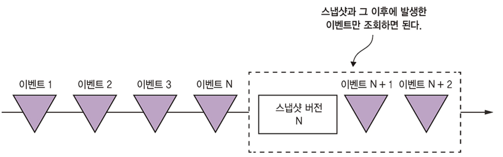
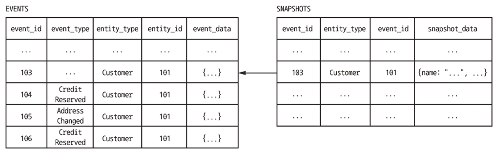
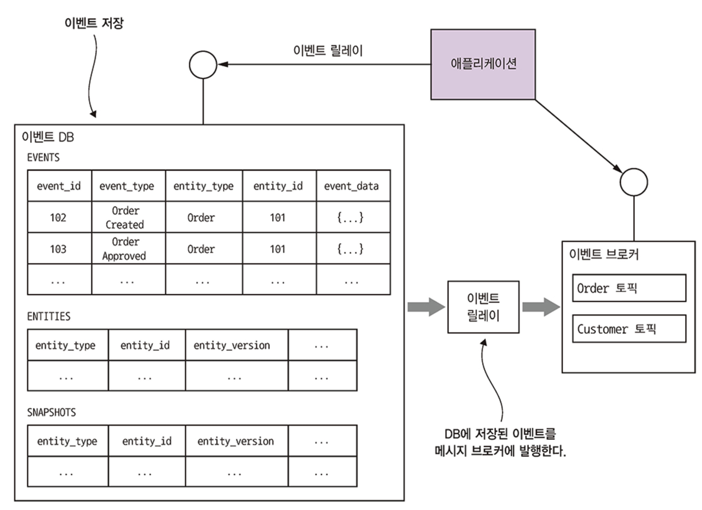
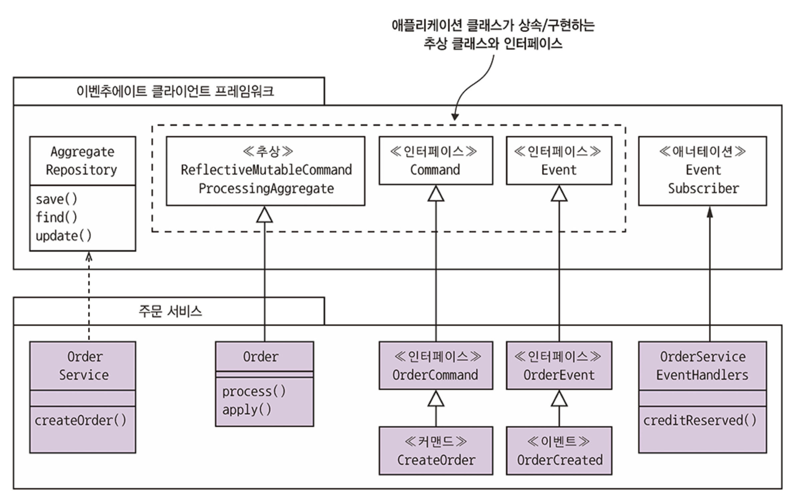
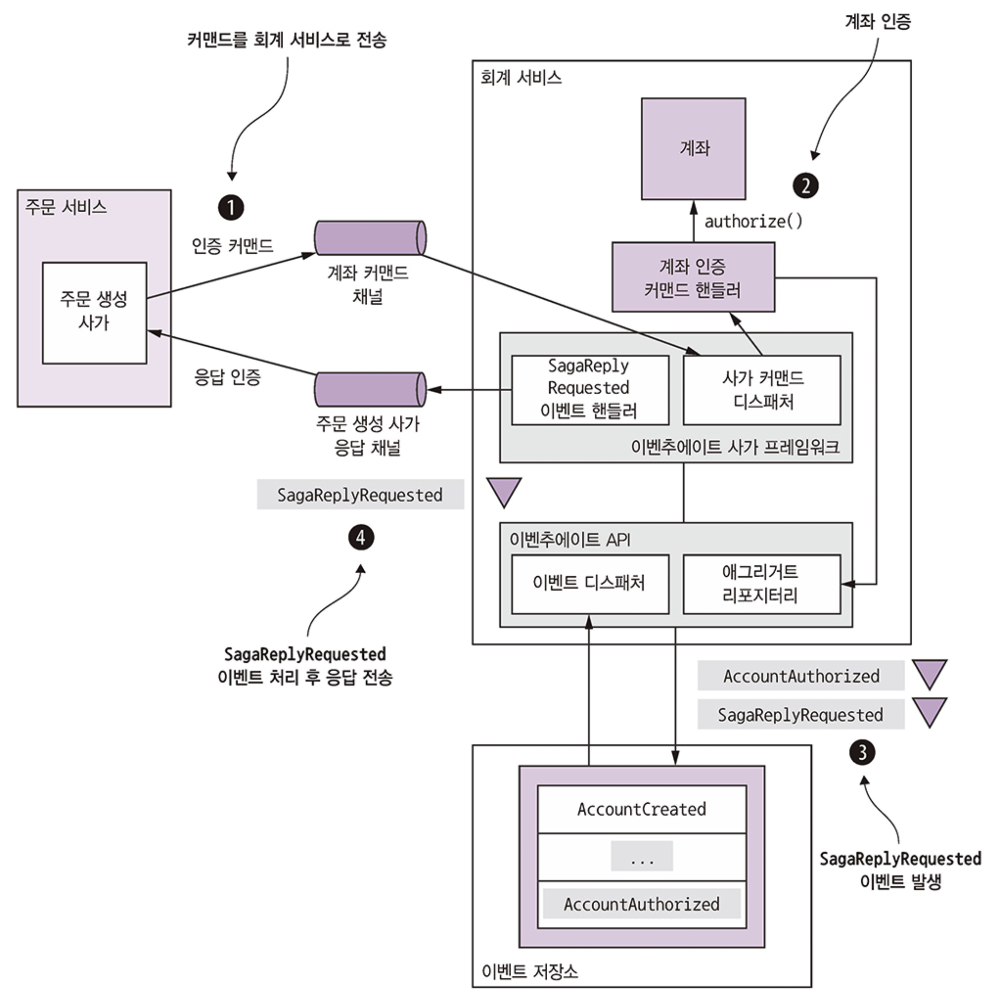

# Part 6. 비즈니스 로직 개발: 이벤트 소싱

## 이벤트 소싱 응용 비즈니스 로직 개발

### 기존 영속화의 문제점

대부분의 기업 애플리케이션에서 데이터를 저장하는 방식인 전통적인 영속화 방식은 클래스를 데이터베이스 테이블에, 클래스의 필드를 테이블 컬럼에, 클래스 인스턴스를 테이블 행에 매핑합니다.  예를 들어, 5장에서 설명된 Order 애그리거트는 ORDER 테이블에 매핑됩니다. 이 방식은 잘 작동하지만 몇 가지 단점과 한계가 있습니다:

* **객체-관계 임피던스 불일치(Object-Relational impedance mismatch)**: 
  * 관계형 스키마의 표 형식 구조와 풍부한 도메인 모델의 그래프 구조 사이에 근본적인 개념적 불일치가 존재합니다.
* **애그리거트 이력 부족(Lack of aggregate history)**: 
  * 전통적인 영속화는 애그리거트의 현재 상태만 저장하며, 업데이트되면 이전 상태가 손실됩니다. 
  * 이력을 보존하려면 개발자가 직접 메커니즘을 구현해야 하며, 이는 시간 소모적이고 비즈니스 로직과 동기화해야 하는 중복 코드를 발생시킵니다.
* **감사 로깅 구현의 번거로움 및 오류 가능성(Implementing audit logging is tedious and error prone)**: 
  * 많은 애플리케이션은 애그리거트를 변경한 사용자를 추적하는 감사 로그를 유지해야 합니다. 
  * 감사 로깅 코드는 비즈니스 로직과 분리될 수 있어 버그를 유발할 위험이 있습니다.
* **이벤트 발행이 비즈니스 로직에 고정됨(Event publishing is bolted on to the business logic)**: 
  * 전통적인 영속화는 일반적으로 도메인 이벤트 발행을 지원하지 않습니다. 데이터 변경 시 자동으로 메시지를 발행하는 기능이 없으므로, 개발자는 이력 및 감사 로깅과 마찬가지로 이벤트 생성 로직을 비즈니스 로직에 추가해야 하며, 이는 동기화되지 않을 위험이 있습니다.

이러한 문제들에 대한 해결책이 바로 **이벤트 소싱**입니다.

### 이벤트 소싱 개요

**이벤트 소싱은 비즈니스 로직을 구현하고 애그리거트를 영속화하는 이벤트 중심의 기법**입니다.

<figure><figcaption></figcaption></figure>

* **애그리거트 영속화 방식**: 애그리거트는 데이터베이스에 **이벤트의 연속(sequence of events)으로 저장**됩니다. 
  * 각 이벤트는 애그리거트의 상태 변경을 나타냅니다. 
  * 이러한 이벤트는 **이벤트 저장소(event store)**라는 데이터베이스에 저장됩니다. 
  * 애플리케이션이 애그리거트를 생성하거나 업데이트할 때, 애그리거트가 발생시킨 이벤트를 `EVENTS` 테이블에 삽입합니다.
* **애그리거트 상태 재구성**: 애플리케이션은 **이벤트 저장소에서 해당 이벤트를 검색하여 재생함으로써 애그리거트의 현재 상태를 재구성**합니다. 
  * 이는 애그리거트 인스턴스를 생성하고, 로드된 각 이벤트를 반복하면서 애그리거트의 `applyEvent()` 메서드를 호출하여 상태를 변경하는 방식으로 이루어집니다.
* **이벤트의 역할**:
  * 이벤트 소싱에서는 이벤트가 **상태 변경을 나타내야 합니다**. 
    * 애그리거트의 모든 상태 변경은 생성을 포함하여 도메인 이벤트로 표현됩니다.
  * 이벤트는 **상태 전환을 수행하는 데 필요한 데이터를 포함**해야 합니다. 
    * 예를 들어 `OrderCreatedEvent`는 `Order`를 초기화하는 데 필요한 모든 데이터를 포함해야 합니다.
* **애그리거트 메서드의 구성**:
  * 이벤트 소싱 기반 애플리케이션에서 애그리거트의 **command method는 상태 변경을 직접 하지 않고 이벤트를 생성**합니다.
  * 명령 메서드는 일반적으로 두 가지 이상의 메서드로 리팩토링됩니다:
    * **`process()` 메서드**: **명령 객체(command object)를 매개변수로 받아 유효성을 검사하고, 애그리거트의 상태를 변경하지 않고 상태 변경을 나타내는 이벤트 목록을 반환**합니다. 
      * 명령을 수행할 수 없으면 예외를 발생시킵니다.
    * **`apply()` 메서드**: **특정 이벤트 유형을 매개변수로 받아 애그리거트의 상태를 업데이트**합니다. 
      * 이벤트는 이미 발생한 상태 변경을 나타내므로 이 메서드는 실패할 수 없습니다.
  * **애그리거트 생성 및 업데이트 절차**:
    * **생성**: 
      * 1) 기본 생성자로 애그리거트 루트 인스턴스화, 
      * 2) `process()` 호출하여 새 이벤트 생성, 
      * 3) 새 이벤트를 반복하여 `apply()` 호출로 애그리거트 업데이트, 
      * 4) 새 이벤트를 이벤트 저장소에 저장.
    * **업데이트**: 
      * 1) 이벤트 저장소에서 애그리거트 이벤트 로드, 
      * 2) 기본 생성자로 애그리거트 루트 인스턴스화, 
      * 3) 로드된 이벤트를 반복하여 `apply()` 호출, 
      * 4) `process()` 메서드 호출하여 새 이벤트 생성, 
      * 5) 새 이벤트를 반복하여 `apply()` 호출로 애그리거트 업데이트, 
      * 6) 새 이벤트를 이벤트 저장소에 저장.
* **Order 애그리거트 예시**: 5장에서 JPA 기반 Order 애그리거트의 `createOrder()` 및 `reviseOrder()`와 같은 메서드는 이벤트 소싱 버전에서 `process()` 및 `apply()` 메서드로 대체됩니다.

### 낙관적 락킹을 사용한 동시 업데이트 처리

이벤트 저장소는 동시 업데이트를 처리하기 위해 **낙관적 락킹(optimistic locking)**을 사용할 수 있습니다. 
- 각 애그리거트 인스턴스는 이벤트와 함께 읽히는 버전을 가지며, 애플리케이션이 이벤트를 삽입할 때 이벤트 저장소는 버전이 변경되지 않았는지 확인합니다. 
- 간단한 방법은 **이벤트 수를 버전 번호로 사용**하거나, 명시적인 버전 번호를 유지할 수 있습니다.

```sql
UPDATE AGGREGATE_ROOT_TABLE
SET VERSION = VERSION + 1 ...
WHERE VERSION = <원본 버전>
```

### 이벤트 소싱과 이벤트 발행

이벤트 소싱은 애그리거트를 이벤트로 영속화하고 현재 상태를 재구성하는 것 외에, **신뢰할 수 있는 이벤트 발행 메커니즘**으로도 사용될 수 있습니다.  
이벤트를 이벤트 저장소에 저장하는 것은 본질적으로 원자적인 작업입니다.

* **이벤트 발행 메커니즘**: 이벤트 소싱 기반 애플리케이션은 데이터베이스에 삽입된 메시지를 발행하기 위해 **폴링(polling)** 또는 **트랜잭션 로그 테일링(transaction log tailing)**과 같은 메커니즘을 사용할 수 있습니다. 
  * 주요 차이점은 이벤트 소싱이 이벤트를 `EVENTS` 테이블에 영구적으로 저장한다는 것입니다.
    * **폴링 사용**: `EVENTS` 테이블을 폴링하여 새 이벤트를 찾아 메시지 브로커로 발행할 수 있습니다. 
      * 하지만 트랜잭션이 이벤트를 생성하는 순서와 다르게 커밋될 수 있어 이벤트가 건너뛰어질 위험이 있습니다. 
      * 이를 해결하기 위해 **`PUBLISHED` 컬럼을 추가하여 발행 여부를 추적**할 수 있습니다.
    * **트랜잭션 로그 테일링 사용**: 더 정교한 이벤트 저장소는 트랜잭션 로그 테일링을 사용하여 이벤트를 안정적으로 발행하며, 이는 더 나은 성능과 확장성을 제공합니다. 
      * 예를 들어 Eventuate Local은 이 방식을 사용합니다.

### 성능 향상을 위한 스냅샷 사용

오랫동안 살아있는 애그리거트는 많은 이벤트를 가질 수 있어, 모든 이벤트를 로드하고 재생하는 것이 비효율적일 수 있습니다.  
이 문제를 해결하기 위해 **애그리거트 상태의 스냅샷을 주기적으로 영속화**하는 일반적인 해결책이 있습니다.

<figure><figcaption></figcaption></figure>

**작동 방식**: 애플리케이션은 **가장 최신 스냅샷과 스냅샷 이후에 발생한 이벤트만을 로드하여 애그리거트의 상태를 복원**합니다. 
* 이 스냅샷은 애그리거트의 JSON 직렬화일 수 있으며, 더 복잡한 애그리거트는 Memento 패턴을 사용하여 스냅샷될 수 있습니다.

고객 서비스 스냅샷 JSON을 역직렬화하고 로드하여 #104~#106 이벤트를 적용하면 Customer를 되살릴 수 있다.

<figure><figcaption></figcaption></figure>

### 멱등성 메시지 처리

메시지 브로커는 동일한 메시지를 여러 번 전달할 수 있으므로, 서비스가 다른 서비스의 메시지를 소비할 때 **멱등성(idempotent)을 보장**하는 것이 중요합니다.  
멱등성은 동일한 메시지로 여러 번 안전하게 호출될 수 있음을 의미합니다.

* **RDBMS 기반 이벤트 저장소**: `PROCESSED_MESSAGES` 테이블에 메시지 ID를 삽입하여 중복 메시지를 감지하고 버릴 수 있습니다. 
  * 이 과정은 이벤트를 `EVENTS` 테이블에 삽입하는 트랜잭션의 일부로 이루어집니다.
* **NoSQL 기반 이벤트 저장소**: 메시지 소비자는 메시지 ID를 처리 중 생성된 이벤트에 저장하고, 애그리거트 이벤트에 메시지 ID가 없는지 확인하여 중복을 감지합니다. 
  * 단, 메시지 처리가 이벤트를 생성하지 않는 경우 문제가 발생할 수 있으며, 이 경우 메시지 ID 기록을 위해 **'가상 이벤트(pseudo event)'를 발행**하여 항상 이벤트를 발행하도록 할 수 있습니다.

### 도메인 이벤트 발전시키기

이벤트 소싱은 이벤트를 영구적으로 저장하기 때문에, 이벤트 구조가 시간이 지남에 따라 변할 수 있다는 문제에 직면합니다.  
애플리케이션은 잠재적으로 여러 버전의 이벤트를 다뤄야 합니다.

* **이벤트 스키마 진화의 유형**: 스키마(애그리거트 유형 정의), 애그리거트(애그리거트가 발행하는 이벤트 유형), 이벤트(이벤트 필드 구조) 수준에서 변경이 발생할 수 있습니다. 
  * 필드 추가와 같은 일부 변경은 하위 호환성(backward-compatible)이 있지만, 이벤트 이름이나 필드 이름 변경과 같은 변경은 그렇지 않습니다.
* **스키마 변경 관리(Upcasting)**: SQL 데이터베이스의 스키마 마이그레이션과 유사하게, 이벤트 소싱 애플리케이션은 비하위 호환성 변경을 처리하기 위해 **"업캐스터(upcaster)"라는 구성 요소를 사용하여 이벤트를 이벤트 저장소에서 로드할 때 이전 버전에서 최신 버전으로 변환**합니다.
  * 이를 통해 애플리케이션 코드는 항상 현재 이벤트 스키마만 다룰 수 있습니다.

### 이벤트 소싱의 이점

* **도메인 이벤트를 안정적으로 발행**: 애그리거트의 상태가 변경될 때마다 이벤트를 안정적으로 발행하여 이벤트 중심 마이크로서비스 아키텍처의 강력한 기반을 제공합니다. 
  * 이는 정확한 감사 로그를 제공하며, 사용자 알림, 애플리케이션 통합, 분석, 모니터링 등 다양한 목적으로 활용될 수 있습니다.
* **애그리거트 이력 보존**: 각 애그리거트의 전체 이력을 저장하여 특정 시점의 애그리거트 상태를 쉽게 조회하거나 재구성할 수 있습니다.
* **O/R 임피던스 불일치 문제 대부분 회피**: 이벤트를 영속화하고, 이벤트는 일반적으로 간단하고 쉽게 직렬화 가능한 구조를 가집니다.
* **개발자에게 타임머신 제공**: 애플리케이션 생애 동안 발생한 모든 이력을 저장하여, 예상치 못한 새로운 요구사항이 발생했을 때 과거 데이터를 활용하여 즉시 구현할 수 있는 "타임머신" 역할을 합니다.

### 이벤트 소싱의 단점

* **다른 프로그래밍 모델과 학습 곡선**: 익숙하지 않은 프로그래밍 모델이므로 학습 곡선이 필요하며, 기존 애플리케이션에 적용하려면 비즈니스 로직을 재작성해야 합니다.
* **메시징 기반 애플리케이션의 복잡성**: 메시지 브로커가 최소 한 번 전달(at-least-once delivery)을 보장하므로, 멱등성이 없는 이벤트 핸들러는 중복 이벤트를 감지하고 버려야 합니다.
* **이벤트 진화의 어려움**: 이벤트 스키마(및 스냅샷)가 시간이 지남에 따라 진화할 수 있으며, 영구 저장된 이벤트로 인해 애그리거트가 여러 버전의 스키마를 처리하는 코드로 비대해질 위험이 있습니다. 
  * 이벤트를 로드할 때 최신 버전으로 업그레이드하는 업캐스팅이 좋은 해결책입니다.
* **데이터 삭제의 어려움**: 이벤트 소싱은 애그리거트 이력 보존을 목표로 하기 때문에 데이터를 영원히 저장하는 경향이 있습니다. 
  * GDPR과 같은 규정을 준수하기 위해 개인 정보를 삭제해야 할 때 소프트 삭제 외에 암호화나 가명화(pseudonymization)와 같은 기술을 사용해야 할 수 있습니다.
* **이벤트 저장소 쿼리의 어려움**: 이벤트 저장소는 현재 상태를 직접 쿼리하기 어렵습니다. 
  * 예를 들어, 특정 조건의 고객을 찾으려면 이벤트를 폴딩하여 상태를 계산해야 하므로 비효율적이며, NoSQL 기반 이벤트 저장소는 주로 기본 키 기반 조회를 지원하므로 **CQRS 패턴을 사용하여 쿼리해야 합니다**.

## 이벤트 저장소 구현

이벤트 스토어는 **데이터베이스와 메시지 브로커의 하이브리드** 형태로 작동하며, 기본 키(primary key)를 사용하여 애그리게이트의 이벤트를 삽입하고 검색하는 API를 제공하고, 이벤트를 구독하는 API도 제공합니다.

이벤트 스토어를 구현하는 방법에는 두 가지 주요 옵션이 있습니다:
* **자체 구현**: 관계형 데이터베이스 관리 시스템(RDBMS)에 이벤트를 유지하고, 구독자들이 EVENTS 테이블을 폴링(polling)하여 이벤트를 발행할 수 있습니다. 
  * 하지만 이 경우 모든 이벤트를 순서대로 처리하는 것이 어렵다는 문제가 있습니다.
* **특수 목적 이벤트 스토어 사용**: 풍부한 기능, 향상된 성능, 확장성을 제공하는 전문 이벤트 스토어를 사용할 수 있습니다. 
  * 소스에서는 Greg Young이 개발한 Event Store, Lightbend의 Lagom, Axon, 그리고 Eventuate를 예시로 들고 있습니다. 
  * 이 중 **Eventuate**가 예시로 자세히 설명됩니다.

### Eventuate Local 이벤트 스토어의 작동 방식

<figure><figcaption></figcaption></figure>

**Eventuate Local**은 MySQL과 Apache Kafka를 기반으로 하는 오픈 소스 이벤트 스토어입니다. 그 아키텍처는 다음과 같은 주요 구성 요소로 이루어져 있습니다:
* **이벤트 데이터베이스**: 이벤트를 저장하며, MySQL과 같은 RDBMS를 사용합니다.
  * **스키마**: `events` 테이블은 이벤트를 저장하고, `entities` 테이블은 각 엔티티의 현재 버전을 저장하여 **낙관적 잠금(optimistic locking)**을 구현하는 데 사용됩니다. `snapshots` 테이블은 엔티티의 스냅샷을 저장합니다.
  * **지원 작업**: `find()`, `create()`, `update()` 세 가지 작업이 지원됩니다. 
    * `find()`는 최신 스냅샷과 그 이후의 이벤트를 조회하여 애그리게이트의 상태를 재구성합니다. 
    * `create()`는 `entities` 테이블과 `events` 테이블에 행을 삽입합니다. 
    * `update()`는 `events` 테이블에 이벤트를 삽입하고, `entities` 테이블의 `entity_version`을 업데이트하여 낙관적 잠금 검사를 수행합니다. 이러한 업데이트는 트랜잭션 내에서 원자적으로(atomically) 수행됩니다.
* **이벤트 브로커**: 이벤트를 구독자에게 전달하는 역할을 하며, Apache Kafka를 사용하여 구현됩니다. 
  * 각 애그리게이트 타입별로 토픽(topic)을 가지며, 애그리게이트 ID는 메시지 순서를 보존하는 파티션 키로 사용됩니다.
* **이벤트 릴레이**: 이벤트 데이터베이스에 삽입된 이벤트를 이벤트 브로커로 전파하는 역할을 합니다. 
  * 이는 주로 **트랜잭션 로그 테일링**(ex: MySQL binlog)을 사용하며, 필요한 경우 폴링 방식을 사용하기도 합니다. 
  * Eventuate Local의 이벤트 릴레이는 독립 실행형 프로세스로 배포되며, 재시작 시 올바른 위치에서 이벤트를 읽기 위해 현재 위치를 Apache Kafka 토픽에 주기적으로 저장합니다.

### Eventuate 클라이언트 프레임워크 (Java)

<figure><figcaption></figcaption></figure>

**Eventuate 클라이언트 프레임워크**는 Java 개발자가 Eventuate Local 이벤트 스토어를 사용하여 이벤트 소싱 기반 애플리케이션을 쉽게 개발할 수 있도록 돕습니다.
* **기본 클래스 및 인터페이스**: 애그리게이트를 위한 `ReflectiveMutableCommandProcessingAggregate` 클래스를 제공하며, 이는 리플렉션을 사용하여 커맨드(`process()` 메서드)와 이벤트(`apply()` 메서드)를 적절한 메서드로 디스패치합니다. 
  * 커맨드 클래스는 `Command` 인터페이스를 확장해야 하며, 이벤트 클래스는 `Event` 인터페이스를 확장해야 합니다.
* **AggregateRepository**: 애그리게이트의 생성(save()), 조회(find()), 업데이트(update()) 기능을 제공하는 제네릭 클래스입니다. 
  * 이 클래스는 애그리게이트를 생성하거나 업데이트하는 데 필요한 **상용구 코드(boilerplate code)를 캡슐화**하여 편리함을 제공합니다.
* **도메인 이벤트 구독**: `@EventSubscriber` 및 `@EventHandlerMethod` 어노테이션을 사용하여 이벤트 핸들러를 작성할 수 있는 API를 제공합니다.

이벤트 소싱은 애그리게이트의 전체 이력(history)을 보존하고, 정확한 감사 로그(audit log)를 제공하며, 도메인 이벤트를 안정적으로 발행하는 등의 여러 이점을 제공합니다. 이러한 이점 덕분에 이벤트 소싱은 마이크로서비스 아키텍처에서 특히 유용하게 사용될 수 있습니다.

## 사가와 이벤트 소싱을 접목

사가는 여러 서비스에 걸쳐 데이터 일관성을 유지하기 위해 로컬 트랜잭션 시퀀스를 사용하는 패턴입니다.

### 코레오그래피 기반 사가 구현
* **용이성**: 이벤트 소싱은 이벤트 중심적(event-driven) 특성 덕분에 코레오그래피(choreography) 기반 사가 구현을 매우 **직관적**으로 만듭니다. 
  * 애그리게이트가 업데이트될 때 이벤트를 발행하고, 다른 애그리게이트의 이벤트 핸들러가 해당 이벤트를 소비하여 자신의 애그리게이트를 업데이트합니다. 
  * 이벤트 소싱 프레임워크는 각 이벤트 핸들러를 **멱등성(idempotent)** 있게 자동으로 만듭니다.
* **단점**: 이벤트가 상태 변경을 나타내는 본래의 목적 외에 사가 코레오그래피를 위해 사용될 때 **이벤트의 이중 목적**이라는 문제가 발생할 수 있습니다. 
  * 예를 들어, 비즈니스 규칙 위반으로 인해 애그리게이트가 업데이트되지 않더라도 오류를 보고하기 위해 이벤트를 발행해야 할 수 있으며, 더 나쁜 경우 사가 참여자가 애그리게이트를 생성할 수 없을 때 오류 이벤트를 발행할 애그리게이트 자체가 없을 수 있습니다. 
  * 이러한 문제들로 인해 복잡한 사가는 오케스트레이션(orchestration) 방식이 더 적합하다고 제시됩니다.

### 오케스트레이션 기반 사가 생성

이벤트 스토어의 제한된 트랜잭션 모델 때문에 오케스트레이션 기반 사가와 이벤트 소싱 비즈니스 로직을 통합하는 것은 더 복잡할 수 있습니다. 각 사가 단계는 애그리게이트 생성/업데이트, 오케스트레이터 생성/상태 업데이트, 커맨드 메시지 전송 등 여러 작업을 원자적으로(atomically) 수행해야 합니다.

### 사가 오케스트레이터 생성

**RDBMS 기반 이벤트 스토어 사용 시**: 
- Eventuate Local과 같이 **RDBMS를 기반으로 하는 이벤트 스토어**를 사용하는 경우, 서비스는 이벤트 스토어 업데이트와 사가 오케스트레이터 생성을 **동일한 ACID 트랜잭션 내에서 원자적으로** 수행할 수 있습니다. 
- 이는 Eventuate Tram 사가 프레임워크와 같은 기존 RDBMS 기반 프레임워크와의 통합을 용이하게 합니다.

**NoSQL 기반 이벤트 스토어 사용 시**: 
- 제한된 트랜잭션 모델 때문에 동일한 트랜잭션 내에서 두 가지 작업을 원자적으로 수행하기 어렵습니다. 
- 이 경우, 서비스는 **도메인 이벤트에 응답하여 사가 오케스트레이터를 생성하는 이벤트 핸들러**를 사용해야 합니다. 
- 예를 들어, `OrderCreated` 이벤트가 발행되면 이벤트 핸들러가 `CreateOrderSaga`를 생성하는 방식입니다.
  - **중복 이벤트 처리**: `At-least-once delivery` 때문에 이벤트 핸들러가 여러 번 호출될 수 있으므로, **사가의 ID를 이벤트의 고유 속성(애그리게이트 ID 또는 이벤트 ID)에서 파생**하여 중복 생성을 방지해야 합니다.

### 이벤트 소싱 기반 사가 참여자 구현

사가 참여자가 오케스트레이션 기반 사가에 참여할 때 몇 가지 문제가 발생합니다.

**RDBMS 기반 이벤트 스토어 사용 시**: 
- RDBMS 기반 이벤트 스토어를 사용하는 서비스(예: Eventuate Local)는 Eventuate Tram 프레임워크가 시작하는 ACID 트랜잭션의 일부로 사가 커맨드 메시지를 처리하고 응답을 보내는 것을 **원자적으로 보장**할 수 있습니다.

**멱등성 커맨드 메시지 처리**: 
- 사가 참여자는 **메시지 ID를 애그리게이트 처리 시 생성된 이벤트에 기록**하고, 애그리게이트 업데이트 전에 해당 메시지 ID를 확인하여 중복 메시지를 감지하고 버림으로써 멱등성을 구현할 수 있습니다.

**응답 메시지 원자적 전송**:
* 사가 커맨드 처리 시 애그리게이트 상태 변경이 없으면 이벤트가 발생하지 않아 응답이 전송되지 않거나, 오케스트레이터가 이벤트 소싱 참여자와 비이벤트 소싱 참여자를 다르게 처리해야 하는 문제가 있습니다.
* **더 나은 접근 방식**: 사가 참여자는 두 단계 프로세스를 사용합니다.
  * 사가 커맨드 핸들러가 애그리게이트를 생성하거나 업데이트할 때, 실제 이벤트와 함께 **`SagaReplyRequested`라는 의사(pseudo) 이벤트**를 이벤트 스토어에 저장하도록 준비합니다.
  * `SagaReplyRequested` 의사 이벤트에 대한 이벤트 핸들러가 이벤트에 포함된 데이터를 사용하여 응답 메시지를 구성한 다음, 이를 사가 오케스트레이터의 응답 채널로 보냅니다.
* Eventuate Saga 프레임워크는 `AggregateRepository.update()` 메서드의 `UpdateOptions`를 통해 이 메커니즘을 지원합니다.

<figure><figcaption></figcaption></figure>

### 이벤트 소싱을 이용한 사가 오케스트레이터 구현

이벤트 소싱을 사용하여 사가 오케스트레이터를 구현할 수 있으며, 이를 통해 전체 애플리케이션을 이벤트 스토어 기반으로 개발할 수 있습니다.

* **사가 오케스트레이터 영속화**: 오케스트레이터는 `SagaOrchestratorCreated` (생성 시) 및 `SagaOrchestratorUpdated` (업데이트 시) 이벤트를 사용하여 영속화됩니다. 
  * 이 이벤트들은 사가 오케스트레이터의 상태를 재구성하는 데 필요한 데이터를 포함합니다.
* **커맨드 메시지 신뢰성 있게 전송**:
  * **RDBMS 기반 이벤트 스토어**: Eventuate Tram과 동일하게 업데이트와 커맨드 메시지 삽입을 동일한 트랜잭션으로 처리할 수 있습니다.
  * **NoSQL 기반 이벤트 스토어**: **`SagaCommandEvent`**를 발행하고, 이 이벤트를 처리하는 이벤트 핸들러가 해당 커맨드 메시지를 적절한 채널로 전송하는 **두 단계 프로세스**를 사용합니다.
  * 이 방식은 `at-least-once delivery`를 보장하며, `SagaCommandEvent`의 고유 ID를 커맨드 메시지의 ID로 사용하여 중복 메시지를 쉽게 감지하고 버릴 수 있습니다.
* **응답 메시지 정확히 한 번 처리**: 오케스트레이터는 응답 메시지 ID를 처리 시 발행하는 이벤트에 저장하여 중복 응답 메시지를 감지하고 버릴 수 있습니다.

## 마치며

- 이벤트 소싱은 애그리거트를 일련의 이벤트로 저장하며, 여기서 각 이벤트는 애그리거트의 생성 또는 상태 변화를 나타냅니다.
  - 이벤트를 재생성하면 특정 애그리거트 상태를 그대로 재생성할 수 있습니다.
  - 이벤트 소싱 덕분에 도메인 객체의 이력 및 감사 로그를 정확히 남기고 도메인 이벤트를 확실하게 발행할 수 있습니다.
- 스냅샷은 재연해야 할 이벤트 개수를 줄여 성능을 향상시킵니다.
- 이벤트는 DB와 메시지 브로커를 혼합한 형태인 이벤트 저장소에 저장됩니다.
  - 개발자는 이벤추에이트 클라이언트 프레임워크를 이용하여 애그리거트 및 이벤트 핸들러를 작성할 수 있습니다.
- 애플리케이션에서 이벤트 재연 시 여러 버전의 이벤트를 처리해야 할 수도 있기 때문에 이벤트 발전을 다루는 일이 관건입니다.
  - 따라서 이벤트 저장소에서 이벤트를 가져올 때 최근 버전으로 이벤트를 업그레이드하는 업케스팅이 좋은 방법입니다.
- 이벤트 소싱 애플리케이션은 데이터를 삭제하기 까다롭습니다.
  - 개인 정보를 삭제하는 애플리케이션에서 유럽 연합 GDPR 등의 규정을 준수하려면 암호화/가명화 등의 기법을 동원해야 합니다.
- 이벤트 소싱을 이용하면, 이벤트 소싱 기반의 애그리거트가 발행한 이벤트 리스닝하는 이벤트 핸들러가 서비스에 달려 있기 떄문에 코레오그래피 사가를 간단히 구현할 수 있습니다.
- 이벤트 소싱은 사가 오케스트레이터를 구현하기 좋은 수단입니다.
  - 덕분에 이벤트 저장소를 배타적으로 사용하는 애플리케이션을 작성할 수 있습니다.