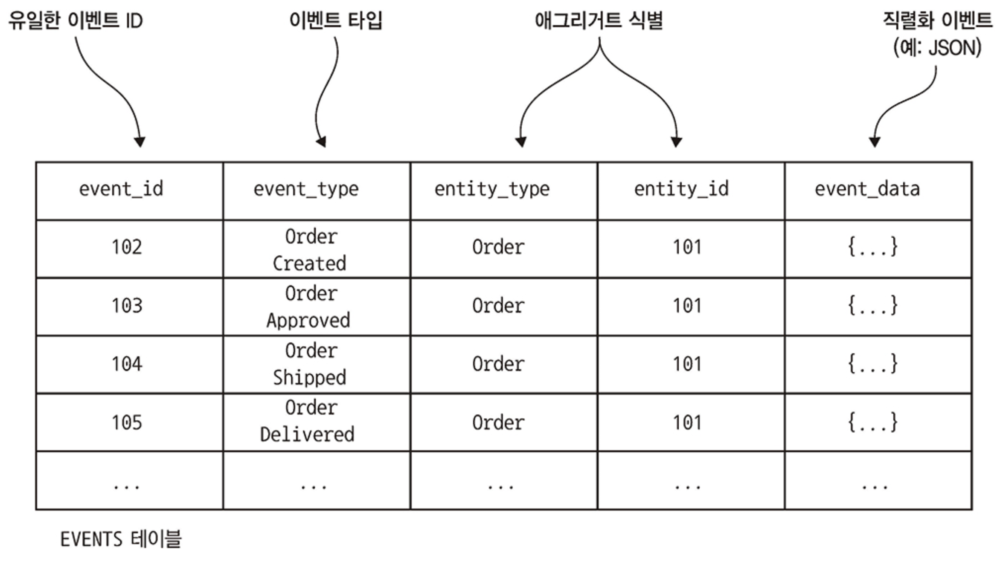

# Part 6. 비즈니스 로직 개발: 이벤트 소싱

## 이벤트 소싱 응용 비즈니스 로직 개발

### 기존 영속화의 문제점

대부분의 기업 애플리케이션에서 데이터를 저장하는 방식인 전통적인 영속화 방식은 클래스를 데이터베이스 테이블에, 클래스의 필드를 테이블 컬럼에, 클래스 인스턴스를 테이블 행에 매핑합니다.  예를 들어, 5장에서 설명된 Order 애그리거트는 ORDER 테이블에 매핑됩니다. 이 방식은 잘 작동하지만 몇 가지 단점과 한계가 있습니다:

* **객체-관계 임피던스 불일치(Object-Relational impedance mismatch)**: 
  * 관계형 스키마의 표 형식 구조와 풍부한 도메인 모델의 그래프 구조 사이에 근본적인 개념적 불일치가 존재합니다.
* **애그리거트 이력 부족(Lack of aggregate history)**: 
  * 전통적인 영속화는 애그리거트의 현재 상태만 저장하며, 업데이트되면 이전 상태가 손실됩니다. 
  * 이력을 보존하려면 개발자가 직접 메커니즘을 구현해야 하며, 이는 시간 소모적이고 비즈니스 로직과 동기화해야 하는 중복 코드를 발생시킵니다.
* **감사 로깅 구현의 번거로움 및 오류 가능성(Implementing audit logging is tedious and error prone)**: 
  * 많은 애플리케이션은 애그리거트를 변경한 사용자를 추적하는 감사 로그를 유지해야 합니다. 
  * 감사 로깅 코드는 비즈니스 로직과 분리될 수 있어 버그를 유발할 위험이 있습니다.
* **이벤트 발행이 비즈니스 로직에 고정됨(Event publishing is bolted on to the business logic)**: 
  * 전통적인 영속화는 일반적으로 도메인 이벤트 발행을 지원하지 않습니다. 데이터 변경 시 자동으로 메시지를 발행하는 기능이 없으므로, 개발자는 이력 및 감사 로깅과 마찬가지로 이벤트 생성 로직을 비즈니스 로직에 추가해야 하며, 이는 동기화되지 않을 위험이 있습니다.

이러한 문제들에 대한 해결책이 바로 **이벤트 소싱**입니다.

### 이벤트 소싱 개요

**이벤트 소싱은 비즈니스 로직을 구현하고 애그리거트를 영속화하는 이벤트 중심의 기법**입니다.

<figure><figcaption></figcaption></figure>

* **애그리거트 영속화 방식**: 애그리거트는 데이터베이스에 **이벤트의 연속(sequence of events)으로 저장**됩니다. 
  * 각 이벤트는 애그리거트의 상태 변경을 나타냅니다. 
  * 이러한 이벤트는 **이벤트 저장소(event store)**라는 데이터베이스에 저장됩니다. 
  * 애플리케이션이 애그리거트를 생성하거나 업데이트할 때, 애그리거트가 발생시킨 이벤트를 `EVENTS` 테이블에 삽입합니다.
* **애그리거트 상태 재구성**: 애플리케이션은 **이벤트 저장소에서 해당 이벤트를 검색하여 재생함으로써 애그리거트의 현재 상태를 재구성**합니다. 
  * 이는 애그리거트 인스턴스를 생성하고, 로드된 각 이벤트를 반복하면서 애그리거트의 `applyEvent()` 메서드를 호출하여 상태를 변경하는 방식으로 이루어집니다.
* **이벤트의 역할**:
  * 이벤트 소싱에서는 이벤트가 **상태 변경을 나타내야 합니다**. 
    * 애그리거트의 모든 상태 변경은 생성을 포함하여 도메인 이벤트로 표현됩니다.
  * 이벤트는 **상태 전환을 수행하는 데 필요한 데이터를 포함**해야 합니다. 
    * 예를 들어 `OrderCreatedEvent`는 `Order`를 초기화하는 데 필요한 모든 데이터를 포함해야 합니다.
* **애그리거트 메서드의 구성**:
  * 이벤트 소싱 기반 애플리케이션에서 애그리거트의 **command method는 상태 변경을 직접 하지 않고 이벤트를 생성**합니다.
  * 명령 메서드는 일반적으로 두 가지 이상의 메서드로 리팩토링됩니다:
    * **`process()` 메서드**: **명령 객체(command object)를 매개변수로 받아 유효성을 검사하고, 애그리거트의 상태를 변경하지 않고 상태 변경을 나타내는 이벤트 목록을 반환**합니다. 
      * 명령을 수행할 수 없으면 예외를 발생시킵니다.
    * **`apply()` 메서드**: **특정 이벤트 유형을 매개변수로 받아 애그리거트의 상태를 업데이트**합니다. 
      * 이벤트는 이미 발생한 상태 변경을 나타내므로 이 메서드는 실패할 수 없습니다.
  * **애그리거트 생성 및 업데이트 절차**:
    * **생성**: 
      * 1) 기본 생성자로 애그리거트 루트 인스턴스화, 
      * 2) `process()` 호출하여 새 이벤트 생성, 
      * 3) 새 이벤트를 반복하여 `apply()` 호출로 애그리거트 업데이트, 
      * 4) 새 이벤트를 이벤트 저장소에 저장.
    * **업데이트**: 
      * 1) 이벤트 저장소에서 애그리거트 이벤트 로드, 
      * 2) 기본 생성자로 애그리거트 루트 인스턴스화, 
      * 3) 로드된 이벤트를 반복하여 `apply()` 호출, 
      * 4) `process()` 메서드 호출하여 새 이벤트 생성, 
      * 5) 새 이벤트를 반복하여 `apply()` 호출로 애그리거트 업데이트, 
      * 6) 새 이벤트를 이벤트 저장소에 저장.
* **Order 애그리거트 예시**: 5장에서 JPA 기반 Order 애그리거트의 `createOrder()` 및 `reviseOrder()`와 같은 메서드는 이벤트 소싱 버전에서 `process()` 및 `apply()` 메서드로 대체됩니다.

## 이벤트 저장소 구현

## 사가와 이벤트 소싱을 접목

## 마치며
