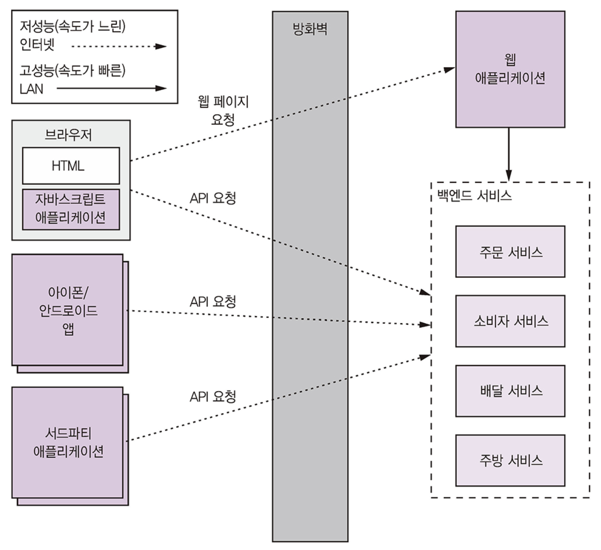
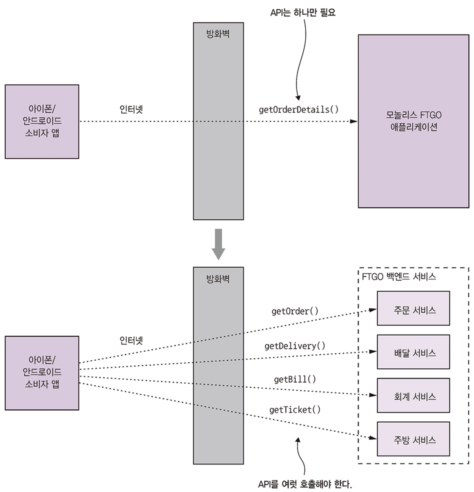
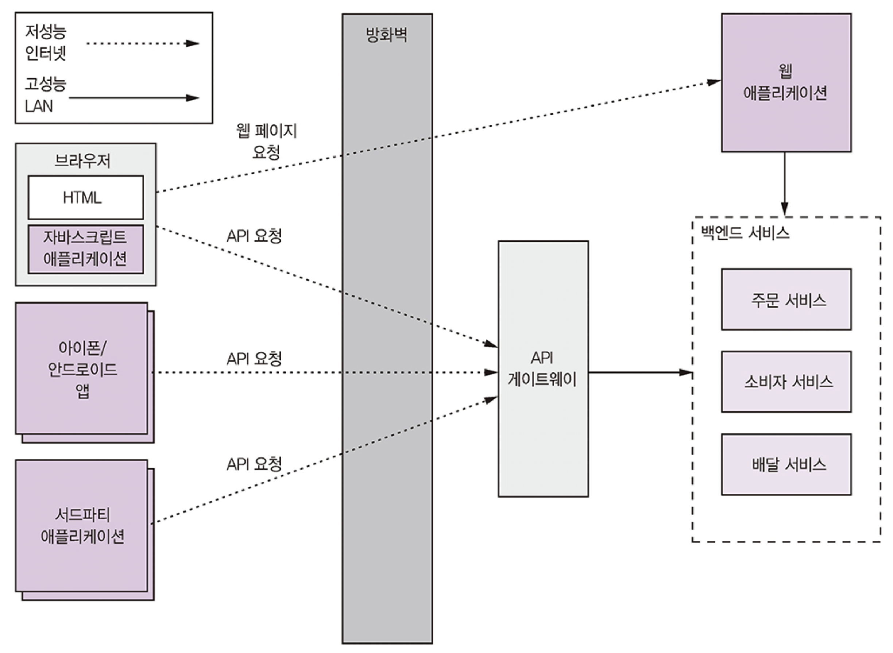
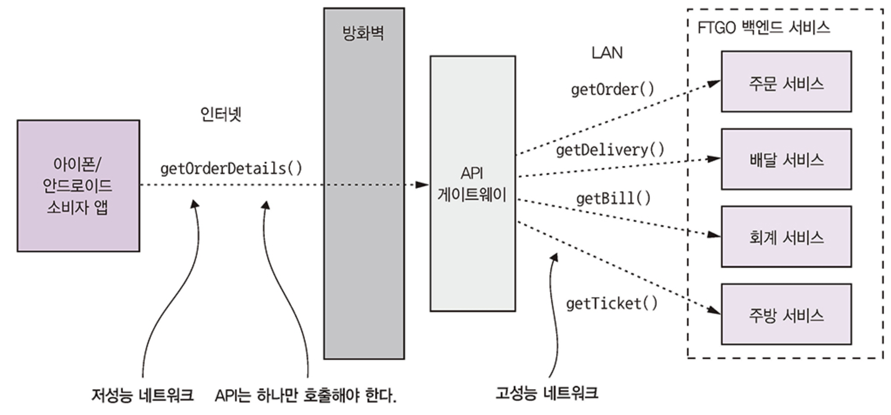
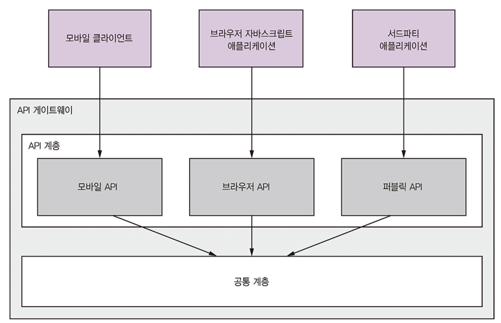
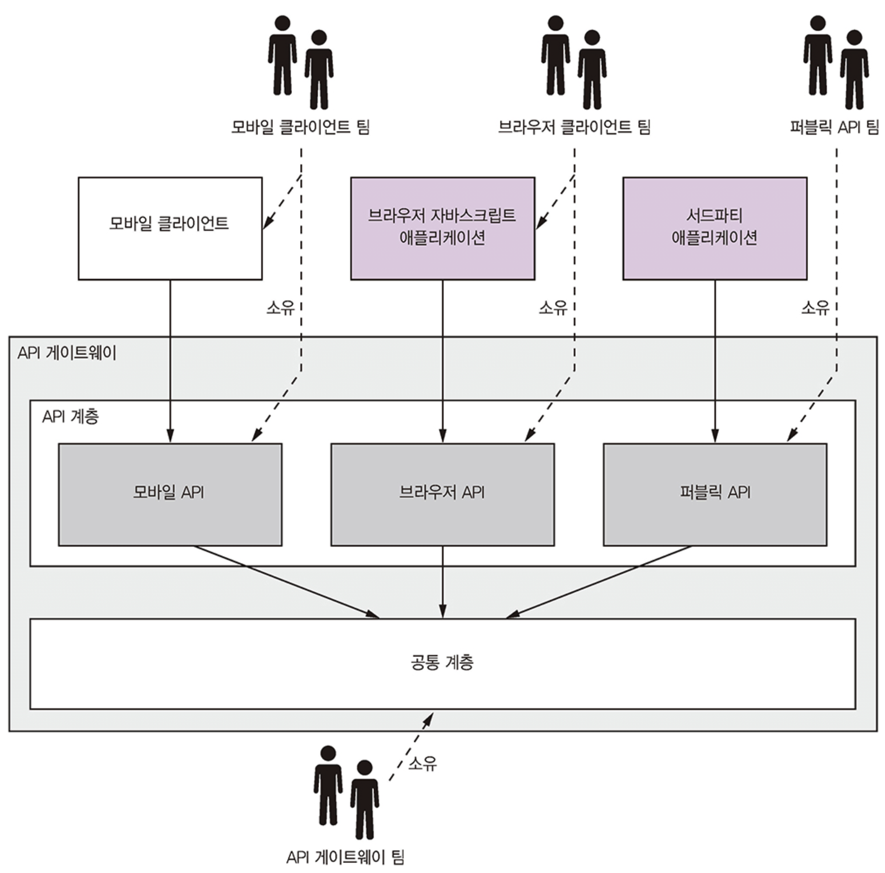
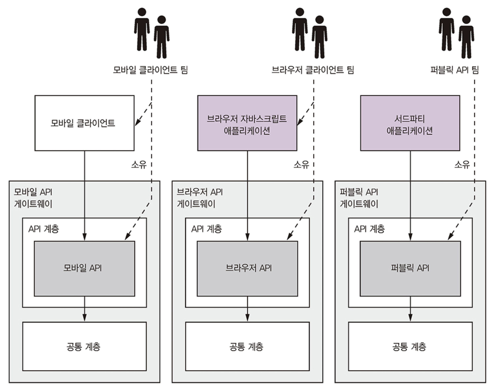
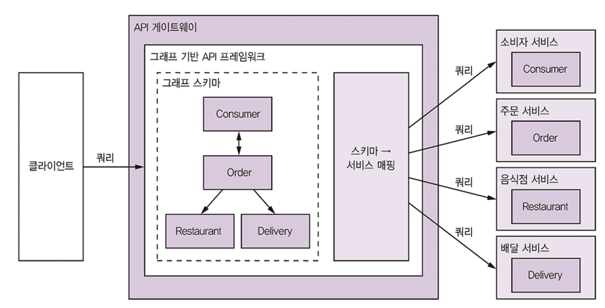
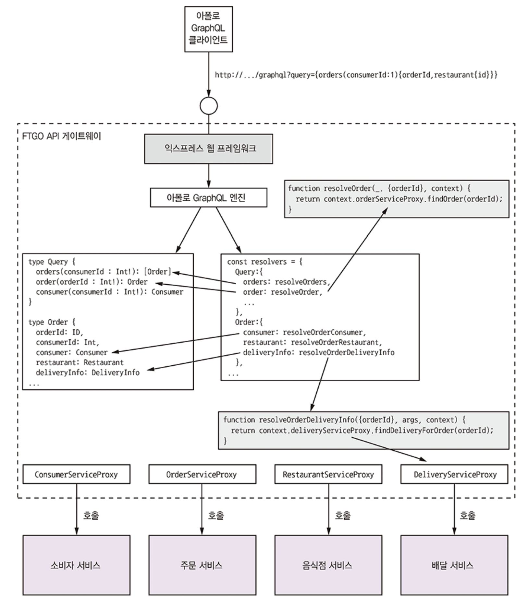

# Part 8. 외부 API 패턴

애플리케이션의 **외부 API를 설계하는 것은 클라이언트의 다양성으로 인해 매우 어렵습니다**.
* 클라이언트는 일반적으로 **서로 다른 데이터를 요구**하며(ex. 데스크톱 브라우저 UI는 모바일 앱보다 많은 정보 표시), **서로 다른 종류의 네트워크**를 통해 서비스에 접근합니다.
  * (방화벽 내부의 고성능 LAN vs. 방화벽 외부의 저성능 인터넷 또는 모바일 네트워크).
* 이 장에서는 다양한 외부 API 설계 문제를 설명하고, **API Gateway Pattern**과 **Back-ends for frontends Pattern**을 다룹니다. 
  * 또한 Spring Cloud Gateway 프레임워크나 GraphQL을 사용하여 API 게이트웨이를 설계하고 구현하는 방법을 설명합니다.

## 외부 API 설계 이슈

FTGO 애플리케이션의 서비스 API를 소비하는 네 종류의 클라이언트

<figure><figcaption></figcaption></figure>

- 브라우저 기반의 일반 소비자 및 음식점 전용 UI, 내부 관리자용 UI가 구현된 웹 애플리케이션
- 브라우저에서 실행 중인 자바스크립트 애플리케이션
- 소비자용/배달원용 모바일 앱
- 서드파티 애플리케이션

여기서 웹 애플리케이션은 방화벽 내부에 있어 `고대역폭`, `저지연 LAN`을 사용하고, 다른 클라이언트들은 방화벽 외부에 있어 `저대역폭`, `고지연 인터넷 또는 모바일 네트워크`를 통해 서비스에 접근합니다.

클라이언트가 서비스를 직접 호출하는 방식은 마이크로서비스 아키텍처에서 다음과 같은 **심각한 단점들 때문에 거의 사용되지 않습니다**:
* 서비스 API가 잘게 나뉘어져 있어 클라이언트가 필요한 데이터를 가져오려면 여러 번 요청을 해야 하고, 그만큼 효율이 떨어지고 UX는 나빠짐
* 클라이언트가 서비스 및 API를 알아야 하는 구조라서 캡슐화가 되지 않고, 나중에 아키텍처와 API를 바꾸기도 어려움
* 클라이언트(특히 방화벽 외부 클라이언트)가 사용하기에 불편하거나 실용적이지 못한 IPC를 서비스에서 사용 중인 경우가 있음

### API 설계 이슈: FTGO 모바일 클라이언트

모놀리식 버전에서는 주문 내역을 반환하는 API endpoint가 있어서 모바일 클라이언트가 원하는 정보를 요청 한 번으로 모두 조회가 가능하지만, 마이크로서비스 버전은 주문 데이터가 여러 서비스에 분산되어 있다.
- 주문 서비스: 기본 주문 정보(주문 내역, 주문 상태 등)
- 주방 서비스: 음식점 관점에서 주문 상태 및 픽업 준비를 마칠 예상 시간
- 배달 서비스: 주문 배달 상태, 예상 배달 시간, 현재 위치
- 회계 서비스: 주문 지불 상태

<figure><figcaption></figcaption></figure>

FTGO 모바일 클라이언트를 위한 API 설계 문제

* **클라이언트가 요청을 여러 번 전송하기 때문에 UX가 나빠진다**: 
  * 모바일 애플리케이션은 주문 상세 정보를 표시하기 위해 여러 서비스(주문 서비스, 주방 서비스, 배달 서비스, 회계 서비스)에 여러 번 호출해야 합니다. 
  * 특히 인터넷이나 모바일 네트워크 환경에서는 **네트워크 지연 시간이 LAN보다 100배 이상 길어** 애플리케이션이 느리게 느껴질 수 있습니다. 
  * 또한, API 구성 코드가 복잡해지고 모바일 기기의 배터리 소모가 빨라집니다.
* **캡슐화가 되지 않아 프론트엔드 개발자가 백엔드와 맞물려 코드를 변경해야 한다**:
  * 서비스 API가 변경되거나 서비스 구조가 재편될 때 클라이언트 코드를 함께 업데이트해야 합니다. 
  * 모바일 애플리케이션의 업데이트 배포는 Apple이나 Google의 승인이 필요하여 **몇 시간에서 며칠이 걸릴 수 있으며**, 사용자가 즉시 업데이트하지 않을 수도 있어 API 진화에 큰 걸림돌이 됩니다.
* **클라이언트에 비친화적인 IPC를 사용 중인 클라이언트도 있다**: 
  * 내부 서비스는 gRPC나 AMQP와 같은 프로토콜을 사용할 수 있지만, 방화벽 외부의 모바일 클라이언트는 HTTP나 WebSockets와 같은 프로토콜이 더 적합하여 직접 호출하기 어렵습니다.

### API 설계 이슈: 다른 종류의 클라이언트

* **웹 애플리케이션(방화벽 내부)**: 
  * 전통적인 서버 측 웹 애플리케이션은 LAN 내부에서 실행되므로 **네트워크 대역폭 및 지연 시간이 문제가 되지 않습니다**. 
  * 비-웹 친화적인 프로토콜 사용도 가능하며, 백엔드 서비스 팀과 긴밀히 협력하므로 API 변경 시 쉽게 업데이트할 수 있어 **백엔드 서비스에 직접 접근하는 것이 실현 가능합니다**.
* **브라우저 기반의 자바스크립트 애플리케이션(방화벽 외부)**: 
  * 서비스 API 변경 시 업데이트는 용이하지만, **인터넷을 통한 서비스 접근 시 모바일 애플리케이션과 동일한 네트워크 지연 문제를 겪습니다**. 
  * 특히 데스크톱용 UI는 더 정교하고 많은 서비스를 구성해야 하므로 비효율적일 수 있습니다.
* **서드파티 애플리케이션(방화벽 외부)**: 
  * API 구성의 비효율성은 비교적 사소한 문제이며, **훨씬 더 큰 문제는 API의 안정성이 필수적이라는 점입니다**. 
  * 서드파티 개발자들에게 API 업그레이드를 강제하기 어려우며, 불안정한 API는 경쟁사로 개발자들을 잃게 할 위험이 있습니다. 
  * 따라서 **오래된 API 버전을 장기간 유지해야 하는 부담**이 있으며, 이는 백엔드 서비스 개발자들에게 큰 짐이 됩니다. 
  * 이러한 이유로 **서드파티 개발자에게 서비스를 직접 노출하는 대신 별도의 공용 API를 API 게이트웨이로 구현하여 제공해야 합니다**.

## API 게이트웨이 패턴

클라이언트가 마이크로서비스 아키텍처에서 서비스를 **직접 호출하는 방식은 비효율성, 캡슐화 부족, 클라이언트 친화적이지 않은 IPC(프로세스 간 통신) 메커니즘 사용 등의 여러 단점**을 가지고 있습니다.
* 이러한 단점들을 해결하기 위해 **API 게이트웨이(API Gateway)를 사용하는 것이 훨씬 더 나은 접근 방식**입니다.
* **API 게이트웨이는 외부 세계에서 애플리케이션으로 들어오는 진입점 역할을 하는 서비스**입니다.
* 이는 객체 지향 설계의 파사드(Facade) 패턴과 유사하게, **애플리케이션의 내부 아키텍처를 캡슐화하고 클라이언트에게 단일 API를 제공**합니다.

### API 게이트웨이 패턴 개요

<figure><figcaption></figcaption></figure>

**요청 라우팅**:
- API 게이트웨이는 들어오는 요청을 적절한 서비스로 라우팅합니다. 
- HTTP 메서드와 경로를 기반으로 라우팅 규칙을 구성할 수 있습니다.

.

**API 구성**: 
- 클라이언트가 필요한 데이터를 얻기 위해 여러 서비스를 직접 호출하는 대신, **API 게이트웨이는 여러 내부 서비스를 호출하고 그 결과를 취합하여 클라이언트에게 단일 응답을 제공**합니다. 
- 이는 모바일 클라이언트와 같이 **네트워크 지연이 긴 환경에서 특히 효율적**입니다.

<figure><figcaption></figcaption></figure>

.

**프로토콜 변환**: 
- 외부 클라이언트가 HTTP나 WebSockets와 같은 프로토콜을 사용하는 반면, 내부 서비스는 gRPC나 AMQP와 같은 프로토콜을 사용할 수 있습니다. 
- API 게이트웨이는 이러한 **클라이언트 친화적인 외부 프로토콜과 내부 서비스에서 사용하는 프로토콜 간의 변환을 수행**합니다.

.

**클라이언트 맞춤형 API 제공**:
- **단일 API는 다양한 클라이언트의 요구사항을 모두 충족하기 어렵습니다**. 데스크톱 UI는 모바일 앱보다 더 많은 정보를 필요로 할 수 있습니다.
- 더 나은 접근 방식은 **API 게이트웨이가 각 클라이언트 유형(ex. 모바일, 브라우저 기반 JavaScript, 서드파티)에 맞는 별도의 API를 제공하는 것**입니다. 
  - 예를 들어, FTGO API 게이트웨이는 FTGO 모바일 클라이언트만을 위한 API를 제공할 수 있으며, Android와 iPhone 앱에 다른 API를 제공할 수도 있습니다.
- 이러한 개념을 더욱 발전시킨 것이 **프런트엔드용 백엔드(Back-ends for frontends, BFF) 패턴**입니다. BFF 패턴에서는 **각 클라이언트 유형마다 별도의 API 게이트웨이를 구현**하여, 각 클라이언트 팀이 자신의 API 게이트웨이를 개발하고 운영할 수 있도록 합니다. 이는 책임 범위를 명확히 하고 신뢰성 및 확장성을 향상시킵니다.

.

**엣지 기능 구현**:
* API 게이트웨이의 주요 책임은 라우팅 및 API 구성이지만, 애플리케이션의 **"엣지"에서 요청 처리 기능**을 구현할 수도 있습니다.
* 일반적인 엣지 기능에는 다음이 포함됩니다:
  * **인증 (Authentication)**: 요청을 보내는 클라이언트의 신원 확인.
  * **인가 (Authorization)**: 클라이언트가 특정 작업을 수행할 권한이 있는지 확인.
  * **속도 제한 (Rate Limiting)**: 특정 클라이언트 또는 모든 클라이언트로부터의 초당 요청 수를 제한.
  * **캐싱 (Caching)**: 서비스에 대한 요청 수를 줄이기 위해 응답 캐시.
  * **메트릭 수집 (Metrics Collection)**: 청구 및 분석 목적으로 API 사용량 메트릭 수집.
  * **요청 로깅 (Request Logging)**: 요청 기록.
* 이러한 엣지 기능은 백엔드 서비스, 전용 엣지 서비스 또는 API 게이트웨이 자체에서 구현될 수 있습니다.
  * **API 게이트웨이에 직접 구현하는 것이 네트워크 홉을 줄여 지연 시간을 개선하고 복잡성을 줄일 수 있어 편리한 경우가 많습니다**.

.

**API 게이트웨이 아키텍처**:
* API 게이트웨이는 일반적으로 **계층화된 모듈식 아키텍처**를 가집니다.
  * **API 계층**: 각 특정 클라이언트에 대한 API를 구현하는 하나 이상의 독립적인 API 모듈로 구성됩니다.
  * **공통 계층**: 인증과 같은 모든 API에 공통적인 기능을 구현합니다.

<figure><figcaption></figcaption></figure>

위 API 게이트웨이에는 세 API 모듈이 존재
- 모바일 API: FTGO 모바일 클라이언트용 API 구현
- 브라우저 API: 브라우저에서 실행되는 자바스크립트 애플리케이션용 API 구현
- 퍼블릭 API: 서드파티 개발자용 API 구현

.

**API 게이트웨이 소유 모델**:
* API 게이트웨이 개발 및 운영의 책임은 다양한 모델로 나뉠 수 있습니다.
* **중앙 집중식 팀 모델은 병목 현상**을 유발할 수 있어 마이크로서비스 아키텍처의 자율 팀 철학과 상반됩니다.
* **Netflix에서 추진하는 더 나은 접근 방식은 클라이언트 팀(모바일, 브라우저, 퍼블릭 API 팀)이 자신의 API를 노출하는 API 모듈을 소유하는 것**입니다. 
  * API 게이트웨이 팀은 공통 모듈 개발 및 게이트웨이 운영 측면을 담당합니다. 이는 팀에 API에 대한 제어권을 부여합니다.

<figure><figcaption></figcaption></figure>
* 클라이언트 팀마다 자체 API 모듈을 가지고 있기 때문에 이 모듈을 바꿀 일이 생겨도 API 게이트웨이 팀에 따로 변경을 요청할 필요가 없다.

.

**프런트엔드 패턴을 위한 백엔드**:
* 위 방식에서 책임 소재가 불분명해지는 문제를 해결하기 위해 각 클라이언트마다 API 게이트웨이를 따로 두는 **BFF(Back-ends for frontends)**패턴을 적용할 수 있습니다

<figure><figcaption></figcaption></figure>
* BFF 패턴, 클라이언트마다 API 게이트웨이를 따로 두고 클라이언트 팀은 자체 API 게이트웨이를, API 게이트웨이 팀은 공통 계층을 소유한다.

### API 게이트웨이의 장단점

**장점 (Benefits)**:
* **애플리케이션의 내부 구조를 캡슐화**하여 클라이언트가 특정 서비스를 호출할 필요 없이 게이트웨이와 통신합니다.
* 각 클라이언트에 **클라이언트별 API를 제공**하여 클라이언트와 애플리케이션 간의 왕복 횟수를 줄이고 클라이언트 코드의 복잡성을 단순화합니다.

**단점 (Drawbacks)**:
* 추가적으로 **개발, 배포, 관리해야 하는 고가용성 컴포넌트**가 됩니다.
* API 게이트웨이가 **개발 병목 현상**이 될 위험이 있습니다. 개발자들이 서비스를 노출하기 위해 게이트웨이 업데이트를 기다려야 할 수 있기 때문입니다. 
  * 하지만 **프런트엔드용 백엔드 패턴을 사용하여 이러한 단점을 완화**할 수 있습니다.

### API 게이트웨이 사례: 넷플릭스
* Netflix는 초기에 단일 API를 시도했지만, 수백 가지의 다양한 디바이스를 지원하기에는 적합하지 않음을 발견했습니다.
* 현재 Netflix는 각 디바이스(클라이언트)마다 별도의 API를 구현하는 **API 게이트웨이를 사용**하고 있습니다. 클라이언트 디바이스 팀이 API 구현을 개발하고 소유합니다.
* 초기 버전에서는 Groovy 스크립트를 사용하여 API를 구현했지만, 현재는 **Back-ends for frontends 패턴과 유사한 아키텍처로 전환**하고 있으며, 클라이언트 팀은 Node.js를 사용하여 API 모듈을 작성하고, 각 API 모듈은 자체 Docker 컨테이너에서 실행됩니다. 이 새로운 아키텍처는 안정성, 가시성, 독립적인 확장성을 향상시킵니다.

### API 게이트웨이 설계 이슈

API 게이트웨이 설계 시 다음 문제를 검토해야 합니다.
- 성능과 확장성
- 리액티브 프로그래밍 추상체를 이용하여 관리 가능한 코드 작성
- 부분 실패 처리
- 애플리케이션 아키텍처에서 선량한 시민 되기

.

**성능과 확장성**
* API 게이트웨이에 동기 I/O를 사용할 것인가, 비동기 I/O를 사용할 것인가 하는 문제는 성능 및 확장성에 가장 큰 영향을 미치는 설계 결정입니다.
* `동기 I/O`모델은 각 네트워크 접속마다 스레드를 하나씩 배정합니다. 따라서 프로그래밍 모델이 간단하고 잘 작동되는 편입니다.
  * 그러나 다소 무거운 OS 스레드를 사용하므로 스레드 개수에 제약을 받고 API 게이트웨이의 동시 접속 가능 개수도 제한적입니다.
* `비동기 I/O`모델은 단일 이벤트 루프 스레드가 I/O 요청을 각 이벤트 핸들러로 디스패치합니다.
  * 비동기 I/O 기술은 다양한데, JVM 환경에서는 Netty, Vertx, JBoss Undertow 등 NIO 기반의 프레임워크가 있고, 비JVM 환경에서는 크롬의 자바스크립트 엔진이 탑재된 Node.js 플랫폼이 유명합니다.
  * 다중 스레드를 사용하는 오버헤드가 없으므로 확장성이 더 좋습니다. 비동기/콜백 기반의 프로그래밍 모델은 훨씬 복잡한 편이라서 코드를 작성하고, 이해하고, 디버깅하기 어려운 단점은 있습니다.

.

**리액티브 프로그래밍 추상체**
* 응답 시간을 조금이라도 줄기기 위해 가능한 동시에 서비스를 호출해야 합니다.
* API 조합 코드는 리액티브하게 선언형 스타일로 작성하는 것이 좋습니다. 대표적인 JVM용 리액티브 추상체
  * 자바 8 CompletableFutures
  * Project Reactor Mono
  * RXJava의 observable
  * 스칼라 Future

.

**부분 실패 처리**
* API 게이트웨이는 확장도 가능해야 하지만 안정적으로 동작해야 합니다.
  * 어느 인스턴스가 실패하면 부하 분산기가 알아서 요청을 다른 인스턴스에 라우팅할 것입니다.
* 실패한 요청, 그리고 지연 시간이 너무 긴 요청도 적절히 잘 처리해야 합니다.
* 3장의 회로 차단기 패턴은 이 문제를 해결할 수 있는 좋은 방법입니다.

.

**애플리케이션 아키텍처에서 선량한 시민 되기**
* 3장의 서비스 디스커버리 패턴을 이용하면 API 게이트웨이 같은 서비스 클라이언트가 자신이 호출할 서비스 인스턴스의 네트워크 위치를 파악할 수 있습니다.
* 11장 관측성 패턴을 활용하면 개발자가 애플리케이션 동작 상태를 모니터링하고 문제를 진단하는 데 도움이 됩니다.

## API 게이트웨이 구현

API 게이트웨이는 다음의 주요 책임을 수행합니다:
* **요청 라우팅**: HTTP 요청 메서드와 경로와 같은 기준을 사용하여 요청을 서비스로 라우팅합니다.
* **API 구성**: 여러 서비스 호출 결과를 결합하여 REST 엔드포인트를 구현합니다.
* **엣지 기능**: 특히 인증과 같은 기능을 포함합니다.
* **프로토콜 변환**: 클라이언트 친화적인 프로토콜과 서비스에서 사용하는 프로토콜 간의 변환을 수행합니다.
* **아키텍처 내에서 "좋은 시민" 역할**: 서비스 디스커버리 및 관측 가능성과 같은 패턴을 구현합니다.

API 게이트웨이를 구현하는 두 가지 주요 방법이 있습니다
* 기성 API 게이트웨이 제품/서비스 활용
* API 게이트웨이 프레임워크 또는 웹 프레임워크 기반으로 API 게이트웨이를 직접 개발

### 기성 API 게이트웨이 제품/서비스 활용

**장점**: 개발 노력이 거의 또는 전혀 필요하지 않습니다.  
**단점**: 유연성이 가장 낮고, 일반적으로 API 구성 기능을 지원하지 않습니다.

.

**AWS API Gateway**: 
* API 배포 및 관리를 위한 서비스로, REST 리소스를 백엔드 서비스(Lambda, HTTP 서비스, AWS 서비스)로 라우팅하고, 요청/응답 변환 및 인증을 지원합니다. 
* AWS에서 호스팅되므로 설치 및 운영 책임이 줄어듭니다. 하지만 **API 구성을 지원하지 않으며**, HTTP(S) 및 JSON에 중점을 둡니다.

.

**AWS Application Load Balancer**: 
* HTTP, HTTPS, WebSocket, HTTP/2를 위한 로드 밸런서입니다. 
* 기본적인 라우팅 기능은 제공하지만, HTTP 메서드 기반 라우팅, API 구성 또는 인증을 구현하지 않아 API 게이트웨이의 모든 요구사항을 충족하지 못합니다.

.

**Kong 또는 Traefik 같은 API 게이트웨이 제품**: 
* 오픈 소스이며 직접 설치 및 운영해야 합니다. 
* HTTP 메서드, 헤더, 경로 등을 사용하여 유연한 라우팅 규칙을 구성할 수 있으며, Kong은 인증과 같은 엣지 기능을 플러그인으로 제공합니다. 하지만 **API 구성을 지원하지 않습니다**.

### API 게이트웨이 자체 개발

**장점**: 가장 유연한 접근 방식이지만 개발 노력이 필요합니다.  
**주요 설계 문제**: 복잡한 코딩을 최소화하기 위한 라우팅 규칙 정의 메커니즘 구현, HTTP 헤더 처리 포함한 HTTP 프록시 동작의 올바른 구현이 필요합니다.  
**프레임워크 활용**: 이러한 문제를 해결하기 위해 목적에 맞게 설계된 프레임워크를 사용하는 것이 좋습니다.

.

**Netflix Zuul**: 
* 라우팅, 속도 제한, 인증과 같은 엣지 기능 구현을 위해 개발된 프레임워크입니다. 
* `필터(filters)` 개념을 사용하여 요청을 가로채고 변환하며 백엔드 서비스를 호출합니다. 
* 하지만 **경로 기반 라우팅만 지원하며**, `GET /orders`와 `POST /orders`를 다른 서비스로 라우팅하는 것과 같은 HTTP 메서드 기반 라우팅은 불가능하여 CQRS(Command Query Responsibility Segregation) 아키텍처를 지원하지 못합니다.

**Spring Cloud Gateway**: 
* Spring Framework 5, Spring Boot 2, Spring Webflux를 기반으로 구축된 API 게이트웨이 프레임워크입니다.
* **주요 기능**: 백엔드 서비스로의 요청 라우팅, API 구성 수행을 위한 요청 핸들러 구현, 인증과 같은 엣지 기능 처리가 용이합니다.
* **아키텍처**: API 계층(각 클라이언트에 대한 API 모듈)과 공통 계층(인증과 같은 공유 기능)으로 구성된 계층화된 모듈식 아키텍처를 가집니다. 
  * API 모듈은 요청을 라우팅하거나, 여러 서비스를 호출하여 결과를 결합하는 API 구성을 구현할 수 있습니다.
* **구현 상세**: `OrderConfiguration` 클래스는 라우팅 규칙을 정의하고, `OrderHandlers` 클래스는 API 구성 로직을 구현합니다. 
  * 특히 `OrderHandlers`의 `getOrderDetails()` 메서드는 **`Mono` 추상화를 사용하여 여러 서비스를 병렬로 호출하고 결과를 결합함으로써 확장 가능하고 반응형 방식으로 API 구성을 처리**하며, 부분 실패(`onErrorReturn()`)도 처리합니다. 이는 복잡하고 읽기 어려운 콜백(callback) 방식의 단점을 피하게 해줍니다. 
  * `OrderService`와 같은 프록시 클래스는 `WebClient`를 사용하여 백엔드 서비스에 대한 비동기 HTTP 요청을 수행합니다.
* **장점**: 사용하기 쉽고, 간단하고 간결한 라우팅 규칙 DSL(Domain Specific Language)을 제공하며, API 구성 및 프로토콜 변환을 위한 핸들러 메서드로의 라우팅이 간단합니다.

> [OrderConfiguration.java](https://github.com/gilbutITbook/007035/blob/master/ftgo-api-gateway/src/main/java/net/chrisrichardson/ftgo/apiagateway/orders/OrderConfiguration.java)
>
> [OrderDestinations.java](https://github.com/gilbutITbook/007035/blob/master/ftgo-api-gateway/src/main/java/net/chrisrichardson/ftgo/apiagateway/orders/OrderDestinations.java)
>
> [OrderHandlers.java](https://github.com/gilbutITbook/007035/blob/master/ftgo-api-gateway/src/main/java/net/chrisrichardson/ftgo/apiagateway/orders/OrderHandlers.java)
>
> [OrderServiceProxy.java](https://github.com/gilbutITbook/007035/blob/master/ftgo-api-gateway/src/main/java/net/chrisrichardson/ftgo/apiagateway/proxies/OrderServiceProxy.java)

### API 게이트웨이 구현: GraphQL

**문제 해결**: 
- 다양한 클라이언트의 요구사항을 충족하고 효율적인 데이터 가져오기를 지원하는 REST API 구현의 어려움을 해결합니다.

**핵심 아이디어**: 
- 서버의 API가 **그래프 기반 스키마로 구성**되어 클라이언트가 필요한 데이터를 그래프의 노드와 속성, 관계를 통해 쿼리할 수 있도록 합니다. 
- 이를 통해 클라이언트는 **단 한 번의 API 게이트웨이 왕복으로 필요한 데이터를 모두 가져올 수 있습니다**.

<figure><figcaption></figcaption></figure>

API 게이트웨이의 API는 서비스에 매핑된 그래프 기반의 스키마로 구성
- 클라이언트는 여러 크래프 노드를 조회하는 쿼리를 전송하며, 그래프 기반 API 프레임워크는 하나 이상의 서비스 데이터를 조회

**그래프 기반의 API 기술 장점**: 
- 클라이언트가 반환되는 데이터를 세밀하게 제어할 수 있게 하여 단일 API로 다양한 클라이언트를 지원하는 것이 가능해집니다. 
- 또한 API 구성 및 프로젝션을 지원하는 쿼리 실행 프레임워크를 사용하기 때문에 개발 노력을 크게 줄입니다.

GraphQL 기반 API 게이트웨이는 Node.js 익스프레스 웹 프레임워크 및 아폴로 GraphQL 서버를 이용하여 자바스크립트로 개발합니다.  
설계 핵심 요소
* **GraphQL 스키마**: 서버 쪽 데이터 모델 및 이 모델이 지원하는 쿼리를 정의반환하는 함수입니다.
* **리졸버 함수**: 스키마 엘리먼트를 다양한 백엔드 서비스에 매핑
* **프록시 클래스**: FTGO 애플리케이션 서비스를 호출

GraphQL 기반으로 설계한 FTGO API 게이트웨이

<figure><figcaption></figcaption></figure>

## 마치며