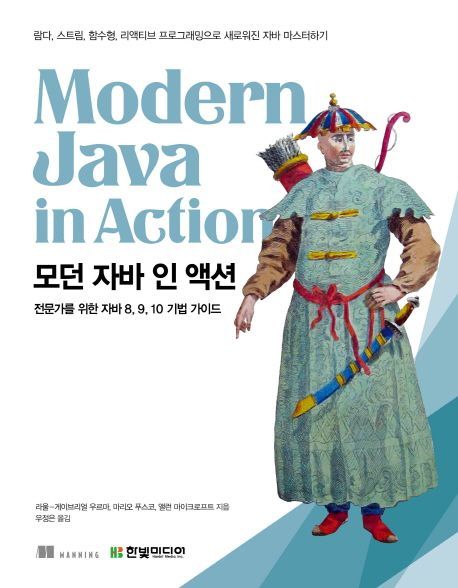

# Modern Java In Action

[Modern Java In Action](https://product.kyobobook.co.kr/detail/S000001810171) 책을 요약한 내용입니다.

<figure><figcaption></figcaption></figure>

**소개**

자바 8 설계의 밑바탕을 이루는 세 가지 프로그래밍 개념

- \1. `스트림 처리`
  - 한 번에 한 개씩 만들어지는 연속적인 데이터 항목들의 모임을 처리
  - 물리적인 순서가 있지만 각 단계에서 동시에 작업을 처리하는 자동차 조립 라인을 생각해보자.
- \2. `동작 파라미터화로 메서드에 코드 전달`
  - 코드 일부를 API 로 전달하는 기능
  - 메서드를 다른 메서드의 인수로 넘겨주는 기능
- \3. `병렬성과 공유 가변 데이터`
  - 기존의 자바 스레드 API보다 쉽게 병렬성을 활용