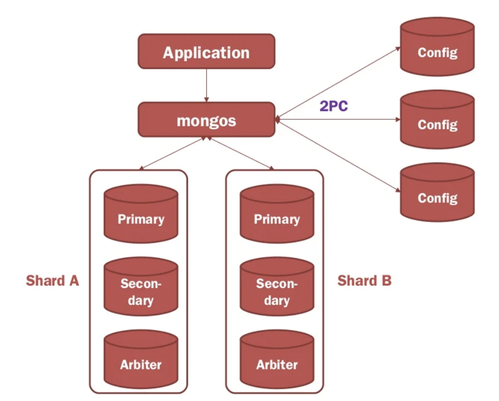

# PART I 몽고DB 시작

# 몽고DB 소개

ℹ️ **손쉬운 사용**

> 몽고DB는 `도큐먼트 지향` 데이터베이스

- 관계형 모델을 사용하지 않는 주된 이유는 `scale-out`을 쉽게 하기 위함
- 그밖에도, 행 개념 대신 보다 유연한 `도큐먼트 모델`을 사용
  - 내장 도큐먼트와 배열을 허용하여 복잡한 계층 관계를 하나의 레코드로 표현 가능
- 고정된 스키마가 없음
  - 필요할 때마다 쉽게 필드를 추가하거나 제거 가능

ℹ️ **확장 가능한 설계**

> 몽고DB는 `분산 확장`을 염두에 두고 설계

- 도큐먼트 지향 데이터 모델은 데이터를 여러 서버에 더 쉽게 분산
- 도큐먼트를 `자동으로 재분배`하고 사용자 요청을 올바른 장비에 `라우팅`하`여 클러스터 내 데이터 **양과 부하 조절**

<figure><figcaption></figcaption></figure>

출처: https://velog.io/@ha0kim/MongoDB-in-Action-12

ℹ️ **다양한 기능**

> DBMS의 대부분의 기능과 더불어 아래와 같은 기능을 제공

- 인덱싱
- 집계
- 특수한 컬렉션 유형
- 파일 스토리지

ℹ️ **고성능**

> 몽고DB는 모든 측면에서 고성능을 유지하기 위해 설계

- 동시성과 처리량을 극대화하기 위해 `WiredTiger storage engine`에 `opportunistic locking`을 사용
- 캐시처럼 제한된 용량으로 램으로 쿼리에 알맞은 인덱스를 자동으로 선택

ℹ️ **몽고DB의 철학**

> 몽고DB 프로젝트의 주 관심사는 확장성이 높으며 유연하고 빠른
>
> 즉, 완전한 기능을 갖춘 데이터 스토리지를 만드는 일

# 몽고DB 기본

## 도큐먼트

> 몽고 DB의 핵심은 정렬된 키와 연결된 값의 집합으로 이뤄진 도큐먼트

- 도큐먼트의 키는 `문자열`
  - 몇 가지 예외(`\0`, `.`, `$`)를 제외하면 어떤 UTF-8 문자든 사용 가능
- `데이터형`과 `대소문자`를 구별
- `키 중복` 불가능

## 컬렉션

ℹ️ **동적 스키마**

> 컬렉션은 동적 스키마를 가지므로
>
> 하나의 컬렉션 내 도큐먼트들이 모두 다른 구조를 가질 수 있다.

ℹ️ **네이밍**

> 컬렉션은 이름으로 식별

- 아래를 제외한 어떤 UTF-8 문자열이든 사용 가능
  - `\0` (컬렉션명의 끝을 나타내는 문자)
  - `system.`으로 시작하는 컬렉션명 (예약어)
  - `$` (예약어)

ℹ️ **서브컬렉션**

> 서브컬렉션의 네임스페이스에 `.` 문자를 사용해 컬렉션을 쳬계화

- 단지 체계화를 위함이며 부모/자식 컬렉션과는 아무런 관계가 없음
- 특별한 속성은 없지만 여러 몽고DB 툴에서 지원
- 몽고DB 데이터를 체계화하는 훌륭한 방법

## 데이터베이스

> 몽고DB의 단일 인스턴스는 여러 데이터베이스를 호스팅할 수 있으며,
>
> 각 데이터베이스를 완전히 독립적으로 취급할 수 있다.

컬렉션과 마찬가지로 데이터베이스는 이름으로 식별된다. 

데이터베이스 이름에는 아래 제약 조건을 제외하고 어떤 UTF-8 문자열이든 사용 가능하다.
- 빈 문자열
- `/, \, ., ' ', *, <, >, :, |, ?, $, , \0` 문자열 포함 불가
- 이름은 대소문자 구별
- 이름은 최대 64바이트

## 몽고DB 시작

서버를 시작하려면 원하는 유닉스 명령행 환경에서 mongod 실행 파일을 실행
- mongod는 인수 없이 실행 시 기본 데이터 디렉터리로 `/data/db`를 사용

```bash
$ mongod
```

## 셸 소개

> 명령행에서 몽고DB 인스턴스와 상호작용하는 자바스크립트 셸을 제공

**셸 실행**
- 셸은 완전한 자바스크립트 해석기이며 임의의 자바스크립트 프로그램을 실행

```bash
$ mongo

# docker 사용 시
$ docker run --name mongo -d -p 27017:27017 mongo
$ docker exec -it mongo mongosh
```

표준 자바스크립트 라이브러리의 모든 기능을 활용 가능

```bash
test> Math.sin(Math.PI / 2)
1

test> new Date("20109/1/1");
ISODate('+020109-01-01T00:00:00.000Z')
```

셸은 시작할 때 몽고DB 서버의 test 데이터베이스에 연결하고, 데이터베이스 연결을 전역 변수 db에 할당
- 셸에서는 주로 이 변수를 통해 몽고DB에 접근

  ```bash
  # 현재 db에 할당된 데이터베이스 확인
  test> db
  test

  # db 변수에서 컬렉션에 접근
  test> test.movies
  ```

## 셸 기본 작업

> 셸에서 생성, 읽기, 갱신, 삭제의 네 가지 기본적인 작업(CRUD) 제공

### 생성

> `insertOne`

- 도큐먼트를 나타내는 자바스크립트 객체인 지역 변수를 생성

```sql
movie = {
    "title": "Star Wars: Episode IV - A New Hope",
    "director": "George Lucas",
    "year": 1977
}
db.movies.insertOne(movie)
```

### 읽기

> `find`, `findOne`

```sql
db.movies.findOne()
```

- `find`, `findOne`은 쿼리 도큐먼트 형태로 조건 전달도 가능
- 쿼리에서 일치하는 도큐먼트로 결과를 제한

### 갱신

> `updateOne`

```sql
db.movies.updateOne({"title": "Star Wars: Episode IV - A New Hope"},
    {$set : {reviews:[]}}
)
```

### 삭제

> `deleteOne`, `deleteMany`

도큐먼트를 데이터베이스에서 영구적으로 삭제
- 필터와 일치하는 모든 도큐먼트 삭제 시 deleteMany 사용

```sql
db.movies.deleteOne({"title": "Star Wars: Episode IV - A New Hope"})
```

## 데이터형

> 몽고DB는 JSON의 키/값 쌍 성질을 유지하면서 추가적인 데이터형을 지원

ℹ️ **기본 데이터형**

> 가장 일반적인 데이터형

- **null**
- **boolean**
- **숫자**
  - 셸은 64비트 부동소수점 수를 기본으로 사용
  - 4바이트 혹은 8바이트 부호 정수는 각각 NumberInt, NumberLong 클래스를 사용
- **문자열**
  - 어떤 UTF-8 문자열이든 문자열형으로 표현
- **날짜**
  - 1970년 1월 1일부터의 시간을 1/1000초 단위로 나타내는 64비트 정수로 날짜를 저장
  - 표준 시간대는 저장하지 않음
- **정규 표현식**
  - 쿼리는 자바스크립트의 정규 표현식 문법 사용 가능
- **배열**
  - 값의 set, list를 배열로 표현 가능
- **내장 도큐먼트**
  - 부모 도큐먼트의 값으로 내장된 도큐먼트 전체를 포함 가능
- **객체 ID**
  - 객체 ID는 도큐먼트용 12바이트 ID

ℹ️ **날짜**
- 새로운 Date 객체 생성 시 항상 `Date()`가 아닌 `new Date()`를 호출해야 한다.
- 함수로 생성자를 호출(Date())하면 실제 Date 객체가 아닌 날짜의 문자열 표현을 반환
- 셸에서는 날짜가 현지 시간대 설정을 이용해 표시
  - 하지만, DB의 날짜는 1970년 1월 1일부터의 시간을 1/1000초 단위로 저장하여 표준 시간대 정보는 없음

ℹ️ **배열**

> 정렬 연산(list, stack, queue)), 비정렬 연산(set)에 호환성 있게 사용 가능

```sql
{"things" : ["pie", 3.14]}
```

- 배열은 서로 다른 데이터형을 값으로 포함 가능
- 도큐먼트 내 배열의 장점으로 몽고DB가 배열 구조를 `이해`하고, 배열의 내용에 작업을 수행하기 위해 내부에 도달하는 `방법`을 안다는 점
  - 따라서 배열에 쿼리하거나 배열의 내용을 이용해 인덱스 생성 가능

ℹ️ **내장 도큐먼트**

> 내장 도큐먼트를 사용해 데이터를 키/값 쌍의 평면적인 구조보다 자연스러운 방법으로 구성

```JSON
{
    "name": "Jone Doe",
    "address": {
        "street": "123 PArk Street",
        "city": "Anytown",
        "state": "NY"
    }
}
```

- 배열과 마찬가지로 내장 도큐먼트의 `구조를 이해`하고, `인덱스`를 구성하고, `쿼리`하며, `갱신`하기 위해 내장 도큐먼트 내부에 접근
- 내장 도큐먼트를 적절히 사용하면 좀 더 자연스럽게 정보 표현 가능
- 단, 몽고DB에서는 더 많은 데이터 반복이 생길 수 있다는 단점이 존재

### _id & ObjectId

> 몽고DB에 저장된 모든 도큐먼트는 `_id` 키를 가진다.

"_id" 키 값은 어떤 데이터형이어도 상관없지만 "ObjectId"가 기본

**ObjectIds**

ObjectId는 "_id"의 `기본 데이터형`이다.
- ObjectId 클래스는 가볍고, 여러 장비에 걸쳐 전역적으로 고유하게 생성하기 쉽게 설계
- ObjectId를 사용하는 주요 이유는 몽고DB의 분산 특성 때문
- 몽고DB는 분산 DB로 설계되어 샤딩된 환경에서 고유 식별자를 생성하는 것이 중요

ObjectId `12바이트`는 아래와 같이 생성
- **첫 4바이트**는 1970년 1월 1일부터의 시간을 1/1000초 단위로 저장하는 `타임 스탬프`
- **다음 5바이트**는 `랜덤 값`
- **최종 3바이트**는 서로 다른 시스템에서 충돌하는 아이디를 생성하지 않도록 랜덤 값으로 시작하는 `카운터`

```text
(0 1  2 3) (4 5 6 7 8) (9 10 11)
타임스탬프    랜덤         카운터:랜덤 시작 값
```

- 앞 9바이트는 1초 동안 여러 장비와 프로세스에 걸쳐 유일성을 보장
- 마지막 3바이트는 단순히 증분하는 숫자로, 1초 내 단일 프로세스의 유일성을 보장
- 고유한 아이디는 프로세스당 1초에 256^3(1677만 7216)개까지 생성

**_id 자동 생성**
- 도큐먼트를 입력할 때 "_id" 키를 명시하지 않으면 입력된 도큐먼트에 키가 자동으로 추가

## 몽고DB 셸 사용

다른 장비나 포트에 mongod를 연결하려면 셸을 시작할 때 호스트명, 포트, DB를 명시해야 한다.

```bash
$ mongo some-host:30000/myDB
```

**셸 활용 팁**
- `help`: 셸에 내장된 도움말 확인
- `db.help`: 데이터베이스 수준의 도움말
- `db.foo.help()`: 컬렉션 수준의 도움말
- 함수의 기능을 알고 싶으면 함수명을 괄호 없이 입력

# 도규먼트 생성/갱신/삭제

## 삽입

> 도큐먼트를 삽입하려면 컬렉션의 `insertOne` 메서드 사용

```sql
db.movies.insertOne({"title": "Stand by Me",})
```

> 여러 도큐먼트를 컬렉션에 삽입하려면 `insertMany`로 도큐먼트 배열을 데이터베이스에 전달
>
> 도큐먼트를 대량 삽입하므로 효율적

```sql
db.movies.insertMany([{"title": "Ghostbusters"},
    {"title": "E.T."},
    {"title": "Blade Runner"}]);
```

`insertMany` 사용으로 대량 삽입 시 배열 중간에 있는 도규먼트에서 특정 유형의 오류가 발생할 경우, 정렬 연산을 선택했는지, 비정렬 연산을 선택했는지에 따라 발생하는 상황이 달라진다.
- 정렬된 삽입(기본값)
  - 옵션 도큐먼트 "ordered" 키에 true 지정
  - 삽입에 전달된 배열이 삽입 순서를 정의
  - 도큐먼트가 삽입 오류를 생성하면, 배열에서 이후 도큐먼트는 삽입되지 않는다.

- 정렬되지 않은 삽입
  - 옵션 도큐먼트 "ordered" 키에 false 지정
  - 몽고DB는 성능을 개선하려고 삽입을 재배열
  - 몽고DB는 일부 삽입의 오류 발생 여부에 관계없이 모든 도큐먼트 삽입을 시도

```sql
db.movies.insertMany([
    {"_id": 3, "title": "Sixteen Candles"},
    {"_id": 4, "title": "The Terminator"},
    {"_id": 4, "title": "The Princess Bride"},
    {"_id": 5, "title": "Scarface"},
])
```



**대량쓰기 API**

몽고DB는 한 번의 호출로 여러 유형의 작업을 일괄 처리하는 대량 쓰기 API를 지원

[대량쓰기 API](https://www.mongodb.com/ko-kr/docs/languages/java/reactive-streams-driver/current/write/bulk-writes/) 참고



.

✅ **삽입 유효성 검사**

- 몽고DB는 삽입된 데이터에 최소한의 검사를 수행
  - "_id" 필드가 존재하지 않으면 새로 추가하고, 모든 도큐먼트는 `16MB`보다 작어야 하므로 크기를 검사
- 대개 나쁜 스키마 설계를 예방하고 일관된 성능을 보장
  - doc라는 도큐먼트의 BSJON 크기를 보려면 쉘에서 `object.bsonsize(doc)`를 실행

## 삭제

> 데이터 삭제는 `deleteOne`, `deleteMany` 메서드 사용으로

```sql
db.movies.deleteOne({"_id": 4})
db.movies.deleteMany({"year": 1984})
```

- 👉🏻 `deleteOne`은 필터와 일치하는 `첫 번째 도큐먼트`를 삭제
  - 첫 번쨰의 기준은 삽입 순서, 갱신 상태, 인덱스 등 몇 가지 요인에 따라 달라진다.
- 👉🏻 `deleteMany`는 필터와 일치하는 모든 도큐먼트를 삭제

.

✅ **drop**

`deleteMany`를 사용해 모든 도큐먼트 제거

```sql
db.movies.deleteMany({})
```

전체 컬렉션 삭제 시 `drop`을 사용하는 편이 빠르다.
- 그리고 빈 컬렉션에 인덱스를 재생성

```sql
db.movies.drop()
```

## 갱신

> `updateOne`, `updateMany`, `replaceOne` 갱신 메서드

`updateOne`, `updateMany`는 필터 도큐먼트를 첫 번째 매개변수로, 변경 사항을 설명하는 수정자 도큐먼트를 두 번째 매개변수로 사용

`replaceOne`도 첫 번째 매개변수로 필터를 사용하지만, 두 번째 매개변수는 필터와 일치하는 도큐먼트를 교체할 도큐먼트

.

✅ **도큐먼트 치환**

> `replaceOne`은 도큐먼트를 새로운 것으로 치환

⭐️ 대대적인 스키마 마이그레이션에 유용

```sql
db.users.insertOne({
    "name": "joe",
    "friends": 32,
    "enemies": 2
})

// friend, enemies 필드를 relationships 라는 서브도큐먼트로 이동
var joe = db.users.findOne({"_id": ObjectId("672c2c8f07b2c3060aa45bc2")})
joe.relationships = {"friends": joe.friends, "enemies": joe.enemies};
joe.username = joe.name;
delete joe.friends;
delete joe.enemies;
delete joe.name;
db.users.replaceOne({"name": "joe"}, joe)
```