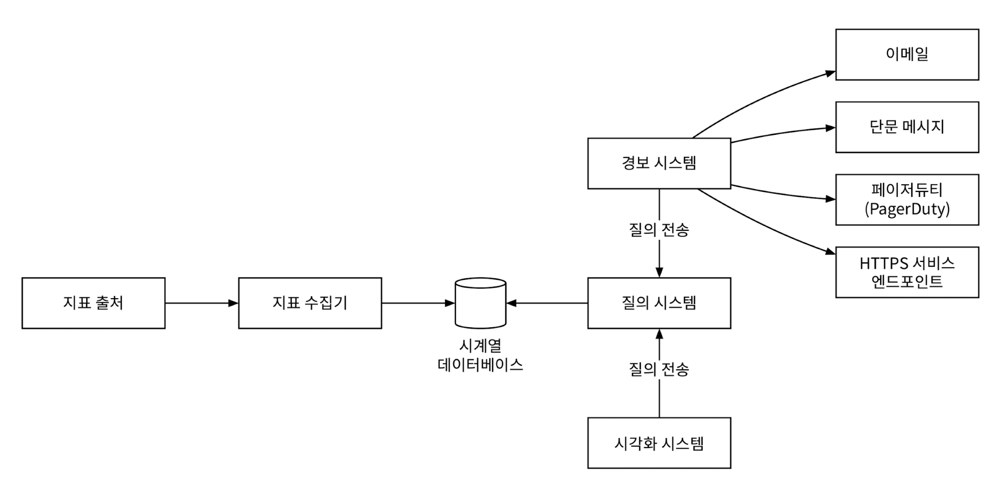

지표 모니터링 및 경보 시스템은 인프라의 상태를 선명하게 볼 수 있도록 하여 높은 가용성과 안정성을 달성하는 데 중추적 역할

# 1단계: 문제 이해 및 설계 범위 확정

✅ **개략적 요구사항 및 가정**

대규모 인프라를 모니터링
- 일간 능동 사용자 수 1억명
- 서버 풀 1,000개, 풀당 서버 수 100개, 서버당 100개의 운영 지표를 수집한다고 치면 모니터링해야 하는 지표의 수는 천만개 수준
- 데이터 보관 기간은 1년
- 수집한 그대로 데이터를 보관하는 기간은 일주일, 그 뒤에는 1분 단위 데이터로 변환한 후 30일간 보관. 그 뒤에는 1시간 단위 데이터로 변환한 뒤 1년간 보관

모니터링할 지표
- CPU 사용률
- 요청 수
- 메모리 사용량
- 메시지 큐 내의 메시지 수

✅ **비기능 요구사항**

- 규모 확장성: 시스템은 늘어나는 지표 수와 경보의 양에 맞게 확장될 수 있어야 함.
- 낮은 응답 지연: 대시보드와 경보를 신속하게 처리할 수 있도록 질의에 대한 낮은 응답 지연을 보장
- 안정성: 높은 안정성을 제공하여 중요 경보를 놓치지 않도록
- 유연성: 기술은 계속 변화하므로, 미래의 신기술을 쉽게 통합할 수 있도록 유연하게 변경 가능한 파이프라인을 이용해 구축한 시스템

고려하지 않아도 되는 요구사항
- 로그 모니터링
- 분산 시스템 추적

# 2단계: 개략적 설계안 제시 및 동의 구하기

## 기본적 사항

사용되는 컴포넌트
- 데이터 수집: 여러 출처로부터 지표 데이터를 수집
- 데이터 전송: 지표 데이터를 지표 모니터링 시스템으로 전송
- 데이터 저장소: 전송되어 오는 데이터를 정리하고 저장
- 경보: 밀려오는 데이터를 분석하고, 이상 징후를 감지하고, 경보를 발생
  - 이 시스템은 다양한 통신 채널로 경보를 발송
- 시각화: 데이터를 차트나 그래프 등으로 제공
  - 패턴, 추이, 문제점을 더 쉽게 파악하기 위한 도구

## 데이터 저장소 시스템

범용 데이터베이스는 이론적으로 시계열 데이터를 처리할 수 있지만, 이 설계안이 감당하려는 부하 규모에 맞추려면 전문가 수준의 튜닝이 필요
- Casandra, Bigtable 같은 시계열 데이터를 효율적으로 처리할 수 있다고 알려진 NoSQL DB들이 있지만,
- 시계열 데이터를 효과적으로 저장하고 질의하기 위해서는 확장이 용이한 스키마 설계가 필요한데, 내부 구조에 대한 해박한 지식이 필요

시계열 데이터에 최적화된 저장소 시스템은 시장이 만다.
- `OpenTSDB`:
  - 분산 시계열 데이터베이스
  - Hadoop, HBase에 기반하여 Hadoop/HBase 클러스터를 구성하고 운영해야 하므로 복잡
- `MetricsDB`:
  - X가 사용하는 시계열 데이터베이스
- `Timestream`:
  - 아마존이 출시한 제품

[DB-engines 조사 결과](https://db-engines.com/en/ranking/time+series+dbms) `InfluxDB`, `Prometheus`가 높은 인기
- 다량의 시계열 데이터를 저장하고 빠른 실시간 분석을 지원
- 메모리 캐시와 디스크 저장소를 함께 사용
- 영속성 요건과 높은 성능 요구사항도 만족

## 개략적 설계안

<figure><figcaption></figcaption></figure>

- **지표 출처**: 지표 데이터가 만들어지는 곳으로, 애플리케이션 서버, SQL 데이터베이스, 메시지 큐 등
- **지표 수집기**: 지표 데이터를 수집하고, 시계열 데이터에 기록
- **시계열 데이터베이스**: 지표 데이터를 시계열 데이터 형태로 보관하는 저장소
  - 다량의 시계열 데이터를 분석하고 요약하는 데 적합하도록 설계된 질의 인터페이스 제공
- **질의 서비스**: 시계열 데이터베이스에 보관된 데이터를 질의하고 가져오는 과정을 지원
- **경보 시스템**: 경보를 받아야 하는 다양한 대상으로 경보 알림을 전송하는 역할
- **시각화 시스템**: 지표를 다양한 형태의 그래프/차트로 시각화 하는 기능을 제공