지표 모니터링 및 경보 시스템은 인프라의 상태를 선명하게 볼 수 있도록 하여 높은 가용성과 안정성을 달성하는 데 중추적 역할

# 1단계: 문제 이해 및 설계 범위 확정

✅ **개략적 요구사항 및 가정**

대규모 인프라를 모니터링
- 일간 능동 사용자 수 1억명
- 서버 풀 1,000개, 풀당 서버 수 100개, 서버당 100개의 운영 지표를 수집한다고 치면 모니터링해야 하는 지표의 수는 천만개 수준
- 데이터 보관 기간은 1년
- 수집한 그대로 데이터를 보관하는 기간은 일주일, 그 뒤에는 1분 단위 데이터로 변환한 후 30일간 보관. 그 뒤에는 1시간 단위 데이터로 변환한 뒤 1년간 보관

모니터링할 지표
- CPU 사용률
- 요청 수
- 메모리 사용량
- 메시지 큐 내의 메시지 수

✅ **비기능 요구사항**

- 규모 확장성: 시스템은 늘어나는 지표 수와 경보의 양에 맞게 확장될 수 있어야 함.
- 낮은 응답 지연: 대시보드와 경보를 신속하게 처리할 수 있도록 질의에 대한 낮은 응답 지연을 보장
- 안정성: 높은 안정성을 제공하여 중요 경보를 놓치지 않도록
- 유연성: 기술은 계속 변화하므로, 미래의 신기술을 쉽게 통합할 수 있도록 유연하게 변경 가능한 파이프라인을 이용해 구축한 시스템

고려하지 않아도 되는 요구사항
- 로그 모니터링
- 분산 시스템 추적

# 2단계: 개략적 설계안 제시 및 동의 구하기

## 기본적 사항

사용되는 컴포넌트
- 데이터 수집: 여러 출처로부터 지표 데이터를 수집
- 데이터 전송: 지표 데이터를 지표 모니터링 시스템으로 전송
- 데이터 저장소: 전송되어 오는 데이터를 정리하고 저장
- 경보: 밀려오는 데이터를 분석하고, 이상 징후를 감지하고, 경보를 발생
  - 이 시스템은 다양한 통신 채널로 경보를 발송
- 시각화: 데이터를 차트나 그래프 등으로 제공
  - 패턴, 추이, 문제점을 더 쉽게 파악하기 위한 도구

## 데이터 저장소 시스템

범용 데이터베이스는 이론적으로 시계열 데이터를 처리할 수 있지만, 이 설계안이 감당하려는 부하 규모에 맞추려면 전문가 수준의 튜닝이 필요
- Casandra, Bigtable 같은 시계열 데이터를 효율적으로 처리할 수 있다고 알려진 NoSQL DB들이 있지만,
- 시계열 데이터를 효과적으로 저장하고 질의하기 위해서는 확장이 용이한 스키마 설계가 필요한데, 내부 구조에 대한 해박한 지식이 필요

시계열 데이터에 최적화된 저장소 시스템은 시장이 만다.
- `OpenTSDB`:
  - 분산 시계열 데이터베이스
  - Hadoop, HBase에 기반하여 Hadoop/HBase 클러스터를 구성하고 운영해야 하므로 복잡
- `MetricsDB`:
  - X가 사용하는 시계열 데이터베이스
- `Timestream`:
  - 아마존이 출시한 제품

[DB-engines 조사 결과](https://db-engines.com/en/ranking/time+series+dbms) `InfluxDB`, `Prometheus`가 높은 인기
- 다량의 시계열 데이터를 저장하고 빠른 실시간 분석을 지원
- 메모리 캐시와 디스크 저장소를 함께 사용
- 영속성 요건과 높은 성능 요구사항도 만족

## 개략적 설계안

<figure><figcaption></figcaption></figure>

- **지표 출처**: 지표 데이터가 만들어지는 곳으로, 애플리케이션 서버, SQL 데이터베이스, 메시지 큐 등
- **지표 수집기**: 지표 데이터를 수집하고, 시계열 데이터에 기록
- **시계열 데이터베이스**: 지표 데이터를 시계열 데이터 형태로 보관하는 저장소
  - 다량의 시계열 데이터를 분석하고 요약하는 데 적합하도록 설계된 질의 인터페이스 제공
- **질의 서비스**: 시계열 데이터베이스에 보관된 데이터를 질의하고 가져오는 과정을 지원
- **경보 시스템**: 경보를 받아야 하는 다양한 대상으로 경보 알림을 전송하는 역할
- **시각화 시스템**: 지표를 다양한 형태의 그래프/차트로 시각화 하는 기능을 제공

# 3단계: 상세 설계

## 지표 수집

<figure>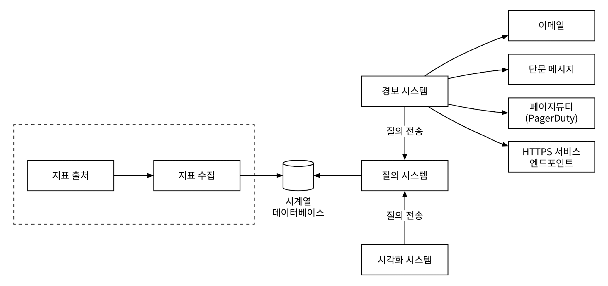<figcaption></figcaption></figure>

### 풀 vs 푸시 모델

지표 데이터 수집 방법에는 두 가지 모델이 있다.

✅ **풀 모델**

HTTP 기반 풀 모델을 이용하는 지표 수집의 흐름
- 실행중인 애플리케이션에서 주기적으로 지표 데이터를 가져오는 `지표 수집기`가 흐름의 중심

<figure>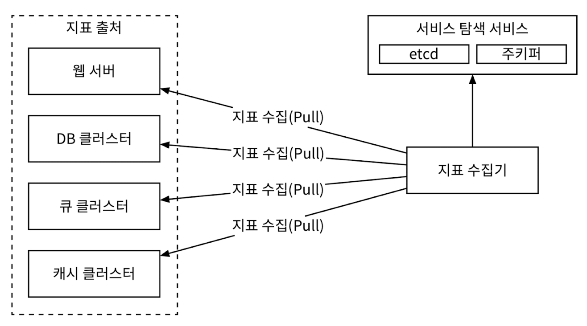<figcaption></figcaption></figure>

**지표 수집기**는 데이터를 가져올 서비스 목록을 알아야 하는데, '지표 수집기' 서버 안에 모든 서비스의 엔드포인트의 DNS/IP 정보를 담은 파일을 두면 가장 간단
- 서버가 수시로 추가/삭제되는 대규모 운영 환경에서는 적응하기 어려움
- [etcd](https://etcd.io/), [Apache Zookeeper](https://zookeeper.apache.org/) 같은 서비스 탐색 기술 활용 시 해결 가능
- 각 서비스는 자신의 가용성 고나련 정보를 서비스 탐색 서비스(SDS, Service Descovery Service)에 기록하고, SDS는 서비스 엔드포인트 목록에 변화가 생길 떄마다 지표 수집기에 통보
  - SDS에는 언제 어디서 지표를 수집하면 될지에 관한 설정 정보를 기록
  - 지표 수집 주기, IP 주소, 타임아웃, 재시도 인자 등

수천 대 서버가 만들어 내는 지표 데이터를 수집하려면 지표 수집기 서버 한대로는 부족하고, 서버 풀을 만들어야 대량의 데이터 규모를 감당할 수 있다.
- 지표 수집기 서버를 여러 대 둘 때 흔히 빚어지는 문제는 데이터 중복 가능성인데, 서버 간에 모종의 중재 메커니즘이 필요
- 안정 해시 링(consistent hash ring)을 사용하여 구현 가능
- 즉, 해시 링 구간마다 해당 구간에 속한 서버로부터 생산되는 지표의 수집을 담당하는 수집기 서버를 지정

<figure>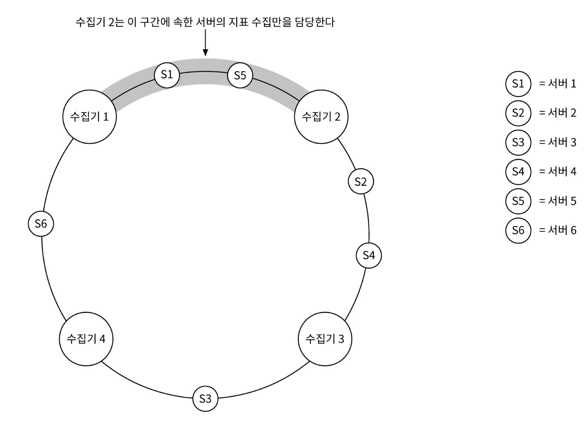<figcaption></figcaption></figure>

.

✅ **푸시 모델**

지표 출처에 해당하는 서버, 즉 웹 서버나 데이터베이스 서버 같은 서버가 직접 지표를 수집기에 전송하는 모델
- 모니터링 대상 서버에 통상 수집 에이전트를 설치하고, 해당 장비에서 실행되는 서비스가 생산하는 지표 데이터를 받아 모은 후, 주기적으로 수집기에 전달

<figure>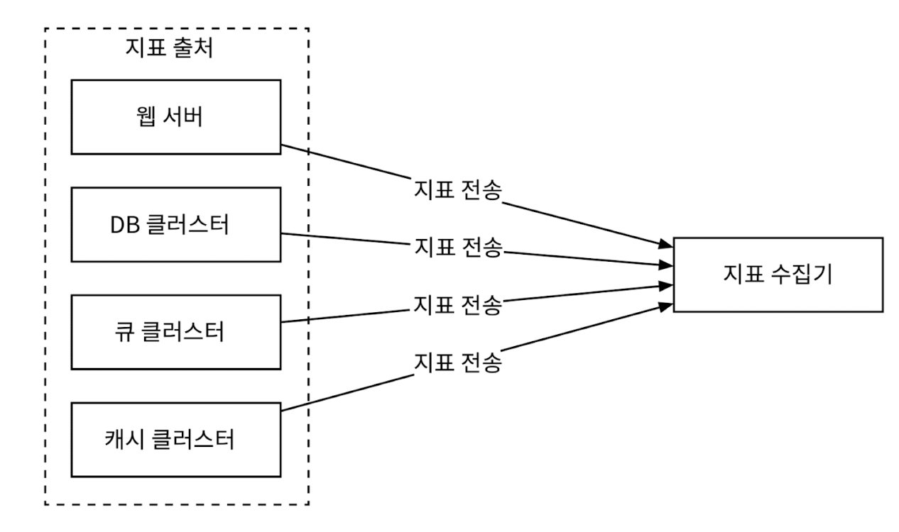<figcaption></figcaption></figure>

데이터 집계는 수집기에 보내는 데이터 양을 줄이는 효과적인 방법
- 데이터 전송 트래픽의 양이 막대하여 수집기가 일시적으로 전송 데이터를 처리하지 못하게 되어 오류를 반환하면, 에이전트는 내부의 소규모 버퍼에 데이터를 일시적으로 보관한 후 나중에 재전송 가능

밀려드는 데이터를 제때 처리할 수 있도록 지표 수집기 클러스터 자체도 자동 규모 확장이 가능하도록 구성하고, 그 앞에 로드밸런서를 두는 것이 바람직

<figure>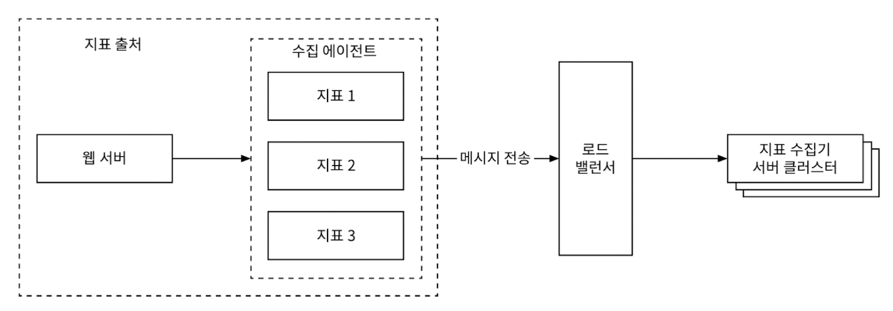<figcaption></figcaption></figure>

.

✅ **풀 모델 vs 푸시 모델**

<figure>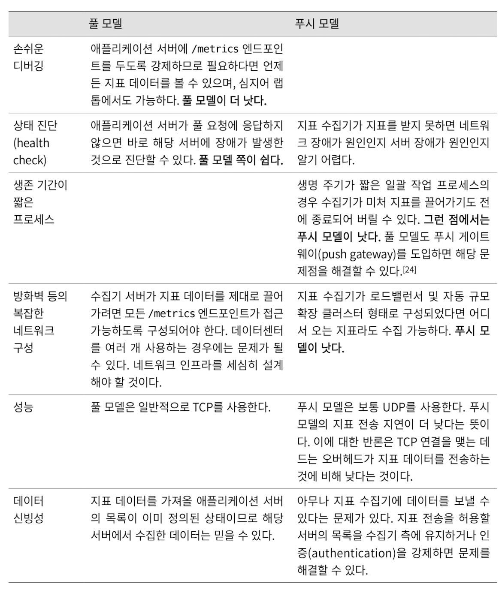<figcaption></figcaption></figure>

- 풀 모델을 채택한 유명한 사례로는 프로메테우스
- 푸시 모델을 채택한 유명 사례로는 아마존 클라우드와치(CloudWatch), 그래파이트(Graphite) 등

### 지표 전송 파이프라인의 규모 확장

<figure>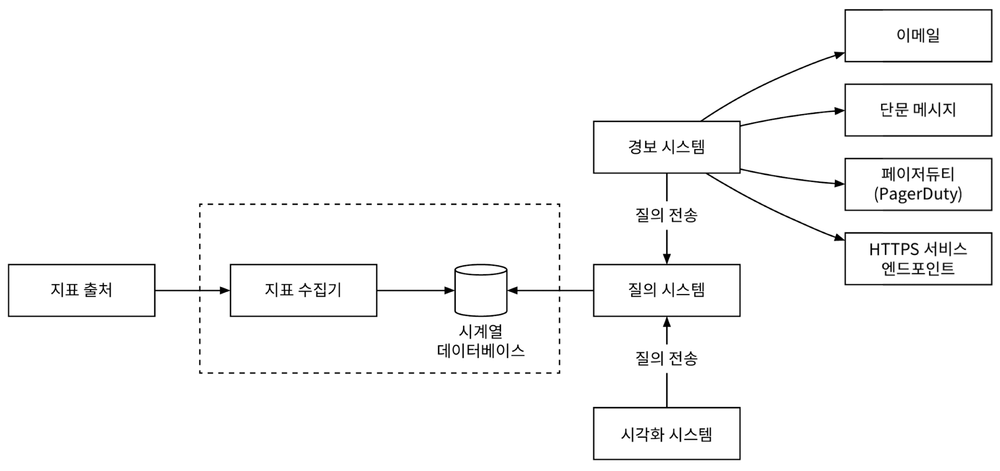<figcaption></figcaption></figure>

지표 수집기는 서버 클러스터 형태이며 엄청난 양의 데이터를 받아 처리해야 한다.
- 또한, 자동으로 규모 확장이 가능하도록 설정하여 언제나 데이터 처리에 충분한 수집기 서버가 존재하도록 해야 한다.

<figure>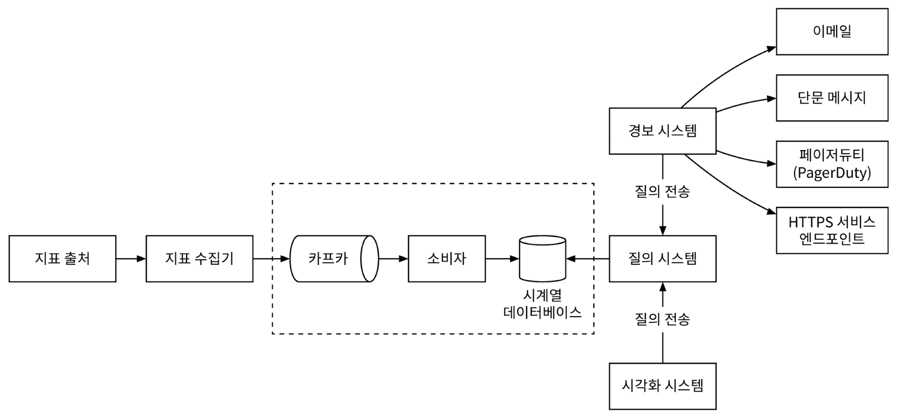<figcaption></figcaption></figure>

시계열 데이터베이스 장애로 인한 데이터 손실을 막기 위해 큐를 둘 수 있다.
- 지표 데이터를 큐 시스템에 전송하면 Apach Storm, Flink, Spark 같은 소비자, 즉 스트림 처리 서비스가 해당 데이터를 받아 시계열 데이터베이스에 저장한다.
- 이 방식의 장점.
  - 카프카는 고도로 안정적이고 규모 확장성이 뛰어난 분산 메시지 플랫폼
  - 데이터 수집 컴포넌트와 처리 컴포넌트 사이의 결합도 감소
  - 장애가 생겨도 카프카에 데이터를 보관하면 되므로, 데이터 소실을 막을 수 있음

.

✅ **카프카를 통한 규모 확장**

카프카 내장 파티션 메커니즘으로 시스템 규모를 다양한 방법으로 확장 가능
- 대역폭 요구사항에 따라 파티션 수 설정
- 지표 이름에 따라 어떤 지표를 어느 파티션에 배치할지 결정하면, 소비자는 지표 이름에 따라 데이터를 집계
- 태그/레이블에 따라 지표 데이터를 더욱 세분화한 파티션으로 나눈다.
- 중요 지표가 먼저 처리될 수 있도록 지표를 분류하고 우선순위 지정

.

✅ **카프카의 대안**
- 상용 규모의 카프카 시스템 구축은 쉽지 않다.
- 페이스북의 메모리 기반 시계열 데이터베이스 시스템인 `Gorilla`는 일부에 네트워크 장애가 발생해도 높은 수준의 쓰기 연산 가용성을 유지

### 데이터 집계 지점

지표 집계는 다양한 지점에서 실행이 가능하다.

**수집 에이전트가 집계하는 방안:**
- 클라이언트에 설치된 수집 에이전트는 복잡한 집계 로직은 지원하기 어려움
- 어떤 카운터 값을 분 단위로 집계하여 지표 수집기에 보내는 정도는 가능

**데이터 수집 파이프라인에서 집계하는 방안:**
- 데이터를 저장소에 기록하기 전에 집계할 수 있으려면, 보통 플링크 같은 스트림 프로세싱 엔진이 필요
- 늦게 도착하는 지표 데이터의 처리가 어렵고, 원본 데이터를 보관하지 않으므로 정밀도나 유연성 측면에서 손해

**질의 시 집계하는 방안:**
- 데이터를 날것 그대로 보관한 다음 질의할 때 필요한 구간에 맞게 집계
- 데이터 손실 문제는 없으나 질의를 처리하는 순간에 전체 데이터셋을 대상으로 집계 결과를 계산해야 하므로 속도는 느림

### 질의 서비스

질의 서버 클러스터 형태로 구현되며, 시각화 또는 경보 시스템에서 접수된 요청을 시계열 데이터베이스를 통해 처리하는 역할을 담당
- 질의 처리 전담 서비스를 통해 클라이언트(시각화 or 경보 시스템)와 시계열 데이터베이스 사이의 결합도를 낮출 수 있음

✅ **캐시 계층**
- 질의 결과를 저장할 캐시 서버를 도입하면 시계열 데이터베이스에 대한 질의 부하를 낮추고 질의 서비스 성능을 높일 수 있다.

✅ **시계열 데이터베이스 질의어**
- 프로메테우스나 InfluxDB 같은 널리 사용되는 지표 모니터링 시스템들은 SQL이 아닌 독자 질의어를 제공 (시계열 데이터는 SQL 질의가 까다롭기 때문)
- 시계열 데이터베이스 분석에 최적화된 `Flux`(InfluxDB의 질의어)라는 언어로 작성하면 간단하게 질의가 가능

```sql
from(db:"telegraf")
    |> rang(start:-1h)
    |> filter(fn: (r) => r._measurement == "foo")
    |> exponentialMovingAverage(size:-10s)
```

### 저장소 계층

✅ **시계열 데이터베이스는 신중하게 선택하자**
- 페이스북의 연구 논문에 따르면 운영 데이터 저장소에 대한 질의의 85%는 지난 26시간 내에 수집된 데이터를 대상
- 이 사실을 잘 활용하는 시계열 데이터베이스를 고르면 성능 측면에서 큰 이득


✅ **저장 용량 최적화**

1️⃣ **데이터 인코인 및 압축**
- 데이터 인코딩 및 압축으로 크기를 상당히 줄일 수 있다. (좋은 시계열 디비는 대부분 내장)
- 데이터를 완전한 형태로 저장하는 대신 기준 값과의 차이를 저장하는 방식

  <figure><figcaption></figcaption></figure>

2️⃣ **다운샘플링**
- 데이터의 해상도를 낮춰 저장소 요구량을 줄이는 기법
- 지표 보관 기간별 규칙 예시
  - 7일 이내 데이터: 샘플링 미적용
  - 30일 이내 데이터: 1분 해상도로 낮춰 보관
  - 1년 이내 데이터: 1시간 해상도로 낮춰 보관
- 10초 해상도 데이터를 30초 해상도 데이터로 집계하는 사례
  - 10초 해상도 데이터
    <figure>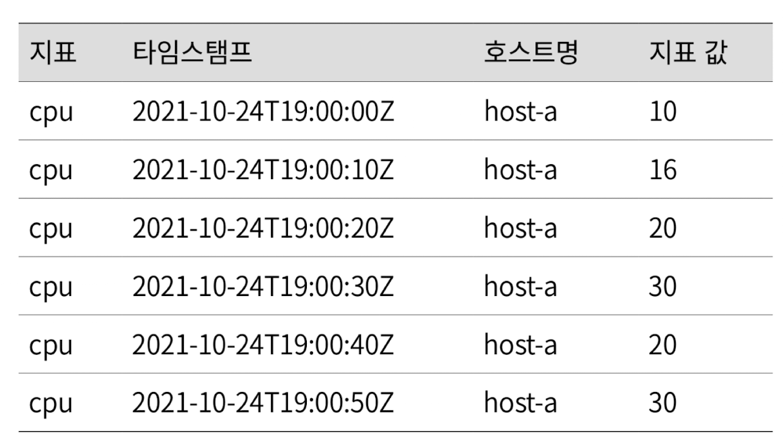<figcaption></figcaption></figure>
  - 30초 해상도 데이터
    <figure>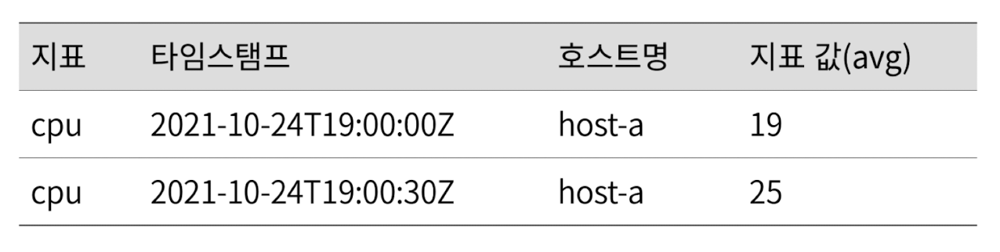<figcaption></figcaption></figure>

3️⃣ **냉동 저장소**
- 잘 사용되지 않는 비활성 상태 데이터를 보관하는 곳
- 일반 저장소에 비해 저렴한 비용
- 대체적으로 시각화와 경보 시스템은 직접 만들기보다 상용품 사용을 권장

### 경보 시스템

<figure>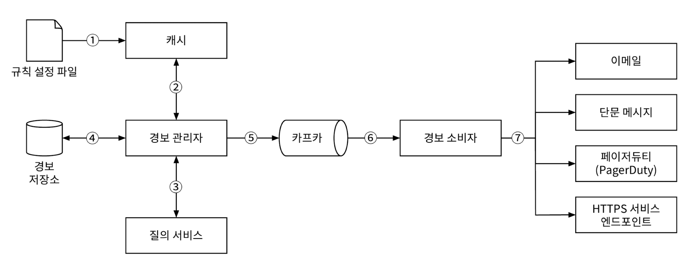<figcaption></figcaption></figure>

**경보 처리 흐름**

(1)


## 지표 전송 파이프라인 규모 확장

## 질의 서비스

## 저장소 계층

## 경보 시스템

## 시각화 시스템

