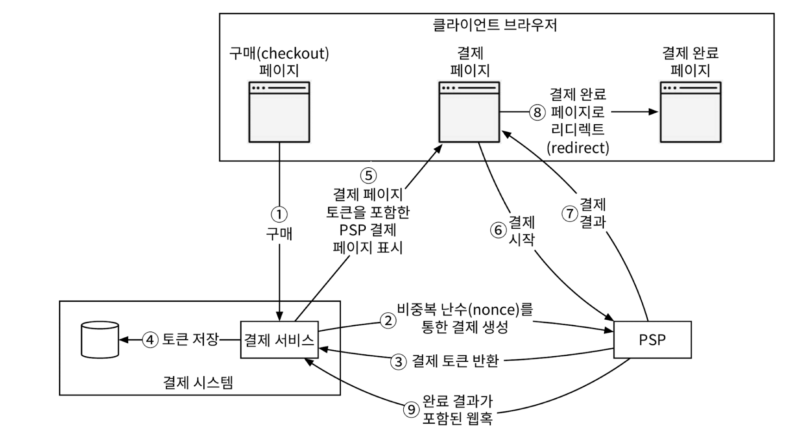
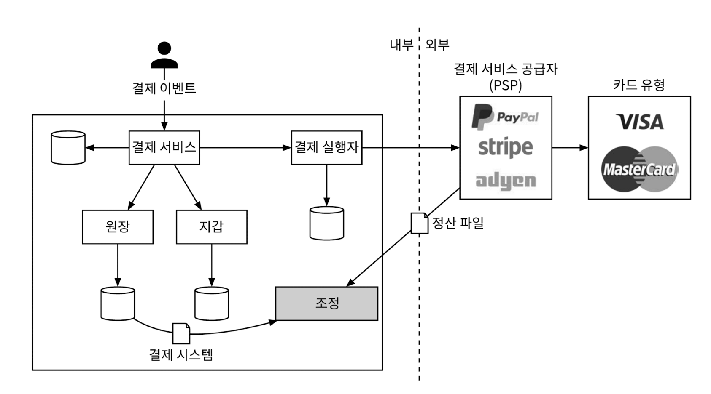
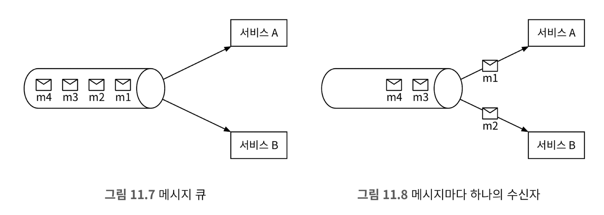
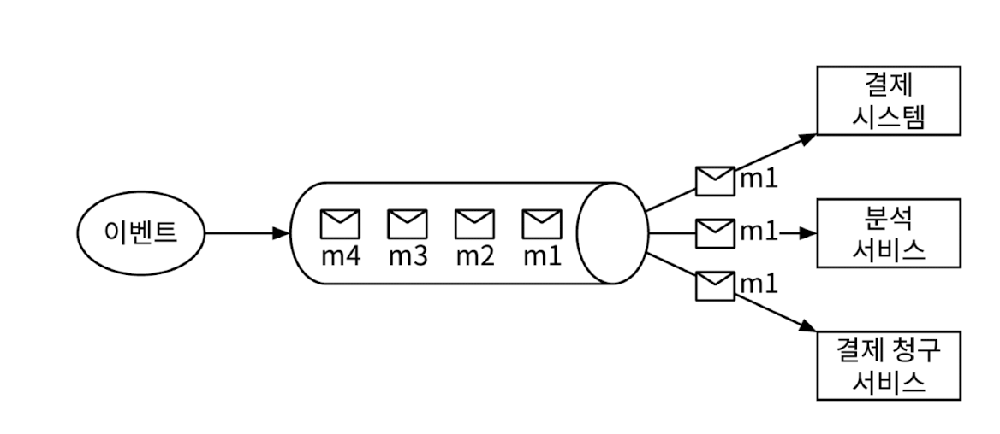

"결제 시스템"은 금전적 가치의 이전을 통해 금융 거래를 정산하는 데 사용되는 모든 시스템

여기에는 가치 교환을 가능하게 하는 제도, 도구, 사람, 규칙 절차, 표준 및 기술이 포함

# 1단계: 문제 이해 및 설계 범위 확정

## 기능 요구사항

대금 수신(pay-in) 흐름:
- 결제 시스템이 판매자를 대신하여 고객으로부터 대금을 수령
  
대금 정산(pay-out) 흐름:
- 결제 시스템이 전 세계의 판매자에게 제품 판매 대금을 송금

## 비기능 요구사항

신뢰성 및 내결함성:
- 결제 실패는 신중하게 처리해야 한다.

내부 서비스(결제/회계 시스템)와 외부 서비스(결제 서비스 제공업체) 간의 조정 프로세스:
- 시스템 간의 결제 정보가 일치하는지 비동기적으로 확인

## 개략적인 규모 추정

하루에 100만 건의 트랜잭션을 처리해야 하는데, 
- 이는 1,000,000 건의 트랜잭션 / 10^5초 = 초당 10건의 트랜잭션(TPS)
- 10TPS는 일반적인 데이터베이스로 별 문제 없이 처리 가능한 양이므로, 처리 대역폭 대신 결제 트랜잭션의 정확한 처리에 초점

# 2단계: 개략적 설계안 제시 및 동의 구하기

결제 흐름은 자금의 흐름을 반영하기 위해 크게 두 단계로 세분화
- **대금 수신 흐름**: 구매자가 주문을 하면 아마존의 은행 계좌로 돈이 들어오는 것
- **대금 정산 흐름**: 제품이 배송되면, 계좌에 묶여 있던 판매 대금에서 수수료를 제외한 잔액이 판매자의 은행 계좌로 지급

<figure><figcaption></figcaption></figure>

## 대금 수신 흐름

### 결제 서비스

결제 이벤트를 수락하고 결제 프로세스를 조율
- `AML/CFT`와 같은 규정을 준수하는지, 자금 세탁이나 테러 자금 조달과 같은 범죄 행위의 증거가 있는지 평가하는 위험 점검을 일반적으로 먼저 수행
  - 자금세탁방지(AML·Anti-Money Laundering)
  - 테러자금조달방지(CFT·Combating the Financing of Terrorism)
- 위험 확인 서비스는 복잡하고 전문화되어 있으므로 제3자 제공업체를 주로 이용

<figure><figcaption></figcaption></figure>

### 결제 실행자

결제 서비스 공급자(PSP)를 통해 결제 주문 하나를 실행.
- 하나의 결제 이벤트에는 여러 결제 주문이 포함될 수 있음.

### 결제 서비스 공급자

결제 서비스 공급자, PSP(Payment Service Provider)는 A 계정에서 B 계정으로 돈을 옮기는 역할을 담당

### 카드 유형

카드사는 신용 카드 업무를 처리하는 조직

### 원장

원장(ledger)은 결제 트랜잭션에 대한 금융 기록
- 원장 시스템은 전자상거래 웹사이트의 총 수익을 계산하거나 향후 수익을 예측하는 등, 결제 후 분석에서 매우 중요한 역할

### 지갑

지갑(wallet)에는 판마재(merchant)의 계정 잔액을 기록

일반적인 결제 흐름

1. 사용자가 '주문하기' 버튼을 클릭하면 결제 이벤트가 생성되어 결제 서비스로 전송
2. 결제 서비스는 결제 이벤트를 데이터베이스에 저장
3. 때로 단일 결제 이벤트에 여러 결제 주문이 포함될 수 있음
   - 한 번 결제로 여러 판매자의 제품을 처리하는 경우
   - 한 결제를 여러 결제 주문으로 분할하는 경우, 결제 서비스는 결제 주문마다 결제 실행자를 호출
4. 결제 실행자는 결제 주문을 데이터베이스에 저장
5. 결제 실행자가 외부 PSP를 호출하여 신용 카드 결제를 처리
6. 결제 실행자가 결제를 성공적으로 처리하고 나면 결제 서비스는 지갑을 갱신하여 특정 판매자의 잔고를 기록
7. 지갑 서버는 갱신된 잔고 정보를 데이터베이스에 저장
8. 지갑 서비스가 판매자 잔고를 성공적으로 갱신하면 결제 서비스는 원장을 호출
9. 원장 서비스는 새 원장 정보를 데이터베이스에 추가

## 결제 서비스 API

✉️ POST `/v1/payments`

- 결제 이벤트를 실행하는 엔드포인트
- 하나의 결제 이벤트에는 여러 결제 주문이 포함될 수 있음.
- 요청 매개변수

    |필드|설명|자료형|
    |---|---|---|
    |buyer_info|구매자 정보|json|
    |checkout_id|해당 결제 이벤트를 식별하는 전역적으로 고유한 ID|string|
    |credit_card_info|암호화된 신용 카드 정보 또는 결제 토큰. PSP마다 다른 값|json|
    |payment_orders|결제 주문 목록|list|

- payment_orders 형태
  
    |필드|설명|자료형|
    |---|---|---|
    |seller_account|대금을 수령할 판매자|string|
    |amount|해당 주문으로 전송되어야 할 대금|string|
    |currency|주문에 사용된 통화 단위|string|
    |payment_order_id|해당 주문을 식별하는 전역적으로 고유한 ID|string|

- amount는 데이터 유형이 string 인데 의도치 않은 반올림 오류를 방지하기 위해 전송 및 저장 시 숫자는 문자열로 보관하는 것이 좋다. 표시하거나 계산에 쓸 때만 숫자로 변환하자.

✉️ POST `/v1/payments/{:id}`

- payment_order_id가 가리키는 단일 결제 주문의 실행 상태를 반환하는 엔드포인트

결제 API에 대한 상세한 내용은 [스트라이프의 API 문서](https://docs.stripe.com/api/payment_methods) 참고.

## 결제 서비스 데이터 모델

결제 서비스에는 결제 이벤트와 결제 주문의 두 개 테이블이 필요
- 결제 시스템용 저장소 솔루션을 고를 때 일반적으로 성능은 가장 중요한 고려사항은 아니고, 다음 사항에 중점
- 1️⃣ 안정성. 다른 대형 금융 회사에서 수년동안 긍정적인 피드백을 받으며 사용되었는가?
- 2️⃣ 모니터링 및 데이터 탐사에 필요한 도구가 풍부하게 지원되는가?
- 3️⃣ DBA 채용 시장이 성숙했는가? 숙련된 DBA를 쉽게 채용할 수 있는가? 

일반적으로 NoSQL/NewSQL보다는 ACID 트랜잭션을 지원하는 전통적인 **RDBS를 선호**

`결제 이벤트 테이블`에는 자세한 결제 이벤트 정보자 저장. 

|이름|자료형|
|---|---|
|checkout_id|stringPK|
|buyer_info|string|
|seller_info|string|
|credit_card_info|카드 제공업체에 따라 다름|
|is_payment_done|boolean|

`결제 주문 테이블`에는 각 결제 주문의 실행 상태가 저장

|이름|자료형|
|---|---|
|payment_order_id|stringPK|
|buyer_account|string|
|account|string|
|currency|string|
|checkout_id|stringFK|
|payment_order_status|string|
|ledger_updated|boolean|
|wallet_updated|boolean|

- `checkout_id`는 외래키
  - 한 번의 결제 행위는 하나의 결제 이벤트를 만들고, 하나의 결제 이벤트에는 여러 개의 결제 주문이 포함될 수 있음.
- 구매자의 신용 카드에서 금액을 제공하기 위해 타사 PSP를 호출하면 판매자 대신 전자상거래 웹사이트의 은행 계좌에 이체가 이루어지는데, 이 프로세스를 대금 수신(pay-in)이라고 부름

**결제 주문 테이블**에서 `payment_order_status`는 결제 주문의 실행 상태를 유지하는 열거 자료형(즉, enum)이다.
- 실행 상태로는 `NOT_STARTED`, `EXECUTING`, `SUCCESS`, `FAILED` 등이 있다.
- 업데이트 로직
  - `payment_order_status` 초깃값은 `NOT_STARTED`
  - 결제 서비스는 결제 실행자에 주문을 전송하면 `payment_order_status` 값을 `EXECUTING`로 변경
  - 결제 서비스는 결제 처리자의 응답에 따라 `payment_order_status` 값을 `SUCCESSE` 또는 `FAIL로` 변경
  - `payment_order_status` 값이 SUCCESS로 결정되면 결제 서비스는 지갑 서비스를 호출해 판매자 잔액을 업데이트하고 `wallet_updated` 필드의 값은 TRUE로 업데이트
  - 결제 서비스는 다음 단계로 원장 서비스를 호출하여 원장 데이터베이스의 `ledger_updated` 필드를 TRUE로 갱신
  - 동일한 `checkout_id` 아래의 모든 결제 주문이 성공적으로 처리되면 결제 서비스는 결제 이벤트 테이블의 `is_payment_done`을 TRUE로 업데이트

일반적으로 종결되지 않은 결제 주문을 모니터링하기 위해 주기적으로 실행되는 스케줄을 마련

### 복식부기 원장 시스템

원장 시스템에는 복식부기(double-entry)라는 아주 중요한 설계 원칙이 존재
- 복식부기는 모든 결제 시스템에 필수 요소이며 정확한 기록을 남기는 데 핵심적인 역할
- 모든 결제 거래를 두 개의 별도 원장 계좌에 같은 금액으로 기록
- 한 계좌에서는 차감이, 다른 계좌에서는 입금이 이루어 진다.

복식부기 시스템에서 모든 거래 항목의 합계는 0
- 이 시스템을 활용하여 자금의 흐름을 시작부터 끝까지 추적할 수 있으며 결제 주기 전반에 걸쳐 일관성을 보장
- [Books, an immutable double-entry accounting database service](https://developer.squareup.com/blog/books-an-immutable-double-entry-accounting-database-service/)

### 외부 결제 페이지

신용 카드 정보를 내부에 저장하기 않기 위해 기업들은 PSP에서 제공하는 외부 신용 카드 페이지를 사용
- 웹은 widget 또는 iframe 으로 사용하고, 모바일은 결제 SDK에 포함된 사전에 구현된 페이지
- 외부 결제 페이지가 직접 고객 카드 정보르 수집

### 대금 정산 흐름

대금 수신 흐름과 유사한데, 한 가지 차이는 PSP를 사용하여 구매자의 신용 카드에서 전자상거래 웹사이트 은행 계좌로 돈을 이체하는 대신, 정산 흐름에서 타사 정산 서비스를 사용하여 전자상거래 웹사이트 은행 계좌에서 판매자 은행 계좌로 돈을 이체한다는 점이다.
- 일반적으로 결제 시스템은 대금 정산을 위해 Tipalti 같은 외상매입금 지급 서비스 제공 업체를 이용

# 3단계: 상세 설계

살펴볼 주제
- PSP 연동
- 조정(reconciliation)
- 결제 지연 처리
- 내부 서비스 간 통신
- 결제 실패 처리
- '정확히 한 번' 전달
- 일관성
- 보안

## PSP 연동

대부분의 회사는 다음 두 가지 방법 중 하나로 결제 시스템을 PSP와 연동
- (1) 회사가 민감한 결제 정보를 안전하게 저장할 수 있다면, API를 통해 PSP와 연동하는 방법
  - 회사: 결제 웹페이지를 개발하고 민감한 결제 정보를 수집
  - PSP: 은행 연결, 다양한 카드 유형을 지원
- (2) 복잡한 규정 및 보안 문제로 인해 민감한 결제 정보를 저장하지 않기로 결정한 경우, PSP는 카드 결제 세부 정보를 수집하여 PSP에 안전하게 저장할 수 있도록 외부 결제 페이지를 제공
  - 대부분의 기업이 택하는 접근법

**외부 결제 페이지 이용 흐름**

<figure><figcaption></figcaption></figure>

1. 사용자가 클라이언트 브라우저에서 '결제' 버튼을 클릭 ➜ 클라이언트는 **결제 주문 정보를** 담아 **결제 서비스**를 호출
2. 결제 주문 정보를 수신한 **결제 서비스**는 **결제 등록 요청을 PSP로 전송**
   -  결제 금액, 통화, 결제 요청 만료일, 리디렉션 URL 등의 결제 정보가 포함
   -  정확히 한 번만 등록될 수 있도록 UUID(비중복 난수로 일반적으로 결제 주문의 ID로 사용) 필드 사용
3. PSP는 결제 서비스에 **토큰을 반환**
   - 토큰은 등록된 결제 요청을 유일하게 식별하는 PSP가 발급한 UUID
   - 나중에 이 토큰을 사용하여 결제 등록 및 결제 실행 상태를 확인
4. 결제 서비스는 PSP가 제공하는 외부 결제 페이지를 호출하기 전에 **토큰을 데이터베이스에 저장**
5. 토큰을 저장하고 나면 클라이언트는 PSP가 제공하는 **외부 결제 페이지를 표시**
   - 모바일은 일반적으로 이를 위해 PSP SDK를 연동
   - 외부 결제 페이지는 일반적으로 두 가지 정보를 필요
     - a. 4단계에서 받은 토큰: 결제 요청에 대한 상세 정보를 검색 용도
     - b. 리디렉션 URL: 결제 완료 시 호출될 웹 페이지 URL
6. 사용자는 신용 카드 번호, 소유자 이름, 카드 유효기간 등 **결제 세부 정보를 PSP의 웹 페이지에 입력**한 다음 결제 버튼을 클릭
7. PSP가 **결제 상태를 반환**
8. 사용자는 리디렉션 URL로 이동 (이때 보통 7단계에서 수신된 결제 상태가 URL에 추가)
9. 비동기적으로 PSP는 웹훅을 통ㅎ 결제 상태와 함께 결제 서비스를 호출
    - 결제 시스템이 웹훅을 통해 결제 이벤트를 다시 수신하면 결제 상태를 추출하여 결제 주문 데이터베이스 테이블이 `payment_order_status` 필드를 최신 상태로 업데이트

## 조정(reconciliation)

> 장애가 발생하면 체계적으로 처리할 수 있는 방법

비동기 통신을 선호하는 PSP나 은행 같은 외부 시스템은 어떻게 정확성을 보장할까?
- 답은 `조정`이다.
- 관련 서비스 간의 상태를 주기적으로 비교하여 일치하는 지 확인하는 것
- 일반적으로 결제 시스템의 마지막 방어선

매일 밤 PSP나 은행은 고객에게 정산 파일을 전송
- 은행 계좌 잔액과 하루 동안 해당 계좌에서 발생한 모든 거래 내역이 기재
- 조정 시스템은 정산 파일의 세부 정보를 읽어 원장 시스템과 비교
- 조정은 결제 시스템의 내부 일관성을 확인할 때도 사용

<figure><figcaption></figcaption></figure>

발생 가능한 불일치 문제 및 해결 방안은 다음 세 가지 범주로 나눌 수 있음

1. 어떤 유형의 문제인지 알고 있으며 문제 해결 절차를 자동화할 수 있는 경우
   - 원인과 해결 방법을 알고 있으며, 자동화 프로그램을 작성하는 것이 비용 효율적인 경우
   - 문제의 분류와 조정 작업을 모두 자동화 가능
2. 어떤 유형의 문제인지는 알지만 문제 해결 절차를 자동화할 수 없는 경우
   - 불일치 원인과 해결 방법을 알고 있지만, 자동 조정 프로그램의 작성 비용이 높은 경우
   - 재무팀에서 수동으로 수정
3. 분류할 수 없는 유형의 문제인 경우
   - 불일치가 어떻게 발생하였는지 알지 못하는 경우
   - 재무팀에서 조사

## 결제 지연 처리

결제 요청이 평소보다 오래 걸리게 되는 몇 가지 사례
- PSP가 해당 **결제 요청의 위험성**이 높다고 보고 담당자 검토를 요구하는 경우
- 신용 카드사가 구매 확인 용도로 카드 소유자의 추가 정보를 요청하는 **3D 보안 인증**같은 추가 보호 장치를 요구하는 경우

구매 페이지가 외부 PSP에 호스팅 되는 경우 PSP는 다음과 같이 처리
- 결제가 대기 상태임을 알리는 상태 정보를 클라이언트에 반환하고, 클라이언트는 이를 사용자에게 표시
  - 클라이언트는 또한 고객이 현재 결제 상태를 확인할 수 있는 페이지도 제공
- 우리 회사를 대신하여 대기 중인 결제의 진행 상황을 추적하고, 상태가 바뀌면 PSP에 등록된 웹훅을 통해 결제 서비스에 알림
- 결제 요청이 최종적으로 완료되면 PSP는 사전에 등록된 웹훅을 호출

## 내부 서비스 간 통신

내부 서비스간 통신은 동기식과 비동기식이 존재

### 동기 통신

소규모 시스템에서는 잘 동작하지만 규모가 커지면 단점이 분명해진다.
- **성능 저하**: 요청 처리에 관련된 서비스 가운데 하나에 발생한 성능 문제가 전체 시스템의 성능에 영향
- **장애 격리 곤란**: PSP 등의 서비스에 장애가 발생하면 클라이언트는 더 이상 응답을 받지 못함
- **높은 결합도**: 요청 발신자는 수신자를 알아야만 함.
- **낮은 확장성**: 큐를 버퍼로 사용하지 않고서는 갑작스러운 트래픽 증가에 대응할 수 있도록 시스템을 확장하기 어려움

### 비동기식 통신

비동기식 통신은 크게 두 가지 범주로 나뉜다.

**단일 수신자**

- 각 요청(메시지)은 하나의 수신자 또는 서비스가 처리
- 일반적으로 공유 메시지 큐를 사용해 구현
- 큐에는 복수의 구독자가 있을 수 있으나 처리된 메시지는 큐에서 바로 제거

<figure><figcaption></figcaption></figure>

**다중 수신자**

- 각 요청(메시지)은 여러 수신자 또는 서버가 처리
- 소비자가 수신한 메시지는 카프카에서 바로 사라지지 않으므로, 동일한 메시지를 여러 서비스가 받아서 처리가 가능
- 결제 시슽메 구현에 적합한데, 하나의 요청이 푸시 알림 전송, 재무 보고 업데이트, 분석 결과 업데이트 등 다양한 용도에 사용 가능

<figure><figcaption></figcaption></figure>

비즈니스 로직이 복잡하고 타사 서비스 의존성이 높은 대규모 결제 시스템에는 비동기 통신이 더 나은 선택

## 결제 실패 처리

모든 결제 시스템은 실패한 결제를 적절히 처리할 수 있어야 한다. 안정성 및 결함 내성은 결제 시스템의 핵심적 요구사항인데, 이 문제를 해결하는 몇 가지 기법이 있다.

**결제 상태 추적**
- 결제 주기의 모든 단계에서 결제 상태를 정확하게 유지하는 것은 매우 중요
- 실패가 일어날 때마다 결제 거래의 현재 상태를 파악하고 재시도 또는 환불이 필요한지 여부를 결정
- 결제 상태는 추가만 가능한 데이터베이스 테이블에 보관

## '정확히 한 번' 전달

## 일관성

## 보안

# 4단계: 마무리

# 요약
