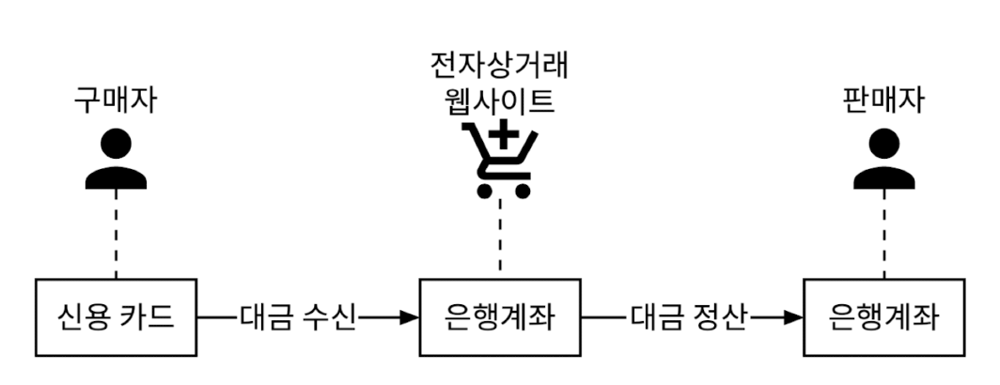
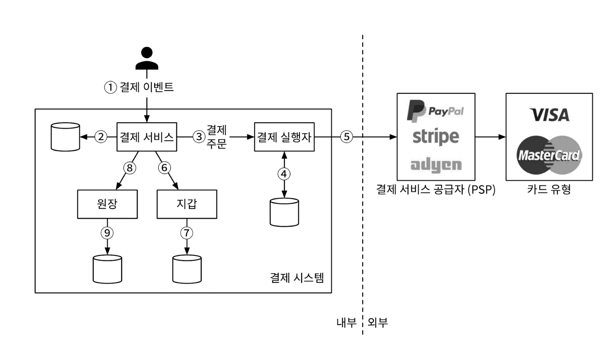

"결제 시스템"은 금전적 가치의 이전을 통해 금융 거래를 정산하는 데 사용되는 모든 시스템

여기에는 가치 교환을 가능하게 하는 제도, 도구, 사람, 규칙 절차, 표준 및 기술이 포함

# 1단계: 문제 이해 및 설계 범위 확정

## 기능 요구사항

대금 수신(pay-in) 흐름:
- 결제 시스템이 판매자를 대신하여 고객으로부터 대금을 수령
  
대금 정산(pay-out) 흐름:
- 결제 시스템이 전 세계의 판매자에게 제품 판매 대금을 송금

## 비기능 요구사항

신뢰성 및 내결함성:
- 결제 실패는 신중하게 처리해야 한다.

내부 서비스(결제/회계 시스템)와 외부 서비스(결제 서비스 제공업체) 간의 조정 프로세스:
- 시스템 간의 결제 정보가 일치하는지 비동기적으로 확인

## 개략적인 규모 추정

하루에 100만 건의 트랜잭션을 처리해야 하는데, 
- 이는 1,000,000 건의 트랜잭션 / 10^5초 = 초당 10건의 트랜잭션(TPS)
- 10TPS는 일반적인 데이터베이스로 별 문제 없이 처리 가능한 양이므로, 처리 대역폭 대신 결제 트랜잭션의 정확한 처리에 초점

# 2단계: 개략적 설계안 제시 및 동의 구하기

결제 흐름은 자금의 흐름을 반영하기 위해 크게 두 단계로 세분화
- **대금 수신 흐름**: 구매자가 주문을 하면 아마존의 은행 계좌로 돈이 들어오는 것
- **대금 정산 흐름**: 제품이 배송되면, 계좌에 묶여 있던 판매 대금에서 수수료를 제외한 잔액이 판매자의 은행 계좌로 지급

<figure><figcaption></figcaption></figure>

## 대금 수신 흐름

### 결제 서비스

결제 이벤트를 수락하고 결제 프로세스를 조율
- `AML/CFT`와 같은 규정을 준수하는지, 자금 세탁이나 테러 자금 조달과 같은 범죄 행위의 증거가 있는지 평가하는 위험 점검을 일반적으로 먼저 수행
  - 자금세탁방지(AML·Anti-Money Laundering)
  - 테러자금조달방지(CFT·Combating the Financing of Terrorism)
- 위험 확인 서비스는 복잡하고 전문화되어 있으므로 제3자 제공업체를 주로 이용

<figure><figcaption></figcaption></figure>

### 결제 실행자

결제 서비스 공급자(PSP)를 통해 결제 주문 하나를 실행.
- 하나의 결제 이벤트에는 여러 결제 주문이 포함될 수 있음.

### 결제 서비스 공급자

결제 서비스 공급자, PSP(Payment Service Provider)는 A 계정에서 B 계정으로 돈을 옮기는 역할을 담당

### 카드 유형

카드사는 신용 카드 업무를 처리하는 조직

### 원장

원장(ledger)은 결제 트랜잭션에 대한 금융 기록
- 원장 시스템은 전자상거래 웹사이트의 총 수익을 계산하거나 향후 수익을 예측하는 등, 결제 후 분석에서 매우 중요한 역할

### 지갑

지갑(wallet)에는 판마재(merchant)의 계정 잔액을 기록

일반적인 결제 흐름

1. 사용자가 '주문하기' 버튼을 클릭하면 결제 이벤트가 생성되어 결제 서비스로 전송
2. 결제 서비스는 결제 이벤트를 데이터베이스에 저장
3. 때로 단일 결제 이벤트에 여러 결제 주문이 포함될 수 있음
   - 한 번 결제로 여러 판매자의 제품을 처리하는 경우
   - 한 결제를 여러 결제 주문으로 분할하는 경우, 결제 서비스는 결제 주문마다 결제 실행자를 호출
4. 결제 실행자는 결제 주문을 데이터베이스에 저장
5. 결제 실행자가 외부 PSP를 호출하여 신용 카드 결제를 처리
6. 결제 실행자가 결제를 성공적으로 처리하고 나면 결제 서비스는 지갑을 갱신하여 특정 판매자의 잔고를 기록
7. 지갑 서버는 갱신된 잔고 정보를 데이터베이스에 저장
8. 지갑 서비스가 판매자 잔고를 성공적으로 갱신하면 결제 서비스는 원장을 호출
9. 원장 서비스는 새 원장 정보를 데이터베이스에 추가

## 결제 서비스 API

✉️ POST `/v1/payments`

- 결제 이벤트를 실행하는 엔드포인트
- 하나의 결제 이벤트에는 여러 결제 주문이 포함될 수 있음.
- 요청 매개변수

    |필드|설명|자료형|
    |---|---|---|
    |buyer_info|구매자 정보|json|
    |checkout_id|해당 결제 이벤트를 식별하는 전역적으로 고유한 ID|string|
    |credit_card_info|암호화된 신용 카드 정보 또는 결제 토큰. PSP마다 다른 값|json|
    |payment_orders|결제 주문 목록|list|

- payment_orders 형태
  
    |필드|설명|자료형|
    |---|---|---|
    |seller_account|대금을 수령할 판매자|string|
    |amount|해당 주문으로 전송되어야 할 대금|string|
    |currency|주문에 사용된 통화 단위|string|
    |payment_order_id|해당 주문을 식별하는 전역적으로 고유한 ID|string|

- amount는 데이터 유형이 string 인데 의도치 않은 반올림 오류를 방지하기 위해 전송 및 저장 시 숫자는 문자열로 보관하는 것이 좋다. 표시하거나 계산에 쓸 때만 숫자로 변환하자.

✉️ POST `/v1/payments/{:id}`

- payment_order_id가 가리키는 단일 결제 주문의 실행 상태를 반환하는 엔드포인트

결제 API에 대한 상세한 내용은 [스트라이프의 API 문서](https://docs.stripe.com/api/payment_methods) 참고.

## 결제 서비스 데이터 모델

# 3단계: 사엣 설계

# 4단계: 마무리

# 요약
