결제 플랫폼은 일반적으로 고객에게 전자 지갑 서비스를 제공하여 고객으로 하여금 지갑에 돈을 넣어 두고 필요할 때 사용할 수 있도록 한다.

<figure>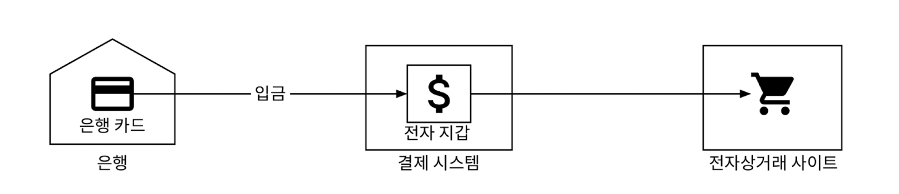<figcaption></figcaption></figure>

전자 지갑은 결제 기능뿐만 아니라 페이팔은 같은 플랫폼의 다른 사용자 지갑으로 직접 송금을 지원한다.
- 전자 지갑 간 이체는 은행 간 이체보다 빠르며, 일반적으로 추가 수수료를 부과하지 않느다.

# 1단계: 문제 이해 및 설계 범위 확정
 
설계할 전자 지갑
- 전자 지갑 간 이체
- 1,000,000TPS
- 99.99%의 안정성
- 트랜잭션
- 재현성

# 2단계: 개략적 설계안 제시 및 동의 구하기

## API 설계

**API**

|API|기능|
|:---|:---|
|POST /v1/wallet/balance_transfer|한 지갑에서 다른 지갑으로 자금 이체|

**요청 인자**

|필드|설명|자료형|
|---|---|---|
|from_account|자금을 인출할 계좌|string|
|to_account|자금을 이체할 계좌|string|
|amount|이체할 금액|string|
|currency|통화 단위|string(ISO 4217)|
|transaction_id|중복 제거에 사용할 ID|uuid|

응답 본문 사례:

```json
{
    "status": "success"
    "transaction_id": "01589980-2434-33dx-1532-1423gb420530"
}
```

## 인메모리 샤딩

모든 사용자 계정의 잔액을 유지하는 지갑 애플리케이션은 `<사용자, 잔액>` 관계를 나타내기 좋은 자료구조로 해시 테이블(Map, Key-value 저장소)을 사용한다.

인메모리 저장소로 인기 있는 선택지는 레디스.
- 그러나 레디스 노드 한 대로 100만 TPS 처리는 벅차다.
- 클러스터를 구성하고 사용자 계정을 모든 노드에 균등하게 분산시켜야 한다.
- 이 절차를 파티셔닝 또는 샤딩이라고 한다.

키-값 데이터를 n개의 파티션에 고르게 분배하려면 키의 해시 값을 계산하고, 이를 파티션의 수 n으로 나누는 것이 한 가지 방법
- 그 결과로 얻은 나머지 값이 데이터를 저장할 파티션 번호

```java
String accountID = "A";
Int partitionNumber = 7;
Int myPartition = accountID.hashCode() % partitionNumber;
```

모든 레디스 노드의 파티션 수 및 주소는 한군데 저장해 두는데, 높은 가용성을 보장하는 설정 정보 전문 저장소 주키퍼를 이 용도로 사용하면 좋다.

지갑 서비스의 중요한 역할

1. 이체 명령의 수신
2. 이체 명령의 유효성 검증
3. 명령이 유효한 것으로 확인되면 이체에 관계된 두 계정의 잔액 갱신. (이 두 계정은 서로 다른 레디스 노드에 있을 수 있음)

**메모리 기반 솔루션**

<figure>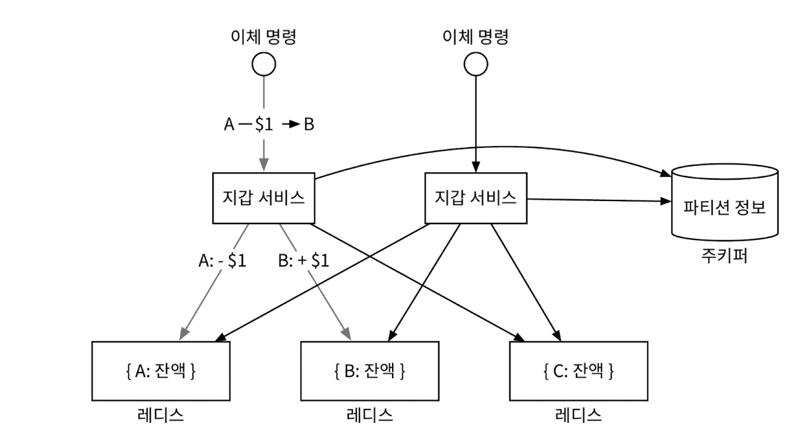<figcaption></figcaption></figure>

## 분산 트랜잭션

### 데이터베이스 샤딩

서로 다른 두 개 저장소 노드를 갱신하는 연산을 원자적으로 수행하기 위한 방법

1단계. 각 레디스 노드를 트랜잭션을 지원하는 관계형 데이터베이스 노드로 교체하는 것
- A, B, C의 잔액 정보가 레디스 노드가 아닌 3개의 관계형 데이터베이스 노드로 분산

<figure>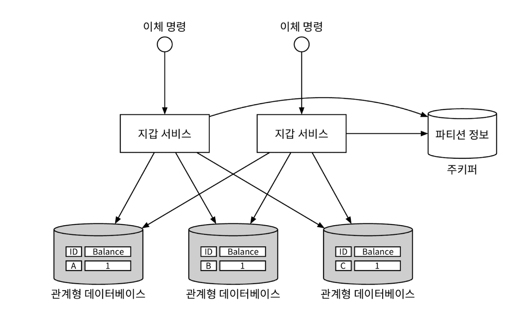<figcaption></figcaption></figure>

### 1️⃣ 분산 트랜잭션: 2단계 커밋(2PC)

분산 시스템에서 한 트랜잭션에는 여러 노드의 프로세스가 관여할 수 있다.
- 분산 트랜잭션은 이들 프로세스를 원자적인 하나의 트랜잭션으로 묶는 방안
- 저수준 방안
  - 데이터베이스 자체에 의존하는 방안
  - 일반적으로 사용되는 2단계 커밋 알고리즘
  
  <figure>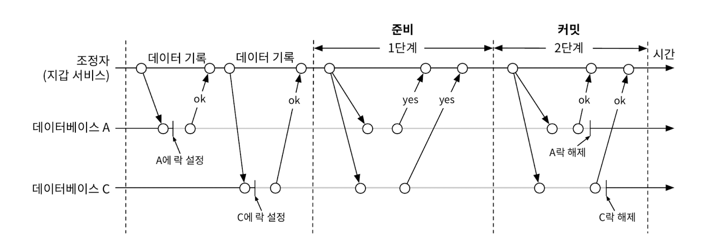<figcaption></figcaption></figure>

  - 저수준 방안인 이유는, 준비 단계 실행을 위해 데이터베이스 스랜잭션 실행 방식을 변경해야 하기 때문
  - 다른 노드의 메시지를 기다리는 동안 락이 오랫동안 잠긴 상태로 남고, 조정자가 SPOF(Single-Point-Of-Failure, 단일 장애 지점)이 될 수 있다.

  <figure>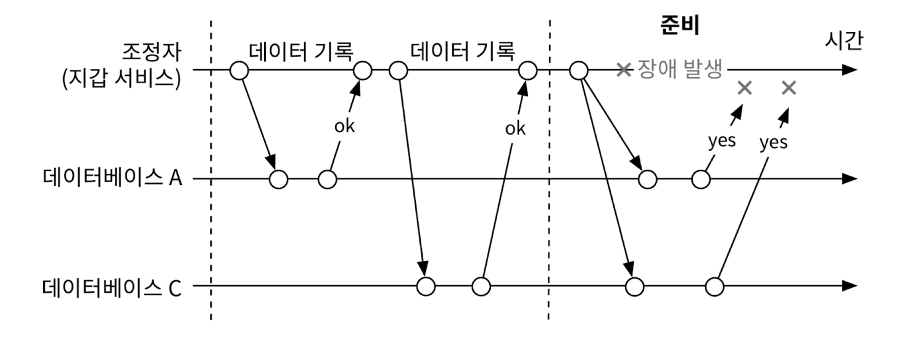<figcaption></figcaption></figure>

### 2️⃣ 분산 트랜잭션: TC/C

TC/C(시도-확정/취소, Try-Confirm/Cancel)는 두 단계로 구성된 보상 트랜잭션

1. 조정자는 모든 DB에 트랜잭션에 필요한 자원 예약을 요청
2. 조정자는 모든 DB로부터 회신을 받음
   - 모두 '예'라고 응답하면 조정자는 모든 DB에 작업 확인을 요청. 이것이 '시도-확정(Try-Confirm)' 절차
   - 어느 하나라도 '아니오'라고 응답하면 조정자는 모든 DB에 작업 취소를 요청하며, 이것이 '시도-취소(Try-Cancel)' 절차

#### ✅ TC/C 사례

계좌 A에서 계좌 C로 1달러 이체한다는 가정

<figure>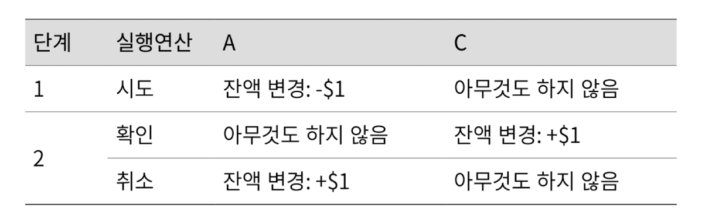<figcaption></figcaption></figure>

- TC/C의 조정자: 지갑 서비스
- 계정 A의 잔액: 1달러
- 계정 C의 잔액: 0달러

**첫 번째 단계: 시도**

- 시도 단계에서는 조정자 역할을 하는 지갑 서비스가 두 개의 트랜잭션 명령을 두 데이터베이스로 전송
  - (1) 조정자는 계정 A가 포함된 DB에 A의 잔액을 1달러 감소시키는 트랜잭션을 시작
  - (2) 조정자는 계정 C가 포함된 DB에 아무 작업도 하지 않음.

  <figure>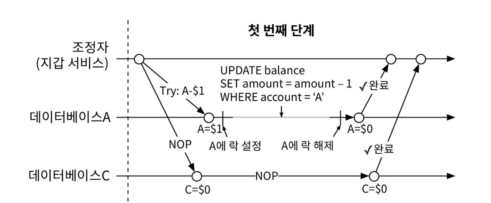<figcaption></figcaption></figure>

**두 번째 단계: 확정**

- 두 DB가 모두 예라고 응답하면 지갑 서비스는 확정 단계를 시작
  - 계정 A의 잔액은 이미 첫 번째 단계에서 갱신
  - 환인 단계에서 지갑 서비스는 계정 C의 잔액에 $1를 추가

  <figure>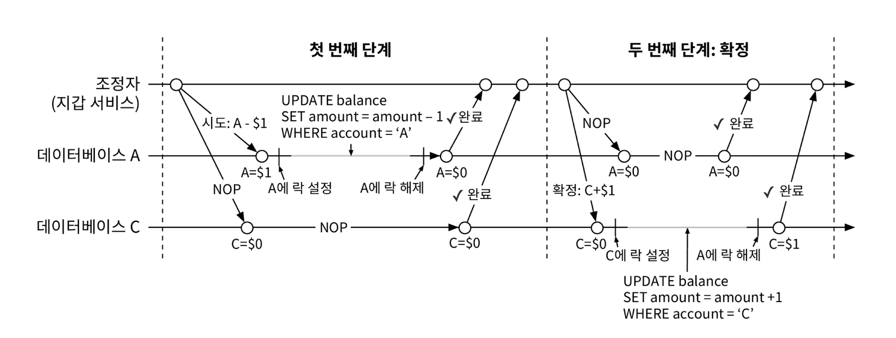<figcaption></figcaption></figure>

**두 번째 단계: 취소**

- 첫 번째 시도 단계가 실패하면, 시도 단계에서 계정 C의 잔액은 업데이트하지 않았으므로, 계정 C의 DB에는 NOP 명령을 전송하기만 하면 된다.

  <figure>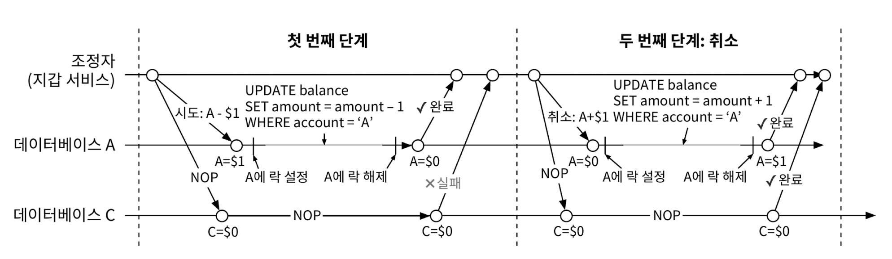<figcaption></figcaption></figure>

### 2PC(2단계 커밋) vs TC/C

- **2PC**: 두 번째 단계가 시작될 때 모든 로컬 트랜잭션이 완료되지 않은 상태
  - 미완성된 트랜잭션을 중단하거나 커밋하여 끝냄
- **TC/C**: 두 번째 단계가 시작될 때 모든 로컬 트랜잭션이 완료된 상태
  - 오류가 발생했을 때 이전 트랜잭션 결과를 상쇄하는 새로운 트랜잭션 실행
  - 보상 기반 분산 트랜잭션이라고 부름
  - undo 절차를 비즈니스 로직으로 구현하므로 구수준 해법

||첫 번째 단계|두 번째 단계: 성공|두 번째 단계: 실패|
|---|---|---|---|
|2PC|로컬 트랜잭션은 아직 완료되지 않은 상태|모든 로컬 트랜잭션을 커밋|모든 로컬 트랜잭션을 취소|
|TC/C|모든 로컬 트랜잭션이 커밋되거나 취소된 상태로 종료|필요한 경우 새 로컬 트랜잭션 실행|이미 커밋된 트랜잭션의 실행 결과를 undo|

### 단계별 상태 테이블

TC/C 실행 도중 지갑 서비스가 다시 시작될 경우
- TC/C 진행 상황, 특히 각 단계 상태 정보를 트랜잭션 DB에 저장하자.
- 이 상태 정보가 포함해야 할 최소 정보
  - 분산 트랜잭션의 ID와 내용
  - 각 DB에 대한 'Try' 단계의 상태.
    - not sent yet
    - has been sent
    - response received
  - 두 번째 단계의 이름(시도 단계의 결과를 사용하여 계산)
    - Confirm
    - Cancel
  - 두 번째 단계의 상태
  - 순서가 어긋났음을 나타내는 플래그

단계 상태 테이블은 일반적으로 돈을 인출할 지갑의 계정이 있는 DB에 둔다.

<figure><figcaption></figcaption></figure>

### 불균형 상태

분산 트랜잭션 실행 도중에는 항상 데이터 불일치가 발생
- DB와 같은 하위 시스템에서 불일치를 수정하는 경우 그 사실을 알 필요는 없지만, 그렇지 않다면(TC/C 같은 메커니즘 사용 시) 우리가 직접 처리해야 한다.

**불균형 상태의 사례**

<figure>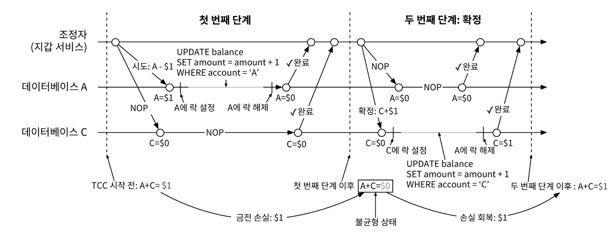<figcaption></figcaption></figure>

### 유효한 연산 순서

시도 단계에서 할 수 있는 일은 세 가지

<figure>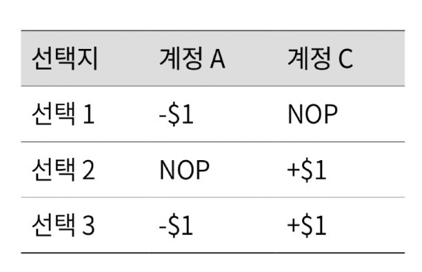<figcaption></figcaption></figure>

- 첫 번째: 올바른 방법
- 두 번째: 
  - 계정 C 연산은 성공했지만, 계정 A에서 실패한다면 지갑 서비스는 취소 단계를 실행.
  - 하지만, 취소 단계 실행 전 누군가 C 계정에서 $1를 이미 이체했다면 남는 돈이 없게 되므로, 분산 트랜잭션의 트랜잭션 보증을 위반
- 세 번째: 
  - $1를 A 계좌에서 차감하고 동시에 C에 추가하면 많은 문제가 발생
  - C 계좌에서는 $1이 추가되었지만, A에서 금액 차감 연산이 실패할 경우

### 잘못된 순서로 실행된 경우

TC/C에는 실행 순서가 어긋날 수 있는 문제가 존재

<figure>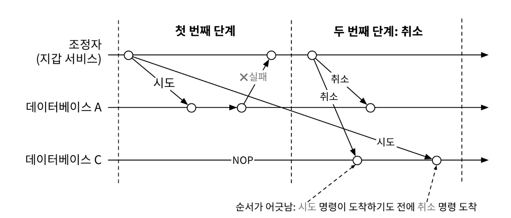<figcaption></figcaption></figure>

- A 계정에서 C 계정으로 1달러를 이체할 경우.
- 시도 단계에서 계정 A에 대한 작업이 실패하여 지갑 서비스에 실패를 반환한 다음, 취소 단계로 진입하여 계정 A와 계정 C 모두에 취소 명령을 전송하는 과정
- 이때, 계정 C를 관리하는 DB에 네트워크 문제로 시도 명령 전에 취소 명령부터 수신했을 경우, 그 시점에는 취소할 것이 없는 상태
- 순서가 바뀌어 도착하는 명령도 처리할 수 있도록 하려면 기존 로직을 다음과 같이 수정하자.
  - 취소 명령이 먼저 도착하면 DB에 아직 상응하는 시도 명령을 못 보았음을 나타내는 플래그를 참으로 설정하여 저장
  - 시도 명령이 도착하면 항상 먼저 도착한 취소 명령이 있었는지 확인. 있었으면 바로 실패를 반환

## 분산 트랜잭션: 사가

### 선형적 명령 수행

사가(Saga)는 유명한 분산 트랜잭션 솔루션 가운데 하나로 MSA에서는 사실상 표준

Saga의 개념
- 모든 연산은 순서대로 정렬
  - 각 연산은 자기 DB에 독립 트랜잭션으로 실행
- 연산은 첫 번째부터 마지막까지 순서대로 실행
  - 한 연산이 완료되면 다음 연산이 개시
- 연산이 실패하면 전체 프로세스는 실패한 연산부터 맨 처음 연산까지 역순으로 보상 트랜잭션을 통해 롤백

**사가 작업 흐름**

<figure>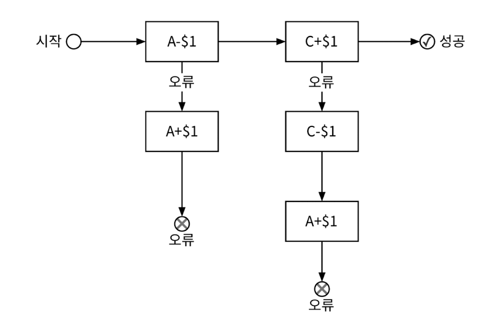<figcaption></figcaption></figure>


# 3단계: 상세 설계

# 4단계: 마무리

# 요약
