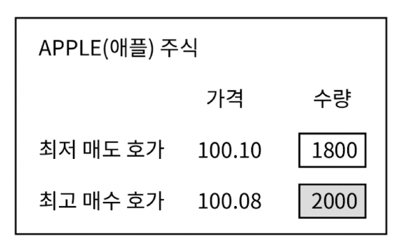
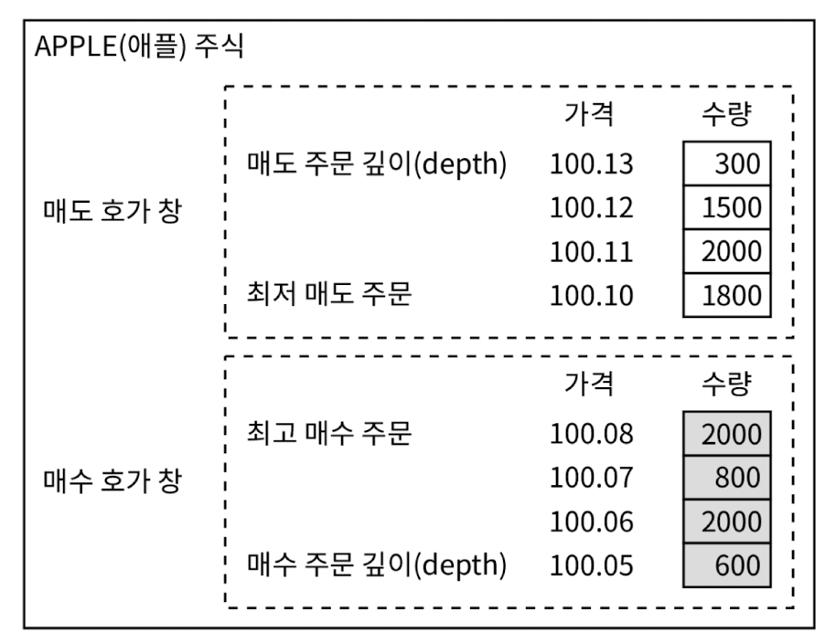
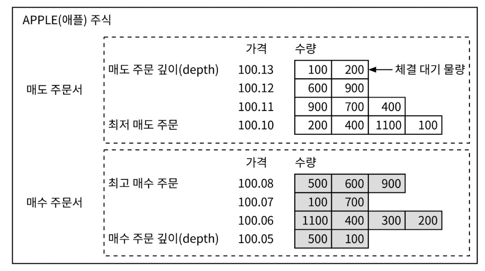

온라인 증권 거래 시스템 설계

# 1단계: 문제 이해 및 설계 범위 확정

**비기능 요구사항**

- 가용성: 최소 99.99%. 거래소의 가용성은 매우 중요한 문제. 단 몇 초의 장애로도 평판이 손상 가능
- 결함 내성: 프로덕션 장애의 파급을 줄이려면 결함 내성과 빠른 복구 메커니즘이 필요
- 지연 시간: 왕복 지연 시간은 밀리초 수준이어야 함(특히 p99(ppth 백분위수) 지연 시간이 중요)
  - 왕복 지연 시간은 주문이 거래소에 들어오는 순간부터 주문의 체결 사실이 반환되는 시점까지
  - p99 지연 시간이 계속 높으면 일부 사용자의 거래소 이용 경험이 아주 나빠짐.
- 보안: 거래소는 계정 관리 시스템을 갖춰야 함. 
  - 새 계좌 개설 전 사용자 신원 확인을 위한 KYC 확인 수행
  - 시장 데이터가 포함된 웹 페이지 등 공개 자원의 경우 DDoS 공격을 방지하는 장지 구비 필요

**계략적 규모 추정**

시스템 규모를 이해하기 위한 몇 가지의 간단한 계산
- 100가지 주식
- 하루 10억 건의 주문
- 뉴욕증권거래소는 일요일부터 금요일까지, 오전 9시 30분부터 오후 4시까지 영업. (총 6.5시간)
- QPS: 10억 / (6.5시간 x 3600) = ~43,000
- 최대 QPS: 5 * QPS = 2150,000. 거래량은 장 시작 직후, 그리고 장 마감 직전에 훨씬 높음

# 2단계: 개략적 설계안 제시 및 동의 구하기

거래소 설계에 도움될만한 기본 개념과 용어

**브로커**
- 대부분 개인 고객은 브로커 시스템을 통해 거래소와 거래
  - ex. 하나증권 등의 중권사가 브로커에 해당

**기관 고객**
- 기관 고객은 전문 증권 거래 소프트웨어를 사용하여 대량으로 거래
- 기관 고객마다 거래 시스템에 대한 요구사항이 다름
- 아주 낮은 응답 시간으로 거래하길 희망

**지정가 주문**
- 가격이 고정된 매수 또는 매도 주문
- 시장가 주문과 달리 체결이 즉시 이루어지지 않을 수 있고, 부분적으로만 체결될 수 있음

**시장가 주문**
- 가격을 지정하지 않는 주문, 시장가로 즉시 체결
- 체결은 보장되나 비용 면에서 손해를 볼 수 있음
- 급변하는 특정 시장 상황에서 유용

**시장 데이터 수준**
- 미국 주식시장에는 L1, L2, L3의 세 가지 가격 정보 등급이 있다(Level)
- L1 시장 데이터에는 최고 매수 호가, 매도 호가 및 수량이 포함
  - **최고 매수 호가**는 구매자가 주식에 지불할 의사가 있는 최고 가격
  - **매도 호가**는 매도자가 주식을 팔고자 하는 최저 가격

  <figure><figcaption></figcaption></figure>

- L2에는 더 많은 수준의 가격 정보가 제공
  - 깊이는 체결을 기다리는 물량의 호가를 어디까지 보여 주는지

  <figure><figcaption></figcaption></figure>

- L3는 L2에서 한 걸음 더 나아가, 각 주문 가격에 체결을 기다리는 물량 정보까지 보여

  <figure><figcaption></figcaption></figure>

# 3단계: 상세 설계

# 4단계: 마무리

# 요약