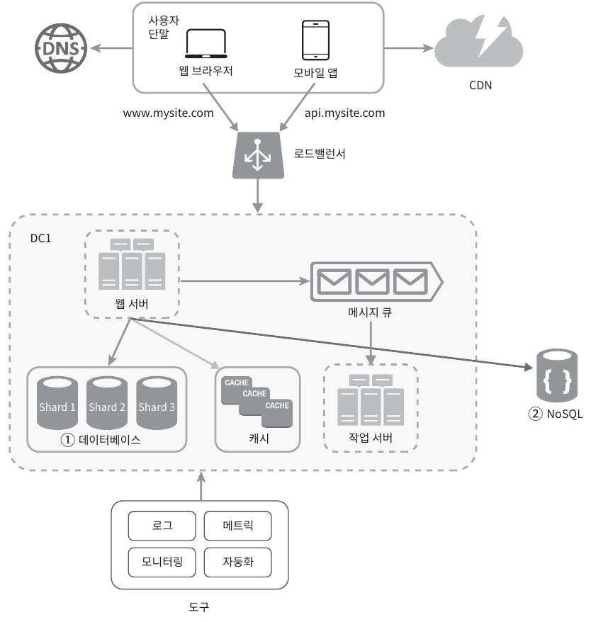

# 단일 서버

모든 컴포넌트가 단 한 대의 서버에서 실행되는 간단한 시스템이다.
- 웹, 앱, 데이터베이스, 캐시 등이 전부 서버 한 대에서 실행된다.

사용자 요청 처리 흐름

- (1) 사용자는 도메인 이름을 이용하여 웹사이트에 접속
  - 접속을 위해 도메인 이름을 도메인 이름 서비스(DNS)에 질의하고 IP 주소로 변환
  - DNS는 보통 제3 사업자가 제공하는 유료 서비스를 이용
- (2) DNS 조회 결과로 IP 주소가 반환
- (3) 해당 IP 주소로 HTTP 요청이 전달
- (4) 요청을 받은 웹 서버는 HTML 페이지나 JSON 형태로 응답을 반환

# 데이터 베이스

웹/모바일 트래픽 처리 서버(웹 계층)와 데이터베이스 서버(데이터 계층)를 분리하면 각각을 독립적으로 확장해 나갈 수 있다.

**어떤 데이터베이스를 사용할 것인가?**

- **관계형 데이터베이스**는 관계형 데이터베이스 관리 시스템(RDMBS)이라고도 부른다.
  - MySQL, Oracle, PostgreSQL 등
  - 자료를 테이블과 열, 칼럼으로 표현
  - SQL을 사용하여 여러 테이블에 있는 데이터를 관계에 따라 조인
- **비-관계형 데이터베이스**는 NoSql이라고도 부른다.
  - CouchDB, Neo4j, Cassandra, HBase, Amazon DynamoDB 등
  - NoSQL은 `key-value store`, `graph store`, `column store`, `document store` 부류로 나눌 수 있다.
  - 일반적으로 조인 연산은 지원하지 않음

비-관계형 데이터베이스가 바람직한 선택일 경우
- 아주 낮은 응답 지연시간(latency)이 요구
- 다루는 데이터가 비정형(unstructured)이라 관계형 데이터가 아닐 경우
- 데이터(JSON, YAML, XML 등)를 직렬화하거나 역직렬화 할 수 있기만 하면 될 경우
- 아주 많은 양의 데이터를 저장할 필요가 있을 경우

# 수직적 규모 확장 vs 수평적 규모 확장

**수직적 규모 확장(vertical scaling) 프로세스**
- 스케일 업(scale up)이라고도 불림
- 서버에 **고사양 자원**(CPU, RAM 등)을 추가하는 행위
- 서버 유입 트래픽이 적을 경우 적합하고 단순한 장점
- 심각한 단점이 존재
  - 한계 존재: 한 대의 서버에 CPU, 메모리를 무한대 증설할 방법이 없음
  - 장애에 대한 자동복구(failover) 방안이나 다중화(redundancy) 방은을 제시하지 않음: 서버 장애 발생 시 웹/앱은 완전히 중단

**수평적 규모 확장 프로세스**
- 스케일 아웃(scale out)이라고도 불림
- **더 많은 서버를 추가**하여 성능을 개선하는 행위
- 수직적 규모 확장법의 단점으로 대규모 애플리케이션 지원에는 수평적 규모 확장법이 적합

## 로드밸런서
- 부하 분산 집합(load balancing set)에 속한 웹 서버들에게 **트래픽 부화를 고르게 분산하는 역할**

  

사용자는 로드밸런서의 `공개 IP 주소`(public IP address)로 접속
- 웹 서버는 클라이언트 접속을 직접 처리하지 않고 보안을 위해 서버 간 통신에는 `사설 IP 주소`(private IP address) 이용
- 사설 API 주소는 같은 네트워크에 속한 서버 사이의 통신에만 쓰일 수 있는 IP 주소
- 인터넷을 통한 접속은 불가

부하 분산 집합에 또 하나의 웹 서버를 추가하고 나면 **장애를 자동복구하지 못하는 문제(no failover)**는 해소
- 웹 계층의 가용성(availability)은 향상

## 데이터베이스 다중화

많은 데이터베이스 관리 시스템이 다중화를 지원한다.
- 보통 서버 사이에 master-slave 관계를 설정하고 **데이터 원본은 master 서버**에, **사본은 slave 서버**에 저장하는 방식
- **쓰기 연산은 master**에서만 지원(insert, delete, update)
- **slave** DB는 master DB로부터 그 사본을 전달받고, **읽기 연산만**을 지원
- 대부분의 애플리케이션은 읽기 연산의 비중이 쓰기 연산보다 훨씬 높아서 통상 slave DB 수가 주 데이터베이스의 수보다 많다.

데이터베이스를 다중화할 경우 얻을 수 있는 이득
- `더 나은 성능`: 모든 데이터 변경 연산은 master, 읽기 연산은 slave로 분산되어 병렬로 처리될 수 있는 질의 수가 늘어나므로 성능이 좋아진다.
- `안정성(reliability)`: 자연 재해 등으로 데이터베이스 서버 가운데 일부가 파괴되어도 데이터는 보존. (데이터를 지역적으로 떨어진 여러 장소에 다중화)
- `가용성(availability)`: 데이터를 여러 지역에 복제함으로 하나의 데이터베이스 서버에 장애가 발생하더라도 다른 서버에 있는 데이터를 가져와 계속 서비스.

로드밸런서와 데이터베이스 다중화를 고려한 설계안
- (1) 사용자는 DNS로부터 로드밸런서의 공개 IP 주소를 받는다.
- (2) 사용자는 해당 IP 주소를 사용해 로드밸런서에 접속.
- (3) HTTP 요청은 서버 1이나 서버 2로 전달
- (4) 웹 서버는 사용자의 데이터를 부 데이터베이스 서버에서 읽는다.
- (5) 웹 서버는 데이터 변경 연산(데이터 추가, 삭제, 갱신 연산 등)은 주 데이터베이스로 전달한다.

이제 응답시간(latency)을 개선해볼 순서다.
- 응답 시간은 캐시(cache)를 붙이고 정적 콘텐츠를 콘텐츠 전송 네트워크(Content Delivery Network, CDN)로 옮기면 개선할 수 있다.

# 캐시

캐시는 값비싼 연산 결과 또는 자주 참조되는 데이터를 메모리 안에 두고, 이후 요청이 보다 빨리 처리될 수 있도록 하는 저장소이다.
- 애플리케이션의 성능은 데이터베이스를 얼마나 자주 호출하느냐에 크게 좌우되는데, 캐시는 그런 문제를 완화할 수 있다.

**캐시 계층**
- 

<figure><figcaption></figcaption></figure>