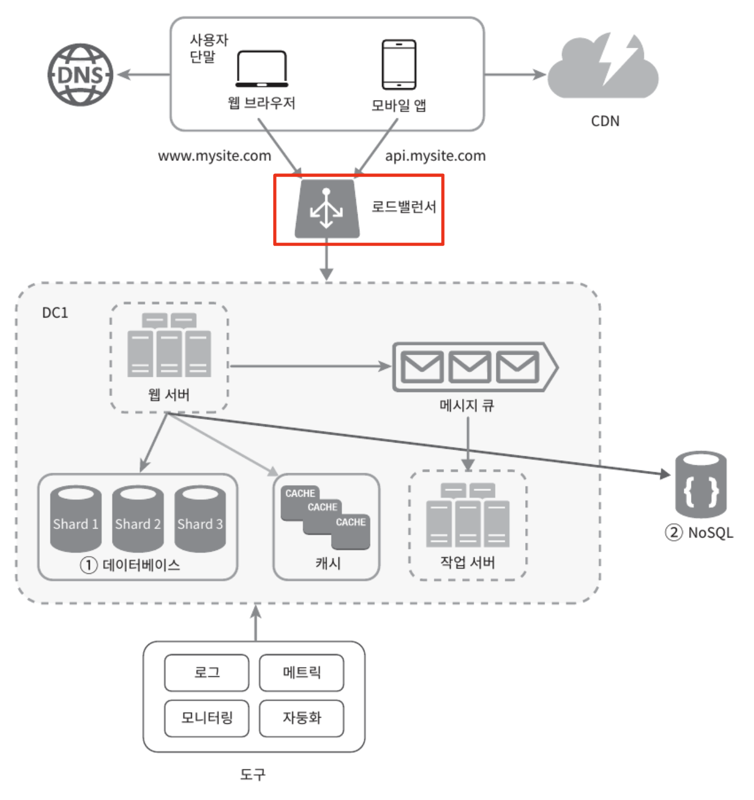
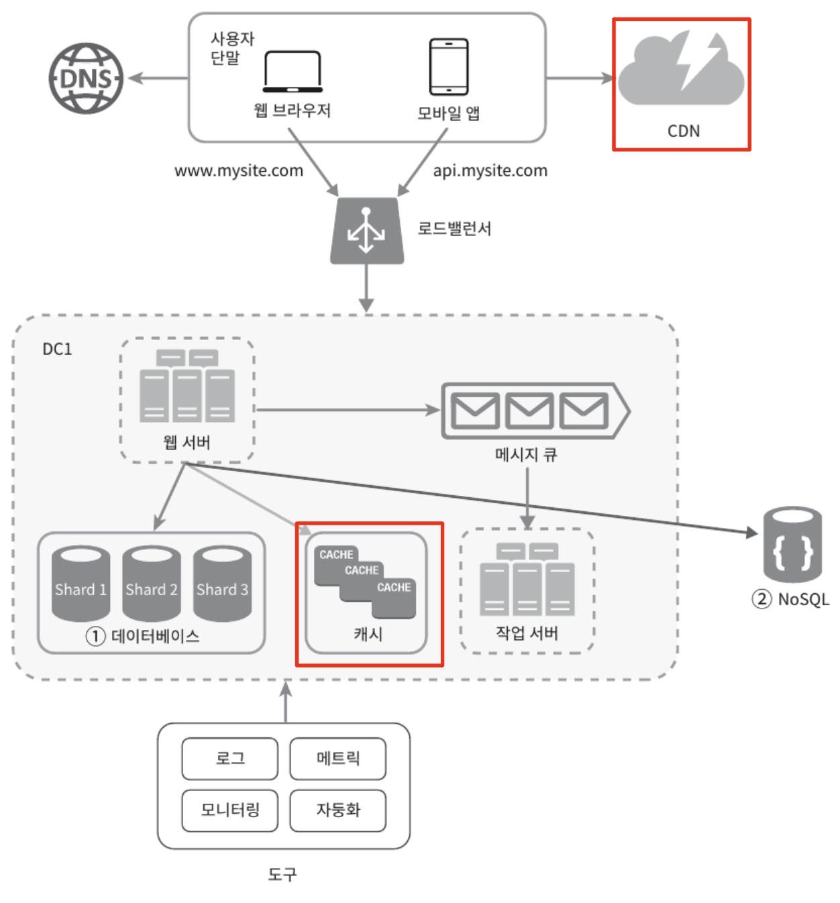
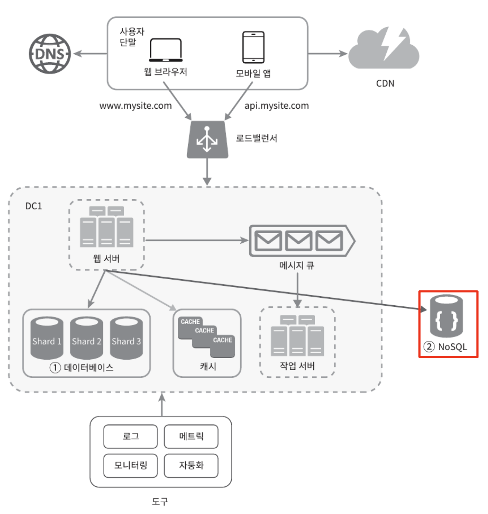
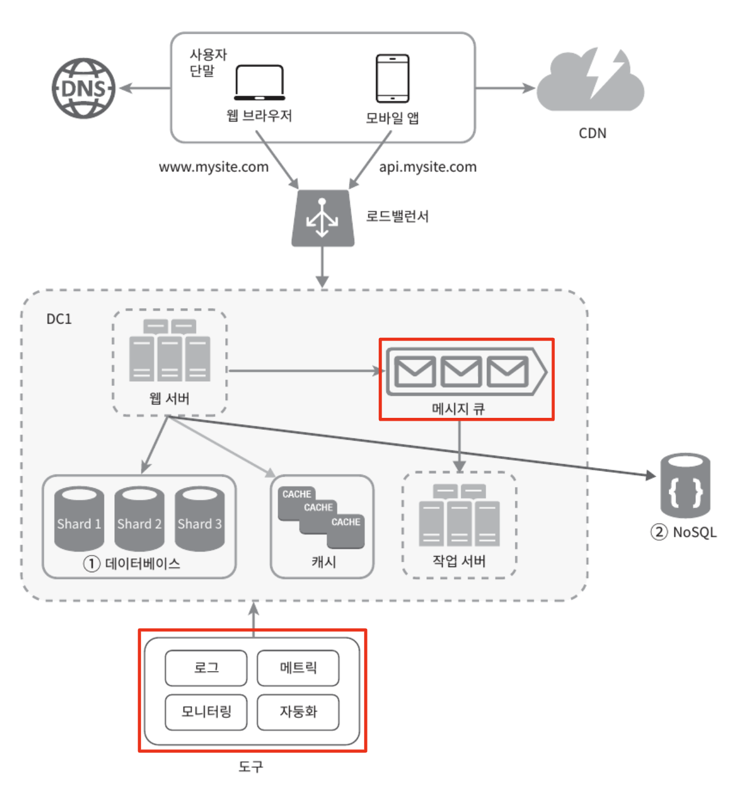

# 단일 서버

모든 컴포넌트가 단 한 대의 서버에서 실행되는 간단한 시스템이다.
- 웹, 앱, 데이터베이스, 캐시 등이 전부 서버 한 대에서 실행된다.

사용자 요청 처리 흐름

- (1) 사용자는 도메인 이름을 이용하여 웹사이트에 접속
  - 접속을 위해 도메인 이름을 도메인 이름 서비스(DNS)에 질의하고 IP 주소로 변환
  - DNS는 보통 제3 사업자가 제공하는 유료 서비스를 이용
- (2) DNS 조회 결과로 IP 주소가 반환
- (3) 해당 IP 주소로 HTTP 요청이 전달
- (4) 요청을 받은 웹 서버는 HTML 페이지나 JSON 형태로 응답을 반환

# 데이터 베이스

웹/모바일 트래픽 처리 서버(웹 계층)와 데이터베이스 서버(데이터 계층)를 분리하면 각각을 독립적으로 확장해 나갈 수 있다.

**어떤 데이터베이스를 사용할 것인가?**

- **관계형 데이터베이스**는 관계형 데이터베이스 관리 시스템(RDMBS)이라고도 부른다.
  - MySQL, Oracle, PostgreSQL 등
  - 자료를 테이블과 열, 칼럼으로 표현
  - SQL을 사용하여 여러 테이블에 있는 데이터를 관계에 따라 조인
- **비-관계형 데이터베이스**는 NoSql이라고도 부른다.
  - CouchDB, Neo4j, Cassandra, HBase, Amazon DynamoDB 등
  - NoSQL은 `key-value store`, `graph store`, `column store`, `document store` 부류로 나눌 수 있다.
  - 일반적으로 조인 연산은 지원하지 않음

비-관계형 데이터베이스가 바람직한 선택일 경우
- 아주 낮은 응답 지연시간(latency)이 요구
- 다루는 데이터가 비정형(unstructured)이라 관계형 데이터가 아닐 경우
- 데이터(JSON, YAML, XML 등)를 직렬화하거나 역직렬화 할 수 있기만 하면 될 경우
- 아주 많은 양의 데이터를 저장할 필요가 있을 경우

# 수직적 규모 확장 vs 수평적 규모 확장

**수직적 규모 확장(vertical scaling) 프로세스**
- 스케일 업(scale up)이라고도 불림
- 서버에 **고사양 자원**(CPU, RAM 등)을 추가하는 행위
- 서버 유입 트래픽이 적을 경우 적합하고 단순한 장점
- 심각한 단점이 존재
  - 한계 존재: 한 대의 서버에 CPU, 메모리를 무한대 증설할 방법이 없음
  - 장애에 대한 자동복구(failover) 방안이나 다중화(redundancy) 방은을 제시하지 않음: 서버 장애 발생 시 웹/앱은 완전히 중단

**수평적 규모 확장 프로세스**
- 스케일 아웃(scale out)이라고도 불림
- **더 많은 서버를 추가**하여 성능을 개선하는 행위
- 수직적 규모 확장법의 단점으로 대규모 애플리케이션 지원에는 수평적 규모 확장법이 적합

## 로드밸런서
- 부하 분산 집합(load balancing set)에 속한 웹 서버들에게 **트래픽 부화를 고르게 분산하는 역할**

  

사용자는 로드밸런서의 `공개 IP 주소`(public IP address)로 접속
- 웹 서버는 클라이언트 접속을 직접 처리하지 않고 보안을 위해 서버 간 통신에는 `사설 IP 주소`(private IP address) 이용
- 사설 API 주소는 같은 네트워크에 속한 서버 사이의 통신에만 쓰일 수 있는 IP 주소
- 인터넷을 통한 접속은 불가

부하 분산 집합에 또 하나의 웹 서버를 추가하고 나면 **장애를 자동복구하지 못하는 문제(no failover)**는 해소
- 웹 계층의 가용성(availability)은 향상

## 데이터베이스 다중화

많은 데이터베이스 관리 시스템이 다중화를 지원한다.
- 보통 서버 사이에 master-slave 관계를 설정하고 **데이터 원본은 master 서버**에, **사본은 slave 서버**에 저장하는 방식
- **쓰기 연산은 master**에서만 지원(insert, delete, update)
- **slave** DB는 master DB로부터 그 사본을 전달받고, **읽기 연산만**을 지원
- 대부분의 애플리케이션은 읽기 연산의 비중이 쓰기 연산보다 훨씬 높아서 통상 slave DB 수가 주 데이터베이스의 수보다 많다.

데이터베이스를 다중화할 경우 얻을 수 있는 이득
- `더 나은 성능`: 모든 데이터 변경 연산은 master, 읽기 연산은 slave로 분산되어 병렬로 처리될 수 있는 질의 수가 늘어나므로 성능이 좋아진다.
- `안정성(reliability)`: 자연 재해 등으로 데이터베이스 서버 가운데 일부가 파괴되어도 데이터는 보존. (데이터를 지역적으로 떨어진 여러 장소에 다중화)
- `가용성(availability)`: 데이터를 여러 지역에 복제함으로 하나의 데이터베이스 서버에 장애가 발생하더라도 다른 서버에 있는 데이터를 가져와 계속 서비스.

로드밸런서와 데이터베이스 다중화를 고려한 설계안
- (1) 사용자는 DNS로부터 로드밸런서의 공개 IP 주소를 받는다.
- (2) 사용자는 해당 IP 주소를 사용해 로드밸런서에 접속.
- (3) HTTP 요청은 서버 1이나 서버 2로 전달
- (4) 웹 서버는 사용자의 데이터를 부 데이터베이스 서버에서 읽는다.
- (5) 웹 서버는 데이터 변경 연산(데이터 추가, 삭제, 갱신 연산 등)은 주 데이터베이스로 전달한다.

이제 응답시간(latency)을 개선해볼 순서다.
- 응답 시간은 캐시(cache)를 붙이고 정적 콘텐츠를 콘텐츠 전송 네트워크(Content Delivery Network, CDN)로 옮기면 개선할 수 있다.

# 캐시

캐시는 값비싼 연산 결과 또는 자주 참조되는 데이터를 메모리 안에 두고, 이후 요청이 보다 빨리 처리될 수 있도록 하는 저장소이다.
- 애플리케이션의 성능은 데이터베이스를 얼마나 자주 호출하느냐에 크게 좌우되는데, 캐시는 그런 문제를 완화할 수 있다.

**캐시 계층**
- **데이터가 잠시 보관되는 곳**으로 DB보다 훨씬 빠르다.
- 별도의 캐시 계층을 두면 **성능이 개선**될 뿐 아니라 **DB 부하를 줄일** 수 있고, **캐시 계층 규모를 독립적으로 확장**하는 것도 가능해 진다.
- 읽기 주도형 캐시 전략(read-through caching strategy)
  - 요청 받은 웹 서버는 캐시에 응답이 저장되어 있는지 확인
  - 저장되어 있다면 해당 데이터를 클라이언트에 반환하고, 없을 경우 DB 질의를 통해 데이터를 찾아 캐시에 저장한 뒤 클라이언트에 반환
- 이외에도 캐시할 데이터 종류, 크기, 액세스 패턴에 맞는 캐시 전략이 존재
  - [Caching Strategies and How to Choose the Right One](https://codeahoy.com/2017/08/11/caching-strategies-and-how-to-choose-the-right-one/)
- 캐시 서버는 일반적으로 널리 쓰이는 프로그래밍 언어로 API를 제공하므로 이용하는 방법이 간단하다.

**캐시 사용 시 유의할 점**

- 캐시는 어떤 상황에 바람직한가❓
  - 데이터 갱신은 자주 일어나지 않지만 **참조는 빈번하게 일어난다면 고려**해볼 만하다.
- 어떤 데이터를 캐시에 두어야 하는가❓
  - **캐시 데이터는 휘발성 메모리**에 두므로, 중요 데이터는 지속적 저장소(persistent data store)에 두어야 한다.
- 캐시에 보관된 데이터는 어떻게 만료되는가❓
  - 만료된 데이터는 캐시에서 삭제되고, **만료 정책이 없다면 데이터는 캐시에 계속 남게** 된다.
  - 만료 기간이 너무 짧으면 DB를 너무 자주 읽고, 너무 길면 원본가 차이가 날 가능성이 있다.
- 일관성은 어떻게 유지되는가❓
  - 저장소의 원본 갱신 연산과 캐시 갱신 연산이 **단일 트랜잭션으로 처리되지 않을 경우 일관성이 깨질** 수 있다.
  - 여러 지역에 걸쳐 시스템을 확장해 나가는 경우 캐시와 저장소 사이의 일관성 유지에 어려움 문제가 있다.
  - [Scaling Memcache at Facebook](https://www.usenix.org/system/files/conference/nsdi13/nsdi13-final170_update.pdf)
- 장애에는 어떻게 대처할 것인가❓
  - **캐시 서버를 한 대만 둘 경우 단일 장애 지점**(Single Point of Failure, SPOF)이 되어 버릴 수 있다.
    - 어떤 특정 지점에서의 장애가 전체 시스템의 동작을 중단시켜버릴 수 있는 경우.
  - SPOF를 피하려면 **여러 지역에 걸쳐 캐시 서버를 분산**시켜야 한다.
- 캐시 메모리는 얼마나 크게 잡을 것인가❓
  - 캐시 메모리가 너무 작으면 액세스 패턴에 따라 데이터가 너무 자주 캐시에서 밀려나버려(eviction) 캐시 성능이 떨어지게 된다.
  - **캐시 메모리를 과할당**(overprovision)하면 캐시에 보관될 데이터가 갑자기 늘어났을 때 생길 문제를 방지할 수 있다.
- 데이터 방출 정책은 무엇인가❓
  - 캐시가 꽉 차버리면 추가로 캐시에 데이터를 넣어야 할 경우 **기존 데이터를 내보내는 정책**
  - **LRU(Least Recently Used)** 정책이 가장 널리 쓰이는데 마지막으로 사용된 시점이 가장 오래된 데이터를 내보내는 정책이다.
  - **LFU(Least Frequently Used**, 사용된 빈도가 가장 낮은 데이터를 내보내는 정책), **FIFO(First In First Out**, 가장 먼저 캐시에 들어온 데이터를 가장 먼저 내보내는 정책)도 있다.

# 콘텐츠 전송 네트워크(CDN)

`CDN`은 **정적 콘텐츠를 전송하는 데 쓰이는**, 지리적으로 분산된 서버의 네트워크
- 이미지, 비디오, CSS, JavaScript 파일 등을 캐시
- 요청 경로, 질의 문자열, 쿠키, 요청 헤더 등의 정보에 기반하여 HTML 페이지를 캐시한다.

`CDN`의 동작
- (1) 사용자 A가 이미지 URL을 이용해 png 파일에 접근. (URL의 도메인은 CDN 서비스 사업자가 제공)
- (2) CDN 서버의 캐시에 해당 이미지가 없는 경우, 서버는 원본 서버에 요청하여 파일을 가져온다. (웹 서버 또는 AWS S3)
- (3) 원본 서버가 파일을 CDN 서버에 반환. (응답 HTTP 헤더에는 해당 파일이 얼마나 오래 캐시될 수 있는지 설명하는 TTL(Time-To-Live) 값이 포함)
- (4) CDN 서버는 파일을 캐시하고 사용자 A에게 반환 (이미지는 TTL에 명시된 시간이 끝날 때까지 캐시)
- (5) 사용자 B가 같은 이미지에 대한 요청을 CDN 서버에 전송
- (6) 만료되지 않은 이미지에 대한 요청은 캐시를 통해 처리

**CDN 사용 시 고려해야 할 사항**
- `비용`
  - 보통 제3 사업자에 의해 운영. CDN으로 들어가고 나가는 데이터 전송 양에 따라 요금 지불
  - 자주 사용되는 콘텐츠 위주로 캐시하는 것을 권장
- `적절한 만료 시한 설정`
  - 시의성이 중요한 콘텐츠는 만료 시점이 중요
  - 너무 길면 콘텐츠 신선도가 떨어지고, 너무 짧으면 원본 서버에 빈번한 접속이 필요
- `CDN 장애에 대한 대처 방안`
  - 일시적으로 CDN 응답이 없을 경우 해당 문제를 감지하여 원본 서버로부터 직접 콘텐츠를 가져오도록 클라이언트를 구성해야 하는 것이 필요
- `콘텐츠 무효화 방법`
  - 아직 만료되지 않은 콘텐츠라도 CDN에서 제거 가능
    - CDN 서비스 사업자 제공 API 사용
    - 콘텐츠의 다른 버전을 서비스하도록 Object versioning 이용 (새로운 버전 지정은 버전 번호를 인자로. `image.png?v=2`)

CDN과 캐시가 추가된 설계
- 정적 콘텐츠(JS, CSS, IMG ..)는 웹 서버가 아닌 CDN을 통해 제공하여 더 나은 성능을 보장한다.
- 캐시가 DB 부하를 줄어준다.

# 무상태 웹 계층

웹 계층을 수평적으로 확장하려면 **상태 정보**(ex. 사용자 세션 데이터)**를 웹 계층에서 제거**해야 한다.
- 바람직한 전략은 상태 정보를 RDB, NoSQL 같은 지속성 저장소에 보관하고, 필요 시 가져오도록 하는 것이다.
- 이렇게 구성된 웹 계층을 무상태(stateless) 웹 계층이라고 부른다.

**상태 정보 의존 아키텍처**
- 클라이언트 정보(상태)를 유지하여 요청들 사이에 공유되도록 한다.
- 하지만 문제는 같은 클라이언트로부터의 요청은 항상 같은 서버로 전송되어야 한다는 것이다.
- 대부분의 로드밸런서가 고정 세선(sticky session)이라는 기능으로 지원하고 있지만, 로드밸런서에 부담을 준다.
- 로그밸런서 뒷단에 서버 추가나 제거도 까다로워지고, 서버 장애를 처리하기도 복잡해진다.

**무상태 아키텍처**
- 웹 서버는 **상태 정보가 필요할 경우 공유 저장소**(shared storage)**로부터 데이터를 가져온다.**
- **상태 정보는 웹 서버로부터 물리적으로 분리**되어 있다.
- 이러한 구조는 **단순**하고, **안정적**이며, **규모 확장이 쉬워**진다.
- 공유 저장소는 RDB, Memcached/Redis, NoSQL 모두 사용 가능하다. (단, NoSQL을 사용하면 규모 확장이 간편해질 수 있다.)

# 데이터 센터

두 개의 데이터 센터를 이용할 경우 장애가 없는 상황에서 **시용자는 가장 가까운 데이터 센터로 안내**된다.
- 통상 이 절차를 지리적 라우팅(geoDNS-routing, geo-routing)이라고 부른다.
  - geoDNS는 사용자의 위치에 따라 도메인 이름을 어떤 IP 주소로 변환할지 결정할 수 있도록 해주는 DNS 서비스이다.
- 데이터 센터 중 하나에 심각한 장애가 발생하면 모든 트래픽은 장애가 없는 데이터 센터로 전송된다.

다중 데이터센터 아키텍처를 만들기 위해 몇 가지의 기술적 난제를 해야해야 한다.
- `트래픽 우회`
  - **올바른 데이터 센터로 트래픽을 보내는 효과적인 방법**
  - GeoDNS는 사용자에게서 가장 가까운 데이터센터로 트래픽을 보낼 수 있도록 해 준다.
- `데이터 동기화`
  - 데이터 센터마다 별도의 DB를 사용하고 있다면, 장애가 자동 복구되어 트래픽이 다른 DB로 우회되어 해당 DB에는 찾는 데이터가 없을 수 있다.
  - 이 상황을 막는 보편적인 전략은 **데이터를 여러 데이터센터에 걸쳐 다중화**하는 것이다.
  - [넷플릭스의 데이터 다중화 방법](https://netflixtechblog.com/active-active-for-multi-regional-resiliency-c47719f6685b)
- `테스트와 배포`
  - 웹 사이트 또는 애플리케이션을 **여러 위치에서 테스트**해 보는 것이 중요하다.
  - 자동화된 배포 도구는 모든 데이터 센터에 동일한 서비스가 설치되도록 하는 데 중요한 역할을 한다.

시스템을 더 큰 규모로 확장하기 위해 **시스템의 컴포넌트를 분리**하여, **각기 독립적으로 확장**될 수 있도록 해야 한다.
- `메시지 큐`(message queue)는 **많은 분산 시스템이 이 문제를 해결하기 위해 사용하고 있는 핵심적인 전략** 가운데 하나다.

# 메시지 큐

메시지의 **무손실**(durability, 메시지 큐에 일단 보관된 메시지는 소비자가 꺼낼 때까지 안전하게 보관된다는 특성)**을 보장하는 비동기 통신 지원 컴포넌트**
- `메시지의 버퍼 역할`을 하며 `비동기적으로 전송`

메시지 큐의 기본 아키텍처
- **생산자 또는 방행자**(producer/publisher)로 불리는 입력 서비스가 **메시지를 만들어 메시지 큐에 발행**(publish)
- 큐에는 보통 **소비자 혹은 구독자**(consumer/subscriber)라 불리는 서비스 혹은 서버가 연결되어 있는데, **메시지를 받아 그에 맞는 동작을 수행**하는 역할을 한다.

메시지 큐를 이용하면 **서비스 또는 서버 간 결합이 느슨**해져서, **규모 확장성이 보장**되어야 하는 **안정적 애플리케이션을 구성**하기 좋다.
- 생산자는 소비자 프로세스가 다운되어 있어도 메시지를 발생할 수 있고,
- 소비자는 생산자 서비스가 가용한 상태가 아니더라도 메시지를 수신할 수 있다.
- 생산자와 소비자 서비스의 규모는 각기 독립적으로 확장 가능하다.

<figure><figcaption></figcaption></figure>

# 로그, 메트릭, 그리고 자동화

웹 사이트와 함께 사업 규모가 커지고 나면, 로그, 메트릭, 자동화 도구에 필수적으로 투자해야 한다.
- `로그`
  - 에러 로그를 모니터링하는 것은 중요하다.
  - 에러 로그는 서버 단위로 모니터링 할 수도 있지만, 로그를 단일 서비스로 모아주는 도구를 활용하면 더 편리하게 검색하고 조회할 수 있다.
- `매트릭`
  - 메트릭을 잘 수집하면 사업 현황에 관한 유용한 정보를 얻을 수도 있고, 시스템의 현재 상태를 손쉽게 파악할 수 있다.
  - 메트릭 가운데 유용한 몇 가지
    - 호스트 단위 메트릭: CPU, 메모리, 디스크 I/O 등
    - 종합(aggregated) 메트릭: DB 계층 성능, 캐시 계층 성능 등
    - 핵심 비즈니스 메트릭: 일별 능동 사용자(Daily Active User), 수익, 재방문 등
- `자동화`
  - 시스템이 크고 복잡해지면 생산성을 높이기 위해 자동화 도구를 활용해야 한다.
  - 지속적 통합(continuous integration)을 도와주는 도구를 활용할 수 있다.
  - 이 외에도 빌드, 테스트, 배포 등의 절차를 자동화할 수 있어서 갭라 생산성을 크게 향상시킬 수 있다.

# 데이터베이스의 규모 확장

# 백만 사용자, 그리고 그 이상

<figure><figcaption></figcaption></figure>