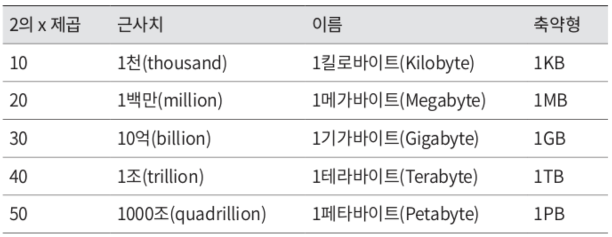
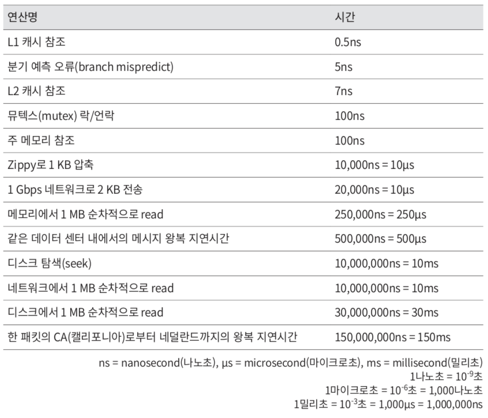
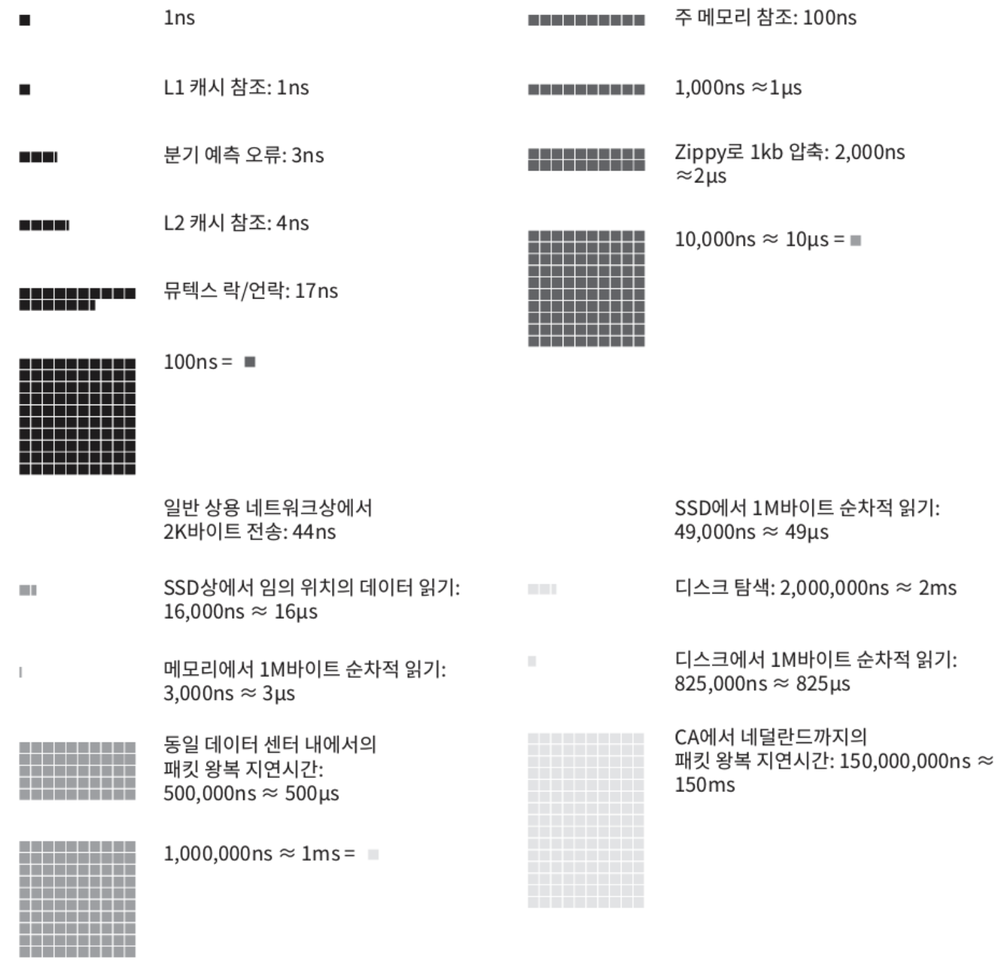
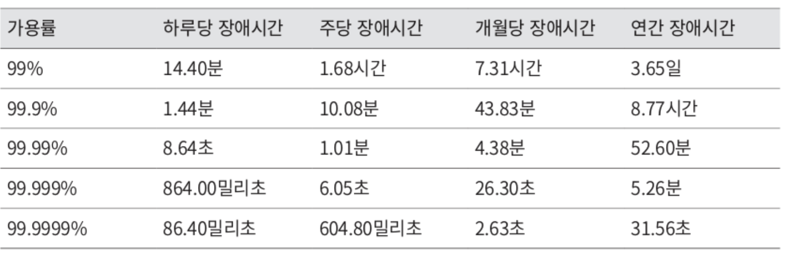

`개략적인 규모 추정`(back of the envelop estimation)은 **보편적으로 통용되는 성능 수치상에서 사고 실험**(thought experiments)**을 행하여 추정치를 계산하는 행위**로, 어떤 설계가 요구사항에 부합할 것인지 보기 위한 것이다.

개략적 규모 추정을 효과적으로 해 내려면 규모 확장성을 표현하는 데 필요한 기본기에 능숙해야 한다.
- 특히 2의 제곱수, 응답지연(latence) 값, 가용성에 관계도니 수치 등.

# 2의 제곱수

분산 시스템에서 다루는 데이터 양은 엄청나게 커질 수 있으나 그 계산법은 기본을 크게 벗어나지 않는다.
- 제대로 된 계산 결과를 얻으려면 데이터 볼륨의 단위를 2의 제곱수로 표현하면 어떻게 되는지 알아야 한다.
- 최소 단위는 `1byte`(8bit)
- ASCII 문자 하나가 차지하는 메모리 크기는 `1byte`

흔히 사용되는 데이터 볼륨 단위

<figure><figcaption></figcaption></figure>

# 응답지연 값

구글의 제프 딘은 2010년 통상적인 컴퓨터에서 구현된 연산들의 응답지연 값을 공개했었다.
- [Google Pro Tip: Use Back-Of-The-Envelope-Calculations To Choose The Best Design](http://highscalability.com/blog/2011/1/26/google-pro-tip-use-back-of-the-envelope-calculations-to-choo.html)
- 더 빠른 컴퓨터가 등장하면서 더이상 유효하지 않은 정보도 있지만, 아직도 이 수치들은 컴퓨터 연산들의 처리 속도가 어느 정도인지 짐작할 수 있게 도와준다.

<figure><figcaption></figcaption></figure>

위 수들을 알기 쉽게 시각화하기 위해, 한 구글 엔지니어가 개발한 도구가 있다.
- 이 수치에는 최근 기술 동향이 반영되어 있는 수치이다.
- [Latency Numbers Every Programmer Should Know](https://colin-scott.github.io/personal_website/research/interactive_latency.html)

<figure><figcaption></figcaption></figure>

위 수치들을 분석하면 아래와 같은 결론이 나온다.
- 메모리는 빠르지만 디스크는 아직도 느리다.
- 디스크 탐색(seek)은 가능한 피하자.
- 단순한 압축 알고리즘은 빠르다.
- 데이터를 인터넷으로 전송하기 전에 가능하면 압축하자.
- 데이터 센터는 보통 여러 지역에 분산되어 있고, 센터들 간에 데이터를 주고 받는 데는 시간이 걸린다.

# 가용성에 관계된 수치들

`고가용성`은 **시스템이 오랜 시간 동안 지속적으로 중단 없이 운영될 수 있는 능력**을 지칭하는 용어다.
- 고가용성을 표현하는 값은 퍼센트로 표현하는데, 100%는 시스템이 단 한 번도 중단된 적이 없음을 의미한다.
- 대부분의 서비스(아마존, 구글, MS)는 99%에서 100% 사이의 값을 갖는다.
- SLA(Service Level Agreement)는 서비스 사업자가 보편적으로 사용하는 용어로, 서비스 사업자와 고객 사이에 맺어진 합의를 의미한다.
  - 이 합의에는 서비스 사업자가 제공하는 서비스 가용시간(uptime)이 공식적으로 기술되어 있다.
- 가용시간은 관습적으로 숫자 9를 사용해 표시하고, 9가 많을수록 좋다.

<figure><figcaption></figcaption></figure>

# 예제

**트위터 QPS와 저장소 요구량 추정**

가정
- 월간 능동 사용자(monthly active user)는 **3억**명
- **50%** 사용자가 트위터를 매일 사용
- 평균적으로 각 사용자는 **매일 2건의 트윗**을 올린다.
- 미디어를 포함하는 트윗은 **10%** 정도
- 데이터는 5년간 보관

추정
- QPS(Query Per Second) 추정치
  - 일간 능동 사용자(Daily Active User, DAU) = **3억명** X **50% 사용자** = 1.5억
  - QPS = **1.5억** X **2트윗/24시간/3600초** = 약 3500
  - 최대 QPS(Peek QPS) = 2 X QPS = 약 7000

미디어 저장을 윟나 저장소 요구량
- 평균 트윗 크기
  - tweet_id: 64 byte
  - text: 140 byte
  - media: 1 MB
- 미디어 저장소 요구량: **1.5억** X **2건** X **10%의 미디어 포함** X **1 MB** = 30TB/day
- 5년간 미디어를 보관하기 위한 저장소 요구량: **30TB** X **365 X 5** = 약 55PB

# 팁

개략적인 규모 추정 풀이에서는 올바른 절차(문제 해결 능력)를 밟느냐가 결과를 내는 것보다 중요하다.
- **근사치를 활용한 계산**(rounding and approximation)
  - 풀이 단계에서 복잡한 계산을 하는 것은 어려운 일이다. 적절한 근사치를 활용하여 시간을 절약하자.
- **가정**(assumpion)들은 적어 두자.
  - 나중에 살펴볼 수 있다.
- 단위(unit)를 붙이자.
  - 나중에 스스로 헷갈리게 된다. 단위를 붙이는 습관을 들여 모호함을 방지하자.
- QPS, 최대 QPS, 저장소 요구량, 캐시 요구량, 서버 수 등을 추정이 문제가 많이 출제될 것이다.